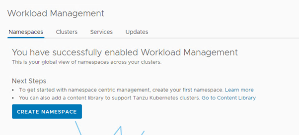
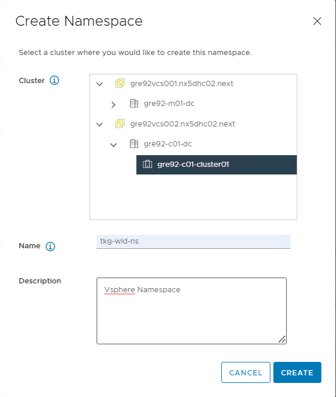
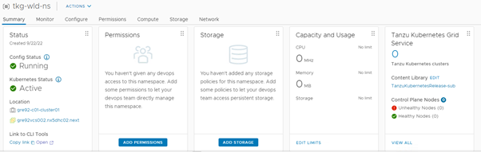
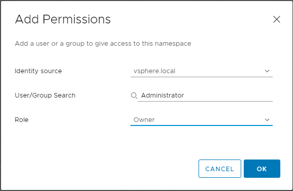
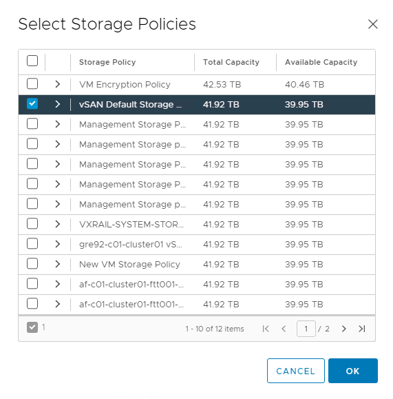
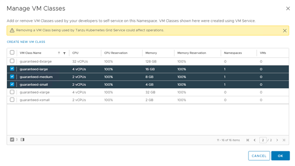
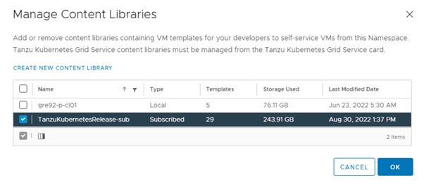

# Create Namespaces

## Table of Contents

- [Create Namespaces](#create-namespaces)
  - [Table of Contents](#table-of-contents)
  - [Changelog](#changelog)
  - [Introduction](#introduction)
    - [Purpose](#purpose)
    - [Audience](#audience)
  - [Scope](#scope)
    - [Create Vsphere namespaces](#create-vsphere-namespaces)
    - [Create TKG workload cluster namespace](#create-tkg-workload-cluster-namespace)

## Changelog
  
 |    Date    |  TOS   | Issue   | Author | Description |
 |------------|---------|-----------|--------|--------|
 | 02.01.2023 |  VCS 1.7   |   CESDHC-4569     | Rohit Singh | Initial draft creation |

## Introduction

This document provides the steps that you need to follow to create namespaces in vsphere and also in TKG workload cluster. In Kubernetes, namespaces provide a mechanism for isolating groups of resources within a single cluster.
Names of resources need to be unique within a namespace, but not across namespaces. Namespace-based scoping is applicable only for namespaced objects (e.g. Deployments, Services, etc) and not for cluster-wide objects (e.g. StorageClass, Nodes, PersistentVolumes, etc)

### Purpose

Create Vsphere namespaces and TKG workload cluster namespaces.

### Audience

- VCS Deployment Engineers
- Devsecops Team.

## Scope

1. Create Vsphere namespaces
2. Create TKG workload cluster namespaces

### Create Vsphere namespaces

To allow creation of TKGS clusters or run vSphere Pods, vSphere Namespace must be configured first. Below are the steps for creation of new Vsphere Namespaces

- from vSphere Client Menu, choose Workload Management. Go to the Namespaces Tab and click on NEW NAMESPACE.

   

- Provide namespace name and click CREATE

   



- Now we need to add permissions. To do the same click on Add Permission, select identity source as vsphere.local and in user/group search, type *Administrator* and select the role as owner.

   

Similarly add one more permissions for the group *rsce-< location code >-tkg-l-tanzuadmins*, select its identity source  which will be the domain name and then role as owner.

- Now we need to add storage. Click on add Storage and select the desired VSAN storage policy created.

   

- Select the desired VM Class as shown below:

   

- Select the desired content library as well.

   

- After all the above configurations are done, below will be the vsphere namespace settings:

   

### Create TKG workload cluster namespace

TKG workload cluster namespaces provides a mechanism for isolating groups of resources within a single cluster. Namespace-based scoping is applicable only for namespaced objects (e.g. Deployments, Services, etc). To create TKG workload cluster namespace, follow below steps:

- Login to jumphost using domain credentials.
- Now logging on TKG workload cluster cluster using command below command

```shell
kubectl vsphere login --server=<supervisor_cluster_IP_address> --vsphere-username <VsphereUsername> tanzu_Kubernetes_cluster_name <TanzuKubernetesClusterName> tanzu_kubernetes_cluster_namespace <TanzuKubernetesClusterNamespace>
```

Example is shown below:

```shell
kubectl vsphere login --server=172.17.148.1 --vsphere-username Administrator@vsphere.local --insecure-skip-tls-verify --tanzu-kubernetes-cluster-name tkgs-cluster-01 --tanzu-kubernetes-cluster-namespace tkg-wld-ns
```

- Now create namespaces using command `kubectl create namespace test-namespace`. This will create a namespace with name `test-namespace` which can be used for deploy wordpress application inside the tkg workload cluster.
- To view the namespaces created under the TKG workload cluster use below command:

```shell
kubectl get namespace
```

This concludes for the creation of namespace in both `Vsphere` and `TKG workload cluster`
