# VCS AD Security Enhancement

- [VCS AD Security Enhancement](#vcs-ad-security-enhancement)
  - [Changelog](#changelog)
  - [Contents](#contents)
  - [Prerequisites](#prerequisites)
  - [C1 Unsecured Configuration of Netlogon Protocol](#c1-unsecured-configuration-of-netlogon-protocol)
    - [C1 Description](#c1-description)
    - [C1 Verification](#c1-verification)
    - [C1 Post-deployment action](#c1-post-deployment-action)
    - [C1 Rollback](#c1-rollback)
  - [C6 ADCS Dangerous Misconfigurations](#c6-adcs-dangerous-misconfigurations)
    - [C6 Description](#c6-description)
    - [C6 Verification](#c6-verification)
      - [Missing Certificates Handling](#missing-certificates-handling)
      - [vCenter AD identity provider](#vcenter-ad-identity-provider)
    - [C6 Post-deployment action - MANUAL](#c6-post-deployment-action---manual)
    - [C6 Rollback](#c6-rollback)
  - [C8 Application of Weak Password Policies on Users](#c8-application-of-weak-password-policies-on-users)
    - [C8 Description](#c8-description)
    - [C8 Verification](#c8-verification)
    - [C8 Post-deployment action](#c8-post-deployment-action)
    - [C8 Rollback](#c8-rollback)
  - [C10 Dangerous Kerberos Delegation](#c10-dangerous-kerberos-delegation)
    - [C10 Description](#c10-description)
    - [C10 Verification](#c10-verification)
    - [C10 Post-deployment action](#c10-post-deployment-action)
    - [C10 Rollback](#c10-rollback)
  - [C12 Native Administrative Group Members](#c12-native-administrative-group-members)
    - [C12 Description](#c12-description)
    - [C12 Manual implementation (Optional)](#c12-manual-implementation-optional)
    - [C12 Verification](#c12-verification)
    - [C12 Post-deployment action](#c12-post-deployment-action)
    - [C12 Rollback](#c12-rollback)
  - [H15 Protected Users Group not Used](#h15-protected-users-group-not-used)
    - [H15 Description](#h15-description)
    - [H15 Verification](#h15-verification)
    - [H15 Post-deployment action](#h15-post-deployment-action)
    - [H15 Rollback](#h15-rollback)
  - [H16 Logon Restrictions for Privileged Users](#h16-logon-restrictions-for-privileged-users)
    - [H16 Description](#h16-description)
    - [H16 Verification](#h16-verification)
    - [H16 Post-deployment action](#h16-post-deployment-action)
    - [H16 Rollback](#h16-rollback)
  - [H17 SSL Medium Strength Cipher Suites Supported](#h17-ssl-medium-strength-cipher-suites-supported)
    - [H17 Description](#h17-description)
    - [H17 Verification](#h17-verification)
    - [H17 Post-deployment action - MANUAL](#h17-post-deployment-action---manual)
    - [H17 Rollback](#h17-rollback)
  - [O1 Accounts with adminCount attribute](#o1-accounts-with-admincount-attribute)
    - [O1 Description](#o1-description)
    - [O1 Verification](#o1-verification)
  - [O2 Accounts with never-expiring passwords](#o2-accounts-with-never-expiring-passwords)
    - [O2 Description](#o2-description)
    - [O2 Verification](#o2-verification)
  - [O3 Built-in administrator accounts have been used in the past 30 days](#o3-built-in-administrator-accounts-have-been-used-in-the-past-30-days)
    - [O3 Description](#o3-description)
    - [O3 Verification](#o3-verification)
  - [O4 Dangerous dSHeuristics settings](#o4-dangerous-dsheuristics-settings)
    - [O4 Description](#o4-description)
    - [O4 Verification](#o4-verification)
  - [O5 DC/RODC supported encryption algorithms](#o5-dcrodc-supported-encryption-algorithms)
    - [O5 Description](#o5-description)
    - [O5 Verification](#o5-verification)
  - [O6 Incorrect object owners](#o6-incorrect-object-owners)
    - [O6 Description](#o6-description)
    - [O6 Verification](#o6-verification)
  - [O7 Krbtgt account password unchanged for more than a year](#o7-krbtgt-account-password-unchanged-for-more-than-a-year)
    - [O7 Description](#o7-description)
  - [O8 Privileged accounts outside of the Protected Users group](#o8-privileged-accounts-outside-of-the-protected-users-group)
    - [O8 Description](#o8-description)
  - [O9 Privileged accounts with never-expiring passwords](#o9-privileged-accounts-with-never-expiring-passwords)
    - [O9 Description](#o9-description)
  - [O10 Privileged group members not in an authentication silo](#o10-privileged-group-members-not-in-an-authentication-silo)
    - [O10 Description](#o10-description)
    - [O10 Verification](#o10-verification)
  - [O11 Servers with passwords unchanged for more than 45 days](#o11-servers-with-passwords-unchanged-for-more-than-45-days)
    - [O11 Description](#o11-description)
    - [O11 Verification](#o11-verification)
  - [O12 Service accounts supported encryption algorithms](#o12-service-accounts-supported-encryption-algorithms)
    - [O12 Description](#o12-description)
    - [O12 Verification](#o12-verification)
  - [O13 Unrestricted domain join](#o13-unrestricted-domain-join)
    - [O13 Description](#o13-description)
    - [O13 Verification](#o13-verification)
  - [O14 Use of the "Pre-Windows 2000 Compatible Access" group](#o14-use-of-the-pre-windows-2000-compatible-access-group)
    - [O14 Description](#o14-description)
    - [O14 Verification](#o14-verification)
  - [O15 Dangerous permissions on the DnsAdmins group](#o15-dangerous-permissions-on-the-dnsadmins-group)
    - [O15 Description](#o15-description)
    - [O15 Verification](#o15-verification)
  - [O16 Disabled or expired accounts in privileged groups](#o16-disabled-or-expired-accounts-in-privileged-groups)
    - [O16 Description](#o16-description)
    - [O16 Verification](#o16-verification)

## Changelog

| Version | Date       | Description                                                                           | Author(s)           |
| ------- | ---------- | ------------------------------------------------------------------------------------- | ------------------- |
| 0.1     | 2024-03-06 | Initial draft creation                                                                | Sebastian Pucek     |
| 0.2     | 2024-06-10 | Changes VCS-12881                                                                     | Krzysztof Olszewski |
| 0.3     | 2024-06-13 | VCS-13092: O1 Accounts with adminCount attribute                                      | Ciprian Sferle      |
| 0.4     | 2024-06-18 | VCS-12720: O10 Privileged group members not in an authentication silo                 | Manoj Kulkarni      |
| 0.5     | 2024-06-19 | VCS-12721: O6 Incorrect object owners                                                 | Manoj Kulkarni      |
| 0.6     | 2024-06-19 | VCS-12719: O4 Dangerous dSHeuristics settings                                         | Ciprian Sferle      |
| 0.7     | 2024-06-21 | VCS-13089: O11 Servers with passwords unchanged for more than 45 days                 | Ciprian Sferle      |
| 0.8     | 2024-08-02 | VCS-13088: O3 Built-in administrator accounts have been used in the past 30 days      | Manoj Kulkarni      |
| 0.9     | 2024-08-09 | VCS-13331: Align on C12 domain admin reduction approach (documentation consolidation) | Ciprian Sferle      |
| 1.0     | 2024-09-05 | VCS-13830: O11 Servers with passwords unchanged for more than 45 days                 | Ciprian Sferle      |
| 1.1     | 2024-09-06 | VCS-13832: O5 Issue 8 DC/RODC supported encryption algorithms                         | Ciprian Sferle      |
| 1.2     | 2024-09-13 | VCS-13831: O13 Unrestricted domain join                                               | Ciprian Sferle      |
| 1.3     | 2024-09-25 | VCS-13257: Update existing documentation: O1, O2, O4, O6, O7, O8, O9, O10, O12, O14   | Ciprian Sferle      |
| 1.4     | 2024-12-16 | VCS-13256: Update existing documentation: O3, O4, O8, O10, O13, O15, O16              | Ciprian Sferle      |
| 1.5     | 2025-02-27 | VCS-15305: Update prerequisites in existing documentation                             | Ciprian Sferle      |
| 1.6     | 2025-04-10 | VCS-15645: Added Item to DHC version reference                                        | Ciprian Sferle      |
| 1.7     | 2025-06-03 | VCS-16194: SSL Medium Strength Cipher Suites Supported (SWEET32)                      | Ciprian Sferle      |
| 1.8     | 2026-03-11 | VCS-18283: Updated prerequisites                                                      | Stanislaw Kilanowski|
| 1.9     | 2026-03-12 | VCS-18284: Updated prerequisites and added C6 verification steps                      | Stanislaw Kilanowski|
| 2.0     | 2026-03-30 | VCS-18291: Updated C6 verification steps and removed manual steps                     | Mihai Radan         |
| 2.1     | 2026-04-30 | VCS-18093: Updated O16 implementation steps                                           | Stanislaw Kilanowski|

## Contents

This work instruction presents all fixes that can be deployed. The description of each fix provides information about possible ways to verify deployment and post-deployment actions if required. Each fix also has a rollback action described in case of necessity. Below is a summary of impacts without fixes, the fix implementation type (fully automated, semi-automated, as there are post-implementation manual steps needed, or manual), and the applicable DHC version.

| Item | Risk   | Complexity | Fix implementation                  | Applies From |
| ---- | ------ | ---------- | ----------------------------------- | ------------ |
| C1   | Low    | Low        | Fully automated                     | DHC-1.8.3    |
| C6   | High   | Medium     | Fully automated                     | DHC-1.8.3    |
| C8   | Low    | Medium     | Fully automated                     | DHC-1.8.3    |
| C10  | Low    | Medium     | Fully automated                     | DHC-1.8.3    |
| C12  | High   | Medium     | Fully automated                     | DHC-1.8.3    |
| H15  | Low    | Low        | Fully automated                     | DHC-1.8.3    |
| H16  | Low    | Low        | Fully automated                     | DHC-1.8.3    |
| H17  | Low    | Low        | **Post implementation manual step** | DHC-2.2      |
| O1   | High   | Low        | Fully automated                     | DHC-2.0      |
| O2   | Medium | Low        | Fully automated                     | DHC-2.0      |
| O3   | High   | Low        | Fully automated                     | DHC-2.0      |
| O4   | Low    | Medium     | Fully automated                     | DHC-2.0      |
| O5   | Low    | Low        | Fully automated                     | DHC-2.0      |
| O6   | Medium | Low        | Fully automated                     | DHC-2.0      |
| O7   | Medium | Low        | Fully automated                     | DHC-2.0      |
| O8   | Medium | Low        | Fully automated                     | DHC-2.0      |
| O9   | High   | Low        | Fully automated                     | DHC-2.0      |
| O10  | Low    | Low        | Fully automated                     | DHC-2.0      |
| O11  | Medium | Medium     | Fully automated                     | DHC-2.0      |
| O12  | Medium | Low        | Fully automated                     | DHC-2.0      |
| O13  | Low    | Low        | Fully automated                     | DHC-2.0      |
| O14  | Medium | Low        | Fully automated                     | DHC-2.0      |
| O15  | Medium | Low        | Fully automated                     | DHC-2.0      |
| O16  | Low    | Low        | Fully automated                     | DHC-2.1      |

## Prerequisites

- Create an **_adm** user account

  Before execution, new dedicated domain administrator user accounts have to be created with **_adm** suffix in the account name. The best practice is to have no more than five domain administrator accounts. Do not add it to any group, it will be added automatically while running the fixes. Example:  

  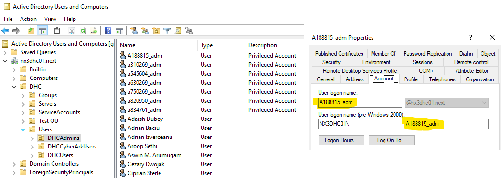

> [!NOTE]
> Upon playbook execution, the user will be prompted for two sets of credentials - first one is the default account used for general activities and the second one is the prerequisite domain administrator account.

- Password rotation for service accounts

> [!WARNING]
> Before implementation, perform password rotation for service accounts if not done in the last 30 days. Not required for new environment deployment.
> Not performing this action will cause LDAP connections used for Active Directory integration to fail, done through specific service accounts.

- Enable vCenter shell

  It is required that vCenter is in BASH Shell mode for the automation to work. Please follow the [vendor's KB article](https://knowledge.broadcom.com/external/article/319670/toggling-the-vcenter-server-appliance-de.html) for the required steps. Valid mode is enabled when you see the default Linux prompt, e.g. `root@<location code>vcs001 [ ~ ]#` - upon connecting via SSH.

## C1 Unsecured Configuration of Netlogon Protocol

### C1 Description

The registry key that forces secure RPC calls for the Netlogon protocol should be applied to all DCs in the forest.
More details can be found at [Unsecured Configuration of Netlogon Protocol](https://www.tenable.com/indicators/ioe/ad/C-NETLOGON-SECURITY)

To run fix C1, please execute below command from Ansible.

```Ansible
ansible-playbook remediateAdSecurityEnhancement24.yml --tags c1
```

### C1 Verification

1. Log in to the adc001 server
2. Open Server Manager
3. Click Tools -> Group Policy Management

    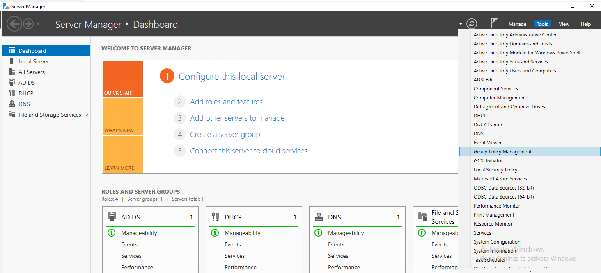
4. In the new window in Domains -> *domainName* -> Domain Controllers you should find similar policy *\<customerCode\>***-AD-SecurityEnhancements24-v0001**

    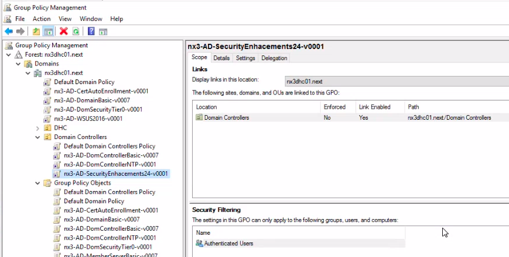
5. In the section **The following sites, domains and OUs are linked to this GPO**, you should find **Domain Controller**, which **Enforced** and **Link Enabled** are set to **No** and **Yes** - like on the screen

    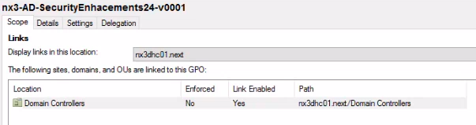
6. Standard replication changes the time between DCs takes around 15 min. Please wait or execute from the command line **gpupdate /force**
7. On adc001 server open Registry Editor (regedit.exe)
8. Go to the location: HKEY_LOCAL_MACHINE -> System -> CurrentControlSet -> Services -> Netlogon -> Parameters
9. In the right window find **FullSecureChannelProtection** and ensure the value assigned to them equal **1**

    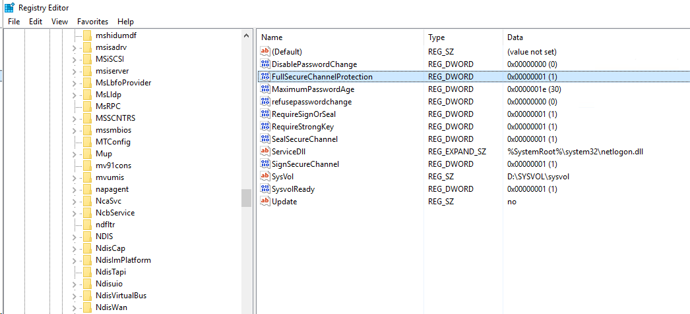

### C1 Post-deployment action

Deployment of this fix does not require any manual steps after deployment.

### C1 Rollback

1. Log in to the adc001 server
2. Open Server Manager
3. Click Tools -> Group Policy Management

   
4. In the new window in Domains -> *domainName* -> Group Policy Objects you should find similar policy *\<customerCode\>***-AD-SecurityEnhancements24-v0001**
5. Click rmb and **Delete** it

   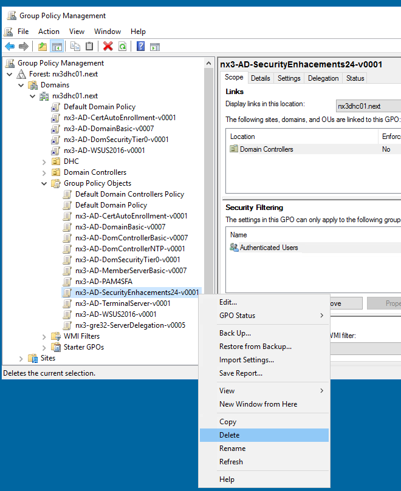
6. Open Registry Editor (regedit.exe)
7. Go to the location: HKEY_LOCAL_MACHINE -> System -> CurrentControlSet -> Services -> Netlogon -> Parameters
8. In the right window, select **FullSecureChannelProtection**
9. Click rmb and **Delete** it

    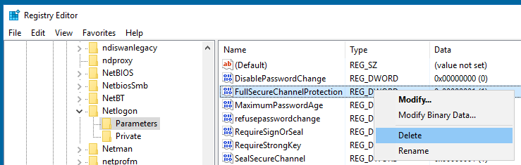
10. **Repeat** steps 6-9 for **adc002** server and for additional Domain Controllers if there are any.

## C6 ADCS Dangerous Misconfigurations

### C6 Description

Restrict access to the WinRM SSL certificate template by limiting the number of computers.  
More details can be found at [ADCS Dangerous Misconfigurations](https://www.tenable.com/indicators/ioe/ad/C-PKI-DANG-ACCESS)

<span style="color:red">**IMPORTANT:**</span>
>All Windows-based servers from the VCS management pool have to be included in the limitation except Domain Controllers. By default, there are TSS001, TSS002, ICA001, and WUS001. If there is another Windows server in the management like MID server, backup server, etc., before playbook execution, it **HAS TO** be added to the 'hostList' section in **manage/roles/dhc-remediateAdSecurityEnhancement24/defaults/main.yaml** like in the screenshot:

  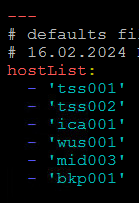  
>Ensure that the Ansible hosts inventory file is up-to-date and contains all relevant Windows servers:
  
  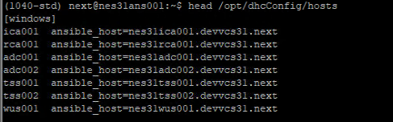  

>Ensure that the Git repository including collections (dhc-collections) are on the same branch and fully up-to-date.

To run fix C6, please execute below command from Ansible.

```Ansible
ansible-playbook remediateAdSecurityEnhancement24.yml --tags c6
```

### C6 Verification

1. Log in to the ica001 server
2. Open Server Manager
3. Click Tools -> Certification Authority

    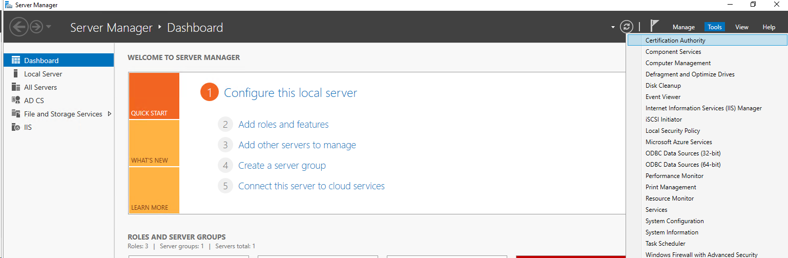
4. Click right mouse button (rmb), Certificate Templates, and select **Manage** from the menu

    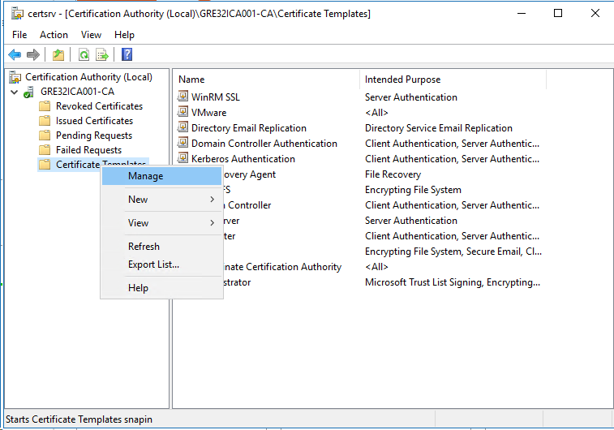
5. In the new window "**Certificate Templates Console**" find **WinRM SSL**

    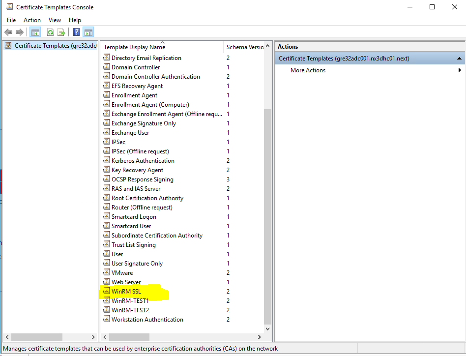
6. Click rmb, **WinRM SSL** and select **Properties** from the menu

    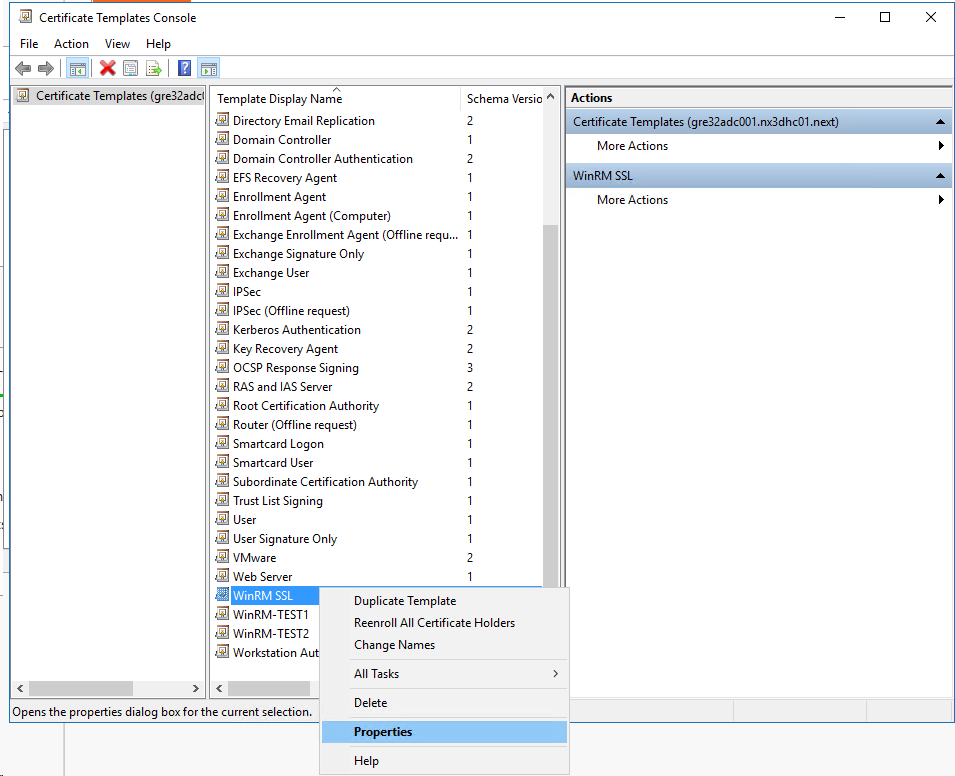
7. On the tab **Security** in the section **Group or user names** you should see the group which contains **trustedcomputers** in their name

    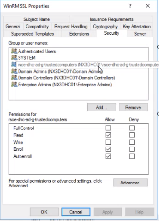
8. Check the permissions of this role. Correct the permissions presented on the above screen.
9. On the tab **Security** in the section **Group or user names** you **shouldn't** see the group **Domain Computers**
10. Select **Web Server** template, click rmb and select **Properties** from the menu

    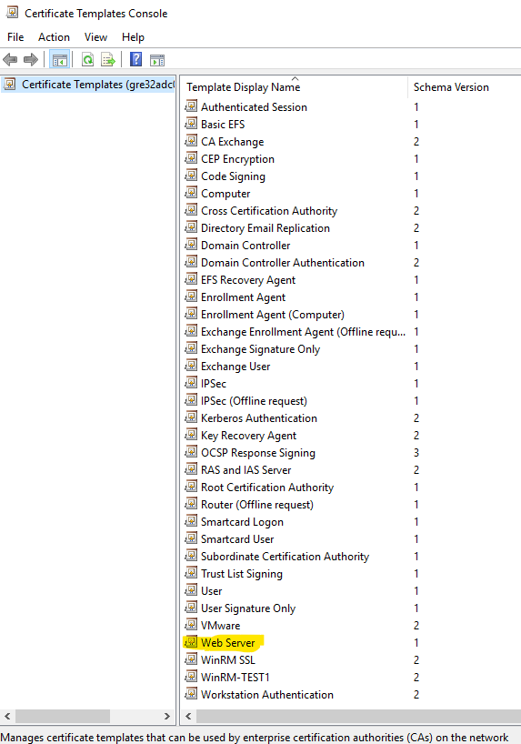
11. On the tab **Security** in the section **Group or user names** you **should** see the service account **svc-**<*locationCode*>**-ans01** with **Read,Enroll** as **Allow** rights.

    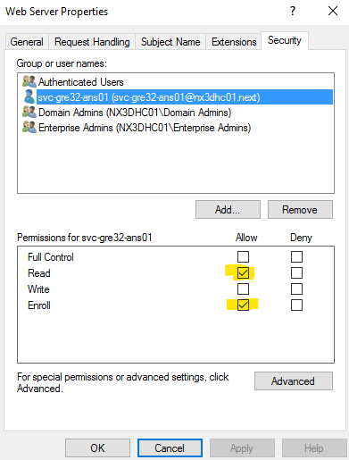
12. Verify **Issued Certificates** in **Certification Authority**

    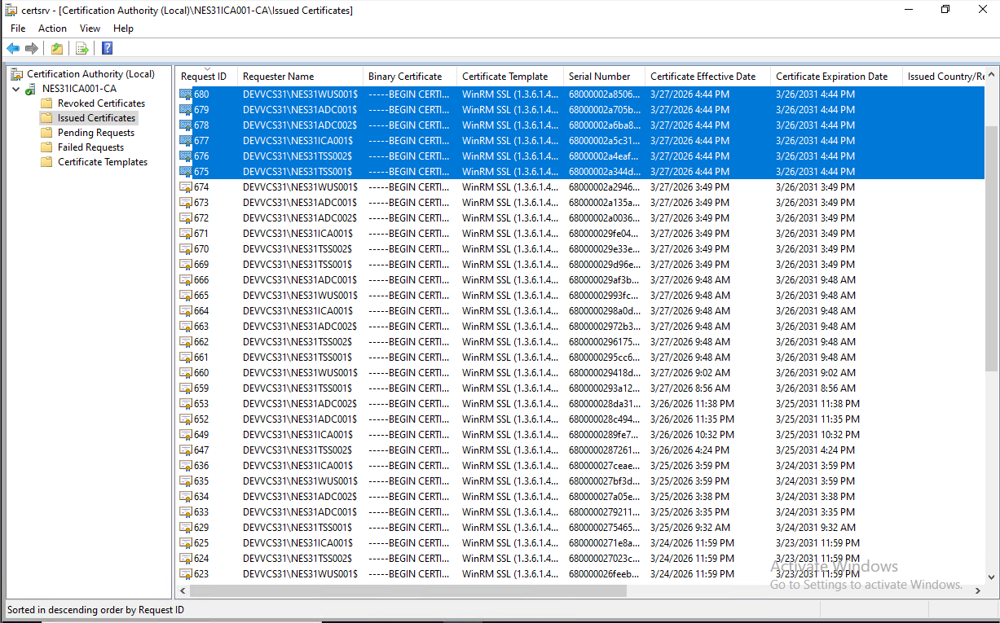

- Order the entries by **Request ID** in descending order
- Verify that the newest certificates are present
  - The number of new issued certificates should match the number of computers assigned to group trustedcomputers and Domain Controllers

#### Missing Certificates Handling

- If a certificate is missing from the list, re-trigger the automation with tag **winRM**:

  ```Ansible
  ansible-playbook remediateAdSecurityEnhancement24.yml --tags winRM
  ```

- Notes on Auto-Enrollment Delays
  - In some environments, certificate auto-enrollment may take longer due to AD replication latency.
  - The automation includes wait logic (up to 30 minutes) for certificates to be issued.

- If certificates are still not issued within this timeframe:
  - Connect to the affected host and run the following commands from an elevated PowerShell session:
  
    ```shell
    # Purge SYSTEM Kerberos tickets to refresh group membership SID
    klist -li 0x3e7 purge
    # Force Group Policy update to pick up new template settings
    gpupdate /force /target:computer
    # Trigger immediate certificate enrollment pulse and clear chain cache
    certutil -pulse
    certutil -setreg "chain\ChainCacheResyncFiletime" "@now"
    ```

  - Reboot the host
  - Once the certificate is issued and visible, re-run the automation with tag **winRM** in order to update the winRM listener:

    ```Ansible
    ansible-playbook remediateAdSecurityEnhancement24.yml --tags winRM
    ```

  - If the affected host is a Domain Controller there is a need to reconfigure also the vCenter AD identity provider. In order to do that re-run the automation with tag **vCenterSSO**

    ```Ansible
    ansible-playbook remediateAdSecurityEnhancement24.yml --tags vCenterSSO
    ```

#### vCenter AD identity provider

Verify if login with AD credentials to vCenter is possible. If not, follow the below steps:

- Login to vCenter with `administrator@vsphere.local` user account.
- Go to Menu -> `Administration`.
- Go to `Single Sign On` -> `Configuration`.
- In `Active Directory Domain` check whether the VCS domain can be found.
- In `Identity Sources` click on the VCS domain if it exists and then `EDIT`. Otherwise, click `ADD`.
- Make sure that the configuration is filled in as shown in the screenshot below.
- Provide the `svc-<locationCode>-vcs01` AD service account credentials in the `Password` field.
- In the `Certificates` field, provide crt files for `adc001` and `adc002`. Generate them using the steps below if needed.
  - Open SSH session to vCenter.
  - Run the following commands - make sure to replace `<locationCode>` and `<domain>` with proper data:

    ```shell
    openssl s_client -connect <locationCode>adc001.<domain>:636 -showcerts
    openssl s_client -connect <locationCode>adc002.<domain>:636 -showcerts
    ```

  - Copy the first certificate from the output (starting from first `BEGIN CERTIFICATE` line in output, ending at first `END CERTIFICATE` line found).
  - Save the copied output as `<locationCode>adc001.crt` and `<locationCode>adc002.crt` respectively.
- Once certificates are added click `SAVE` to update the Identity Source.
- Verify if AD login to vCenter is possible now.

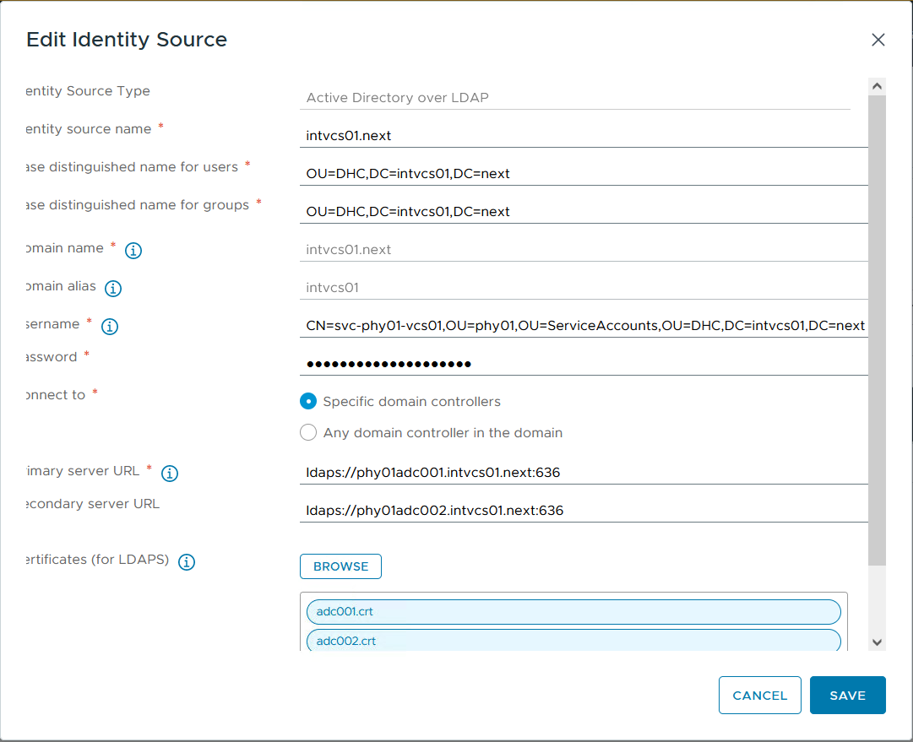

### C6 Post-deployment action - MANUAL

Deployment of this fix does not require any manual steps after deployment.

### C6 Rollback

1. Log in to the ica001 server
2. Open Server Manager
3. Click Tools -> Certification Authority

    
4. Click right mouse button (rmb), Certificate Templates, and select **Manage** from the menu
5. In the new window "**Certificate Templates Console**" find **WinRM SSL**

    
6. Click rmb, **WinRM SSL** and select **Properties** from the menu

    
7. On the tab **Security** in the section **Group or user names** select group which contains **trustedcomputers** in their name and **Remove** it

   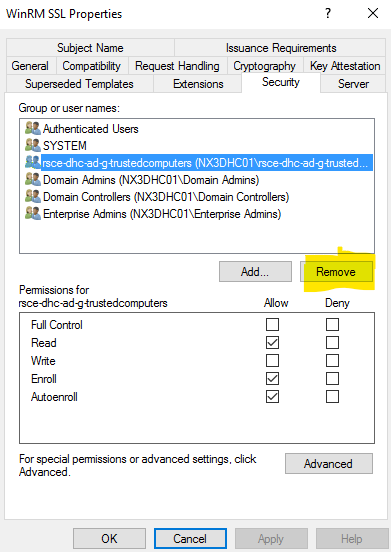
8. Click **Add...**

    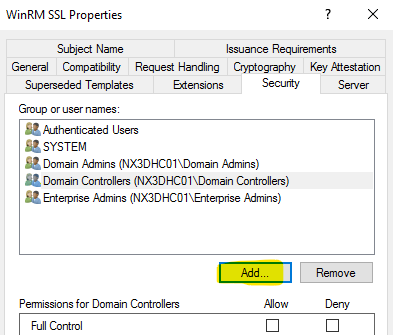
9. Provide group name **Domain Computers** and click **OK**

    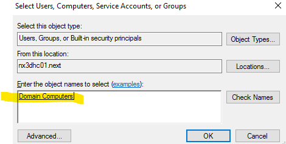
10. Select **Domain Computers** and mark checkbox for **Read, Enroll, Autoenroll** and click **OK**

    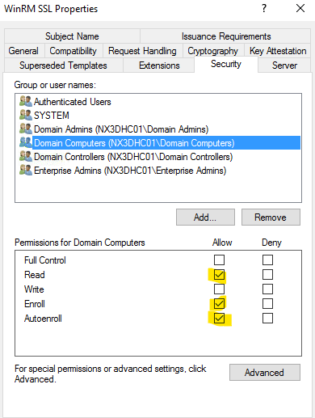
11. Select **Web Server** template, click rmb and select **Properties** from the menu

    
12. On the tab **Security** in the section **Group or user names** select service account which contains **svc-**<*locationCode*>**-ans01** in their name and **Remove** it

    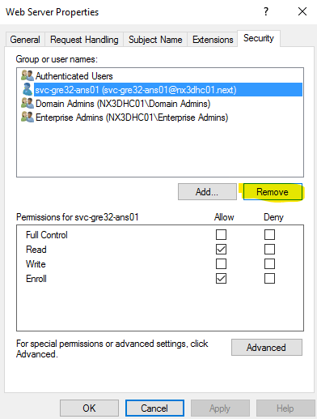
13. Log in to the adc001 server
14. Open Server Manager
15. Click Tools -> Active Directory Users and Computers

    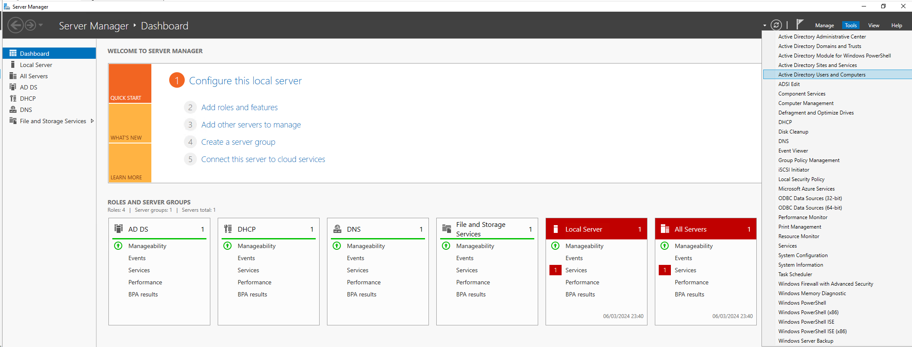
16. Go to OU **ResourceGroups**
17. Select **rsce-dhc-ad-g-trustedcomputers**, click rmb and select **Delete** from the menu

    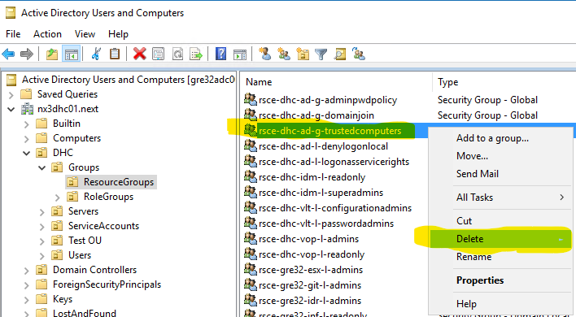
18. Confirm by clicking **Yes**

## C8 Application of Weak Password Policies on Users

### C8 Description

Create and assign a PSO to each security group found in OU=RoleGroups.  
More details can be found at [Application of Weak Password Policies on Users](https://www.tenable.com/indicators/ioe/ad/C-PASSWORD-POLICY)

<span style="color:red">**NOTE:**</span>
> Script uses settings retrieved from security group *rsce-dhc-ad-g-adminpwdpolicy* and applies them for newly created security groups found in OU=RoleGroups,OU=Groups,OU=DHC,DC=*domainName,DC*=*next*

To run fix C8, please execute below command from Ansible

```Ansible
ansible-playbook remediateAdSecurityEnhancement24.yml --tags c8
```

### C8 Verification

1. Log in to the adc001 server
2. Open Server Manager
3. Click Tools -> Active Directory Administrative Center

    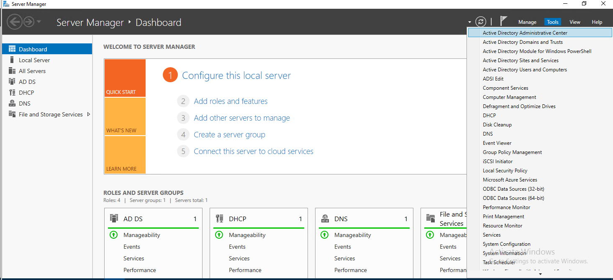
4. In the new window, click on your domain in the menu on the left side. Find **System** in the window on the right side and double click

    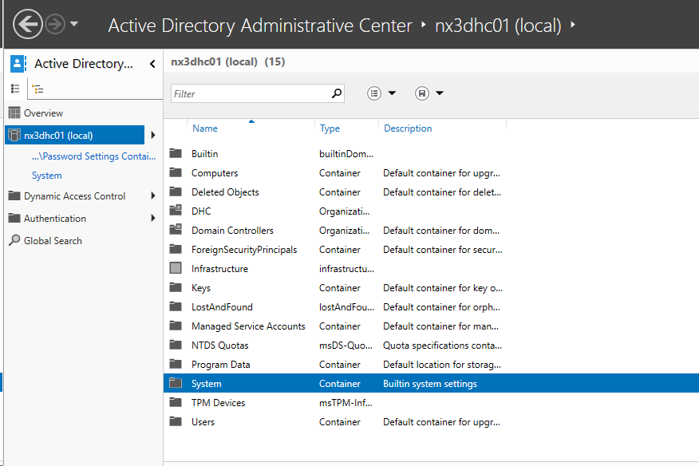

5. Find **Password Settings Container** and double click on them

   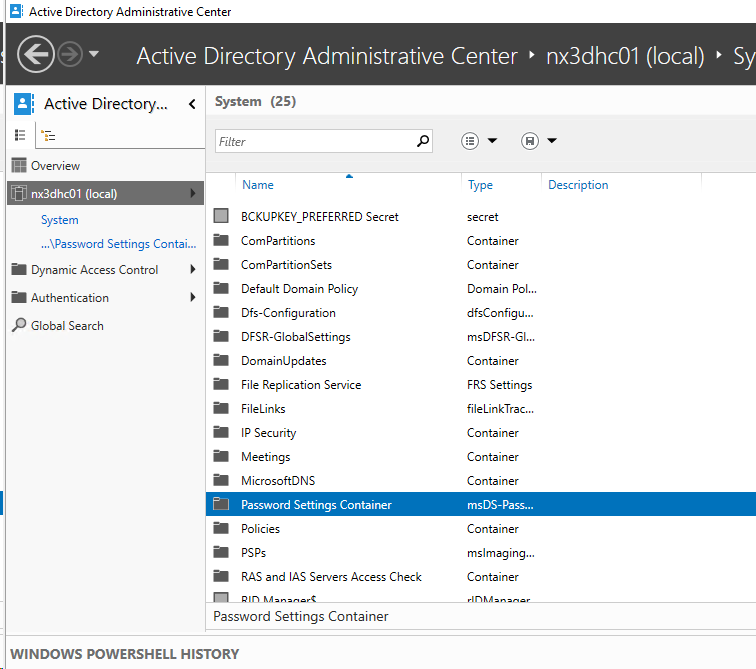

6. You should see a list of password security for each group, like below

   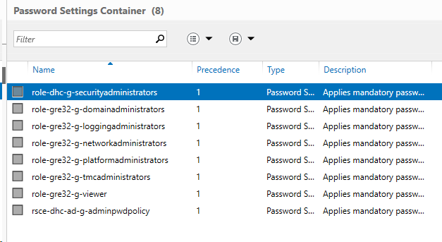

7. If there is more than one item, everything is correct

### C8 Post-deployment action

Deployment of this fix does not require any manual steps after deployment.

### C8 Rollback

1. Log in to the adc001 server
2. Open Server Manager
3. Click Tools -> Active Directory Administrative Center

    
4. In the new window, click on your domain in the  menu on the left side. Find **System** in the window on the right side and double click

    

5. Find **Password Settings Container** and double click on them

   

6. Write down the names of all PSOs except **rsce-dhc-ad-g-adminpolicy**
7. Select PSO, click rmb, and select **Properties** from the menu

   
8. In **Password Settings** clear checkbox **Protect from accidental deletion** and click **OK**

   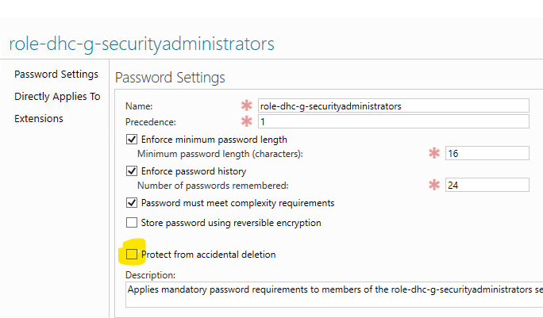
9. Click rmb and select **Delete**
10. Confirm deletion by clicking **Yes**

    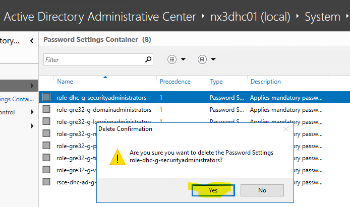

11. Follow steps 7 through 10 for the rest of the PSOs except **rsce-dhc-ad-g-adminpolicy**
12. Finally only **rsce-dhc-ad-g-adminpolicy** should be left

    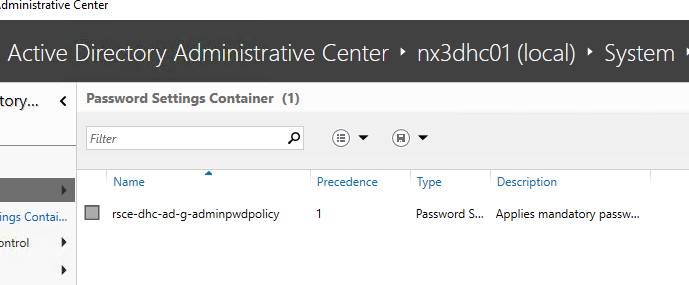

13. Open Server Manager
14. Click Tools -> Active Directory Users and Computers

    
15. Go to OU **ResourceGroups**
16. Select **rsce-dhc-ad-g-adminpolicy**, click rmb and select **Properties** from the menu

    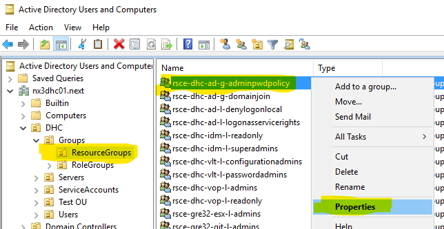

17. Go to the **Members** tab, click **Add**
18. Add all security groups written down in **step 6** and click **OK**

    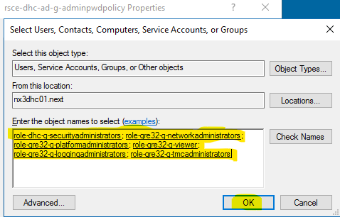
19. Click **OK**

    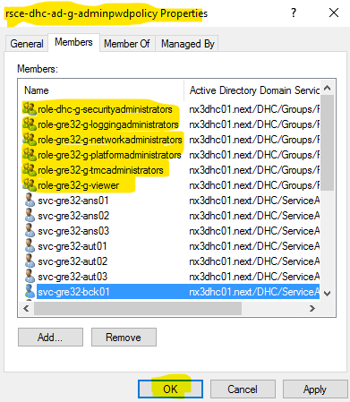

## C10 Dangerous Kerberos Delegation

### C10 Description

ONLY Domain Controller Accounts to use Unconstrained Delegation.
No "Administrator" account should be allowed to be delegated.  
More details can be found at [Dangerous Kerberos Delegation](https://www.tenable.com/indicators/ioe/ad/C-UNCONST-DELEG)

To run fix C10, please execute below command from Ansible.

```Ansible
ansible-playbook remediateAdSecurityEnhancement24.yml --tags c10
```

### C10 Verification

The verification below is a selective verification. Its purpose is to check whether the script worked well and set the appropriate properties for users.

1. Log in to the adc001 server
2. Open Server Manager
3. Click Tools -> Active Directory Users and Computers

      
4. Ensure that **Advanced Features** is enabled

   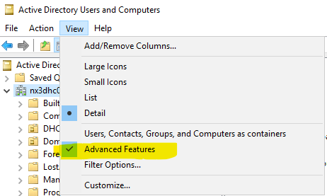
5. From OU=DHCAdmins,OU=Users,OU=DHC,DC=*\<domainName>*,DC=next select any user(s) with **_adm** suffix and double click on them
6. Go to the **Account** tab

   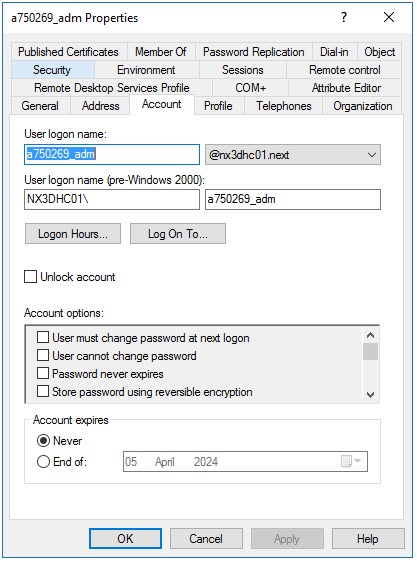
7. Check whether the "*Account is sensitive and cannot be delegated*" option is selected in the "Account options" section, like below

   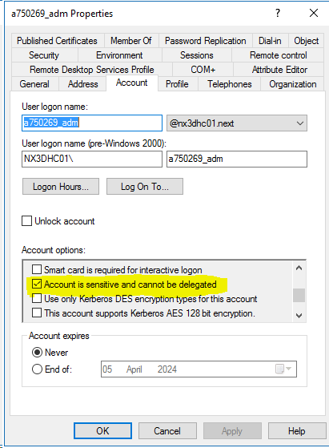
8. In **Active Directory Users and Computers** window go to the Domain -> VCS -> Servers -> <*locationCode*>, select and click rmb on **ICA001** server

   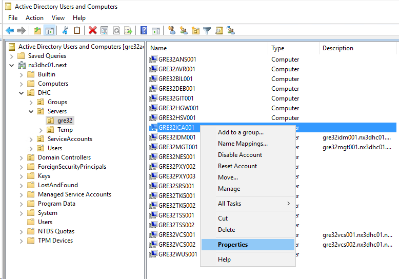
9. Go to the*Attribute Editor** tab and find the **userAccountControl** record

    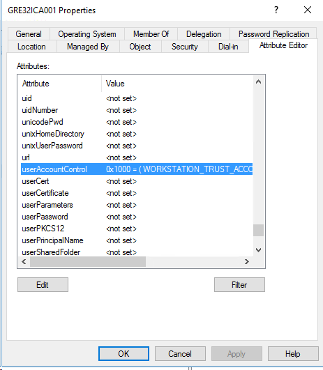
10. Move the slider a little to the right and make sure the text contains **"NOT_DELEGATED"** - like on the screen

    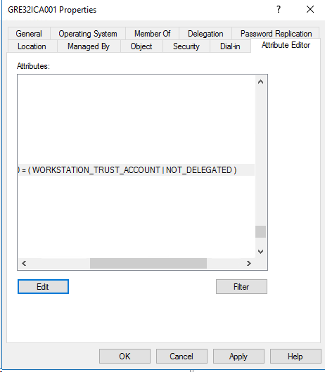

### C10 Post-deployment action

Deployment of this fix does not require any manual steps after deployment.

### C10 Rollback

1. Log in to the adc001 server
2. Open Server Manager
3. Click Tools -> Active Directory Users and Computers

    
4. From OU=DHCAdmins,OU=Users,OU=DHC,DC=*\<domainName>*,DC=next select user with **_adm** suffix and double click on them
5. Go to the **Account** tab

   
6. Clear checkbox "*Account is sensitive and cannot be delegated*" in the "Account options" section - like below

   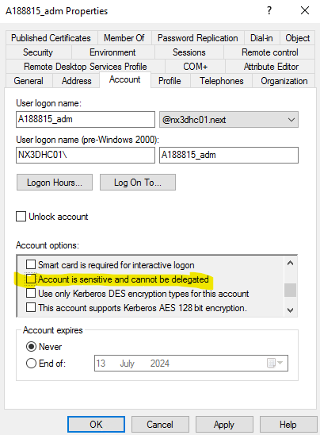
7. Click **OK**
8. Follow steps 4 through 7 for each user with a suffix **_adm** in the name
9. In **Active Directory Users and Computers** window go to the Domain -> VCS -> Servers -> <*locationCode*>, select and click rmb on **ICA001** server

   
10. Go to the **Attribute Editor** tab and find the **userAccountControl** record

    
11. Click **Edit** and provide value **4096**

    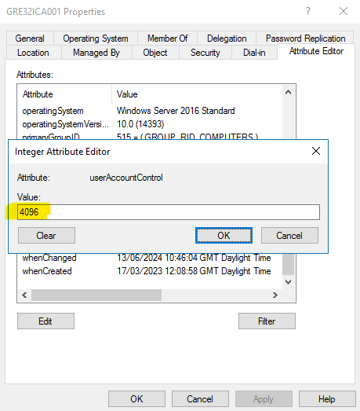
12. Click **OK** twice
13. Open **Task Scheduler** on server adc001
14. Select **Task Scheduler Library** on the left side
15. On the right side, click rmb **NotDelegateOn_adm**

    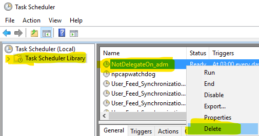
16. Select **Delete** and confirm by clicking **Yes**
17. Open **File Explorer** on server adc001
18. Navigate to folder **C:\Windows\System32**
19. Look for file **updateSensitiveAccounts.ps1**
20. Click rmb and **Delete** it

    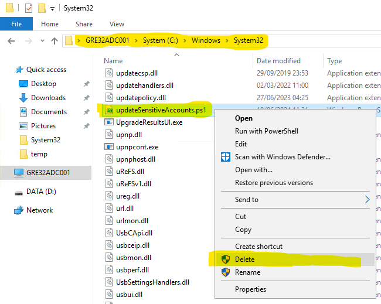
21. Confirm by clicking **Yes**

## C12 Native Administrative Group Members

<span style="color:red">**NOTE:**</span>  
>There is a correlation between C12, H15, and H16, so it is required to implement it in one turn, one by one, but not necessary in one command.
>
>```Ansible
>ansible-playbook remediateAdSecurityEnhancement24.yml --tags c12
>ansible-playbook remediateAdSecurityEnhancement24.yml --tags h15
>ansible-playbook remediateAdSecurityEnhancement24.yml --tags h16
>```

### C12 Description

Restrict the number of Domain Admins.
More details can be found at [Native Administrative Group Members](https://www.tenable.com/indicators/ioe/ad/C-NATIVE-ADM-GROUP-MEMBERS)

To run fix C12, please execute below command from Ansible.

```ansible
ansible-playbook remediateAdSecurityEnhancement24.yml --tags c12
```

> **NOTE:**  
> If, for some reason, you need to do it manually, you can find instructions below.

### C12 Manual implementation (Optional)

1. Log in to the adc001 server
2. Open Server Manager
3. Click Tools -> Active Directory Users and Computers

   
4. Ensure that **Advanced Features** is enabled

   
5. Go to the **domain** -> **DHC** -> **Groups** and click rmb, **RoleGroups**. From the menu, select **Delegate Control**

   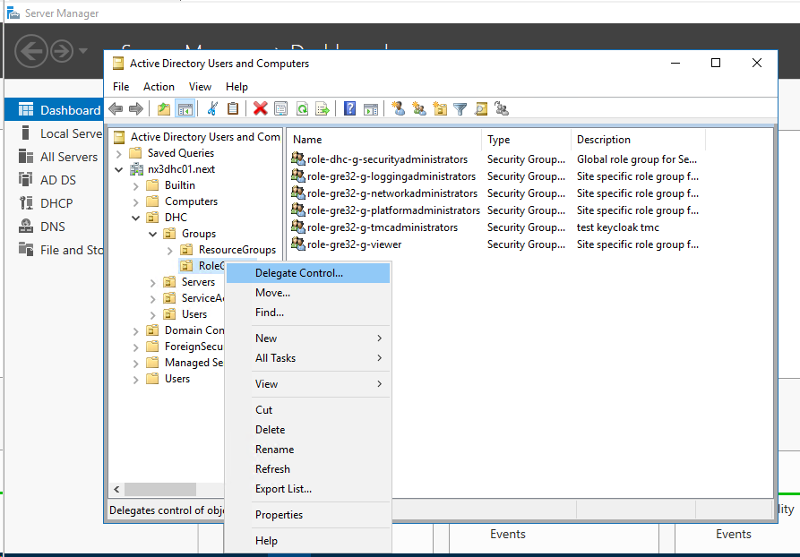
6. Now you will see a new wizard window

   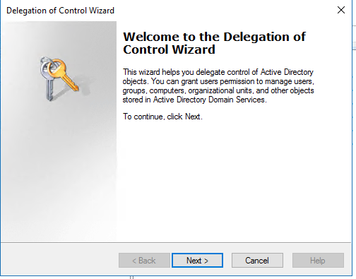

7. Click **Next**
8. Click **Add**. In the section **Enter the object names to select**, enter **role-**<*locationCode*>**-g-platformadministrators** and click **Check names**. The system should auto-fill the rest of the name. Click **OK** and **Next**

   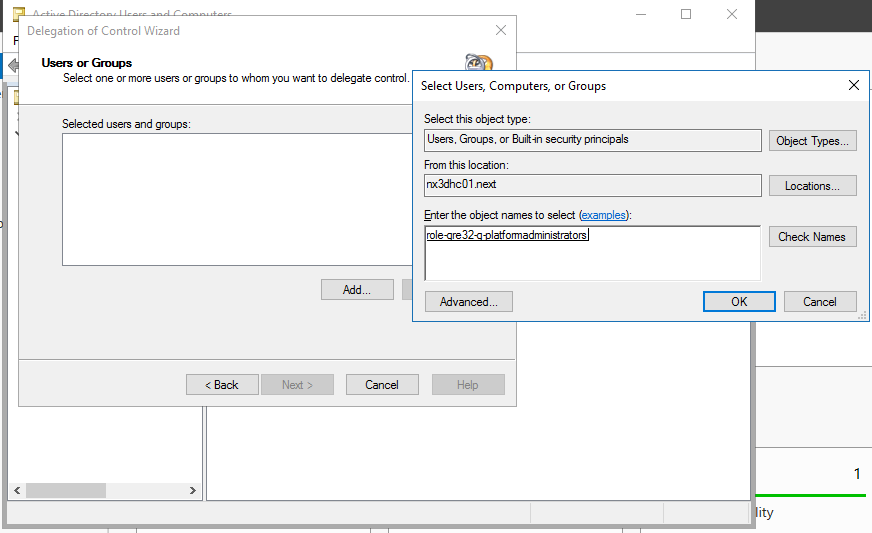
9. In the next window, you need to select the  correct privileges - please select **Modify the membership of a group** and click **Next**

   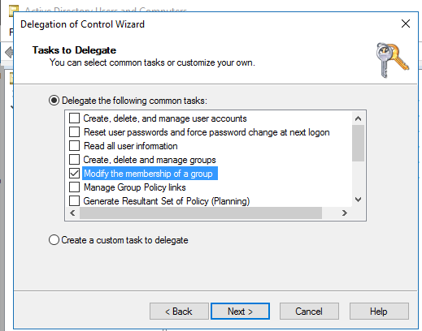
10. Last window - click **Finish**

    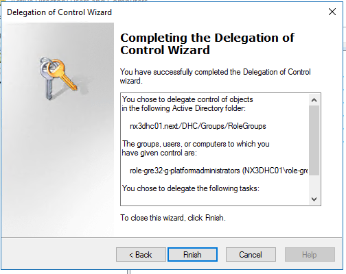
11. In **RoleGroups** find the **role-**<*locationCode*>**-g-platformadministrators**. Click rmb, them and select **Properties** from the menu

    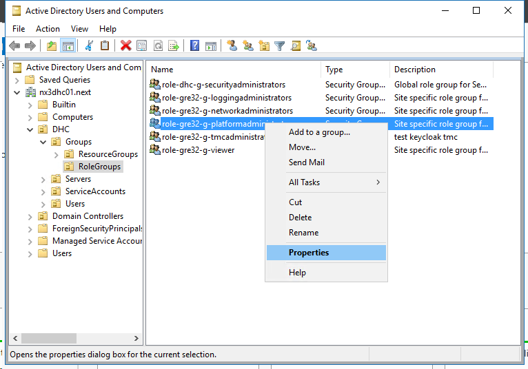
12. Go to the **Security** tab. Click **Add**. In the section **Enter the object names to select**, enter **role-**<*locationCode*>**-g-platformadministrators** and click **Check names**. The system should auto-fill the rest of the name. Click **OK**

    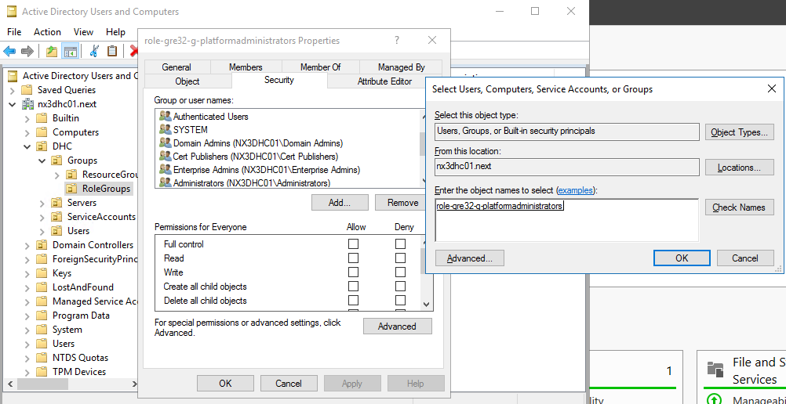

13. Click **Advanced**. Find role **role-**<*locationCode*>**-g-platformadministrators**, select them and click **Edit**
    In the Permission window, find position **Write Members**, select them and click **OK**

    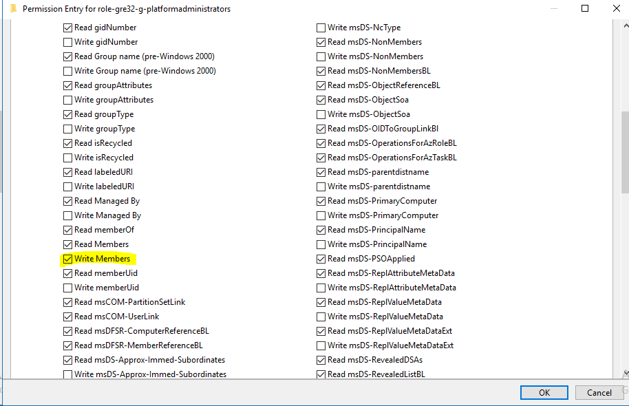
14. Click **Apply** and **OK**
15. Click rmb, **Users** and select **Delegate Control** from the menu

    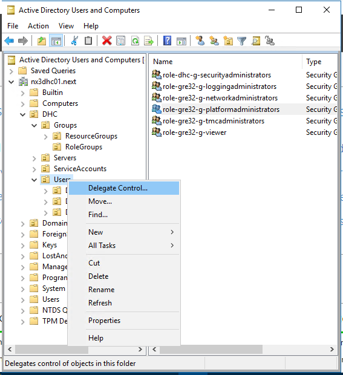
16. Now you will see a new wizard window

    
17. Click **Next**
18. Click **Add**. In the section **Enter the object names to select**, enter **role-**<*locationCode*>**-g-platformadministrators** and click **Check names**. The system should auto-fill the rest of the name. Click **OK** and **Next**

    
19. In the next window, you need to select the correct privileges - please select **Create, delete, and manage user accounts**, **Reset user passwords and force password change at next logon**, and click **Next**

    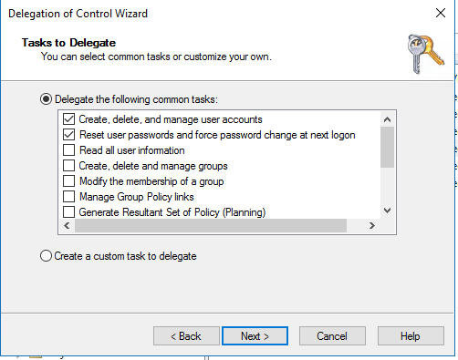
20. Last window - click **Finish**

    

21. Click rmb, **ResourceGroups** and select **Delegate Control** from the menu

    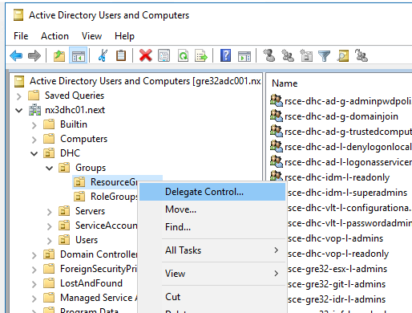
22. Now you will see a new wizard window

    
23. Click **Next**
24. Click **Add**. In the section **Enter the object names to select**, enter **role-**<*locationCode*>**-g-platformadministrators** and click **Check names**. The system should auto-fill the rest of the name. Click **OK** and **Next**

    
25. In the next window, you need to select the  correct privileges - please select **Modify the membership of a group** and click **Next**

    
26. Last window - click **Finish**

27. Click rmb, <*locationCode*> in **ServiceAccount** and select **Delegate Control** from the menu

    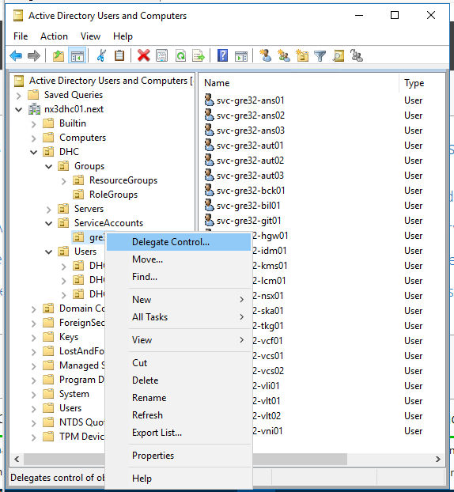
28. Now you will see a new wizard window

    
29. Click **Next**
30. Click **Add**. In the section **Enter the object names to select**, enter **role-**<*locationCode*>**-g-platformadministrators** and click **Check names**. The system should auto-fill the rest of the name. Click **OK** and **Next**

    

31. In the next window, you need to select the correct privileges - please select **Create, delete, and manage user accounts**, **Reset user passwords and force password change at next logon**, and click **Next**

    

32. Last window - click **Finish**

    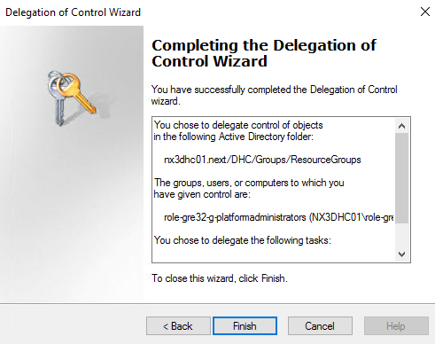
33. Go to the **Users**. Click rmb, **Domain Admins**, and select **Properties**. Go to the **Members** tab. From section **members** remove **role-**<*locationCode*>**-g-platformadministrators**

    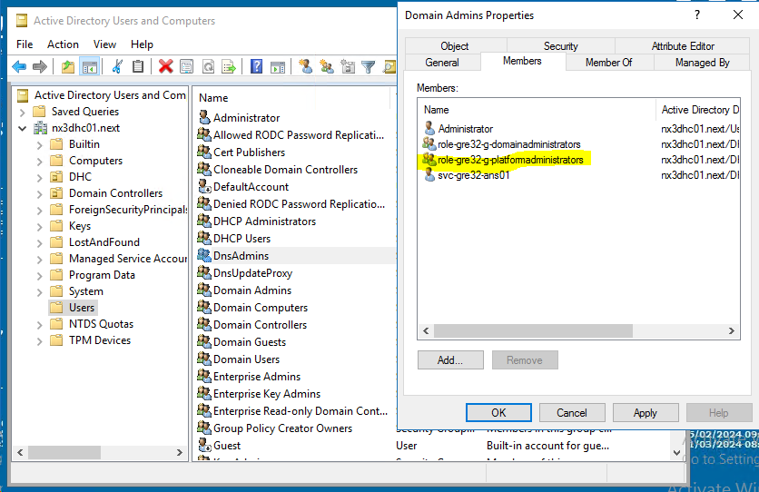
34. Click **OK**
35. Run PowerShell asan  administrator

    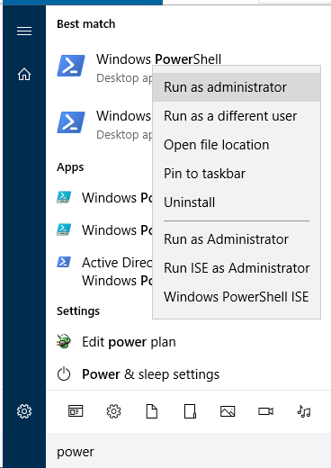
36. Run the script enableInheritance.ps1 located in c:\temp\

    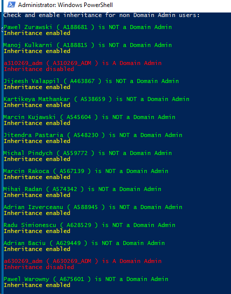

### C12 Verification

1. Log in to the adc001 server
2. Open Server Manager
3. Click Tools -> Active Directory Users and Computers

   
4. Go to the **domain** -> **DHC** -> **Groups**
5. In the window on the right side, you should be able to see the new role - **role-**<*locationCode*>**-g-domainadministrators**

   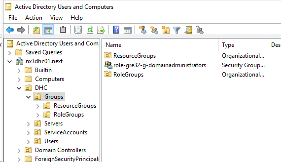
6. Click rmb, the role **domainadministrators**

   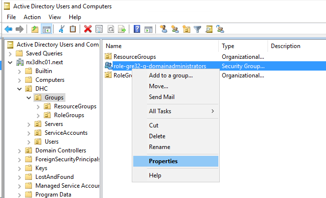
7. Go to the **Members** tab

   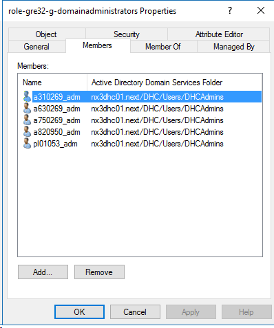
8. You should be able to see only these members whose name contains **_adm**
9. Go to the **Member Of** tab

   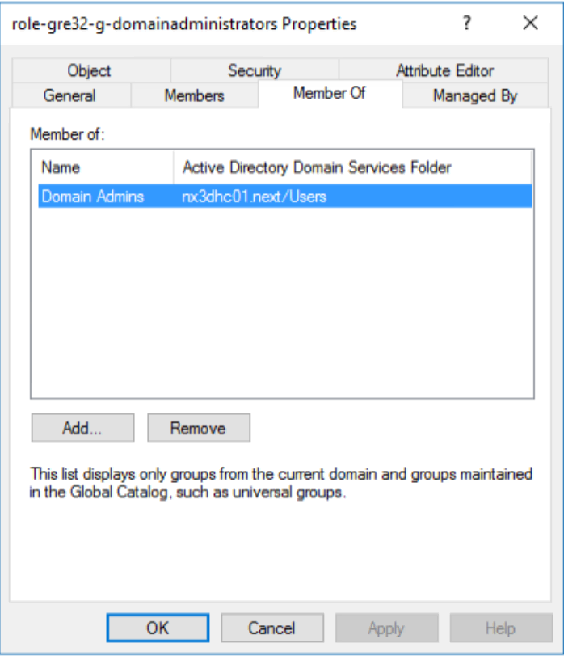
10. In this tab, you should be able to see the **Domain Admins** group
11. Go to the **domain** -> **DHC** -> **ServiceAccounts** -> <*locationCode*>. Find account **svc**-<*locationCode*>-**ans01** and double click on it
12. Go to the **Member of** tab and check whether group **Administrators** is visible.

    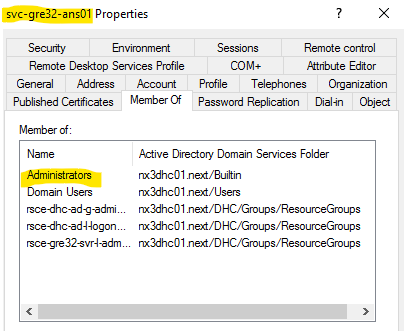

13. Go to the **domain** -> **DHC** -> **Groups** -> **RoleGroups**. Find group **role**-<*locationCode*>-**g-platformadministrators** and double click on it
14. For each OU from the list below:
    - ResourceGroups
    - RoleGroups
    - ServiceAccounts
    - Users

    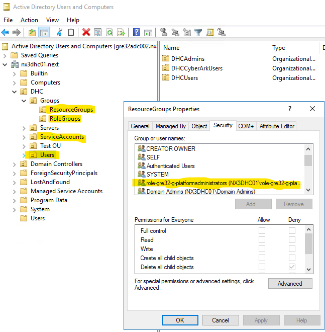

    Click rmb, from the menu select **Properties**
15. On the **Security** tab check whether **role-**<*locationCode*>**-g-platformadministrators** is on the list.

### C12 Post-deployment action

Deployment of this fix does not require any manual steps after deployment.

### C12 Rollback

1. Log in to the adc001 server
2. Open Server Manager
3. Click Tools -> Active Directory Users and Computers

   
4. The top menu click **View** -> **Advanced Features**

   
5. Go to the domain -> **DHC** -> **Groups** and click rmb, **ResourceGroups**. From the menu, select **Properties**

   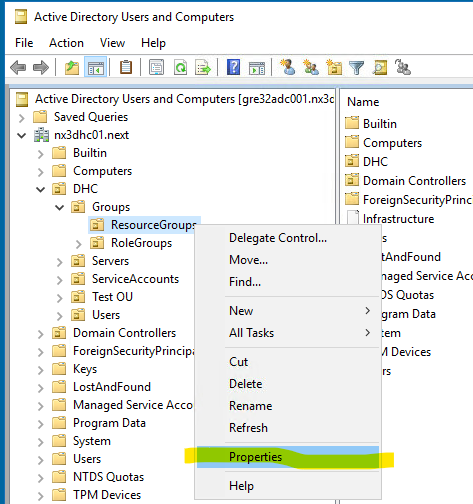
6. On the tab **Security** select security group **role-**<*locationCode*>**-g-platformadministrators** and click **Remove**

   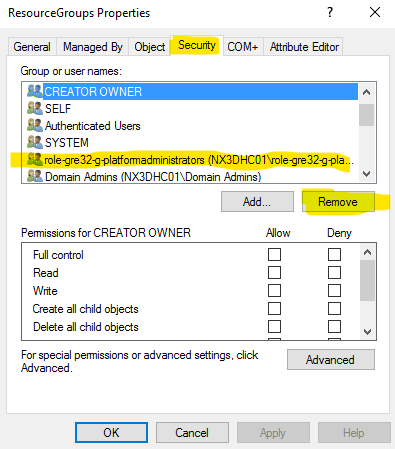

7. Click **OK**
8. Go to the domain -> **DHC** -> **Groups** and click rmb, **RoleGroups**. From the menu, select **Properties**

    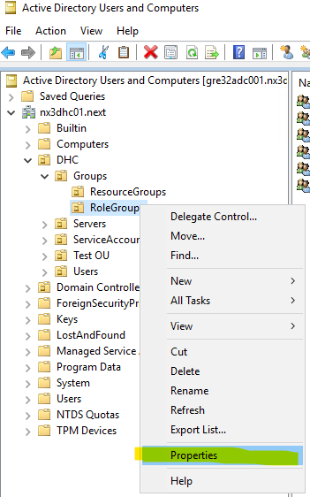
9. On the tab **Security** select security group **role-**<*locationCode*>**-g-platformadministrators** and click **Remove**

    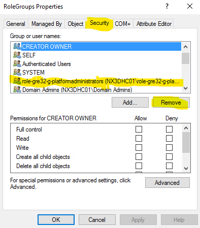
10. Click **OK**
11. Go to the domain -> **DHC** -> **Users** and click rmb. From the menu, select **Properties**

    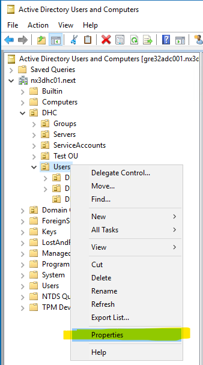
12. On the tab **Security** select security group **role-**<*locationCode*>**-g-platformadministrators** and click **Remove**

    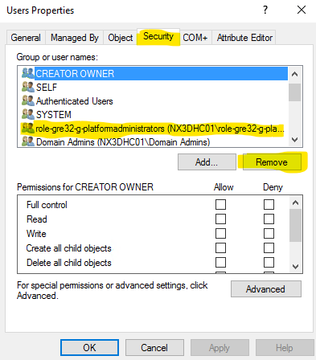
13. Click **OK**
14. Go to the **domain** -> **DHC** -> **ServiceAccounts** and click rmb. From the menu, select **Properties**  

    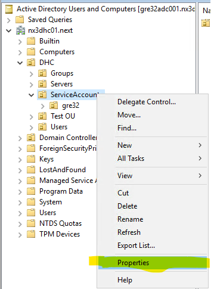
15. On the tab **Security** select security group **role-**<*locationCode*>**-g-platformadministrators** and click **Remove**

    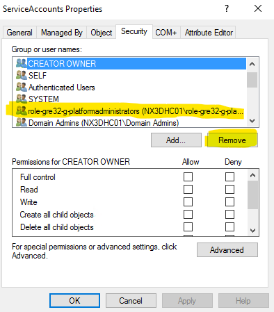
16. Click **OK**
17. Go to the **domain** -> **DHC** -> **ServiceAccounts** -> <*locationCode*>. Find account **svc**-<*locationCode*>-**ans01** and double click on it
18. Go to the **Member of** tab and remove from there **Administrators**

    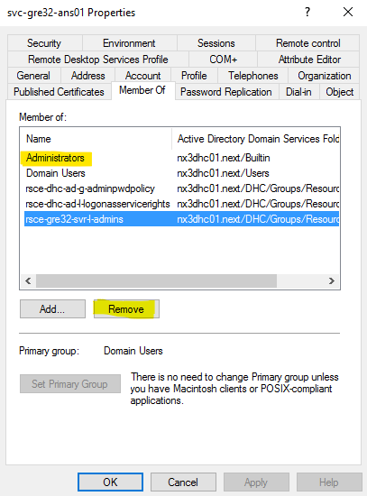
19. Click **Yes** then **OK**
20. Go to the **domain** -> **DHC** -> **Groups** -> **RoleGroups**. Find group **role**-<*locationCode*>-**g-platformadministrators** and double click on it
21. Go to the **Member of** tab and remove from there **DnsAdmins**

    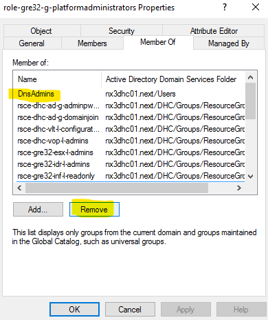
22. Click **Yes**
23. Click **Add**
24. Provide name **Domain Admins** and click **OK**

    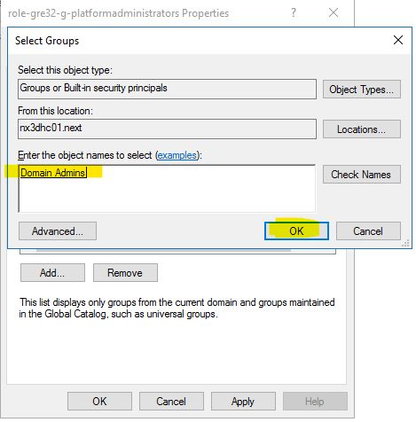
25. Click **OK**
26. Go to the **domain** -> **DHC** -> **Groups**
27. Click rmb on group **role**-<*locationCode*>-**g-domainadministrators** and delete it

    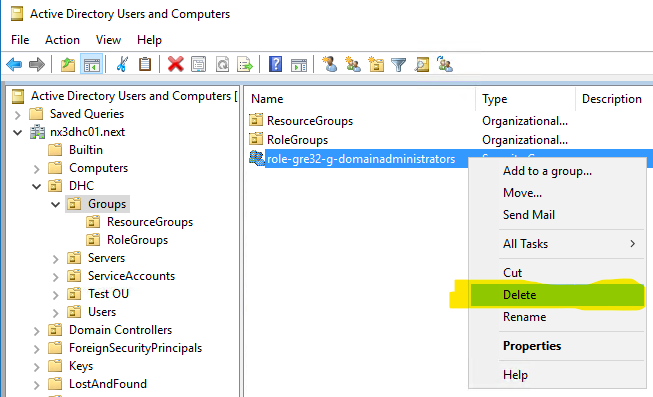
28. Click **Yes**

## H15 Protected Users Group not Used

<span style="color:red">**NOTE:**</span>  
>There is a correlation between C12, H15, and H16, so it is required to implement them in one turn.

### H15 Description

Add high-privileged users (Domain Admins, etc) to the  Protected Users built-in group to further enhance security.
More details can be found at [Protected Users Group not used.](https://www.tenable.com/indicators/ioe/ad/C-PROTECTED-USERS-GROUP-UNUSED)

To run fix H15, please execute below command from Ansible

```ansible
ansible-playbook remediateAdSecurityEnhancement24.yml --tags h15
```

### H15 Verification

1. Log in to the adc001 server
2. Open Server Manager
3. Click Tools -> Active Directory Users and Computers

   
4. Go to the **domain** -> **Users**

   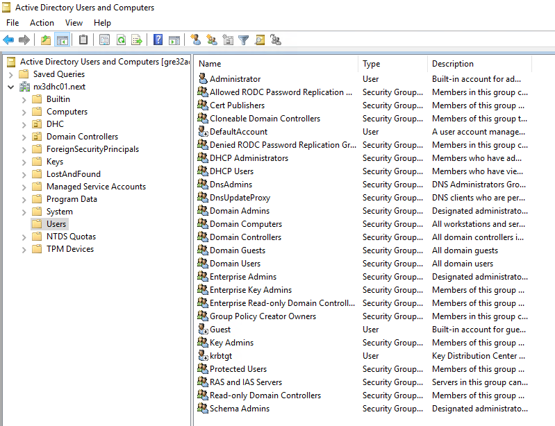
5. Click rmb, **Protected Users** and select **Properties** from the menu

   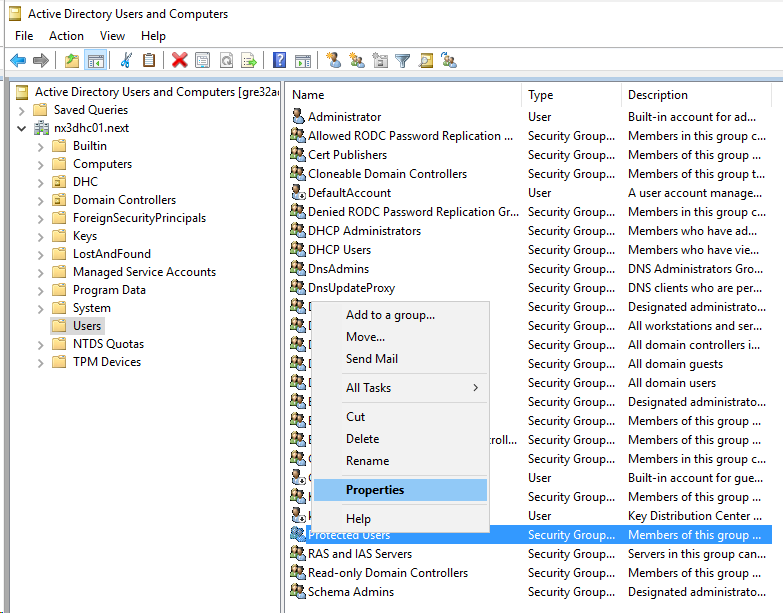
6. In the section **Members** of **Members** tab you should find the **Domain Admins** group - like below.

   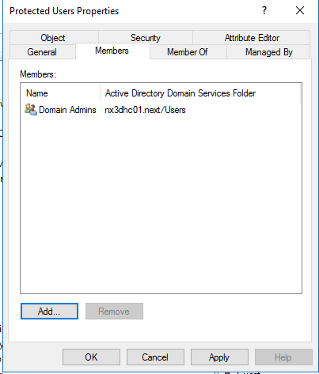

### H15 Post-deployment action

Deployment of this fix does not require any manual steps after deployment.

### H15 Rollback

1. Log in to the adc001 server
2. Open Server Manager
3. Click Tools -> Active Directory Users and Computers

   
4. Go to the **domain** -> **Users**
5. Click rmb, **Protected Users** and select **Properties** from the menu
6. On the tab **Members** remove **Domain Admins** group

   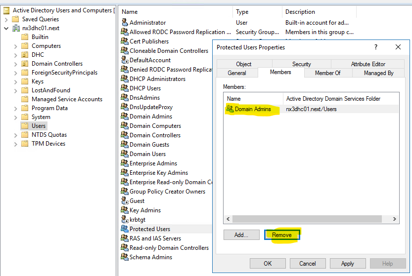
7. Click **YES** and then **OK**

## H16 Logon Restrictions for Privileged Users

<span style="color:red">**NOTE:**</span>  
>There is a correlation between C12, H15, and H16, so it is required to implement them in one turn.

### H16 Description

Change GPO to only allow privileged users to log on to TRUSTED machines (DCs, ICA)  
More details can be found at [Logon Restrictions for Privileged Users](https://www.tenable.com/indicators/ioe/ad/C-ADMIN-RESTRICT-AUTH)

To run fix H16, please execute below command from Ansible

```ansible
ansible-playbook remediateAdSecurityEnhancement24.yml --tags h16
```

### H16 Verification

1. Log in to the adc001 server
2. Open Server Manager
3. Click Tools -> Group Policy Management

   
4. In the new window in Domains -> domain you should find similar policy **nx3-AD-DomSecurityTier0-v0001**

   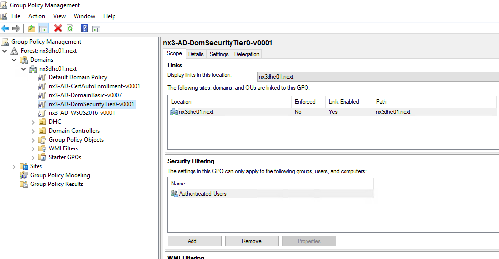
5. In the section **The following sites, domains and OUS are linked to this GPO**, you should find **Domain Controller*,* which **Enforced** and **Link Enabled** are set to **No** and **Yes** - like on the screen

   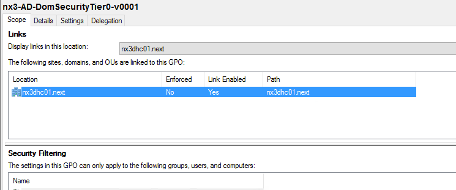
6. Go to the WMI Filters

   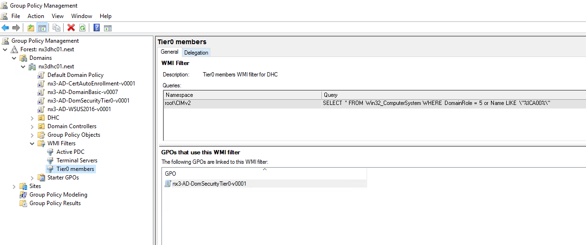
7. Go to the **Group Policy Objects**

   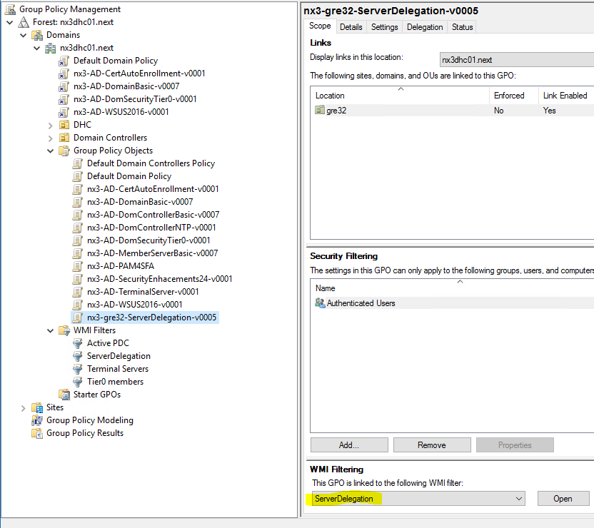
8. Log in to the ica001 server.
9. Go to the **Computer Management** -> **Local Users and Groups** -> **Groups** and double click on **Administrators**

   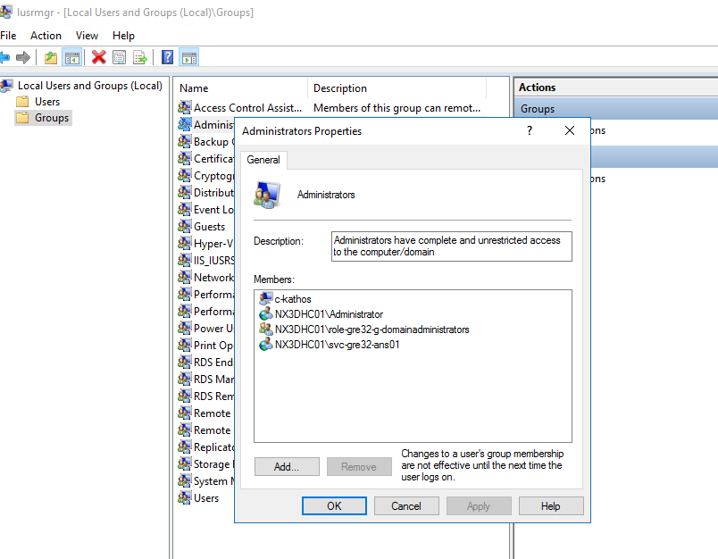
10. Check **role-**<*locationCode*>**-g-domainadministrators** is on the list of **Members**

### H16 Post-deployment action

Deployment of this fix does not require any manual steps after deployment.

### H16 Rollback

1. Log in to the adc001 server
2. Open Server Manager
3. Click Tools -> Group Policy Management

   
4. In the new window in Domains -> *domainName* -> Group Policy Objects you should find similar policy *\<customerCode\>***-AD-DomSecurityTier0-v0001**
5. Click rmb and **Delete** it

   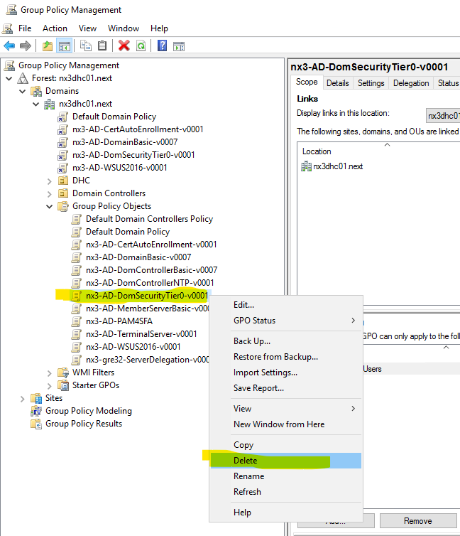
6. Select *\<customerCode*\>-<*locationCode*>**-ServerDelegation-v0005**
7. In WMI Filtering select **\<none\>**

   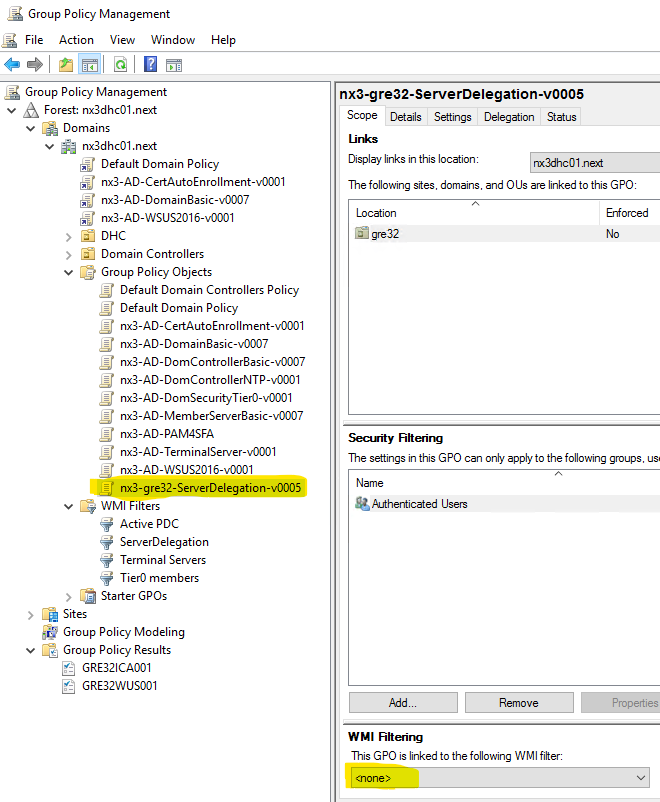
8. Confirm by clicking **Yes**
9. Go to the **WMI Filters**
10. Click rmb and **Delete** filter named **Tier0 members**

    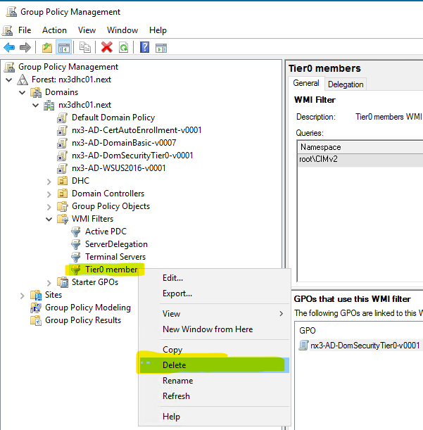
11. Click rmb and **Delete** filter named **ServerDelegation**

    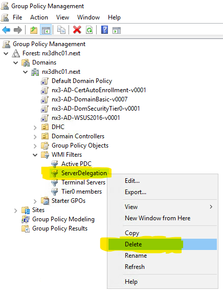
12. Open Server Manager

    
13. Click Tools -> Active Directory Users and Computers
14. Go to the **domain** -> **DHC** -> **ServiceAccounts** -> <*locationCode*>. Find account **svc**-<*locationCode*>-**ans01** and double click on it
15. Go to the **Member of** tab and click **Add...**

    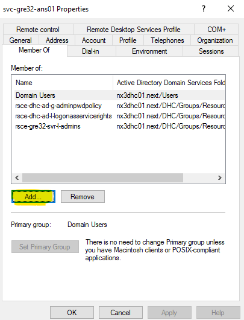
16. Provide name **Domain Admins** and click **OK**

    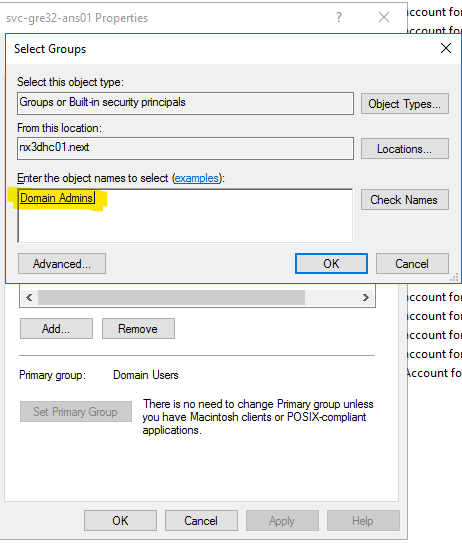
17. Click **OK**

## H17 SSL Medium Strength Cipher Suites Supported

### H17 Description

Update domain Group Policy objects to remove vulnerable encryption cipher suites found on local machines running the Windows Server operating system:
  - TLS_RSA_WITH_3DES_EDE_CBC_SHA
  - TLS_RSA_WITH_RC4_128_SHA
  - TLS_RSA_WITH_RC4_128_MD5

More details can be found at [SSL Medium Strength Cipher Suites Supported (SWEET32)](https://www.tenable.com/plugins/nessus/42873)

To run fix H17, please execute the following command from Ansible

```ansible
ansible-playbook remediateAdSecurityEnhancement24.yml --tags h17
```

### H17 Verification

1. Log in to a **Domain Controller** by using an elevated privileges user account (Domain Administrator or **_ADM account**);
2. Open **Group Policy Management Console** (gpmc.msc) and in the **Forest/Domain/Group Policy Objects** search for the desired GPO:
   - for Domain Controllers: *(customerCode)-AD-DomControllerBasic-007*;
   - for Windows Server OS running machines: *(customerCode)-AD-MemberServerBasic-007*;
  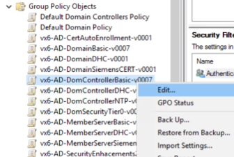
3. Right click on policy and select **Edit…**;
4. In the left pane, navigate to **ComputerConfiguration / Preferences / Windows Settings / Registry**;
5. In the right pane, search for the registry key value named **Functions**, right click on it and select **Properties**;
  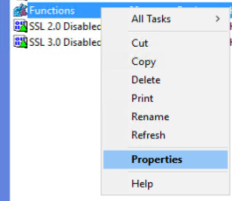
6. In the **Functions Properties** window, under **General** tab, check following:
   - Action: **Replace**
   - Hive: **HKEY_LOCAL_MACHINE**
   - Key Path: **SYSTEM\CurrentControlSet\Control\Cryptography\Configuration\Local\SSL\00010002**
   - Value name: **Functions**
   - Value type: **REG_MULTI_SZ**
   - Value data: verify that the list **does not contain** the following encryption cipher suites:
     - TLS_RSA_WITH_3DES_EDE_CBC_SHA
     - TLS_RSA_WITH_RC4_128_SHA
     - TLS_RSA_WITH_RC4_128_MD5
        
  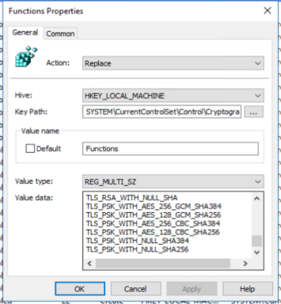

### H17 Post-deployment action - MANUAL

Machines operating on the Windows Server system must be restarted to implement the specified encryption cipher suites. For Domain Controllers, reboot them at a 30-minute interval in between.

### H17 Rollback

1. Log in to a **Domain Controller** by using an elevated privileges user account (Domain Administrator or **_ADM account**);
2. Open **Group Policy Management Console** (gpmc.msc) and in the **Forest/Domain/Group Policy Objects** search for the desired GPO:
   - for Domain Controllers: *(customerCode)-AD-DomControllerBasic-007*;
   - for Windows Server OS running machines: *(customerCode)-AD-MemberServerBasic-007*;
3. Right click on policy and select **Edit…**;

  

4. In the left pane, navigate to **ComputerConfiguration / Preferences / Windows Settings / Registry**;
5. In the right pane, search for the registry key value named **Functions**, right click on it and select **Delete**.
  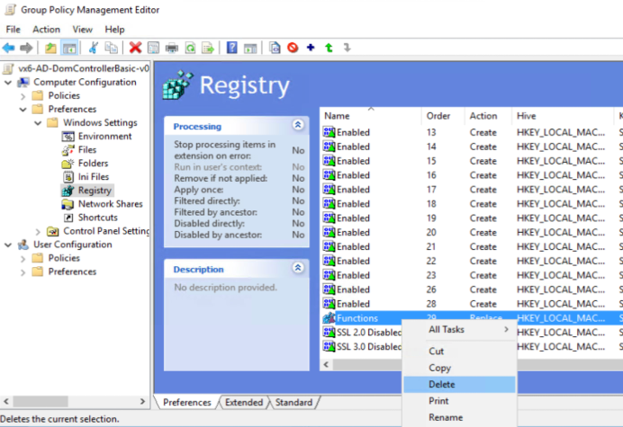
6. Log into each machine running Windows Server and  open the **Registry Editor** (regedit.exe);
7. Search for the registry key **HKEY_LOCAL_MACHINE\SYSTEM\CurrentControlSet\Control\Cryptography\Configuration\Local\SSL\00010002\Functions**;
8. Right click on it and select **Modify**;
  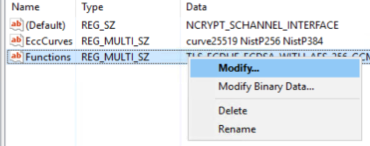
9. In the newly opened window, copy the content from **Value data** into **Notepad**;
  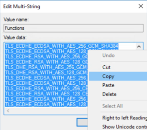
10. At the bottom of the page, paste the  following encryption cipher suites:
  - TLS_RSA_WITH_3DES_EDE_CBC_SHA
  - TLS_RSA_WITH_RC4_128_SHA
  - TLS_RSA_WITH_RC4_128_MD5
  
  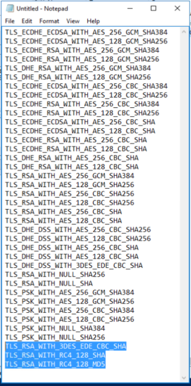

11. Copy the entire cipher suites list from **Notepad** and paste it into the **Value data** fiels in the **Registry Editor** key properties window:
  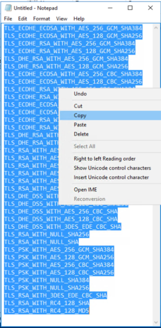
  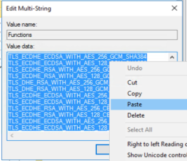
12. Click on **OK**, close the **Registry Editor** and reboot the machine;
13. Repeat steps 6 to 12 for each Windows server running machine; keep in mind that for Domain Controllers, you need to wait 30 minutes between reboots.
    
> [!IMPORTANT]
> Following implementations are to be performed under a privileged user account, a Domain Admin or an _ADM user account!
>
> Additional information can be found at [https://www.cert.ssi.gouv.fr/uploads/ad_checklist.html](https://www.cert.ssi.gouv.fr/uploads/ad_checklist.html)

## O1 Accounts with adminCount attribute

This instruction covers the automated and manual implementation of clearing the adminCount for user accounts that have for this attribute the value 1 and do not have elevated privileges (not a member of Domain Admins or BuiltIn Administrators group).

### O1 Description

ORADAD scan ID: **warn1_admincount**

Several active accounts in the forest have the adminCount property set, even though they no longer belong to privileged groups. This situation may be the result of poor administrative practice of temporarily placing users in the most privileged administrative groups in Active Directory.

Accounts with DACL inheritance ***Disabled*** pose the risk of no longer being subject to the Active Directory forest permission delegation model, although they are potentially no longer considered exceptional accounts due to elevated privileges.

>:bulb:**Recommendation:**
>
>The following operations are performed on an account when it joins a privileged group:
>
>- the adminCount property is set to 1;
>- permission inheritance is disabled;
>- permissions are periodically copied from the adminSDHolder object (SDProp mechanism).
>
>When an account leaves all privileged groups, the adminCount attribute remains set to 1, and permission inheritance remains disabled. This results in an uncontrolled state called orphaned adminSDHolder. The adminCount property, when set to 1, therefore reflects the fact that an account (user or machine) was, at some point, part of one of the most privileged administration groups in the Active Directory.
>
>Despite the removal of privileged groups, it is not possible to guarantee that the account will lose all of its acquired rights and privileges. For example, the user may still own Active Directory objects (GPOs, computers, users, etc.). The processing of these accounts must be done in two steps:
>
>- Determine and document the reason for setting adminCount to 1 and, if applicable, ban administrative practices of temporarily placing accounts in the most privileged administrative groups in Active Directory;
>- Determine (if possible) the actions performed with these accounts.

The playbook cleared the adminCount attribute for non-privileged user accounts.

```ansible
ansible-playbook remediateAdSecurityEnhancement24.yml --tags o1
```

**Log file**

Log files are located in **C:\temp**.

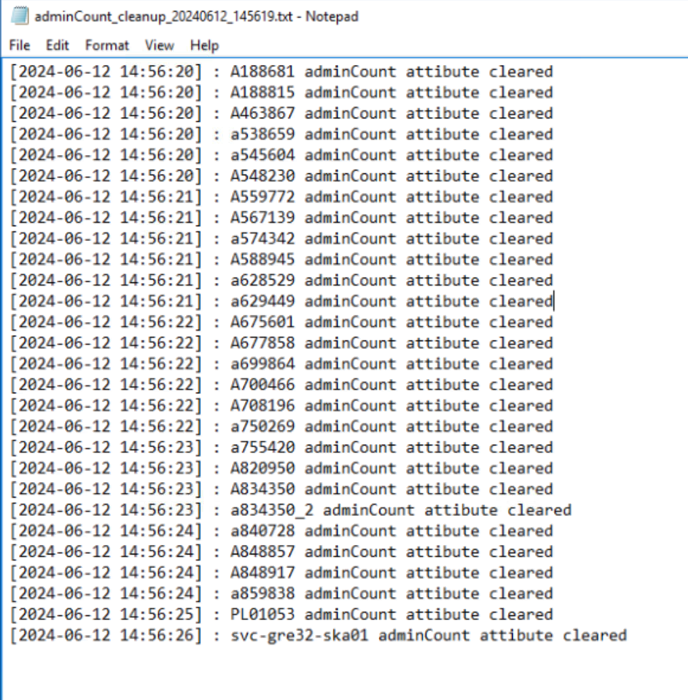

**NX3 environment, C12 hardening implemented**

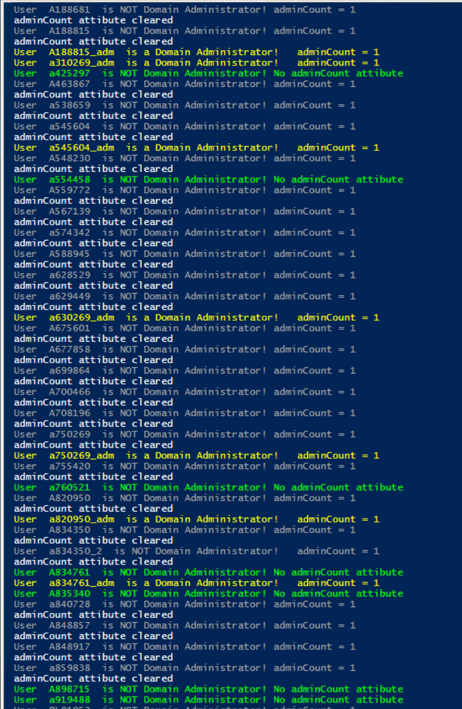

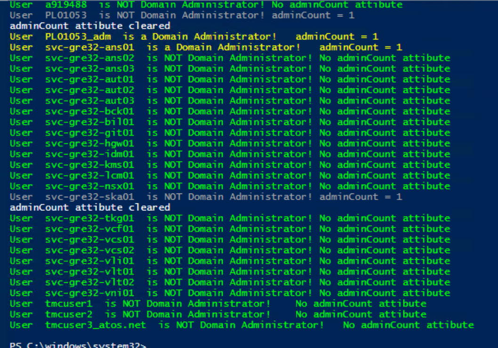

**NX4 environment, C12 hardening not implemented**

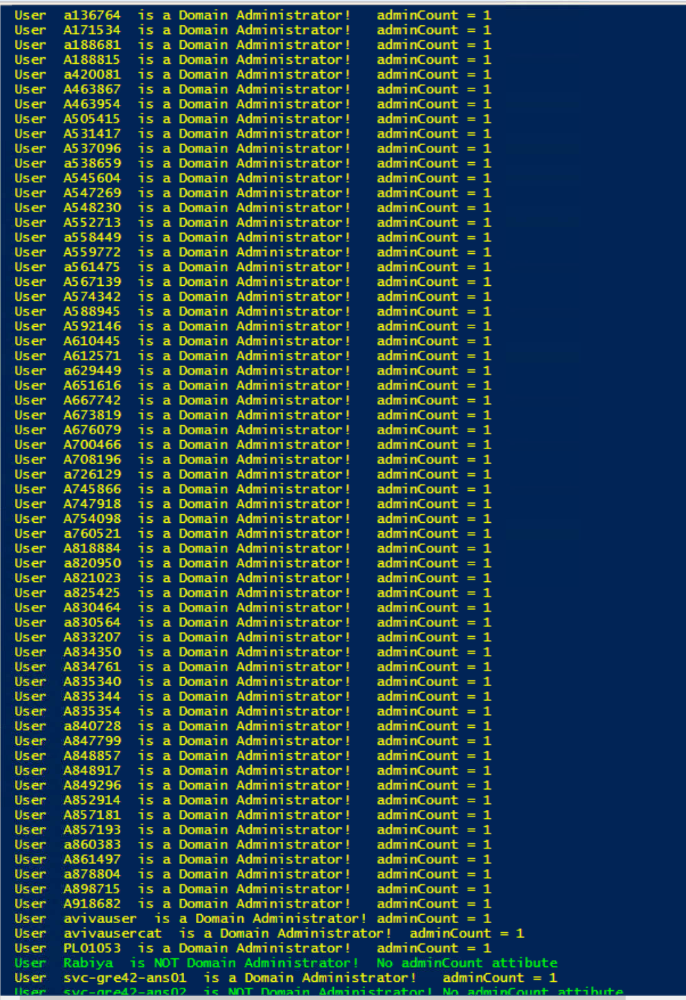

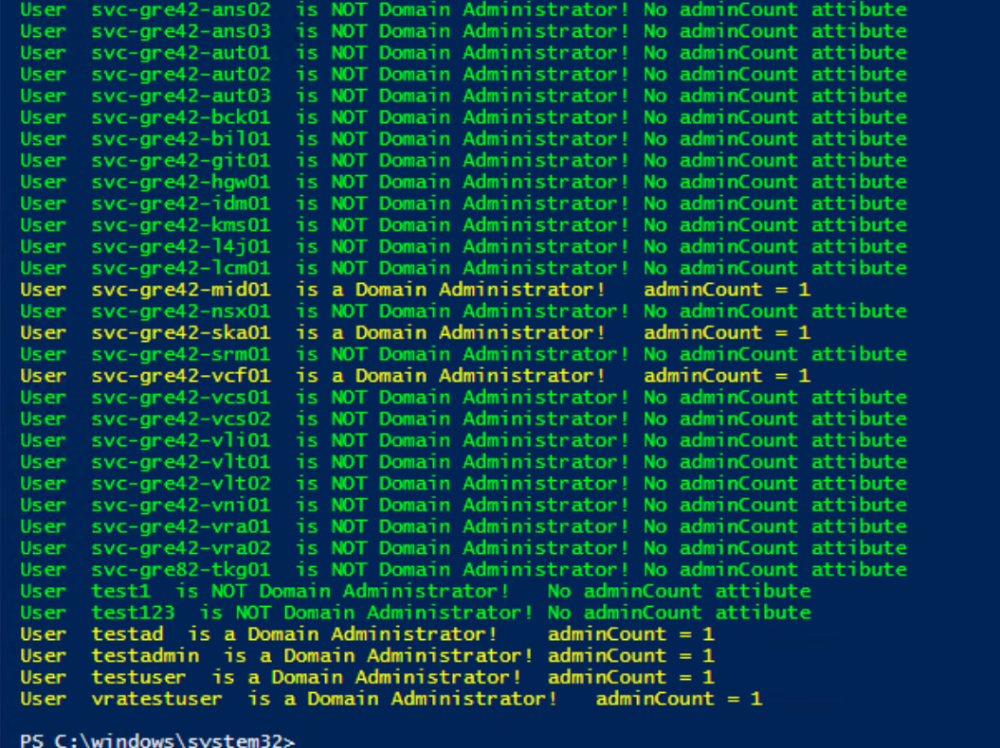

### O1 Verification

1. Login to a **Domain Controller** using an user account with elevated privileges (**Domain Admin** or **_ADM** account);
2. In **Active Directory Users and Computers** console, ensure that **Advanced features** view is enabled;
3. Search for user accounts in **./DHC/Users** OU that are not members of the Domain Admins or Built-In Administrators groups;
4. Right click on an user account and select **Properties** window select the **Attribute Editor** tab, browse for the **adminCount** attribute and check its value;

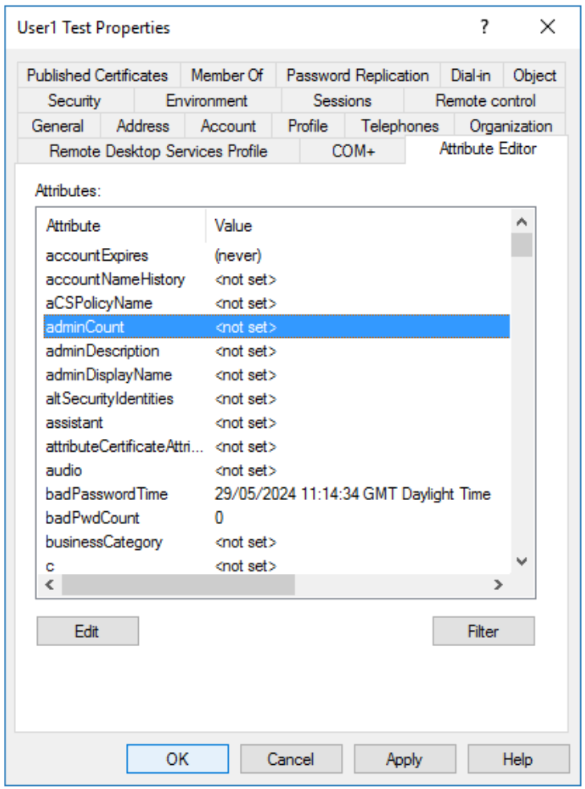

## O2 Accounts with never-expiring passwords

### O2 Description

ORADAD scan ID: **vuln2_dont_expire**

Account recovery allows a malicious individual to retain their access rights to the domain in the long term.

>:bulb:**Recommendation:**
>
> For a renewal to be technically imposed by the Active Directory, the accounts mustn't have the property **DONT_EXPIRE**. This property should be removed, and the password changed.
>
>While it is counterproductive to impose an expiration period that is too short, it is also important to avoid passwords that are never changed. Indeed, it is sometimes observed that there are active accounts whose passwords have not changed for more than 10 years, increasing the probability of their exposure, reuse, or weakness.
>
>Also, this exception may have the effect of putting the organization in a situation of never being able to change certain passwords.
>
>Finally, user accounts in an Active Directory are technically indistinguishable from unmanaged service accounts (in the gMSA/sMSA sense). The password policy imposed by the domain can thus be either global or differentiated between types of unprivileged user accounts via the Password Settings Object (PSO) mechanism. If a long password lifetime is tolerated by the organization's policy, this must be explicitly defined by the password policy. Differentiation allows for continued management over time of certain categories of accounts and requires documentation of exceptions and their password change procedures.
>
>Use of property **DONT_EXPIRE** generally results in forgetting to renew the password for certain accounts of particular importance, after a security incident or not, or even legitimizes the installation of products or the use of functional accounts having this characteristic and whose renewal procedure may not be documented.

```ansible
ansible-playbook remediateAdSecurityEnhancement24.yml --tags o2
```

### O2 Verification

1. Login to a **Domain Controller** using a user account with elevated privileges (**Domain Admin** or **_ADM** account);
2. In **Active Directory Users and Computers** console, ensure that **Advanced features** view is enabled;
3. Search for user accounts in **./DHC/Users** OU that are not members of the Domain Admins or Built-In Administrators groups;
4. Right click on a user account and select **Properties** window select the **Account** tab, verify if the check mark for **Password never expired** is set or not;

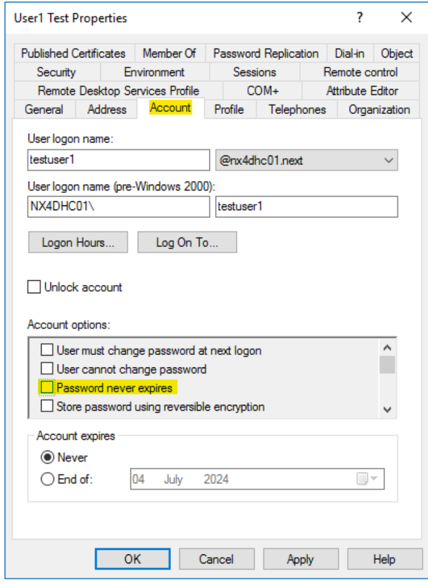

## O3 Built-in administrator accounts have been used in the past 30 days

### O3 Description

ORADAD scan ID: **warn1_rid500**

**“Built-in Administrator”** accounts were used less than 30 days ago.

>:bulb:**Recommendation:**
>
>The **"Built-in Administrator"** account (RID 500) is completely exempt from certain security policies. This allows, as a last resort, to use this account to correct a possible configuration error. This account has a "window-breaking" role and should never be used on a daily basis.
>
>For this account, it is recommended to generate a complex, random password and store it in a safe that can be accessed in the event of loss of control of the Active Directory.

```ansible
ansible-playbook configureHashiVaultBuiltInAdminAlert.yml
```

The playbook prepares the HashiVault audit file to be sent regularly (1 minute interval) to Aria Log Insight (vRealize), which filters the log in real time and triggers an alarm if the BuiltIn Administrator credentials were viewed or copied, which is picked up by Aria Operations. From Aria Operations, the alarm is forwarded to ServiceNow, where it creates an incident.

### O3 Verification

1. Log into **Aria Log Insight** and browse in the **Alarms** section for **Vault||Security-Integrity||Critical||BuiltInAdministrator** alarm.

  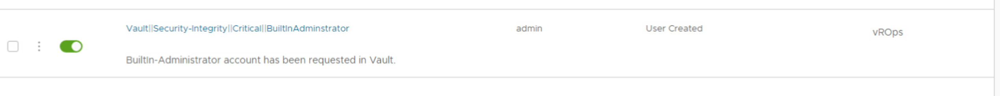
2. Edit the alarm and check if the following fields are correctly populated.

  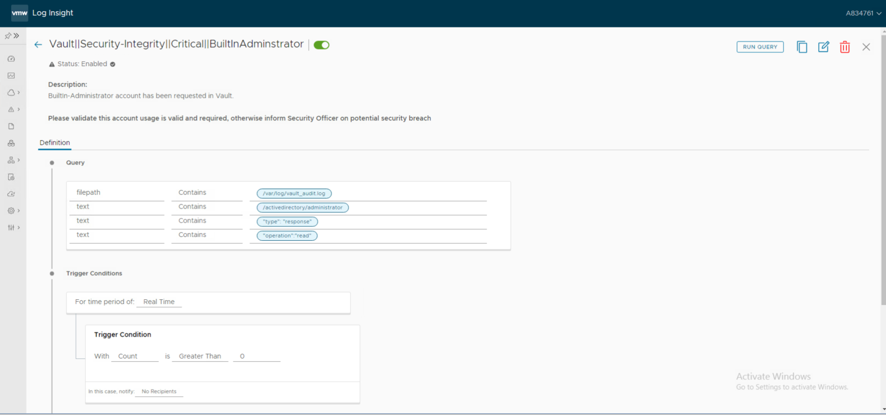
3. In the top right corner, click on the **Run query** tab. Based on the query criteria, all available log entries will be displayed (default display interval is the latest 5 minutes, increase the time interval if needed)

  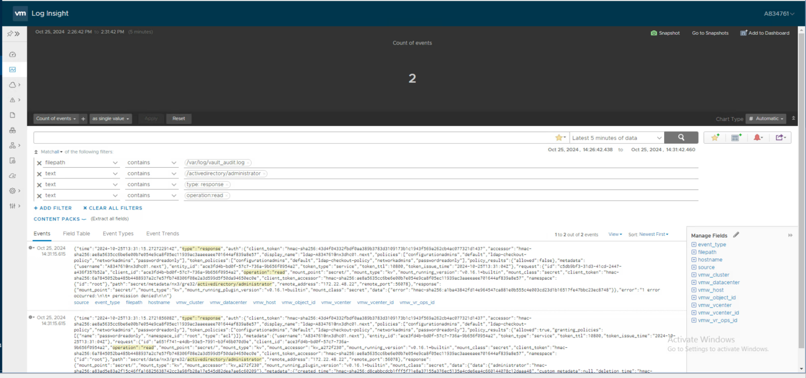
4. If there are valid query results from vRealize Log Insight, these will be forwarded to **Aria Operations**, check for notifications with the title **Log Insight: Vault||Security-Integrity||Critical||BuiltInAdministrator**

  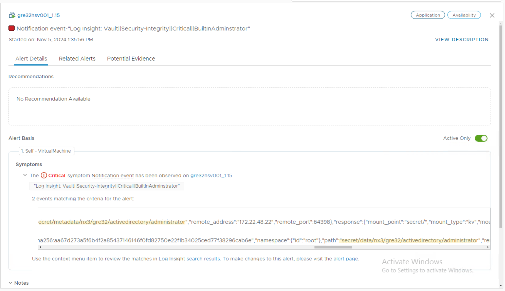

## O4 Dangerous dSHeuristics settings

### O4 Description

ORADAD scan ID: **vuln4_dsheuristics_bad**

Dangerous parameters are configured in the dSHeuristics attribute.

- if *fAllowAnonNSPI* is different from 0;
- if *dwAdminSDExMask* is different from 0;
- if *fLDAPBlockAnonOps* is equal to 2;
- if *DoNotVerifyUPNAndOrSPNUniqueness* is non-0 [(KB5008382)](https://support.microsoft.com/en-us/topic/kb5008382-verification-of-uniqueness-for-user-principal-name-service-principal-name-and-the-service-principal-name-alias-cve-2021-42282-4651b175-290c-4e59-8fcb-e4e5cd0cdb29);
- if *AttributeAuthorizationOnLDAPAdd* is equal to 2 [(KB5008383)](https://support.microsoft.com/en-us/topic/kb5008383-active-directory-permissions-updates-cve-2021-42291-536d5555-ffba-4248-a60e-d6cbc849cde1);
- if *BlockOwnerImplicitRights* is equal to 2 [(KB5008383)](https://support.microsoft.com/en-us/topic/kb5008383-active-directory-permissions-updates-cve-2021-42291-536d5555-ffba-4248-a60e-d6cbc849cde1);
- if *AttributeAuthorizationOnLDAPAdd* is different from 1 [(KB5008383)](https://support.microsoft.com/en-us/topic/kb5008383-active-directory-permissions-updates-cve-2021-42291-536d5555-ffba-4248-a60e-d6cbc849cde1);
- if *BlockOwnerImplicitRights* is different from 1 [(KB5008383)](https://support.microsoft.com/en-us/topic/kb5008383-active-directory-permissions-updates-cve-2021-42291-536d5555-ffba-4248-a60e-d6cbc849cde1).

The following values are set in the **dSHeuristics** attribute. Empty values mean that no value has been explicitly defined. In this case, the default value is used. For example, setting **dSHeuristics** to **00000000010000000002000000011** allows reaching level 5, as this value sets every field to its default value, except *BlockOwnerImplicitRights* and *AttributeAuthorizationOnLDAPAdd*, which are set to *1*.

>:bulb:**Recommendation:**
>
>The dSHeuristics attribute is used to define heuristics that are used to determine how certain Active Directory mechanisms operate. For example:
>
>- *fLDAPBlockAnonOps* allows LDAP operations to be allowed without authentication;
>- *fAllowAnonNSPI* allows anonymous access to the Name Service Provider Interface (NSPI);
>- *dwAdminSDExMask* allows to define the groups protected by the SDProp mechanism;
>- *DoNotVerifyUPNAndOrSPNUniqueness* allows to relax checks on the uniqueness of UPNs and SPNs;
>- *LDAPAddAuthZVerifications* allows you to disable auditing and protection provided by [KB5008383](https://support.microsoft.com/en-us/topic/kb5008383-active-directory-permissions-updates-cve-2021-42291-536d5555-ffba-4248-a60e-d6cbc849cde1);
>- *BlockOwnerImplicitRights* allows you to disable the auditing and protection provided by [KB5008383](https://support.microsoft.com/en-us/topic/kb5008383-active-directory-permissions-updates-cve-2021-42291-536d5555-ffba-4248-a60e-d6cbc849cde1).
>
>The dangerous parameters configured in the dSHeuristics property must be modified and reset to their default values:
>
>- *fLDAPBlockAnonOps* must not be configured or have a value other than 2;
>- *fAllowAnonNSPI* must be 0;
>- *dwAdminSDExMask* must be 0;
>- *DoNotVerifyUPNAndOrSPNUniqueness* must be 0;
>- *LDAPAddAuthZVerifications* must not be configured or have a value other than 2 to reach level 3; this value must be explicitly set to 1 to reach level 5;
>- *BlockOwnerImplicitRights* must not be set or have a value other than 2 to reach level 3; this value must be explicitly set to 1 to reach level 5.
>
>Correction is usually done using ```adsiedit.msc``` consoles or ldp utility. The dSHeuristics attribute has a special format, which is described in the [documentation](https://learn.microsoft.com/en-us/openspecs/windows_protocols/ms-adts/e5899be4-862e-496f-9a38-33950617d2c5).

```ansible
ansible-playbook remediateAdSecurityEnhancement24.yml --tags o4
```

The playbook sets the value of the **dSHeuristics** attribute to **00000000010000000002000000011**.

### O4 Verification

1. Login to a **Domain Controller** using a user account with elevated privileges (**Domain Admin** or **_ADM** account);
2. Open **ADSI Edit** console and in the **Action** tab click on **Connect to...**
3. In the **Connection Settings** window select **Configuration** from **Select a well-known Naming Context** dropdown

  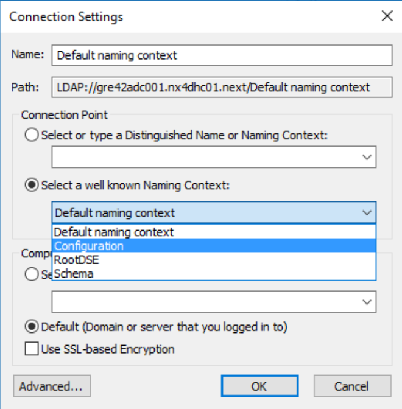
4. On the left side pane, expand the folder structure until you reach **CN=Directory Service** (./Configuration/Services/Windows NT/Directory Service);

  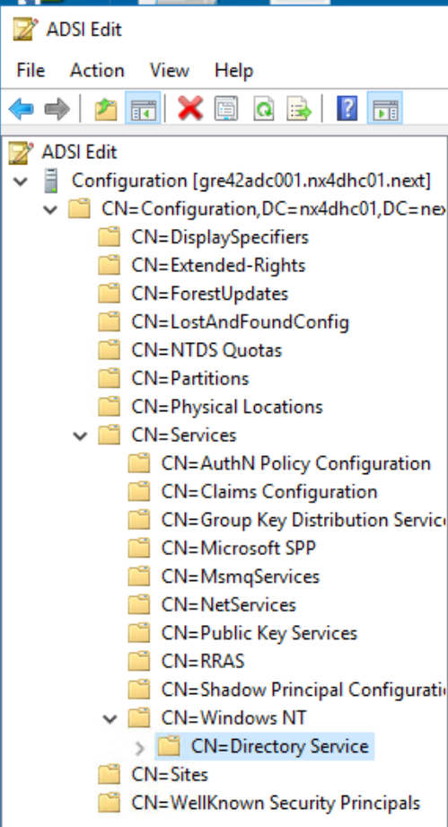
5. Right click on **Directory Service** for the popup menu and select **Properties**;

  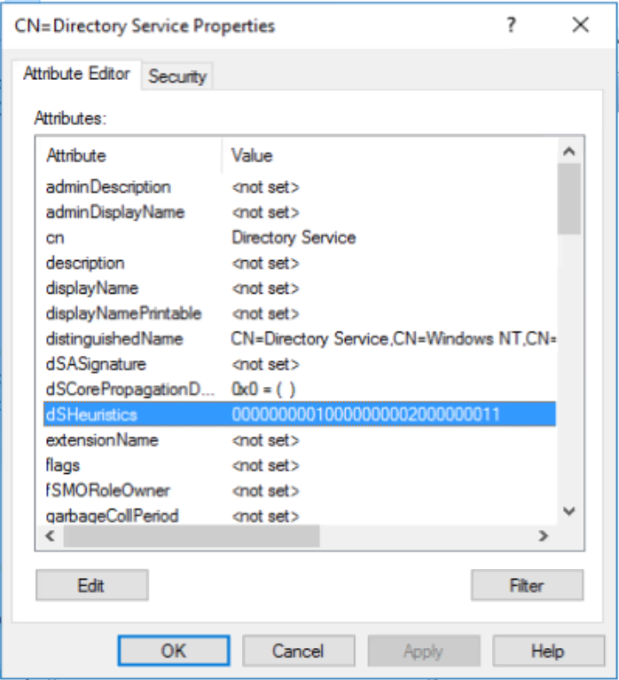
6. In the **Properties** window and browse for the **dSHeuristics** attribute and check its value, **00000000010000000002000000011**.

## O5 DC/RODC supported encryption algorithms

### O5 Description

ORADAD scan ID: **vuln4_dc_crypto**

DC/RODCs implement different encryption algorithms for Kerberos tickets (DES, RC4, AES). Initially, only the RC4 algorithm (RC4-HMAC) was supported for Windows systems, and DES-based algorithms could be enabled to improve compatibility with non-Windows systems.

Windows Server 2008 introduced support for AES-based algorithms (AES128-CTS-HMAC-SHA1-96 and AES256-CTS-HMAC-SHA1-96), which were standardized and supported by non-Windows systems.

Currently, the DES-based algorithms (DES-CBC-CRC and DES-CBC-MD5) are considered obsolete and should be disabled. Similarly, for hardening purposes, the RC4 algorithm can be disabled, but this will result in a loss of compatibility with systems prior to Windows Vista and Windows Server 2008.

>:bulb:**Recommendation:**
>
>The configuration of the algorithms supported by a DC/RODC is defined in the security options of the local security policy (Network security: Configure authorized encryption types for Kerberos). This setting should not be modified in each local security policy of the DCs (risk of desynchronization between the DCs). It is recommended to modify this setting in the GPO "Default Domain Controller Policy" or any other GPO applied to the DCs.
>
>It is recommended to set this policy and enable: AES128-CTS-HMAC-SHA1-96, AES256-CTS-HMAC-SHA1-96 and "Future Encryption Types".
>
>Before changing this setting, it is necessary to ensure that domain controllers only issue TGTs or service tickets encrypted with AES128 or AES256. This can be verified by looking at events 4768 (TGT request) and 4769 (Service ticket request) in the Security log on each DC. In both events, the TicketEncryptionType attribute indicates the algorithm used by the domain controller to encrypt the ticket. It is important to ensure that only types 0x11 (AES128-CTS-HMAC-SHA1-96) or 0x12 (AES256-CTS-HMAC-SHA1-96) are used.
>
>The change should not be made by editing the LDAP msDS-SupportedEncryptionTypes attribute directly, but through a GPO that should be deployed to all DCs and RODCs.
>
> - Computer Configuration
>   - Windows Settings
>     - Security Settings
>       - Local Policies
>         - Security Options
>           - Network security: Configure encryption types allowed for Kerberos : RC4-HMAC, AES128-CTS-HMAC-SHA1-96, AES256-CTS-HMAC-SHA1-96 and "Future encryption types"

The script checks for the GPOs that contain configured values for the "Network security: Configure encryption types allowed for Kerberos" policy and are linked to an Organizational Unit.

It checks if the configured policy numeric value differs from the desired value (**AES128_HMAC_SHA1 | AES256_HMAC-SHA1 | Future encryption types**) and modifies it to this value. Due to the fact that this is a Local Security Policy pushed via GPO, the setting for this policy is stored in the SYSVOL shared folder, in the GPO's own GptTmpl.inf file.

```ansible
ansible-playbook remediateAdSecurityEnhancement24.yml --tags o5
```

### O5 Verification

1. Login to a **Domain Controller** by using an elevated privileges user account (Domain Administrator or **_ADM account**);
2. Open **Group Policy Management Console** (gpmc.msc) and in the **Forest/Domain/Group Policy Objects** search for the desired GPO:
   - for Domain Controllers: *(customerCode)-AD-DomControllerBasic-007*;
   - for Windows Server OS running machines: *(customerCode)-AD-MemberServerBasic-007*;
  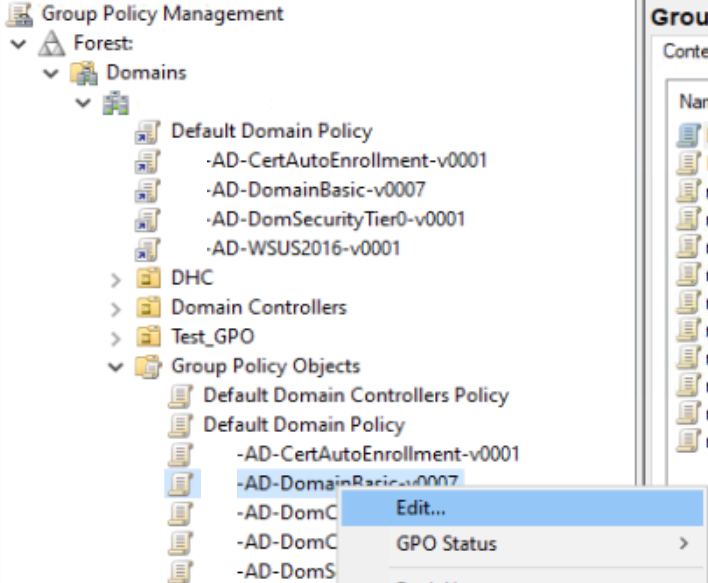
3. Right click on policy and select **Edit…**;
4. In the left pane, navigate to **ComputerConfiguration / Policies / Windows Settings / Security Settings / Local Policies / Security Options**;
5. In the right pane, search for the policy named **Network security: Configure encryption types allowed for Kerberos**, right click on it and select **Properties**.
  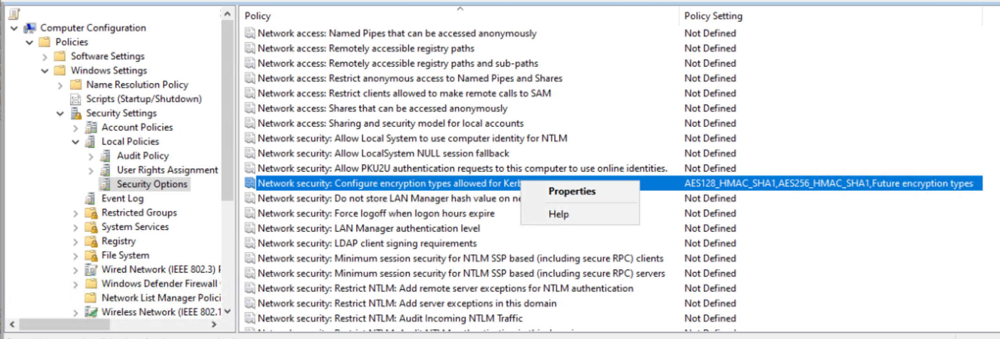
6. In the **Security Policy Setting** tab, check if the configured encryption types match the ones pushed by this fix.
  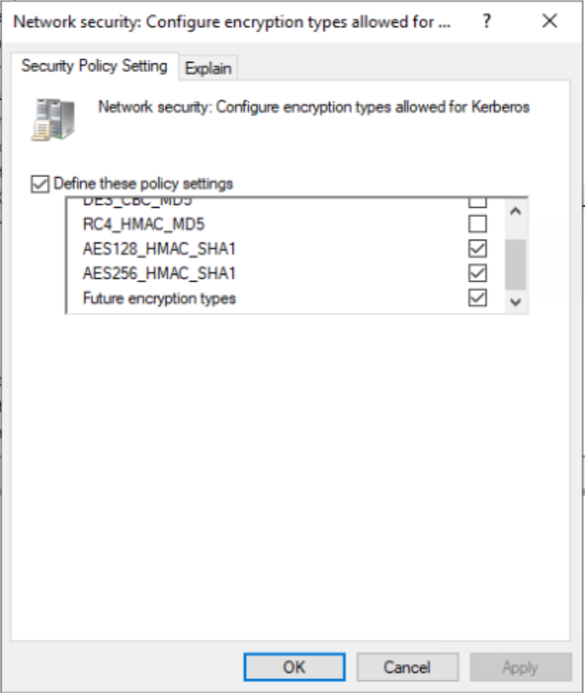

## O6 Incorrect object owners

### O6 Description

ORADAD scan ID: **vuln3_owner**

Items created more than 7 days ago have non-standard owners.

>:bulb:**Recommendation:**
>
>All objects (users, groups, sMSA, gMSA, computers, OU, and GPO) must be owned by one of the following objects:
>
> - Domain Administrators;
> - Company Directors;
> - Administrators;
> - Local system.

```ansible
ansible-playbook remediateAdSecurityEnhancement24.yml --tags o6
```

### O6 Verification

1. Login to a **Domain Controller** using an user account with elevated privileges (**Domain Admin** or **_ADM** account);
2. In **Active Directory Users and Computers** console, ensure that **Advanced features** view is enabled;
3. Search for **./DHC** OU;
4. Right click on the OU object and in the **Properties** window select the **Security** tab, click on **Advanced**;

  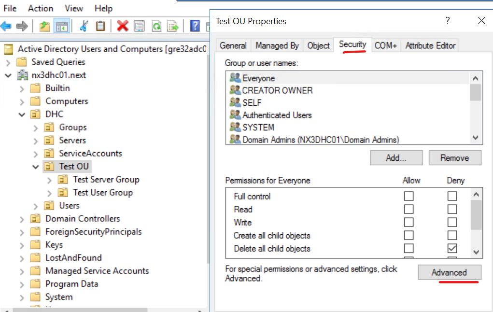
5. In the **Advanced Security Settings** window check for if the **Owner** is the **Domain Administrators** group.

  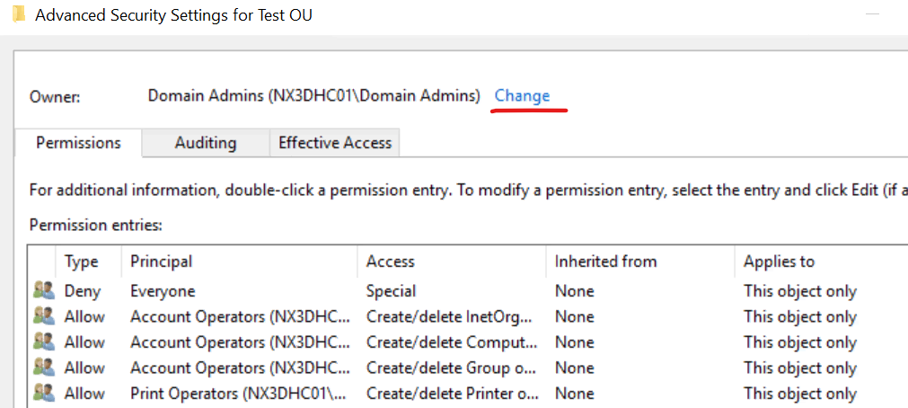

## O7 Krbtgt account password unchanged for more than a year

### O7 Description

ORADAD scan ID: **vuln2_krbtgt**

The krbtgt account password has not been changed for more than a year.

The krbtgt Kerberos infrastructure account in all Active Directory domains is used as a support for key storage in all Kerberos Key Distribution Centers (KDC).

Taking over a krbtgt account allows an attacker to forge Kerberos tickets of Ticket Granting Ticket (TGT) type (so-called golden tickets), then authenticate to any resource (server, workstation, etc.) in the domain with full administrative privileges in a more or less stealth manner.

The krbtgt account does not change its password automatically, so if the account database was extracted (for instance, by a former administrator, during an audit, or for a password strength assessment), it is possible to use information from that database to extract the krbtgt secrets. A malicious user can then compromise all Active Directory services, many years after the information was extracted.

>:bulb:**Recommendation:**
>
>The krbtgt Kerberos infrastructure account in all Active Directory domains is used as a support for key storage in all Kerberos Key Distribution Centers (KDC). In order to renew Kerberos keys used to encrypt TGTs, the krbtgt account must have its password manually changed periodically. Using the  Microsoft-provided script is recommended.
>
>The password change must be carried out twice in a row to effectively prevent fraudulent usage of previous passwords (the current and previous passwords are both valid at any one time).
>
>>**WARNING!**
>>Any password change operation for the krbtgt account must be carried out in an Active Directory environment with working, healthy domain controller replication. A sufficient delay must be observed between the two consecutive password changes for the values to be replicated to all domain controllers.
>
>The krbtgt can be manually rolled, the same way one can force a change of a user password. If the provided script is not used, a delay of 24 hours should be observed between the two consecutive password changes, as well as ensuring replication is properly working between all domain controllers. An alternative strategy could be rolling this password only once every 6 months, thus ensuring proper revocation of all previous passwords every year.

```ansible
ansible-playbook complianceKrbtgt.yml
```

The playbook creates a scheduled task on one of the Domain Controllers that runs on a monthly basis, resetting the password for the Kerberos account.

## O8 Privileged accounts outside of the Protected Users group

### O8 Description

ORADAD scan ID: **vuln3_protected_users**

Some privileged accounts are not protected by the Protected Users group.

>:bulb:**Recommendation:**
>
>Privileged users must be members of the Protected Users group to:
>
>- enforce Kerberos authentication;
>- reduce Kerberos ticket lifetime;
>- enforce usage of strong encryption algorithms (AES);
>- prevent caching of passwords on workstations;
>- prevent any type of Kerberos delegation.
>

<!-- -->  
>[!WARNING]
>Use of the group Protected users has significant functional impacts.
>Reference: [Protected Users Security Group](https://docs.microsoft.com/en-us/windows-server/security/credentials-protection-and-management/protected-users-security-group)

The vulnerability is already fixed by [H15 Protected Users Group not Used](https://github.com/GLB-CES-PrivateCloud/DHC-Documentation/blob/VCS-13256-UPDATE-Ansible-playbook-automation-documentation/workInstructions/dhcAdSecurityEnhancement.md#h15-protected-users-group-not-used)

## O9 Privileged accounts with never-expiring passwords

### O9 Description

ORADAD scan ID: **vuln1_dont_expire_priv**

Some privileged accounts have passwords that do not expire.

If no security mechanism forces the change of these passwords, the recovery of a privileged account allows a malicious individual to retain these access rights to the domain in the long term.

>:bulb:**Recommendation:**
>
>It is recommended to change passwords for members of privileged groups regularly (at most every 3 years). For the domain password policy to be enforced on these accounts, the property **DONT_EXPIRE** should not be set. Therefore, it is advisable to remove this property for these accounts and to renew their password regularly after removing the property. This can be done by unchecking the "Password never expires" box in the user's account properties (Account tab).
>
>Important note: It is not recommended to force this renewal too frequently (a few months). A renewal request that is too frequent statistically induces a new, weaker password choice, which makes it a counterproductive security measure. The change frequency must be adapted according to the context in which the account is used. The password policy imposed by the domain can be either global or refined via the Password Settings Object (PSO) mechanism.
>
>When the property **DONT_EXPIRE** is not set on a given account, the Active Directory constructs, for this account, an msDS-UserPasswordExpiryTimeComputed attribute. This attribute contains the password expiration date, which can be used to anticipate password expiration, particularly for service accounts.

Vulnerability fixed in [O2 Accounts with never-expiring passwords](dhcAdSecurityEnhancement.md#o2-accounts-with-never-expiring-passwords)

```ansible
ansible-playbook remediateAdSecurityEnhancement24.yml --tags o2
```

## O10 Privileged group members not in an authentication silo

### O10 Description

ORADAD scan ID: **vuln4_silo_priv**

Members of privileged groups are not members of an authentication silo, or the silo is not configured correctly.

>:bulb:**Recommendation:**
>
>All privileged users must be members of a properly configured authentication silo.

```ansible
ansible-playbook remediateAdSecurityEnhancement24.yml --tags o10
```

### O10 Verification

1. Login to a **Domain Controller** using an user account with elevated privileges (**Domain Admin** or **_ADM** account);
2. In **Active Directory Administrative Center** console search in the left pane for **Authentication** folder;

  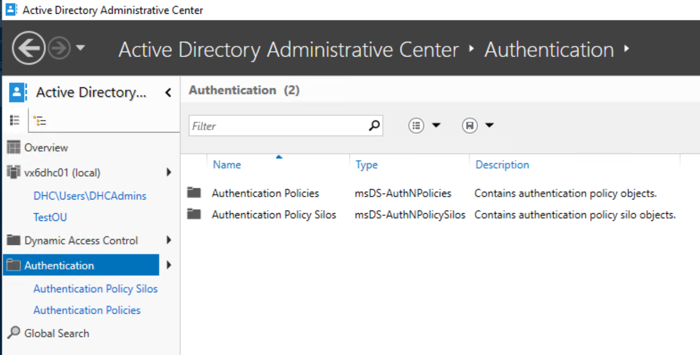
3. Following folders will be displayed **Authentication Policy** and **Authentication Policy Silo**;
4. In the **Authentication Policy** folder double click on **AuthPolicy-role-DomainAdministrators**;

  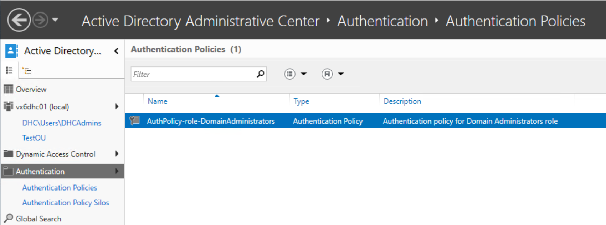
5. Check the settings of AuthPolicy-role-DomainAdministrators, **Enforce policy restrictions** has to be checked in;

  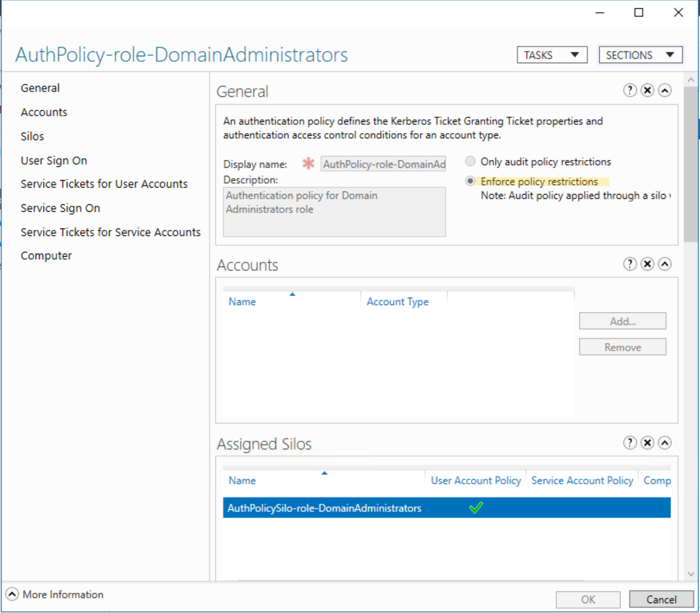
6. In **Authentication Policy Silo** folder double click on **AuthPolicySilo-role-DomainAdministrators**;

  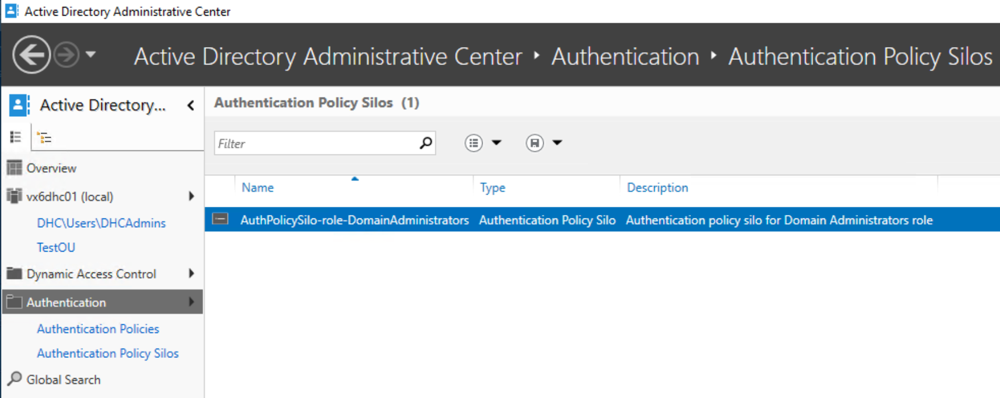
7. **Enforce silo policies** must be checked in for **AuthPolicySilo-role-DomainAdministrators**

  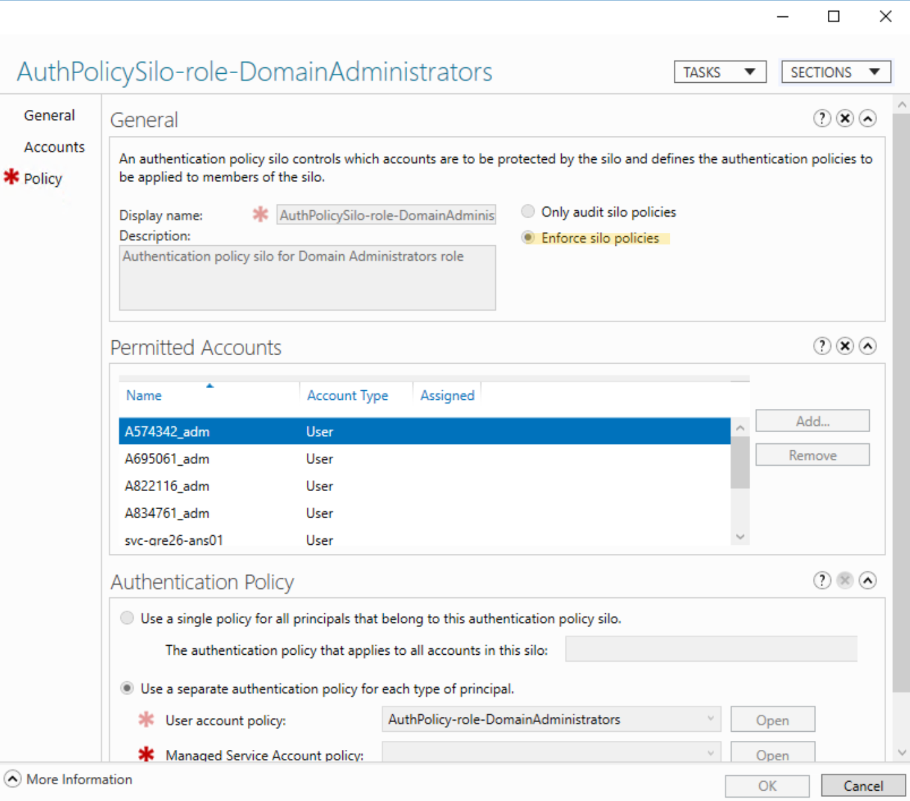

## O11 Servers with passwords unchanged for more than 45 days

### O11 Description

ORADAD scan ID: **vuln3_password_change_server_no_change_45**

Servers have not changed their computer account passwords for more than 45 days, indicating that their secrets are not being renewed.

>:bulb:**Recommendation:**
>
>In their default operation, servers automatically change their computer account password periodically (30 days by default). It is worth investigating the reason that prevents servers from changing their password.
>
>A first check is to check the value of the following registry entries:
>
>**HKLM\System\CurrentControlSet\Services\Netlogon\Parameters\DisablePasswordChange**  : must be **0** or not exist;
>**HKLM\System\CurrentControlSet\Services\Netlogon\Parameters\MaximumPasswordAge**  : must be **30**.
>If these values are incorrect, you should reset them to the default values and ensure that they are not set by a GPO.
>
>If these values are correct, check if the NETLOGON service is started with ```sc.exe query netlogon```.>
>
>Finally, it is necessary to verify that the machine password is synchronized with that of the machine account in the directory. This can be verified with the command ```nltest /SC_VERIFY:<DomainName>```, where DomainName is the NetBIOS name of the domain. In both checks, the command should return the return code 0 0x0 NERR_Success.

**VCS Development Environments**

The registry entries for *HKLM\System\CurrentControlSet\Services\Netlogon\Parameters\DisablePasswordChange* and *HKLM\System\CurrentControlSet\Services\Netlogon\Parameters\MaximumPasswordAge* are pushed through default Group Policies (GPOs) in all VCS environments.

The script checks for the GPOs that contain configured values for "Domain member: Disable machine account password changes" and "Domain member: Maximum machine account password age" policies and are linked to an Organizational Unit.

It checks if the configured policy values are different than the default ones and modifies them back to the default. Due to the fact that these are Local Security Policies pushed via GPO, the settings for these policies are stored in the SYSVOL shared folder, in the GPO's own GptTmpl.inf file.

```ansible
ansible-playbook remediateAdSecurityEnhancement24.yml --tags o11
```

### O11 Verification

1. Login to a **Domain Controller** using a Domain Administrator or a an **_ADM** user account.
2. In the **Start** menu search for **Group Policy Manager** console (gpmc.msc).
3. Navigate to **Group Policy Objects**, right click on one policy and select **Edit**.

  
4. In the **Group Policy Management Editor** browse to Computer Configuration \ Policies \ Windows Settings \ Security Settings \ Local Policies \ **Security Options**

  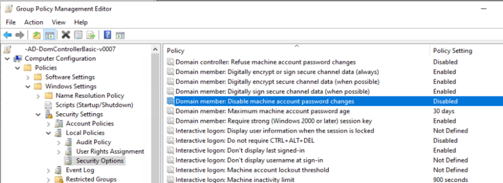
5. The policies will be displayed in the right pane, search for **"Domain member: Disable machine account password changes"**, the configured Policy Setting should be **Disabled**.
6. Repeat step 5 for policy **"Domain member: Maximum machine account password age"**, the configured value should be **30 days**.
   If these policies are not configured in the selected policy, restart from step 3 by selecting another policy.

## O12 Service accounts supported encryption algorithms

### O12 Description

ORADAD scan ID: **vuln3_kerberos_properties_encryption**

Service accounts that support Kerberos authentication (i.e., have a servicePrincipalName attribute) can use different encryption algorithms (DES, RC4, AES128, and AES256) for tickets issued to services running under the identity of those accounts.

For a given account in the directory, the msDS-SupportedEncryptionTypes attribute indicates to domain controllers the algorithms supported for the service running under that account's identity. By default, this attribute is empty, and only the RC4 algorithm is used.

If the service account is a "machine account" running under Windows, it will automatically update the attribute according to its capabilities. Since Windows Vista and Windows Server 2008, the machine usually indicates that it supports RC4, AES128, and AES256.

>:bulb:**Recommendation:**
>
>For service accounts that are not of type "machine account", it is necessary to explicitly specify support for AES128 or AES256 in the account options.
>
>This can be done by specifying the value 28 (0x1C) in the msDS-SupportedEncryptionTypes attribute of the user account or by enabling the specific option in its properties:
>
> - in the ```dsa.msc``` console, open the properties of the user concerned;
> - in the "account" tab, check the following options:
>   - "This account supports 128-bit AES encryption via Kerberos."
>   - "This account supports AES 256-bit encryption via Kerberos."
>Any incompatible software must be upgraded.

<!-- -->
>[!NOTE]
>Since November 2022 and the [KB5021131](https://support.microsoft.com/en-us/topic/kb5021131-how-to-manage-the-kerberos-protocol-changes-related-to-cve-2022-37966-fd837ac3-cdec-4e76-a6ec-86e67501407d) patch, the default value for algorithms (if the msDS-SupportedEncryptionTypes attribute is not present) includes the AES128_HMAC_SHA1 and AES256_HMAC_SHA1 protocols. However, it is still recommended to specify an explicit value.

```shell
ansible-playbook remediateAdSecurityEnhancement24.yml --tags o12
```

### O12 Verification

1. Login to a **Domain Controller** using an user account with elevated privileges (**Domain Admin** or **_ADM** account);
2. In **Active Directory Users and Computers** console, ensure that **Advanced features** view is enabled;
3. Search for **./DHC/Server/{locationCode}** OU;
4. Right click on a computer account and in the **Properties** window select the **Attribute Editor** tab;
5. Browse for the **msDS-SupportedEncryptionTypes** attribute and check the configured value; the correspondent value for **decimal 24** is **0x18=(AES128_CTS_HMAC_SHA1_96|AES128_CTS_HMAC_SHA1_96)**.

  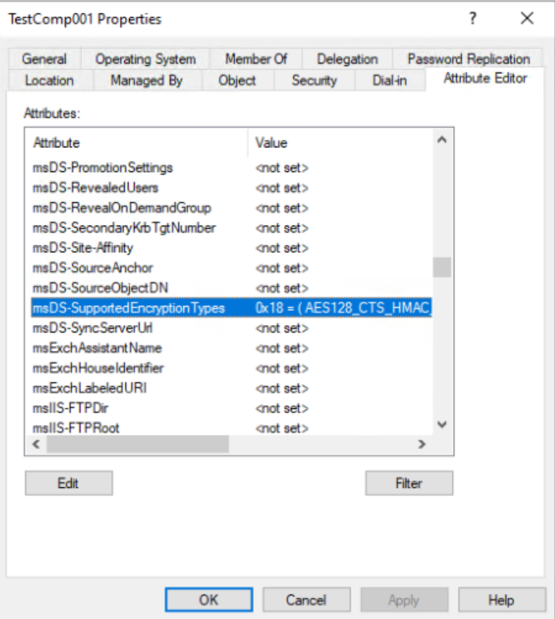

## O13 Unrestricted domain join

### O13 Description

ORADAD scan ID: **vuln4_user_accounts_machineaccountquota**

By default, authenticated users can join 10 machines to the domain. This value is controlled by the **ms-DS-MachineAccountQuota** attribute of the domain root.

The added machine accounts are then owned by the account used, giving it full control over them. The **CVE-2021-42287** vulnerability used joined machines to achieve privilege escalation.

>:bulb:**Recommendation:**
>
>Set the **ms-DS-MachineAccountQuota** attribute to **0** at the root of the affected domains. The correction is usually done using the ```dsa.msc```, ```adsiedit.msc``` consoles or the ```ldp utility```.

```ansible
ansible-playbook remediateAdSecurityEnhancement24.yml --tags o13
```

### O13 Verification

1. Log in to a **Domain Controller** by using an elevated privileges user account (Domain Administrator or **_ADM account**);
2. Open **Active Directory Users and Computers** console and change the **View** to **Advanced Features**;
3. In the left pane, browse to **../DHC/Groups/Resource groups** and search for resource group **rsce-dhc-ad-g-domainjoin** in the right pane, right click on it and select **Properties**;

  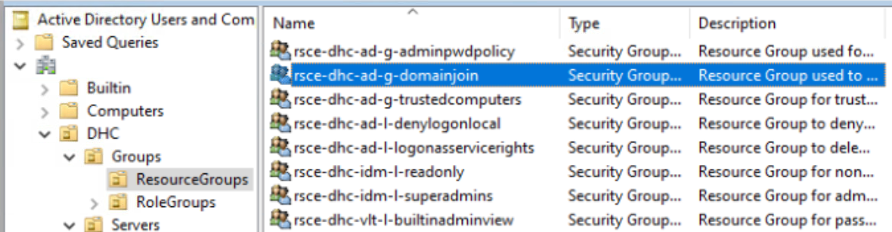
4. Select the **Members** tab in the Properties window and check if role group **role-{locationCode}-g-platformadministrators** is present;

  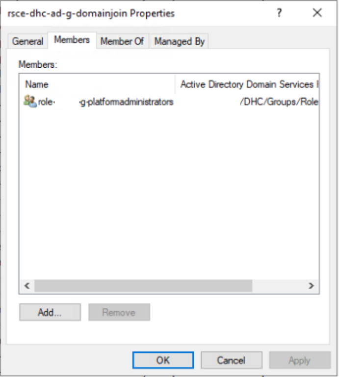
5. Close the Properties window and browse to **../DHC/Servers** OU, right click on it and select **Properties**;

  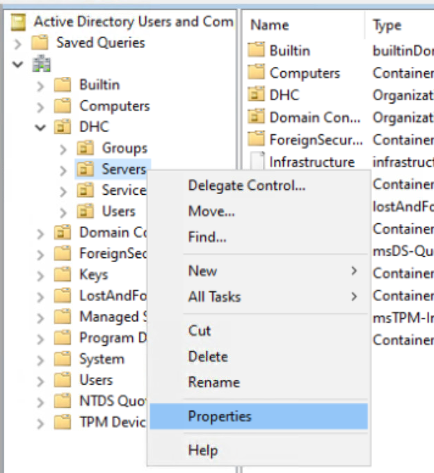
6. In the **Properties** window select the **Security** tab;

  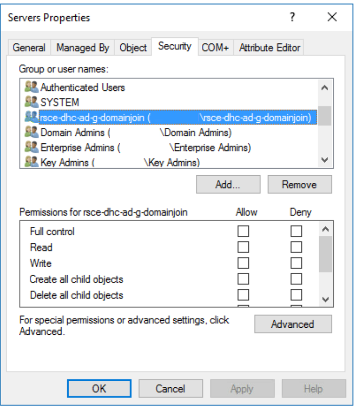
7. Click on **Advanced**, in the **Advanced Security Settings** windows check for permissions assigned to **rsce-dhc-ad-g-domainjoin** group.

  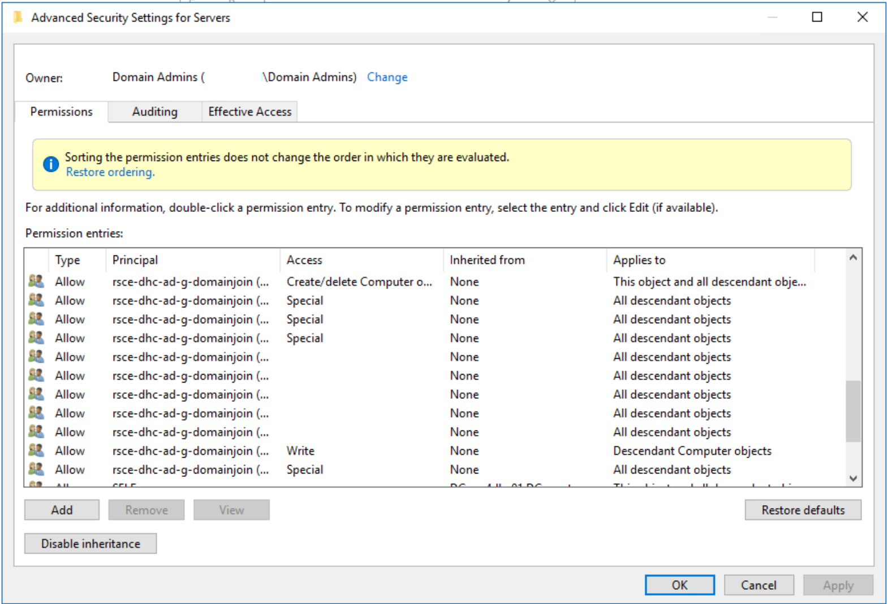
8. Open **Group Policy Management Console** and browse for the GPO named **{customerCode}-AD-MemberServerBasic-v0007**, found in **./DHC/Servers** OU. Check the setting for policy **Add workstations to domain** found in **Policies/Windows Settings/Security Settings/Local Policies/User Rights Assignment**, the value must contain the **rsce-dhc-ad-g-domainjoin** resource group.

  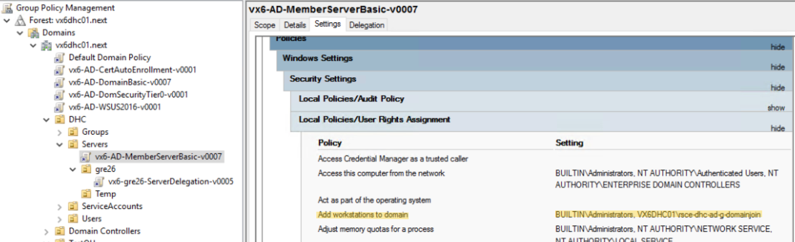

## O14 Use of the "Pre-Windows 2000 Compatible Access" group

### O14 Description

ORADAD scan ID: **vuln3_compatible_2000_not_default**

The pre-Windows 2000 compatibility mechanism is enabled for some accounts. This mechanism allows access to certain RPCs to group members, BuiltIn\Pre-Windows 2000 Compatible Access. According to the system setting, the built-in group Everyone may contain anonymous users, which may increase risk if it is a member of the backwards compatibility group.

>:bulb:**Recommendation:**
>
>The pre-Windows 2000 compatibility mechanism provides support for Windows NT-like domains. Historically used for backward compatibility reasons, the group BuiltIn\Pre-Windows 2000 Compatible Access must contain only Authenticated users (S-1-5-11).

<!-- -->
>[!NOTE]
> ADCS servers are registered in this group when they are installed. In most cases, membership in this group is not necessary and can be removed. This operation is easily reversible.

```ansible
ansible-playbook remediateAdSecurityEnhancement24.yml --tags o14
```

### O14 Verification

1. Login to a **Domain Controller** using a user account with elevated privileges (**Domain Admin** or **_ADM** account);
2. In **Active Directory Users and Computers** console, ensure that **Advanced features** view is enabled;
3. Search the **BuiltIn** OU;
4. Right click on **Pre-Windows 2000 Compatible Access** group and select **Properties**;
5. In the **Members** tab verify the membership: **Authenticated Users**.

  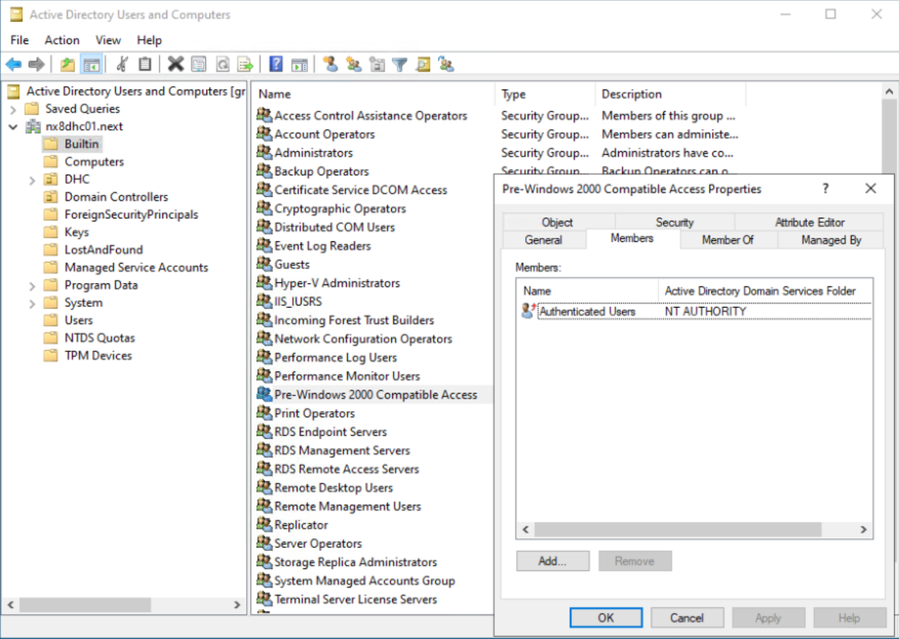

## O15 Dangerous permissions on the DnsAdmins group

### O15 Description

ORADAD scan ID: **vuln1_dnsadmins**

The ```DnsAdmins``` group includes some non-privileged member accounts that have dangerous permissions set.

Members of the DNSAdmins group are granted access rights to manage a Microsoft DNS service, which is often hosted on domain controllers.

Those access rights grant at least the following abilities: managing the entirety of domain-level DNS zones, using debug features or undocumented features such as the ability to instantly restart or stop the DNS server.

One of these rights allows the user to make the DNS service run arbitrary code via the ```serverlevelplugindll``` feature, depending on the patch level or on specific configuration of all Windows Servers running DNS services across the forest.

Despite [an official fix being available](https://msrc.microsoft.com/update-guide/vulnerability/CVE-2021-40469), these dangerous features may still be re-enabled. Evaluating the security of the running configuration cannot be done solely based on Active Directory-stored parameters, just as it is impossible to ensure that all running Microsoft DNS servers are up to date.

This provides an attacker with significant nuisance capabilities or could even facilitate network attacks. This group should therefore be considered privileged.

>:bulb:**Recommendation:**
>
>The ```DnsAdmins``` must not be used: manual DNS zone delegations must be used instead to manage the service (zone creation/deletion, record management, ...). These delegations are usually granted through the LDP utility. This is a two-step process:
>
>**Step 1: Allow access to RPC used by DNS management MMC snap-in**
>
>In the domain naming context, under the ```CN=System``` container, set the following access rights on the ```CN=MicrosoftDNS``` container:
>
>| x | x | x | x |
>| --- | --- | --- | --- |
>|[x]Read property    |[ ]Write Property |[ ]Create Child |[ ]Control access|
>|[x]List             |[ ]Write DACL     |[ ]Delete child |[ ]Extended write|
>|[x]List object      |[ ]Write owner    |[ ]Delete       |                 |
>|[x]Read permissions |[ ]Write SACL     |[ ]Delete tree  |                 |
>
>**Step 2: allow DNS zone modifications**
>
>In the ```DC=DomainDnsZones``` naming context, on every zone you wish to delegate management, enable inheritance and set the following access rights on the ```CN=MicrosoftDNS``` container:
>
>| x | x | x | x |
>| --- | --- | --- | --- |
>|[x]Read property    |[ ]Write Property |[x]Create Child |[ ]Control access|
>|[x]List             |[ ]Write DACL     |[x]Delete child |[ ]Extended write|
>|[x]List object      |[ ]Write owner    |[x]Delete       |                 |
>|[x]Read permissions |[ ]Write SACL     |[x]Delete tree  |                 |
>
>Note: to change the current naming context in ```ldp```, go to View, Tree, and use the drop-down list to select DomainDnsZones.
>
>Additionally, the following operations must be carried out on the DnsAdmins group:
>
>- empty it of all its members;
>- make sure the group is owned by Domain Admins;
>- add an Access Control Entry forbidding Everyone to change its owner, change its access rights, and write its list of members.

```ansible
ansible-playbook remediateAdSecurityEnhancement24.yml --tags o15
```

The playbook creates resource group **rsce-dhc-ad-dnsadmins** and assigns permissions over DNS Manager.

### O15 Verification

1. On the terminal server (**TSS**) open **Active Directory Users and Computers** and in the **View** tab select **Advanced Features**.
2. Navigate to **./DHC/Groups/Resource Groups** OU, search for resource group **rsce-dhc-ad-g-dnsadmins**, right click on it and select **Properties**;
3. In the Members tab, check if the role group **role-{locationCode}-g-platformadministrators** is present;

  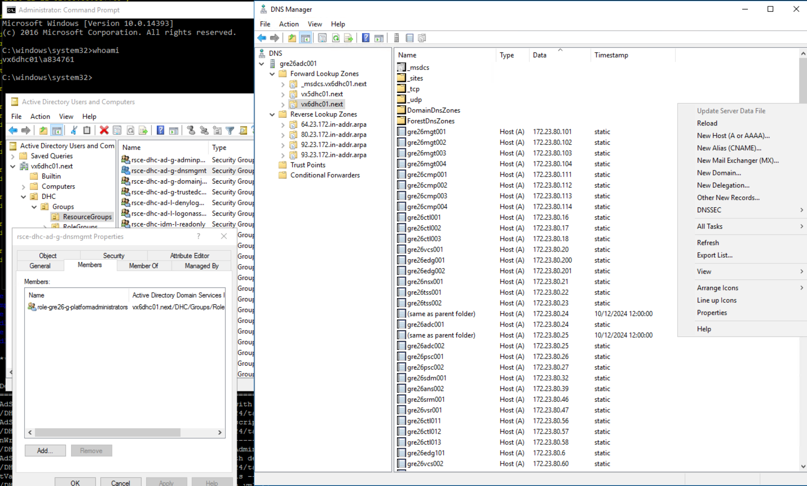
4. Browse to **./System/MicrosoftDNS** folder, right click on it and select **Properties**;
5. In the **Security** tab check for the presence of resource group **rsce-dhc-ad-g-dnsadmins**, select it and verify the permissions for it: **Allowed** for **Read** and **Special permissions**

  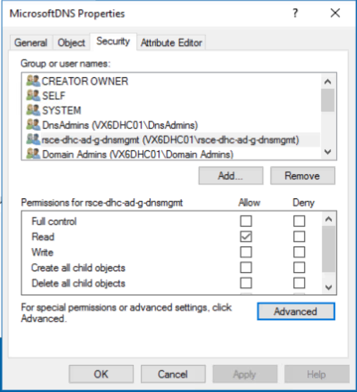
6. Open **DNS Manager** and connect to one of the domain controllers, **{locationCode}adc001** or **{locationCode}adc002**;
7. If the connection is permitted, on the left side, expand the folder tree and in the **Forwarded Lookup Zones** folder, right click on one of the listed zones;
8. Check if *Reload*, *New Host (A or AAAA)...*, (etc.) options are available (not greyed out) and click on **Properties**;
9. Verify in the **Security** tab the presence of resource group **rsce-dhc-ad-g-dnsadmins** and its permissions,  **Allowed** for **Read**, **Create all child objects**, **Delete all child objects** and **Special permissions**;

  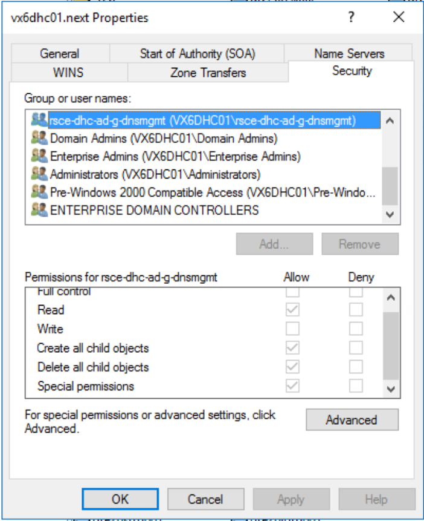

## O16 Disabled or expired accounts in privileged groups

### O16 Description

ORADAD scan ID: **warn4_privileged_members_expired_disabled**

Privileged groups in the forest contain disabled or expired accounts.

**NB**: integrated ```RID-500``` accounts are excluded from the aforementioned list.

>:bulb:**Recommendation:**
>
>Disabled or expired accounts must be removed from privileged groups to negate the impact of an accidental reactivation.
>
>**Context: privileged groups**
>
>Privileged groups include administrator groups and operator groups, which have full control over the Active Directory forest either by design or by granting themselves such privileges:
>
>- *Administrators*;
>- *Domain Controllers*;
>- *Schema Admins*;
>- *Enterprise Admins*;
>- *Domain Admins*: these administrators can read the authentication database and extract password hashes and other secrets of all privileged accounts;
>- *Key Admins* and  *Enterprise Key Admins*: these administrators can set arbitrary values to attributes relating to Windows Hello for Business, for all users except those protected by the adminSDHolder mechanism. If certificate-based authentication has been enabled, they can generate a certificate that they control, assign it to privileged accounts (for instance, a domain controller), and log on as them.
>- *Account Operators*: these operators can manage user accounts, machine accounts, and groups except accounts protected by the adminSDHolder mechanism;
>- *Server Operators*: these operators can manage domain controllers, which grants them the ability to recover privileged user secrets directly from the authentication database;
>- *Backup Operators*: these operators can back up a domain controller, which grants them the ability to recover privileged user secrets from that backup;
>- *Print Operators*: these operators can load arbitrary printer drivers on domain controllers, which grants them the ability to recover privileged user secrets directly from the authentication database (by loading a malicious driver).
>
>The *operators* group is empty by default and must not have any members.

```ansible
ansible-playbook configureUserPasswordExpiryNotification.yml
```

The playbook creates a scheduled task on the 2nd terminal server (**TSS002**) that runs daily at 06:00 local time. It checks for user accounts for which the password will expire in the following 7 days and sends an email reminder to the account owner.

Playbook documentation: *wiReportingOverview.md*

**Prerequisites:** every user account from **./DHC/Users OU** (not service accounts, svc-{locationCode}-***) requires a valid email address.

**Optional:** Depending on the environment, the engineer must validate whether disabling of unused accounts is needed. If so, execute the following playbook:

```ansible
ansible-playbook addUserValidityScheduledTask.yml
```

The playbook creates a scheduled task on the 2nd terminal server (**TSS002**) that runs daily at 06:00 local time. It checks for user accounts that have not been used for 14 days, disables the inactive accounts, and sends an email notification to the account owner.

### O16 Verification

Log into the second terminal server (**TSS002**), open **Task Scheduler** and search for following scheduled tasks:

- **UserPasswordExpiryNotification**

  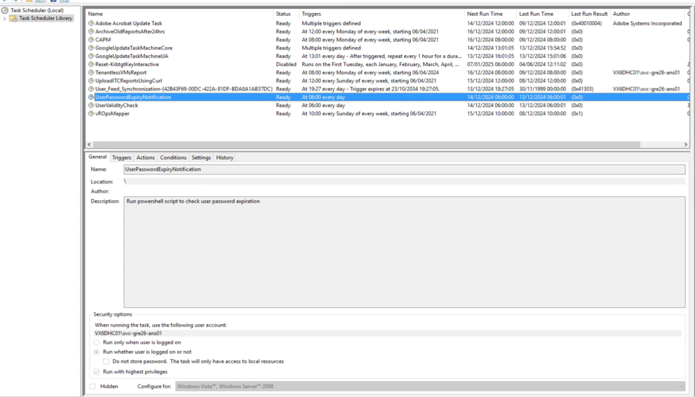

**Additional checks**: Each scheduled task triggers a PowerShell script saved locally at **D:\Scripts\UserPasswordExpiryNotification**. Log files are created at the same location each time a script is triggered.

- **UserValidityCheck** (if the second task was configured)

  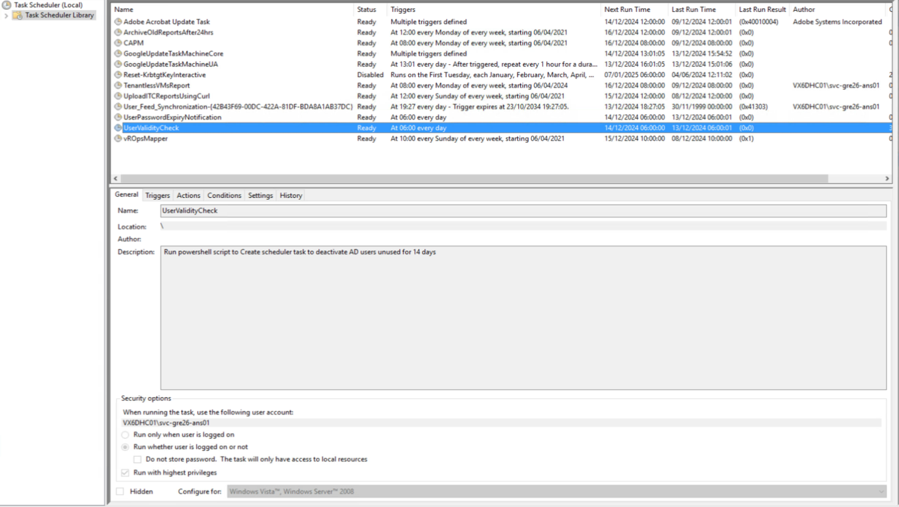
