# VCS Add/Modify Storage LUNs on Cloud Hosts (ESXi)

## Table of Contents

- [VCS Add/Modify Storage LUNs on Cloud Hosts (ESXi)](#vcs-addmodify-storage-luns-on-cloud-hosts-esxi)
  - [Table of Contents](#table-of-contents)
  - [Introduction](#introduction)
    - [Purpose](#purpose)
    - [Audience](#audience)
  - [Scope](#scope)
    - [Prerequisites](#prerequisites)
    - [Action Plan](#action-plan)
    - [Add LUN storage to the Cloud Hosts (ESXi)](#add-lun-storage-to-the-cloud-hosts-esxi)
    - [Modify Storage LUNs on the Cloud Hosts (ESXi)](#modify-storage-luns-on-the-cloud-hosts-esxi)
  - [Changelog](#changelog)

## Introduction

### Purpose

This instruction covers the action of Adding/Modifying Storage LUNs on Cloud Hosts (ESXi).

### Audience

- VCS Engineers
- VCS Architects

## Scope

The Instruction assumes that the reader has reasonable grasp of VCS infrastructure and VMware components.

### Prerequisites

- Access to the vCenter
- Access to the HashiVault
- Access to the vRA
- Client Aviva visibility in SNOW
- Basic vCenter Knowledge
- Basic SRM Knowledge

### Action Plan

If the LUN is not already added to the environment, before starting the action engineer needs to open the service request for a NetApp team to create/modify the LUN on their site.

To do this csv from the <b>DevSecOps SharePoint /clients/Aviva/Storage</b> have to be filled based on the LUN request.

Only the fields below should be filled:

- <b>Server Name</b> - Example: <b>LBG01-c01-vmfs01lun05-Bronze_Non_Prod_LBG_BBP</b>

 >Note. Be Aware that above Server Name is in real LUN name in vCenter which should be constructed as follows: 
 ><b>\<locationCode>-\<clusterNumber>-\<dataStoreType>\<dataStoreNumber>lun\<LUNNumber>-\<SRMProtectionGroupName>"</b>  
 > <b>dataStoreType</b> as default should be VMFS, if other it should be requested and discussed wider  
 > <b>dataStoreNumber</b> should be marked as same as for the other datastores in group  
 > <b>LUNNumber</b> should be marked as next after the highest number visible for LUNs  
 > The <b>SRMProtectionGroupName</b> variable is one of the protection groups that can be found in the Site Recovery <b>Protection Groups</b> Tab.  
 >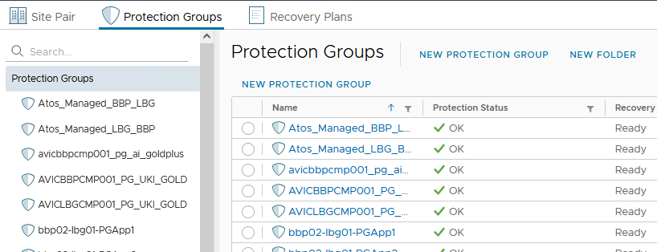

- <b>Action</b> - Choose action from dropdown.
- <b>Site</b> - Choose the site - for example. BBP
- <b>Storage Tier</b> - Choose the Replication storage Tier (fill only if replication needed).
- <b>Replication?</b> - Y - as default, N - If replication is not needed.
- <b>Shared with</b> - List of the hosts that should share the LUN. By default all the hosts in the cluster.

When the csv is finished, it should be attached to the RITM for the Netapp team.
Opening the RITM requires engineer to log in into the SNOW, choose Atos Internal Service Catalog, move to the Internal Service Request, descend to the Internal Service Request and fill all the fields.

Fields should be filled similarly to example below:

- Requested Delivery Date: <b>2024-01-12 18:00:00</b>
- Summary: <b>For logging general internal requests</b>
- Description: <b>new datastore is needed for Storage_Policy_Class repl Replication_Tier_Class LBG VCS</b>
- Priority: <b>3 - Medium</b>
- Client: <b>Aviva</b>
- Assign To: <b>IN.Cloud.Storage.Aviva</b>

After such RITM will be sent the response from the Netapp team is required.

Response if RITM is opened correctly will consist of the <b>vserver path, size, serial hex, and LUN ID</b>.

### Add LUN storage to the Cloud Hosts (ESXi)

Addition of the LUN storage requires below steps:

1. Log in to the vCenter on the site where the LUN will be added.

    >Note: vCenter FQDN: https:\<locationCode>vcs001.\<SearchDomain>

2. On the other Tab Log in to the HashiVault on both DR sites and find the vcs001 entry with <administrator@vsphere.local> credentials

    >Note: HashiVault FQDN: https:\<locationCode>hsv001.\<SearchDomain>:8200

3. In the vCenter choose one of the compute cluster hosts. Click right on it and find <b>Storage</b>, click it and choose option <b>New Datastore...</b>

    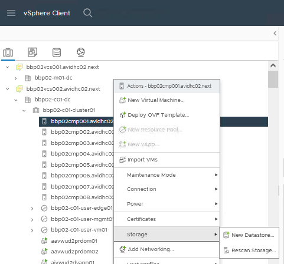

4. In the First step choose the VMFS storage type.

    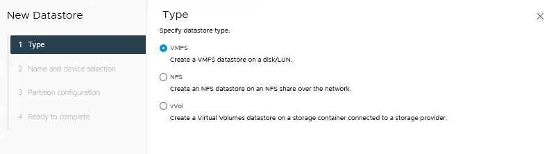

5. Second step requires to change storage Name to the one that was selected in the csv template. After filling the name choose the LUN with ID corresponding to the one pointed by NetApp team.

    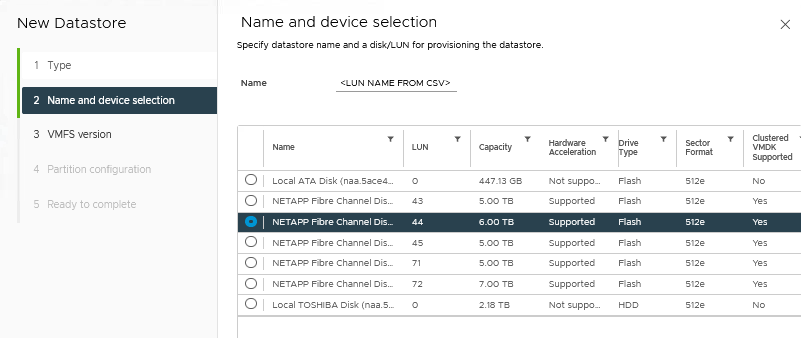

6. On step three choose VMFS 6 option and proceed.

    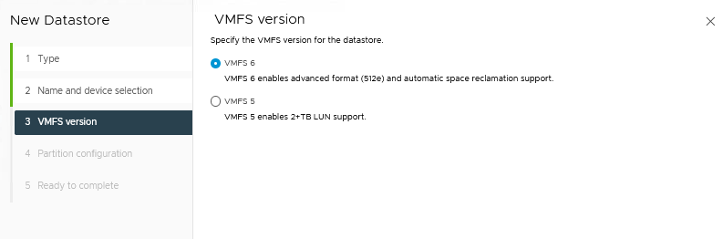

7. Step four requires to use the size requested for the Datastore. Other fields should stay as they are.

    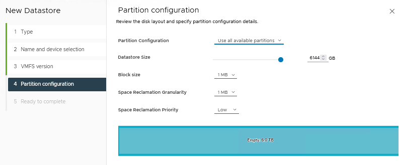

8. In the completion step check if all the details are alright and finish the action.

    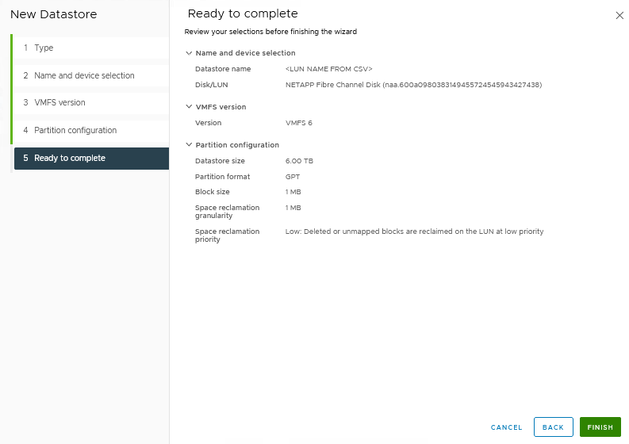

9. After the addition of the disk is finished wait till the task for this action on the host will be completed.

    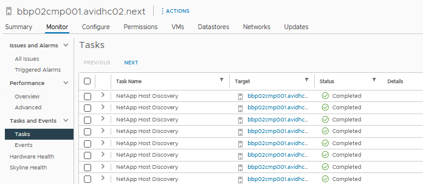

10. Navitage to the Datastores in the vCenter and move freshly created LUN to the group corresponding to the naming convention of the LUN's SRMProtectionGroupName.

    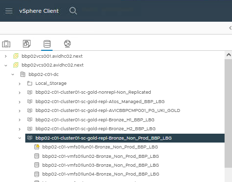

11. Perform additional checks after task is finished. Find the Site Recovery (later SRM) in the vCenter.

    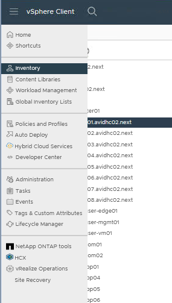

12. Click <b>Open Site Recovery</b>.

    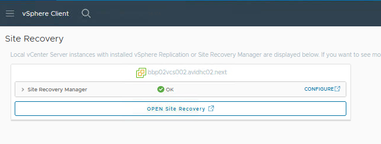

13. On the first login screen use the administrator credentials for the main site.

    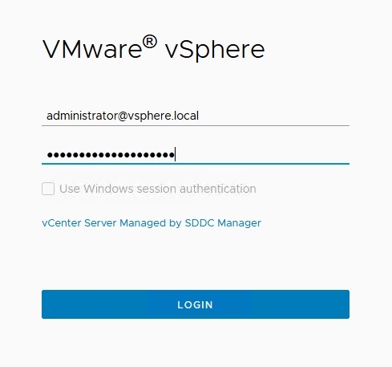

14. Choose the site pair and clikc <b>View Details</b>.

    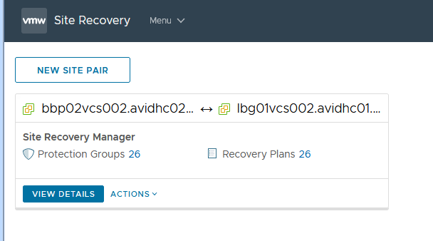

15. Log in with the mirror site administrator credentials.

    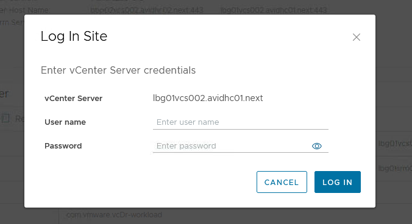

16. Choose the Array Pairs

    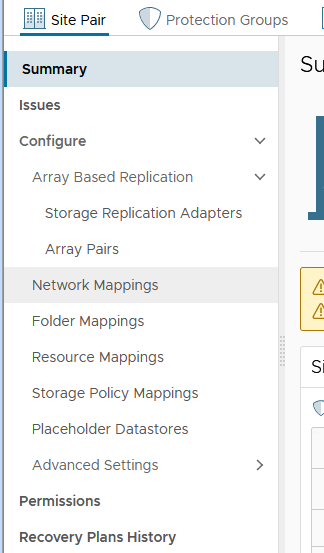

17. Click on the Array Pair and look into the Devices table, find freshly Added LUN, if not visible, click on Discover Devices, wait and check after a short while.

    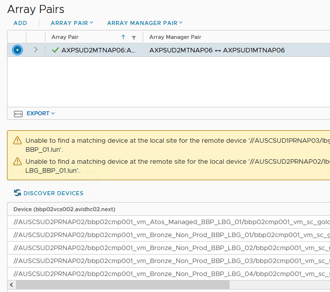

18. For the replicated LUN datastores there is additional step in SRM. Under the protection Groups, find the protection group from the SRMProtectionGroupName and add to it created LUN.

    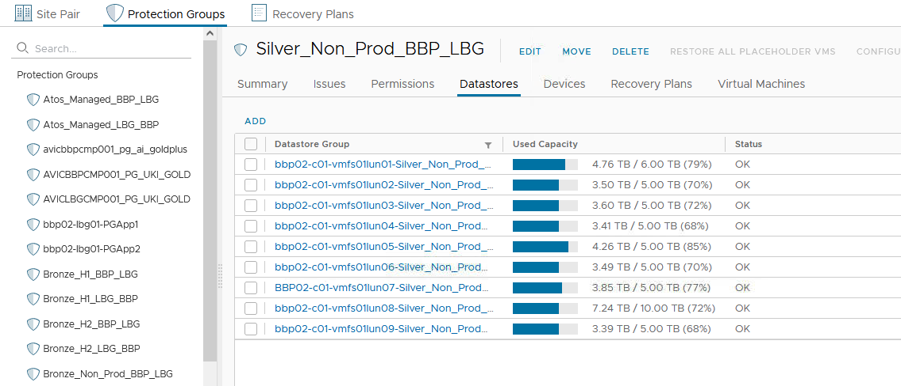

    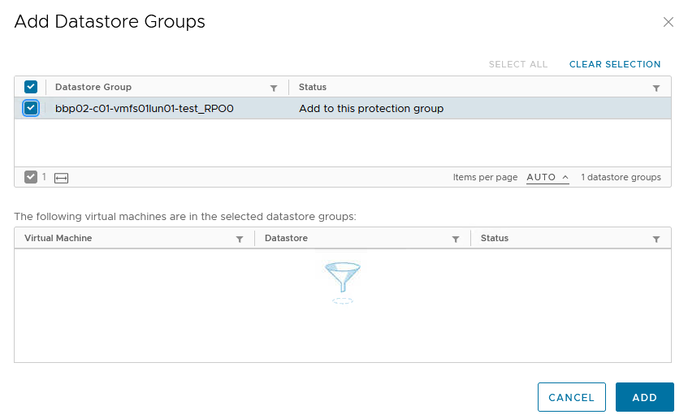

19. Last step will be to reach the vRA and add the tags to the datastore created.

    >Note: vRA FQDN: https:\<locationCode>vra001.\<SearchDomain>

20. After logging in the vRA with domain user credentials choose <b>Assembler</b> Component.

    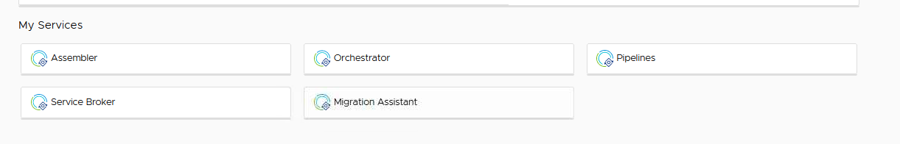

21. Reach to the <b>Infrastructure</b> tab, there under <b> Resources</b> find <b>Storage</b> and choose the <b>Datastores/Clusters</b> tab.

    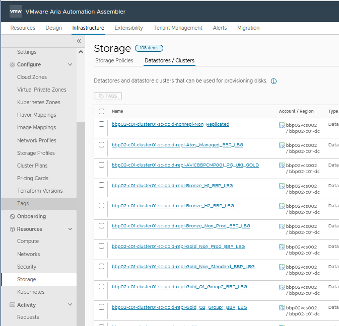

22. Here find created LUN, choose it and click the <b>TAGS</b> button.

    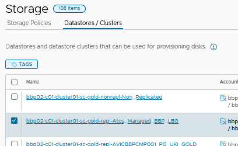

23. Here add 4 additional tags to the LUN:

    1. <b>storagePG:</b> Storage Protection Group tag
    2. <b>StorageClass:</b> Storage Policy tag
    3. <b>Storage Replication:</b> yes/no
    4. <b>StorageProtectedSite:</b> LUNs main site location code

    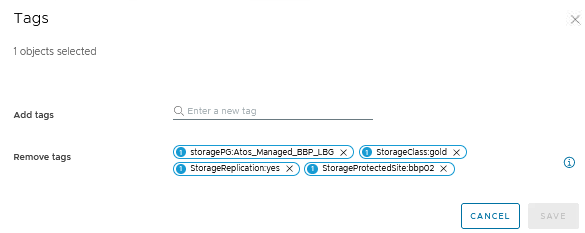

24. After adding tags the LUN storage addition is complete.

### Modify Storage LUNs on the Cloud Hosts (ESXi)

1. Log in to the vCenter on the site where the LUN will be added.

    >vCenter FQDN: https:\<locationCode>vcs001.\<SearchDomain>

2. From the Datastores list, find the one that you'd like to extend and choose the <b>Increase Datastore Capacity...</b> option.

    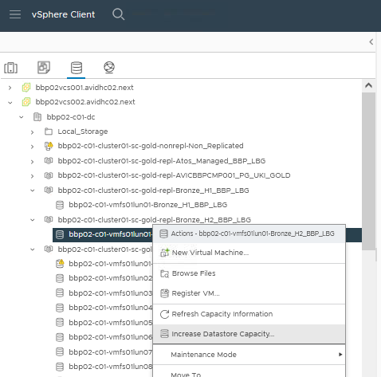

3. Select the device with right LUN ID

    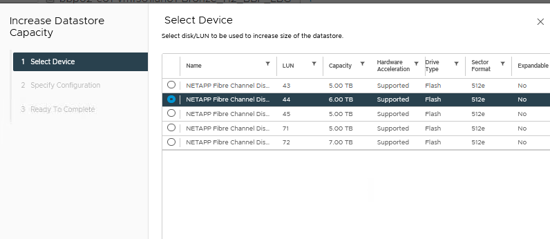

4. In the next step increase space by the amount pointed in the csv file only.

    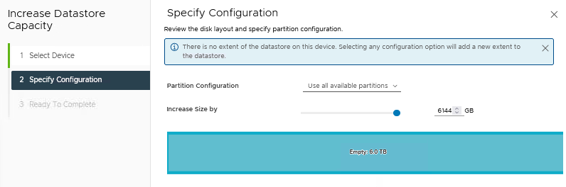

5. On the last step check if the details checks out and finish the action.

    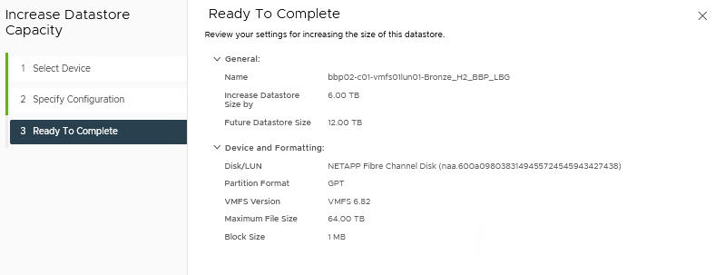

6. Follow the steps from 9 onwards from LUN addition part.

## Changelog

| Version | Date          | Description                                                                                                                                                         | Author             |
|---------|---------------|---------------------------------------------------------------------------------------------------------------------------------------------------------------------|--------------------|
| 0.1     | 19/02/2024    | First version | Michał Sobieraj |
