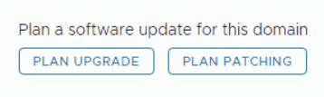
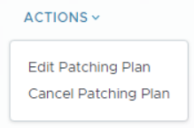
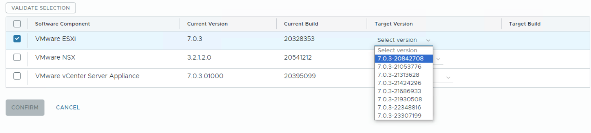
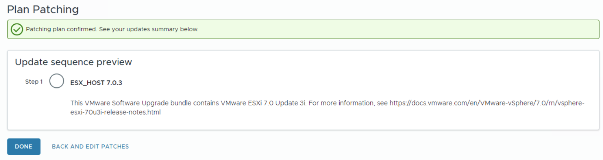

# Async Patch Tool

## Changelog
  
| Date       | Issue    | Author          | TOS  |Description                                                  |
| ---------- | -------- | --------------- | ---- | ------------------------------------------------------------ |
| 16/09/2022 | CESDHC-3891 | Bojan Dragic | |First version |
| 26/09/2022 | CESDHC-5152 | Robert Kaminski | | Document review and adjustments |
| 26/09/2022 | CESDHC-4636 | Pawel Holi | | Adjustments for VCF 4.5/VCS 1.6 |
| 24/03/2025 | VCS-14130 | Mariusz Stanek | | Adjustments for VCF 5.2 |
| 10/06/2025 | VCS-15775 | Adam Szymczak | | Added section on automation |
| 30/09/2025 | VCS-16713 | Adam Szymczak | | Added section on cluster images |
| 25/02/2026 | VCS-17325 | Stanislaw Kilanowski | | Added note on manual patching |

## Introduction

### Purpose

Describe patching of VCF components after upgrade to VCF 5.2 so VCS-2.0. Async patch tool is not used anymore since patching possibility is now a part of SDDC Manager functionality.

### Audience

- VCS Operations

### Scope

1. Applying critical patches for VCF components.
2. Enabling upgrade to a later version of VMware Cloud Foundation.

## Related Documents

| Document |
|---|
| [LLD Disaster Recovery](../design/lldDisasterRecovery.md) |
| [wiLifeCycleManagement](wiLifeCycleManagement.md) |

## Prerequisites

SDDC Manager must be version 5.2 or later.

## Manual patching steps

Once SDDC Manager is upgraded to 5.2 or later, a new option for patching VMware Cloud Foundation components is available in the SDDC Manager UI.

The patch planner provides the ability to apply async patches to management and workload domain components. If you are connected to the online depot, async patches are available in the patch planner. If you do not have access to the online depot, use the Bundle Transfer Utility to download async patches and add them to an offline depot or upload them directly to SDDC Manager.

> [!IMPORTANT]
> If the target cluster is image-based you will need to create a new cluster image with the target ESXi version and extract it to the SDDC Manager. To complete this using the automation, please follow the section [Create and import cluster image to SDDC Manager](#create-and-import-cluster-image-to-sddc-manager).

To patch components using the SDDC Manager:

1. In the navigation pane, click `Inventory` > `Workload Domains`.
2. On the Workload Domains page, click the domain you are patching and then click the `Updates` tab.
3. Click `Precheck` to run the upgrade precheck.
Resolve any issues before proceeding with an upgrade.
4. In the Available Updates section, click `Plan Patching` create a new patching plan or select `Edit Patching Plan` from the `Actions` menu to modify a patching plan.

   
   

   IMPORTANT NOTE: You cannot plan patching if you have an existing upgrade plan. Cancel the upgrade plan to create a patching plan.
5. Select the components to patch and the target versions and then click `Validate Selection`.

   

   IMPORTANT NOTE: When you select a target vCenter version, the UI indicates which versions support vCenter Reduced Downtime Upgrade (RDU).
6. After validation succeeds, click `Confirm`.
7. Review the update sequence based on your target version selections and click `Done`.

   
8. In the Available Updates screen, click `Schedule Update` or `Update Now` to update the first component.
Continue to update the VCF BOM components until they are all updated.

## Automation

Async patches can also be installed for ESXi hosts and vCenter by using `updateVcfAsync.yml` playbook.

### Prerequisites

For automation to work Broadcom depot download token must be saved in Vault (in sdm001 server folder).

Token can be collected and saved in Vault using playbook:

```shell
ansible-playbook updateVcfAsync.yml --tags saveDepotToken
```

### Create Async Patch version report

To create Async Patch version report run below playbook:

```shell
ansible-playbook updateVcfAsync.yml --tags checkBundles
```

Playbook will create an e-mail report containing following information:

- current ESXi/vCenter versions on each domain present in SDDC Manager
- newest Async Patch bundle versions for ESXi and vCenter
- upgrade decision (which product to upgrade next)
- report creation errors (if any were encountered)
- domain precheck results (in attached csv file)

Report name is by default `DHC-<customerCode>-<locationCode>-AsyncPatchReport`.
If there is need to use different `customerCode/locationCode` extra variables `reportCustomer/LocationCode` can be used accordingly.

Report by default is delivered to DHC DevSecOps mailbox (`DHC-DevSecOps@atos.net`).
This can be changed by providing `emailReportRecipients` extra variable on playbook execution.

Upgrade decision is based on below rules:

- vCenter updates are always selected first
- Management domain updates take priority over workload domains

This means updates are selected in following order:

1. Management domain vCenter
2. Workload domain vCenters
3. Management domain ESXi hosts
4. Workload domain ESXi hosts

### Download selected bundle to SDDC Manager

To download selected Async Patch bundle to SDDC Manager run following playbook:

```shell
ansible-playbook updateVcfAsync.yml --tags downloadBundle -e "version=<version>"
```

Required extra variable:

- `version` - product version for which bundle is to be downloaded, it has to be numerical version type containing build number (example - `7.0.3-21686933`)

Bundle download can take from 15 to over 60 minutes depending on selected product and internet connection speed.
In case of error playbook will return failed task name and stop any further actions.
When executed as part of scheduled cron job it will also send e-mail notification with error details.

### Create and import cluster image to SDDC Manager

For vCenter clusters managed using cluster images there is a need to provide cluster image with target ESXi version when scheduling patching from SDDC Manager. Such image needs to be created and imported into SDDC Manager.

To create cluster image with selected ESXi version on vCenter and import it to SDDC Manager run:

```shell
ansible-playbook updateVcfAsync.yml --tags createClusterImage -e "version=<version>"
```

Required extra variable:

- `version` - ESXi version for which image is created, it has to be numerical version type containing build number (example - `7.0.3-21686933`)

Playbook executed with this tag will:

- setup proxy on vCenter for duration of playbook execution
- configure vCenter LCM depot
- check if ESXi cluster image with desired version is available
- create ESXi image on first viable vCenter cluster
- export created image to SDDC Manager

If SDDC Manager already had cluster image with target version present, new image won't be created.

### Trigger precheck

SDDC Manager domain precheck can be triggered separately using below playbook.

```shell
ansible-playbook updateVcfAsync.yml --tags updatePrecheck -e "domainName=<domainName>"
```

Extra variable `domainName` is required and must be name of domain present in SDDC Manager (example - `gre25-m01`).
Precheck report is generated in `/home/< executingUserName >/domainPrecheckResults` folder on Ansible Core machine.

### Schedule Async Bundle installation

Once downloaded, Async Patch bundle installation can be started using:

```shell
ansible-playbook updateVcfAsync.yml --tags scheduleUpdate -e "version=<version> domainName=<domainName>"
```

Required extra variables:

- `version` - product version for which bundle is to be installed, it has to be numerical version type containing build number (example - `7.0.3-21686933`)
- `domainName` - name of domain to install bundle on (example - `gre25-m01`)

Optional extra variables:

- `emailReportRecipients` - select recipients for both version and installation reports
- `reportCustomer` - select custom customerCode used in report names
- `reportLocationCode` - select custom locationCode used in report names
- `updateTime` - delay bundle installation until provided date (ISO 8601 UTC time format, for example `2025-01-13T11:36:45Z`)
- `precheckValidation` - when set to `false`, playbook will skip SDDC domain precheck validation tasks

If required bundle is not found it will be downloaded during playbook execution.
If required cluster image is not found it will be created and imported during playbook execution.

Running this playbook starts the update workflow on SDDC Manager as long as domain prechecks are not failing by default (in that case playbook will fail).
Update is started immediately but can be scheduled to run at specific time by providing `updateTime` extra variable.
Once scheduled the update workflow is monitored by playbook - it will send email report once update is completed or fails.

### Automated patch selection and installation based on report

Updates can also be installed automatically by running playbook without any tags:

```shell
ansible-playbook updateVcfAsync.yml
```

Running this playbook will:

- create and send Async Patch version report
- download and upload bundle determined by upgrade decision calculated during report creation
- create and import cluster image if upgraded cluster is image managed
- install downloaded bundle on domain selected during report creation

Optional extra variables:

- `emailReportRecipients` - select recipients for both version and installation reports
- `reportCustomer` - select custom customerCode used in report names
- `reportLocationCode` - select custom locationCode used in report names
- `updateTime` - delay bundle installation until provided date (ISO 8601 UTC time format, for example `2025-01-13T11:36:45Z`)
- `precheckValidation` - when set to `false`, playbook will skip SDDC domain precheck validation tasks

### Configure cronjobs

There are two options for scheduled run of the automation playbook.
First one is to execute version report creation only, which can be configured by running:

```shell
ansible-playbook updateVcfAsync.yml --tags configureCronReport
```

Second option is to schedule full playbook run, which includes update installation:

```shell
ansible-playbook updateVcfAsync.yml --tags configureCronInstall
```

Optional extra variables:

- `emailReportRecipients` - select recipients for both version and installation reports
- `reportCustomer` - select custom customerCode used in report names
- `reportLocationCode` - select custom locationCode used in report names
- `cronSchedule` - by default cron job is scheduled to run each Monday at 3 AM (`0 3 * * 1`), this can be changed by providing different cron schedule expression in this variable
