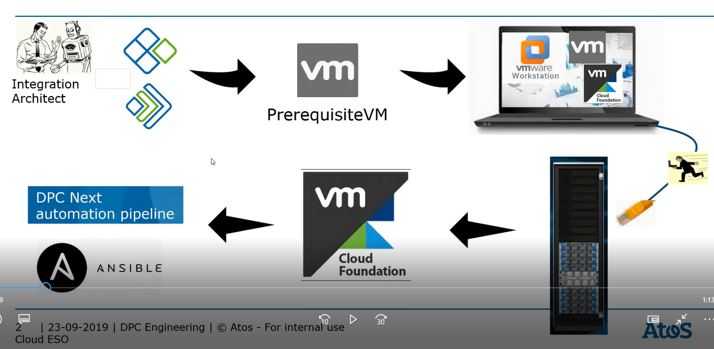
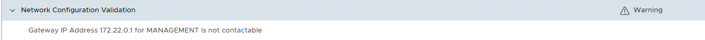

# VCS Build Guide

# Table of Contents

- [VCS Build Guide](#vcs-build-guide)
- [Table of Contents](#table-of-contents)
- [Changelog](#changelog)
  - [Introduction](#introduction)
    - [Purpose](#purpose)
    - [Audience](#audience)
    - [Scope](#scope)
- [Software Repository](#software-repository)
- [VCS build steps overview](#vcs-build-steps-overview)
- [VMware by Broadcom service account](#vmware-by-broadcom-service-account)
- [Network Activities (NDCS)](#network-activities-ndcs)
  - [Create network LLD (mandatory)](#create-network-lld-mandatory)
  - [Align with DC Architect or Request dedicated Network Architect / Network Engineer from local DC LAN Team](#align-with-dc-architect-or-request-dedicated-network-architect--network-engineer-from-local-dc-lan-team)
  - [Request ASN routable subnets (optional)](#request-asn-routable-subnets-optional)
  - [Request ASN firewall rules (optional)](#request-asn-firewall-rules-optional)
- [Input data](#input-data)
  - [Naming Convention](#naming-convention)
  - [BIOS and Firmware Requirements](#bios-and-firmware-requirements)
  - [Infrastructure Requirements](#infrastructure-requirements)
    - [Network Infrastructure](#network-infrastructure)
  - [List of input parameters for Prerequisite VM](#list-of-input-parameters-for-prerequisite-vm)
    - [General inputs](#general-inputs)
    - [Components](#components)
    - [Licenses](#licenses)
    - [Git](#git)
    - [Mgmt workload inputs](#mgmt-workload-inputs)
    - [Customer workload inputs](#customer-workload-inputs)
    - [Customer network configuration inputs](#customer-network-configuration-inputs)
    - [Management network configuration inputs](#management-network-configuration-inputs)
    - [Disaster Recovery inputs](#disaster-recovery-inputs)
    - [Backup integration](#backup-integration)
    - [Monitoring/ServiceNow integration inputs](#monitoringservicenow-integration-inputs)
    - [Antivirus integration](#antivirus-integration)
    - [Alcatraz integration](#alcatraz-integration)
  - [VCF Bill of Materials](#vcf-bill-of-materials)
  - [List of VCF Download Bundle IDs](#list-of-vcf-download-bundle-ids)
  - [Download Bundles by Online and Offline Depots](#download-bundles-by-online-and-offline-depots)
  - [Cloud Builder Appliance](#cloud-builder-appliance)
  - [List of VCS default iops limits](#list-of-vcs-default-iops-limits)
- [Deployment steps](#deployment-steps)
  - [Creating Prerequisite VM](#creating-prerequisite-vm)
    - [IMPORT the Prerequisite VM on the Workstation](#import-the-prerequisite-vm-on-the-workstation)
    - [Creating Prerequisite VM Video](#creating-prerequisite-vm-video)
  - [Bring Up of VCF components with cloud builder (stage0)](#bring-up-of-vcf-components-with-cloud-builder-stage0)
    - [Prebuild tests for Bring Up](#prebuild-tests-for-bring-up)
  - [Building non-VCF components (stage1, stage2)](#building-non-vcf-components-stage1-stage2)
    - [Mount Datastores (when using external storage solution, non vSAN)](#mount-datastores-when-using-external-storage-solution-non-vsan)
    - [Build Steps](#build-steps)
  - [Manual RBAC implementation for VMware Identity Manager](#manual-rbac-implementation-for-vmware-identity-manager)
  - [MID servers - Snow/CMP](#mid-servers---snowcmp)
  - [Remote board security hardening](#remote-board-security-hardening)
    - [iDRAC](#idrac)
      - [Configure basic settings for DELL iDRACs](#configure-basic-settings-for-dell-idracs)
      - [Configure Syslog](#configure-syslog)
      - [Configure Secure SNMP](#configure-secure-snmp)
  - [vSAN Encryption](#vsan-encryption)
  - [vSAN Stretched Cluster](#vsan-stretched-cluster)
    - [Commissioning of a DR MGMT and CMP hosts](#commissioning-of-a-dr-mgmt-and-cmp-hosts)
    - [Stretch NSX-T Management Cluster (Management Domain)](#stretch-nsx-t-management-cluster-management-domain)
    - [Stretch NSX-T CMP Cluster (VI WD)](#stretch-nsx-t-cmp-cluster-vi-wd)
  - [VCS Hardening (stage3)](#vcs-hardening-stage3)
- [Lifecycle Management](#lifecycle-management)
  - [Patch NSX,vCenter,ESXi to latest versions](#patch-nsxvcenteresxi-to-latest-versions)
- [Post deployment activities](#post-deployment-activities)
  - [DC Networking Sign Off](#dc-networking-sign-off)
  - [Multi-tenancy Deployment Scenarios - vSphere Content Libraries](#multi-tenancy-deployment-scenarios---vsphere-content-libraries)
  - [Multi-tenancy Deployment Scenarios - VRA integration](#multi-tenancy-deployment-scenarios---vra-integration)
  - [VCS backup integration](#vcs-backup-integration)
  - [Alcatraz framework integration (Tosca)](#alcatraz-framework-integration-tosca)
  - [Nessus scheduled email reports](#nessus-scheduled-email-reports)
  - [VCS inventory scan reports](#vcs-inventory-scan-reports)
  - [CMDB auto discovery enablement](#cmdb-auto-discovery-enablement)
  - [Compliance overview](#compliance-overview)
  - [bck02 service accounts deployment](#bck02-service-accounts-deployment)
  - [Reporting overview](#reporting-overview)
  - [Witness Traffic Separation for Stretched Clusters](#witness-traffic-separation-for-stretched-clusters)
  - [Operational and integration playbooks](#operational-and-integration-playbooks)
    - [Recommendations](#recommendations)

# Changelog

| Version | Date          | Description                                                                                                                                                         | Author             |
|---------|---------------|---------------------------------------------------------------------------------------------------------------------------------------------------------------------|--------------------|
| 0.1     | 11/12/2019    | First version                                                                                                                                                       | Przemyslaw Bojczuk |
| 0.2     | 11/13/2019    | VCF, Cloud Builder, Prerequisite VM update, screenshots added                                                                                                       | Przemyslaw Bojczuk |
| 0.2.1   | 11/14/2019    | VCF BoM, embedding videos                                                                                                                                           | Przemyslaw Bojczuk |
| 0.3     | 11/21/2019    | add chapter for MID server                                                                                                                                          | Jakub Wosko        |
| 0.3.1   | 01/13/2020    | non-root usage added to non-VCF components                                                                                                                          | Przemyslaw Bojczuk |
| 0.4     | 22-26/01/2020 | Final review and adoption before passing to CO                                                                                                                      | Robert Kaminski    |
| 0.4.1   | 30/01/2020    | Minor corrections before passing to CO (i.e removed references to older versions of VCF, wording)                                                                   | Piotr Lewandowski  |
| 0.4.2   | 14/02/2020    | Adding chapter Remote board security hardening                                                                                                                      | Marcin Kujawski    |
| 0.5     | 20/02/2020    | Updates based on CO review comments in TOS process                                                                                                                  | Robert Kaminski    |
| 0.6     | 16/04/2020    | VCS on DELL EMC VxRail (VCF on VxRail) chapter added                                                                                                                | Maciej Losek       |
| 0.7     | 22/04/2020    | vSAN Stretched Cluster chapter and Manual RBAC implementation for SDDC Manager and VMware Identity Manager chapter added                                            | Maciej Losek       |
| 0.8     | 26/04/2020    | Updates after review (VxRail and Stretched cluster)                                                                                                                 | Piotr Lewandowski  |
| 0.9     | 12/05/2020    | Review and adjustment of input parameters                                                                                                                           | Robert Kaminski    |
| 0.10    | 14/05/2020    | Review and adjustment of input data for cloud builder <br>Introducing Service Broker for creating PrerequisiteVM                                                    | Robert Kaminski    |
| 0.11    | 15/05/2020    | Added dhcCreatePrerequisiteVM demo based on Service Broker                                                                                                          | Robert Kaminski    |
| 0.12    | 18/05/2020    | Extended Mid Servers section with Evanios related info                                                                                                              | Robert Kaminski    |
| 0.13    | 03/08/2020    | Update vSAN Stretched Cluster chapter - allign to VCF 4.0                                                                                                           | Maciej Losek       |
| 0.14    | 25/08/2020    | Updated with NDCS requested network checks (ToS Requirement)                                                                                                        | Alec Dunn          |
| 0.15    | 28/08/2020    | Update vSAN Stretched Cluster chapter                                                                                                                               | Maciej Losek       |
| 0.16    | 21/10/2020    | Revision and adoption of input parameters (readiness for VCF4.0)                                                                                                    | Robert Kaminski    |
| 0.17    | 28/10/2020    | Revision and adoption of cloud builder input file parameters (readiness for VCF4.0)                                                                                 | Robert Kaminski    |
| 0.18    | 30/10/2020    | Revision and adoption of non-VCF components, Mid Servers (readiness for VCF4.0)                                                                                     | Robert Kaminski    |
| 0.19    | 30/10/2020    | VCS 1.2 Ready for TOS (with caveats VxRail related parts not refreshed for vcf 4.0 as not part of MVP scope)                                                        | Robert Kaminski    |
| 0.20    | 13/11/2020    | Update after playbook sequence change in dhc-builder playbook                                                                                                       | Marcin Gala        |
| 0.21    | 17/11/2020    | Updated information about VMware Service account and root account for all the ESXi hosts - management and workload domain                                           | Marcin Gala        |
| 0.22    | 19/11/2020    | Updated playbook sequence - bastion hosts configuration have to be done with working internet access - proxy should be configured before bastion host configuration | Marcin Gala        |
| 0.23    | 10.12.2020    | Implemented ToS 1.2 review findings from Cezary Dwojak and Marcin Kujawski, refreshed dhc-builder.yml appendix                                                      | Robert Kaminski    |
| 0.24    | 31.12.2020    | Update with external NTP                                                                                                                                            | Pawel Zurawski     |
| 0.25    | 01.02.2021    | Added information about steps required to create new network segments in customer workload                                                                          | Marcin Gala        |
| 0.26    | 03.04.2021    | vSAN Witness sizes correction                                                                                                                                       | Pawel Zurawski     |
| 0.27    | 31.03.2021    | Update AD domain name with dhc instance number                                                                                                                      | Marcin Kujawski    |
| 0.28    | 13.05.2021    | Add chapter for Multi-tenancy enablement                                                                                                                            | Marcin Kujawski    |
| 0.29    | 25.05.2021    | Add info about licensing in chapter about vSAN Encyption                                                                                                            | Piotr Gesikowski   |
| 0.30    | 11.06.2021    | Removed information about vIDM License                                                                                                                              | Jakub Zielinski    |
| 0.31    | 06.07.2021    | Added information about VCS defaults iops limits                                                                                                                    | Shilpa Arote       |
| 0.32    | 20.07.2021    | Added chapter Prebuild tests for Bring Up                                                                                                                           | Marcin Kujawski    |
| 0.33    | 06.09.2021    | DHC-2760 updates                                                                                                                                                    | Piotr Lewandowski  |
| 0.34    | 09.09.2021    | DHC-2883 - enable Multifactor Authentication                                                                                                                        | Piotr Lewandowski  |
| 0.35    | 13.12.2021    | Added caveat/Step about checking BIOS and FW versions                                                                                                               | Alec Dunn          |
| 0.36    | 2022-02-17    | DHC-3936 updated creation of high Iops storage profile creation                                                                                                     | Shilpa Arote       |
| 1.0     | 2022-03-16    | DHC-4343 document review and adjustment for VCS version 1.5                                                                                                         | Robert Kaminski    |
| 1.0.1   | 2022-03-25    | DHC-3726 minor fix of Nessus scheduled email reports                                                                                                                | Pawel Holi         |
| 1.0.2   | 2022-04-14    | DHC-4550 minor updates to vSAN Streched Cluster                                                                                                                     | Lukasz Tomaszewski |
| 1.0.3   | 2022-04-19    | DHC-4506 added note about VCF precheck warning - MANAGEMENT GW IP address is not contactable                                                                        | Marcin Gala        |
| 1.0.4   | 2022-06-28    | CESDHC-331-chapter VMware Identity Manager - configuring High Availability for the vIDM connectors and HW-154129 - patch instructions steps added                   | Maciej Losek       |
| 1.0.5   | 2022-07-15    | CESDHC-447 fixed reference to -dpc- groups instead of -dhc- groups in Manual RBAC implementation for VMware Identity Manager                                        | Jakub Zielinski    |
| 1.0.6   | 2022-09-12    | CESDHC-4097 update Abstraction Layer inputs                                                                                                                         | Marcin Kujawski    |
| 1.0.7   | 2022-09-20    | CESDHC-198 added Mount Datastore section and aditional row in Customer workload inputs. Information required for introducing external storage solution              | Adam Wieczorek     |
| 1.0.8   | 2022-12-07    | CESDHC-5125 add network profile change instruction as temporary solution before automation will be handling it                                                      | Pawel Zurawski     |
| 1.0.9   | 2022-12-19    | CESDHC-5183 removed section about network profile change as an automation is implemented                                                                            | Lukasz Bienkowski  |
| 1.0.10  | 2023-02-17    | CESDHC-6110 information regarding VCS inventory scan reports                                                                                                        | Jakub Zielinski    |
| 1.0.11  | 2023-03-16    | CESDHC-6263 update information regarding VCS inventory scan reports                                                                                                 | Marcelino Sanchez  |
| 1.0.12  | 2023-06-05    | VCS-9510 add info about bck02 and vcs02 service accounts deployment                                                                                                 | Michał Sobieraj    |
| 1.0.13 | 2024-02-09 | VCS-12032 Replacing CloudLink KMS with Native Key Provider in vSAN encryption  | Adam Wieczorek |
| 1.0.14 | 2024-10-08 | VCS-13930 Adding informations needed for Network Architect / Project Manager related to Network Activities | Pawel Zurawski |
| 1.0.15 | 2024-10-31 | VCS-14229 Update guide for VCS 2.0 | Lukasz Bienkowski |
| 1.0.16 | 2025-04-24 | VCS-15681 Add step to generate VCF bundle download token | Lukasz Bienkowski |
| 1.0.17 | 2025-05-27 | VCS-16063 Remove vcs02 account from dhcBuildGuide | Michał Sobieraj |
| 1.0.18 | 2025-06-18 | VCS-16316 Add information in VCS inventory scan section to be used for development only | Lukasz Bienkowski |
| 1.0.19 | 2025-07-02 | VCS-14880 Offline Bundle info added | Mariusz Stanek |
| 1.0.20 | 2025-11-06 | VCS-17389 Remove tags usage for dhc-builder.yml, change licensing section | Lukasz Bienkowski |
| 1.0.21 | 2025-12-07 | VCS-17904 Remove unnecessary AVN uplink gateways from service broker form input | Lukasz Bienkowski |
| 1.0.22 | 2026-02-24 | VCS-17325 Updated async patching step reference | Stanislaw Kilanowski |
| 1.0.23 | 2026-03-17 | VCS-290 Added Witness Traffic Separation configuration section for stretched clusters in Post deployment activities | Radoslaw Dabrowski |

## Introduction

### Purpose

Build the VCS Management cluster

### Audience

- VCS Engineers
- VCS Architects

### Scope

The blueprint assumes that the reader has reasonable grasp of VCS as well as familiarity with architecture principles including high availability and multi-tenancy.

In scope:

- Build VCS Management cluster

# Software Repository

The following resource repositories store ansible scripts (playbooks, and roles), documentation and binaries required for VCS deployment. Their content is retrieved automatically during the VCS deployment.

| Resource repository   | URI                                                                                        | Comment                                                                               |
|-----------------------|--------------------------------------------------------------------------------------------|---------------------------------------------------------------------------------------|
| Amazon S3             |                                                                                            | software and images available from Code Stream pipe line when creating PrerequisiteVM |
| VCS Github Repository | [https://github.com/GLB-CES-PrivateCloud/DHC](https://github.com/GLB-CES-PrivateCloud/DHC) | valid                                                                                 |

# VCS build steps overview



1. Integration Architect gathers data for network, backup integration, antivirus integration, service now integration etc. Integration architect should also verify DC LAN design with NDCS (for  supportability) and against VCS requirements (for compliance) at this stage.
2.  
    1. Integration Architect creates service account in Atos and VMware systems.
    2. Integration Architect or delegated Network Architect (some of the steps should be performed in some cases by Project Manager) should start process of requesting Network Subnetes, requesting changes FW rules creation on ASN BPC, requesting access to ASN ATF Services, requesting network (routing/switching) changes in local DC (in some cases this will require help from Network Architect / Engineer from local DC team), completing all this activities in some cases can take up to the two months so it is crucial to start this project as soon as possible.
3. Integration Architect executes creation of prerequisite VM task on VMC. The Prerequisite VM is required during the SDDC Bring-up as it provides initial DNS, DHCP, NTP services as well as orchestrates non-VCF components build up. The prerequisite VM OVA is shared with the deployment team.
4. Deployment team downloads prerequisite VM OVA and CloudBuilder OVA. The OVAs are imported to workstation.
5. Deployment team connects the laptop with VMware Workstation that runs prereqVM and cloud builder VM to VCS switches (management network).
6. Deployment team runs cloud builder to bring VCF components.
7. Deployment team runs VCS ansible pipeline to bring non VCF components.

# VMware by Broadcom service account

VCS is VCF based, hence the service account is required with software download privileges in order to sync the bundles between SDDC Manager or vRealize Lifecycle Manager and the VMware by Broadcom.

1. Create shared email account `<customerCode>-VMware-Communication` in *@atos.net* domain.

   - Open Atos Service Portal - PISA
   - Go to *IT -> Communications and Email -> Email Mailbox ->    Order DAS functional mailbox*
   
   - Click Submit
   - Account creation shouldn't take more than 24h
   - After creation of email account open PISA Portal once again
   - Go to *IT -> Communications and Email -> Email Mailbox -> Manage mailbox permissions (bulk addition/removal)*
   - Complete and attach "BulkPermission Template" with the all account that should have permissions to the newly created shared email account (i.e members of the Ops Team that will provide support for the particular VCS customer)

2. Create a Broadcom support account using [Register an account on Broadcom article](https://knowledge.broadcom.com/external/article/145581/register-for-an-account-on-the-broadcom.html):

3. Wait for registration email message that will be sent to `<customerCode>-VMware-Communication@atos.net` email account.

4. Follow siteID access request if necessary [SiteID access request/creation article](https://knowledge.broadcom.com/external/article?articleId=142873) and contact <contract-administration@atos.net> and request new account to be assigned software download rights.

5. **IMPORTANT**: Starting 23.04.2025 Broadcom changed the way how bundles are downloaded by SDDC manager. There is a need to generate download token in Broadcom support portal. Procedure is explained in following KB article:

    [VCF authenticated downloads configuration update instructions](https://knowledge.broadcom.com/external/article/390098)

    Token needs to be provided in Prerequisite VM Service Broker form.

# Network Activities (NDCS)

## Create network LLD (mandatory)

Any work should be started from creating a plan, it is not possible to create plan without visibility what needs to be created. To have this visibility detailed network LLD that needs to consist all routing (BGP / static route) informations, needed VLANs, needed IP subnets

## Align with DC Architect or Request dedicated Network Architect / Network Engineer from local DC LAN Team

It is important to understand that no actions related network L1-L3 will not be possible without acceptance from local NDCS DC LAN Team. To start any discussion with local NDCS DC LAN team WBS code will be needed for local NDCS DC LAN team.

In this document specific process of each DC will not be provided as processes can changed, only contact personas list will be maintained, as it is not possible to start this process efficiently without contacting DC Network Architect.

For any DC that is not include in contact personas below please ask Mr. Torben Wiede (head of data centers) for contact person for DC.

Well know DCs

| Country | Contact Person | Role |
| --- | --- | --- |
| Austria | Anodraj Sinniah or Chistian Gottwald or Alex Richter | DC Network Architect |
| France | Véronique HUCHET | All questions related to installment of any new component in DC |
| France | Predipe VASSIN | All questions related to routing / switching / firewall rules (including rules on ASN BPC) |
| Germany | Gunther Richter or Predrag Crnogorac | DC Network Architect |
| Netherlands | Stefan Wesker or Frank Volf | DC Network Architect |
| Switzerland | Bojan Cumpalovic or Ovidiu-Lucian Foia | DC Network Architect |
| UK | Kelvin Ware | Assignment of dedicated Network Architect that will handle the process |

## Request ASN routable subnets (optional)

In case of implementing DHC in Atos DC this step is always mandatory.
But in some of the DC (for example France or UK) this step will be performed by dedicated Network Architect / Network Engineer from local DC team.

ASN routable subnets need to be requested using SNOW ticket using Atos Selfsigned: Catalog Atos Shared Network Global -> Network -> Generic
Service Request

## Request ASN firewall rules (optional)

Please be aware that in some of the countries this change will be carried out by dedicated Network Architect / Network Engineer from local NDCS DC team.

In case that network FW change on ASN BPC firewall need to be requested please follow this work instruction: wiASNrequests.md
List of all current services available thru ASN: <https://atos365.sharepoint.com/sites/690001424/systmgmt>

# Input data

The deployment steps that are described in the next paragraph require a number of input data.

Make sure all the data is gathered before you go into actual implementation.

---

## Naming Convention

All the input data must be aligned with the latest approved [naming convention](../design/namingConvention.md) document.

>**IMPORTANT** Pay attention to a domain name which is concatenation of variables and hardcoded string values. VCS domain name is equal to:  `< customerCode >dhc< dhcInstance >.next`, i.e. `nx3dhc01.next` or `nx1dhc01.next`.

## BIOS and Firmware Requirements

>**IMPORTANT**: Compare BIOS and firmware version of the VCS delivered hardware with the VMware Hardware Compatibility List. Upgrade to the newest supported versions upfront.

Suggested links to VMware HCL:

- [VMware HCL Matrix for I/O devices](https://www.vmware.com/resources/compatibility/search.php?deviceCategory=io)
- [VMware Supported Driver Versions for I/O Devices](https://kb.vmware.com/s/article/2030818)
- [For Bullion S200 Servers](https://www.vmware.com/resources/compatibility/detail.php?deviceCategory=server&productid=47740)
- [For Bullion SA10 Servers](https://www.vmware.com/resources/compatibility/detail.php?deviceCategory=server&productid=51172)
- [For Bullion SA20 Servers](https://www.vmware.com/resources/compatibility/detail.php?deviceCategory=server&productid=51159)

---

## Infrastructure Requirements

Following documents describe components that are not directly managed and created by VCS, and are required for correct build process.

- [Network](../design/lldSoftwareDefinedNetworks.md#underlay-requirements-for-dhc-sdn)
- [vSAN Witness](dhcVsanWitnessAppliance.md)

### Network Infrastructure

As part of the Top Process it is required that there are checks throughout the install of a VCS to ensure that the network design is compliant with both, VCS design and NDCS supportability requirements in additional to being fit for purpose for the  client. This is broken into three parts.

1. Validation with VCS requirements and NDCS requirements at design stage.
2. Validation with NDCS at implementation time that assumptions are correct and design is valid in real world.
3. Post install check against design and configuration to ensure network is deployed as expected by VCS and NDCS.

---

## List of input parameters for Prerequisite VM

The Prerequisite VM is required during the SDDC Bring UP as it provides initial DNS, DHCP, NTP services as well as it orchestrates non-VCF components build up.  
The Prerequisite VM is generated with each VCS deployment.  The parameters below are only a sample values, but it's a good starting point for Integration Architect what kind of data have to be gathered.

### General inputs

| Input  Parameters       | example  for  DEV  nx1  env          | Description                                                                                                                                                                                                                                                                                                                                                                                                                                                               |
|-------------------------|--------------------------------------|---------------------------------------------------------------------------------------------------------------------------------------------------------------------------------------------------------------------------------------------------------------------------------------------------------------------------------------------------------------------------------------------------------------------------------------------------------------------------|
| customerCode            | nx1                                  | Naming convention 3 Alpha , used as prefix for management domain creation                                                                                                                                                                                                                                                                                                                                                                                                 |
| locationCode            | gre02                                | Location code variable represented by 3 letters and 2 digits                                                                                                                                                                                                                                                                                                                                                                                                              |
| dhcInstance             | 01                                   | VCS instance number represented by 2 digits starting from 01. Number indicates VCS instance                                                                                                                                                                                                                                                                                                                                                                               |
| temporaryPassword       |                                      | Password used for initial deployment of all components                                                                                                                                                                                                                                                                                                                                                                                                                    |
| vmwareUser              | VMware service account  user name    | VMware service account  user  name  used  for  bundles  downloading  and  other  VMware  integration  like  CAS  token. For Cloud Assembly token generation it is required that vRA Cloud user has Member and Support user roles assigned. VMware service account can be requested as described in “VMware service account” chapter in this document                                                                                                                      |
| vmwareUserPassword      | VMware service account user password | VMware service account password  used  for  bundles  downloading  and  other  VMware  integration  like  CAS  token                                                                                                                                                                                                                                                                                                                                                       |
| vcfDownloadToken        | token                                | Token generated via Broadcom support portal according to procedure described in [VCF authenticated downloads configuration update instructions](https://knowledge.broadcom.com/external/article/390098) |
| VCS hardware Platform   | VCF or VCFonVxRail                   | Hardware platform type. (VCF on VxRail still under development)                                                                                                                                                                                                                                                                                                                                                                                                           |
| ntpServer1              | 10.99.94.144                         | IP address of external to VCS NTP Server, provided by DC as described in DC Physical Requirements section of SDN LLD, this value is mandatory                                                                                                                                                                                                                                                                                                                             |
| ntpServer2              | 10.99.94.145                         | IP address of external to VCS NTP Server, provided by DC as described in DC Physical Requirements section of SDN LLD, if only one IP address was provided, leave this field empty                                                                                                                                                                                                                                                                                         |
| InternetAccess          | proxy                                | [direct/proxy] Access to internet from VCS. <BR> proxy  -  (default)  -  proxy  value  indicates  that  DPC  Web-Proxy  will  use  another  Proxy  as  parent  proxy  to  forward  traffic,  proxy  will  be  configured  under  /etc/squid/squid.conf  cache_peer  section <BR> direct  -  value  indicates  that  DPC  Web-Proxy  will  have  direct  access  to  the  Internet,  no  parent  proxy  will  be  configured  on  DPC  Proxy  under  /etc/squid/squid.conf |
| externalProxyAuthMethod | none                                 | Parent  Proxy  authentication  method. <BR> none  -  (default  value,  Web  Proxy  for  Grenoble  Environment  does not  require authentication)  -  no  authentication  required. <br> basic  -  username/password  authentication                                                                                                                                                                                                                                       |
| externalProxyIp         | 10.99.94.148                         | IP address of external Web Proxy Server if exist. </BR> IP  address  of  Parent  proxy  for  DPC  Proxy,  default  value  10.99.94.148  (Web  Proxy  for  Grenoble  Environment) <BR> Notice:  please  be  aware  that  in  this  version  of  Code  Stream  all  variables  need  to  be  filled,  this  mean  even  if  "direct"  access  is  chosen,  this  variable  need  to  be  filled  with  random  value ??                                                     |
| externalProxyLogin      | test                                 | username  used  by  Parent  Proxy  for  authentication,  default  value  test  (Web  Proxy  for  Grenoble  Environment  is  not  requiring  authentication)notice:  please  be  aware  that  in  this  version  of  Code  Stream  all  variables  need  to  be  filled,  this  mean  even  if  "direct"  access  is  chosen  or  "none"  for  authentication  method  is  chosen,  this  variable  need  to  be  filled  with  random  value                              |
| externalProxyPassword   | test                                 | password  used  by  Parent  Proxy  for  authentication,  default  value  test  (Web  Proxy  for  Grenoble  Environment  is  not  requiring  authentication)notice:  please  be  aware  that  in  this  version  of  Code  Stream  all  variables  need  to  be  filled,  this  mean  even  if  "direct"  access  is  chosen  or  "none"  for  authentication  method  is  chosen,  this  variable  need  to  be  filled  with  random  value                              |
| externalProxyPort       | 8080                                 | TCP  port  that  Parent  Proxy  for  DPC  Proxy  will  listen  for  web  traffic,  default  value  8080  (Web  Proxy  for  Grenoble  Environment  port)notice:  please  be  aware  that  in  this  version  of  Code  Stream  all  variables  need  to  be  filled,  this  mean  even  if  "direct"  access  is  chosen,  this  variable  need  to  be  filled  with  random  value                                                                                       |

### Components

| Field description *Input  Parameter name*                           | example  for  DEV  nx1  env | Description                                                                                                                                                                  |
|---------------------------------------------------------------------|-----------------------------|------------------------------------------------------------------------------------------------------------------------------------------------------------------------------|
| Nessus | true/false | Depends on deployment needs Nessus is installed or not |
| vRealize Network insight | true/false | Depends on deployment needs vRealize Network Insight is installed or not |
| SMTP | true/false | Depends on deployment needs SMTP relay server is installed or not |

### Licenses

| Field description<br>*Input  Parameter name*                           | example  for  DEV  nx1  env | Description                                                                                                                                                                  |
|------------------------------------------------------------------------|-----------------------------|------------------------------------------------------------------------------------------------------------------------------------------------------------------------------|
| ESXi host License Key<br>*esxiLicense*                                 |                             | Provide license for ESXi hosts                                                                                                                                               |
| NSX-T License Key<br>*nsxtLicense*                                     |                             | Provide NSX-T license                                                                                                                                                        |
| Aria Operations for Networks License Key<br>*vrniLicense*              |                             | Copy from NSX-T field if ENTERPRISE license key is used, otherwise provide dedicated Aria Operations for Networks Key |
| Aria License Key<br>*ariaLicense*                                      |                             | Provide license for Aria Suite |
| Infoblox License Key<br>*infobloxLicense*                              |                             | Provide license for infoblox                                                                                                                                                 |
| Compute vCenter License Key <br>*vcsComputeLicense*                    |                             | Provide license for management vCenter                                                                                                                                       |
| vSAN Compute Cluster License Key<br>*vsanComputeLicense*               |                             | Provide license for compute vCenter <BR> i.e. ST6-EN-C VMware Virtual SAN 6 Enterprise                                                                                       |
| Remote Desktop Terminal Server License Key<br>*terminalServerLicense*  |                             | Provide license for Remote Desktop Terminal Server                                                                                                                           |
| Nessus License                                                         |                             | Provide license for Nessus                                                                                                                                                   |

### Git

| Field description<br>*Input  Parameter name* | example  for  DEV  nx1  env | Description                                                                                                            |
|----------------------------------------------|-----------------------------|------------------------------------------------------------------------------------------------------------------------|
| *gitbranch*                                  | master                      | Choose the git repository as a source code for the VCS build                                                           |
| Greenfield build version                     | dhcVersion1_5               | Release version based on version matrix input file. Read only value, automatically assigned based on chosen git branch |

### Mgmt workload inputs

| Field description<br>*Input  Parameter name*  | example  for  DEV  nx1  env  | Description |
| ------ | ------ | ------ |
|Mgmt Workload advance configuration| default/customized | When set to customized more options are available |
| *numberOfManagementHosts* | 4 | Define number of management hosts |
| *vsanEncryption* | true | [true or false] Default is true. |
| *enableWsusAutoPatchApproval*  |   true  | [true or false] Enable critical and security patches auto approval on WSUS repository for the VCS management VMs. |
| *managementHostsStartCidr* | 101 | define starting cidr for management hosts |
|Enable vSAN Encryption| true | [true or false] Encryption of vSAN compute storage is mandatory. VCS uses vSphere built-in Native Key Provider as a Key Provider for vSAN encryption. If this service is not taken, integration with a 3rd party KMS solution is the responsibility of the solution team. |
|*enableWsus AutoPatchApproval*| true | [true or false] Enable critical and security patches auto approval on WSUS repository during DPC deployment for the management VMs.|

>Note: When stretching MGMT cluster numberOfManagementHosts  needs to be set to number of all hosts in a stretch cluster.

### Customer workload inputs

| Field description<br>*Input  Parameter name*                             | example  for  DEV  nx1  env | Description                                                                                                                         |
|--------------------------------------------------------------------------|-----------------------------|-------------------------------------------------------------------------------------------------------------------------------------|
| *numberOfComputeHostsInWorkloadDomain*                                   | 3                           | Define amount of hosts in workload domains                                                                                          |
| 1st vmnicId<br>*vmnic1Id*                                                |                             | Provide compute host management 1st network adapter ID physically connected to VCS top of rack switch. Expected single digit value. |
| 2nd vmnicId<br>*vmnic2Id*                                                |                             | Provide compute host management 2nd network adapter ID physically connected to VCS top of rack switch. Expected single digit value. |
| Principal Storage type for Workload Cluster<br>*principalStorageTypeCmp* |                             | Select storage type for workload domain - vSAN or SAN Array                                                                         |

>Note: When stretching CMP cluster numberOfComputeHostsInWorkloadDomain  needs to be set to total number of all hosts in a stretch cluster.

### Customer network configuration inputs

To help in customer networks creation, work instruction and description of dedicated playbooks is available here:

[Work Instruction Creating Customer Infrastructure Vars](wiCustomerInfraVars.md)
[Work Instruction Creating Customer Networks](wiCustomerNetworks.md)

### Management network configuration inputs

Ensure at this stage that all parameters meet VCS design specifications and check with NDCS to ensure DC LAN supportability.

| Field description<br>*Input  Parameter name*                          | example  for  DEV  nx1  env | Description                                                                                                      |
|-----------------------------------------------------------------------|-----------------------------|------------------------------------------------------------------------------------------------------------------|
| <br>**                                                                |                             |                                                                                                                  |
| Edge network<br>*networkEdgeCidr*                                     | 192.168.127                 | Edge Transport Node Network first three octets                                                                   |
| Edge network Gateway<br>*networkEdgeGateway*                          | 1                           | Edge Transport Node Network Gateway last octet                                                                   |
| Edge network Netmask<br>*networkEdgeNetmask*                          | 255.255.255.0               | Edge Transport Node Network Netmask                                                                              |
| Edge network Vlan<br>*networkEdgeVlan*                                | 27                          | Edge Transport Node Network Vlan Id                                                                              |
| Mgmt network<br>*networkMgmtCidr*                                     | 192.168.120                 | Management Network first three octets                                                                            |
| Mgmt network Gateway<br>*networkMgmtGateway*                          | 1                           | Management Network Gateway                                                                                       |
| Mgmt network Netmask<br>*networkMgmtNetmask*                          | 255.255.255.0               | Management Network netmask                                                                                       |
| Mgmt network Vlan<br>*networkMgmtVlan*                                | 120                         | Management Network VLAN id                                                                                       |
| Vmotion network<br>*networkVmotionCidr*                               | 192.168.122                 | vMotion Network first three octets                                                                               |
| Vmotion network Gateway<br>*networkVmotionGateway*                    | 1                           | vMotion gateway                                                                                                  |
| Vmotion network Netmask<br>*networkVmotionNetmask*                    | 255.255.255.0               | vMotion netmask                                                                                                  |
| Vmotion network Vlan<br>*networkVmotionVlan*                          | 22                          |                                                                                                                  |
| vSAN network<br>*networkVsanCidr*                                     | 192.168.123                 | vSAN Network first three octets                                                                                  |
| vSAN network Gateway<br>*networkVsanGateway*                          | 1                           |                                                                                                                  |
| vSAN network Netmask<br>*networkVsanNetmask*                          | 255.255.255.0               |                                                                                                                  |
| vSAN network Vlan<br>*networkVsanVlan*                                | 23                          |                                                                                                                  |
| Vxlan network<br>*networkVxlanCidr*                                   | 192.168.121                 | VXLAN Network first three octets                                                                                 |
| Vxlan network Gateway<br>*networkVxlanGw*                             | 1                           |                                                                                                                  |
| Vxlan network Vlan<br>*networkVxlanVlan*                              | 21                          |                                                                                                                  |
| Avn Local Region network<br>*networkAvnLocalRegionCidr*               | 172.22.30                   | CF 4.x AVN Local Region network address - !! first three octects only !!                                         |
| <br>*networkAvnLocalRegionNetmask*                                    |                             | CF 4.x AVN Local Region network mask                                                                             |
| Avn Local Region Gw<br>*networkAvnLocalRegionGw*                      | 1                           | VCF 4.x AVN Local Region Gateway !! last octet only !! example: 1                                                |
| Avn Cross Region Name<br>*networkAvnCrossRegionName*                  | xreg-m01-seg01              | Application Virtual Network Cross Region Name. The name must match with the value in the VCF bring-up input file |
| Avn Cross Region network<br>*networkAvnCrossRegionCidr*               | 172.22.31                   | VCF 4.x AVN CrossRegion network address !! first three octets only !!                                            |
| Avn Cross Region Netmask<br>*networkAvnCrossRegionNetmask*            |                             | VCF 4.x AVN CrossRegion network mask                                                                             |
| Avn Cross Region Gw<br>*networkAvnCrossRegionGw*                      | 1                           | VCF 4.x AVN CrossRegion gateway !! only last octet !! example: 1                                                 |
| Avn Uplink1 network<br>*networkAvnUplink1Cidr*                        | 172.16.42                   | VCF 4.x uplink1 to T0 network address !! only first three octets !!                                              |
| Avn Uplink1 Vlan<br>*networkAvnUplink1Vlan*                           | 202                         | VCF 4.x Uplink1 to T0 vlan-id                                                                                    |
| Avn Uplink1 MTU <br>*networkAvnUplink1Mtu*                            | 1500                        | VCF 4.x uplink2 to T0 MTU                                                                                        |
| Avn Uplink1 Netmask<br>*networkAvnUplink1Netmask*                     | 255.255.255.0               | CF 4.x Uplink1 to T0 network mask                                                                                |
| Avn Uplink2 network<br>*networkAvnUplink2Cidr*                        | 172.16.43                   | VCF 4.x uplink2 to T0 network address !! first three octets !!                                                   |
| Avn Uplink2 Vlan<br>*networkAvnUplink2Vlan*                           | 203                         | VCF 4.x uplink2 to T0 vlan-id                                                                                    |
| Avn Uplink2 MTU<br>*networkAvnUplink2Mtu*                             | 1500                        | VCF 4.x uplink2 to T0 MTU                                                                                        |
| Avn Uplink2 Netmask<br>*networkAvnUplink2Netmask*                     | 255.255.255.0               | VCF 4.x uplink2 to T0 network mask                                                                               |
| Avn T0 Uplink1 Node1 network IP<br>*networkAvnT0Uplink1Node1Ip*       |                             | VCF 4.x uplink1 to T0 node 1 IP address !! only last octet !!                                                    |
| Avn T0 Uplink1 Node2 network IP<br>*networkAvnT0Uplink1Node2Ip*       |                             | VCF 4.x uplink1 to T0 node 2 IP address !! only last octet !!                                                    |
| Avn T0 Uplink2 Node1 network IP<br>*networkAvnT0Uplink2Node1Ip*       |                             | CF 4.x uplink2 to T0 node 1 IP address !! only last octet !!                                                     |
| Avn T0 Uplink2 Node2 network IP<br>*networkAvnT0Uplink2Node2Ip*       |                             | CF 4.x uplink2 to T0 node 2 IP address !! only last octet !!                                                     |
| Avn T0 Uplink1 Bgp Neighbour IP<br>*networkAvnT0Uplink1BgpNeighborIp* |                             | VCF 4.x uplink1 BGP neighbor IP address !! only last octet !!                                                    |
| Avn T0 Uplink2 Bgp Neighbour Ip<br>*networkAvnT0Uplink2BgpNeighborIp* |                             | VCF 4.x uplink2 BGP neighbor IP address !! only last octet !!                                                    |
| Avn T0 Bgp Local AS number<br>*networkAvnT0BgpLocalAs*                |                             | VCF 4.x T0 BGP AS number (local AS)                                                                              |
| Avn T0 Bgp Neighbour AS number<br>*networkAvnT0BgpNeighborAs*         |                             | VCF 4.x ToR BGP AS number (remote AS)                                                                            |

### Disaster Recovery inputs

| Field description<br>*Input  Parameter name* | example  for  DEV  nx1  env                                                                 | Description                                                                                                                                                                                         |
|----------------------------------------------|---------------------------------------------------------------------------------------------|-----------------------------------------------------------------------------------------------------------------------------------------------------------------------------------------------------|
| *drType*                                     | no DR - standalone cluster <br> active-active stretched cluster <br> active-passive cluster | [none, active-active or active-passive] Define Disaster Recovery type. Active-Passive cluster is built on top of stand-alone VCS site build. Go to specific work instruction for the implementation |
| *locationCodeDr*                             |                                                                                             | Code of disaster recovery location represented by 3 letters and 2 digits                                                                                                                             |
| *vsanMgmtWitnessName*                        |                                                                                             | Management Cluster vSAN Witness hostname                                                                                                                                                            |
| *vsanMgmtWitnessSize*                        | medium                                                                                      | Management Cluster vSAN Witness Host size<br>MEDIUM - Supports up to 500 VMs/21,000 Witness Components  <BR> LARGE - Supports over 500 VMs/45,000 Witness Components                                |
| *vsanMgmtWitnessIpAddress*                   |                                                                                             | Management Cluster vSAN Witness MGT IP address (vmk0)                                                                                                                                               |
| *vsanMgmtWitnessNetworkCidr*                 |                                                                                             | Management Cluster vSAN Witness Host network address in CIDR notation - xxx.xxx.xxx.xxx/prefix                                                                                                      |
| *vsanCmpWitnessName*                         |                                                                                             | Compute Cluster vSAN Witness hostname                                                                                                                                                               |
| *vsanCmpWitnessSize*                         | medium/large                                                                                | Compute Cluster vSAN Witness Host size<br>MEDIUM - Supports up to 500 VMs/21,000 Witness Components  <BR> LARGE - Supports over 500 VMs/45,000 Witness Components                                   |
| *vsanCmpWitnessIpAddress*                    |                                                                                             | Compute Cluster vSAN Witness host MGT IP address (vmk0)                                                                                                                                             |
| *vsanCmpWitnessNetworkCidr*                  |                                                                                             | ompute Cluster vSAN Witness Host network address in CIDR notation - xxx.xxx.xxx.xxx/prefix                                                                                                          |

>Note: Active-Passive cluster is build on top of stand-alone VCS site build. Go to specific work instruction for the implementation in the post hardenining activities.

### Backup integration

| Field description<br>*Input  Parameter name* | example  for  DEV  nx1  env | Description                                                                                                                                                        |
|----------------------------------------------|-----------------------------|--------------------------------------------------------------------------------------------------------------------------------------------------------------------|
| Integration with CEB                         | yes                         | Integration with Atos Cloud Enterprise Backup services                                                                                                             |
| *backupAmountofCustomerVms*                  | 50                          | Number of Avamar Proxy Agents will be installed automatically based on the value. Every 50 VMs will require additional Avamar Proxy Agent.                         |
| *backupAvamarServerFqdn*                     | GRE2AVE001.nx1dhc.next      | Ask CEB Integration architect to provide a fully qualified domain name of Avamar server                                                                            |
| *backupAvamarServerIP*                       | 192.168.120.98              | Ask CEB Integration architect to provide an IP address of Avamar Server                                                                                            |
| *backupDataDomainFqdn*                       |                             | Ask CEB Integration architect to provide a fully qualified domain name of Data Domain appliance                                                                    |
| *backupDataDomainIP*                         |                             | Ask CEB Integration architect to provide an IP address of Data Domain appliance                                                                                    |
| *backupEnableAvamarBackupofCustomerVms*      | true                        | [true/false] Value true enables Avamar Proxy Agents installation on Customer Workload Domain. False will limit proxy agent installation to management domain only. |

>Note: CEB backup integration is to be executed on fully hardened VCS environment. Go to specific work instruction for the implementation in the post hardening activities.

### Monitoring/ServiceNow integration inputs

>Note: Refer to the [lldMonitoringLogging](../design/lldMonitoringLogging.md) document to understand full monitoring process

| Field description<br>*Input  Parameter name*                               | example  for  DEV  nx1  env | Description                                                                                                                                                                     |
|----------------------------------------------------------------------------|-----------------------------|---------------------------------------------------------------------------------------------------------------------------------------------------------------------------------|
| *snowInstanceUrl*                                                          |                             | Ask SNOW team (or CMP team if integrating with CMP) for the service now instance URL                                                                                            |
| *snowUser*                                                                 |                             | Ask SNOW team (or CMP team if integrating with CMP) for user/pass to automatically integrate MID servers with SNOW/CMP                                                          |
| *snowUserPassword*                                                         |                             | Ask SNOW/CMP team for user/pass to automatically integrate MID servers with SNOW/CMP                                                                                            |
| *snowEventUser*                                                            |                             | Ask SNOW/CMP team for integration user which is used to create monitoring events in SNOW/CMP                                                                                    |
| *snowEventUserPassword*                                                    |                             | Ask SNOW/CMP team for integration user password which is used to create monitoring events in SNOW/CMP                                                                           |
| Functional Organization Name <br>*httpGatewayIntegrationFoName*            |                             | Ask SNOW Team to deliver Functional Organization Name                                                                                                                           |
| Incident support group name <br>*httpGatewayIntegrationPointCategoryGroup* |                             | Provide snow support group name to which the VCS event will be routed i.e. Cloud.IaaS.VCS                                                                                       |
| snow event agent name <br>*httpGatewayIntegrationPointSrcType*             |                             | Ask SNOW Team for the event agent name (Customer unique) Standard naming i.e. ATF-DHC-X, where X is unique number                                                               |
| snow event agent source<br>*httpGatewayIntegrationPointSrcId*              | dhc://1                     | By default it's dhc://< nb > where < nb >  where is the number provided at the end of "snow event agent name' field. Rely on default value unless SNOW team states differently. |

### Antivirus integration

Integration with Atos Shared Antivirus Services

>Note: Antivirus is provided by Atos BDS team. Refer to dhcOlaBdsDeepSecurity.md for more details.

| Field description<br>*Input  Parameter name*  | example  for  DEV  nx1  env          | Description                                                                                                                                                                                                                                                                           |
|-----------------------------------------------|--------------------------------------|---------------------------------------------------------------------------------------------------------------------------------------------------------------------------------------------------------------------------------------------------------------------------------------|
| Integrate with Atos Shared Antivirus Services | yes                                  | [no/yes] NOTE: Antivirus is mandatory for all management servers. VCS strongly recommends integration with Atos Shared Antivirus Services (Trend Micro, from BDS). If this service is not taken, integration with a 3rd party AV solution is the responsibility of the solution team. |
| *deepSecurityTenantId*                        | 52160910-755C-E20B-EA18-29355FA3B5DE | Antivirus tenant ID for Deep Security                                                                                                                                                                                                                                                 |
| *deepSecurityToken*                           | 89F3F569-C9E8-1B5C-1906-216A6A4920C4 | Antivirus Security Token                                                                                                                                                                                                                                                              |
| *deepSecurityLinuxPolicyId*                   | 17                                   | policy id provided by Deep Sec Team for Linux                                                                                                                                                                                                                                         |
| *deepSecurityWindowsPolicyId*                 | 6                                    | policy id provided by Deep Sec Team for Windows                                                                                                                                                                                                                                       |

### Alcatraz integration

Integration with Atos Shared Compliancy Services

>Note: Alcatraz integration inputs can be obtained by following this [Work Instruction](wiAlcatrazIntegration.md)

| Field description<br>*Input  Parameter name* | example  for  DEV  nx1  env | Description                                             |
|----------------------------------------------|-----------------------------|---------------------------------------------------------|
| *Alcatraz Customer Name*                     | dummyCST                    | customer name provided by Alcatraz team                 |
| *Alcatraz Provider ID*                       | GPXY                        | provider ID provided by Alcatraz team                   |
| *Alcatraz Username*                          | ITC_GPXY                    | username for Alcatraz account provided by Alcatraz team |
| *Alcatraz password*                          | dummyPass                   | password for Alcatraz account provided by Alcatraz team |

---

## VCF Bill of Materials

It is highly recommended to read VMware Cloud Foundation Release Notes to understand fundamentals.

[VCF 5.2 Release Notes](https://docs.vmware.com/en/VMware-Cloud-Foundation/5.2/rn/vmware-cloud-foundation-52-release-notes/index.html)

---

## List of VCF Download Bundle IDs

The tables below provide the Bundle IDs required for proper building VCS non-VCF components.
VCS discovers VCF version and downloads bundles automatically.
Refer to role vars `/deploy/roles/dhc-downloadBundles/defaults/main.yml` in the code repository for exact bundle IDs and to understand what VCF version is currently supported by VCS.

bundleIDs are right now included in versionMatrix for corresponding release version. It does contain vCenter, vRLCM and NSX bundles and it is searchable using "bundleID" as a type of entry.

---

## Download Bundles by Online and Offline Depots

It is possible to use Offline Depot for SDDC bundles download since VCF-5.2. There is no official design decisions to include this feature in production but lab environments can use Online or Offline depots. Ansible playbook responsible for bundles download is adapted to use Offline Depot by providing extra-vars:

```shell
ansible-playbook downloadBundles.yml --extra-vars "type=offline"
```

When `type` is not defined then Online Bundle Depot is used:

```shell
ansible-playbook downloadBundles.yml
```

Bundles download is a part of `dhc-builder.yml` playbook running with below tags:

```shell
- name: ETA 1-8h - Download Bundles in SDDC for VROPS, NSXT and LCM installation
  import_playbook: downloadBundles.yml
  tags: [2-2, stage2, downloadBundles]
```

When `type=offline` must be used then it can be changed as follows:

```shell
- name: ETA 1-8h - Download Bundles in SDDC for VROPS, NSXT and LCM installation
  import_playbook: downloadBundles.yml
  vars:
    type: offline
  tags: [2-2, stage2, downloadBundles]
```

Configuration file providing Offline Depot details is placed in role defaults `roles/dhc-downloadBundles/defaults/main.yml`:

```shell
offlineDepotIp: 10.99.94.159
offlineDepotPort: 443
offlineDepotUser: username
offlineDepotPasswordCoded: password  
```

Password is encoded and during configuraion is decoded by `b64decode`.

## Cloud Builder Appliance

VMware Cloud Builder is a virtual appliance. It is used to deploy and configure the management domain cluster.

To download the Cloud Builder OVA log on to [My VMware downloads](https://support.broadcom.com/group/ecx/downloads) and identify **VMware Cloud Foundation** matching your desired version and download it.

Cloud Builder is as well included in versionMatrix and identified as an entry named "cb" which stands for Cloud Builder. It does not contain a checksum, as this package is not included as a binary on S3.

Refer to [Deploy VMware Cloud Builder Appliance](https://docs.vmware.com/en/VMware-Cloud-Foundation/5.2/vcf-deploy/GUID-78EEF782-CF21-4228-97E0-37B8D2165B81.html) documentation for guidance.

While importing CloudBuider OVA you will be prompted for the following data.

The `< variables >` can be read from prerequisite VM */opt/dhc/deploy/group_vars/all* which are automatically propagate with prerequisiteVM creation by VCS Integration Architect.

| Field name              | Value                                              |
|-------------------------|----------------------------------------------------|
| Deployment Architecture | vcf                                                |
| Admin Username          | admin                                              |
| Admin Password          | `< temporaryCredentials.password >`                |
| Admin Password confirm  | `< temporaryCredentials.password >`                |
| Root Password           | `< temporaryCredentials.password >`                |
| Root Password confirm   | `< temporaryCredentials.password >`                |
| Hostname                | `cloudBuilder`                                     |
| Network 1 IP Address    | `< networkMgmt.cidr >.9`                           |
| Network 1 Subnet Mask   | `255.255.255.0`                                    |
| Default Gateway         | `< networkMgmt.cidr >.1`                           |
| DNS Servers             | `< networkMgmt.cidr >.24, < networkMgmt.cidr >.25` |
| DNS Domain Name         | `< customerCode >< dpcDomainPrefix >`              |
| DNS Domain Search Paths | `< customerCode >< dpcDomainPrefix >`              |
| NTP Servers             | `< networkMgmt.cidr >.24, < networkMgmt.cidr >.25` |

Later, to deploy and configure the management domain cluster, Cloud Builder requires an input file. **VCS prepares the bring-up input file**, it is automatically generated, fulfilled and stored on the prerequisite VM (*ans002*) in the `/home/next/vcfBringup.json` file.

Top of Rack Switch Configuration
This stage should include a sanity check with NDCS to ensure supportability going forward after ToP

| Management (OOB/iDRAC) Switch Implementation | Value         | Additional notes                   |
|----------------------------------------------|---------------|------------------------------------|
| Number of Management Switch(es)              | i.e. 1        | Exact value should be found in BOM |
| Manufacturer of management Switch(es)        | i.e. Juniper  | Exact value should be found in BOM |
| Model of Management Switch(es)               | i.e. QFX 5100 | Exact value should be found in BOM |

| Production Top of Rack (Access Layer) Switch Implementation | Value         | Additional notes                   |
|-------------------------------------------------------------|---------------|------------------------------------|
| Number of ToR(s)                                            | i.e 2         | Exact value should be found in BOM |
| Manufacturer of ToR(s)                                      | i.e. Juniper  | Exact value should be found in BOM |
| Model of ToR(s)                                             | i.e. QFX 5100 | Exact value should be found in BOM |

| Top of Rack Switchports | Value  | Additional notes |
|-------------------------|--------|------------------|
| Ports                   | ``     |                  |
| Media                   | `SFP+` |                  |
| Speed                   | ``     |                  |

Chassis and Networking

| Node # | Model     | Hybrid / Flash | iDRAC Switch & Port | Node Serial # | iDRAC IP            | iDRAC Netmask      | iDRAC Gateway     |
|--------|-----------|----------------|---------------------|---------------|---------------------|--------------------|-------------------|
| `1`    | i.e. G560 | i.e Hybrid     |                     |               | i.e. 192.168.12.100 | i.e 255.255.255.0  | i.e. 192.168.12.1 |
| `2`    | i.e. G560 | i.e Hybrid     |                     |               | i.e. 192.168.12.101 | i.e. 255.255.255.0 | i.e. 192.168.12.1 |
| `3`    | i.e. G560 | i.e Hybrid     |                     |               | i.e. 192.168.12.102 | i.e. 255.255.255.0 | i.e. 192.168.12.1 |
| `4`    | i.e. G560 | i.e Hybrid     |                     |               | i.e. 192.168.12.103 | i.e. 255.255.255.0 | i.e. 192.168.12.1 |

ESX Environment Details

 **ESXI Management Details**

| ESXi Hostnames                            | Mask                           | Management Gateway       | External VLAN ID       | External VLAN NAME       | Internal VLAN ID | Notes                                        |
|-------------------------------------------|--------------------------------|--------------------------|------------------------|--------------------------|------------------|----------------------------------------------|
| `< locationCode >mgt001.< searchDomain >` | `< networkMgmt.cidr >.101 /24` | `< networkMgmt.cidr >.1` | `< networkMgmt.vlan >` | vl`< networkMgmt.vlan >` | `3939`           | `values depend on cluster type (mgt or cmp)` |
| `< locationCode >mgt002.< searchDomain >` | `< networkMgmt.cidr >.102 /24` | `< networkMgmt.cidr >.1` | `< networkMgmt.vlan >` | vl`< networkMgmt.vlan >` | `3939`           | `values depend on cluster type (mgt or cmp)` |
| `< locationCode >mgt003.< searchDomain >` | `< networkMgmt.cidr >.103 /24` | `< networkMgmt.cidr >.1` | `< networkMgmt.vlan >` | vl`< networkMgmt.vlan >` | `3939`           | `values depend on cluster type (mgt or cmp)` |
| `< locationCode >mgt004.< searchDomain >` | `< networkMgmt.cidr >.104 /24` | `< networkMgmt.cidr >.1` | `< networkMgmt.vlan >` | vl`< networkMgmt.vlan >` | `3939`           | `values depend on cluster type (mgt or cmp)` |

**vMotion Management Details**

| IP Address /Netmask              | VLAN ID                   | VLAN Name                   |
|----------------------------------|---------------------------|-----------------------------|
| `< networkVmotion.cidr >.11 /24` | `< networkVmotion.vlan >` | `vl< networkVmotion.vlan >` |
| `< networkVmotion.cidr >.12 /24` | `< networkVmotion.vlan >` | `vl< networkVmotion.vlan >` |
| `< networkVmotion.cidr >.13 /24` | `< networkVmotion.vlan >` | `vl< networkVmotion.vlan >` |
| `< networkVmotion.cidr >.14 /24` | `< networkVmotion.vlan >` | `vl< networkVmotion.vlan >` |

*VMWare vSAN Management Details*

| IP Address /Netmask           | VLAN ID                | VLAN Name                |
|-------------------------------|------------------------|--------------------------|
| `< networkVsan.cidr >.11 /24` | `< networkVsan.vlan >` | `vl< networkVsan.vlan >` |
| `< networkVsan.cidr >.12 /24` | `< networkVsan.vlan >` | `vl< networkVsan.vlan >` |
| `< networkVsan.cidr >.13 /24` | `< networkVsan.vlan >` | `vl< networkVsan.vlan >` |
| `< networkVsan.cidr >.14 /24` | `< networkVsan.vlan >` | `vl< networkVsan.vlan >` |

## List of VCS default iops limits

| Storage class | IOPS limit |
|---------------|------------|
| Bronze        | 100        |
| Silver        | 250        |
| Gold          | 1000       |
| Platinum      | 3000       |
| Diamond       | 6000       |
| Database      | 0          |

> Note: Customer will have ability to change the IOPS limit definition for each storage class or create additional storage classes with required IOPS values.

# Deployment steps

Gathering all the data mandatory to build VCS is not straightforward, requires wide VCS architectural knowledge and cooperation with Integration Architect from various departments (network, backup, antivirus etc).  
When all the required data have been gathered, the VCS deployment can be started.

---

## Creating Prerequisite VM

Log on to VRA on prem appliance deployed in CLY datacenter in the service cluster [https://vra001.cly1.dhc.local/](https://vra001.cly1.dhc.local/) portal. Use dhc.local account to authenticate.
Make sure that Atos Cloud Engineering organization is selected.

Navigate to *Service Broker*:


In the menu navigate to *Catalog* and search for the *dhcCreatePrerequisiteVm* and request it:


Provide the input data prepared for the Prerequisite VM. Do not omit any tab.

>Note: This is the place where you define all parameters required to properly build VCS. The data provided here will determine the quality of the build process.


Please make sure that VRA integration type is set to on-prem.

Wait for the task completion in Service Broker and subtasks on Code Stream:

Once the task has been completed you are going to receive two e-mails allowing you to login to the AWS S3 bucket and download the newly created Prerequisite VM.

### IMPORT the Prerequisite VM on the Workstation

Next, we have to log in to the S3 bucket based on credentials sent via email and download prerequisiteVm ovf template. This can be done either through the AWS console (web browser) or a tool such as WinSCP or AWS CLI . To download the files using WinSCP, the file protocol needs to be set to Amazon S3. The *Access Key ID* and *Secret Access Key* are provided in the e-mail. The remote directory needs to be set directly to */dhcdownload/PrereqVM/* folder, as account permissions are limited to this particular path:


To download multiple files at once from the AWS Console, select all required files and click *Open* in the Actions dropdown menu, as the *Download* option is greyed-out when multiple files are selected:


>Note: prerequisiteVM must have two networks adapters, first attached to management network, second to VXLAN/Overlay network.

### Creating Prerequisite VM Video

Demo presents creation of prerequisite VM for VCS dev environment *nx3*.
Large amount of inputs are pre-populated, however it won't be the case for production.
VM creation takes up to 1h, the video has been cut to 20min to safe the time.

Watch the demo to get the overview of how to [create Prerequisite VM](images/DHC-Build-Guide/dhcCreatePrerequisiteVM-demo.mp4).

---

## Bring Up of VCF components with cloud builder (stage0)

>Note: To rebuild [VCS LAB environments](https://msdevopsconfluence.fsc.atos-services.net/display/DPC/DHC+LAB+environments) complete the [VCS ESXi refreshing](https://msdevopsconfluence.fsc.atos-services.net/display/DPC/DPC.Next+ESXi+refreshing) procedure.

Nest step is to **IMPORT the proper version of cloud builder from OVA on the Workstation**.

The assumption is the reader has sufficient VMware knowledge to do it without step by step instruction.

Start cloud builder, import the `/home/next/vcfBringup.json` input file from prerequisite VM (*ans002* server) and execute VCF bringup.
The prerequisite VM must be powered on and serving all required services.

**VCS relies on VCF ready hardware**. The requirements are:

| ID | Check point                                                                                                                                                                                                      |
|----|------------------------------------------------------------------------------------------------------------------------------------------------------------------------------------------------------------------|
|    | All hardware is vSAN compliant and certified on the VMware Hardware Compatibility Guide.                                                                                                                         |
|    | Identical hardware (CPU, Memory, NICs, SSD/HDD, etc.) within the management cluster is highly recommended.                                                                                                       |
|    | Physical hardware health status is 'healthy' without any errors.                                                                                                                                                 |
|    | Hardware and firmware (including HBA and BIOS) is configured for vSAN.                                                                                                                                           |
|    | ESXi is freshly installed on each host. The ESXi version matches the build listed in the Cloud Foundation Build of Materials.                                                                                    |
|    | TSM-SSH service is running on each ESXi host with the policy configured to 'Start and stop with host's.                                                                                                          |
|    | All hosts are configured and in synchronization with a central time server (NTP). NTP service policy set to 'Start and stop with host'. NTP settings matches [lldInfrastructure](../design/lldInfrastructure.md) |
|    | All hosts are configured with a DNS server for name resolution. Management IP of hosts is registered and queryable as both a forward (hostname-to-IP), and reverse (IP-to-Hostname) entry.                       |
|    | Top of Rack switches are configured. Each host and NIC in the management domain must have the same network configuration. No ethernet trunking technology (LAG/VPC/LACP) is being used.                          |
|    | VLANs for management, vMotion, NSX, VTP, and vSAN are created and tagged to all host ports. Each VLAN is 802.1q tagged.                                                                                          |
|    | Jumbo Frames (MTU 9000) are recommended on all VLANs. At a minimum, MTU of 1600 is required on the NSX VTP VLAN end to end through your environment.                                                             |
|    | IP ranges, subnet mask, and a reliable L3 (default) gateway for each VLAN are provided.                                                                                                                          |
|    | Management IP is VLAN backed and configured on the host. vMotion & vSAN IP ranges are configured during the bring-up process.                                                                                    |
|    | One physical NIC is configured and connected to the vSphere Standard switch. The second physical NIC is not configured.                                                                                          |
|    | DHCP with an appropriate scope size (one IP per physical NIC per host) is configured for the 'VTEP' VLAN.                                                                                                        |
|    | The default port group 'VM Network' is configured with the same VLAN ID as the 'management network'.                                                                                                             |
|    | Each ESXi host is running a non-expired license - initial evaluation license is accepted. The bring-up process will configure the permanent license provided.                                                    |
|    | The UEFI is set as a boot option instead of legacy BIOS. |

### Prebuild tests for Bring Up

>**Note:** This step is optional and can be skipped, but this is strongly recommended to execute prebuild tests in order to make sure that all prererequisites and requirements are met properly.

Due to a significant amount of effort needed to meet all VCF requirements and prepare all layers to be ready for deployment, there is a few tests that can be executed to verify that these requirements are met - both hardware and software layers which are crucial and should be well prepared to start VCS deployment.

Please use [VCS Prebuild Validation Test](files/dhcBuildGuide/dhcPrebuildValidationTests.xlsx) template to execute checks.

The prebuild validation includes:

1. Validate BGP on Management network is working and established (Networking)
2. Validate BGP on Customer network is working and established (Networking)
3. Validate Internet Access is working  (Networking)
4. Management ESXi are configured to met VCF requirements (Infrastructure)
5. Workload ESXi are configured to met VCF requirements (Infrastructure)
6. Validate connectivity from both datacenters (sites) to Management and Compute Witness host and credentials (Infrastructure) - applicable for A/A DR
7. VCF Prechecks from Cloud Builder (VCF)

You can use the results as a final "GO" decision for deployment start.

>**Note:** During VCF Prechecks the warning that Gateway IP address for Management Network is not contactable. This is because Cloud Builder during VCF precheck tries to connect to Gateway on the following ports: 7, 22, 80, 8443. However in typical production environment configuration the ports will be closed because of network security. You can safely ignore that warning after making sure that Management Network Gateway IP address is responding to ping from Cloud Builder VM and ESXi hosts.


---

## Building non-VCF components (stage1, stage2)

After the VCF bring up is successfull, you have all the vcf components installed and preconfigured.

Next is to execute installation and configuration of non VCF compontents. This is achieved from the prerequisite VM, which contains ansible and all the VCS code required for it.

>Important: Do not execute playbooks as `root` and do not execute playbooks via `sudo` as the scripts are going to fail. Playbooks must be executed as a non-privileged user named `next`. You can check the current user issuing commands *whoami* and *id*. Initial `next` user password is static, is well known to deployment and development teams, search in their password managers databases.

Creation and configuration of all the non-VCF components are orchestrated via ansible playbooks stored in the */opt/dhc/deploy* directory.
  
### Mount Datastores (when using external storage solution, non vSAN)

To create and manage a workload domain, VCF requires at least one shared storage type (VMFS on FC) for all ESXi hosts within a cluster. This initial shared storage type, known as principal storage, is selected during the creation of a workload domain or cluster in SDDC Manager.

Please perform below steps on all ESXi hosts which will be part of newly created VI Workload Domain.

1. Log in to first ESXi host using the vSphere Client
2. Select `Storage` in the Navigator panel and click `New Datastore` button.
3. In the `New datastore` window select `Create new VMFS datastore` and click `Next`.
4. Enter name for newly added datastore and select the placement location for the datastore (choose proper LUN).
    > Please check namingConvention.md LLD to find the proper datastore name.
5. In the `Select partition options` choose `Use full disk` and `VMFS6` as a file system. Click `Next`.
6. Check summary in `Ready to complete` window and click `Finish`.  
    > Repeat steps 2-6 for rest of LUNs/datastores if they are already attached to ESXi hosts.

### Build Steps

- Check that time is correct on PrerequisiteVM*

- Establish ssh connection to Ansible PrerequisiteVM `<networkMgmt.Cidr>.39` (i.e NX1 it is 172.22.24.39) with user `next`, navigate to */opt/dhc/deploy* directory:

```shell
cd /opt/dhc/deploy
```

- Run **VCS Master Build** playbook:

```shell
ansible-playbook dhc-builder.yml
```

Review the `dhc-builder.yml` playbook to understand VCS build order.

---

## Manual RBAC implementation for VMware Identity Manager

After building non-VCF components manual RBAC implementation on VMware Identity Manager is required. This step couldn't be automated because in the current version of VCF public APIs are not available.

First, as a prerequisite, VMware identity Manager has to be already joined to Active Directory.

Next:

- In the VMware Identity Manager console Roles tab, select the role and click 'Assign'.
- Enter a name in the search box and select group: `rsce-dhc-idm-l-superadmin` for Super Admin role. Click 'Save'
- Enter a name in the search box and select group: `rsce-dhc-idm-l-readonly` for ReadOnly Admin role. Click 'Save'

>NOTE: Only groups with fewer than 500 users in the group can be promoted to an administrator role.

The user profile page is updated to show the role.

---

## MID servers - Snow/CMP

From VCS version 1.5 onwards default Mid servers installation is excluded from deployment phase as well as Integration with CMP is no longer available.

The mid servers installation combined with CMDB auto discovery enablement is available as post deployment activities.

---

## Remote board security hardening

The iDRAC (DellEMC) and Bull Sequana (BMC/iCare) management interfaces need to be securely configured.
Default passwords are replaced by an automated hardening process within separate pipeline however remaining security settings need to be applied manually.

### iDRAC

#### Configure basic settings for DELL iDRACs

- During Power-On Self-Test (POST), press `F2` when F2 = System Setup is displayed in the upper right corner of the screen.
- On the System Setup Main Menu page, click iDRAC Settings, and then click Network. Specify the following settings:

| Parameter                               | Value                                                                      |
|-----------------------------------------|----------------------------------------------------------------------------|
| Enable NIC                              | Set this to Enabled                                                        |
| NIC Selection                           | Select the Dedicated                                                       |
| Register DRAC on DNS                    | Select Enabled                                                             |
| DNS DRAC Name                           | IDRAC< SERVERNAME >                                                        |
| Auto Config Domain Name                 | Set this to Disabled                                                       |
| Static DNS Domain Name                  | Specify the domain name                                                    |
| Enable IPv4                             | Set this to Enabled                                                        |
| Enable DHCP                             | Select Disabled, enter the values for IP Address, Gateway, and Subnet Mask |
| Use DHCP to obtain DNS server addresses | Set this to Disabled, enter the value of the DNS server                    |

- Click Back, Finish, and then click Yes when prompted to save changes.

#### Configure Syslog

- Open iDRAC on the first host in the environment. Log on using the default username / password.
- `R730` - Once loaded, navigate to Overview > Server> Logs. Click the Settings tab. Tick the Remote Syslog Enabled option. Enter the IP address of the Log Insight. Save the change and close iDRAC. Repeat this step for ALL hosts.
- `R740` - Once loaded, navigate to Configuration > System Setting > >Remote Syslog Settings. Select Enabled from drop-down menu. Enter the IP address of the Log Insight. Save the change and close iDRAC. Repeat this step for ALL hosts.

#### Configure Secure SNMP

- Log in to the iDRAC on the selected first server of the management cluster.
- `R730` - Go to iDRAC Settings -> Network -> Services. Scroll down to SNMP Agent section and change the SNMP Community Name to dhcidrac. Scroll to the bottom of the page and click Apply. Repeat these steps for all Dell ESXi hosts.
- `R740` - Go to Configuration > System Setting > SNMP Traps Configuration. Scroll down to SNMP Settings section and change the Community String to dhcidrac. Click Apply. Repeat these steps for all Dell ESXi hosts.

---

## vSAN Encryption

During the deployment vSphere Native Key Provider required for the vSAN data encryption is created automatically.
>Note:
>
> - To enable the vSAN encryption follow the steps described in chapter **Enable vSAN Encryption CMP cluster** from the [Configure Native Key Provider](dhcConfigureNativeKeyProvider.md) work instruction.

---

## vSAN Stretched Cluster

This chapter describes how to stretch a vSAN cluster across two availability zones.
If you are stretching a cluster for a VI workload domain, you must stretch the management domain cluster first. vCenter Servers for all workload domains are running in the management domain. Hence, you must protect the management domain to ensure that you can access and manage the workload domains in a failure scenario.
Each stretched cluster requires a vSAN witness appliance (it's a pre-configured virtual machine which runs ESXi) in a third party location. The witness appliance should be running the same version of ESXi as the ESXi hosts in the stretched cluster. The maximum RTT on the witness is 200ms.

Below steps are part of **dhc-builder.yml** step 2-50 to 2-55. They can be executed in a pipline only if vSAN Wittnes Appliance has been deployed in advanced as described in [dhcVsanWitnessAppliance.md](dhcVsanWitnessAppliance.md) document. Otherwise please follow below instructions.

### Commissioning of a DR MGMT and CMP hosts

Before stretching a cluster on VCF vSAN ReadyNodes make sure that all needed unnasigned ESXi hosts have been added to and are visible in SDDC Manager. Run two playbooks by executing:

````shell
ansible-playbook addVcfDrMgmtHosts.yml
ansible-playbook addVcfDrCmpHosts.yml
````

>
>For the VxRail DR hosts commissioning steps should be skipped as described in “VCS on DELL EMC VxRail (VCF on VxRail)” chapter of this document.

### Stretch NSX-T Management Cluster (Management Domain)

To stretch a cluster for NSX-T (Management Domain) please follow below steps:

- Deploy of witness appliance - details described in [dhcVsanWitnessAppliance.md](dhcVsanWitnessAppliance.md) document. Witness appliance should be deployed and initially configured by Customer, based on provided documentation.
- Role dhc-configureVsanWitness needs to be executed to add created witness appliance to the vCenter server. To add a witness appliance to the vCenter sever based on defined variables execute the playbook on ansible core VM with following command:
  
   ````shell
   ansible-playbook configureVsanWitness.yml
   ````

- Run playbook 'createStretchClusterMgmtDomain.yml' by executing

   ````shell
   ansible-playbook createStretchClusterMgmtDomain.yml
   ````

- Check the vSAN Storage Policy because it may happen that won't be updaded correctly. On the home page, click Policies and Profiles -> VM Storage Policies -> select the policy associated with the vCenter Server for the stretched cluster and click Edit settings. On the Name and description tab click next. On the vSAN tab ensure that Site didaster tolerance is set to `Dual site mirroring (stretched cluter)`. If not, please change it to proper value and click Next. On the Storage compatibility tab click Next. On the Review and finish tab click Finish.
- Trigger VM storage policy compliance check if needed.

### Stretch NSX-T CMP Cluster (VI WD)

The details how to stretch a cluster for NSX-T (VI WD) are described in [dhcStretchComputeCluster.md](dhcStretchComputeCluster.md).

To stretch NSX-T CMP cluster for VI WD please follow below steps:

- Deploy of witness appliance - details described in [dhcVsanWitnessAppliance.md](dhcVsanWitnessAppliance.md) document. Witness appliance should be deployed and initially configured by customer base on provided documentation.
- Role dhc-configureVsanWitness needs to be executed to add created witness appliance to the vCenter server. To add a witness appliance to the vCenter sever based on defined variables execute the playbook on ansible core VM with following command:

   ````shell
   ansible-playbook configureVsanWitnessCmp.yml
   ````
  
- Before you run the next step, please confirm if HA Advanced setting on Cmp Cluster - das.includeFTcomplianceChecks is set to false.
  
- Run playbook 'createStretchClusterCmpDomain.yml' by executing

   ````shell
   ansible-playbook createStretchClusterCmpDomain.yml
   ````

`If the VCF worflow fails for any reason and it's restarted from the SDDC Manager's GUI, make sure to re-run the playbook when the workflow completes, but skip the completed task (either use tags that are defined within the playbook or simply comment out the completed section). It it crucial as the playbook configures DRS groups and rules, which are absolutely necessary for the Active/Active DR functionality to work.`

- Check the vSAN Storage Policy because it may happen that won't be updaded correctly. On the home page, click Policies and Profiles -> VM Storage Policies -> select the policy associated with the vCenter Server for the stretched cluster and click Edit settings. On the Name and description tab click next. On the vSAN tab ensure that Site didaster tolerance is set to `Dual site mirroring (stretched cluter)`. If not, please change it to proper value and click Next. On the Storage compatibility tab click Next. On the Review and finish tab click Finish.
- Trigger VM storage policy compliance check if needed.

---

## VCS Hardening (stage3)

There is a number of activities that have to be performed on VCS before turn over to production.

Follow step-by-step instructions provided in [Hardening](wiHardening.md) document.

>Note: **After hardening** all the playbooks in ***/opt/dhc/deploy* become OBSOLETE**

VCS delivers:

- Operational playbooks in the ***/opt/dhc/manage*** folder.
- Life Cycle Management playbooks in the ***/opt/dhc/update*** folder.

>Refer to [List of Operational Playbooks](operationalPlaybooks.md) that describes playbooks located in the */opt/dhc/manage* folder on *ans001* server.

# Lifecycle Management

Depending on the actual greenfield version of VCS that has been used for the build, there may have been already LCM activities available for VCF and non-VCF components. Hence, if applicable for specific version, it is imperative at this stage to proceed further with the LCM tasks by following the guidelines in the document **[Lifecycle Management](workInstructions/wiLifeCycleManagement.md)**.

>Note: Pure VCF bringup for the version may differ from the one specified in the VCS Livecycle Management work instructions even for the same VCS release. For example GF 1.5 relies on VCF 4.3.1, but the LCM instruction was tested already on the VCF 4.3.1.1. Take it into account please and validate default bringup version with the one tested during LCM activities.

## Patch NSX,vCenter,ESXi to latest versions

From VCF5.2.0 a new feature is enabled: Asynchronous SDDC Manager Upgrades: VCF users can now upgrade SDDC Manager independently from the rest of the BOM to apply critical fixes, security patches, and to enable specific features related to SDDC Manager.

Details how to patch the VCF components are described in the [dhcAsyncPatchTool.md](dhcAsyncPatchTool.md) WI.

---

# Post deployment activities

## DC Networking Sign Off

After all the above activities have been completed it is essential that a review is carried out between:

- The install Team
- Customer Integration Architect
- NDCS networking team

To ensure that the configuration of the final VCS (networking and DC LAN elements) matches that of the design and is configured as expected. This evidence / check forms part of the ToP process.

---

## Multi-tenancy Deployment Scenarios - vSphere Content Libraries

Each new VCS installation has preinstalled, password protected, vSphere Published Content Library. To enable VM templates synchronization across two or more VCS sites, refer to [VM Templates Distribution: Low Level Design](../design/lldVmTemplatesDistribution.md). Updating Image Mappings with subscribed items is covered in documents regarding VRA integration.

---

## Multi-tenancy Deployment Scenarios - VRA integration

From VCS version 1.5 onwards, integration with VMware Cloud Services is excluded from the deployment into the manage phase.

Available scenarios:

- Set up a new Customer and new Tenant Organization
- Set up a new Tenant for the existing Customer Organization

Follow [Tenant Builder](wiTenantBuilder.md) work instruction to integrate VCS with VRA.
vRA On-Prem deployment document is available here [wiVraOnPremDeploymentGuide.md](wiVraOnPremDeploymentGuide.md).

---

## VCS backup integration

The [Avamar Integration](wiAvamarIntegration.md) document provides information needed to integrate backup.

---

## Alcatraz framework integration (Tosca)

Refer to [Alcatraz Integration](wiAlcatrazIntegration.md) document. It describes VCS integration with Alcatraz framework (part of ATF 2.0) for compliance scanning.

---

## Nessus scheduled email reports

During deployment, a Nessus vulnerability scanner instance is created within VCS environment. Configuration consists of 2 scans for management and vROps networks which are scheduled for weekly execution. Dashboard and reports are available via Nessus web interface.

Scans can be run on demand by executing them via:

- Nessus web interface `https://<locationCode>nes001:8834`
- Ansible playbook execution (example can be found at: manage/roles/dhc-manageNessusScans/README.md)

If required, VCS is also prepared to send reports (as an encrypted attachment) via email. This requires additional manual configuration.

To enable report delivery via email do the following:

1. Check/change password to encrypt/decrypt an attachment

   During Nessus installation a random password is generated and stored in HashiCorp Vault under:

    ```shell
    {{ vault environment path }}/servers/< locationCode >nes001/email
    ```

    If needed it can be changed via HashiCorp Vault web interface.

2. Set recipient list

   Edit */opt/dhc/manage/group_vars/mailtoRecipients.yml* to set recipient list:

    ```yaml
     nessus:
       mailTo:
       - "example1@atos.net"
       - "example2@atos.net"
    ```

3. Run playbook to configure cron job

   Set up a cron job to sent encrypted report via email (scheduled weekly)

   ```shell
   /dhc/manage/ansible-playbook createCronJobForMailNessusReports.yml
   ```

4. Install gpg software on client computer

     To decrypt report you need to download and install gpg software on a client computer.
     As an example for Windows operating systems gpg4win can be downloaded from: <https://www.gpg4win.org/>

---

## VCS inventory scan reports

**IMPORTANT: This section can be skipped for production deployments, applicable for development only**

There are two types of reports that are possible to be gathered from an instance of VCS after the hardening part is done: one for non-VCF components and one for VCF components. The first one is created by playbook /opt/dhc/manage/createInventoryScanReport.yml while the second one is generated by /opt/dhc/manage/getVcfComponentVersions.yml. In order to schedule their automatic creation, please run the following commands from /opt/dhc/manage folder:

For non-VCF components please run the following playbook:

```shell
/opt/dhc/manage/ansible-playbook createInventoryScanReport.yml --tags createSchedule
```

For VCF components please run the following playbook:

```shell
/opt/dhc/manage/ansible-playbook getVcfComponentVersions.yml --tags createSchedule
```

The automation05 HashiVault account responsible for credentials necessary to gather the data for both reports is created automatically while the cron schedule is being created. The reports are automatically copied to S3 for safekeeping. They are also being fed to the DHC-Dashboard application to ease visibility and to allow us to view any misconfigurations more easily.

---

## CMDB auto discovery enablement

Enablement of CMDB auto discovery is optional.
Refer to [VCS Servicenow Discovery Production Deployment](dhcSnowDiscoveryDeploymentGuide.md) Work instruction document for guidance.

---

## Compliance overview

Refer to [Compliance Overview](wiComplianceOverview.md) work instruction to implement and validate Atos Compliance Standards.

---

## bck02 service accounts deployment

The bck02 is used for the backup team to replace <backup@vsphere.local>. in Creation of such users use playbook below:

```shell
ansible-playbook createBck02ServiceAccount.yml
```

---

## Reporting overview

During the VCS deployment and hardening there is a bunch of logs and reports created from multiple components.

The [Reporting Overview](wiReportingOverview.md) work instruction provides step-by step instructions on how to generate and were to find reports available in VCS environment.

---

## Witness Traffic Separation for Stretched Clusters

**IMPORTANT**: This configuration is **MANDATORY** for all Active-Active stretched cluster deployments to ensure cluster resilience and achieve <5s RTO/RPO during site failures.

### When to Apply

Configure witness traffic separation after completing all deployment and hardening activities for stretched clusters:

- **Management Domain**: After "Stretch NSX-T Management Cluster" deployment is complete
- **VI Workload Domain (CMP)**: After "Stretch NSX-T CMP Cluster" deployment is complete

### Why This Is Required

The default stretched cluster configuration creates a Single Point of Failure (SPOF) in witness traffic routing:

- **Problem**: Both Site A and Site B ESXi hosts share network infrastructure for witness communication
- **SPOF**: Return traffic from witness relies on a single site's firewall/gateway (typically Site A)
- **Failure Impact**: If that site fails, witness connectivity is lost from both sites → cluster quorum failure → 100% downtime

### Solution Overview

Witness traffic separation eliminates the SPOF by configuring independent network paths per site:

- **Dedicated VMkernel interfaces**: Each site uses separate VMkernel adapters with site-local IP addressing
- **Symmetric routing**: Each site routes witness traffic via its own local firewall/gateway
- **Independent paths**: Witness traffic never traverses the Inter-DC Link under normal operation
- **Resilience**: Both origin and return traffic paths are independent per site

### Prerequisites

Before starting configuration, verify with the Network team that the following are in place:

- [ ] Dedicated VLANs configured for witness traffic (separate for Site A and Site B)
- [ ] Distributed Port Groups created in vCenter for each site
- [ ] Site-local firewall rules configured (permit vSAN witness traffic, port 2233)
- [ ] Routing configured from each site's gateway to witness host location
- [ ] IP address ranges allocated for VMkernel interfaces (separate subnets per site)

### Configuration Procedure

Follow the detailed step-by-step procedures in the Work Instruction:

**→ [Stretched Cluster Witness Traffic Separation Configuration](dhcStretchedClusterWitnessTrafficSeparation.md)**

The Work Instruction covers:

- **Phase 1**: Creating dedicated VMkernel adapters via vCenter UI
- **Phase 2**: Tagging VMkernel adapters for witness traffic (ESXi CLI)
- **Phase 3**: Configuring persistent static routes on all ESXi hosts
- **Validation**: Comprehensive validation steps to verify configuration
- **Rollback**: Detailed rollback procedures if needed
- **Troubleshooting**: Common issues and resolution steps

### Validation

After configuration, verify the following:

- [ ] All ESXi hosts have VMkernel adapter tagged for witness traffic (`esxcli vsan network list`)
- [ ] Static routes configured via site-local gateways on all hosts
- [ ] Witness connectivity successful from all hosts (`vmkping -I vmk<id> <witness_ip>`)
- [ ] vSAN Health dashboard shows all witness connectivity checks passing (green)
- [ ] No errors in vSAN Health → Network → vSAN witness network section

### Design Reference

For detailed architecture, design rationale, and decision justification, refer to:

**→ [LLD Infrastructure - Witness Traffic Resilience](../design/lldInfrastructure.md)** (Section: Witness Traffic Resilience in Stretched Clusters)

---

## Operational and integration playbooks

**After hardening** all the playbooks in ***/opt/dhc/deploy* become OBSOLETE**

VCS delivers:

- Operational playbooks in the ***/opt/dhc/manage*** folder.
- Life Cycle Management playbooks in the ***/opt/dhc/update*** folder.

Refer to [List of Operational Playbooks](operationalPlaybooks.md) document that describes playbooks located in the */opt/dhc/manage* folder on *ans001* server.

The list contains the reference to playbook name, it's description and the name of related work instruction.

### Recommendations

VCS Engineering team strongly suggest to execute the bellow as immediate post deployment operational playbooks:

- [Patch Global Image windows templates](wiManageGlobalImageWindowsPatching.md) with recent patches.
