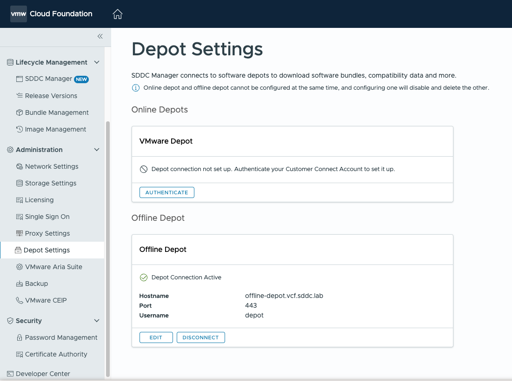

# Central Repository Server

## Table of Contents

1. [Changelog](#changelog)
2. [Introduction](#introduction)
3. [Repository Structure](#repository-structure)
    - [Key Directories](#key-directories)
4. [Configuration Details](#configuration-details)
    - [S3 Synchronization](#s3-synchronization)
    - [NFS Configuration](#nfs-configuration)
    - [Offline Depot](#offline-depot)
    - [Apache Configuration](#apache-configuration)
5. [Usage](#usage)
    - [Accessing the Repository](#accessing-the-repository)

# Changelog

| Version | Date       | Description      | Author          |
| ------- | ---------- | ---------------- | ----------------|
|v1|12/11/2024|Initial Draft| Mihai Radan|

## Introduction

This document describes the central repository's functionality, configuration, structure, and use cases. The repository serves multiple purposes, supporting deployment, upgrades, and various software storage needs. Below are the key features of this repository:

1. **S3 Bucket Synchronization**

   - Syncs an S3 bucket locally to store binaries used for deploying VCS.
   - Enables streamlined access to essential deployment files without relying on remote S3 access. Files are stored in the `LocalS3` directory.

2. **Offline Depot for VCF Upgrades**

   - Configured using Apache to serve as an offline depot for VCF.
   - Facilitates VCF upgrade processes by providing necessary components locally.

3. **Software Repository Storage**

   - Stores additional software repositories for multiple purposes, including:
     - ESXi ISOs
     - Windows and Linux templates
     - Other deployment-related software and assets

4. **NFS Export of Local S3 Bucket and Software Repository**

   - Exports the locally synchronized S3 bucket via NFS shares.
   - Provides seamless access to the repository from other systems within the network.

5. **Apache Exposing via http LocalS3 and software repository**

# Repository Structure

The central repository is organized to simplify navigation and ensure logical separation of its functionalities:

```bash
.
└── central_repo
    ├── LocalS3
    ├── offline_depot
    ├── software_repository
    └── vrops_reports

```

### Key Directories

1. **`LocalS3`**: Contains synchronized files from the S3 bucket, primarily VCS deployment binaries.
2. **`offline_depot`**: Hosts files served by Apache for VMware VCF upgrades.
3. **`software_repo`**: Stores various software assets, organized by type and use case.
4. **`vrops_reports`**: Directory designated for storing vrops reports.

# Configuration Details

To perform the required operations, the following tools/modules were installed::

- AWS cli
- NFS
- Apache

### S3 Synchronization

In order to sync bucket locally a bash script was developed, script is based on '`aws-cli' sync command. Script requires to have proxy and aws profile configured in order to reach S3 bucket.

In aws profile we are specifying location of bucket and access keys:

```bash
Name                    Value             Type    Location
      ----                    -----             ----    --------
   profile                <not set>             None    None
access_key     ****************3LMC shared-credentials-file
secret_key     ****************9Lr8 shared-credentials-file
    region                eu-west-2      config-file    ~/.aws/config
```

Script itself:

```bash
# Set your S3 details
BUCKET_NAME="dhcdownload"

# Set your proxy details
PROXY_HOST="10.99.94.148"
PROXY_PORT="8080"

# Local directory where to sync the files
LOCAL_DIR="/data/central_repo/LocalS3"

# Export proxy settings
export http_proxy="http://$PROXY_HOST:$PROXY_PORT"
export https_proxy="http://$PROXY_HOST:$PROXY_PORT"

# Sync command
aws s3 sync s3://$BUCKET_NAME $LOCAL_DIR --delete --exact-timestamps

# Print a success message
echo "S3 bucket $BUCKET_NAME synced to $LOCAL_DIR"
```

Script is configured under crontab job to run every 4H and create a log file with results of synced files:

```bash
0 0,4,8,12,16,20 * * * su -  next -c  /opt/s3_sync.sh >> /var/log/dhclogs/s3_sync/sync-$(date +\%Y-\%m-\%d-\%H-\%M).log
```

Example of sync report:

```bash
download: s3://dhcdownload/DHC_1_8_2/VMware-vRealize-Log-Insight-8.12.0-21696970.pak to ../../data/central_repo/LocalS3/DHC_1_8_2/VMware-vRealize-Log-Insight-8.12.0-21696970.pak
download: s3://dhcdownload/DHC_1_8_2/VMware-vRealize-Log-Insight-8.14.1-22806512.pak to ../../data/central_repo/LocalS3/DHC_1_8_2/VMware-vRealize-Log-Insight-8.14.1-22806512.pak
download: s3://dhcdownload/DHC_1_8_2/vRealize_Operations_Manager_With_CP-8.x-to-8.12.1.21952629.pak to ../../data/central_repo/LocalS3/DHC_1_8_2/vRealize_Operations_Manager_With_CP-8.x-to-8.12.1.21952629.pak
download: s3://dhcdownload/DHC_1_8_2/vRealize_Operations_Manager_With_CP-8.10.x-to-8.14.1.22798982.pak to ../../data/central_repo/LocalS3/DHC_1_8_2/vRealize_Operations_Manager_With_CP-8.10.x-to-8.14.1.22798982.pak
download: s3://dhcdownload/DHC_1_8_2/VMware-vRealize-Network-Insight.6.9.0.1673888786.upgrade.bundle to ../../data/central_repo/LocalS3/DHC_1_8_2/VMware-vRealize-Network-Insight.6.9.0.1673888786.upgrade.bundle
download: s3://dhcdownload/DHC_1_8_2/VMware-Aria-Operations-for-Networks.6.11.0.1692527086.upgrade.bundle to ../../data/central_repo/LocalS3/DHC_1_8_2/VMware-Aria-Operations-for-Networks.6.11.0.1692527086.upgrade.bundle
download: s3://dhcdownload/DHC_1_8_2/Prelude_VA-8.13.0.31759-22178981-updaterepo.iso to ../../data/central_repo/LocalS3/DHC_1_8_2/Prelude_VA-8.13.0.31759-22178981-updaterepo.iso
S3 bucket dhcdownload synced to /data/central_repo/LocalS3
```

### NFS Configuration

we have exposed as NFS share :

- LocalS3 - local directory for s3 sync
- central_repo - root directory
- software_repository - formerly know D: from terminal server

Configuration can be seen under /etc/exports/.

```bash
# /etc/exports: the access control list for filesystems which may be exported
#               to NFS clients.  See exports(5).
#
# Example for NFSv2 and NFSv3:
# /srv/homes       hostname1(rw,sync,no_subtree_check) hostname2(ro,sync,no_subtree_check)
#
# Example for NFSv4:
# /srv/nfs4        gss/krb5i(rw,sync,fsid=0,crossmnt,no_subtree_check)
# /srv/nfs4/homes  gss/krb5i(rw,sync,no_subtree_check)
/data/central_repo/LocalS3 *(ro,sync,no_root_squash)
/data/central_repo *(rw,sync,no_root_squash)
/data/central_repo/software_repository *(rw,sync,no_root_squash)
```

### Offline Depot

Offline depot will act as an internal mirror of the official VMware online depot. We are using OBTU to download software bundles to this system and a standard web server to serve the content to internal SDDC Manager instances that do not have access to the Internet. This web server is configured with HTTPS certificates and protected with a basic auth username and password.

#### Set up OBTU on the offline depot system

Execute the utility, adjusting the parameters according to your current VCF deployments.

Example for setting-up bundles required for upgrades from vcf 5.1.0.0

```bash
sudo ln -s /data/central_repo/offline_depot   /var/www/
sudo chown $USER:$USER /var/www/offline_depot
 
sudo mkdir /opt/obtu
sudo chmod 755 /opt/obtu/
sudo chown $USER:$USER /opt/obtu/
 
tar zxvf lcm-tools-prod.tar.gz --directory=/opt/obtu/
 
chmod +x /opt/obtu/bin/lcm-bundle-transfer-util
```

#### Download appropriate software bundles based on current vcf version

In this example necessary bundles required for upgrade from version 5.1.0.0 will be downloaded and directory structure will be created:

```bash
cd /opt/obtu/bin

./lcm-bundle-transfer-util --setUpOfflineDepot --offlineDepotRootDir '/var/www/offline_depot' --offlineDepotUrl https://10.99.94.159 --depotUser depot --depotUserPasswordFile password.file --sourceVersion 5.1.0.0
```

##### Directory structure

```bash
.
└── PROD2
    ├── evo
    │   └── vmw
    │       ├── bundles
    │       ├── Compatibility
    │       ├── deltaFileDownloaded
    │       ├── deltaFileDownloaded.md5
    │       ├── index.v3
    │       ├── lcm
    │       ├── manifests
    │       └── tmp
    └── vsan
        └── hcl
            └── all.json
```

### Apache Configuration

- Mainly Apache is configured to serve the offline_depot directory and deployment binaries access via http.
- Example of configuration:

For basic authentication(required by vcf) we need to create .htpasswd file which contains user and hashed password:

```bash
htpasswd -c /var/www/html/.htpasswd depot
```

```bash
<VirtualHost *:443>
<Directory "/var/www/">
    AuthType Basic
    AuthName "Restricted Content"
    AuthUserFile /etc/apache2/.htpasswd
    Require valid-user
</Directory>
    ServerAdmin webmaster@localhost
    ServerName 10.99.94.159
    ServerAlias gre2rep001.dhc.local
    DocumentRoot /var/www/offline_depot
    ErrorLog ${APACHE_LOG_DIR}/error.log
    CustomLog ${APACHE_LOG_DIR}/access.log combined
    SSLEngine on
    SSLCertificateFile /etc/ssl/certs/apache-selfsigned.crt
    SSLCertificateKeyFile /etc/ssl/private/apache-selfsigned.key
    Alias /products/v1/bundles/lastupdatedtime /var/www/offline_depot/PROD2/vsan/hcl/lastupdatedtime.json
    Alias /products/v1/bundles/all /var/www/offline_depot/PROD2/vsan/hcl/all.json
    Alias /Compatibility/VxrailCompatibilityData.json /var/www/offline_depot/PROD2/evo/vmw/Compatibility/VxrailCompatibilityData.json
    Alias /central_repo /var/www/central_repo
    Alias /LocalS3 /var/www/LocalS3
</VirtualHost>
<VirtualHost *:80>
    ServerName 10.99.94.159
    Redirect permanent / https://10.99.94.159/
</VirtualHost>
```

# Usage

### Accessing the Repository

- **S3 Sync**: Files are available under `/central_repo/s3_sync`.
- **Software Repository**: Available locally in `/central_repo/software_repository`.
- **NFS Shares**: Mountable on other systems using:

  ```bash
  mount <server-ip>:/central_repo/Local_s3 /mnt/local_s3
  mount <server-ip>:/central_repo /mnt/central_repo
  mount <server-ip>:/central_repo/software_repository /mnt/software_repository
  ```

- **HTTP Access**: exposed directory can be accessed from a browser using ip or servername.
- **Offline Depot**:
- VCF 5.1 SDDC Manager: You can configure VCF 5.1 to use an offline depot, but there is no graphical configuration to do so. Instead, a command-line tool that is part of the OBTU distribution must be used. Install OBTU on the SDDC Manager and then run the depot_config.py script, providing the IP of the new offline depot server.

   ```bash
   su -
   mkdir /opt/vmware/vcf/lcm/lcm-tools
   chown -R vcf:vcf /opt/vmware/vcf/lcm/lcm-tools
   exit

   tar zxvf lcm-tools-prod.tar.gz --directory=/opt/vmware/vcf/lcm/lcm-tools
   cd /opt/vmware/vcf/lcm/lcm-tools/bin
   chmod +x lcm-bundle-transfer-util

   cd /opt/vmware/vcf/lcm/lcm-tools/conf/offline_depot
   python3 depot_config.py --depotMode offline \
   --depotUrl https://IP
   ```

- VCF 5.2 SDDC Manager: SDDC Manager in VCF 5.2 has an updated user interface that allows administrators to choose between an online or offline depot. Once the offline depot is ready to go, simply log in and enter the FQDN, port, and credentials:

  