# Get clone/restore machine set as per original machine if applicable

## Table of Contents

- [Get clone/restore machine set as per original machine if applicable](#get-clonerestore-machine-set-as-per-original-machine-if-applicable)
  - [Table of Contents](#table-of-contents)
  - [Introduction](#introduction)
    - [Purpose](#purpose)
    - [Audience](#audience)
    - [Scope](#scope)
    - [Prerequisites](#prerequisites)
  - [Action Plan](#action-plan)
    - [Rename and migrate the clone/restore in the correct datastore](#rename-and-migrate-the-clonerestore-in-the-correct-datastore)
    - [Perform re-onboarding of the clone/restore in vRA](#perform-re-onboarding-of-the-clonerestore-in-vra)
    - [Update Snow CMDB](#update-snow-cmdb)
    - [Perform cleanup](#perform-cleanup)
  - [Changelog](#changelog)

## Introduction

### Purpose

This instruction covers the procedure and actions which need to be followed in case there is already a restore/clone created and customer chooses to keep the clone/restore in question and replace the original VM.

It is mandatory that, before we start re-configuring the clone/restore, we have a **customer written approval that clone/restore is needed instead of the original powered off Virtual Machine and that cleanup action can start**.

Keeping both, original VM and clone/restore, in powered on state, is not supported due to IP conflict.

Trying to create a Virtual machine using clone/restore, instead of using vRA Catalog request is also not supported.

### Audience

- VCS Engineers
- VCS Architects
- VCS OS team
- VCS Snow team

### Scope

The Instruction assumes that the reader has reasonable grasp of VCS infrastructure and VMware components.

### Prerequisites

- Access to the vCenter
- Access to the HashiVault
- Client Aviva visibility in SNOW
- Basic vCenter Knowledge
- Basic SRM Knowledge
- Familiar with the onboarding work instruction: [wiOnboardingVraOnpremAviva.md](https://github.com/GLB-CES-PrivateCloud/DHC-Documentation/blob/develop/workInstructions/wiOnboardingVraOnpremAviva.md)
- Customer written approval that clone/restore is needed instead of the original powered off Virtual Machine

## Action Plan

### Rename and migrate the clone/restore in the correct datastore

If clone/restore is powered on and customer chooses to keep this VM instance instead of the original VM, then we have to reconfigure the clone/restore so that it will fully replace the original VM, not only in vCenter but in vRA and Snow as well. To achieve this, some steps are necessary to be done:

1. Launch vSphere Client and log in vCenter with your AD account

   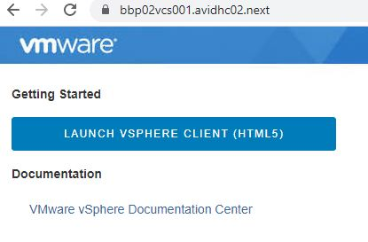

   

   >Note: vCenter FQDN naming convention: *https://< locationCode > vcs001. < searchDomain >*.

2. From vCenter side, we rename both VM containers. We rename the original VM by adding '_old' to its name and the clone/restore with the original VM name.

   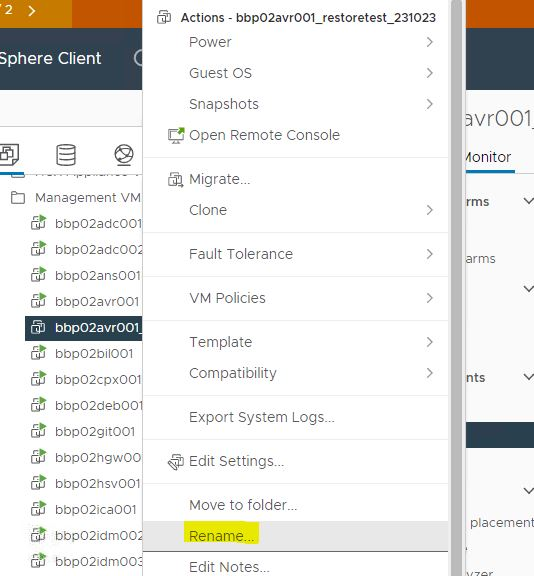

3. We remove the protection from the original VM, from Site Recovery side (SRM), so that we can migrate it to a non-replicated datastore and also because we want the VM disks name to change as well.

   For this we first login to SRM from vCenter side, then from left top drop-down menu, we choose Site Recovery and proceed to login using SSO vCenter account ( <administrator@vsphere.local> ) for each locations, BBP and LBG:

   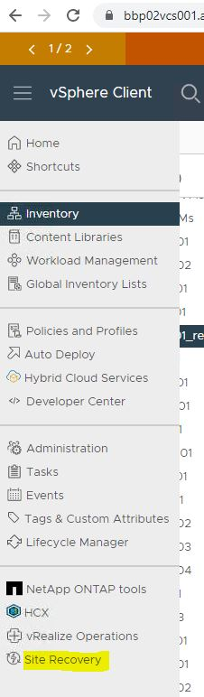

   Once you choose the 'Site Recovery' option from the drop-down menu, it will redirect you to a new page from where you have to click on 'OPEN Site Recovery' button:

   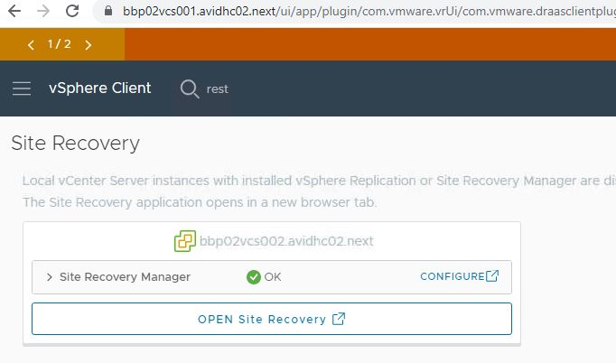

   Next, provide SSO credentials for BBP vCenter and click on the 'LOGIN' button:

   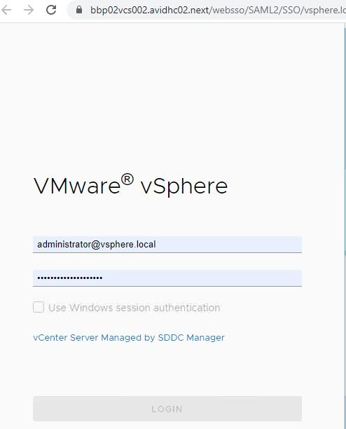

   From Site Recovery page click on 'VIEW DETAILS' button to view details on the Protection Groups:

   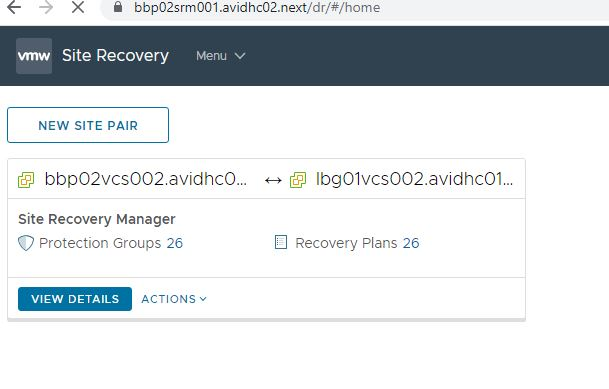

   You must also provide the SSO account for the other SRM location pair, in our case, LBG:

   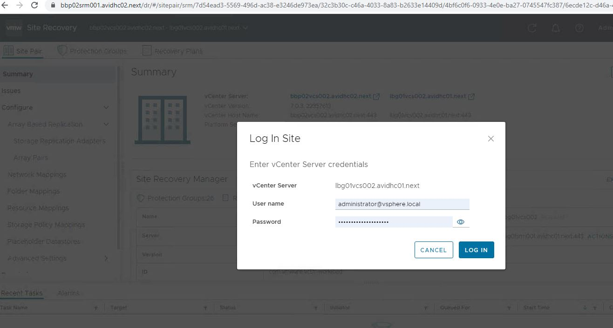

   >Note: This is needed because we have replication both ways: BBP <-> LBG and because once logged in, SRM offers the view on all Protection Groups configured.

   We go to the correct Protection Group where the original VM resides and select the original VM. From the menu above click on the 3 dots and select 'Remove Protection' option.

   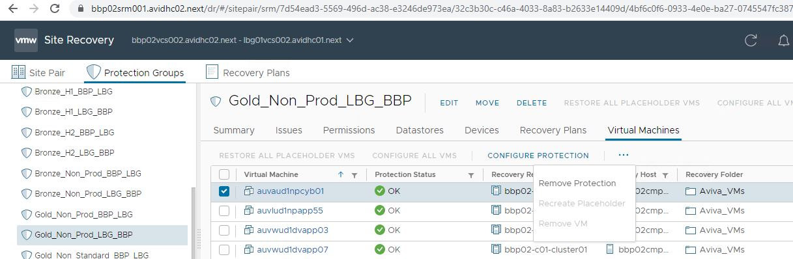

4. We migrate the original and powered off VM, which won't be needed anymore, to a non-replicated datastore and the renamed clone/restore to the desired replicated datastore.

   To migrate, select the Virtual Machine, right click on it and choose from the drop-down menu the option to migrate. Follow the instructions to choose the correct datastore. Bellow is an example of a migrating action.

   Select the VM which needs to be migrated and right click on it, from the drop-down menu, choose 'Migrate':

   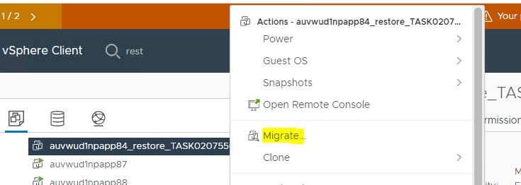

   A new window will open. You choose the migration option, in our case, 'Change storage only':

   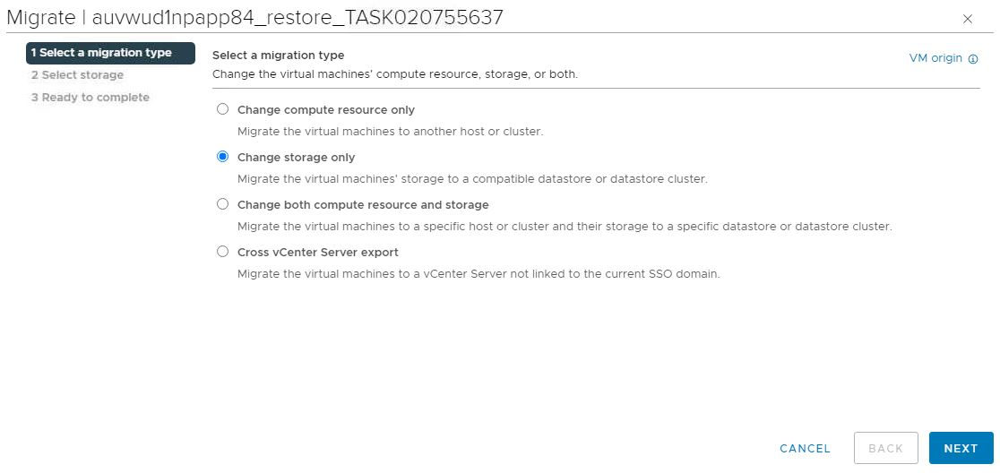

   Next, we choose what will be the destination storage cluster, depending on storage class and replication type:

   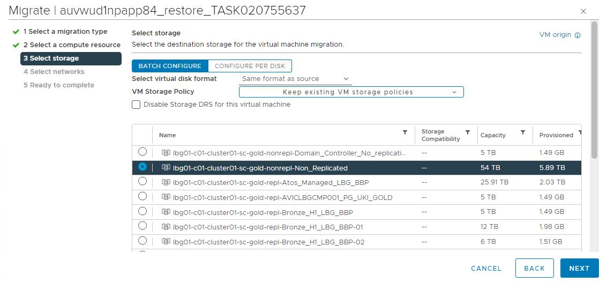

   We leave the selected network unchanged:

   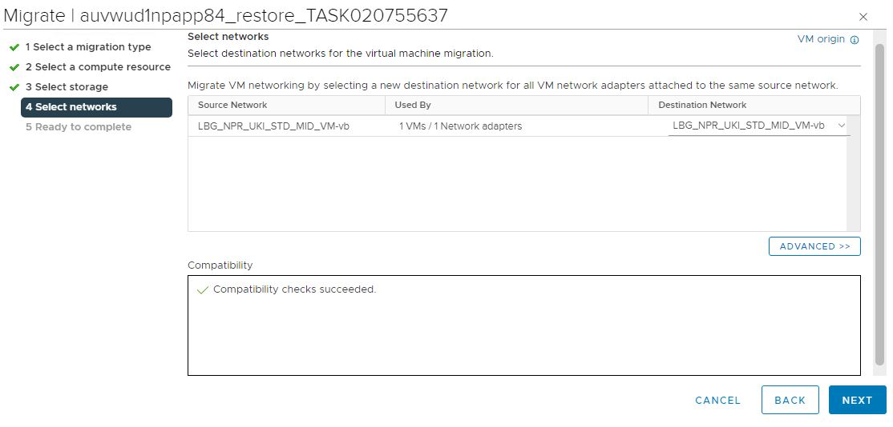

   Review the information and when ready, click on 'FINISH' button. This will start the storage migration.

   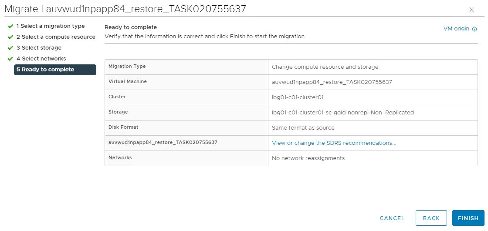

5. Once the clone/restore will be migrated to a replicated datastore, SRM will automatically discover the new migrated VM in the corresponding Protection Group. Next you will have the option to configure protection for it.

   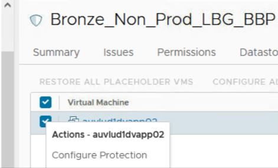

   When replication is first configured for the renamed clone/restore, vSphere Replication performs an initial full sync, which can take some time depending on the size of the VM.

   >Note: it's recommended to initially place the clone/restore on a non-replicated datastore, as there is no confirmation yet from the customer that it should be kept, so no replication needs to occur at this point. However, even if the clone/restore is placed on a replicated datastore, we would still need to migrate it after the renaming action so that its own disks can also be renamed. This is the easiest way of doing this and with no additional downtime for the VM itself.

### Perform re-onboarding of the clone/restore in vRA

When a clone/restore is created in vCenter, vRA automatically discovers it. In this case, we would have the original VM showing as onboarded and the clone/restore in discovered state. Because of this, additional configuration needs to be done.

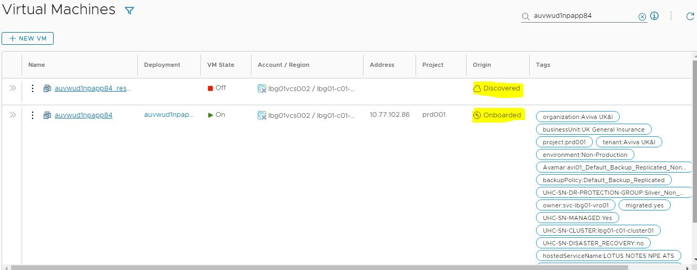

1. Offboard the original VM:

   We first login to vRA using the vRA FQDN and click on 'GO TO LOGIN PAGE' button:

   >Note: vRA FQDN naming convention: *https://< locationCode > vra001. < searchDomain >*.
  
   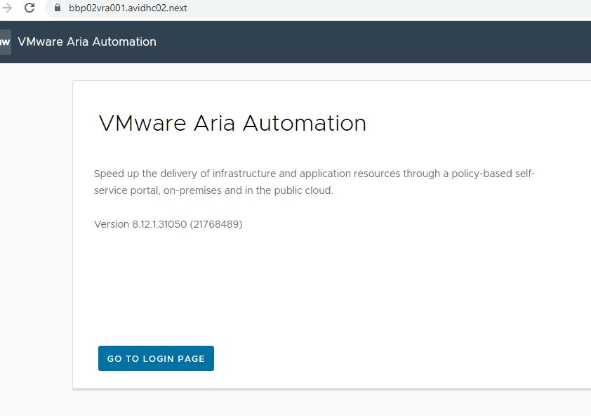

   Initial vRA login page will redirect you automatically to Identity Manager which will alow you to login using your own domain account:

   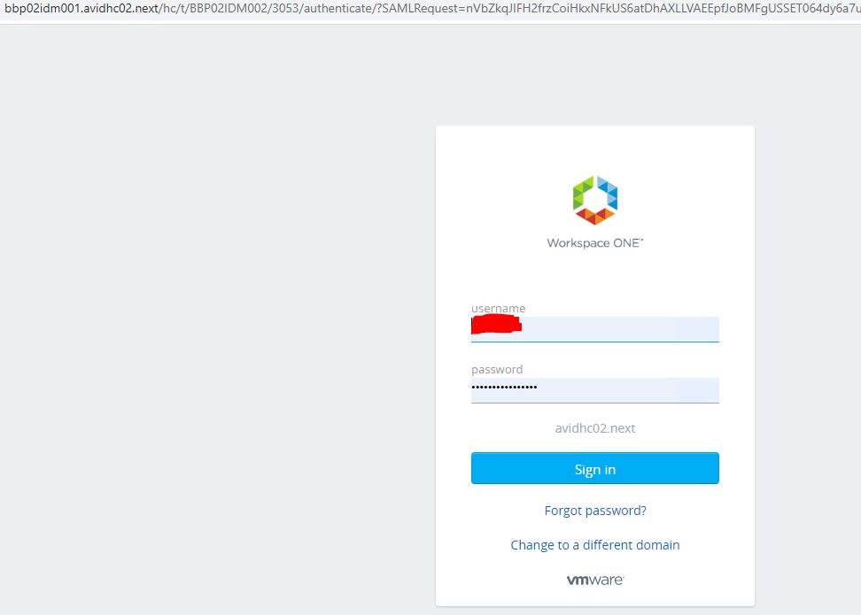

   From 'My Services' section we choose 'Assembler':

   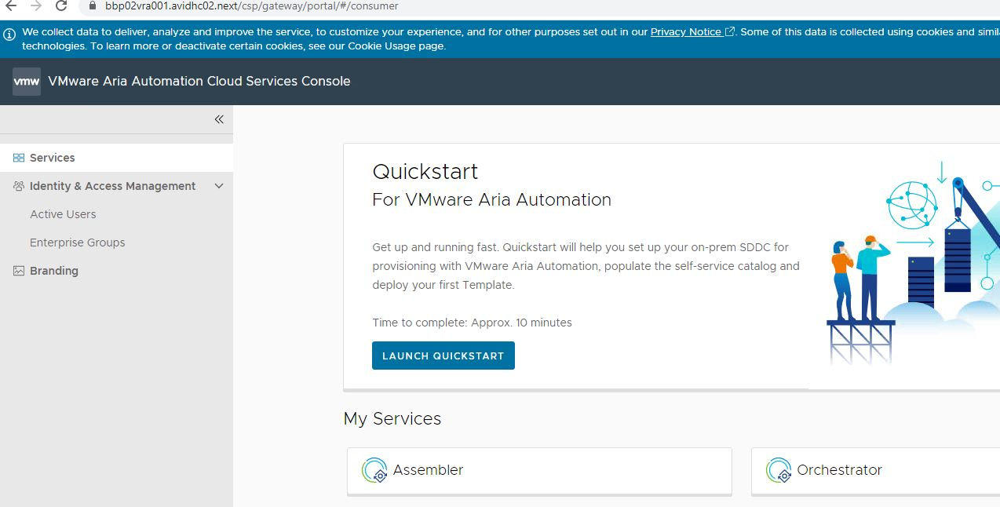

   In Resources -> Deployments, we search after our original VM name.
  
   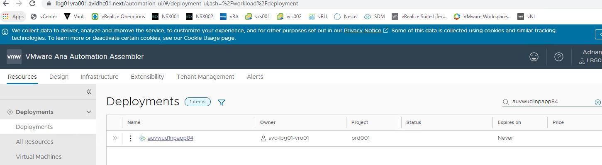
  
   Once we click on it, we need to select the vSphere component from the Topology and, in the right menu, click on the Action drop-down and choose unregister.

   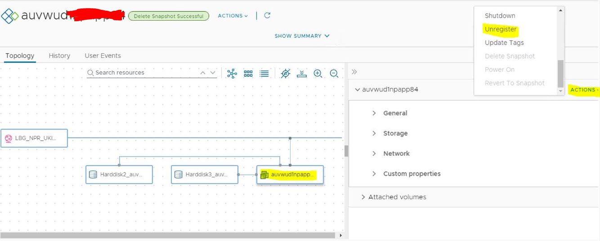

   This action will offboard the original VM and will leave the deployment empty.

   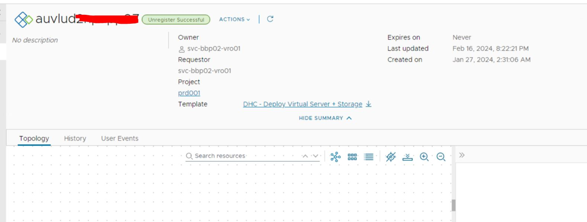

   Also in the 'Virtual Machines' section, the same original VM will show as discovered, similar to the clone/restore one.

   We can now safely delete the deployment.

   >Note: **Double check deployment is empty, before deleting it from vRA!**

2. Onboard the clone/restore:

   Before onboarding action, csv file needs to be prepared. The csv file contains 12 parameters which are actually the tags which need to be the same as for the original VM.

   Pease follow the work instruction for onboarding: [wiOnboardingVraOnpremAviva.md](https://github.com/GLB-CES-PrivateCloud/DHC-Documentation/blob/develop/workInstructions/wiOnboardingVraOnpremAviva.md)

### Update Snow CMDB

The re-onboarded VM will now contain for each of its disk a different resource ID than it is in Snow CMDB. For each of the VM's disks resource ID from vRA, the corresponding External UID value from Snow needs to be updated.

For the disk resource ID of a VM, we login in vRA -> Resources -> Deployments, click on our VM and from the Topology we choose the disk in question. On the right menu, under 'Custom Properties', we can find 'resourceId' listed. We copy it.

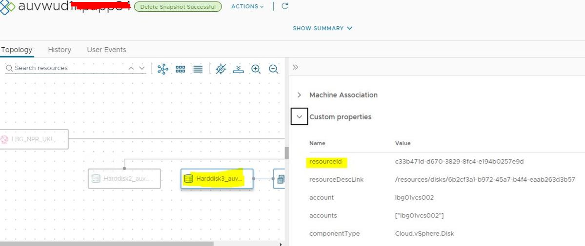

This 'resourceId' should be mapped in Snow with the 'External UID' for the disk:

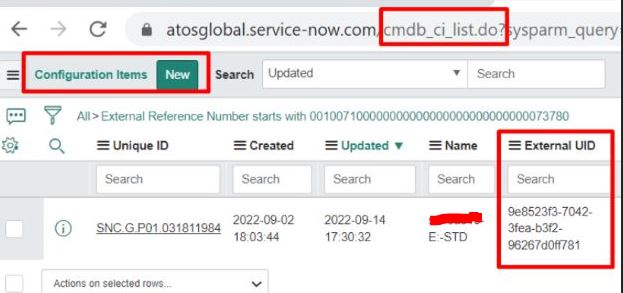

For each of the VM's disks, we need to manually update in Snow the 'External UID' with the copied 'resourceId'. For this we open a request to Snow team with all the required details:

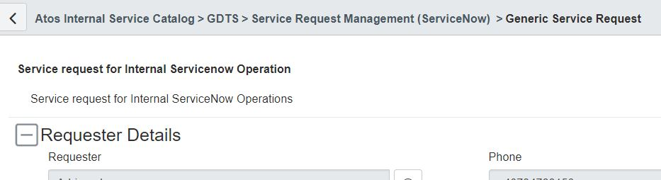

On the Snow request form, we choose 'CMDB' Service and for the Sub Service, 'Generic CMDB Request' option. Based on the type of service we choose a specific Snow team will be assigned to work on our RITM request.

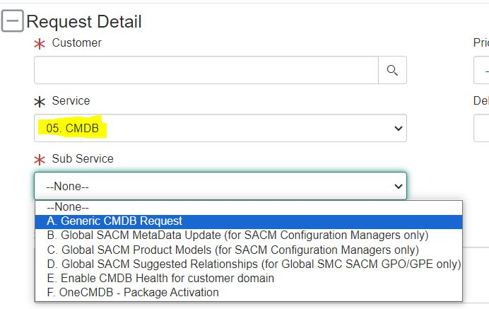

### Perform cleanup

Once we have the clone/restore onboarded, we perform cleanup by removing the powered off original VM from vCenter side. To do this, we select the powered off original VM, right click and choose from the drop-down menu the option 'Delete from Disk'.

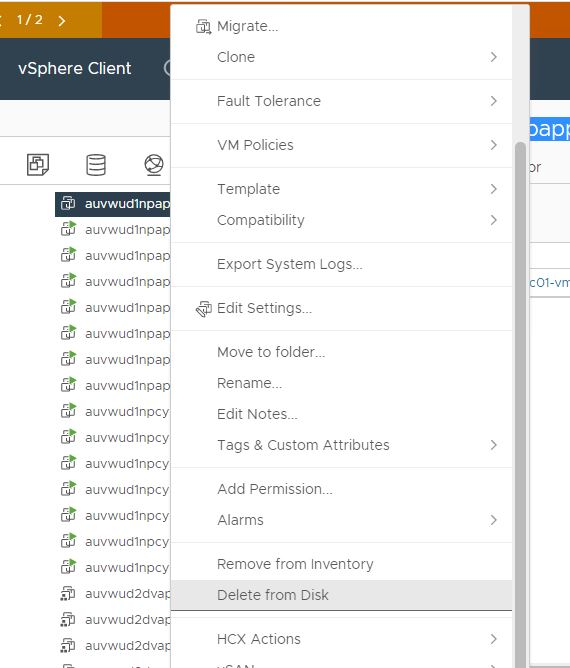

## Changelog

| Version | Date          | Description                                                                                                                                                         | Author             |
|---------|---------------|---------------------------------------------------------------------------------------------------------------------------------------------------------------------|--------------------|
| 0.1     | 20/02/2024    | First version | Lupu Adriana |
