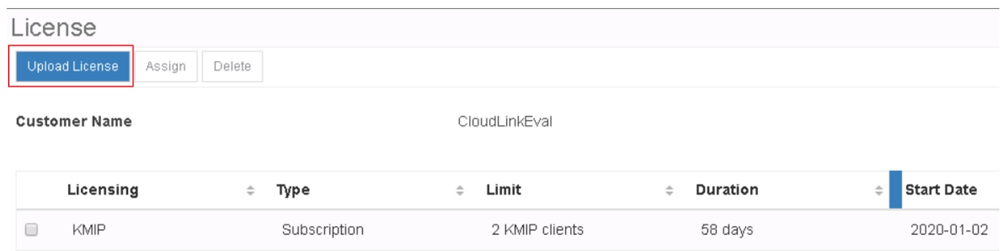

# Configure Cloudlink KMS

# Changelog
  
| Version | Date       | Description              | Author       |
| ------- | ---------- | ------------------------ | --------------- |
| 0.1     | 12/06/2019 | First version | Łukasz Stasiak |
| 0.2     | 12/09/2019 | List of Changes added | Przemyslaw Bojczuk |
| 0.3     | 01/22/2020 | Removed steps that have been automated | Łukasz Stasiak |
| 0.4     | 05/25/2021 | Added info about licensing | Piotr Gesikowski |
| 0.5     | 06/22/2021 | DHC-2269 Updated info about licensing | Łukasz Stasiak |

## Introduction

### Purpose

Install and configure a new instance of Key Management Server (KMS) and vSAN encryption in accordance with Atos Global Delivery standards and portfolio services.

### Audience

- VCS Engineering
- VCS Operations

### Scope

This document covers the following tasks and activities:

- Automated KMS deployment and vCenter integration
- Enabling vSAN encryption

## Installation Time

| Component / Task | Installation Time (HH:MM)    |
| :-------------   | :----------: |
|  KMS deployment and configuration | 00:15   |
| Enabling vSAN encryption    | Depending on datastore capacity, VSAN type (AFA or Hybrid) and the amount of existing data |

# Deployment steps

## Automated KMS deployment and vCenter integration

KMS Installation and configuration is already automated. To deploy Cloudlink KMS appliances dedicated task from role dpc-deployKms is required to be used. In order to run the role valid Cloudlink license file needs to be added in < role folder >\files folder on Ansible core.

| Sub-Step       | Action     |
| :------------- | :----------: |
| 1. | To deploy the Cloudlink appliances run the playbook on ansible core VM with following command `ansible-playbook createCloudlinkKms.yml`. This will deploy two Cloudlink appliances in the MGT cluster base on defined variables. More information about the task can be found in dhc-deployKms role README.md file. |
| 2. | To configure both KMS servers and integrate it with the vCenter server run the playbook on ansible core VM with following command `ansible-playbook configureCloudlinkKms.yml`. This playbook will configure fully functional Cloudlink KMS cluster and add it to vCenter base on defined variables. More information about the task can be found in dhc-deployKms role README.md file. |

## Enable vSAN Encryption CMP cluster

| Sub-Step       | Action     |
| :------------- | :----------: |
| 1.       | As encryption is CPU intensive AES-NI needs to be enabled in BIOS of a vSAN nodes.Verify that this is already enabled.|
| 2.       | Log on to the vCenter server and select CMP cluster. Next click `Configure`. Under `vSAN`, select `Services`   Click the `Encryption` `Edit` button.|
| 3.       | On the vSAN Services window select the Encryption. Select created KMS cluster   __Do not select__ *Wipe residual data* and *Allow Reduced Redundancy* Click `Apply` to enable encryption. __Note:__ If you have less than 30% free space on VSAN datastore then you can select *Allow Reduced Redundancy* option. This option keeps the VMs running, but the VMs might be unable to accept the full number of failures defined in the VM storage policy.  As a result, the virtual machine will be in risk of single point of failure.|
| 4.| Make sure that encryption is finished successfully. Overall Progress can be monitored in Monitor > tasks.|

## License update

Initial Cloudlink (KMS) deployment is using development  license. It needs to be update with the license purchased for the customer deployment.

Please note that if production license will be generated with different customer name than development license you can receive following error message when trying to upload new license file:  'Customer name 'your customer name' differs from the current customer name'. In that case you need to delete the old license before new one can be uploaded.

To delete development license used during VCS build select it and click on 'Delete'. Confirm license deletion by clicking on the delete button. Next follow the steps below to upload the new Cloudlink license.

| Sub-Step       | Action     | Screenshot |
| :------------- | :----------: | :----------: |
| 1.             |Log into the Cloudlink webGUI on a first cluster node using secadmin account and go to __System>License__.   Click __Upload License__ and select a new license key file.  License Subscription must be valid.   ||
