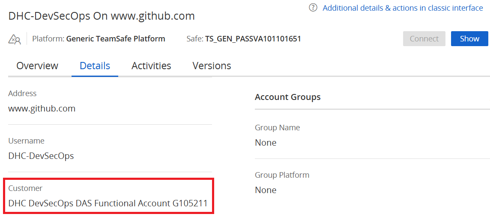
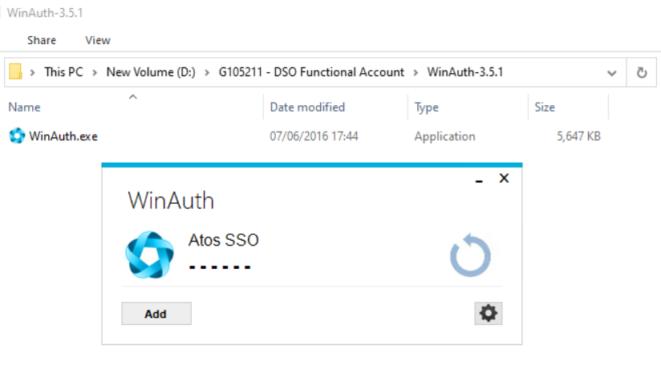

# DAS Functional Account

## Changelog

| Date       | Issue     | Author               | Description |
|------------|-----------|----------------------|-------------|
| 19.05.2025 | VCS-15795 | Stanislaw Kilanowski | Initial document creation |
| 14.07.2025 | VCS-14432 | Stanislaw Kilanowski | Described the Red Hat account |
| 12.09.2025 | VCS-17145 | Stanislaw Kilanowski | Updated 2FA details |

## Introduction

### Purpose

Understanding the setup and use cases of the DevSecOps team's DAS Functional Account.

### Audience

- VCS Engineers
- VCS Operations

## Setup

The DevSecOps DAS Functional Account was created for the purpose of automating solutions that require configuration outside of a single VCS environment. It allows us to expand automation beyond service accounts and into areas accessible by DAS (like for any Atos employee's account).

### DAS

The account is a shared person identity with the following attributes:

- **DAS ID**: G105211
- **Name**: VCS-automation Functional Account
- **Mailbox**: <VCS-automation@atos.net>

At the time of writing this document, the account's password requires rotation every 3 months and the account itself expires and needs to be manually extended every 6 months. Notifications of the former are sent to the account's manager over an e-mail who informs the team, while the latter is sent to the account's mailbox and automatically forwarded to the <DHC-DevSecOps@atos.net> mailbox.

### Password management

Passwords for this account and its other sensitive data are stored in the team's CyberArk Vault and should all be accessible by searching for the DAS ID (G105211) as a keyword.

To make sure that this is possible, the best practice for adding new entries to the Vault requires putting the DAS ID in any of the fields, for example the "Customer" field.



### DAS authentication

> [!TIP]
> SSO authentication of this account may be troubling, as usually the user would log in with their own DAS account in advance. One of the viable solutions is to open Incognito/Private window in the browser and perform all work for the DAS Functional Account there.

Some tools require strong SSO authentication, which can be granted by an authenticator app. For the purpose of teamwide accessibility to the 2FA token, it has been stored on a VCS LAB environment (GRE2 at the time of writing this document). **This on its own requires a separate AD account on the environment** (`G105211@<domainName>`).

The token is generated with the **WinAuth** app (available on the Company Portal) and configured on the environment's Terminal Server. It's accessible only by the specific AD account. Configuration follows the step **5.1.3** of the User Guide linked in the Company Portal or available [here](https://atos365.sharepoint.com/:b:/r/sites/100002399/Shared%20Documents/WAC-SSO/DAS_WAC_SSO_AUTH_User_Guide.pdf?csf=1&web=1).



### GitHub

To allow automatic Git repository management and ensure high availability for the automation, a **read-only token** was created on a dedicated Git account. The same account (named **DHC-DevSecOps**) was added as a member to the GLB-CES-PrivateCloud organization.

A fine-grained token was generated to ensure read-only access to the organization. It expires after a year (highest limit enforced by the organization) and it is stored in the Vault.

### Red Hat

An account on the Red Hat portal (named **vcs-automation**) grants us access to the Red Hat Console and allows to manage Red Hat VM Registration.

## Use cases

### Repository management

The local DHC-Manage repository clone on Ansible Core VM (at `\opt\dhc\manage`) is used for running various VCS automation. As we're regularly making operational updates, we need to make sure they're populated on the environments. We can use the read-only Git token for this purpose. An Ansible playbook was created to automate setup and repository update.

To save the Git authentication token in the Vault, execute the playbook with a tag `saveGitToken`:

```shell
ansible-playbook updateDhcRepository.yml -t saveGitToken
```

To update the local repository, execute the playbook with a tag `performUpdate` or without any:

```shell
ansible-playbook updateDhcRepository.yml -t performUpdate
```

To configure a Cron job for automatic execution, execute the playbook with a tag `configureCron`:

```shell
ansible-playbook updateDhcRepository.yml -t configureCron
```

By default the Cron job will be triggered daily at 23:30 UTC.

### Global Linux Image Patching

The account created on the Red Hat portal grants us access to the Red Hat Console and registering Linux VMs. Please refer to the [Manage Global Image Patching WI](wiManageGlobalImageLinuxPatching.md) for more details.
