# VCS Dell Esxi Upgrade With Custom Images

## Table of contents

- [DHC Dell Esxi Upgrade With Custom Images](#vcs-dell-esxi-upgrade-with-custom-images)
  - [Table of contents](#table-of-contents)
  - [Changelog](#changelog)
  - [Introduction](#introduction)
    - [Scope](#scope)
  - [Firmware and driver upgrade procedure](#firmware-and-driver-upgrade-procedure)
  - [Firmware server components upgrade](#firmware-server-components-upgrade)
  - [ESXi host upgrade](#esxi-host-upgrade)
    - [Upgrade ESXi with VMware Cloud Foundation Stock ISO and Async NIC Driver](#upgrade-esxi-with-vmware-cloud-foundation-stock-iso-and-async-nic-driver)
    - [Download async driver](#download-async-driver)
    - [Upgrade ESXi with Async Driver](#upgrade-esxi-with-async-driver)
    - [Upgrade ESXi hosts with Dell Custom Image](#upgrade-esxi-hosts-with-dell-custom-image)

## Changelog

|    Date    |   TOS   |   Issue   |     Author    |      Description       |
| ---------- | ------- | --------- |  ------------ | ---------------------- |
| 10/04/2022 |         |           |  Maciej Losek |  Initial draft version  |

## Introduction

Following document describes the available options for upgrading Dell servers firmware and ESXi hosts with custom images and async NIC drivers for clusters in a workload domain that uses vLCM baselines. This procedure has been tested on nested environment vx1.

### Scope

The scope of this document covers the following:

- upgrading ESXi firmware using Hardware vendor (Dell) bootable CD-ROM/DVD;
- upgrading ESXi hosts with Async NIC Driver as part of VCF upgrade procedure.
- TBD- upgrading ESXi hosts with custom images as part of VCF upgrade procedure - TBD.

## Firmware and driver upgrade procedure

>**VMware recommends installing the latest certified driver whenever possible and managing the firmware level consistently and following the hardware vendor's recommendations to avoid running into any interdependency issues.**
>**VMware recommends using the latest firmware versions with certified drivers.**
>**Firmware upgrade should be performed before ESXi hosts upgrade procedure described in `dhcVcfUpgradeTo-4.3.1.1.md` work instruction.**

Verify that the new version of vSAN (included in new VCF BoM) supports the software and hardware components, drivers, firmware, and storage I/O controllers that you plan on using.  

Supported items are listed on the VMware Compatibility Guide website at [VMware Compatibility Guide](http://www.vmware.com/resources/compatibility/search.php).

For recommendations on latest combination of supported driver and firmware refer to OEM vendor matrix.

  [Dell](http://www.dell.com/support/my-support/us/en/19)  
  [Broadcom](https://www.broadcom.com/support/download-search)  
  [Intel](http://www.intel.com/support/network/adapter/pro100/sb/CS-035401.htm)  
  [Mellanox](https://mymellanox.force.com/support/SupportLogin)  
  [Qlogic](http://driverdownloads.qlogic.com/QLogicDriverDownloads_UI/)  
  [Emulex](https://www.broadcom.com/support/download-search)  
  [LSI](https://www.broadcom.com/support/download-search)  

## Firmware server components upgrade

**Firmware upgrade should be performed before ESXi hosts upgrade procedure described in `dhcVcfUpgradeTo-4.3.1.1.md` work instruction.**

1. Login to vSphere Client and place the host in `Maintenance Mode`.

2. Go to [Dell Product Support Site](https://www.dell.com/support/home/en-us?app=products) and find the `Platform Specific Bootable ISO` for your Dell server model.

3. Download `Platform Specific Bootable ISO` to performed firmware server component updates of DELL Server. The ISO carries all the Dell EMC firmware Update Packages required for updating the server.

4. Use the `Virtual Media` function on Integrated Dell Remote Access Controller (iDRAC) to update the server. This method allows the remote usage of matching bootable image (ISO-file) and update all server firmware.

    >**The firmware update process may take up to 1 hour to complete(Do not reboot before!)**
    >**After all firmware updates are done the system shows a message that a warm reboot is required.**

    More details here: [Using the Virtual Media function](https://www.dell.com/support/kbdoc/en-us/000124001/using-the-virtual-media-function-on-idrac-6-7-8-and-9)

5. Login to vSphere Client and exit the host from `Maintenance Mode`.

6. Repeat steps 1-5 for rest of ESXi hosts in cluster.

## ESXi host upgrade

For clusters in workload domains (mgmt and cmp) with vSphere Lifecycle Manager baselines, use the following procedures to perform ESXi upgrades with custom images or async drivers.

### Upgrade ESXi with VMware Cloud Foundation Stock ISO and Async NIC Driver

For clusters in workload domains with vLCM baselines, you can apply the stock ESXi upgrade bundle with specified async drivers.

### Download async driver

After firmware upgrade please follow bellow steps to determine installed NIC driver.

1. SSH to ESXi host.

2. List all NICs installed in ESXi host:

    ```shell
    esxcli network nic list
    ```

   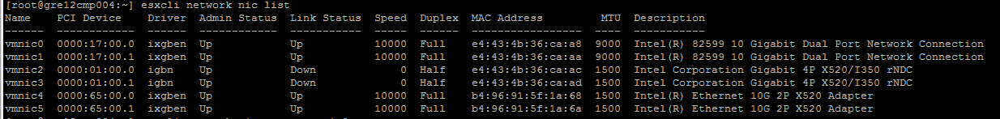

3. Obtain current installed driver and firmware version"

    ```shell
    esxcli network nic get -n vmnic0
    ```

   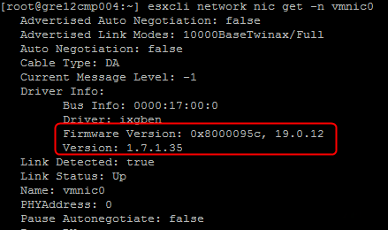

4. To determine the recommended driver for the card, obtain the Vendor ID (VID), Device ID (DID), Sub-Vendor ID (SVID), and Sub-Device ID (SDID) using the vmkchdev command (on the screenshot below `Intel(R) 82599 10 Gigabit Dual Port Network Connection` was used as an example). :

    ```shell
    vmkchdev -l |grep vmnic
    ```

    ```txt
    VID - Vendor ID
    DID - Device ID
    SVID - Sub-Vendor ID
    SSID - Sub-Device ID
    ```

   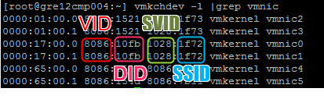

5. Navigate to the [VMware Compatibility Guide](https://www.vmware.com/resources/compatibility/search.php?deviceCategory=io) and search for the Vendor ID (VID), Device ID (DID), Sub-Vendor ID (SVID), and Sub-Device ID (SDID).

   >I/O Adapters in the `VMware Compatibility Guide` are listed with the minimum firmware version and links to corresponding drivers at the time of certification.

6. Apply filters to locate the IO device for which you want to upgrade the driver and open the device page.

   **`Product Release Version`**: ESXi target version;

   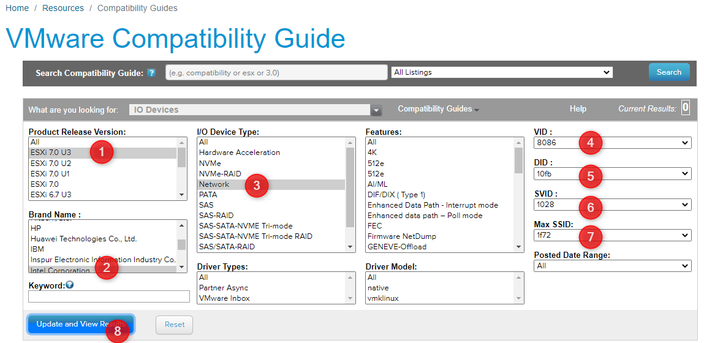
   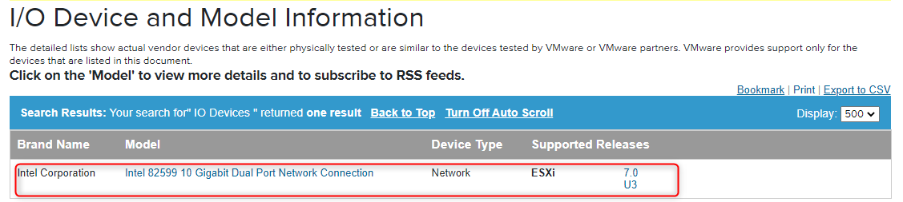

7. Look through the list for the version of ESXi you are running.

    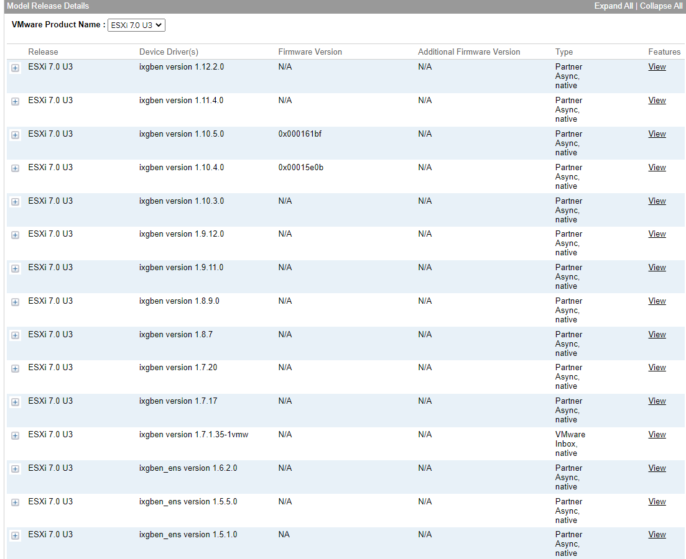

8. Click the plus beside the version and click the link under footnotes to open the driver download page.
Download the driver bundle to your local system.

    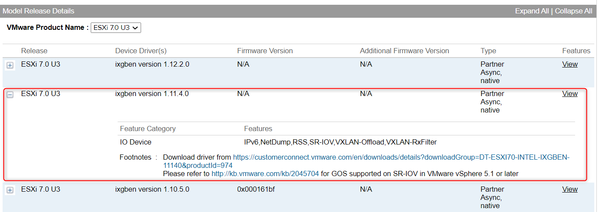

   >**According to VMware recommendations (Service Request 22320895504), if there is no information about the firmware version in `Firmware Version` column for a given server component, then the information should be provided by the hardware vendor (Dell, HP etc.).**

9. Download the recommended certified async driver version.

### Upgrade ESXi with Async Driver

For clusters in workload domains with vSphere Lifecycle Manager baselines, use the following procedures to perform ESXi upgrades with custom images and async drivers.

Follow steps described below (this procedure is also descibed in [VMware Cloud Foundation Product Documentaion](https://docs.vmware.com/en/VMware-Cloud-Foundation/4.3/vcf-lifecycle/GUID-1B6BAEE7-5549-4196-A710-CACE4E5D9C70.html)):

1. SSH to sdm001 and enter `su` to switch to the root user;
2. Create a directory for the vendor provided async drivers:

    ```shell
    mkdir /nfs/vmware/vcf/nfs-mount/esx-upgrade-partner-drivers
    ```

    ```shell
    mkdir /nfs/vmware/vcf/nfs-mount/esx-upgrade-partner-drivers/drivers
    ```

3. Copy the async drivers to the directory `nfs/vmware/vcf/nfs-mount/esx-upgrade-partner-drivers/drivers` using WinSCP:

4. Change permissions on the directory `nfs/vmware/vcf/nfs-mount/esx-upgrade-partner-drivers/drivers`:

    ```shell
    chmod -R 775 /nfs/vmware/vcf/nfs-mount/esx-upgrade-partner-drivers/
    ```

    ```shell
    chown -R vcf_lcm:vcf /nfs/vmware/vcf/nfs-mount/esx-upgrade-partner-drivers/drivers
    ```

5. Create an ESX custom image JSON file `esx-custom-image-upgrade-spec.json` in `/nfs/vmware/vcf/nfs-mount/`. Example of a completed JSON file- it should be constructed as below:

    **`bundleId`**: bundle ID of the ESXI bundle you downloaded via SDDC Manager and can be found in `Bundle Download History`. In the SDDC Manager `Dashboard`, click `Repository` -> `Bundle Management` > `Download History`. All downloaded bundles are displayed. Click `View Details` to see bundle metadata details.;  

    **`targetEsxVersion`**: ESXi version for the target VCF version;  

    **`esxPatchesAbsolutePaths`**: path_to_Drivers;  

    ```json
    {
    "esxCustomImageSpecList": [{
    "bundleId": "1625a9f9-a96b-4dda-98c6-58938fb29667",
    "useVcfBundle": true,
    "esxPatchesAbsolutePaths": [
    "/nfs/vmware/vcf/nfs-mount/esx-upgrade-partner-drivers/drivers/Intel-ixgben_1.10.5.0-1OEM.700.1.0.15843807_19585348.zip"
    ]
    }]
    }
    ```

    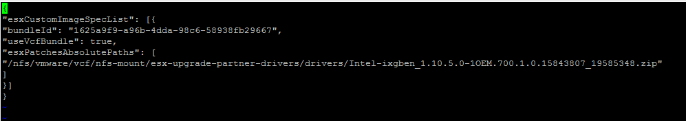

6. Set the correct permissions on the `/nfs/vmware/vcf/nfs-mount/esx-custom-image-upgrade-spec.json`

    ```shell
    chmod -R 775 /nfs/vmware/vcf/nfs-mount/esx-custom-image-upgrade-spec.json
    chown -R vcf_lcm:vcf /nfs/vmware/vcf/nfs-mount/esx-custom-image-upgrade-spec.json
    ```

7. Open the `/opt/vmware/vcf/lcm/lcm-app/conf/application-prod.properties` file and in the `lcm.esx.upgrade.custom.image.spec=` parameter add the path to JSON file:

    ```txt
    lcm.esx.upgrade.custom.image.spec=/nfs/vmware/vcf/nfs-mount/esx-custom-image-upgrade-spec.json
    ```

8. Go back to the SDDC Manager GUI-> click `Inventory` > `Workload Domains` -> on the `Domain Summary` page, click the `Updates/Patches` tab. In the `Available Updates` section download bundle if not yet done and click `Update Now` or `Schedule Update` next to the `VMware Software Update bundle for VMware ESXi`.

Once done please confirm if driver has been successfully installed (running on ESXi hosts):

```shell
esxcli network nic get -n vmnic0
```

As tests have been performed on nested environment the only possible way to check if driver was upgraded successfully was to check it through vSphere Client and SDDC Manager GUI:

**before**

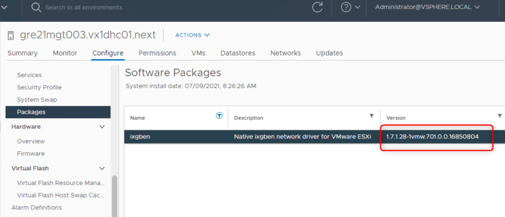

**after**

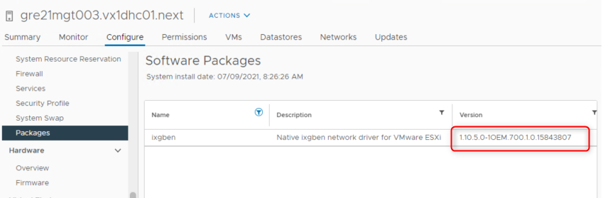

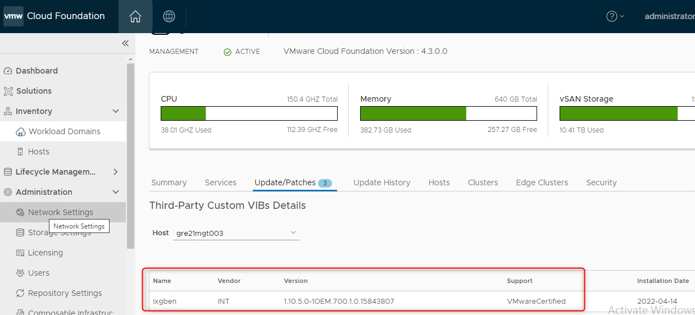

> **PLEASE NOTE, AFTER INSTALLATION, ESXi HOSTS WILL BE SHOW UP AS YELLOW IN PRE_CHECKS, SINCE 3rd PARTY VIBs ARE INSTALLED.**

### Upgrade ESXi hosts with Dell Custom Image

TBD
