# Deploy Dns

# Changelog

| Version | Date | Author | Changes |
|---------|------|------|---------|
| 0.1 | 25.05.2020 | Michal Pindych | Document creation |
| 0.2 | 01.06.2020 | Michal Pindych | Document creation |

## Introduction

### Purpose

Configure DNS for central and satellite Infoblox.

### Audience

- VCS Engineers
- VCS Architects

### Scope

The main assumptions for DNS deployment in VCS and the manual way of setting up DNS functionality on Infoblox devices using one of the options are:

- DNS infrastructure provided by the client
- DNS infrastructure provided by VCS environment.

This document covers the following topics

- DNS design
- Configuration DNS for central Infoblox
- Configuration DNS for satellite Infoblox
- Sample configuration of customer DNS

# DNS Design

Please refer to [IPAM LLD](../design/lldIPAM.md) and dedicated section regarding DNS infrastructure.

## Dedicated customer DNS infrastructure  

| Steps              | Picture |
| -------------------------- |--------------- |
| 1. Follow the path "Data Management" -> "DNS" -> "Members"            | 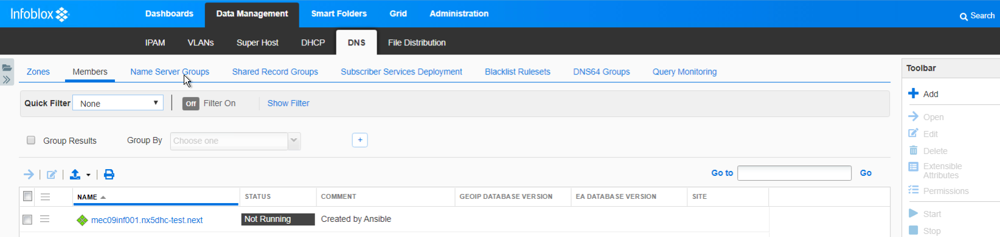 |
| 2. Mark check box near member name and click "Start" button to run DNS service. From this moment DNS service will be active on a given member.     | 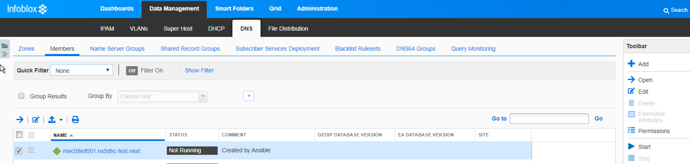 |
| 3. Follow the path "Data Management" -> "DNS" -> "Zones" and choose the specific zone You want to configure by clicking on it  ( in this example we are using mec09web.local )  | 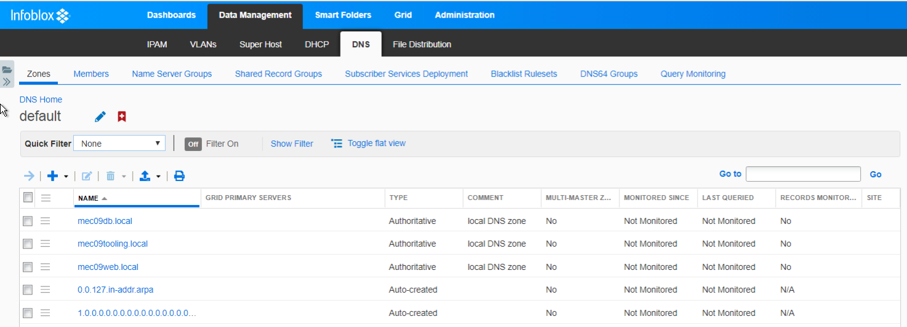       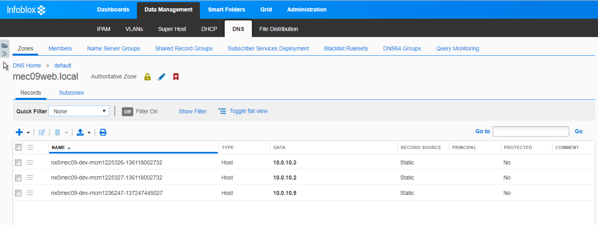 |
| 4. Click "Pencil" icon, after that, new zone configuration window appear  | 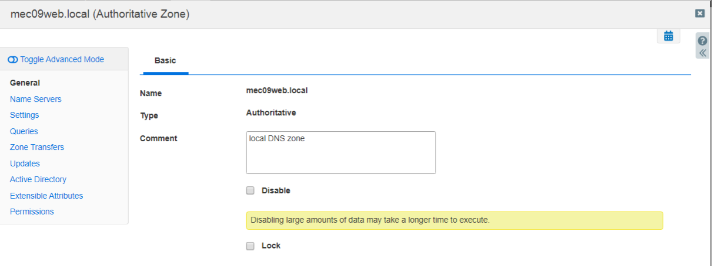 |
| 5. Choose the "Name Server" tab to configure primary and secondary DNS server and then chose option "Use this set of name server"  | 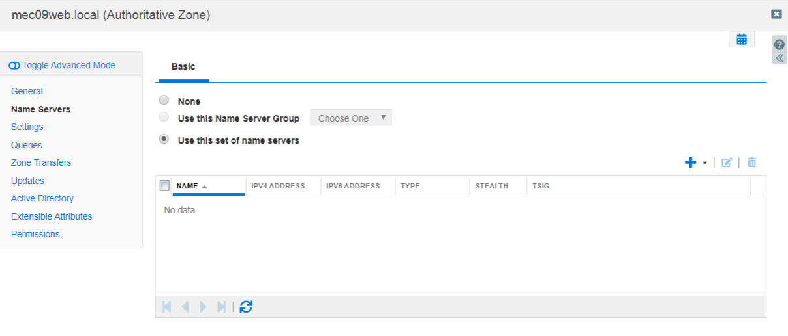 |
| 6. First please choose "+" sign, later the "Grid Primary" option and then select member name corresponding to primary DNS  |     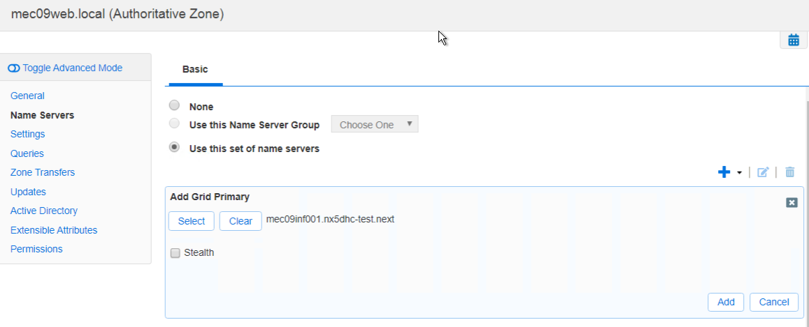    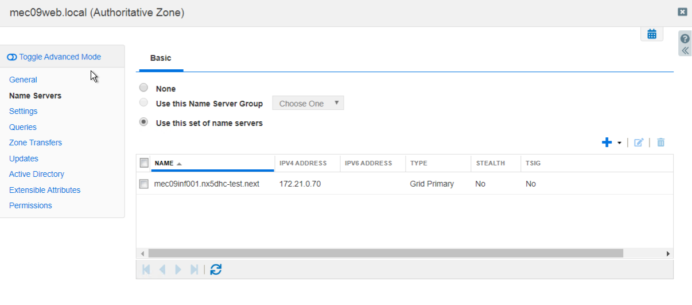 |
| 7. Please click "+" icon one more time in order to add customer DNS server as a secondary one, choose "External Secondary" and fill up required info regarding name and IP address                                                                      | 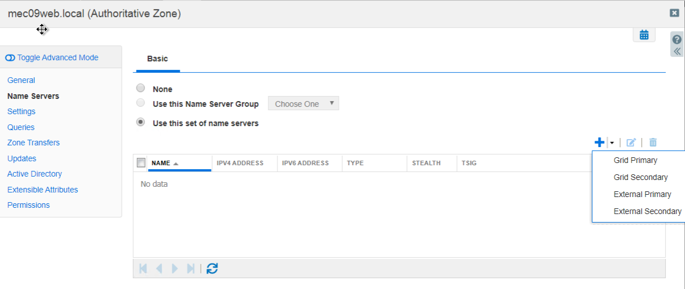    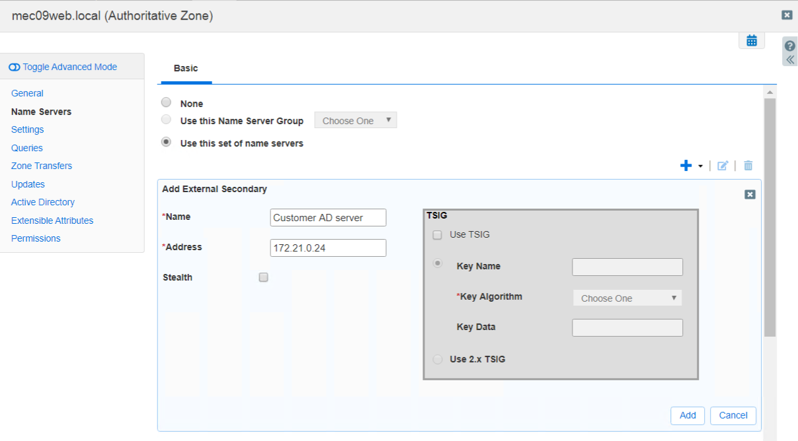    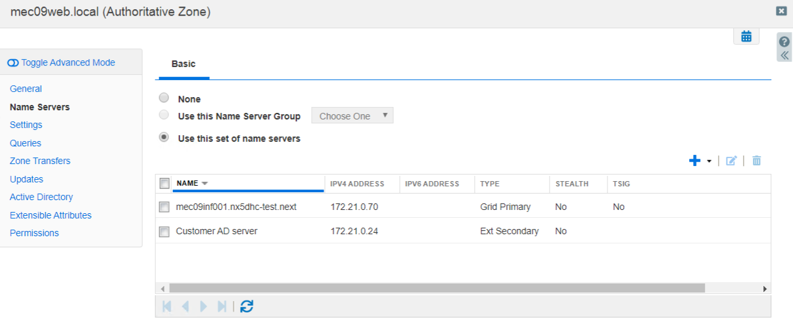 |
| 8. If needed, please change tab to "Setting" and update appropriate values for DNS server (for example refresh interval )                                                                      | 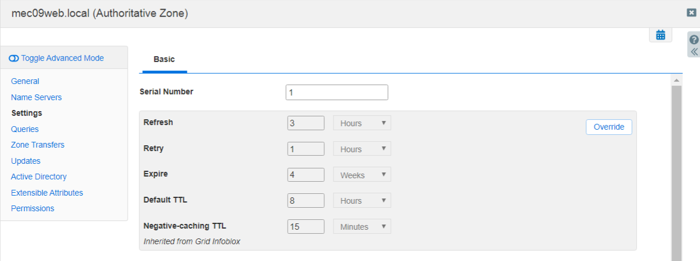 |
| 9. At the end please click "Save and close"  button                                                                     |  |
| 10. Please remember to restart DNS service every time configuration is changed, refer to yellow beam at upper part of the GUI | 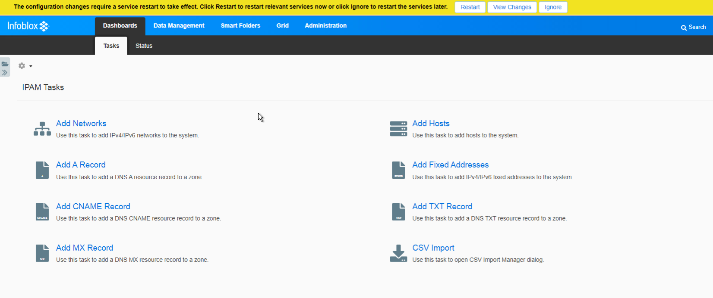 |

## Dedicated DNS infrastructure provided by VCS

| Steps              | Picture |
| -------------------------- |--------------- |
| 1. Follow the path "Data Management" -> "DNS" -> "Members", check box near Infoblox member deployed in customer workload and then click "Start" button.                                                       | 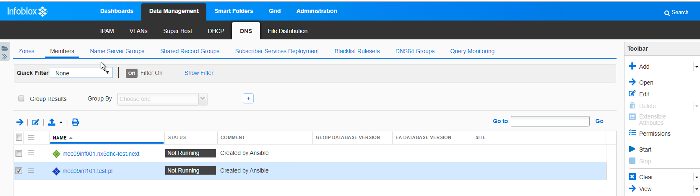 |
| 2. Confirm the configuration, from this moment DNS service, will be activated on a given member.                                                       | 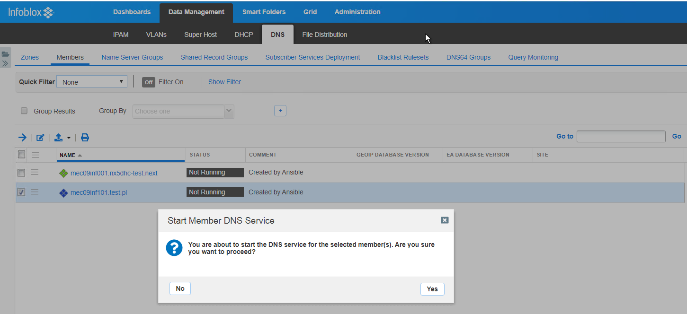     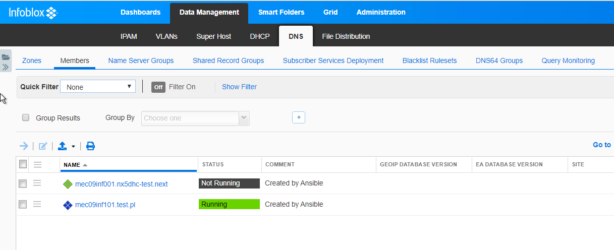 |
| 3. Please click on "Grid DNS properties", change tab to "Forwarders" and add specific IP address which corresponds to DNS to which queries should be forwarded.                                                      | 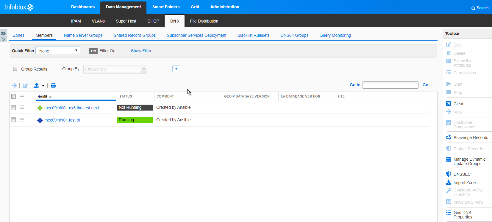     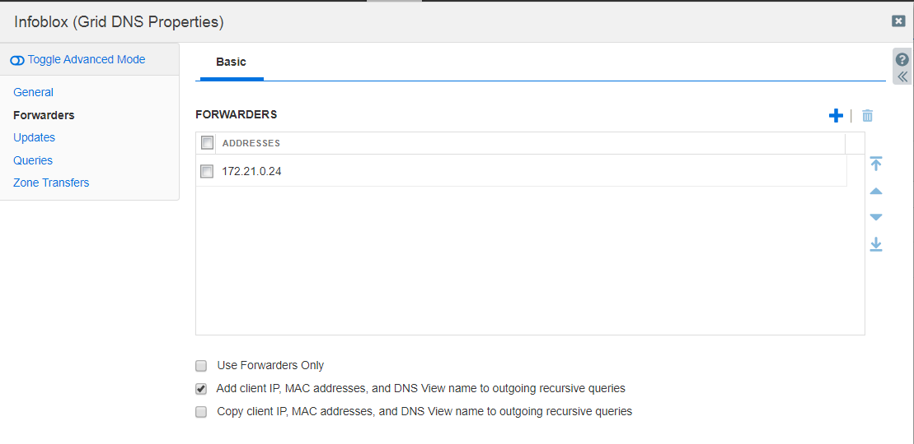  |

## Integration with customer DNS

Integration with custom DNS will be presented based on the Active Directory implementation example.

| Steps              | Picture |
| -------------------------- |--------------- |
| 1. Please execute "DNS Manager".                                                       | 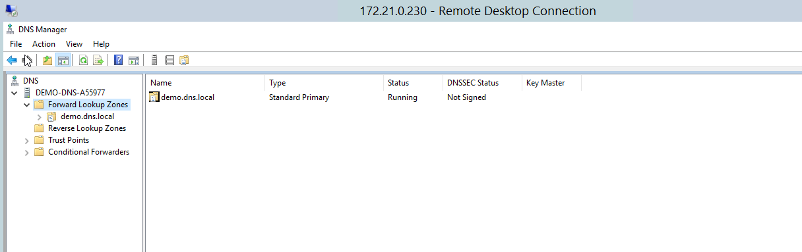 |
| 2. Choose "Forward Lookup Zones" and from "Action" menu choose "New Zone".             | 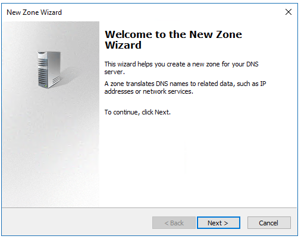 |
| 3. Set up zone type to "Secondary zone".                                               | 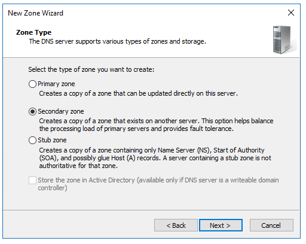 |
| 4. Set up zone name ( this must reflect zone configured on Infoblox).                  | 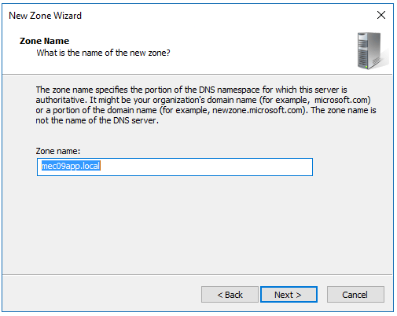 |
| 5. Please configure Infoblox IP as a "Master DNS Server".                              | 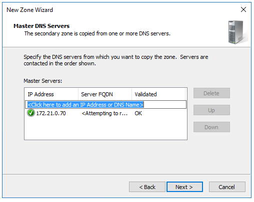 |
| 6. In the end please validate all provided data and click the finish button.           | 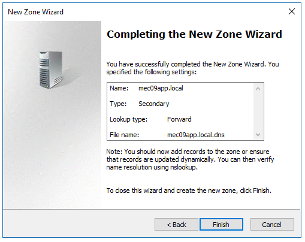 |
