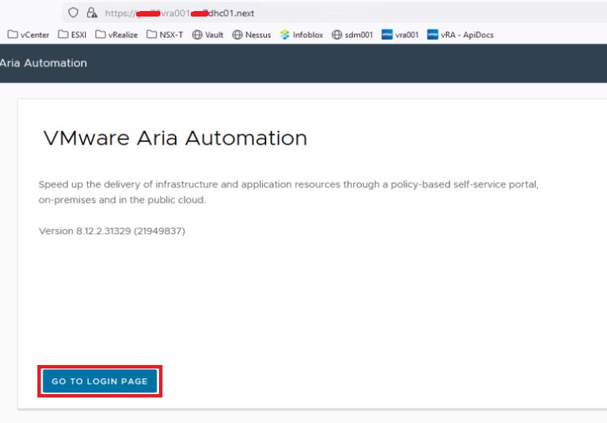
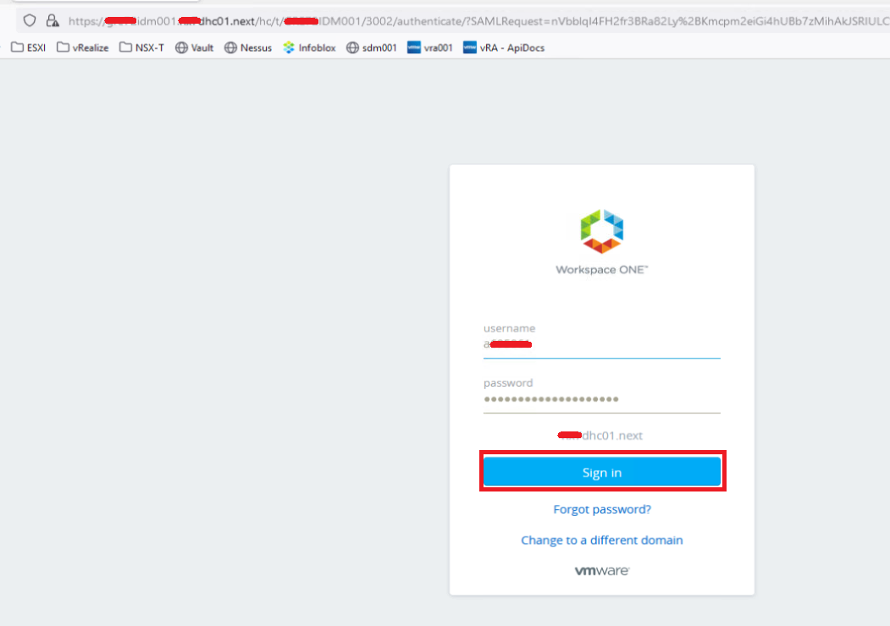
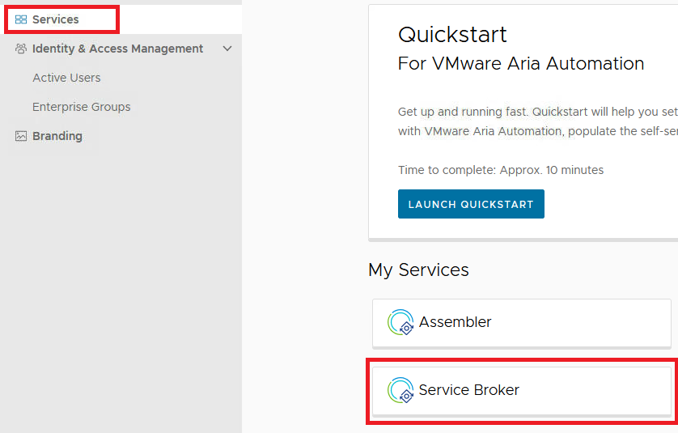
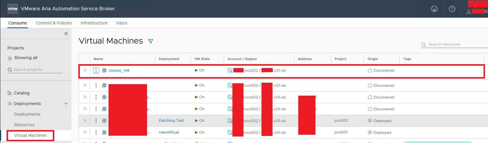
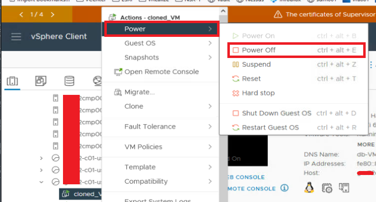
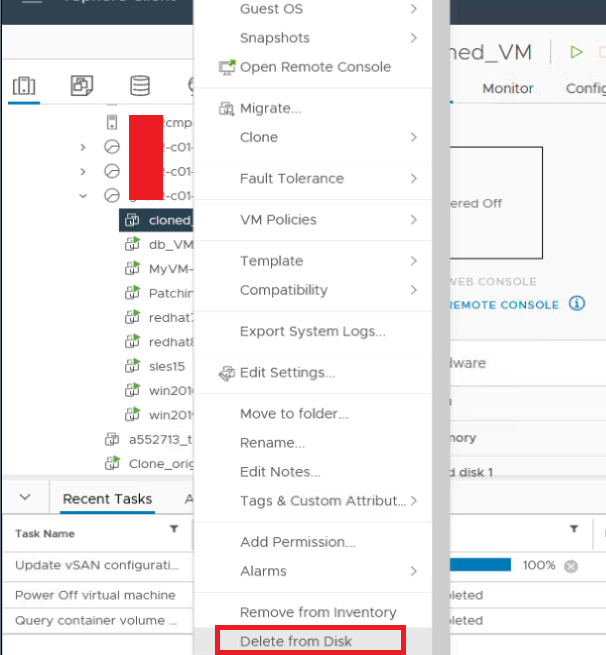
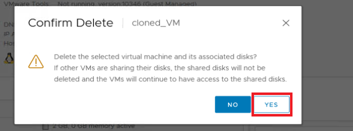
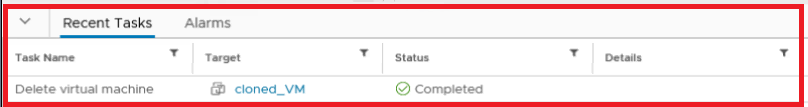

# VCS Destroy cloned/duplicated VM

## Table of Contents

- [VCS Destroy cloned/duplicated VM](#vcs-destroy-clonedduplicated-vm)
  - [Table of Contents](#table-of-contents)
  - [Introduction](#introduction)
    - [Purpose](#purpose)
    - [Audience](#audience)
    - [Scope](#scope)
    - [Prerequisites](#prerequisites)
  - [Action Plan](#action-plan)
    - [Check if Virtual Machine is onboarded](#check-if-virtual-machine-is-onboarded)
    - [Destroy cloned/duplicated Virtual Machine](#destroy-clonedduplicated-virtual-machine)
  - [Changelog](#changelog)

## Introduction

### Purpose

This instruction covers the action of destroying Cloned/Duplicated Virtual Machine.

### Audience

- VCS Engineers
- VCS Architects

### Scope

The Instruction assumes that the reader has reasonable grasp of VCS infrastructure and VMware components.

### Prerequisites

- Access to the vCenter
- Access to the HashiVault
- Client Aviva visibility in ServiceNow
- Basic vCenter Knowledge
- Virtual Machine is not onboarded into vRA
- Virtual Machine is removed from ServiceNow CMDB
- Approval by email to destroy Virtual Machine
- ServiceNow change request to perform activity

## Action Plan

### Check if Virtual Machine is onboarded

1. Log in to VMware vRealize Automation via `https://<locationCode>vra001.<domainName>` with `<dasId>@<domainName>` user account (click `GO TO LOGIN PAGE`, provide `username` and `password` than click `Sign in`).

    
    

2. Navigate to `My Services` > `Service Broker`.

    

3. Navigate to `Deployments` > `Virtual Machines` and check status of cloned/restored VM (should be discovered without tags as on screenshot below).

    

### Destroy cloned/duplicated Virtual Machine

1. Log in to VMware vSphere Client via `https://<locationCode>vcs002.<domainName>` or `https://<locationCode>vcs002.<domainName>` with `<dasId>@<domainName>` user account, go to the `VMs and Templates` view in the vSphere Client, and right-click on the Virtual Machine to be destroyed, choose `Power > Power Off` from the context menu.  

    

    > Caution:  
    > Wait until the virtual machine shuts down before taking the next steps.

2. Right-click on the Virtual Machine to be destroyed, choose `Delete from Disk` from the context menu.  

    

3. Confirm delete with `YES`.  

    

4. Confirm on recent tasks that Virtual Machine has been removed successfully.

    

## Changelog

| Version | Date       | Description   | Author         |
|---------|------------|---------------|----------------|
| 0.1     | 20/02/2024 | First version | Krystian Bibik |
