# Enable Multitenancy VCS

# Changelog

| Date       | Author            | Issue    | Description                   |
|------------|-------------------|----------|-------------------------------|
| 12.05.2021 | Marcin Kujawski   | VCS 1981 | Create initial version        |
| 06.09.2021 | Piotr Lewandowski | DHC-2760 | Added missing steps           |
| 09.09.2021 | Piotr Lewandowski | DHC-2883 | Added a step for enabling MFA |

## Introduction

### Purpose

Enable Multi-tenancy functionality within VCS.

### Audience

- VCS Engineers
- VCS Operations

### Scope

This work instruction is intended to cover below tasks and activities:

1. Step by Step instructions to enable Multi-tenancy.
2. How to execute Automated Ansible Playbooks.
3. How to execute any manual tasks required.

# Related Documents

This document is a subset of Atos Technology Lifecycle Management (ATLM) artefacts.

| Document Name                                                             |
|---------------------------------------------------------------------------|
| [VMware Cloud Services: HLD](../design/hldDigitalHybridCloud.md)           |
| [Cloud Automation Services: LLD](../design/lldCloudAutomationServices.md) |
| [VCS Infrastructure: LLD](../design/lldInfrastructure.md)                 |
| [VCS Service Catalog: LLD](../design/lldInfrastructure.md)                |
| [Naming Convention](../design/namingConvention.md)                        |

# Infrastructure Requirements

1. VCS instance not yet deployed (before stage 1).
2. Knowledge of Multi-tenancy input variables - eg. Provider OrganizationID, Tenant Names, Tenant details, etc.
3. Knowledge of current vRA Cloud configuration.
4. Dedicated VMware account created for Customer build.
5. Proper Permissions to VMware Cloud Partner Navigator.

# Assumptions

There is an assumption that the engineers following this process have:

- an understanding of VMware products and can navigate vCenter and vRA Cloud/Cloud Partner Navigator
- an understanding of VCS Multi-tenancy design
- sufficient privileges to access vRA Cloud/Cloud Partner Navigator

# VMware Account

For each Customer deployment there is a must to have a dedicated VMware account associated with particular build.

**Using personal account is prohibited.**

This work instruction is assuming that this account is already created and has proper permissions.  
Step-by-step instructions how to create such account was provided in document [dhcBuildGuide](dhcBuildGuide.md#vmware-service-account).

# Integration Scenarios

Depends on design decision there is a bundle of activities that should be done, please follow instruction steps based on required scenario.

- **Setup new Customer**

This scenario is typical for new Customer deployment, new provider organization as well as tenants have to be created.  
Please follow all integration steps.

- **Setup new Tenant**

This scenario is valid only for creation additional Tenant within already existing Customer. Only new Tenant organization will be created.  
Please follow steps 1, 3, 4.2, 4.3, 4.4 only.

# Integration Steps

>**Note:** The print screens are illustrative and cannot be used as source for input data.

## Step 1 - Prepare input data

The first step is to prepare the input variables required for the creating a new Customer Tenant organization. Gather all variables listed in below table as this are pre-requirements.

| Input Variable             | Description                                                                                                                                                                                                                  |
|----------------------------|------------------------------------------------------------------------------------------------------------------------------------------------------------------------------------------------------------------------------|
| Provider Organization Name | Provider Organization instance for particular Customer                                                                                                                                                                       |
| Country                    | 2-letter country code for Tenant Organization (i.e. UK, DE)                                                                                                                                                                  |
| Name                       | Tenant Organization name, `customerCode+2digits` (i.e. akz01, sie01 )                                                                                                                                                        |
| CompanyName                | Full name of tenant company                                                                                                                                                                                                  |
| City                       | Tenant Organization city name                                                                                                                                                                                                |
| State                      | Tenant Organization state name                                                                                                                                                                                               |
| Domain                     | Tenant Organization domain name, it is required if the corporate domain of the customer is set up with federated identity management. If no Customer domain is federated please use VCS management domain as default option. |
| Zip                        | Tenant Organization zip code (postal code)                                                                                                                                                                                   |
| Tag (optional)             | Tag identifier for Tenant Organization                                                                                                                                                                                       |
| Address1                   | Tenant Organization address                                                                                                                                                                                                  |

## Step 2 - Create Provider Organization

**THIS STEP IS MANUAL**

1. The first step in a whole process is to create Provider Organization. In order to do this please logon to VMware Cloud Partner Navigator and navigate to *Administration*. Click on *Add Organization* under *Additional Provider Organizations*.

    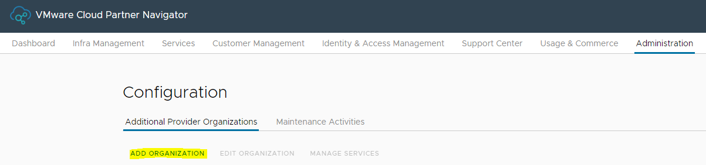

2. Provide all required inputs

    | Input                | Description                                | Example value |
    |----------------------|--------------------------------------------|---------------|
    | Name of Organization | Provide a Customer organization name       | AkzoNobel     |
    | Country              | Provide a Customer country                 | Netherlands   |
    | Zip Code             | Provide a zip code for a Customer location | 1234          |

    Click *Add Organization* once all fields are filled.  
    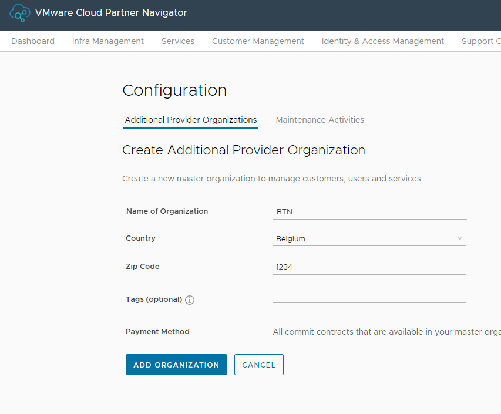

    After a while new organization will be created. You will be prompted about this.  
    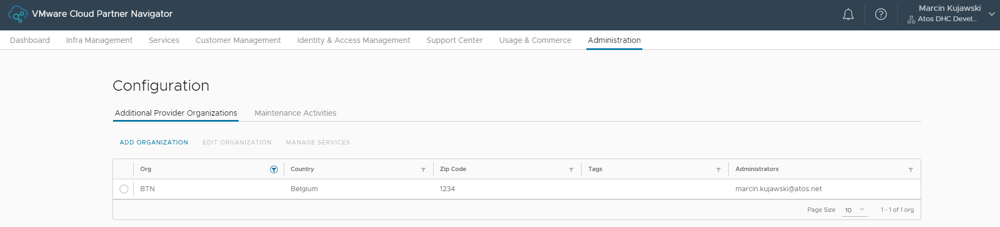

## Step 3 - Create Tenant Organization

**THIS STEP IS MANUAL**

>Note: you will be prompted for all variables described in Step 1 during the creation wizard.

1. Logon to VMware Cloud Partner Navigator and switch to Parent Organization created in previous step. Navigate to *Customer Management*. Click on *Add Customer*.

    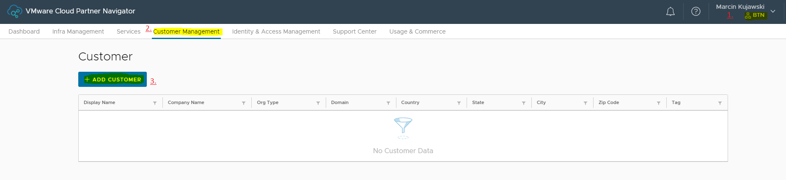

2. Provide all required inputs

    | Input                     | Description                                                                                                      | Example value           |
    |---------------------------|------------------------------------------------------------------------------------------------------------------|-------------------------|
    | Display Name              | Tenant Organization name, `customerCode+2digits`                                                                 | akz01                   |
    | CompanyName               | Full name of tenant company                                                                                      | AkzoNobel               |
    | Org Type                  | Organization type                                                                                                | Customer                |
    | Admin Contact (optional)  | Email address of Tenant administrator                                                                            | `email-address`         |
    | Domain                    | Customer domain name (if customer domain federation is in place) otherwise use VCS mgmt domain as default option | akzdhc01.next           |
    | Country                   | 2-letter country code for Tenant Organization (i.e. UK, DE)                                                      | NL                      |
    | State                     | Tenant Organization state name                                                                                   | Noord-Holland           |
    | City                      | Tenant Organization city name                                                                                    | Amsterdam               |
    | Zip                       | Tenant Organization zip code (postal code)                                                                       | 1077AW                  |
    | Tag (optional)            | Tag identifier for Tenant Organization                                                                           | akz01                   |
    | Address Line 1            | Tenant Organization address 1                                                                                    | Christian Neefestraat 2 |
    | Address Line 2 (optional) | Tenant Organization address 2                                                                                    |                         |

    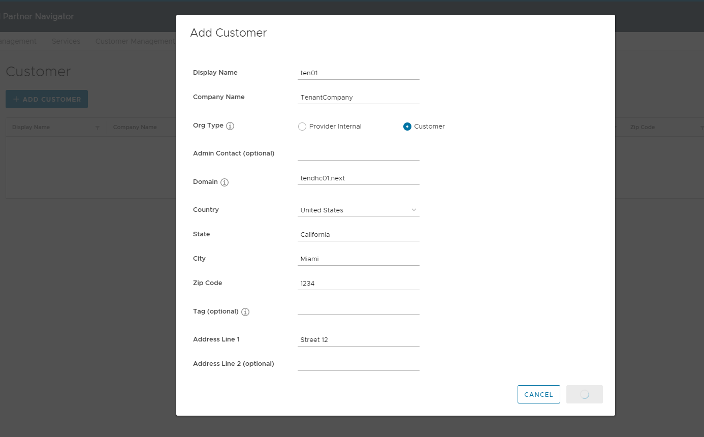

3. Click *Save* once all fields are filled.

    After a while new organization will be created. You will be prompted about this.

    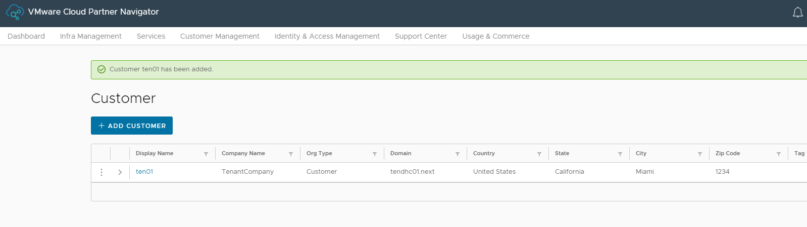

## Step 4 - Enable Tenant Services

1. Logon to VMware Cloud Partner Navigator and switch to Tenant Organization created in previous step. Navigate to *Services*. You should see that currently no services are provisioned for the organization.

2. Click on *Open* button to enable following services for Tenant:

    - VMware Cloud Assembly
    - VMware Service Broker

    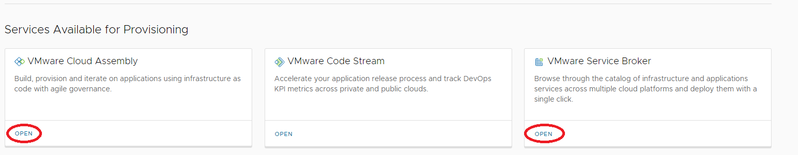

    Each time you will be prompted to confirm. Click *Open* for each service. The service will be activated.

    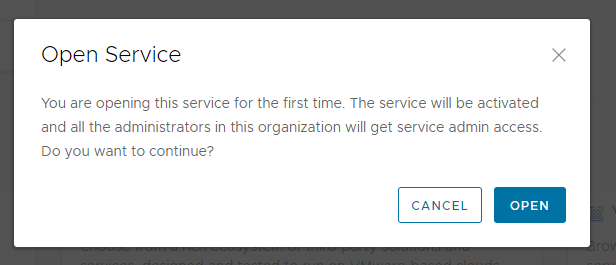

3. Once all services will be activated, they will appear under section *Services Provisioned for You*, which means all is set.

    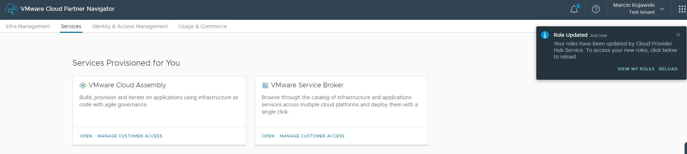

## Step 4a - Enable Roles in the Customer Organization

In order to enable RBAC roles in each of the services so that they can be assigned later on to users, you need to click **Manage Customer Access** in each of the Services and select a checkbox next to each of the roles.

Roles enabled for Cloud Assembly service:

Roles enabled for Service Broker:

## Step 5 - RBAC Configuration

VCS RBAC by design needs to be configured on two levels. First is a provider organization level for a organization that was created in Step 2 of this work instruction. Second is the customer organization that is created as a part of Step 6 of this this work instruction.

Before below steps can be executed all users that will be added to provider or customer organization needs to be mapped to one of the VCS CPN RBAC roles described in RBAC LLD lldDhcRoleBasedAccessControl.md.

### 5.1 Apply VCS Provider organization RBAC

**THIS STEP IS MANUAL**

1. To apply VCS Provider organization RBAC please logon to VMware Cloud Console and select provider organization created in Step 2 of this WI. Next navigate to Administration. Click on **Identity & Access Management**. You will be redirected to VMware Cloud Partner Navigator portal.

    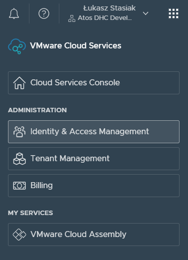

2. From the VMware Cloud Partner Navigator again click on **Identity & Access Management**.

    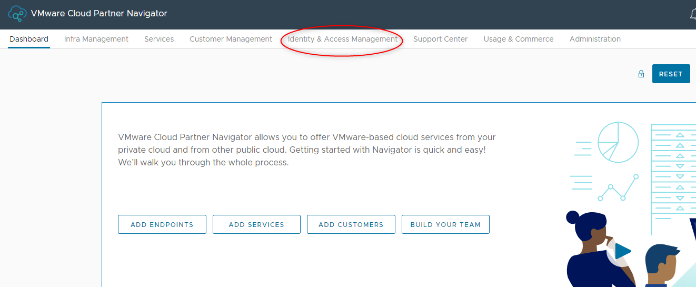

3. Next click on Add users to add a new user. Enter a user email address and select one of the roles mapped for a given user. Each available VCS CPN role for a provider organization is listed in a table below. Click on Save to apply the changes.

    If list of users with the same role needs to be added enter all users email addresses separated by semicolon select the role and click on Save.

    **NOTE:** Make sure to add the Service Account (described in the **VMware Account** section of this document) to the Provider Organization and temporarily assign **Provider Account Administrator** role

    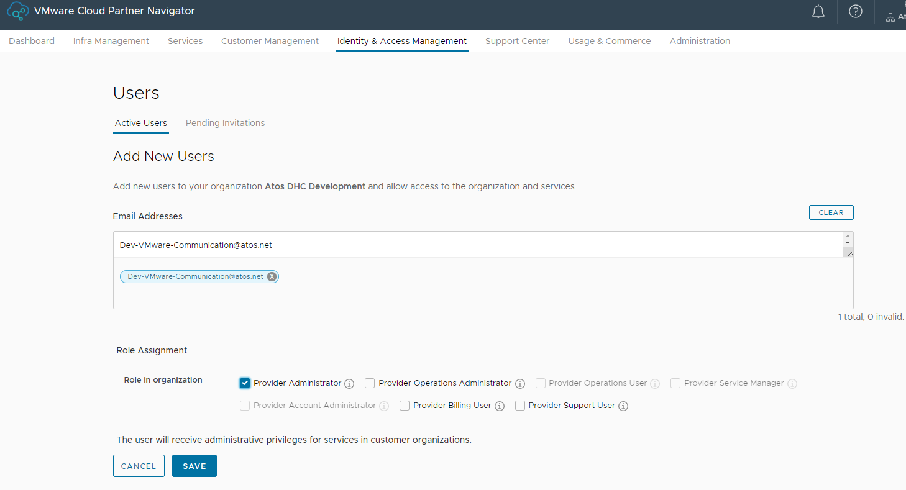

Available VCS Provider organization level RBAC roles:

| Role name                                                                                  | Role assignment                                                                              |
|--------------------------------------------------------------------------------------------|----------------------------------------------------------------------------------------------|
| Provider Administrator                                                                     | Atos/Service Provider  - Customer Engagement Team                                            |
| Provider Operations User  Service Role: Cloud Assembly Administrator for provider level | Atos/Service Provider                                                                        |
| Provider Service Manager  Service Role: Cloud Assembly Administrator for provider level | Atos/Service Provider                                                                        |
| Provider Account Administrator for selected customer organization                          | Atos/Service Provider  - DevSecOps team members & Service Account used for the initial build |

### 5.2 Apply VCS Customer organization RBAC for VMware accounts

**THIS STEP IS MANUAL**

If customer is using VMware accounts to access the VMware Cloud Console follow the steps below to apply VCS Customer organization RBAC.

1. To apply VCS Customer organization RBAC please logon to VMware Cloud Console and select customer organization created in Step 6 of this WI. Next click on **Identity & Access Management**.

2. Click on Add users to add a new user. Enter a user email address and select one of the roles mapped for a given user. Each available VCS CPN role for a customer organization is listed in a table below. Click on Save to apply the changes.

If list of users with the same role needs to be added enter all users email addresses separated by semicolon select the role and click on Save.

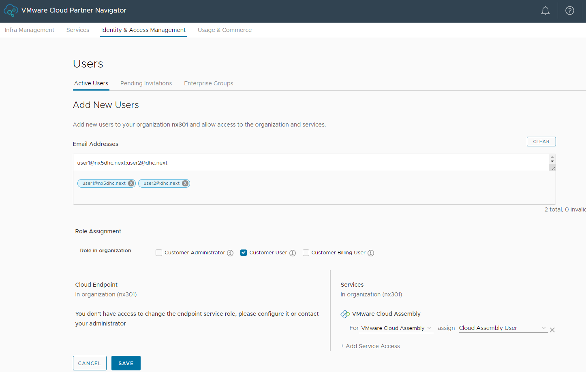

Available VCS Customer organization level RBAC roles:

| Role name                                                                                  | Role assignment |
|--------------------------------------------------------------------------------------------|-----------------|
| Customer User  Service Role: Service Broker User  Service Broker Project Role:Member | Customer Users  |
| Customer User  Service Role: Service Broker Viewer                                      | Customer Users  |

### 5.3 Apply VCS Customer organization RBAC for federated accounts

**THIS STEP IS MANUAL**

If customer is using AD federated accounts to access the VMware Cloud Console follow the steps below to apply VCS Customer organization RBAC.

1. To apply VCS Customer organization RBAC please logon to VMware Cloud Console and select customer organization created in step 6 of this WI. Next click on Identity & Access Management.

2. Select Enterprise Groups and click on Assign Roles. Enter a group name in the Search for an enterprise group dialog box and select that group. Next select one of the roles mapped for a given enterprise group. Available VCS CPN roles for a customer organization are the same as for VMware accounts and have been listed already in previous chapter. Click on Assign to apply the changes.

### 5.4 Assign Service Broker Project Role

Every customer user with Service Broker User role needs to also have Service Broker Project Role assigned. Follow the steps below to assign project role on a project created in Step 14 of this WI.

**THIS STEP IS MANUAL**

1. To assign project role please logon to VMware Cloud Console and select customer organization created in step 6 of this WI.Click on a Services and open VMware Service Broker.

2. Next click on the Infrastructure tab and select Projects.

    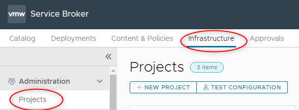

3. Click open on a tenant project that was created in Step 14 of this WI.

    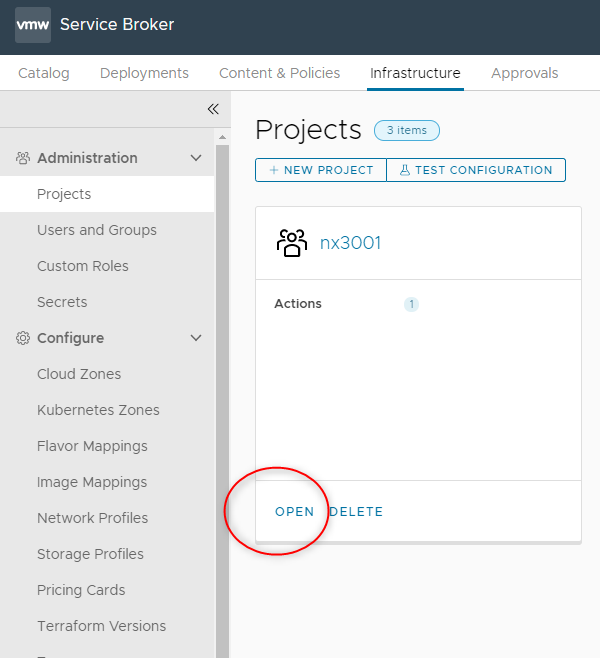

4. To add a user click on Add Users and enter user name in a Search users dialog box. Select a Member role and click on Add.

    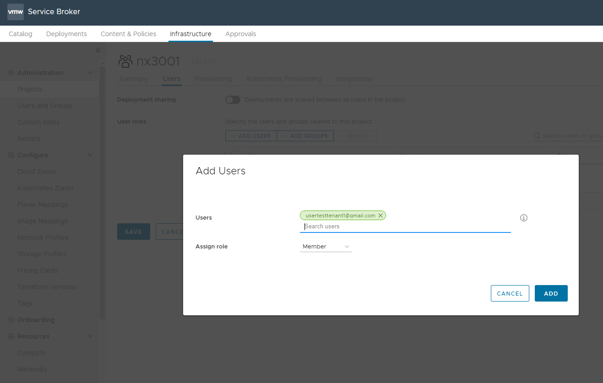

5. To add a group click on Add group and enter group name in a Search groups dialog box. Select a Member role and click on Add.

    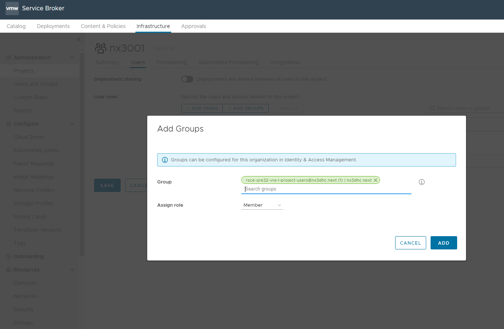

### 5.5 Enable Multifactor Authentication

Each user with a VMware account added to the VRA organization needs to enable Multifactor Authentication for their account. **This is mandatory**. A prerequisite for this action is an Authenticator app, such as Google Authenticator, which needs to be installed on your MFA device in order to scan the QR code and generate temporary passcodes.

Follow below steps to enable MFA:

1. After logging into VMware Cloud Console, navigate to your account in the top-right corner, expand the menu and select **My Account**

    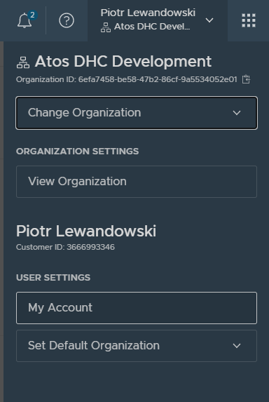

2. Navigate to the **Security** tab and click **Activate MFA Device**

    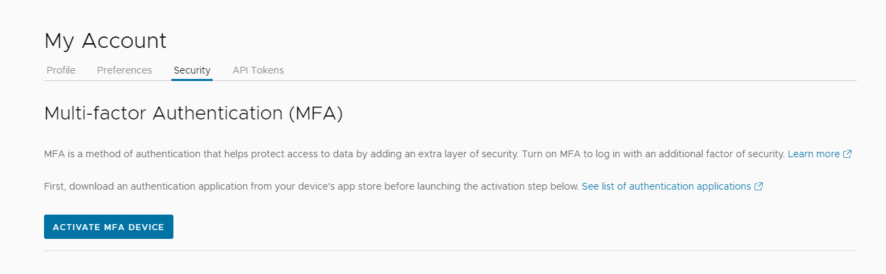

3. You will be presented with a QR code, 2 fields for providing the passcodes and the password to your VMware account. Scan the QR code using an Authenticator app and provide 2 consecutive passcodes displayed in the app, together with your VMware account password and click **Activate MFA device**

    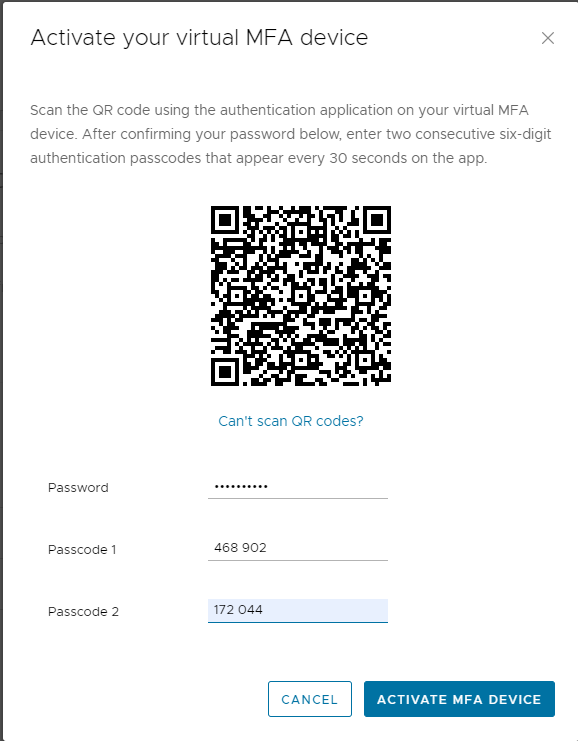

4. You will be presented with Recovery Codes that need to be kept safe and used in case you can't access your MFA device. Copy the codes and click **Finish**. The end result should look like this:

    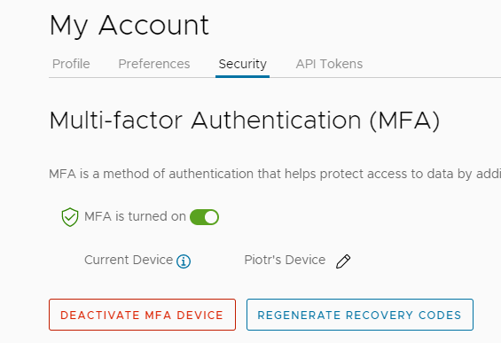
