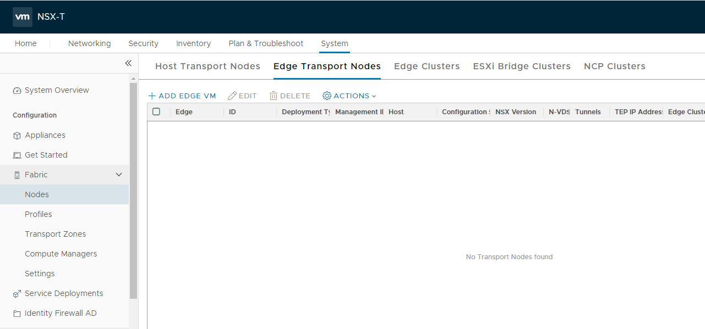
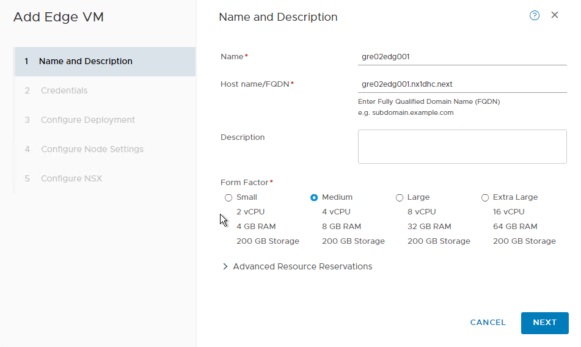
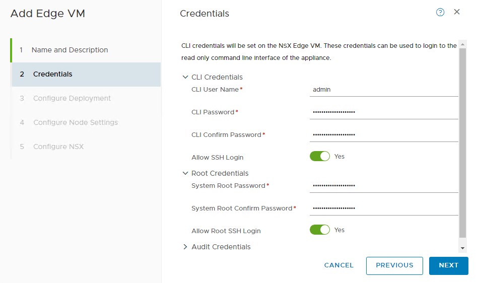
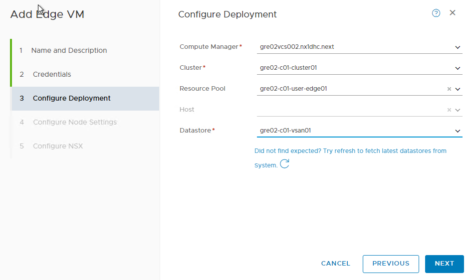
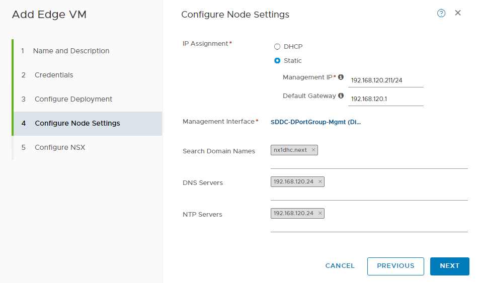
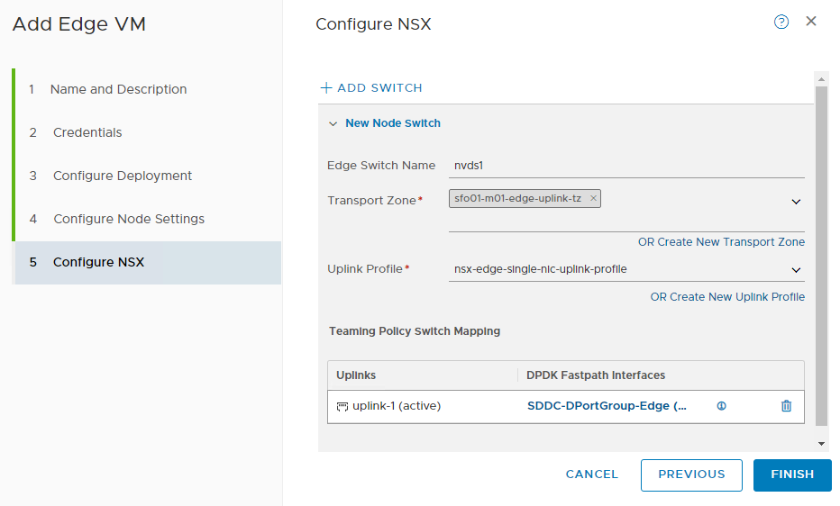
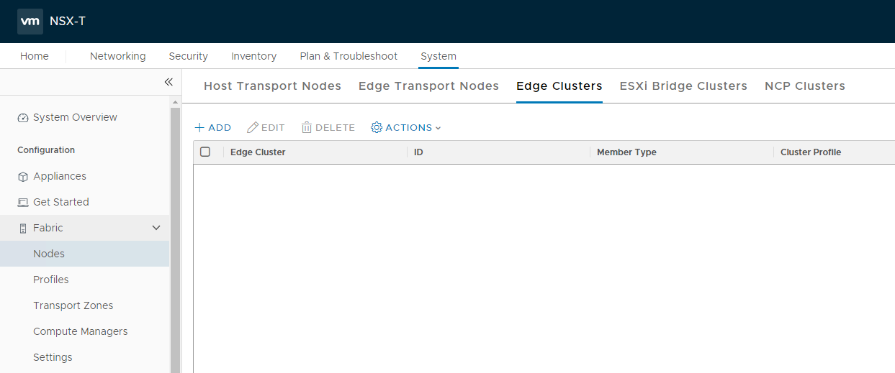
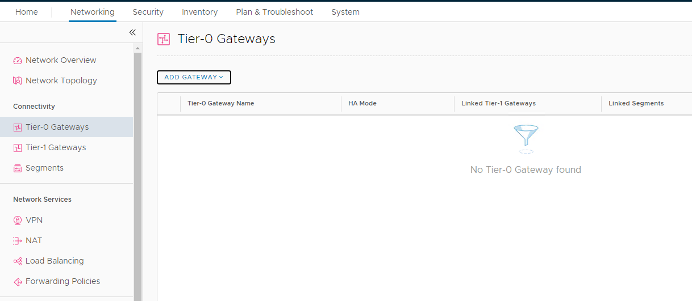
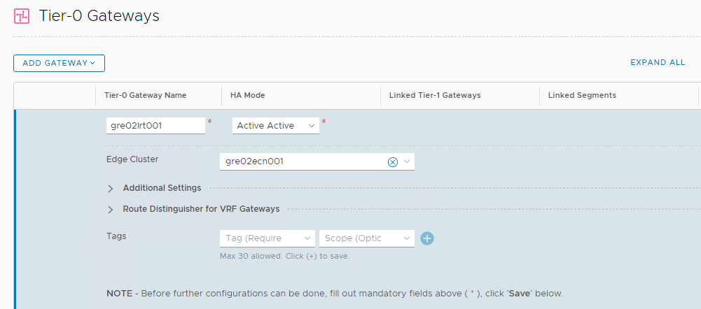
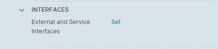

# Manual Tenant Configuration

# Changelog

| Version | Date       | Description                                  | Author       |
| ------- | ---------- | -------------------------------------------- | --------------- |
| 0.1     | 14.07.2020 | First version                                | Piotr Lewandowski |
| 0.2     | 17.07.2020 | Added steps to create resource pools         | Łukasz Stasiak |
| 0.3     | 03.08.2020 | Added section for creation dedicated T0/VRF  | Michal Pindych |

# Table of Contents

- [Manual Tenant Configuration](#manual-tenant-configuration)
- [Changelog](#changelog)
- [Table of Contents](#table-of-contents)
  - [Introduction](#introduction)
    - [Purpose](#purpose)
    - [Audience](#audience)
    - [Scope](#scope)
  - [Installation Time](#installation-time)
- [Configuration Steps](#configuration-steps)
  - [Configure vSphere](#configure-vsphere)
    - [Create a tenant vm resource pool](#create-a-tenant-vm-resource-pool)
    - [Create a shared management resource pool](#create-a-shared-management-resource-pool)
    - [Create a tenant VMs Folder](#create-a-tenant-vms-folder)
  - [SDN multi-tenant configuration](#sdn-multi-tenant-configuration)
    - [Dedicated T0 gateway](#dedicated-t0-gateway)
      - [Creation of Edge Transport Nodes](#creation-of-edge-transport-nodes)
      - [Creation of Edge Clusters](#creation-of-edge-clusters)
      - [Creation of dedicated T0 gateway](#creation-of-dedicated-t0-gateway)
    - [Dedicated VRF](#dedicated-vrf)
      - [Creation of dedicated vrf on T0 gateway](#creation-of-dedicated-vrf-on-t0-gateway)
  - [Configure VRA Cloud](#configure-vra-cloud)
    - [Create RBAC group](#create-rbac-group)
    - [Create Cloud Zone](#create-cloud-zone)
    - [Create Project](#create-project)
    - [Assign Tag To The Resource Pool](#assign-tag-to-the-resource-pool)
    - [Configure Network Profile](#configure-network-profile)
    - [Configure Tenant Blueprint](#configure-tenant-blueprint)
    - [Configure Service Broker Catalog Item](#configure-service-broker-catalog-item)

## Introduction

### Purpose

Configure a new Tenant in VRA Cloud and vSphere for Shared VCS multi-tenant option.

### Audience

- VCS Engineers
- VCS Architects

### Scope

This document covers the following tasks and activities:

- __Configuring vSphere resource pools__
- __Configuring RBAC for tenant__
- __Creating a project and its resources for tenant__  
- __Configuring Blueprint__
- __Configuring Service Broker Catalog Item__

The following tasks are out of scope of this document:

- __Initial configuration of VRA Cloud including setting up the default project__

## Installation Time

| Component / Task | Installation Time (HH:MM)    |
| :-------------   | :----------: |
|  Creating vSphere resource pools | 00:10   |
|  Configuring RBAC | 00:10   |
|  Configuring project | 00:10   |
|  Configuring Blueprint | 00:10  |
|  Configuring Service Broker Catalog Item | 00:10  |

The assumption is that the tenant organization is created, with Cloud Assembly and Service Broker services provisioned, and that default/first tenant is already configured. This work instruction covers adding a new tenant to the existing organization.

The following steps should already be configured as a prerequisite for this work instruction:

- Cloud Account
- Cloud Zone
- Flavour mappings
- Image mappings
- Storage profiles

Since in Shared VCS all tenants use the same underlying platform and share its resources, the above items are common and should be created during initial VCS deployment.

# Configuration Steps

## Configure vSphere

### Create a tenant vm resource pool

1. In the vSphere Client, select a CMP cluster.
2. Right-click the CMP cluster object and select "New Resource Pool".
3. Type a resource pool name according to defined naming convention "locationCode-c< WorkloadDomainNumber >-cluster< ClusterNumber >-< customerCode>-vm" e.g. "gre02-c01-cluster01-nx2-vm".
4. Leave the ‘Scale Descendant's Shares’ checkbox unselected.
5. For the CPU and Memory shares value leave the default value set to "Normal".
6. In the Reservation Type checkbox for both CPU and Memory leave the "Expandable" selected.
7. Leave the defaults for the Reservation and Limit (by default there are no reservation and limit set on the resource pool)
8. Click OK to create tenant resource pool.

### Create a shared management resource pool

1. In the vSphere Client, select a CMP cluster.
2. Right-click the CMP cluster object and select "New Resource Pool".
3. Type a resource pool name according to defined naming convention "locationCode-c< WorkloadDomainNumber >-cluster< ClusterNumber >- user-edge" e.g. "gre02-c01-cluster01-user-edge".
4. Leave the ‘Scale Descendant's Shares’ checkbox unselected.
5. For the CPU and Memory shares value leave the default value set to "Normal".
6. In the Reservation Type checkbox for both CPU and Memory leave the "Expandable" selected.
7. Leave the defaults for the Reservation and Limit (by default there are no reservation and limit set on the resource pool)
8. Click OK to create shared management resource pool.

### Create a tenant VMs Folder

1. In the vSphere Client select the "VMs and Templates" view
2. Expand vCenter and right-click the Datacenter object
3. Select New Folder -> New VM and Template folder
4. Provide the name for the folder - "< customerCode > VMs" and click OK to create the folder

## SDN multi-tenant configuration

### Dedicated T0 gateway

For customers who require a dedicated T0 router (cause they use load balancing or VPN functionality)  following procedure needs to implement.

- Creation of Edge Transport Nodes
- Creation of Edge Clusters
- Creation of dedicated T0 gateway

#### Creation of Edge Transport Nodes

| Steps              | Picture |
| -------------------------- |--------------- |
| 1. In order to add new Edge Transport Node please navigate to System - > Fabric - > Nodes -> Edge Transport Nodes and click "ADD EDGE VM"          |  |
| 2. On the first tab wizard ask You about Name, FQDN and Form Factor           |  |
| 3. On the second tab please set up credentials for admin and root account          |   |
| 4. Here we need to put all information required to deploy edge vm, these values should be pre-populated based on VCS deployment         |  |
| 5. On the next step please configure static management IP and default gateway, search domain, and DNS/NTP server.          |  |
| 6. The final task is to set up N-VDS switches corresponding to give edge node, after that please repeat all steps for second edge          |  |

#### Creation of Edge Clusters

| Steps              | Picture |
| -------------------------- |--------------- |
| 1. Navigate to System -> Fabric ->  Nodes -> Edge Clusters and click "Add" button          |  |
| 2. On "Add Edge Cluster" wizard You must specify cluster name, edge cluster profile (we can use default one) and also we need to choose correct edge nodes created before          |        |

#### Creation of dedicated T0 gateway

| Steps              | Picture |
| -------------------------- |--------------- |
| 1. Navigate to Networking -> Tier-0 Gateways and click "Add Gateway - Tier-0" button.           |  |
| 2. Initially we need only configure Gateway name and HA mode, after that we should save configuration          |  |
| 3. At the end we need to configure at least uplink interface with following information:  Name:   Type: External    IP address: specific to customer   Connected to:  preconfigured segment   Edge Node: node on which T0 exists |        |

### Dedicated VRF

If there is no need to use specific functionality like VPN or load balancing - we can use dedicated vrf on T0 router, in this case following procedure needs to implement.

#### Creation of dedicated vrf on T0 gateway

| Steps              | Picture |
| -------------------------- |--------------- |
| 1. Creating VRFs in NSX Manager is done under Networking > Connectivity > Tier-0 Gateways > Add Gateway > VRF: |  |
| 2. When creating a VRF we initially only need to specify a name and a parent Tier-0 Gateway (all other values will be automatically propagated)                    |  |
| 3. After commit we will be asked to continue configuration, please choose the "yes" option                                                      |  |
| 4. Name: Please click "Set" button under INTERFACES and fill up all required information for uplink:   Name:   Type: External   IP address: specific to customer  Connected to:  preconfigured segment   Edge Node: node on which T0 exists  |       |
| 5. In the end, we must link Tier 1 gateway with newly created VRF as shown in the picture - please choose correct Tier-1 and fill up "Linked Tier-0 Gateway" field with the name of previously created VRF in step 2   |  |

## Configure VRA Cloud

### Create RBAC group

Each tenant needs to have a group created for them in VRA Cloud, with appropriate roles assigned to the group on both the Organizational and Project level.

You need an Organization Admin role in order to manage Identity & Access Management within the organization.

1. In the VMware Cloud Service Console go to the "Identity & Access Management" tab
2. Click the "Groups" tab
3. Click "Add Groups"
4. Give the group a name, according to the naming convention (role-cas-g-< customername >-users)
5. Under Roles -> Organization Roles, select Organization Member
6. Under Service Roles click "Add Service Access" and select VMware Service Broker: Service Broker User
7. Optionally, add members of the group if already known
8. Click "Create"

### Create Cloud Zone

1. In the VMware Cloud Services Console go to the VMware Cloud Assembly service
2. Go to the Infrastructure tab -> Cloud Zones (in the left pane) and click New Cloud Zone
3. Select the Cloud Account that represents the shared vCenter
4. Type in the name of the Zone according to the naming conventions (i.e. nx2gre201)
5. Leave the default placement policy
6. Select the vSphere folder dedicated for the tenant VMs
7. add a capability tag according to the naming conventions (i.e. CloudZone:nx2gre201)
8. switch to the Compute tab and select "Manually select compute" from the dropdown list, then click Add
9. select the tenant-dedicated Resource Pool and click Add
10. Click Create to finish creating the Cloud Zone

### Create Project

In this step the new project needs to be created for the tenant. Each tenant is separated in VRA using Projects. When creating a project we need to associate it with:

- the RBAC group created in the previous step
- the Cloud Zone created in the previous step

To create a new project:

1. Go to the Infrastructure tab -> Projects (on the left pane) and click New Project
2. Provide a name for the project according to the naming conventions (i.e. nx2001) and optionally a description
3. Go to the Users tab, de-select "Deployment Sharing" option.
4. Click "Add groups", find the group created earlier, select it, assign the Member role and click "Add"
5. Go to the Provisioning tab and click "Add Cloud Zone"
6. Search for a given Cloud Zone (i.e. nx2gre201) and select it
7. Leave the defaults (by default there are no limits configured on the project) and click "Add"
8. Under Resource Tags, add a tenant tag - Tenant: {customerCode}
9. Set the timeout to 1 hour
10. Scroll down to the bottom of the page and click "Create"

### Assign Tag To The Resource Pool

Prerequisite for this step is to have a tenant-specific Resource Pool created and configured in vSphere.

To assign a tag:

1. Go to Infrastructure tab -> Cloud Zones (on the left pane) and click the Cloud Zone assigned to the tenant project
2. Click the Compute tab and select the Resource Pool created for this tenant by clicking the checkbox next to its name
3. Click the Tags button
4. In the "Add Tag" field type in the Resource Pool tag, according to the naming convention (i.e. ComputeRP:nx2gre02-c01-cluster01-rp)
5. Click Save

### Configure Network Profile

tbd

### Configure Tenant Blueprint

The Existing Blueprint created during initial deployment will be used as a source for the tenant template.

Blueprint contains 2 sections that require changes:

- inputs section, which defines what the end user is able to select on the form
- constraints/tags section, which determines the initial placement of the VM and the tags assigned to it during deployment

Some input values are common across all tenants and don't need to be changed when cloning a Blueprint from the existing one. These items are:

- Image (OS Image mappings)
- Flavour (Flavour mappings)
- Zone_tag (Cloud Zone)
- Cluster_tag (Cluster)
- Storage_tag (Storage profiles)

What is unique per Tenant and can't be shared is:

- VM_prefix
- Net_tag (network profile)
- Resource Pool tag constraint (this determines the placement of the VM in a tenant Resource Pool)

1. In Cloud Assembly go to the Design tab
2. Select and clone the blueprint created during initial deployment
3. Provide the name for the new blueprint, select the project associated with the Tenant and make sure that the blueprint is only shared within this project. Select the latest version and click Clone
4. Open the newly created blueprint
5. Click on the Inputs tab on the right pane
6. Select and edit VM_prefix item - under enum, rename the values to match the current tenant (i.e. nx2-prod, nx2-dev - where nx2 is the customerCode) then click Save
7. Select and edit the net_tag and rename the items under Enum to match the current tenant, then click Save
8. Go to the Code tab and under constraints rename the ComputeRP tag to match the current tenant, i.e. ComputeRP: nx2-${input.cluster_tag}:hard'
9. Once the blueprint has been updated with the correct values, it needs to be released and published to the catalog. At the top of the Blueprint editor click "Version History"
10. In the left pane select the Current Draft and click "Version"
11. The Version field should be pre-populated. Provide description and select "Release this version to the catalog" option, then click "Create"

Make sure to click the Test button to verify that the blueprint was updated properly and is valid.

### Configure Service Broker Catalog Item

The following steps describe how to make the blueprint we configured in the previous section a Catalog Item available for our tenant in the Service Broker portal. We need to add a Content Source, import blueprint from the source and enable it as a catalog item.

1. In the VMware Cloud Service console select VMware Service Broker service
2. Go to the Content & Policies tab
3. In the left pane click "Content Sources" and then click "New" to create a new content source
4. Select "Cloud Assembly Blueprint"
5. Provide the name for the Content Source (i.e. nx2-blueprints)
6. select the tenant project and click Validate
7. If there are no issues, click "Create & Import"
8. In the left pane go to Content Sharing menu, select the tenant project and click "Add Items"
9. Select the content source created and in previous step and click "Save"
10. In the left pane, go to the Content menu
11. Find the Blueprint created in the previous section, click the 3 vertical dots next to its name and select "Customize Form"
12. At the top of the Form editor click the "Enable" button to make the blueprint visible as the Catalog Item in the portal.
