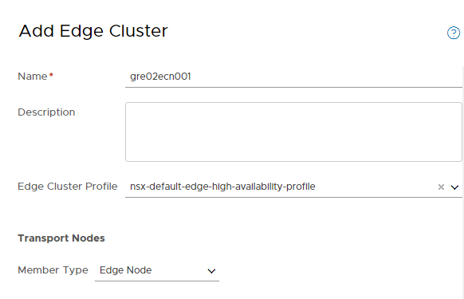
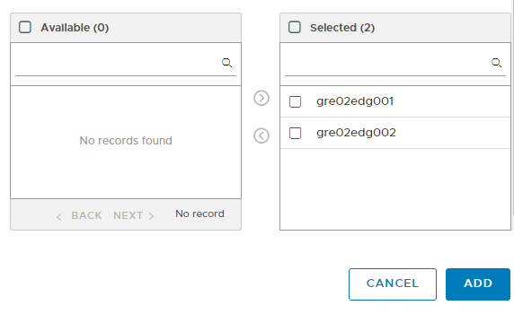
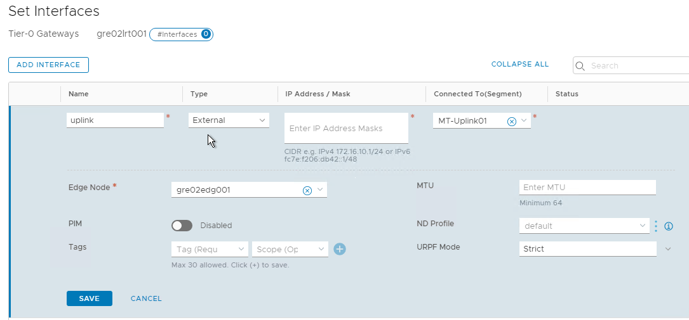
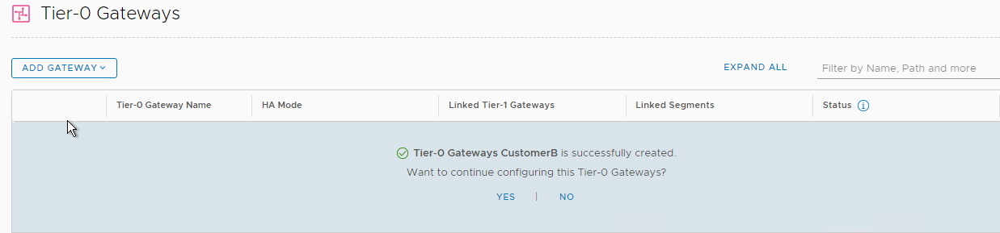
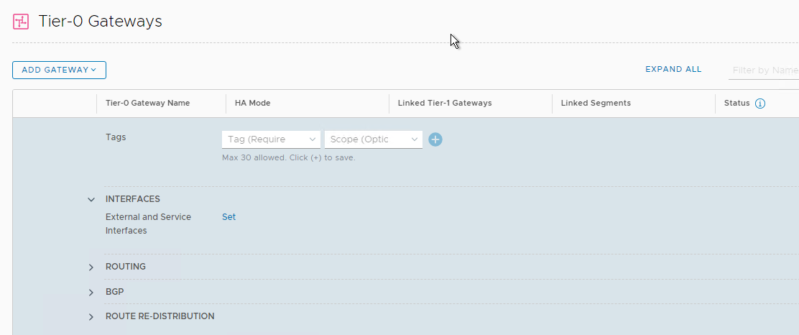
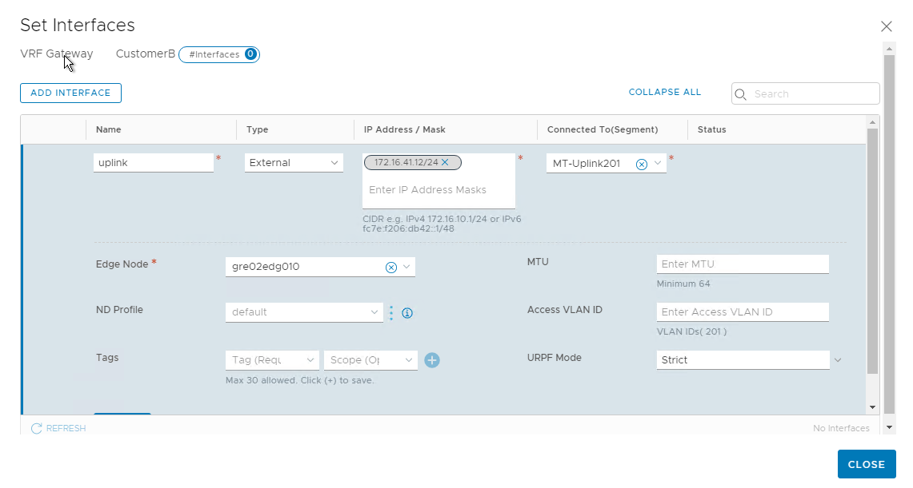

# Multi-Tenant SDN

# Changelog

| Version | Date | Author | Changes |
|---------|------|------|---------|
| 0.1 | 30.07.2020 | Michal Pindych | Document creation |

## Introduction

Multi-tenant functionality has been provided using one of the following approaches:

- Dedicated T0 gateway if customer required VPN or Load Balance functionality
- Dedicated VRF configured on shared T0 gateway if customers don't use VPN or Load Balance functionality.

### Purpose

Configure multi-tenant SDN solution for VCS.

### Audience

This document is intended for Atos ESO Cloud Services Engineers and Architects responsible for deployment of multi-tenancy solution on top of VCS.

### Scope

This document covers the following topics

- T0 gateway manual configuration
- VRF on shared T0 gateway manual configuration

# Multi-tenant for SDN

- [SDN LLD (Multi-tenancy section)](../design/lldSoftwareDefinedNetworks.md)

## Dedicated T0 gateway

For customers who require a dedicated T0 router (cause they use load balancing or VPN functionality)  following procedure needs to implement.

- Creation of Edge Transport Nodes
- Creation of Edge Clusters
- Creation of dedicated T0 gateway

### Creation of Edge Transport Nodes

| Steps              | Picture |
| -------------------------- |--------------- |
| 1. In order to add new Edge Transport Node please navigate to System - > Fabric - > Nodes -> Edge Transport Nodes and click "ADD EDGE VM"          |  |
| 2. On the first tab wizard ask You about Name, FQDN and Form Factor           |  |
| 3. On the second tab please set up credentials for admin and root account          |   |
| 4. Here we need to put all information required to deploy edge vm, these values should be pre-populated based on VCS deployment         |  |
| 5. On the next step please configure static management IP and default gateway, search domain, and DNS/NTP server.          |  |
| 6. The final task is to set up N-VDS switches corresponding to give edge node, after that please repeat all steps for second edge          |  |

### Creation of Edge Clusters

| Steps                      | Picture |
| -------------------------- |--------------- |
| 1. Navigate to System -> Fabric ->  Nodes -> Edge Clusters and click "Add" button          |  |
| 2. On "Add Edge Cluster" wizard You must specific cluster name, edge cluster profile (we can use default one) and also we need to choose correct edge nodes created before          |        |

### Creation of dedicated T0 gateway

| Steps              | Picture |
| -------------------------- |--------------- |
| 1. Navigate to Networking -> Tier-0 Gateways and click "Add Gateway - Tier-0" button.           |  |
| 2. Initially we need only configure Gateway name and HA mode, after that we should save configuration          |  |
| 3. At the end we need to configure at least uplink interface with following information:  Name:   Type: External    IP address: specific to customer   Connected to:  preconfigured segment   Edge Node: node on which T0 exists |        |

## Dedicated VRF

If there is no need to use specific functionality like VPN or load balancing - we can use dedicated vrf on T0 router, in this case following procedure needs to implement.

### Creation of dedicated vrf on T0 gateway

| Steps              | Picture |
| -------------------------- |--------------- |
| 1. Creating VRFs in NSX Manager is done under Networking > Connectivity > Tier-0 Gateways > Add Gateway > VRF: |  |
| 2. When creating a VRF we initially only need to specify a name and a parent Tier-0 Gateway (all other values will be automatically propagated)                    |  |
| 3. After commit we will be asked to continue configuration, please choose the "yes" option                                                      |  |
| 4. Name: Please click "Set" button under INTERFACES and fill up all required information for uplink:   Name:   Type: External   IP address: specific to customer  Connected to:  preconfigured segment   Edge Node: node on which T0 exists  |       |
| 5. In the end, we must link Tier 1 gateway with newly created VRF as shown in the picture - please choose correct Tier-1 and fill up "Linked Tier-0 Gateway" field with the name of previously created VRF in step 2   |  |
