# Onboard Unified Testing Framework

- [Onboard Unified Testing Framework](#onboard-unified-testing-framework)
  - [Changelog](#changelog)
  - [Related documentation](#related-documentation)
  - [Introduction](#introduction)
  - [Audience](#audience)
  - [Scope](#scope)
  - [Pre-requisite](#pre-requisite)
  - [Onboarding](#onboarding)
    - [Branch preparation](#branch-preparation)
    - [Generate personal token](#generate-personal-token)
    - [Register secrets](#register-secrets)
      - [Store Personal GitHub Token](#store-personal-github-token)
      - [Store domain credentials](#store-domain-credentials)
    - [Define environment file](#define-environment-file)
      - [Checkout branch](#checkout-branch)
      - [Prepare environment file](#prepare-environment-file)
    - [Deploy runners](#deploy-runners)
    - [Validate runners](#validate-runners)
    - [Troubleshooting runner services](#troubleshooting-runner-services)
  - [Sanity check test case](#sanity-check-test-case)
    - [Locate main pipeline](#locate-main-pipeline)
    - [Execute sanity check test case](#execute-sanity-check-test-case)

## Changelog

| Date       | TOS     | Issue   |    Author         |    Description    |
| ---------- | ------- | ------- | ----------------- | ----------------- |
| 09-04-2026 | - |   VCS-18160  | Tomasz Korniluk | Initial draft |
| 27-04-2026 | - |   VCS-18162  | Tomasz Korniluk | Final review for signoff |

## Related documentation

| Name     |  Description    |
| ----- | ------- |
| [lldUnifiedTestingFramework.md](../design/lldUnifiedTestingFramework.md) | Low Level Design Unified Testing Framework |

## Introduction

The Unified Testing Framework delivers automation capabilities to simplify the process to execute test cases for production VCS instances and development labs.
This document outlines the steps to enable Unified Testing Framework.

## Audience

VCS DevSecOps team members who deliver support for the VCS production instances and VCS Engineering responsible to test new features and capabilities using this framework.

## Scope

The procedure covers steps to enable Unified Testing Framework to execute tests for existing VCS production instances and development labs.

## Pre-requisite

Table 1. List of required permissions

| Component  | Mandatory role |  Use case |
| ---------- | ------- | ------- |
|Repository workflows|Read, Write| Ability to execute workflows, clone and make branches |
|Repository actions runners|Repo Admin| Ability to register runners (only for the production) |
|Repository secrets|Repo Admin| Ability to register secrets |
|Repository personal token|Read, Write| Ability to clone repository, create branches, make commits and push changes |

Table 2. Test framework branch naming convention

| Prefix  | Feature short name |  VCS release version |Branch full name | Scope|
| ---------- | ------- | ------- |------- |------- |
|DEVTESTS|AriaAutomation|2.2| `DEVTESTS/AriaAutomation-2.2` | Dev lab instance |
|PRODTESTS|AriaAutomation|2.3| `PRODTESTS/AriaAutomation-2.3` | Production instance |

The following pre-requisites need to be collected before starting with onboarding process:

1. Collect name and type of VCS platform (production/dev)
2. Collect site codes for affected VCS platform (e.g. gre42)
3. Validate that test engineer has access into [DHC-Tests](https://github.com/GLB-CES-PrivateCloud/DHC-Tests) repository and allowed to trigger actions
4. Validate that integration architect has permission to register the runners under [DHC-Tests](https://github.com/GLB-CES-PrivateCloud/DHC-Tests) repository for production environment (see table 1.)
5. Validate that integration architect and test engineer have permission to clone repository and make branches
6. Validate that integration architect and test engineer have permission to register secrets under [DHC-Tests](https://github.com/GLB-CES-PrivateCloud/DHC-Tests)
7. Validate that VCS proxy nodes allow connections into GitHub domains(`.github.com`, `githubusercontent.com`)
8. Validate any additional production proxy servers allow connections into GitHub domains(`.github.com`, `githubusercontent.com`)
9. Define name of the branch used for production test runs based on Table 2. (only for production integrations)
10. Define name of the branch used for development test runs based on Table 2. (only for dev labs integrations)

Diagram 1. Pre-requisites

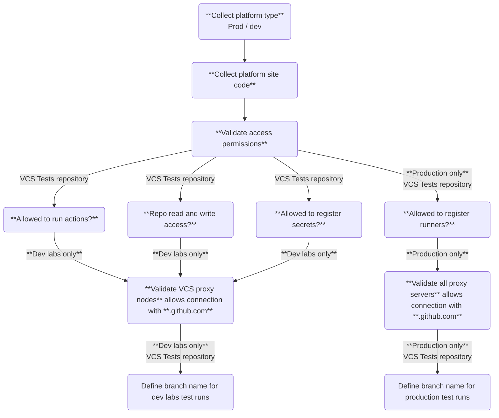

## Onboarding

The chapter explains in detail the steps to enable Unified Testing Framework for production instance and development lab.

Diagram 2. Onboarding steps

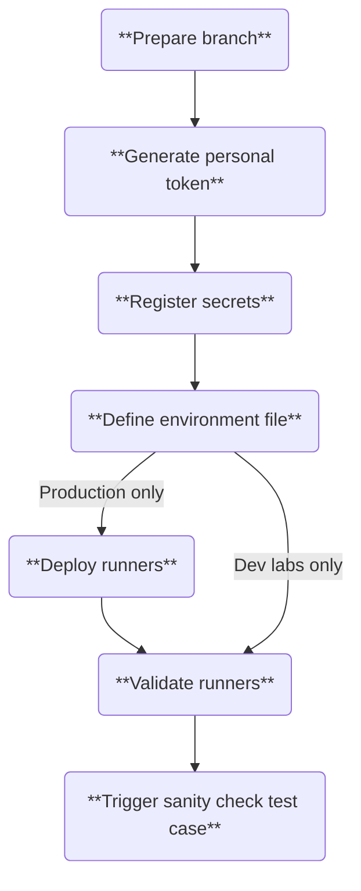

### Branch preparation

Based on used environment (dev/prod) execute the following steps to create respective branch:

- Make sure that branch name corresponds with naming convention (described inside Table 2)
- Go to the repository url `https://github.com/GLB-CES-PrivateCloud/DHC-Tests` (login using corporate GitHub account)

- Switch into `develop` branch
- Under selected branch create new one (using web browser) which corresponds with name convention or use CLI commands under local Ansible core instance with already configured GitHub repository.

**CLI commands examples:**

**Production scenario: `PRODTESTS/AriaAutomation-2.3`**

```bash
git remote add origin https://github.com/GLB-CES-PrivateCloud/DHC-Tests
git fetch origin
git checkout develop
git checkout -b PRODTESTS/AriaAutomation-2.3 develop
git push -u origin PRODTESTS/AriaAutomation-2.3
```

**Dev labs scenario: `DEVTESTS/AriaAutomation-2.3`**

```bash
git remote add origin https://github.com/GLB-CES-PrivateCloud/DHC-Tests
git fetch origin
git checkout develop
git checkout -b DEVTESTS/AriaAutomation-2.3 develop
git push -u origin DEVTESTS/AriaAutomation-2.3
```

**Note:** Make sure to double check that defined new branch corresponds with VCS release and feature name for test runs

### Generate personal token

Chapter explains the steps to generate personal token under repository `https://github.com/GLB-CES-PrivateCloud/DHC-Tests` for the Framework below tasks:

- Setup local repository inside runner instances
- Fetch from provided branch latest changes
- Register runners (production only scenario)

To create the Access Token, navigate to GitHub, click on your account picture in the upper right corner and choose the Settings option.

On the new page, select Developer Settings from the vertical menu on the left. Then, from the same panel, choose personal access tokens. You will be redirected to a page displaying all your tokens. If you do not have any tokens, click "Generate new token".

For a faster access to the Developer settings menu / personal access tokens go to `https://github.com/settings/tokens`.

Token needs to have a name `UnifiedTestingFramework` and expiration date. For security reasons it is recommended to set an expiration date to 30 days.

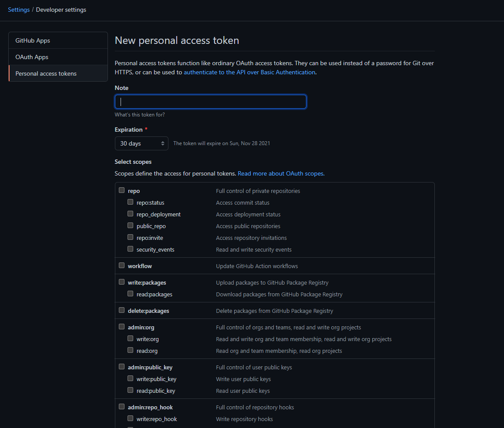

For the Framework basic git tasks activities the `repo scope` is enough.
Next, click Generate token, after generating a token key will be displayed, but be aware that it will be done only once. Make sure to copy and save it (preferably in a safe place) if you want to use this token.

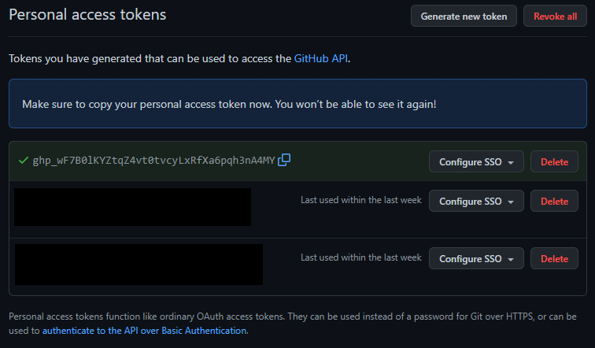

After generating the token, click Configure SSO and then Authorize `GLB-CES-PrivateCloud`.

**Note:** If you skip this step, Framework clone task will fail.

### Register secrets

The Framework uses registered secrets to handle core tasks as follows:

- Personal token used for basic git tasks (cloning and branch checkout tasks)
- Personal environment domain credentials (grant access to target VCS platform instance)

#### Store Personal GitHub Token

- Login using corporate GitHub account using url `https://github.com/GLB-CES-PrivateCloud/DHC-Tests`
- Next go into `https://github.com/GLB-CES-PrivateCloud/DHC-Tests/settings/secrets/actions`
- Under `Actions secrets and variables` for repository `DHC-Tests` go into section `Repository secrets`
- Click button `New repository secret`
- Inside field name `Name` provide `REPO_<PersonalDasId>` in example: `REPO_AXXXXXX`
- Inside field name `Secret` paste from clipboard or vault personal GitHub token
- Click button `Add secret` to save the secret

**Note:** Make sure to provide secret name with capital letters and correct personal DASID. In case provided secret name wrongly framework will not match desired secret during pipeline run.

#### Store domain credentials

- Once again under `Actions secrets and variables` for repository `DHC-Tests` go into section `Repository secrets`
- Click button `New repository secret`
- Inside field name `Name` provide `<locationSiteCode>_<PersonalDasId>` in example: `GRE42_AXXXXXX`
- Inside field name `Secret` paste from clipboard or vault AD user account password for desired remote site
- Click button `Add secret` to save the secret

**Note:** Make sure to provide secret name with capital letters and correct personal DASID. In case provided secret name wrongly framework will not match desired secret during pipeline run.

### Define environment file

The framework requires environment files to obtain baseline data per VCS platform instance and use to run test cases.

**Example mandatory inputs:**

- Environment name
- Domain name
- Aria Automation hostname
- Aria Operations hostname
- NSX-T hostnames
- Ansible instance hostname
- Ansible instance SSH port
- vCenter instances hostnames
- Proxy port and hostname

**Note:** In case in the future test cases requires more inputs environment file can be updated later and changes merged into respective branch.

To correctly define environment file per VCS platform (dev or production instances) make sure to follow below steps:

- Checkout defined new branch
- Prepare environment file

#### Checkout branch

Make sure to setup GitHub configuration inside home user drive and clone repository `https://github.com/GLB-CES-PrivateCloud/DHC-Tests`.

- Login using corporate GitHub account using url `https://github.com/GLB-CES-PrivateCloud/DHC-Tests`
- Switch into `develop` branch under `DHC-Tests` repository
- Under branch `develop` switch into newly created branch `DEVTESTS/AriaAutomation-2.3`

**Example using Git CLI commands to checkout the branch for dev lab scenarios:**

```bash
cd $HOME/DHC-Tests
git remote add origin https://github.com/GLB-CES-PrivateCloud/DHC-Tests
git fetch origin
git checkout develop
git checkout -b DEVTESTS/AriaAutomation-2.3 develop
```

**Example using Git CLI commands to checkout the branch for production scenarios:**

```bash
cd $HOME/DHC-Tests
git remote add origin https://github.com/GLB-CES-PrivateCloud/DHC-Tests
git fetch origin
git checkout develop
git checkout -b PRODTESTS/AriaAutomation-2.3 develop
```

**Note:** To run example CLI commands on local machine requires Git configuration setup.

#### Prepare environment file

- Switch into `develop` branch under `DHC-Tests` repository
- Under branch `develop` switch into newly created branch (e.g. `DEVTESTS/AriaAutomation-2.3`)
- Create a new yml file called `<siteCode>env.yml` under location `/config/<siteCode>/`

**Example of names of the environment file and folder path:**

`/config/gre42/gre42env.yml`

`/config/gre21/gre21env.yml`

**Note:** Small letters are mandatory for folder names and environment yml file

- Provide baseline input data inside new environment file, as below example:

```bash
env_name: nx4
domain_name: nx4dhc01.next
aria_hostname: gre42vra001.nx4dhc01.next
aria_ops_hostname: gre42ops001.nx4dhc01.next
nsxt_hostname: gre42nsx001.nx4dhc01.next
ansible_host: gre42ans001.nx4dhc01.next
ansible_host_ssh_port: 22
vcenter_host: gre42vcs001.nx4dhc01.next
proxy_hostname: gre42pxy001.nx4dhc01.next
proxy_host_port: 3128
```

- Validate that file contains same input fields with correct values and corresponds with affected VCS platform components.

- Save environment file under proper location `/config/<siteCode>/`, make a commit into newly created branch (e.g. `DEVTESTS/AriaAutomation-2.3`) to save the file. Use commit message that will be understandable by others that new environment file was created for affected site.

**Example using Git CLI commands to commit environment file into new branch:**

```bash
cd $HOME/DHC-Tests
git remote add origin https://github.com/GLB-CES-PrivateCloud/DHC-Tests
git fetch origin
git checkout develop
git checkout -b DEVTESTS/AriaAutomation-2.3 develop
git add ./config/gre42/gre42env.yml
git commit -m "Created new environment file for site gre42"
git push
```

**Note:** Make sure to execute above commands from location $HOME/DHC-Tests, in case multiple dev or production instances need onboarding create (under ./config folder) for each site code separate subfolder and environment file.

### Deploy runners

**Note:** This chapter only applicable for production instances and requires GitHub personal token with repo permissions **`Repo Admin`**

For production instances GitHub runners are deployed inside Ansible core instance to reduce complexity to maintain any additional virtual machines.

To automate process of GitHub runner deployments Ansible playbook `enableGithubRunner.yml` needs to be executed.

Automation playbook exists in location `/opt/dhc/manage` and supports two activities:

- Register runner inside provided repository and install inside location `/opt/github-runners/` under Ansible Core instance.

**Example how to execute single runner registration and installation:**

```bash
ansible-playbook enableGithubRunner.yml --tags install
```

- Unregister runner from provided repository and uninstall under Ansible Core instance

**Example how to execute single runner unregister and uninstall:**

```bash
ansible-playbook enableGithubRunner.yml --tags remove
```

**Step 1.** Validate that traffic is allowed from Ansible core into GitHub domains(`.github.com`, `githubusercontent.com`) using affected proxy servers.

- SSH logon into Ansible core instance using VCS platform user account domain credentials
- Run below example CLI commands to test connectivity (make sure to adjust proxy url)

```bash
curl -v -I -x http://gre42pxy001.nx4dhc01.next:3128 https://githubusercontent.com
curl -v -I -x http://gre42pxy001.nx4dhc01.next:3128 https://github.com
```

- Validate if above curl's execution returns `HTTP/1.1 200 Connection established` (in case different check under proxy if whitelist contains GitHub domains)

**Step 2.** Run automation to deploy GitHub runners

**Note** Before starting Ansible automation playbook `enableGithubRunner.yml` make sure to collect as follows:

[X] GitHub Organization name
[X] Repository name
[X] GitHub user name
[X] Repository personal token

- SSH from affected VCS platform Terminal server into Ansible core instance using `next` user account
- Go into location `/opt/dhc/manage`
- Execute Ansible playbook as below example to install 3 runner instances

```bash
ansible-playbook enableGithubRunner.yml --tags install
ansible-playbook enableGithubRunner.yml --tags install
ansible-playbook enableGithubRunner.yml --tags install
```

**Note:** By design for production instances or dev labs we need to install 3 runner instances under single Ansible Core machine.

### Validate runners

**Note:** This chapter only applicable for production instances and requires GitHub personal token with repo permissions **`Repo Admin`**

- Login using corporate GitHub account using url `https://github.com/GLB-CES-PrivateCloud/DHC-Tests`
- Next go into `https://github.com/GLB-CES-PrivateCloud/DHC-Tests/settings/actions/runners`
- Under `Runners` (`https://github.com/GLB-CES-PrivateCloud/DHC-Tests/settings/actions/runners`) validate if deployed runners exists and Status is `Idle` (green)

**Example shows available runners for affected site `gre42`:**

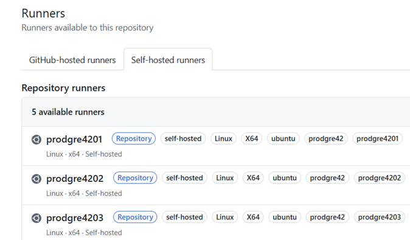

Depending of the affected site each self-hosted runner name should contains prefix `prod` or `dev` and desired site code with order number (in example: `prodgre4201`)

**Example shows available runners for affected site:`gre42`,connected and awaiting for run actions requests**

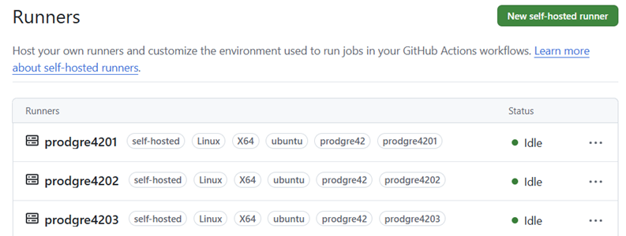

**Note:** In case some of the runners reports Status `Offline` validate if runner service is started or inside the logs not reporting connectivity issues. To solve the issue run automation to remove runner and install once again.

### Troubleshooting runner services

Table 3. Common runner issues

| Issue  name | Issue validation | Issue mitigation |
| ---------- | ----------------- | ---------------- |
|Runner in state offline| Check runner service state: `sudo systemctl status actions.runner.GLB-CES-PrivateCloud-DHC-Tests.prodgre4201.service`| Execute command to restart the service: `sudo systemctl restart actions.runner.GLB-CES-PrivateCloud-DHC-Tests.prodgre4201.service`|
|Runner in state offline|Runner service log contains errors about token unknown: `tail -f /opt/github-runners/actions-runner-prodgre4201/_diag/Runner_20260325-161100-utc.log`, Output: `GitHubActionsService AAD Correlation ID for this token request: unknown`|Reinstall runner using ansible playbook with tag -remove and next with -install (provide valid token)|

## Sanity check test case

This chapter guides to use Unified Testing Framework main pipeline to trigger sanity test case.

### Locate main pipeline

- Login using corporate GitHub account using url `https://github.com/GLB-CES-PrivateCloud/DHC-Tests`

- Go to `https://github.com/GLB-CES-PrivateCloud/DHC-Tests/actions` and under Actions click on workflow called `Unified Testing Framework Pipeline – Prepare – Run – Collect` (see below screenshot)

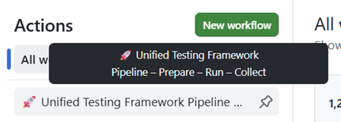

- Next under workflow `Unified Testing Framework Pipeline – Prepare – Run – Collect` click on right side dropdown list called `Run workflow`

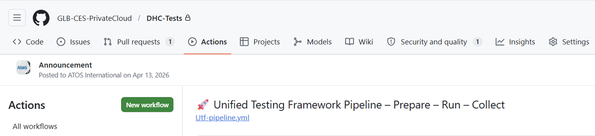

- Start providing mandatory input as described below example table, make sure to provide the marker name called: `vcenter_auth` (triggers sanity check test case).

Table 4. Mandatory inputs (examples)

| Field name | Value |  Mandatory |
| ---------- | ----- | ---------- |
|Select environment (develop or production)| prod| Yes|
|Environment site code (e.g. gre42)| gre42| Yes|
|VCS release version| DHC-2.2| Yes|
|Branch to checkout (leave empty to use triggering ref)| PRODTESTS/AriaAutomation-2.3| Yes|
|Python virtual environment name| mypytests| No|
|SSH user name for target site| <ssh user account name>| Yes|
|Test executor email address |Corporate email address of test executor |Yes|
|Provide test case marker (e.g. vcs,vra,nsxt) |`vcenter_auth` |Yes|
|Provide Ansible test case scenario name (e.g. aria) |`off` |Yes|
|Push test case reports to Github branch| unselected |Yes|
|Octane integration enabled| unselected |Yes|

**Example shows correctly provided mandatory inputs to run sanity check test case in production instance:**

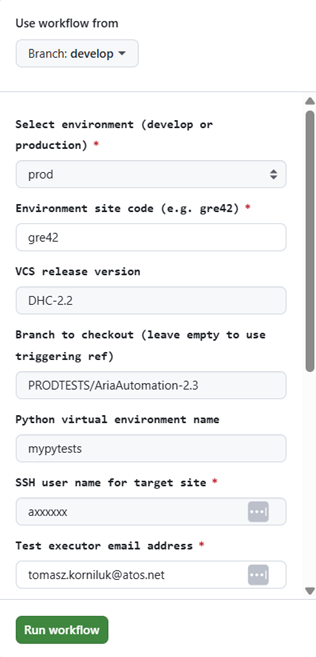

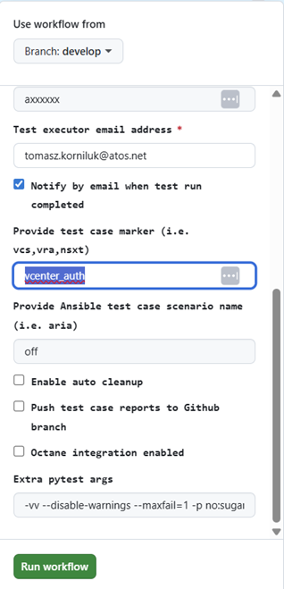

### Execute sanity check test case

In case above mandatory inputs already provided proceed to click on workflow button called `Run workflow` to execute main pipeline.

**Example shows completed nested workflows:**

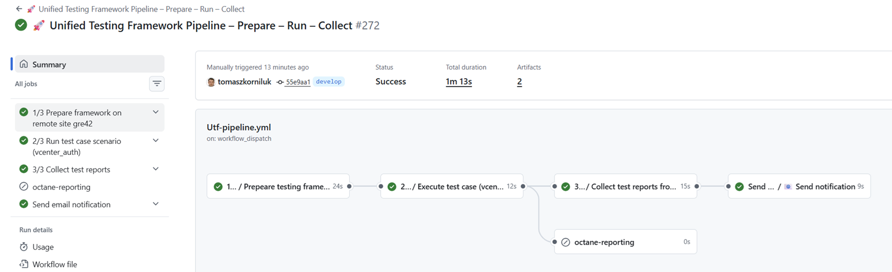

**Example shows started main workflow with failed test run:**

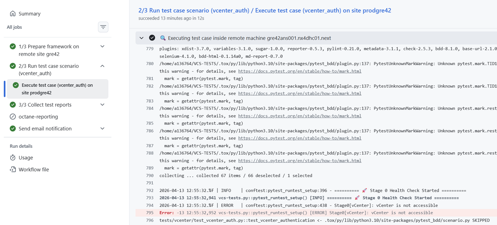

**Example shows started main workflow with successful test run:**

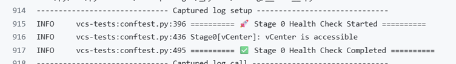
