# Production Plan

# Table of Contents

<!-- TOC -->
- [Production Plan](#production-plan)
- [Table of Contents](#table-of-contents)
- [Changelog](#changelog)
  - [Introduction](#introduction)
    - [Purpose](#purpose)
    - [Audience](#audience)
    - [Scope](#scope)
- [1 Plan](#1-plan)
- [2 Server list](#2-server-list)
  - [Connection](#connection)
- [3 Execution Steps](#3-execution-steps)
  - [3.1 Daily Monitoring Check](#31-daily-monitoring-check)
  - [3.2 Review opened SNOW tickets and requests](#32-review-opened-snow-tickets-and-requests)
  - [3.3 Ensure that the VM disks are not mounted on the Backup Proxy VMs](#33-ensure-that-the-vm-disks-are-not-mounted-on-the-backup-proxy-vms)
  - [3.4 Check log collection on Log Insight](#34-check-log-collection-on-log-insight)
  - [3.5 Check SRM and VM replication status. Aviva only](#35-check-srm-and-vm-replication-status-aviva-only)
  - [3.6 Check NSX health](#36-check-nsx-health)
  - [3.7 Check SDDC manager health](#37-check-sddc-manager-health)
  - [3.8 Check vCenter state and alarms](#38-check-vcenter-state-and-alarms)
  - [3.9 Check domain and product integration in vIDM](#39-check-domain-and-product-integration-in-vidm)
  - [3.10 Check vSan object health](#310-check-vsan-object-health)
  - [3.11 Check Compliant scan upload to Alcatraz server](#311-check-compliant-scan-upload-to-alcatraz-server)
  - [3.12 Check Compliant report visibility on TOSCA Portal](#312-check-compliant-report-visibility-on-tosca-portal)
  - [3.13 Check vROPS vSAN Datastores capacity reports](#313-check-vrops-vsan-datastores-capacity-reports)
  - [3.14 Verify in Snow the CMDB versus the actual installed base](#314-verify-in-snow-the-cmdb-versus-the-actual-installed-base)
  - [3.15 Blueprinting report](#315-blueprinting-report)
  - [3.16 AV report compliance](#316-av-report-compliance)
  - [3.17 Check report for IP availability in Infoblox](#317-check-report-for-ip-availability-in-infoblox)
  - [3.18 Check RVTools report](#318-check-rvtools-report)
  - [3.19 Check vSAN report](#319-check-vsan-report)
  - [3.20 Check expiry date of credentials and tokens (Siemens only)](#320-check-expiry-date-of-credentials-and-tokens-siemens-only)

# Changelog

| Version | Date       | Description                                                                                        | Author               |
|---------|------------|----------------------------------------------------------------------------------------------------|----------------------|
| 0.1     | 25.05.2021 | First version                                                                                      | Jakub Zielinski      |
| 1.0     | 19.11.2021 | Updated version                                                                                    | Shyjin Varaprath     |
| 2.0     | 07.12.2021 | Updated 'Check and adjust RBAC access rights for left & joined operational admins'                 | Margo Piliukh        |
| 2.1     | 15.02.2022 | 'Plan' rewrite and added chapter 3 'Execution Steps'                                               | Piotr Gesikowski     |
| 2.2     | 23.05.2022 | Ad domain and product integration in vIDM check and vSan object health                             | Adrian Chiriac       |
| 2.3     | 26.05.2022 | Update Ensure that the VM disks are not mounted on the Backup Proxy VMs                            | Adriana Slabu        |
| 2.4     | 01.06.2022 | VxRail daily monitoring and reports                                                                | Rupesh Dumbre        |
| 2.5     | 14.10.2022 | improving SRM and VM replication check; adding Snow CMDB and vRA Blueprint checks                  | Adriana Slabu        |
| 2.6     | 16.11.2022 | Add sections related with capacity reports check for hosts as well as capacity reports for siemens | Radoslaw Dabrowski   |
| 2.7     | 21.11.2022 | CESDHC-4639 Added section about file-based backup of vCenter servers                               | Margo Piliukh        |
| 2.8     | 26.01.2023 | CESDHC-5775 Production Plan review and docs update                                                 | Michał Sobieraj      |
| 2.9     | 02.03.2023 | CESDHC-6234 Added information about uploading Tosca reports to SharePoint in section 3.15          | Krystian Bibik       |
| 3.0     | 13.04.2023 | VCS-5053 Add Weekly Capacity Reports verification to Production Plan                               | Piotr Gesikowski     |
| 3.1     | 14.04.2023 | VCS-9321 Add check for Siemens SSR password rotation                                               | Piotr Gesikowski     |
| 3.2     | 18.07.2023 | VCS-10281 Rotate Customer AD Accounts - Hachette                                                   | Michał Sobieraj      |
| 3.3     | 23.11.2023 | VCS-11544 Moved section "Rotate Customer AD Accounts" to customer amendments files                 | Stanislaw Kilanowski |
| 3.4     | 16.07.2025 | VCS-14432 Added reference work instruction for Global Image Linux Patching                         | Stanislaw Kilanowski |
| 3.5     | 05.08.2025 | VCS-15494 Production Plan full review, update and removal of old points.                           | Przemyslaw Pakula    |

## Introduction

### Purpose

Execute day-to-day tasks on VCS deployments.

### Audience

- VCS Engineers
- VCS Operations

### Scope

This instruction contains actions that must be performed on VCS deployments in order to keep the environment healthy.

> **NOTE:** In case of adding new steps in production plan update both instruction and excel file on [DHC-DevSecOps SP](https://atos365.sharepoint.com/:f:/r/sites/DHCDevSecOpsTeam/Shared%20Documents/General/Production%20Plan?csf=1&web=1&e=pYr1ga).

# 1 Plan

| Frequency | Day/Month                 | Activity                                                                                          | Who? (name/role)           | Related Work instruction                                                                     |
|-----------|---------------------------|---------------------------------------------------------------------------------------------------|----------------------------|----------------------------------------------------------------------------------------------|
| Daily     | MTWTF                     | Old snapshots and Orphaned snapshots                                                              | Bridge Team                | [wiVropsSnapshotReportScheduling.md](./wiVropsSnapshotReportScheduling.md)                   |
| Daily     | MTWTF                     | Check in vROPs the state of monitored TCP ports                                                   | Bridge Team                | [wiMonitorTcp.md](./wiMonitorTcp.md)                                                         |
| Daily     | MTWTF                     | Check whether billing files were generated properly                                               | Bridge Team                | [wiConfigureBilling.md](./wiConfigureBilling.md)                                             |
| Daily     | MTWTF                     | 3.1 Daily Monitoring Check                                                                        | Bridge Team                | [dhcProductionPlan.md](#31-daily-monitoring-check)                                           |
| Daily     | MTWTF                     | 3.2 Review opened SNOW tickets and requests                                                       | DevSecOps OOTD/Bridge team | [dhcProductionPlan.md](#32-review-opened-snow-tickets-and-requests)                          |
| Daily     | MTWTF                     | 3.3 Ensure that the VM disks are not mounted on the Backup Proxy VMs                              | DevSecOps OOTD             | [dhcProductionPlan.md](#33-ensure-that-the-vm-disks-are-not-mounted-on-the-backup-proxy-vms) |
| Daily     | MTWTF                     | 3.4 Check log collection on Log Insight                                                           | Bridge Team                | [dhcProductionPlan.md](#34-check-log-collection-on-log-insight)                              |
| Daily     | MTWTF                     | 3.5 Check SRM and VM replication status. Aviva only                                               | DevSecOps OOTD             | [dhcProductionPlan.md](#35-check-srm-and-vm-replication-status-aviva-only)                   |
| Daily     | MTWTF                     | 3.6 Check NSX health                                                                              | DevSecOps OOTD             | [dhcProductionPlan.md](#36-check-nsx-health)                                                 |
| Daily     | MTWTF                     | 3.7 Check SDDC manager health                                                                     | DevSecOps OOTD             | [dhcProductionPlan.md](#37-check-sddc-manager-health)                                        |
| Daily     | MTWTF                     | 3.8 Check vCenter state and alarms                                                                | Bridge Team                | [dhcProductionPlan.md](#38-check-vcenter-state-and-alarms)                                   |
| Daily     | MTWTF                     | 3.9 Check domain and product integration in vIDM                                                  | Bridge Team                | [dhcProductionPlan.md](#39-check-domain-and-product-integration-in-vidm)                     |
| Weekly    | Monday                    | 3.11 Check Compliant scan upload to Alcatraz server                                               | DevSecOps OOTD             | [dhcProductionPlan.md](#311-check-compliant-scan-upload-to-alcatraz-server)                  |
| Weekly    | Tuesday                   | 3.12 Check Compliant report visibility on TOSCA Portal                                            | DevSecOps OOTD             | [dhcProductionPlan.md](#312-check-compliant-report-visibility-on-tosca-portal)               |
| Weekly    | Friday                    | 3.13 Check vROPS vSAN Datastores capacity reports report                                          | DevSecOps OOTD             | [dhcProductionPlan.md](#313-check-vrops-vsan-datastores-capacity-reports)                    |
| Weekly    | Monday                    | 3.16 AV report compliance compliance                                                              | DevSecOps OOTD             | [dhcProductionPlan.md](#316-av-report-compliance)                                            |
| Weekly    | Monday                    | 3.17 Check report for IP availability in Infoblox                                                 | DevSecOps OOTD             | [dhcProductionPlan.md](#317-check-report-for-ip-availability-in-infoblox)                    |
| Weekly    | Monday                    | 3.18 Check RVTools report                                                                         | DevSecOps OOTD             | [dhcProductionPlan.md](#318-check-rvtools-report)                                            |
| Weekly    | Monday                    | 3.19 Check vSAN report                                                                            | DevSecOps OOTD             | [dhcProductionPlan.md](#319-check-vsan-report)                                               |
| Monthly   | First working day         | 3.20 Check expiry date of credentials and tokens (Siemens only)                                   | DevSecOps OOTD             | [dhcProductionPlan.md](#320-check-expiry-date-of-credentials-and-tokens-siemens-only)        |
| Monthly   | Week after 2nd Tuesday    | Linux Patching                                                                                    | DevSecOps Engineer         | [linuxPatching.md](./linuxPatching.md)                                                       |
| Monthly   | Week after 2nd Tuesday    | Windows Patching                                                                                  | DevSecOps Engineer         | [windowsPatching.md](./windowsPatching.md)                                                   |
| Monthly   | First Week of the Month   | Global Image Windows Patching                                                                     | DevSecOps Engineer         | [wiManageGlobalImageWindowsPatching.md](./wiManageGlobalImageWindowsPatching.md)             |
| Monthly   | First Week of the Month   | Global Image Linux Patching                                                                       | DevSecOps Engineer         | [wiManageGlobalImageLinuxPatching.md](./wiManageGlobalImageLinuxPatching.md)                 |
| Monthly   | last working day          | Check and adjust RBAC access rights for left & joined operational admins                          | DevSecOps OOTD & Team Lead | [wiRbacManagement.md](./wiRbacManagement.md)                                                 |
| Monthly   | 3rd working day of month  | Check for over-/under licensed environments and license expiration                                | DevSecOps Engineer & OOTD  | [wiReportingOverview.md](./wiReportingOverview.md)                                           |
| Monthly   | 2nd Monday of the month   | Check for expired passwords and password not being rotated as required in Cloud security policies | DevSecOps Engineer & OOTD  | [wiReportingOverview.md](./wiReportingOverview.md)                                           |
| Monthly   | Before the 15th           | 3.15 Blueprinting report                                                                          | DevSecOps Engineer & OOTD  | [dhcProductionPlan.md](#315-blueprinting-report)                                             |
| Quarterly | 1st week of every quarter | Change password for VCS components                                                                | DevSecOps Engineer & OOTD  | [wiPasswordRotation.md](./wiPasswordRotation.md)                                             |
| Quarterly | last working day          | 3.14 Verify in Snow the CMDB versus the actual installed base                                     | DevSecOps Engineer & OOTD  | [dhcProductionPlan.md](#314-verify-in-snow-the-cmdb-versus-the-actual-installed-base)        |
| Yearly    | First Week of the year    | Reporting for SSL Certificate Expiry                                                              | DevSecOps OOTD             | [wiReportingOverview.md](./wiReportingOverview.md)                                           |

# 2 Server list

## Connection

[CustomersDHC-Naming&IPs of the components.xlsx](https://atos365.sharepoint.com/:x:/r/sites/DHCDevSecOpsTeam/_layouts/15/Doc.aspx?sourcedoc=%7B2DAFAC98-9186-4F1A-BA72-1DC2AA15617C%7D&file=CustomersDHC-Naming%26IPs%20of%20the%20components.xlsx&action=default&mobileredirect=true)

1. List above contains server names and IP addresses related to them. Format of login is **<DAS@Domain.next>** (example <A840204@siedhc02.next> to FTH). To log in to the environments first use TSS servers.
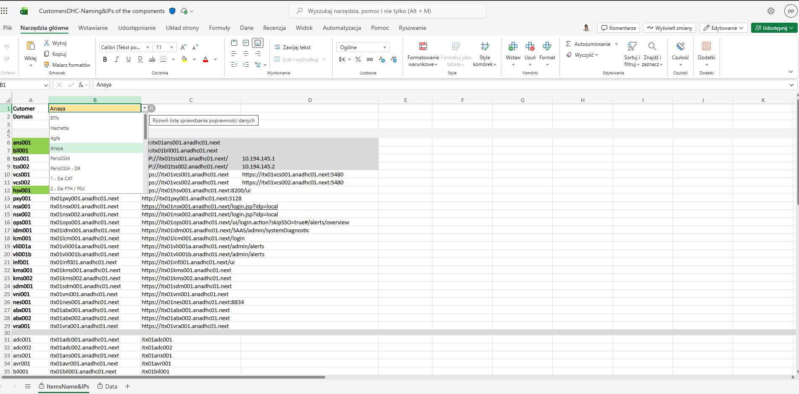

# 3 Execution Steps

## 3.1 Daily Monitoring Check

Evaluate vROPs active alerts. To do that go through the following steps:

  1. Connect to the server and login to the vROps (ops) cluster via browser of choice by typing the website address, for example <https://khe01ops002.siedhc03.next/>
  2. On the left side bar go to **Operations > Alerts** and search for any active alerts. Setup **"Group By Time"** and filter by **"Status: Active"** to make it more visible:
  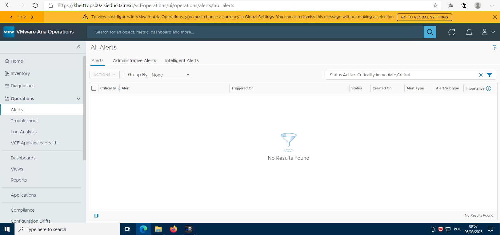

Check vROPs dashboard **DHC-HelicopterView**:

  1. In the same window of an example <https://khe01ops002.siedhc03.next/> go to **Operations > Dashboards > Favorites > DHC-HelicopterView**, or if it's not added to favorites **Operations > Dashboards > All > DHC-HelicopterView** (This one will be about in the middle of the list)
  2. Evaluate **Scoreboard** and **Heatmap**
  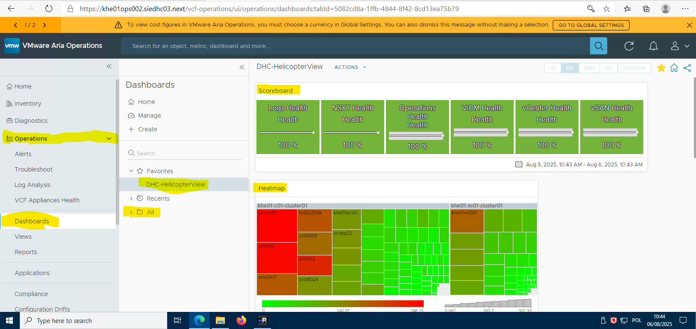

## 3.2 Review opened SNOW tickets and requests

  1. Login to SNOW Global Production Instance <https://atosglobal.service-now.com/navpage.do>

  2. If there will be any issues viewing incidents in SNOW go to **Search > 'Your Name' > People - users > 'Your Name' > Press on 'Primary group'** and make sure you're added to the proper DevSecOps groups `ZZ.Cloud.DHC-DevSecOps` and `ZZ.Cloud.DHC-JIRA` or appropriate Bridge team:
  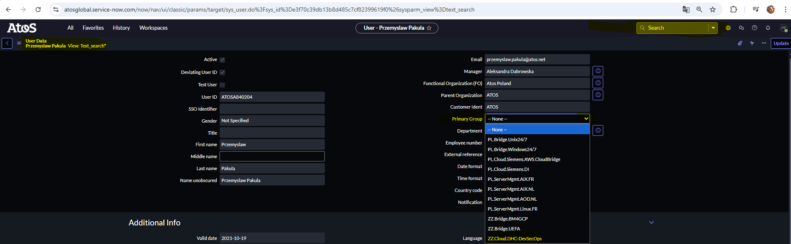

  3. On the left Navigation Pane go to the **All > Incident > Assigned Work > Assigned to My Groups**:
  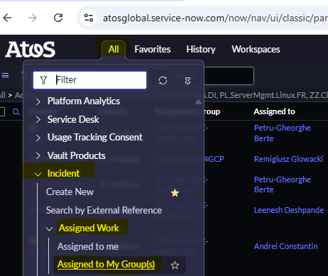

  4. Check is there any active incidents that require attention:
  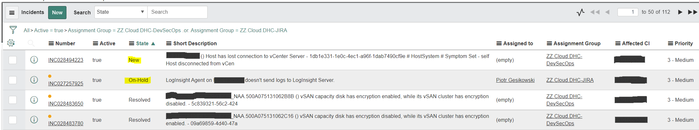

  5. Edit filters appropriately for you and add to favorites to have easier access in future:
  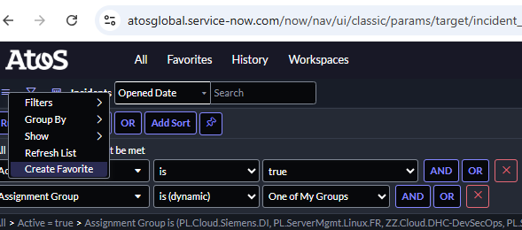

## 3.3 Ensure that the VM disks are not mounted on the Backup Proxy VMs

> **NOTE:** You can find the VM proxy backup appliance based on the naming convention rules described here:
>
> <https://github.com/GLB-CES-PrivateCloud/DHC-Documentation/blob/develop/design/namingConvention.md>
>
> or check for the documentation file for that specific customer.
>
> For Avamar proxy we can have these notations: `bps`, `avp`.
>
> For example:
>_mec01avp001_ where `mec01` represents `locationCode`,  `avp` represents server role and `001` represents server number in that location.
>
> **NOTE:** For confirmation, on the VM notes, you should have a description similar to this: “This is Backup and Recovery vProxy Appliance” and some attributes pointing to DELL EMC vProxy appliance as this VM is deployed from an ovf provided by the vendor.

1. Login to vCenter (vcs) Web Client for example <https://khe01vcs001.siedhc03.next/>

2. Search for host in question, for example:
   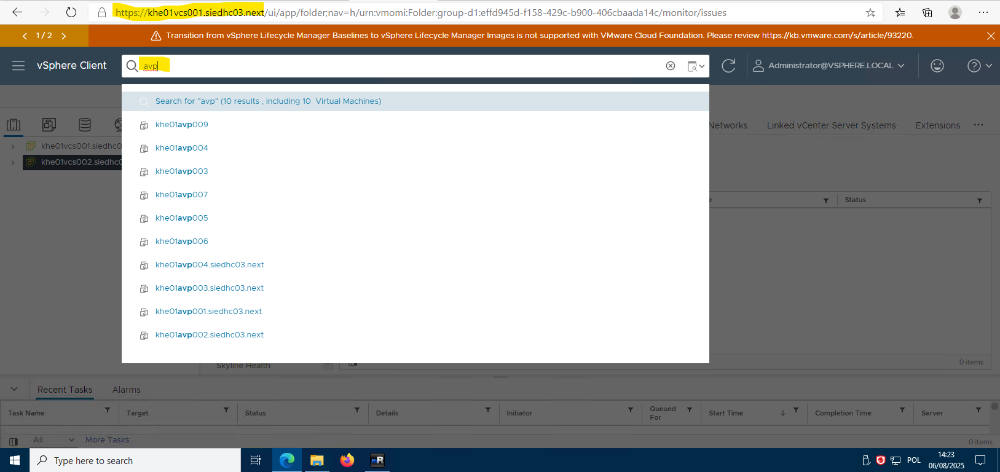

3. Select **Actions > Edit Settings...**:
   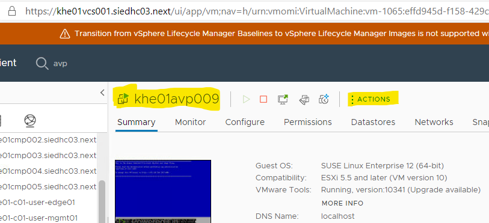

4. Make sure there is no stuck Hot Added Disks (i.e. name of VMDK does not match the backup proxy VM)

    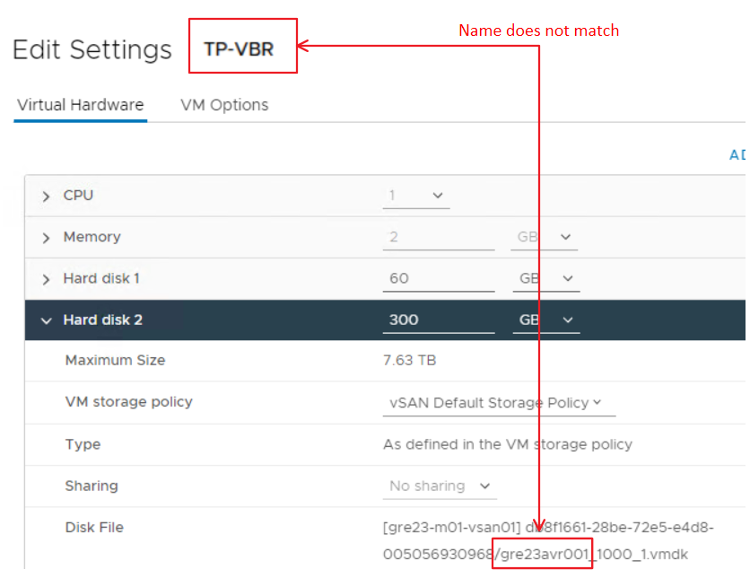

5. Once you have found a disk HOT Added to a proxy you need first to check with backup team, before performing the following steps to release it (open Change if required):

    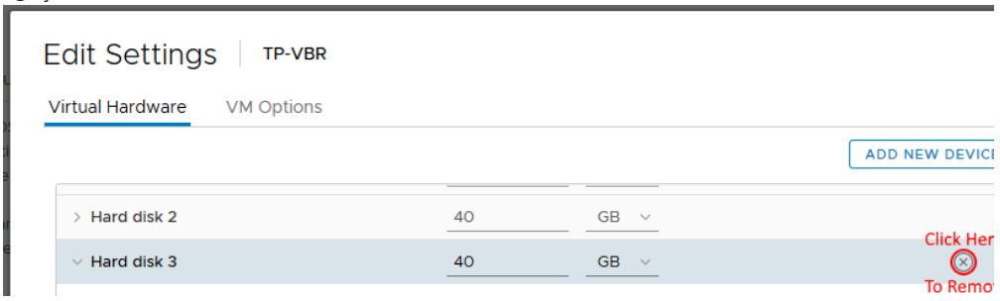

   **There are 2 known issues for which a disk remains mounted on the proxy:**

   1. Either backup failed from Avamar side, for whatever reason, and remove snapshot operation didn't run on the VM - in this case you'll have a failed backup, disk has to be released and backup team should be contacted to address this and troubleshoot it.

   2. The backup is still running on the Avamar side (outside of backup window) - this usually occurs for large VMs, with more than 2TB hard disks and needs to be addressed also with backup team.
   > **Note: Do not check the box to delete files from datastore!!**
  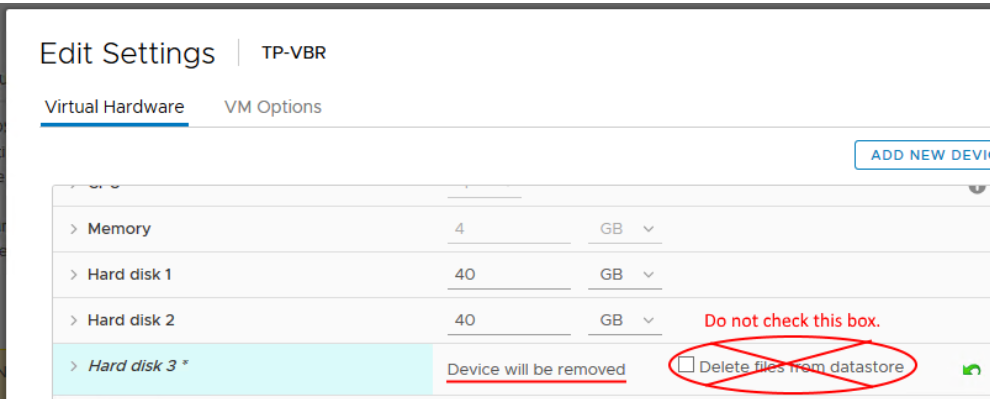

## 3.4 Check log collection on Log Insight

  1. Log in to the Log Insight cluster for example <https://khe01vli001.siedhc03.next/>
  2. On the left side bar find **Explore Logs** (Diagram icon) and make sure logs are collected:
  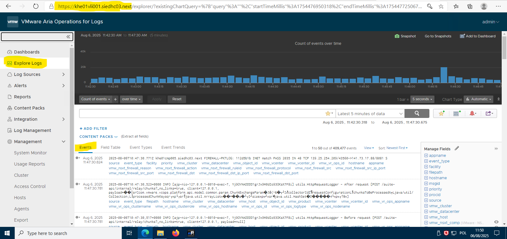

  3. Go to **Management -> Agents** and confirm each Agents are sending events and are in Active status. Check - Last Active, Events Sent, Status:
  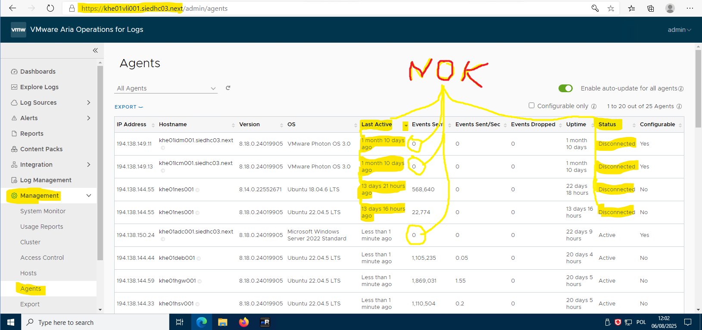

  4. Go to **Management -> Cluster** and evaluate Log Insight Cluster status:
  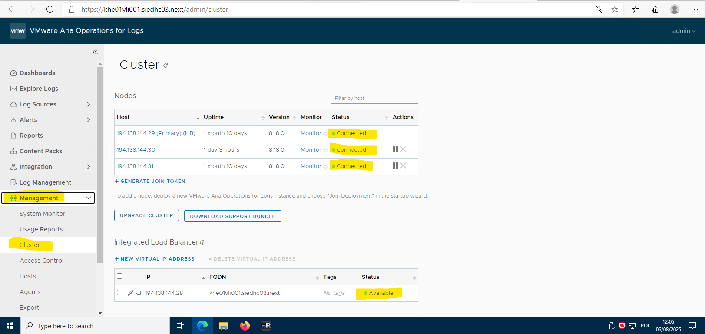

## 3.5 Check SRM and VM replication status. Aviva only

  1. Log in to the vCenter Web Client for example <https://lbg01vcs001.avidhc01.next/>

  2. Go to top left **Box with 3 bars > Site Recovery**

     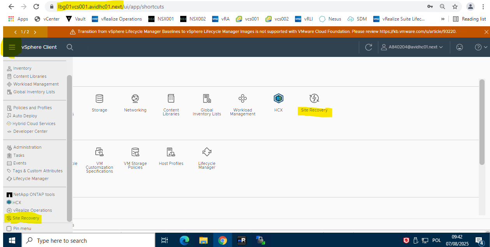

  3. Open Site Recovery.

     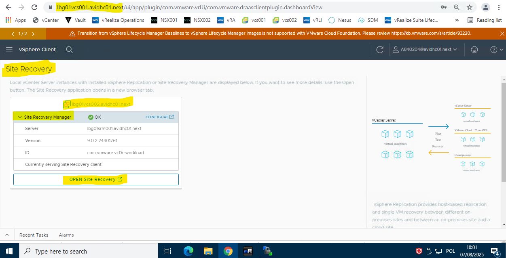

  4. Log in with <administrator@vsphere.local> account.

  5. On the chosen Site Recovery home page, select a site pair and click **View Details**

     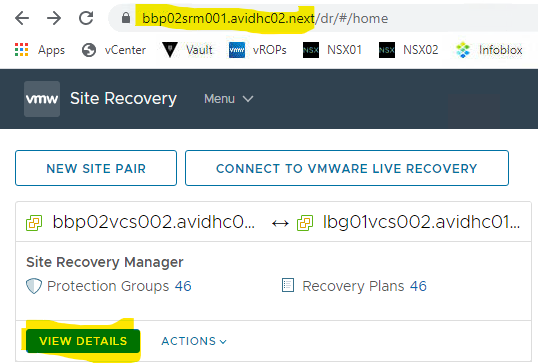

  6. You will be prompted to login into SRM, the domain of the SRM should be the same as the login AD account:

     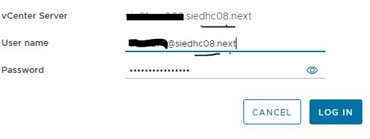

  7. To check remote SRM connection and VR connection go to Site Pair -> Summary and Configure -> Replication Servers section:

     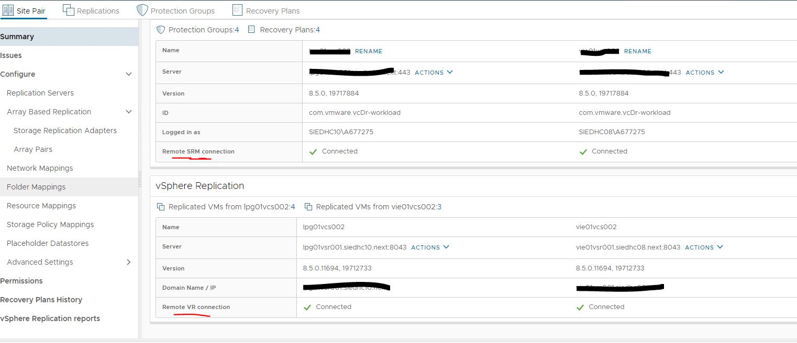
     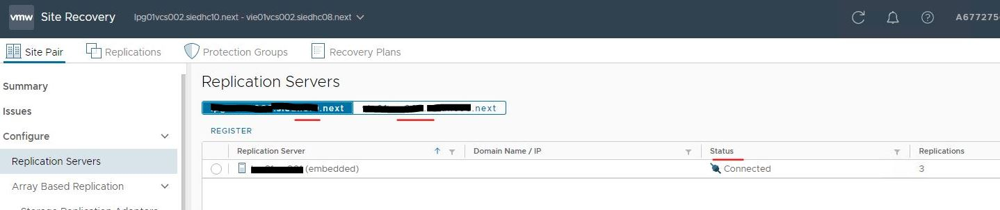

  8. To see details of the virtual machines replicated from this site, select the **Replications** tab and click **Outgoing** or **Incoming**

      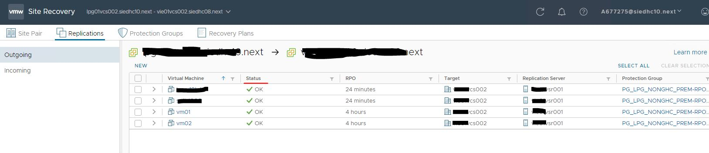

  9. Status **OK** means the replication is running and remediation is not needed. Other replication statutes than **OK** needs an further investigation

     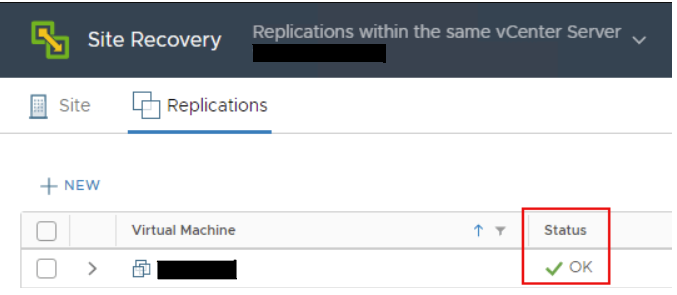

## 3.6 Check NSX health

  **NSX-T Overall Healthcheck**

  1. Log in to the both NSX-T Managers (Management and Compute cluster) for example <https://khe01nsx001.siedhc03.next/> and <https://khe01nsx002.siedhc03.next/>
  2. Go to **Home** -> **Alarms** and evaluate NSX Manager system events:
  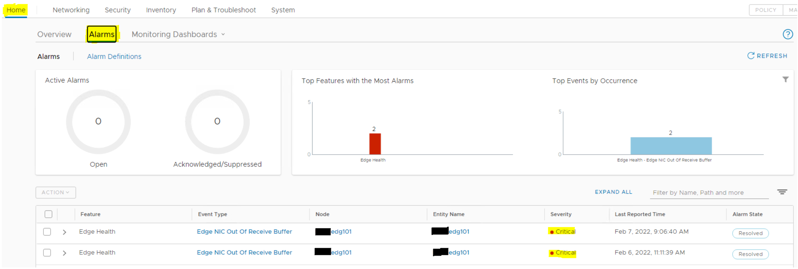

  3. Go to **Home -> Monitoring Dashboards -> System** and evaluate status of the NSX-T components:
  **NOTE:** repeat the same for the **Networking & Security**.
  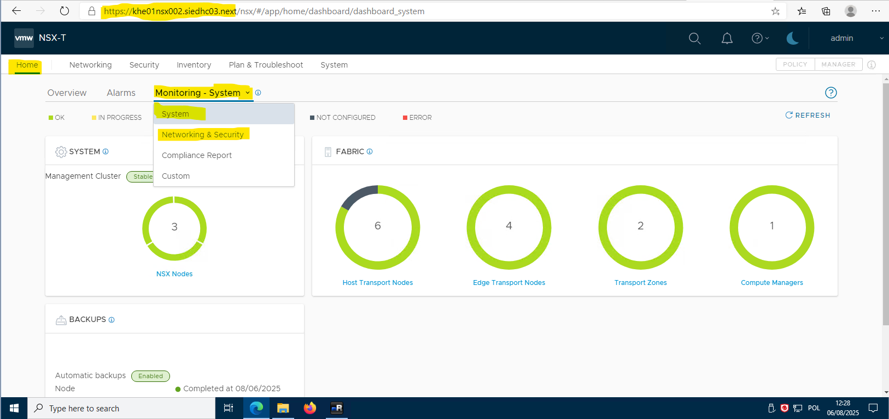

  4. Go to the **System -> Lifecycle Management -> Backup & Restore** and evaluate status of backups:
  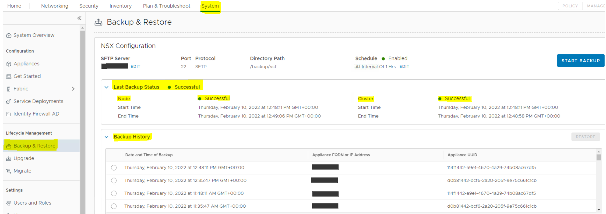

  5. Check if there is any certificate different than green (Valid) under **System -> Settings -> Certificates:**
  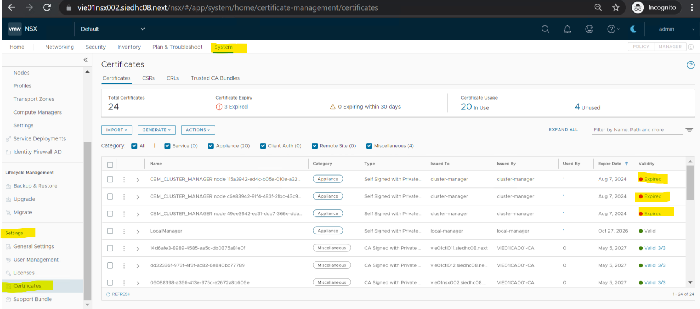

## 3.7 Check SDDC manager health

  1. Log in as **vcf** (password in vault) to SDDC Manager by using a Secure Shell (SSH) client via putty or mRemoteNG. The address should be without https:// at the beginning, so for example just **khe01sdm001.siedhc03.next**
  2. Verify the SDDC Manager health

     a. Run the command to view the details about the VMware Cloud Foundation system

     `sudo /opt/vmware/sddc-support/sos --health-check`

     b. When prompted, enter the vcf password

     **All tests show green state**
    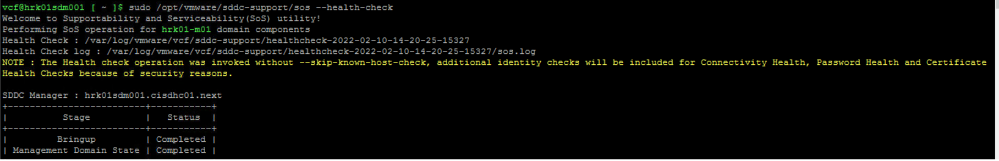
    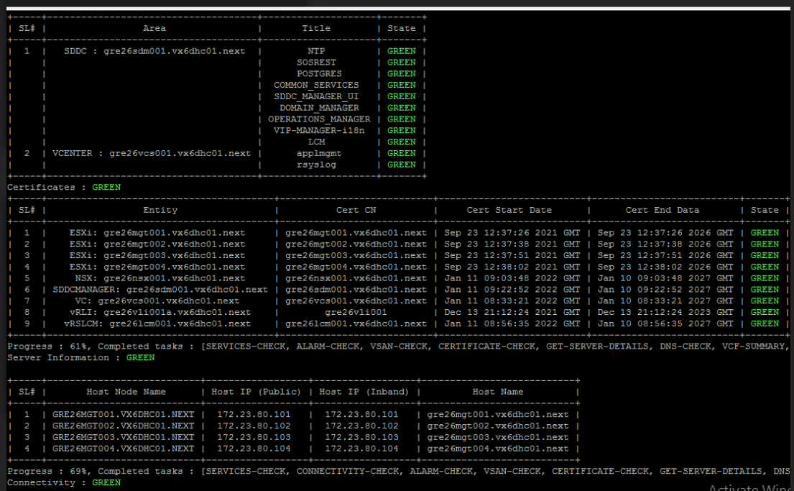
    Validate SDDC Managers Backup
  3. Log in to SDDC Manager by using a web interface, for example <https://khe01sdm001.siedhc03.next/>
  4. Go to **Tasks** and make sure last backup task was **successful**:
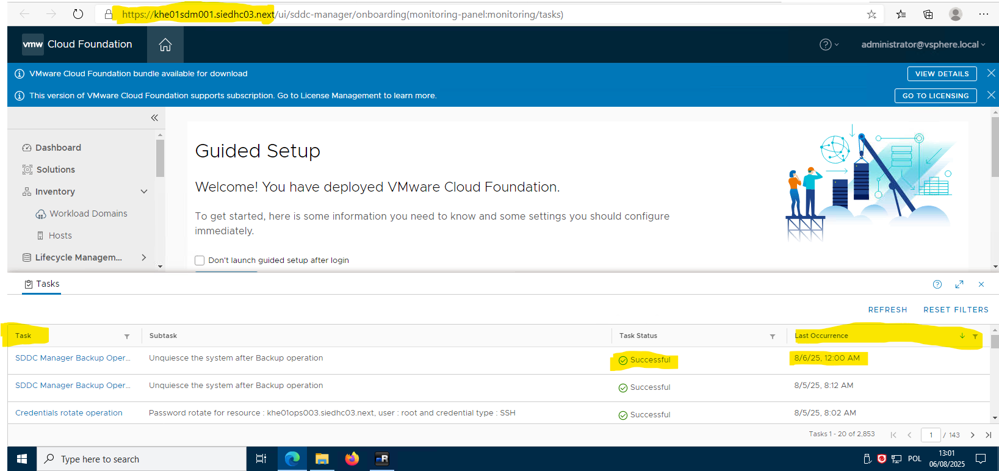

## 3.8 Check vCenter state and alarms

1. Log in to vSphere Web Client (vcs) for example <https://khe01vcs001.siedhc03.next/>
2. Select vCenter Server and go to the tab **Monitor -> Issues and Alarms -> All Issues**

    Evaluate vCenter system events all is OK

    **NOTE:** Do the same for both vCenter Servers (Management and Compute cluster)
        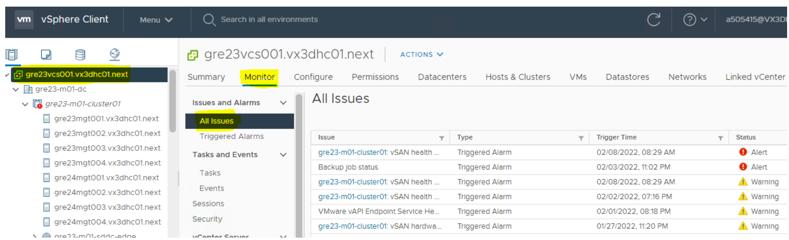

    Validate vCenters' Backup
3. Log in to **each** vCenter Server Management Interface using the appropriate port: <https://appliance-IP-address-or-FQDN:5480> , example : <https://khe01vcs001.siedhc03.next:5480/>
4. Go to **Backup** and make sure there are completed backups for each day:
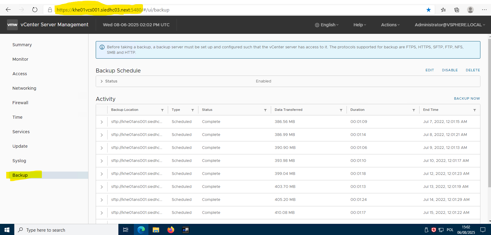

## 3.9 Check domain and product integration in vIDM

1. Go to IDM, for example <https://khe01idm001.siedhc03.next/> and log in with **admin** credentials to a **System Domain**
[ad](images/dhcProductionPlan/idm-login.png)

2. Access "Identity & Access Management" tab and check AD synchronization status:
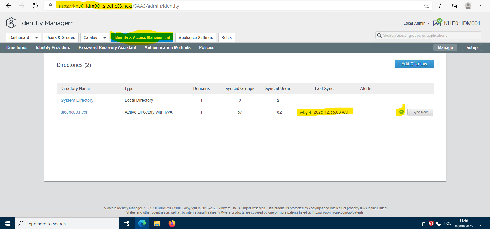

## 3.10 Check vSan object health

1. Login to vCenter (VCS) for example <https://khe01vcs001.siedhc03.next/>

2. Go on each **Cluster > Monitor > vSAN > Skyline Health > Data > vSAN object health**.
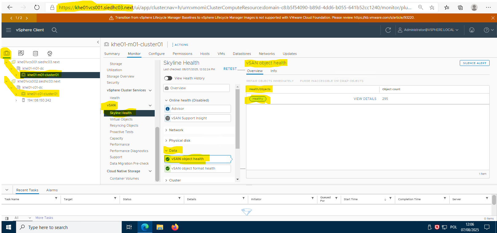

3. Here check the status and investigate any errors.

## 3.11 Check Compliant scan upload to Alcatraz server

**VMware components (vCenter and ESXi hosts)**

1. On each Monday vROPs is sending upload status email to DevSecOps group mailbox. Make sure upload has been successful:
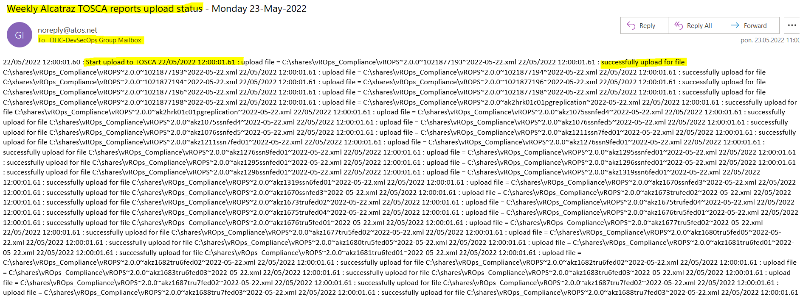

    **Windows and Linux VCS management servers**
2. Compliance reports are stored on **_ans001_** (example lbg01ans001) server in **`/backup/reports/`** folder. One report per server. Use command: ls -ld */
  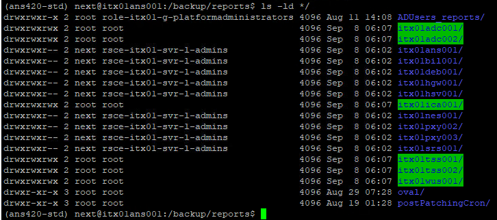
3. Go to each folder and make sure new reports were generated on last Sunday. Use a command, so the newest will appear at the bottom: **ls -ltr**
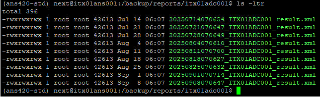

## 3.12 Check Compliant report visibility on TOSCA Portal

  1. Log in to TOSCA Portal (ATOS environment) <https://tosca-siemens.it-solutions.atos.net/tosca-int/>
  2. Go to Reporting -> All measures -> Filter : by Provider name GP79 (this is the code for BTN) -> action -> download - csv!
  [checkTosca1](images/dhcProductionPlan/checkTosca1.png)
  3. Open downloaded csv file and verify if VCS data from last upload are visible:
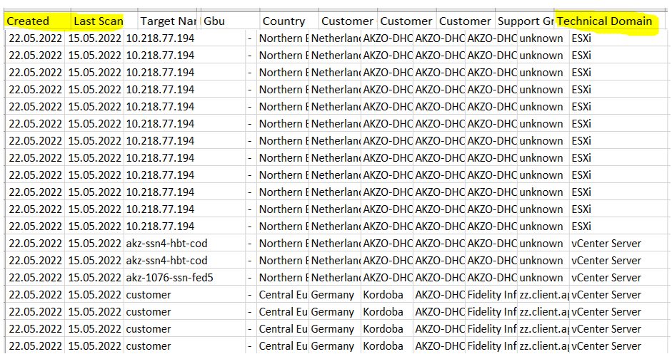

## 3.13 Check vROPS vSAN Datastores capacity reports

1. vROPs is sending capacity reports to the DevSecOps group mailbox. Study it and make sure VCS is not reaching capacity limits. In case capacity usage is at warning level contact Capacity Manager dedicated to the particular project:
  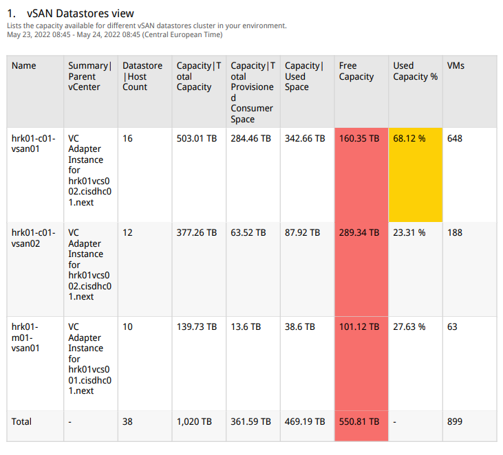

    **To check the report do the following:**

2. Go into DHC-DevSecOps mailbox
3. Look for recent email from Search for **VsanCapacityVrops** in subfolder
4. Check if the report is attached in the email
5. Validate if report is valid and not empty
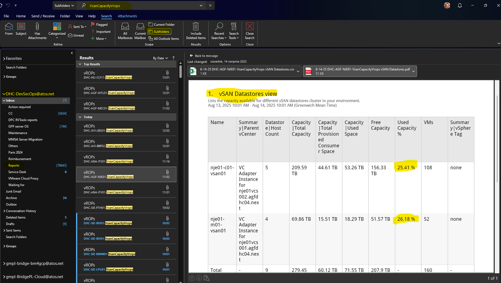

## 3.14 Verify in Snow the CMDB versus the actual installed base

This check was only requested for ESX hosts components currently, but additional VCS components can be added.

1. Login into Snow: All - Configuration -> Servers -> All(Filter Only)
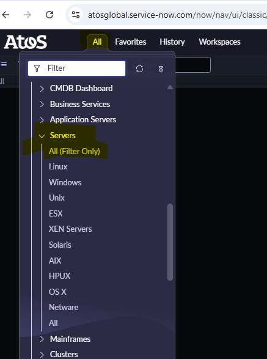

2. Write in the Search box the CI for which CMDB is checked. In the SNOW CMDB view, add the three columns: "Data source", "Created" and "Updated" so that we'll be able to see whether SNOW discovery was ran recently for any CI and also compare the OS version:

     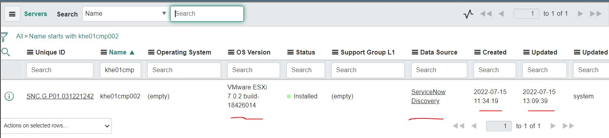

3. To create a report for all the ESX entries for one location, type in the search only the first letters which identifies the location, for example _fth01_ for Furth or _khe01_ for Karlsruhe and from any of the top columns, open with a right-click of the mouse, the window which will contain the option to download a csv file. Please check the print-screen below:
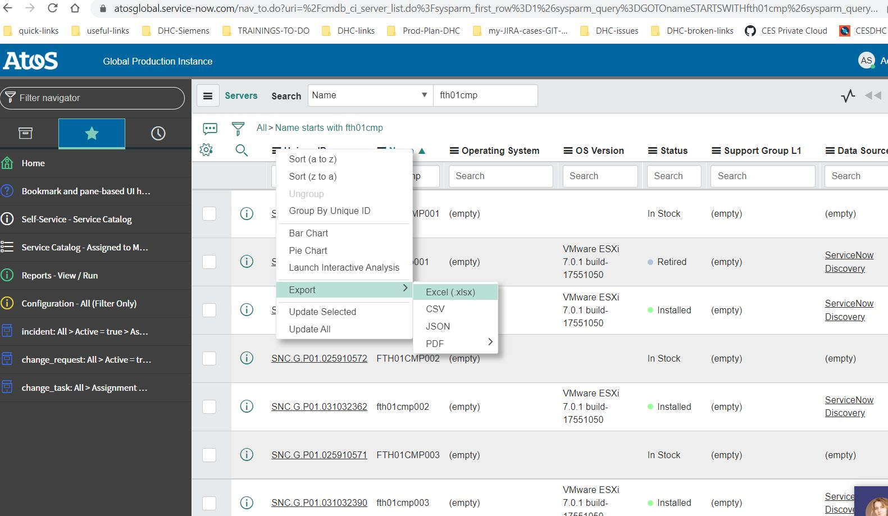

## 3.15 Blueprinting report

**This is BTN specific, but might be requested by other customers in the future.**

1. The blueprinting report is basically an email which needs to be sent before 15th of each month, and in our case, for Akzo customer, to <akzo-ast-reports@atos.net> (Put in cc of that email the following contacts as well: <justyna.kruszka@atos.net>, <ferry.roek@atos.net>)
Example of email blueprinting report:
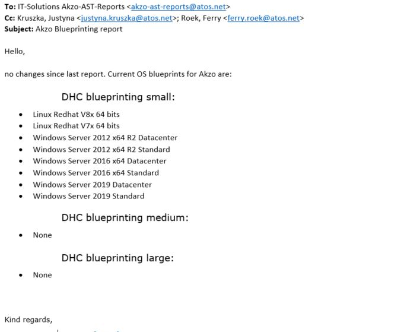

2. The information regarding the current OS blueprints should be retrieved from vRA Cloud. Once logged in, change the Organization to the tenant, in our case **akz01**. Go to **Assembler**.
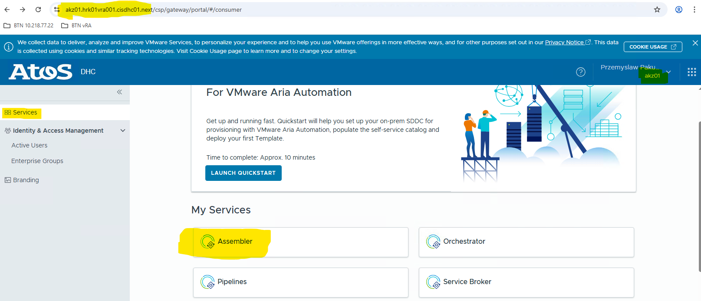
3. Choose to launch VMware Cloud Assembly service and go to **Design tab -> Templates**.
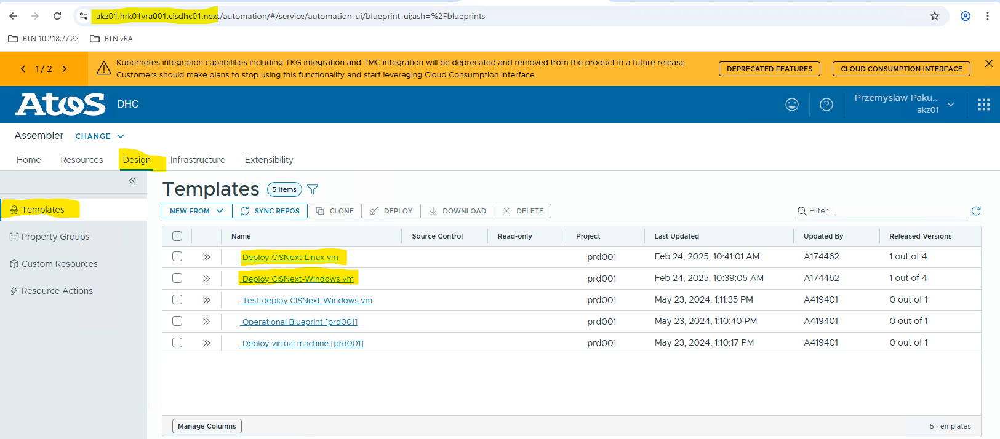
4. Choose the operational blueprints/templates for this customer - they can use VCS standard or custom blueprints - and click on each of them.

5. From the right side section, presenting the code view, search after **OSImage** parameter and on **enum** option you will have the list of possible blueprints which can be triggered using the current template.
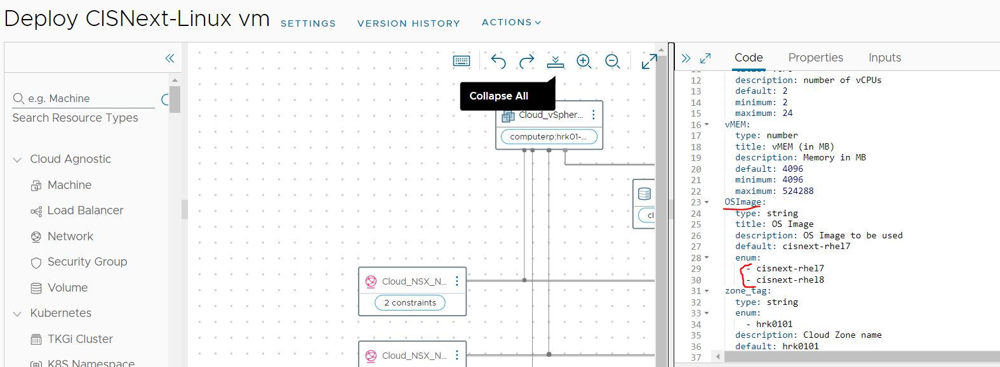
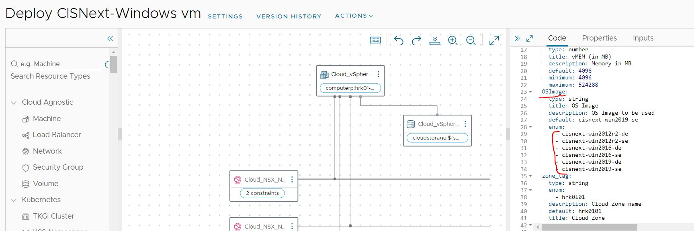

> NOTE: in BTN case a template for deploying a single VM will always be categorized as small.

## 3.16 AV report compliance

Scheduled AV reports are being send to DHC-DevSecOps mailbox every week. To check the report do the following:

1. Go into DHC-DevSecOps mailbox
2. Look for recent emails from **<virusprotection.trendmicro.it-solutions@atos.net>** (Search for **<virusprotection.trendmicro.it-solutions@atos.net>+DHC - Weekly Asset Report** in subfolder).
3. Check if the report is attached in the email
4. Validate if report is valid and all the needed VM's from Env are in there
5. In case of issue or new report requirement contact AV team:
SM: Stanciulescu, Dana-Adriana <dana-adriana.stanciulescu@atos.net>
DL: dl-ro-bds-trendmicro <dl-ro-bds-trendmicro@atos.net>

## 3.17 Check report for IP availability in Infoblox

Scheduled Infoblox reports are being send to DHC-DevSecOps mailbox at beginning of every week. To check the report do the following:

1. Go into DHC-DevSecOps mailbox
2. Look for recent emails from **Infoblox Report DHC-< customer >-< site >-NetworkProfile** (Search for **DHC+NetworkProfile** in subfolder to display all).
3. Check if the report is attached in the email
4. Validate if report is valid and there are available free IP addresses: the threshold for available IP's is 50. In this case an email should be sent to the TSMs/Capacity manager/CNT team/DHC DevSecOps DL/DHC DevSecOps mailbox.

Such email template should have subject as "subject: RED --> Low IP availability `<location code>` " and also an attachment with the actual Infoblox report with the low available IP addresses.

In body of such email we should have all the details along with possible fixes/actions we can propose and that will be helpful to remediate this situation. For example, propose an action to check if some test VMs using some of IPs from that pool exist for cleanup purposes.

**NOTE: The available free IP addresses threshold should be checked only for customer network view, not the default view.

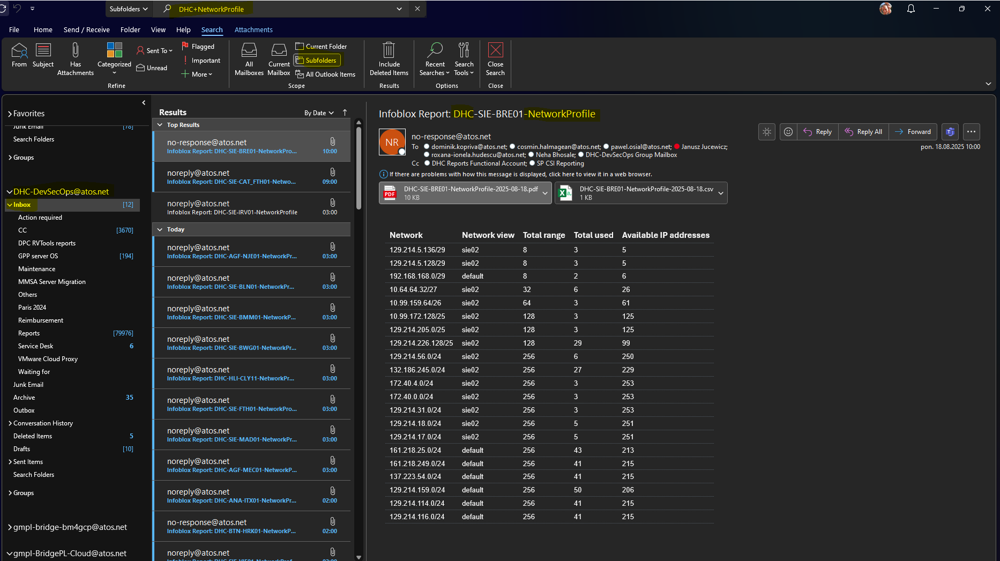

The default Vlan's that are used for SSR's in Siemens are found on the following SharePoint: <https://atos365.sharepoint.com/:f:/r/sites/DHCDevSecOpsTeam/Shared%20Documents/General/Clients/Siemens/04%20SSRs%20Documentation/41%20Networks%20Profiles?csf=1&web=1&e=hBYhMY>

## 3.18 Check RVTools report

Scheduled RVTools report is send to DHC-DevSecOps mailbox at the beginning of every week (Monday). To check the report do the following:

1. Go into DHC-DevSecOps mailbox
2. Look for recent emails from **DHC-< customer >-< site >-Mgmt-RVTool-< date >** (Search for **DHC+Mgmt-RVTool** in subfolder to display all).
3. Check if the report is attached in the email
4. Validate if report is valid and not empty
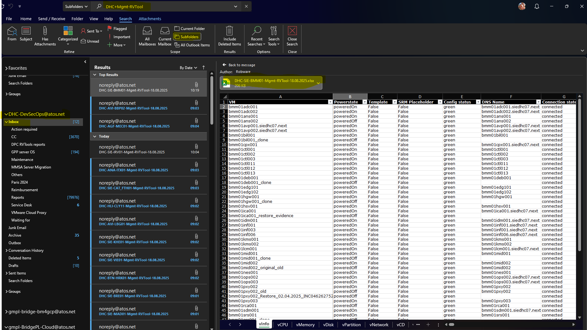

## 3.19 Check vSAN report

Scheduled vSAN report is send to DHC-DevSecOps mailbox at the beginning of every week (Monday). To check the report do the following:

1. Go into DHC-DevSecOps mailbox
2. Look for recent emails from **DHC-< customer >-< site >-vSAN Report** (Search for **DHC+"vSAN Report"** in subfolder to display all).
3. Check if the report is attached in the email
4. Validate if report is valid and not empty

## 3.20 Check expiry date of credentials and tokens (Siemens only)

It's mandatory to check all credentials and tokens used by SSR automation for Siemens and rotate them before the expiration date.

1. Get familiar with the document "SERVICENOW SSRS SIEMENS SPECIFIC LOW LEVEL DETAILS AND WORK INSTRUCTIONS" available on the DevSecOps sharepoint:
<https://atos365.sharepoint.com/:w:/r/sites/DHCDevSecOpsTeam/_layouts/15/Doc.aspx?sourcedoc=%7B1664D32D-76C4-42C3-9298-62036243C40C%7D&file=CRA%202.0%20-%20ServiceNow%20SSRs%20-%20Siemens%20specific%20low%20level%20details%20and%20work%20instructions%20_v0.1a.docx&action=default&mobileredirect=true>
2. List of all credentials and tokens with the expiry date is available on the DevSecOps sharepoint, in the excel file:
<https://atos365.sharepoint.com/:w:/r/sites/DHCDevSecOpsTeam/_layouts/15/Doc.aspx?sourcedoc=%7B135E6A79-A570-4936-93D4-A61DE19F4193%7D&file=PAM4SFA%20Content.xlsx&action=default&mobileredirect=true&cid=99329f2e-648f-4747-9050-445b25c3ad94>
3. Search the last two columns and look for the expiring passwords/tokens
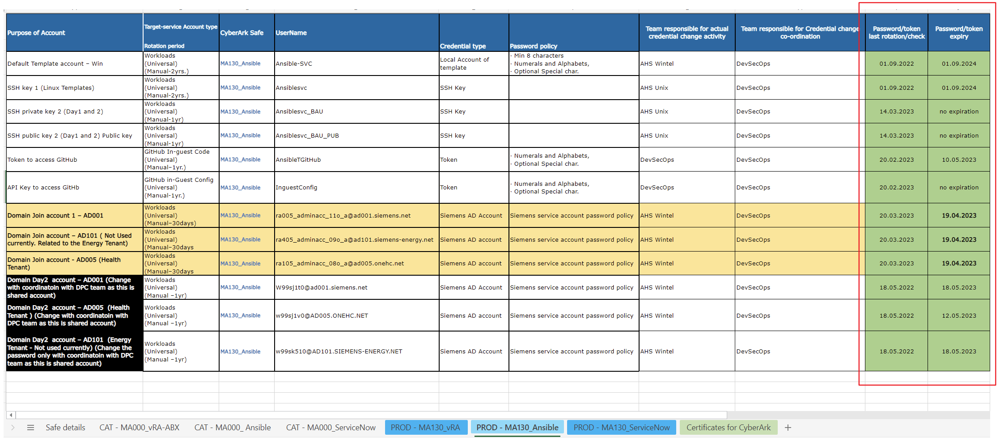
4. Open a Non-Standard Change and rotate expiring passwords/tokens according to the instruction described in the "SERVICENOW SSRS SIEMENS SPECIFIC LOW LEVEL DETAILS AND WORK INSTRUCTIONS".
**NOTE: Non-Standard Change requires at least 5 days to be processed so plan your Change in a proper advance.**
5. Update excel file with information about last rotation/check and new expiration date.
6. If changed, update passwords or tokens in DevSecOps CyberArk  <https://portal.asgard.saacon.net/PasswordVault/v10/>
