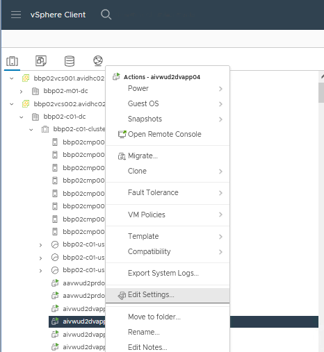
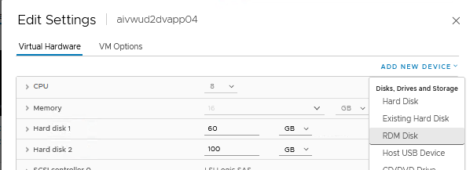
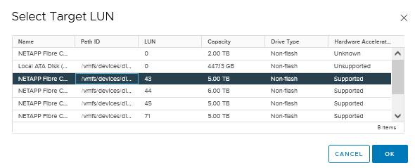

# VCS Provision and Configure RDM LUN for Virtual Machine

## Table of Contents

- [VCS Provision and Configure RDM LUN for Virtual Machine](#vcs-provision-and-configure-rdm-lun-for-virtual-machine)
  - [Table of Contents](#table-of-contents)
  - [Introduction](#introduction)
    - [Purpose](#purpose)
    - [Audience](#audience)
  - [Scope](#scope)
    - [Prerequisites](#prerequisites)
    - [Action Plan](#action-plan)
  - [Changelog](#changelog)

## Introduction

### Purpose

This instruction covers the action of Provisioning and Configuring RDM LUNs for Virtual Machines.

### Audience

- VCS Engineers
- VCS Architects

## Scope

The Instruction assumes that the reader has reasonable grasp of VCS infrastructure and VMware components. Reader should be also familiar with instruction for Addition/Modification of Storage LUNs on Cloud Hosts (dhcAddModifyStorageLunsToCloudHostsEsxi.md).

### Prerequisites

- Access to the vCenter
- Client Aviva visibility in SNOW
- Basic vCenter Knowledge
- LUN request send to the NetApp team (Part of dhcAddModifyStorageLunsToCloudHostsEsxi.md)

### Action Plan

After requesting the LUN creation from the NetApp team and receiving the LUN ID, engineer can proceed to addition of such to the virtual machine following steps as below:

1. Log in to the vCenter on the site where the LUN will be added.

    >vCenter FQDN: https:\<locationCode>vcs001.\<SearchDomain>

2. Navigate through the Virtual Machines. After finding the right machine, right click on it and choose the <b>Edit Settings...</b> option.

    

3. In the menu click <b>Add New Device</b> dropdown and choose <b>RDM Disk</b>

    

4. In the popup find the LUN with ID that corresponds to the one sent by NetApp team and proceed.

    

5. After this action the RDM LUN will be added to the machine with success.

## Changelog

| Version | Date          | Description                                                                                                                                                         | Author             |
|---------|---------------|---------------------------------------------------------------------------------------------------------------------------------------------------------------------|--------------------|
| 0.1     | 20/02/2024    | First version | Michał Sobieraj |
