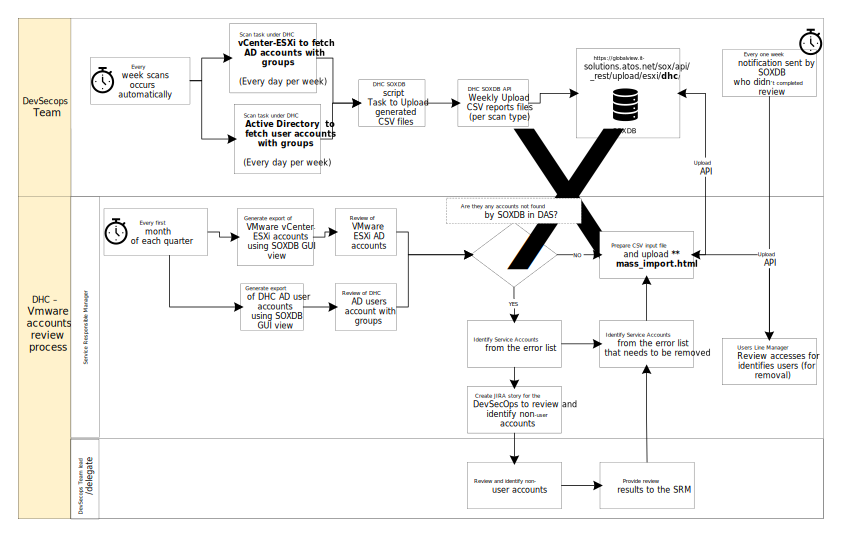

# Quarterly Access Review process for DHC supported by the DevSecOps

- [Quarterly Access Review process for DHC supported by the DevSecOps](#quarterly-access-review-process-for-dhc-supported-by-the-devsecops)
  - [Document control](#document-control)
  - [Introduction](#introduction)
    - [Purpose](#purpose)
    - [Audience](#audience)
    - [Scope](#scope)
  - [Prerequisite](#prerequisite)
- [Access Review Process](#access-review-process)
  - [Short description](#short-description)
  - [SoxDB review workflow](#soxdb-review-workflow)
  - [Timeline of the access review](#timeline-of-the-access-review)
- [Evidence](#evidence)
- [SOXDB reports](#soxdb-reports)
- [SOXDB mass import](#soxdb-mass-import)
- [SOXDB account removal process](#soxdb-account-removal-process)

## Document control

| Version | Date | Description | Author |
|---------|------|-------------|--------|
|0.1|16.01.2025|Initial draft|Tomasz Korniluk|
|0.2|26.01.2025|Updated to address SOXDB VMware Active Directory users |Tomasz Korniluk|
|0.3|11.03.2025|Finalize document update and review |Tomasz Korniluk|

## Introduction

### Purpose

Perform periodic reviews of user account access based on the delivered scan reports from the following DHC components:

- DHC Management workload domain and Compute vCenter instances
- DHC Management Active Directory user accounts with respective security groups

### Audience

- DevSecOps team members
- Service Managers
- DHC engineering Management
- Auditors

### Scope

- A detailed process description of the periodic access review in DHC for the management domain.

- The access review covers both DHC Active Directory, vCenter instances under management and compute ESXi hosts.

## Prerequisite

An engineer working with or supporting the DHC instance requires two types of access:

- A domain account in the DHC management Active Directory domain (`<Customercode>`dhc01.next, e.g. gre82dhc01.next)
- Access to the Management Active Directory and vCenter instances under the DHC platform.

The engineer should already possess a Management Active Directory account with valid id as the login id.

# Access Review Process

## Short description

The quarterly access review process is established to maintain all the accesses in the DHC Management Stack. The goal of this process is to review all user accesses by their managers and all the service accounts by the DevSecOps team. Once per quarter DevSecOps team is generating extracts from the SOXDB webportal. Next, managers are validating accesses of their employees and DevSecOps team lead is reviewing service accounts. The outcome of those reviews is an input to update accesses in the DHC environment and upload reviewed users account into SOXDB endpoint.

## SoxDB review workflow

| Scope | Task name | Result |
|---------|------|-------------|
|DevSecOps Team|SOXDB auto scan executed every day per week| CSV scan report of VMware / esxi Active Directory user accounts and DHC Active directory with groups|
|DevSecOps Team|SOXDB upload script executed every day per week| Uploads CSV scan report files (vmware / esxi Active Directory users accounts and DHC Active Directory user accounts) into SOXDB|
|SRM|Generates Vmware ESXi Active Directory accounts from SOXDB via GUI| Export vCenter Active Directory users accounts for review|
|SRM|Generates DHC Active Directory user accounts with groups | Export DHC Active Directory users accounts for review|
|SRM|Validates exported data| Validates and identifies service accounts|
|SRM|Report Jira story to validate and review found non-user Active Directory accounts| Identify service accounts|
|DevSecops Leader|Review found non-user Active Directory accounts| Validates and identifies non-user Active Directory accounts and reports back results to SRM|
|SRM|Identifies services accounts from the DevSecops list| Mark for removal unneeded service accounts|
|SRM|Upload CSV final input list | Mark for removal inside SOXDB Active Directory users accounts using mass_import.html|

## Timeline of the access review

Every quarter

|Month 1|Month 2|Month 3|
|---|---|---|
|Exports from the Active Directory and vCenter instances/ESXi hosts|Reviews creation and exports upload to the SoxDB tool; SoxDB reviews start; Non-user accounts review by the DevSecOps team|Access updates based on the review outcome|

Please note that Month 2 and Month 3 may overlap and this timeline is not fixed. It may happen that reviews start in the middle of the 2nd month and finish in the middle of the 3rd, leaving the second half of the 3rd month for the access updates (what is sufficient).

# Evidence

All imported data by DHC SOXDB automation  or manual import are always available inside SOXDB GUI and by email notifications (contains csv data export file).

# SOXDB reports

All generated SoxDB reports should  be stored locally inside DHC platform under Ansible controller and encrypted for the future use.

SOXDB reports should be generated by the automation playbook and role described under work instruction [wiSoxDBIntegration.md](wiSoxDBIntegration.md)

# SOXDB mass import

To upload manually corrected / updated data export, follow the SOXDB instruction [SOXDB mass import](https://globalview.it-solutions.atos.net/sox/doc/account_management/mass_import.html).

**Notice:** Make sure to use the following template to perform mass imports for user accounts that need to be updated / correction inside SOXDB:

[import template](https://globalview.it-solutions.atos.net/sox/doc/assets/files/MassImportTemplate.xlsx)

# SOXDB account removal process

To remove an account which has been reviewed by SRM and DevSecOps Leader follow the [SOXDB guide](https://globalview.it-solutions.atos.net/sox/doc/account_management/account_removal.html)
