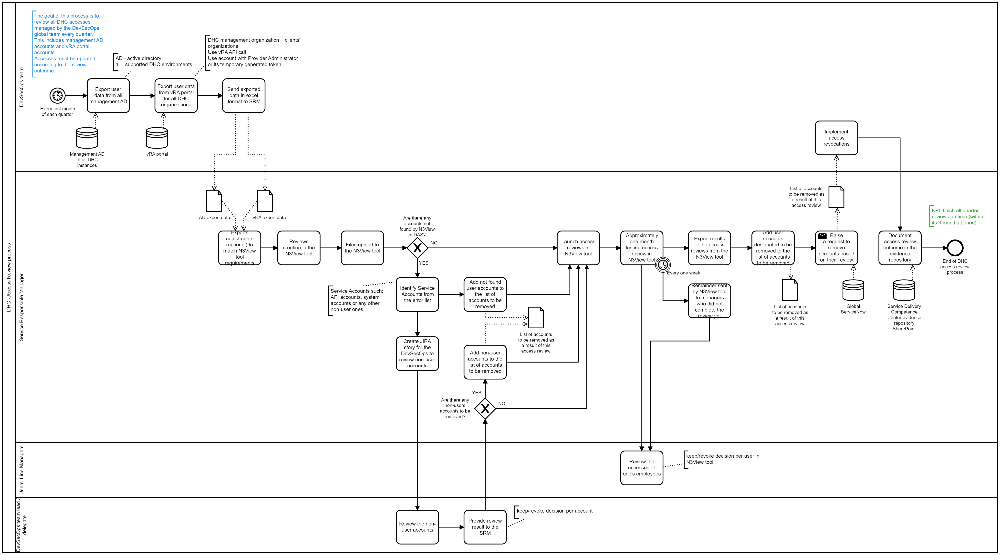

# Quarterly Access Review process for VCS supported by the DevSecOps

## Content

- [Quarterly Access Review process for VCS supported by the DevSecOps](#quarterly-access-review-process-for-vcs-supported-by-the-devsecops)
  - [Content](#content)
  - [Document control](#document-control)
  - [Introduction](#introduction)
    - [Purpose](#purpose)
    - [Audience](#audience)
    - [Scope](#scope)
  - [Prerequisite](#prerequisite)
- [Access Review Process](#access-review-process)
  - [Short Description](#short-description)
  - [BPMN notation](#bpmn-notation)
  - [Remarks on handling the access changes](#remarks-on-handling-the-access-changes)
  - [Timeline of the access review](#timeline-of-the-access-review)
- [Evidence](#evidence)

## Document control

| Version | Date | Description | Author |
|---------|------|-------------|--------|
|0.1|18.02.2022|Initial draft|Shyjin Varaprath|
|0.2|11.03.2022|Process in BPMN notation|Pawel Osial|
|1.0|01.07.2022|Process update with N3View tooling addition|Pawel Osial|

## Introduction

### Purpose

Perform periodic access review in VCS for the management domain supported by the DevSecOps team.

### Audience

- DevSecOps team members
- Service Managers
- CES Management
- Auditors

### Scope

- A detailed process description of the periodic access review in VCS for the management domain.
- Access review covers both Management AD and vRA Portal.

## Prerequisite

An engineer working with or supporting the VCS instance would require two types of access to be able to access the VCS platform resources:

- A domain account on the VCS management active directory domain (For e.g. <custcode>dhc01.next)
- An invitation to access the vRA cloud organization created for the customer for “consuming” the VCS instance resources. The engineer should already posses a VMware account with valid AtoS email id as the login id. To grant access on the customer’s vRA cloud organization the engineer’s email id is “added” to the org with assigned roles/privileges.

# Access Review Process

## Short Description

Quarterly access review process is established to maintain all the accesses in the VCS Management Stack. The goal of this process is to review all user accesses by their managers and all the service accounts by the DevSecOps team. Once per quarter DevSecOps team is generating extracts from the Management Active Directory and the vRA Portal. Next, managers are validating accesses of their employees and DevSecOps team lead is reviewing service accounts. The outcome of those reviews is an input to update accesses in the VCS environment.

## BPMN notation

## Remarks on handling the access changes

Currently, all the access-related activities must be implemented within the Internal Service Request, which is available in the SNOW Global For a detailed description of how to handle access change please follow:

- [wiUserAccountManagement](wiUserAccountManagement.md)

## Timeline of the access review

Every quarter

|Month 1|Month 2|Month 3|
|---|---|---|
|Exports from AD and vRA Portal|Reviews creation and exports upload to the N3View tool; N3View reviews start; Non-users accounts review by the DevSecOps team|Access updates based on the review outcome|

Please note that Month 2 and Month 3 may overlap and this timeline is not fixed. It may happen that reviews start in the middle of the 2nd month and finish in the middle of the 3rd, leaving the second half of the 3rd month for the access updates (what is sufficient).

# Evidence

All the evidence should be documented and uploaded to the [CES Service Delivery Competence Center SharePoint](https://atos365.sharepoint.com/sites/100001848/CES%20Evidence%20Repository/Forms/AllItems.aspx?OR=Teams%2DHL&CT=1638962576696&id=%2Fsites%2F100001848%2FCES%20Evidence%20Repository%2FCES%20Practice%20CTO%20DHC%2FUser%20and%20Authorization%20Management&viewid=05b27bd5%2D15b8%2D4db1%2D8554%2Dc8166dd2b710).

The template for the Quarterly Access Review Report can be downloaded [here](files/dhcQuarterlyAccessReview/DHC%20Quarterly%20Access%20Review%20Report%20-%20template.docx).
