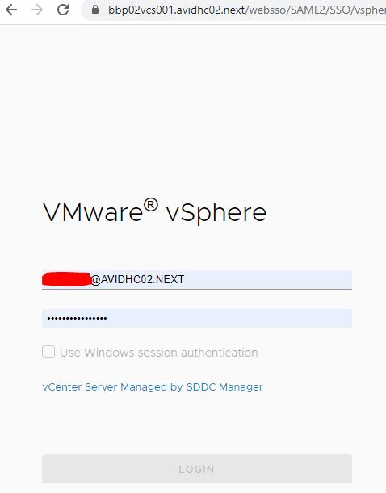
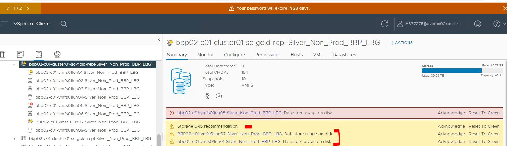
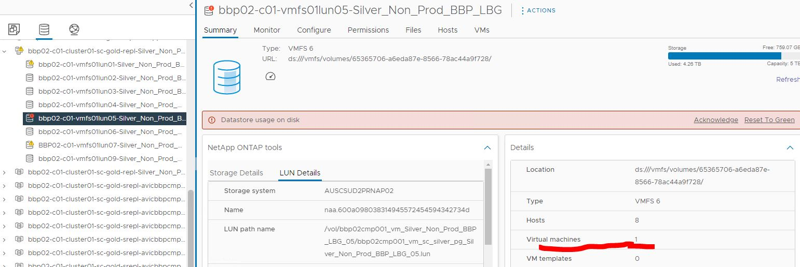

# Rebalancing Datastore if its utilization crosses the threshold

## Table of Contents

- [Rebalancing Datastore if its utilization crosses the threshold](#rebalancing-datastore-if-its-utilization-crosses-the-threshold)
  - [Table of Contents](#table-of-contents)
  - [Introduction](#introduction)
    - [Purpose](#purpose)
    - [Audience](#audience)
    - [Scope](#scope)
    - [Prerequisites](#prerequisites)
  - [Action Plan](#action-plan)
    - [Check vCenter datastore clusters](#check-vcenter-datastore-clusters)
  - [Changelog](#changelog)

## Introduction

### Purpose

This instruction explains the procedure which should be followed in case datastore alerts for space utilization are triggered in the vCenter side. In this case, <b> manual rebalancing in both Aviva locations, BBP and LBG, is not recommended</b>, as we already have storage DRS configured and set to ‘fully automated’, this means that files will be migrated automatically to optimize space utilization and\/or latency.

Storage DRS is an intelligent vCenter Server feature for efficiently managing VMFS and NFS storage, similar to DRS which optimizes the performance and resources of the vSphere cluster. Storage vMotion ensures seamless migration of VMs between datastores while maintaining high availability and ensuring disaster recovery readiness.

The space threshold at which storage DRS will start to automatically rebalance is at <b>80%</b> utilized space per datastore. The imbalance check occurs every <b>8</b> hours.

Storage DRS interop with Site recovery Manager (SRM) and vSphere Replication. So, because of this, Storage DRS will migrate entire VM’s disks to another datastore, as it’s recommended to keep all of the VM’s disks to just one datastore (under Virtual Machine working directory) because of replication constraints which is done at the datastore level. This setting is configured in the storage DRS advanced options to *“Keep VMDKs together by default”*.

I\/O metrics for Storage DRS recommendations are enabled, which means that I\/O metrics will be considered as a part of any Storage DRS automated migrations. Because of this, storage DRS calculates during storage migration the I\/O cost on both the source and destination datastore.

Storage DRS is set at the default I\/O latency threshold of <b>15ms</b> and the I\/O imbalance threshold is <b>5</b>, so it means, storage DRS is designed to react to workloads spikes and bursts.

If there is a warning of low space on a specific datastore cluster, it’s recommended to add new datastore into that cluster or extend the existing one, depending on the case, not manually rebalance it (migrate the VM’s disks between datastores). This is because of the following reasons:

1. It's pointless to try to balance ourselves when storage DRS will do that anyway.
2. We will choose VM to migrate and datastore to migrate to, only based on usage and not calculate all the I/O, then based on what we choose, storage DRS will start to migrate also if imbalance is caused.
3. Manual rebalance is very much prone to human errors

### Purpose

This instruction explains the procedure which should be followed in case datastore alerts for space utilization are triggered in the vCenter side. In this case, <b> manual rebalancing in both Aviva locations, BBP and LBG, is not recommended</b>, as we already have storage DRS configured and set to ‘fully automated’, this means that files will be migrated automatically to optimize space utilization and\/or latency.

Storage DRS is an intelligent vCenter Server feature for efficiently managing VMFS and NFS storage, similar to DRS which optimizes the performance and resources of the vSphere cluster. Storage vMotion ensures seamless migration of VMs between datastores while maintaining high availability and ensuring disaster recovery readiness.

The space threshold at which storage DRS will start to automatically rebalance is at <b>80%</b> utilized space per datastore. The imbalance check occurs every <b>8</b> hours.

Storage DRS interop with Site recovery Manager (SRM) and vSphere Replication. So, because of this, Storage DRS will migrate entire VM’s disks to another datastore, as it’s recommended to keep all of the VM’s disks to just one datastore (under Virtual Machine working directory) because of replication constraints which is done at the datastore level. This setting is configured in the storage DRS advanced options to *“Keep VMDKs together by default”*.

I\/O metrics for Storage DRS recommendations are enabled, which means that I\/O metrics will be considered as a part of any Storage DRS automated migrations. Because of this, storage DRS calculates during storage migration the I\/O cost on both the source and destination datastore.

Storage DRS is set at the default I\/O latency threshold of <b>15ms</b> and the I\/O imbalance threshold is <b>5</b>, so it means, storage DRS is designed to react to workloads spikes and bursts.

If there is a warning of low space on a specific datastore cluster, it’s recommended to add new datastore into that cluster or extend the existing one, depending on the case, not manually rebalance it (migrate the VM’s disks between datastores). This is because of the following reasons:

1. It's pointless to try to balance ourselves when storage DRS will do that anyway.
2. We will choose VM to migrate and datastore to migrate to, only based on usage and not calculate all the I/O, then based on what we choose, storage DRS will start to migrate also if imbalance is caused.
3. Manual rebalance is very much prone to human errors.

### Audience

- VCS Engineers
- VCS Architects

### Scope

The Instruction assumes that the reader has reasonable grasp of VCS infrastructure and VMware components.

### Prerequisites

- Access to VMware vSphere environment.
- Proper permissions to check vCenter datastore clusters.
- Familiarity with [dhcAddModifyStorageLunsToCloudHostsEsxi](https://github.com/GLB-CES-PrivateCloud/DHC-Documentation/blob/develop/workInstructions/dhcAddModifyStorageLunsToCloudHostsEsxi.md) instruction.

## Action Plan

### Check vCenter datastore clusters

1. Launch vSphere Client and log in vCenter with your AD account:

   

   

   >Note: vCenter FQDN naming convention: *https:\< locationCode > vcs001 < searchDomain >*.

2. Check on the datastore clusters for any space utilization warnings, if there are, check how many datastores have this issue:

   

      - If on the datastore there is only one VM consuming all of its space, in this case extend request will be needed, check WI for this: [dhcAddModifyStorageLunsToCloudHostsEsxi](https://github.com/GLB-CES-PrivateCloud/DHC-Documentation/blob/develop/workInstructions/dhcAddModifyStorageLunsToCloudHostsEsxi.md).

        

      - If there are multiple datastores, each having more than one VM, then, depending on the free space left on them, request for one or multiple datastore will be needed, check WI for this: [dhcAddModifyStorageLunsToCloudHostsEsxi](https://github.com/GLB-CES-PrivateCloud/DHC-Documentation/blob/develop/workInstructions/dhcAddModifyStorageLunsToCloudHostsEsxi.md).

## Changelog

| Version | Date          | Description                                                                                                                                                         | Author             |
|---------|---------------|---------------------------------------------------------------------------------------------------------------------------------------------------------------------|--------------------|
| 0.1     | 20/02/2024    | First version | Lupu Adriana |
