# Aria Automation - End User Guide

## Document Version History/Change Log

| Version | Date       | Author(s)       | Summary of Changes                                                                                           |
| :------ | :--------- | :-------------- | :----------------------------------------------------------------------------------------------------------- |
| 1.0     | 2025-05-31 | Łukasz Tworek | Initial draft.                                                                                               |

---

## Table of Contents

- [Introduction](#introduction)
- [Available Catalog Items](#available-catalog-items)
  - [Request a Virtual Machine](#request-a-virtual-machine)
  - [Manage Virtual Machine Security Groups](#manage-virtual-machine-security-groups)
  - [Manage Security Policy Firewall Rules](#manage-security-policy-firewall-rules)
  - [Manage Security Groups](#manage-security-groups)
  - [Manage NSX-T Tags for a VM](#manage-nsx-t-tags-for-a-vm)
  - [Manage an AVI Load Balancer](#manage-an-avi-load-balancer)
  - [Create NSX Services](#create-nsx-services)
  - [Create an AVI Load Balancer](#create-an-avi-load-balancer)
  - [Create AVI Health Checks](#create-avi-health-checks)
  - [Add or Remove a Security Policy](#add-or-remove-a-security-policy)

## Introduction

This guide is designed to facilitate understanding and use of the available catalog items in Aria Automation and the management of deployments.

While the request forms in Aria Automation are designed for self-explanation with clear display names, input validation, and embedded hints (indicated by an info icon next to the field), this document provides a more detailed walkthrough of common requests and actions.

This guide will be updated as new services are added or existing ones change.

The catalog items covered in this guide include:
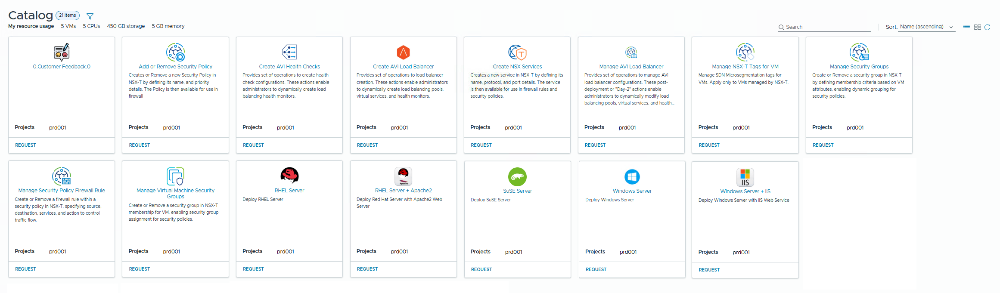

- Request a Virtual Machine
- Manage Virtual Machine Security Groups
- Manage Security Policy Firewall Rule
- Manage Security Groups
- Manage NSX-T Tags for VM
- Manage an AVI Load Balancer
- Create NSX Services
- Create an AVI Load Balancer
- Create AVI Health Checks
- Add or Remove a Security Policy
- Submit Customer Feedback

## Available Catalog Items

This section provides guides for requesting various services available in the Aria Automation catalog.

---

### Request a Virtual Machine

This guide outlines the process of using VMware Aria Automation Service Broker to request a new virtual machine (VM) from the catalog. The request form is organized into multiple tabs (General, Networks, Disks, Additional Information, and conditional tabs like Local Account and Custom Script). Each tab and field will be explained in detail, including its purpose, requirements, and any conditional behaviors. An example use case is provided at the end (creating a development web server VM) to illustrate how the form is to be filled. The guide is intended for end users and does not assume deep technical knowledge, but technical requirements will be noted where necessary.

#### Contents

- [General Tab -- Basic VM details (name, project, size, etc.)](#general-tab-vm-request)
- [Networks Tab -- Network interfaces and micro-segmentation options](#networks-tab-vm-request)
- [Disks Tab -- Adding additional virtual disks](#disks-tab-vm-request)
- [Local Account Tab -- Creating a local user account (conditional)](#local-account-tab-vm-request)
- [Custom Script Tab -- Running a post-provisioning script (conditional)](#custom-script-tab-vm-request)
- [Additional Information Tab -- Additional metadata (description, owner, etc.)](#additional-information-tab-vm-request)
- [Example: Requesting a Development Web Server VM](#example-requesting-a-development-web-server-vm)
- [Submitting the Request](#submitting-the-request-vm-request)

---

#### General Tab (VM Request)

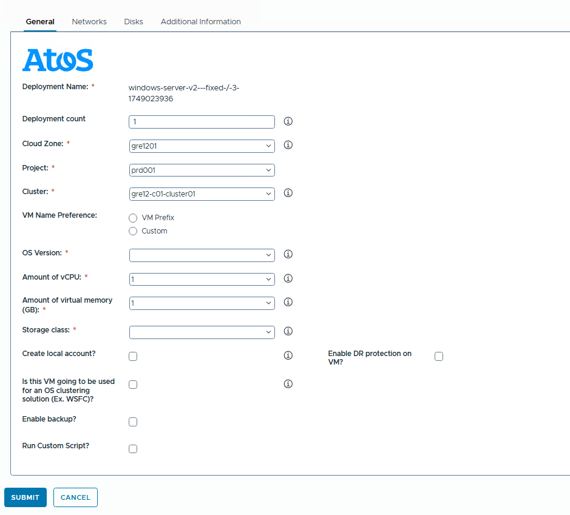

On the General tab, basic information about the VM being requested is specified, such as its name, location (cloud/cluster), operating system, and sizing (CPU, memory, storage). It also includes options to enable extra features like local account creation, clustering, backup, DR, or custom scripts. All required fields are marked with a red asterisk (*) in the form. Info icons (i) provide additional guidance on specific fields.

**Fields on the General tab:**

- **Deployment Name** (*Required, Read-only*)
  - The name for this VM deployment. This name is **always generated by a script and is read-only.**
  - This name will be used to identify the **deployment** (which groups the Virtual Machine and its associated resources) in the Aria Automation portal once it is provisioned. It is not the hostname or direct identifier of the VM itself but of the overall service deployment.
  - **Note:** The Deployment Name must be unique within the project.

- **Deployment Count** (*Required*)
  - The number of deployments with identical resource configurations to be created from this single request. By default, this is 1.
  - Increasing this number (e.g., setting Deployment Count = 3) results in three separate deployments, each containing the same configured resources as defined in the request form.
  - This will be left as 1 unless multiple independent deployments with the same settings are needed. A maximum limit on the count per request is 10, based on environment policy.

- **Cloud Zone** (*Required*)
  - The target cloud zone or environment where the VM will be deployed. A cloud zone corresponds to a specific data center, region, or set of resources (such as a particular vCenter or cluster group).
  - The dropdown is used to select the appropriate zone (e.g., a geographic region or environment like gre1201). This choice determines the underlying infrastructure for the VM.
  - Only accessible zones are visible, and a default selection is present. If more than one zone is available, the one closest to the needs should be chosen (for example, a Development Zone vs. Production Zone).

- **Project** (*Required*)
  - The project under which this VM is being deployed. Projects in Aria Automation group resources, policies, and users.
  - Available choices depend on user permissions; a default project (like prd001) is selected. The correct project must be selected, as it impacts which users can see the deployment and how it's categorized (e.g., billing or departmental association).
  - If association with multiple projects is possible, the one that this VM should be associated with must be picked.

- **Cluster** (*Required*)
  - The specific cluster or host group within the chosen Cloud Zone where the VM will be placed. The dropdown is used to select from available clusters (for example, gre12-c01-cluster01).
  - The cluster selection is pre-filtered by the chosen Cloud Zone. If only one cluster is available in the zone, it is auto-selected.
  - The info icon (“i”) next to this field provides details on what each cluster represents. The default or the cluster that aligns with resource needs should be chosen if options are given.

- **VM Name Preference** (*Required*)
   How the VM’s hostname/name will be determined is chosen here:
  - **VM Prefix:** Select this if the system should generate the VM’s name automatically using a predefined prefix or pattern. The prefix is based on the project or blueprint (for example, "winvm-") and the system appends a unique identifier. This ensures consistency in naming.
  - **Custom:** Select this to specify a custom name for the VM (or a custom prefix). When Custom is chosen, an additional field appears allowing the desired VM name or prefix to be typed. This option is used if specific naming conventions must be followed (e.g., WEBDEV01).
  - **Important:** If providing a custom name, any naming rules must be followed (the info icon provides guidance, e.g., allowable characters or length). The system appends characters or numbers to ensure uniqueness if using a prefix.

- **OS Version** (*Required*)
  - The Operating System version for the VM. The OS is chosen from the dropdown list. The options here correspond to the templates or images available (for example, different versions of Windows Server or Linux distributions).
  - The required OS should be selected. This determines the base software installed on the VM. The info icon provides details like the OS build or any customization notes for that image.
  - **Note:** If multiple VMs are requested (Deployment Count > 1), all will use this same OS image.

- **Amount of vCPU** (*Required*)
  - The number of virtual CPUs (processors) to be allocated to the VM. The amount of vCPU needed for the workload is selected from the dropdown (e.g., 1, 2, 4, 8).
  - The application’s needs determine the selection: for a simple web server or test VM, 1-2 vCPUs suffice; for more intensive applications, a higher count should be chosen.
  - The form ensures a valid value is picked from the provided options. Starting small is advisable; scaling up later is possible if needed.

- **Amount of virtual memory (GB)** (*Required*)
  - The amount of RAM (memory) for the VM, in GB. A selection is made from the dropdown list of memory sizes (e.g., 1 GB, 2 GB, 4 GB, 8 GB, 16 GB).
  - This should be chosen based on the expected load. The form restricts to allowed values.
  - If a very large memory size is needed and it’s not listed, a different template is required, or an administrator needs to be contacted. The info icon contains guidance.

- **Storage class** (*Required*)
  - The storage class or policy for the VM’s primary disk (the OS disk). This dropdown lists storage options such as tiers (e.g., Gold, Silver, Bronze) or predefined storage policies.
  - The storage class that fits the needs should be chosen:
    - Higher tiers (Gold) mean faster storage.
    - Lower tiers (Bronze) mean larger capacity or slower disks.
    - **Tip:** For critical production VMs, a higher performance class should be chosen; for non-critical VMs, a standard class is fine.

- **Create local account?** (*Optional, Checkbox*)
  - This box is checked if a local user account is to be created on the VM. This is useful for having a known username/password to log in.
  - If this box is ticked:
    - A new tab called **Local Account** appears, where the username and password must be provided.
    - It should be ensured that the username does not conflict with existing default accounts (e.g., “Administrator” or “root” should be avoided).
  - Leave unchecked if default credentials or SSH keys are planned for use.

- **Is this VM going to be used for an OS clustering solution (e.g., WSFC)?** (*Optional, Checkbox*)
  - Check this if the VM will be part of an OS-level cluster (e.g., Windows Server Failover Clustering).
  - This option is primarily informational but influences VM configuration (e.g., placement on separate hosts).
  - Leave unchecked if the VM is standalone. This is not needed if uncertain.

- **Enable backup?** (*Optional, Checkbox*)
  - Check this to enable automatic backup for the VM according to the organization’s backup policy.
  - If left unchecked, the VM is not backed up by default.
  - Enabling backups incurs additional costs. The info icon mentions retention periods or prerequisites.
  - It is generally advisable to enable backup for production or critical systems.

- **Enable DR protection on VM?** (*Optional, Checkbox*)
  - Check this to enable Disaster Recovery (DR) protection for the VM, allowing recovery at a secondary site.
  - This integrates with tools like vSphere Replication or SRM.
  - Only select this for mission-critical workloads. Enabling DR requires more resources. The info icon outlines RPO/RTO.
  - If uncertain, it should be left unchecked.

- **Run Custom Script?** (*Optional, Checkbox*)
  - Check this if a custom script is to be run on the VM after provisioning (e.g., for software installation or configuration).
  - If checked:
    - A new tab called **Custom Script** appears for the script content to be provided.
    - The script executes with administrator/system privileges.
    - The info icon and tips on the Custom Script tab should be used for guidance.
  - Leave unchecked if no startup script is needed.

> **Note:** The **Local Account** and **Custom Script** tabs are only visible if their respective options on the General tab are checked.

After all necessary fields on the General tab are filled out, proceed to the next tabs.

---

#### Networks Tab (VM Request)

On the Networks tab, the VM’s network interfaces and, if applicable, software-defined networking tags for micro-segmentation are configured. Every VM needs at least one network.

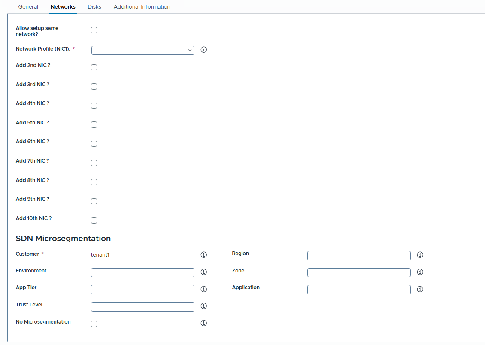

**Fields and options on the Networks tab:**

- **Allow setup same network?** (*Checkbox*)
  - Controls whether additional NICs (if added) can be on the same network as the primary NIC.
  - The default is unchecked (each NIC on a distinct network). This should only be checked if there is a specific reason for multiple NICs on one network.
  - If checked, the same network profile can be selected for NIC2, NIC3, etc., as for NIC1.

- **Network Profile (NIC1)** (*Required*)
  - The network for the primary network interface (NIC1) is selected from the dropdown. This is required.
  - A Network Profile represents a logical network or VLAN/subnet. It handles IP addressing.
  - The appropriate network should be chosen (e.g., Corp-Net-Prod, Dev-Net). The info icon provides details.

- **Add 2nd NIC?, Add 3rd NIC?, ... Add 10th NIC?** (*Checkboxes*)
  - These are checked to request additional network interfaces.
  - Checking a box reveals fields for configuring that NIC (e.g., Network Profile for NIC2).
  - Only the number of NICs actually needed should be checked.
  - If "Allow setup same network?" is unchecked, a different network profile must be selected for each additional NIC.
  - The maximum of 10 NICs is an upper limit; the environment supports fewer if so configured.

- **SDN Microsegmentation**
 This section is for providing SDN tags (e.g., for VMware NSX) to categorize the VM for security policies. If uncertain, these can be left blank or a "No Microsegmentation" option can be used. Info icons next to these fields provide specific examples or formatting rules.

  - **Customer** (*Required if microsegmentation is used*)
    - Denotes the tenant or customer name for microsegmentation. It is pre-filled.

  - **Environment** (*Optional*)
    - Environment tag (e.g., Development, Test, Production). Helps apply environment-specific policies.

  - **Region** (*Optional*)
    - Region or location descriptor (e.g., EU-West, US-East). Used for regional security policies.

  - **Zone** (*Optional*)
    - Network or security zone (e.g., DMZ, Internal). Influences firewall rules.

  - **App Tier** (*Optional*)
    - Application tier (e.g., Web, Application, Database). Helps configure access rules.

  - **Application** (*Optional*)
    - Name of the application or service this VM is part of (e.g., Payroll, EcommerceWebsite).

  - **Trust Level** (*Optional*)
    - Trust/security level (e.g., High, Medium, Low). Corresponds to network rule openness.

  - **No Microsegmentation** (*Checkbox or Option*)
    - If present, this is checked to indicate no micro-segmentation policies should be applied. This means other SDN fields can be left blank.
    - If microsegmentation is desired, this should not be checked, and the fields above should be filled in.

> **Summary for SDN Microsegmentation:** These fields are for advanced use cases. If uncertain, they should be left blank or "No Microsegmentation" chosen. If specific tags from the network team are available, they should be filled in carefully.

After configuring the Networks tab, move on to the Disks tab.

---

#### Disks Tab (VM Request)

The Disks tab allows for the request of additional virtual disks beyond the default OS disk. If no extra storage is needed, this tab can be skipped.

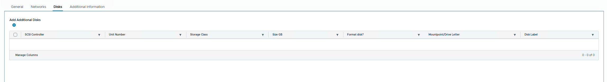

To add an additional disk:

1. Click the “**+**” (Add) button under "Add Additional Disks". This opens an "Add Additional Disks" dialog.
2. The following fields for the new disk should be filled in. Info icons provide additional context for these fields.

    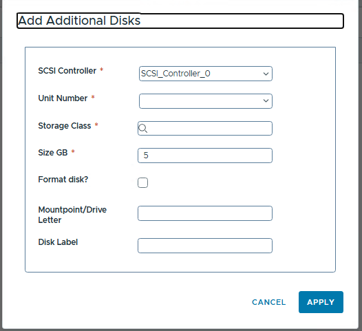

   - **SCSI Controller** (*Required*)
     - Select which virtual SCSI controller the disk is to be attached to (e.g.,    SCSI_Controller_0).
       - The default selection is appropriate for most cases. For many disks, they are spread    across controllers.

   - **Unit Number** (*Required*)
     - Choose the unit number (SCSI ID) for this disk on the controller (0-15, some reserved).
       - The dropdown shows available numbers. The lowest available should be picked. Duplicates    on the same controller cannot exist.

   - **Storage Class** (*Required*)
     - Select the storage policy for this new disk (e.g., gold, silver).
     - A different tier than the OS disk can be chosen if needed.

   - **Size GB** (*Required*)
     - Enter or select the size of the new disk in gigabytes (e.g., 10, 50, 100 GB).
     - Subject to allowed limits. Quotas should be kept in mind.

   - **Format disk?** (*Checkbox*)
     - Check this to automatically format and mount the disk.
     - **Windows:** Disk initialized, formatted (e.g., NTFS), and given a drive letter.
     - **Linux:** Disk formatted (e.g., ext4) and mounted at a given mount point.
     - If unchecked, it will need to be set up manually in the OS. This is checked for a    ready-to-use disk.

   - **Mountpoint/Drive Letter** (*Optional*)
     - If "Format disk?" is checked, a mount point (Linux) or drive letter (Windows) should be    specified.
     - **Windows:** An available drive letter should be entered (e.g., D, E). The colon should    not be included.
     - **Linux:** An absolute mount path should be entered (e.g., /data, /mnt/mydisk).

   - **Disk Label** (*Optional*)
     - Provide a label for the disk (volume label or a tag for identification, e.g.,    DatabaseFiles, Logs).
     - Helpful for identifying the disk. It should be kept short and special characters avoided.

3. After filling out the fields, click **Apply**. The disk will be listed.
4. Repeat by clicking “**+**” if more additional disks are needed.
5. Review the list of added disks. Mistaken entries can be removed.

**Notes:**

- The OS disk is already included with the VM template.
- Additional disks increase storage consumption and cost.
- Formatting and mounting adds a few minutes to provisioning time.
- The form or blueprint enforces limits (max disks, controller types).

Proceed after configuring disks. If "Create local account?" was checked, go to the Local Account tab.

---

#### Local Account Tab (VM Request)

*(This tab is only visible if “Create local account?” on the General tab was checked.)*

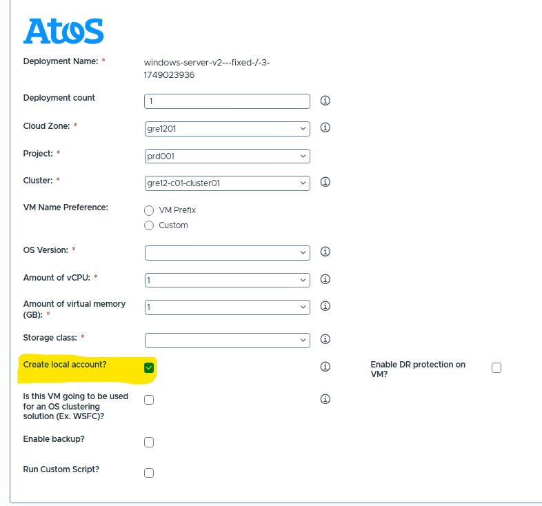

This tab is where details for the local user account to be created on the VM are provided.

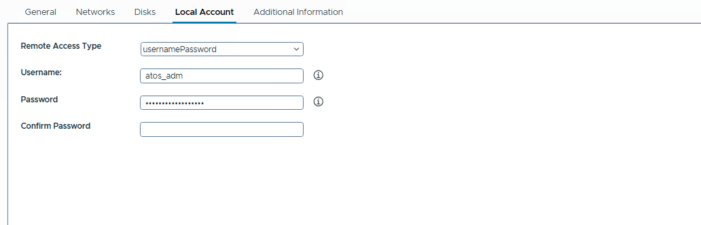

**Fields on the Local Account tab:**

- **Remote Access Type**
  - Choose the type of credentials. Example: usernamePassword.
  - The dropdown offers:
    - usernamePassword: Create a user with a password (standard for Windows/Linux).
    - sshKey: (Linux) Provide an SSH public key for key-based authentication.
  - The appropriate type should be selected. usernamePassword is common. The info icon explains options.

- **Username** (*Required if creating account*)
  - Enter the desired username for the new local account.
  - **Guidelines:**
    - Spaces and special characters should be avoided (use alphanumeric, underscores, hyphens if allowed).
    - Names that already exist by default (e.g., Administrator, root) should not be used.
    - Example: atos_adm, jdoe_admin.
    - The info icon should be checked for length requirements or other naming conventions.

- **Password** (*Required if creating account*)
  - Enter a password for the new account (masked field).
  - **A strong password should be chosen:**
    - At least 8 characters, mix of uppercase, lowercase, numbers, special characters (check info icon for OS policy or specific complexity rules).
    - Simple passwords should not be used.
    - This password should be remembered or stored securely.

- **Confirm Password** (*Required*)
  - Re-enter the same password to confirm. It must match the Password field.

**Additional considerations:**

- The account is added to the Administrators group (Windows) or given sudo privileges (Linux), as defined in the blueprint.
- If the blueprint allows SSH keys (Linux), fields differ (e.g., a field to paste an SSH public key).

Once done, if "Run Custom Script?" was checked, proceed to the Custom Script tab. Otherwise, move to Additional Information.

---

#### Custom Script Tab (VM Request)

*(This tab is only visible if “Run Custom Script?” on the General tab was checked.)*
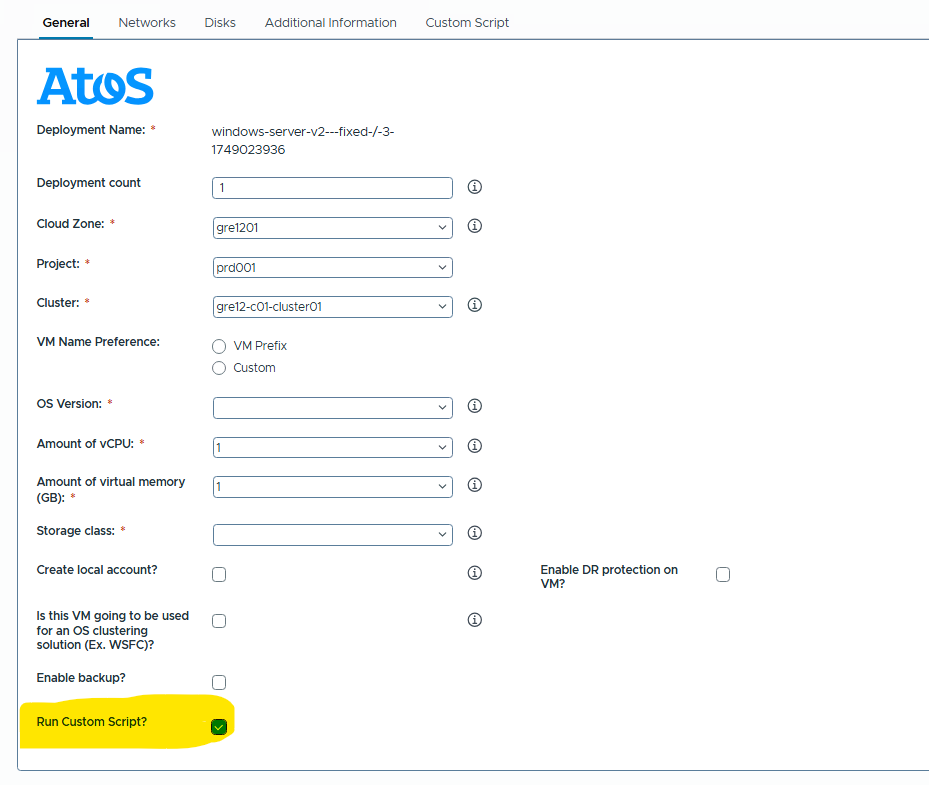

This tab is where a script to execute on the VM after provisioning for post-deployment automation is provided. Use with caution.

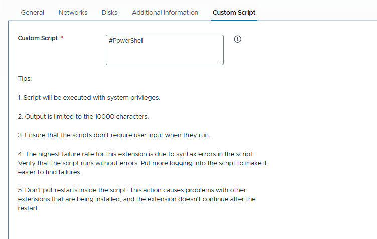

**Field on the Custom Script tab:**

- **Custom Script** (*Required if the tab is visible*)
  - A large text box to enter or paste the script code.
  - **Windows VMs:** PowerShell. A hint like `#PowerShell` is shown.

        Example PowerShell:
        ```powershell
        #PowerShell
        # Install IIS Web Server
        Install-WindowsFeature -name Web-Server -IncludeManagementTools
        ```
    - **Linux VMs:** A shell script (e.g., bash). Start with a shebang like `#!/bin/bash`.
        Example Bash:

        #!/bin/bash
        apt-get update -y
        apt-get install -y apache2

    **Tips / Guidelines for Custom Script (displayed on the tab or via an info icon):**
    - **Privileges:** The script executes with system privileges (administrator/root).
    - **Output Limit:** Captured output is limited (e.g., to 10,000 characters). Output should be kept concise or logged to a file within the VM.
    - **No User Input:** Scripts must run unattended and not require user input (silent/forced parameters should be used).
    - **Syntax Errors:** The most common failure cause. The script should be tested and syntax double-checked.
    - **No Restarts:** Rebooting the VM from the script should be avoided, as it can interrupt provisioning.

    **Providing the Script:**
    - The script should be typed or pasted. Correct formatting must be ensured.
    - If it's decided not to use a script, go back to the General tab and uncheck "Run Custom Script?".

**Important:**
To ensure the safety and stability of provisioned VMs, certain commands and scripting patterns are **forbidden** in custom scripts.
Scripts containing any of the following patterns will be **blocked** and cannot be used.

---

##### Linux (Bash) – Forbidden Patterns

| Purpose                | Regex / Pattern to Block                                   |
|------------------------|------------------------------------------------------------|
| Delete critical files  | `rm\s+-rf\s+/`                                             |
| Delete all             | `rm\s+-rf\s+\*`                                            |
| Shell fork bombs       | `:\s*\(\s*\)\s*{\s*:\s*\|\s*:\s*;?\s*}`                    |
| Shutdown/reboot        | `shutdown`, `reboot`, `halt`, `poweroff`                   |
| Users/passwd changes   | `useradd`, `userdel`, `passwd`, `chpasswd`                 |
| Cron modification      | `crontab\s+-[er]`                                          |
| Kernel/module changes  | `modprobe`, `rmmod`, `insmod`                              |
| Downloads (optional)   | `curl\s+`, `wget\s+`, `nc\s+`, `ncat`, `ftp`, `scp`        |
| Sudo usage             | `sudo\s+`                                                  |
| Mounting disks         | `mount\s+`, `umount\s+`                                    |

---

##### Windows (PowerShell) – Forbidden Patterns

| Purpose                    | Regex / Pattern to Block                                                |
|----------------------------|------------------------------------------------------------------------|
| User deletion/changes      | `Remove-LocalUser`, `Set-LocalUser`, `net user`                         |
| Group changes              | `Add-LocalGroupMember`, `net localgroup`                                |
| Shutdown/reboot            | `Stop-Computer`, `Restart-Computer`, `shutdown`                         |
| Deleting system files      | `Remove-Item\s+C:\\`, `Remove-Item\s+.*\.exe`                           |
| Registry editing           | `New-ItemProperty`, `Remove-ItemProperty`, `reg add`, `reg delete`      |
| Downloads                  | `Invoke-WebRequest`, `Invoke-Expression`, `Start-BitsTransfer`          |
| Injection                  | `iex\s+`, `FromBase64String`, `[System.Reflection]`                     |
| Scripting risks            | `Start-Process`, `powershell.exe`, `schtasks`, `taskkill`, `mshta`, `wscript` |

---

*If your script contains any of the above forbidden patterns, it will not be accepted. Please review your script carefully before submission.*

Once the script is entered, proceed to the Additional Information tab.

---

#### Additional Information Tab (VM Request)

This tab collects extra metadata for classification, support, and record-keeping. Filling these out accurately helps in managing the VM post-deployment. Info icons next to fields provide specific examples or formatting requirements.
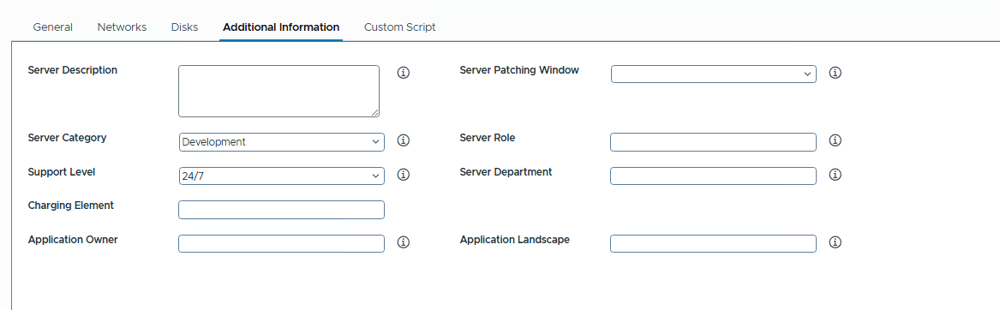
**Fields on the Additional Information tab:**

- **Server Description**
  - Free-form text describing the server’s purpose or notes (e.g., “Development web server for Acme app, used by QA.”).
  - Helpful for approvers and IT staff. This field is optional but good to fill.

- **Server Patching Window**
  - Specify when the server can be patched. The dropdown offers predefined windows (e.g., “Sundays 2am-4am”, “24/7”, “Monthly”).
  - One that fits the VM’s maintenance requirements should be chosen. The info icon describes usage.

- **Server Category**
  - Categorize the server by usage (e.g., Production, Development, Test, QA). Example: Development.
  - Important for context (support levels, SLAs).

- **Server Role**
  - The server's function (e.g., “Web Server”, “Database Server”, “Application Server”).
  - This field is free text or a dropdown. Be specific but concise (e.g., “Web Server (IIS)”).

- **Support Level**
  - IT support level required (e.g., “24/7”, “Business Hours”, “Best Effort”). Example: 24/7.
  - Matches the VM's importance. The info icon details what each level entails.

- **Server Department**
  - Department this server belongs to (e.g., Finance, HR, IT, Marketing).
  - Used for tracking or chargeback. This field is free text or a dropdown.

- **Charging Element**
  - Cost center, budget code, or internal billing code for the VM’s resources (e.g., IT-DEV-12345, CC100567).
  - This field is free text. The info icon should be checked for format. This is required by policy.

- **Application Owner**
  - Name or identifier of the application owner (person or team responsible for the application on the VM, e.g., Jane Smith, Finance IT Team).
  - Helps IT know who to contact.

- **Application Landscape**
  - Broader environment or group of applications this VM is part of (e.g., project code, service name like CustomerPortal, AppName-Dev).
  - The info icon should be checked for clarification. Connects VM to a bigger picture.

As many fields as possible should be filled out. They provide important context for approvals and ongoing management.

---

#### Submitting the Request (VM Request)

Once all relevant tabs are filled (General, Networks, Disks, Local Account if used, Custom Script if used, Additional Information), the request is ready for submission.

At the bottom of the form (visible on any tab):

- Click **Submit** to send the request for processing.
- Click **Cancel** to discard the request.

**After clicking Submit:**

1. **Approval (if applicable):** If approvals are needed, the request status will be “Pending Approval.”
2. **Provisioning:** If auto-approved or once approved, the deployment begins.
3. **Monitoring:** The deployment status can be monitored in the Service Broker interface (under “Deployments” or “Requests”).
4. **Completion:** Once completed, the VM is available. Details (e.g., IP address) will be received or can be found in the deployments list. The credentials set (if any) are used to log in.

---

#### Example: Requesting a Development Web Server VM

This example illustrates filling out the form for a Windows Server 2019 VM as a development web server for the “Acme WebApp” project.

**Scenario:** Deploy a Windows Server 2019 VM, AcmeWebApp-DevWeb1, for development/QA, with an extra data disk and IIS installed via custom script.

1. **General Tab:**
    - **Deployment Name:** (System Generated, e.g., `BlueprintName-guid`)
    - **Deployment Count:** 1
    - **Cloud Zone:** DevZone1 (example)
    - **Project:** DEV-Project (example)
    - **Cluster:** ClusterA-Dev (example)
    - **VM Name Preference:** Custom (then "AcmeWebApp-DevWeb1" entered in the name field)
    - **OS Version:** Windows Server 2019
    - **Amount of vCPU:** 2 vCPU
    - **Amount of virtual memory:** 4 GB
    - **Storage class:** Standard
    - **Create local account?:** Checked (✓)
    - **Is VM used for OS clustering?:** Unchecked (✗)
    - **Enable backup?:** Unchecked (✗) (for this dev example)
    - **Enable DR protection?:** Unchecked (✗)
    - **Run Custom Script?:** Checked (✓)

2. **Networks Tab:**
    - **Allow setup same network?:** Unchecked (✗)
    - **Network Profile (NIC1):** Dev-Web-Network (example)
    - No additional NICs checked.
    - **SDN Microsegmentation:** (Example values)
        - **Customer:** (prefilled)
        - **Environment:** DEV
        - **Region:** US-East
        - **Zone:** Internal
        - **App Tier:** Web
        - **Application:** AcmeWebApp
        - **Trust Level:** Low
        - (Alternatively, "No Microsegmentation" checked if not needed/uncertain)

3. **Disks Tab:**
    - Click “**+**” Add.
    - **Add Additional Disks dialog:**
        - **SCSI Controller:** SCSI_Controller_0
        - **Unit Number:** 1
        - **Storage Class:** Standard
        - **Size GB:** 20
        - **Format disk?:** Checked (✓)
        - **Mountpoint/Drive Letter:** D
        - **Disk Label:** WebData
    - Click **Apply**.

4. **Local Account Tab:** (Visible)
    - **Remote Access Type:** usernamePassword
    - **Username:** dev_admin
    - **Password:** DevPassw0rd! (example, a secure one should be used)
    - **Confirm Password:** DevPassw0rd!

5. **Custom Script Tab:** (Visible)
    - **Custom Script text box:**

        #PowerShell
        Install-WindowsFeature -Name Web-Server -IncludeManagementTools

6. **Additional Information Tab:**
    - **Server Description:** “Web server for AcmeWebApp (dev environment). Used by QA for testing. IIS installed.”
    - **Server Patching Window:** Weekdays 9am-5pm (example)
    - **Server Category:** Development
    - **Server Role:** Web Server (IIS)
    - **Support Level:** Business Hours
    - **Server Department:** IT-Development
    - **Charging Element:** DEV12345 (example cost center)
    - **Application Owner:** Jane Doe (example QA lead)
    - **Application Landscape:** AcmeWebApp-Dev

7. **Submit the Request:**
    - All tabs should be quickly reviewed.
    - Click **Submit**.
    - Deployment progress is monitored as described in the [Submitting the Request (VM Request)](#submitting-the-request-vm-request) section.

---
---

### Manage Virtual Machine Security Groups

This guide explains the use of the "Manage Virtual Machine Security Groups" catalog item to associate or dissociate security groups with a Virtual Machine. This operation is performed as a Day 2 action on an existing VM. The form is a single page, titled "General". Info icons (i) next to fields provide additional guidance.

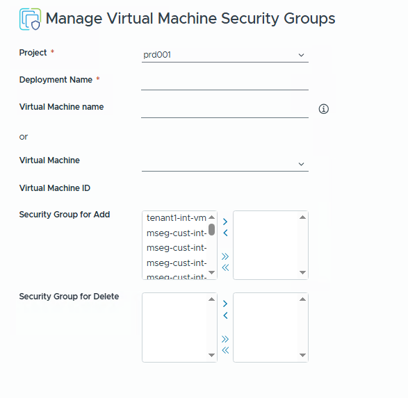

#### Form Fields

- **Project** (*Required*)
  - **Type:** Dropdown
  - **Description:** The Project under which the target Virtual Machine is managed is selected here. Available choices depend on user permissions. The correct project (e.g., `dbc2565a-05b5-4512-8225-60377cae6...`) must be selected.

- **Deployment Name** (*Required*)
  - **Type:** Text Input
  - **Description:**This name is **always generated by a script and is read-only.**
  - This name will be used to identify the **deployment**

- **Virtual Machine name** (*Optional*)
  - **Type:** Text Input
  - **Description:** The exact name of the Virtual Machine to be managed, as it appears in the virtual infrastructure, can be entered here. This field is one way to identify the VM. An info icon (i) provides guidance.

- **(or)**
  - **Description:** This text indicates an alternative method for selecting the VM is available below.

- **Virtual Machine** (*Optional*)
  - **Type:** Dropdown
  - **Description:** The target Virtual Machine is selected from a dynamically populated list. This is an alternative to typing the VM name. A loading icon (spinning circle) appears while the list is being fetched.

- **Virtual Machine ID** (*Read-only*)
  - **Type:** Text Input
  - **Description:** Displays the unique ID (Instance UUID) of the Virtual Machine. This field is automatically populated if a VM is selected from the `Virtual Machine` dropdown or if the system successfully identifies the VM from the `Virtual Machine name` input. A loading icon appears while this is being fetched.

- **Security Group for Add** (*Optional*)
  - **Type:** Dual List
  - **Description:** This interface is used to select security groups to **add** to the Virtual Machine. Available security groups are listed on the left. The desired group(s) are selected and the `>` or `>>` buttons are used to move them to the right (selected for addition) side. Use `<` or `<<` to move them back. A loading icon appears while the list of available groups is being fetched.

- **Security Group for Delete** (*Optional*)
  - **Type:** Dual List
  - **Description:** This interface is used to select security groups to **remove** from the Virtual Machine. Security groups currently associated with the selected VM are listed on the left. The group(s) to be removed are selected and moved to the right (selected for deletion) side. A loading icon appears while the list of assigned groups is being fetched.

#### Submitting the Request

1. The `Project` and `Deployment Name` fields are filled in.
2. The target Virtual Machine is identified by either entering its `Virtual Machine name` or selecting it from the `Virtual Machine` dropdown. Wait for the `Virtual Machine ID` to populate.
3. The `Security Group for Add` dual list is used to select any new security groups to be assigned to the VM.
4. The `Security Group for Delete` dual list is used to select any existing security groups to be removed from the VM.
5. Selections are reviewed.
6. **Submit** is clicked at the bottom of the form.
7. The system will then attempt to apply the selected security group changes to the specified Virtual Machine. The request status can be monitored in the "Deployments" or "Requests" section.

---
---

### Manage Security Policy Firewall Rules

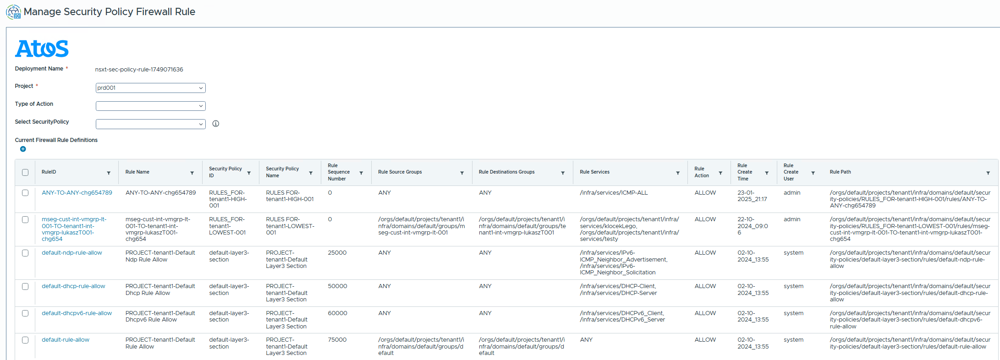

This guide explains the use of the "Manage Security Policy Firewall Rule" catalog item. This allows for the addition, modification, or removal of rules within an existing NSX Security Policy. The form is a single page, titled "Manage Firewall Rule". An Atos image or logo is displayed at the top. Info icons (i) next to fields provide additional guidance.

#### Form Fields

- **Deployment Name** (*Read-only*)
  - **Type:** Text Input
  - **Description:** Displays a system-generated name for this management deployment task. This field is not editable. A loading icon (spinning circle) appears if the name is being generated. If it fails to generate, an error "This field cannot be empty" is shown, but it is auto-filled. This name identifies the specific request for managing the firewall rule.

- **Project** (*Required*)
  - **Type:** Dropdown
  - **Description:** The Project associated with the Security Policy to be managed is selected here. Available choices depend on user permissions (e.g., `dbc2565a-05b5-4512-8225-60377cae6...`).

- **Type of Action** (*Optional*)
  - **Type:** Dropdown
  - **Description:** The action to be performed is selected:
    - **ADD:** To create a new firewall rule in a security policy.
    - **MODIFY:** To change an existing firewall rule.
    - **REMOVE:** To delete an existing firewall rule.
  - The selection here determines which subsequent fields become visible and required.

- **Select SecurityPolicy** (*Optional*)
  - **Type:** Dropdown
  - **Description:** The security policy to work with is chosen here. The signpost states: "Select Security Policy: Use this dropdown to choose a security policy that will be applied. Each policy contains specific rules and configurations that govern the security settings. Review each policy’s details to ensure it matches the requirements of the resource or environment being secured." The list of security policies is dynamically populated. A loading icon appears. An info icon (i) is present.

- **Change Number** (*Optional, conditionally visible*)
  - **Type:** Text Input
  - **Description:** A change management or tracking number is entered here.
  - **Visibility:** This field is visible if `Type of Action` is "ADD".

- **Select Rule** (*Optional, conditionally visible*)
  - **Type:** Dropdown
  - **Description:** An existing rule within the chosen `Select SecurityPolicy` is selected here. The list of rules is dynamically populated based on the selected security policy.
  - **Visibility:** This field is visible if `Type of Action` is "MODIFY" or "REMOVE".

- **New Rule Position** (*Optional, conditionally visible*)
  - **Type:** Dropdown
  - **Description:** The position (sequence number) for a new or modified rule is specified here. The signpost states: "New Rule Position: Specify the position where the new rule should be inserted within the existing set. If left blank, the rule will be automatically placed before the last one. Enter a number to define a specific position in the sequence." Available options include "Highest Priority", "High Priority", etc. The default value is dynamically determined.
    - **Visibility:** This field is visible if `Type of Action` is "ADD" or "MODIFY".

- **Customer Source Name** (*Optional, conditionally visible*)
  - **Type:** Text Input
  - **Description:** A custom name related to the source of the traffic is entered here.
  - **Visibility:** Visible when `Type of Action` is "ADD" under certain conditions.

- **Security Group for Source Traffic** (*Optional, conditionally visible*)
  - **Type:** Dual List
  - **Description:** Security Groups that will define the source of the traffic for a new rule are selected here. The signpost states: "Security Group for Source Traffic: Use this dual-list interface to manage security groups...". List is dynamically populated.
  - **Visibility:** This field is visible if `Type of Action` is "ADD".

- **Security Group for Source Traffic ADD** (*Optional, conditionally visible*)
  - **Type:** Dual List
  - **Description:** Security Groups to be **added** to the source criteria of an existing rule are selected here. List is dynamically populated.
  - **Visibility:** This field is visible if `Type of Action` is "MODIFY".

- **Security Group for Source Traffic DEL** (*Optional, conditionally visible*)
  - **Type:** Dual List
  - **Description:** Security Groups to be **removed** from the source criteria of an existing rule are selected here. List is dynamically populated based on the selected rule.
  - **Visibility:** This field is visible if `Type of Action` is "MODIFY".

- **Customer Destination Name** (*Optional, conditionally visible*)
  - **Type:** Text Input
  - **Description:** A custom name related to the destination of the traffic is entered here.
  - **Visibility:** Visible when `Type of Action` is "ADD" under certain conditions.

- **Security Group for DestinationTraffic** (*Optional, conditionally visible*)
  - **Type:** Dual List
  - **Description:** Security Groups that will define the destination of the traffic for a new rule are selected here. The signpost states: "Security Group for DestinationTraffic: This dual-list interface allows selection of destination security groups...". List is dynamically populated.
  - **Visibility:** This field is visible if `Type of Action` is "ADD".

- **Security Group for DestinationTraffic ADD** (*Optional, conditionally visible*)
  - **Type:** Dual List
  - **Description:** Security Groups to be **added** to the destination criteria of an existing rule are selected here. List is dynamically populated.
  - **Visibility:** This field is visible if `Type of Action` is "MODIFY".

- **Security Group for Destination Traffic DEL** (*Optional, conditionally visible*)
  - **Type:** Dual List
  - **Description:** Security Groups to be **removed** from the destination criteria of an existing rule are selected here. List is dynamically populated based on the selected rule.
  - **Visibility:** This field is visible if `Type of Action` is "MODIFY".

- **List of Ports for Rule** (*Optional, conditionally visible*)
  - **Type:** Data Grid
  - **Description:** Network ports and protocols (type: TCP/UDP, source port, destination port) for the rule are specified here. When modifying, it pre-populates.
  - **Visibility:** This field is visible if `Type of Action` is "ADD" or "MODIFY".
  - **Constraints:** `type` must be 'TCP' or 'UDP'. Ports 0-65535.

- **List of Services for Rule** (*Optional, conditionally visible*)
  - **Type:** Dual List
  - **Description:** Predefined NSX services (e.g., HTTP, SSH) for the rule are selected here. List is dynamically populated.
  - **Visibility:** This field is visible if `Type of Action` is "ADD" or "MODIFY".

- **Action** (*Optional, conditionally visible*)
  - **Type:** Dropdown
  - **Description:** The firewall action (ALLOW, DROP, REJECT) is specified here. The signpost states: "Action: Use this dropdown to select the action to be taken...". Defaults to current action when modifying.
  - **Visibility:** This field is visible if `Type of Action` is "ADD" or "MODIFY".

- **Current Firewall Rule Definitions** (*Read-only*)
  - **Type:** Data Grid
  - **Description:** Displays details of existing rules within the selected `Security Policy` (RuleID, Rule Name, Policy ID, Policy Name, Sequence Number, Source Groups, Destination Groups, Services, Action, Create Time, Create User, Rule Path). A loading icon (spinning circle) is shown while data is being fetched.
  - **Visibility:** Always visible once a `Security Policy` is selected.

#### Submitting the Request

1. The `Project` is selected. `Deployment Name` auto-fills if applicable.
2. The `Type of Action` is chosen.
3. The `Security Policy` is selected. Wait for `Current Firewall Rule Definitions` to load.
4. **If ADDing:** `Change Number` (optional), `New Rule Position`, source/destination criteria (names and/or security groups), services/ports, and `Action` are filled in.
5. **If MODIFYing:** The `Select Rule` is selected. Its position, source/destination groups, services/ports, and `Action` are adjusted as needed.
6. **If REMOVing:** The `Select Rule` to remove is selected.
7. All inputs are carefully reviewed.
8. **Submit** is clicked.
9. The request status is monitored.

---
---

### Manage Security Groups

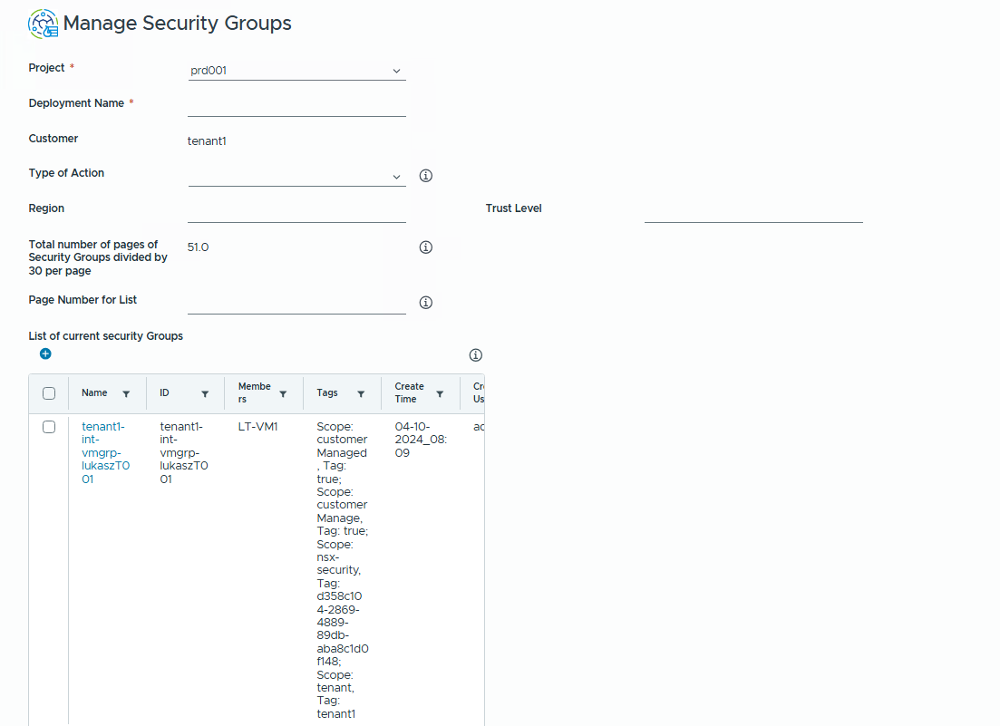
This guide explains the use of the "Manage Security Groups" catalog item to create (ADD), modify (MODIFY), or delete (REMOVE) NSX Security Groups. The form is a single page, titled "General". Info icons (i) next to fields provide additional guidance.

#### Form Fields

- **Project** (*Required*)
  - **Type:** Dropdown
  - **Description:** The Project for this operation is selected (e.g., `dbc2565a-05b5-4512-8225-60377cae6...`). A loading icon appears.

- **Deployment Name** (*Required*)
  - **Type:** Text Input
  - **Description:** A descriptive name for this task is entered (e.g., "Create-Web-Tier-SG"). This name identifies the specific request for managing the security group. Max 900 characters.

- **Customer** (*Read-only*)
  - **Type:** Text Input
  - **Description:** Displays the customer/tenant, auto-populated. A loading icon appears.

- **Type of Action** (*Optional*)
  - **Type:** Dropdown
  - **Description:** The action is selected: ADD (new group), MODIFY (existing group), REMOVE (delete group). The signpost provides guidance. An info icon is present.

- **Select Security Group For Delete** (*Optional, conditionally visible*)
  - **Type:** Dropdown
  - **Description:** An existing security group to delete is chosen. The signpost advises caution. The list is paginated (use `Page Number for Modification`).
  - **Visibility:** Visible if `Type of Action` is "REMOVE".

- **Customer Security Group Suffix** (*Optional, conditionally visible*)
  - **Type:** Text Input
  - **Description:** Suffix for the new security group name. The signpost advises using only alphanumeric characters.
  - **Visibility:** Visible if `Type of Action` is "ADD".
  - **Constraints:** Alphanumeric, no spaces/special characters. Pattern: `^(?!.*\\s)[a-zA-Z0-9]+$`.

- **Security Group Description** (*Optional, conditionally visible*)
  - **Type:** Text Input
  - **Description:** Brief description for the new security group. The signpost advises its purpose.
  - **Visibility:** Visible if `Type of Action` is "ADD".
  - **Constraints:** Alphanumeric. Pattern: `^(?!.*\\s)[a-zA-Z0-9]+$`.

- **Membership Criteria** (*Static Text, conditionally visible*)
  - **Description:** Label indicating the following tag fields define membership for a new group.
  - **Visibility:** Visible if `Type of Action` is "ADD".

- **Region** (*Optional*)
  - **Type:** Text Input
  - **Description:** 'Region' tag value for membership criteria (ADD) or direct tagging (MODIFY).
  - **Constraints:** Alphanumeric. Pattern: `^(?!.*\\s)[a-zA-Z0-9]+$`.

- **Environment** (*Optional, conditionally visible*)
  - **Type:** Text Input
  - **Description:** 'Environment' tag value.
  - **Visibility:** Visible if `Type of Action` is "ADD".
  - **Constraints:** Alphanumeric. Pattern: `^(?!.*\\s)[a-zA-Z0-9]+$`.

- **Zone** (*Optional, conditionally visible*)
  - **Type:** Text Input
  - **Description:** 'Zone' tag value.
  - **Visibility:** Visible if `Type of Action` is "ADD".
  - **Constraints:** Alphanumeric. Pattern: `^(?!.*\\s)[a-zA-Z0-9]+$`.

- **Trust Level** (*Optional*)
  - **Type:** Text Input
  - **Description:** 'Trust Level' tag value.
  - **Constraints:** Alphanumeric. Pattern: `^(?!.*\\s)[a-zA-Z0-9]+$`.

- **App Tier** (*Optional, conditionally visible*)
  - **Type:** Text Input
  - **Description:** 'App Tier' tag value.
  - **Visibility:** Visible if `Type of Action` is "ADD".
  - **Constraints:** Alphanumeric. Pattern: `^(?!.*\\s)[a-zA-Z0-9]+$`.

- **Application** (*Optional, conditionally visible*)
  - **Type:** Text Input
  - **Description:** 'Application' tag value.
  - **Visibility:** Visible if `Type of Action` is "ADD".
  - **Constraints:** Alphanumeric. Pattern: `^(?!.*\\s)[a-zA-Z0-9]+$`.

- **Select Security Group For Modify** (*Optional, conditionally visible*)
  - **Type:** Dropdown
  - **Description:** An existing security group to modify is chosen. The signpost advises on updating configurations. The list is paginated.
  - **Visibility:** Visible if `Type of Action` is "MODIFY".

- **Total number of pages of Security Groups divided by 30 per page** (*Read-only*)
  - **Type:** Text Input
  - **Description:** Displays total pages of security groups (30 per page). The signpost explains this. An info icon is present. Auto-populated.

- **Page Number for Modification** (*Optional, conditionally visible*)
  - **Type:** Text Input
  - **Description:** Page number for browsing security groups for MODIFY or REMOVE actions. The signpost explains its use.
  - **Visibility:** Visible if `Type of Action` is "MODIFY" or "REMOVE".

- **Security Group Tags** (*Data Grid, conditionally visible*)
  - **Type:** Data Grid
  - **Description:** View/modify tags directly applied to the selected security group. Columns: `tag`, `scope`. Pre-populated for selected group.
  - **Visibility:** Visible if `Type of Action` is "MODIFY".

- **Security Group Membership Criteria - allowed Scope ["application", "environment", "zone", "appTier"]** (*Data Grid, conditionally visible*)
  - **Type:** Data Grid
  - **Description:** View/modify membership criteria (tag-based expressions) for the selected group. Allowed scopes are listed. Columns: `tag`, `scope`. Pre-populated.
  - **Visibility:** Visible if `Type of Action` is "MODIFY".

- **Page Number for List** (*Optional*)
  - **Type:** Text Input
  - **Description:** Page number to navigate the `List of current security Groups` data grid. The signpost explains its use. An info icon is present. A loading icon appears.

- **List of current security Groups** (*Data Grid*)
  - **Type:** Data Grid
  - **Description:** Displays existing security groups (Name, ID, Members, Tags, Create Time, Create User, Path). The signpost explains its purpose. A loading icon (spinning circle) is shown.
  - **Visibility:** Always visible, updates based on `Page Number for List`.

#### Submitting the Request

1. `Project` is selected, `Deployment Name` is entered.
2. `Type of Action` is chosen.
3. **If ADD:** `Customer Security Group Suffix`, `Security Group Description`, and membership criteria tags (`Region`, `Environment`, etc.) are entered.
4. **If MODIFY:** `Page Number for Modification` is used if needed, group is selected from `Select Security Group For Modify`. `Security Group Tags` and/or `Security Group Membership Criteria` data grids are modified.
5. **If REMOVE:** `Page Number for Modification` is used if needed, group is selected from `Select Security Group For Delete`.
6. Inputs are reviewed. `List of current security Groups` (navigating with `Page Number for List`) is used for reference.
7. **Submit** is clicked.
8. Request status is monitored.

---
---

### Manage NSX-T Tags for a VM

This guide explains the use of the "Manage NSX-T Tags for VM" catalog item to view and update NSX-T specific tags and view other existing tags on a Virtual Machine. This is a Day 2 operation. The form is a single page, titled "General".
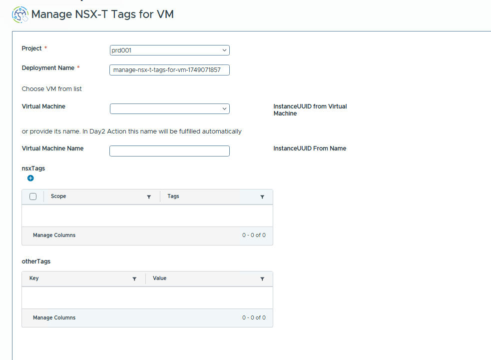

#### Form Fields

- **Project** (*Required*)
  - **Type:** Dropdown
  - **Description:** The Project under which the target Virtual Machine is managed is selected.

- **Deployment Name** (*Required, Read-only*)
  - **Type:** Text Input
  - **Description:** Name for this management task. This is system-generated (e.g., based on catalog item name and a unique ID) and read-only. It identifies this specific tagging operation. Max 900 characters.

- **Choose VM from list** (*Static Text*)
  - **Description:** Informational text.

- **Virtual Machine** (*Optional*)
  - **Type:** Dropdown
  - **Description:** The target Virtual Machine is selected from a dynamically populated list.

- **InstanceUUID from Virtual Machine** (*Read-only*)
  - **Type:** Text Input
  - **Description:** Displays the UUID of the VM selected from the dropdown. Auto-populated.

- **or provide its name. In Day2 Action this name will be fulfilled automatically** (*Static Text*)
  - **Description:** Informational text about alternative VM selection.

- **Virtual Machine Name** (*Optional*)
  - **Type:** Text Input
  - **Description:** The name of the Virtual Machine is entered here.

- **InstanceUUID From Name** (*Read-only*)
  - **Type:** Text Input
  - **Description:** Displays the UUID if VM is found by name. Auto-populated.

- **nsxTags** (*Data Grid, Editable*)
  - **Type:** Data Grid
  - **Description:** NSX-T specific tags are managed here. Pre-populated with existing NSX-T tags. Tags can be added, modified, or removed.
  - **Columns:**
    - `Scope`: Must start with "nsx" (Pattern: `^nsx.*$`).
    - `Tags`: The tag string/value.

- **otherTags** (*Data Grid, Read-only*)
  - **Type:** Data Grid
  - **Description:** Displays other (non-NSX-T) tags on the VM for informational purposes.
  - **Columns:**
    - `Key`: Tag key.
    - `Value`: Tag value.

#### Submitting the Request

1. `Project` is selected. `Deployment Name` will be auto-populated.
2. VM is identified via `Virtual Machine` dropdown or `Virtual Machine Name` input. Wait for UUID to populate.
3. `nsxTags` and `otherTags` grids will load.
4. In `nsxTags` grid: Rows are added, modified, or deleted to manage NSX-T tags.
5. Changes are reviewed.
6. **Submit** is clicked.
7. Request status is monitored.

---
---

### Manage an AVI Load Balancer

This guide explains the use of the "Manage AVI Load Balancer" catalog item for Day 2 operations like adding servers to a pool, changing LB algorithms, managing virtual service pools, or changing health monitors. The form is a single page, titled "General". An Atos image or logo is at the top.

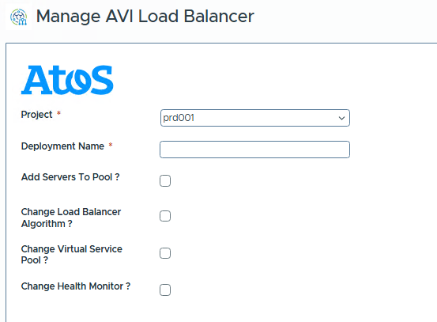

#### Form Fields

- **Project** (*Required*)
  - **Type:** Dropdown
  - **Description:** The Project for the AVI Load Balancer is selected (e.g., `dbc2565a-05b5-4512-8225-60377cae6...`). A loading icon appears.

- **Deployment Name** (*Required*)
  - **Type:** Text Input
  - **Description:** Name for this management task (e.g., "Add-Servers-WebApp-Pool"). This identifies the specific request for managing the load balancer. Max 900 characters.

- **Add Servers To Pool ?** (*Checkbox, Optional*)
  - **Type:** Checkbox
  - **Description:** Check to add new backend servers to an existing pool.

- **Pool** (*Dropdown, Conditionally Visible/Required*)
  - **Type:** Dropdown
  - **Description:** The existing AVI Server Pool for modifications is selected. List is dynamically populated.
  - **Visibility:** Visible and required if any of the management checkboxes (`Add Servers To Pool ?`, `Change Load Balancer Algorithm ?`, etc.) are checked.

- **Servers List** (*Array of Text Inputs, Conditionally Visible*)
  - **Type:** Array (multiple text inputs)
  - **Description:** IP addresses/hostnames of servers to add to the selected `Pool` are manually entered.
  - **Visibility:** Visible if `Add Servers To Pool ?` is checked.

- **Virtual Machine List** (*Multi-Select List, Conditionally Visible*)
  - **Type:** Multi-Select List / Dual List
  - **Description:** Existing VMs (resolving to IPs) to add to the selected `Pool` are chosen. List is dynamically populated.
  - **Visibility:** Visible if `Add Servers To Pool ?` is checked.

- **Change Load Balancer Algorithm ?** (*Checkbox, Optional*)
  - **Type:** Checkbox
  - **Description:** Check to modify the load balancing algorithm for a pool.

- **Load Balancer Algorithm** (*Dropdown, Conditionally Visible/Required*)
  - **Type:** Dropdown
  - **Description:** The new LB algorithm for the selected `Pool` is selected. It defaults to the pool's current algorithm. Options: `LB_ALGORITHM_ROUND_ROBIN`, `LB_ALGORITHM_LEAST_CONNECTIONS`, etc.
  - **Visibility:** Visible and required if `Change Load Balancer Algorithm ?` is checked.

- **Change Virtual Service Pool ?** (*Checkbox, Optional*)
  - **Type:** Checkbox
  - **Description:** Check to change the server pool associated with a Virtual Service.

- **Virtual Service** (*Dropdown, Conditionally Visible/Required*)
  - **Type:** Dropdown
  - **Description:** The AVI Virtual Service whose pool is to be changed is selected. List is dynamically populated.
  - **Visibility:** Visible and required if `Change Virtual Service Pool ?` is checked.

- **Change Health Monitor ?** (*Checkbox, Optional*)
  - **Type:** Checkbox
  - **Description:** Check to change health monitor(s) for a pool.

- **Health Monitor** (*Dropdown, Conditionally Visible/Required*)
  - **Type:** Dropdown
  - **Description:** Health monitor(s) for the selected `Pool` are selected. It shows current monitor(s). List is dynamically populated.
  - **Visibility:** Visible and required if `Change Health Monitor ?` is checked.

#### Submitting the Request

1. `Project` is selected, `Deployment Name` is entered.
2. The box(es) for the desired action(s) are checked: `Add Servers To Pool ?`, `Change Load Balancer Algorithm ?`, `Change Virtual Service Pool ?`, `Change Health Monitor ?`.
3. **If adding servers:** `Add Servers To Pool ?` is checked, `Pool` is selected, servers are provided via `Servers List` and/or `Virtual Machine List`.
4. **If changing LB algorithm:** `Change Load Balancer Algorithm ?` is checked, `Pool` is selected, `Load Balancer Algorithm` is chosen.
5. **If changing VS pool:** `Change Virtual Service Pool ?` is checked, `Virtual Service` is selected, new `Pool` is selected.
6. **If changing Health Monitor:** `Change Health Monitor ?` is checked, `Pool` is selected, `Health Monitor`(s) are chosen.
7. Selections are reviewed.
8. **Submit** is clicked.
9. Request status is monitored.

---
---

### Create NSX Services

This guide explains the use of the "Create NSX Services" catalog item to define new, custom services in NSX for use in firewall rules. A service can have multiple entries, include nested services, or custom ports. The form is a single page, titled "General". Info icons (i) next to fields provide guidance.

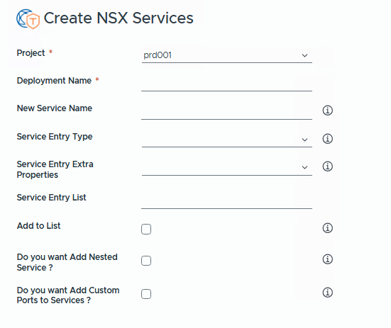

#### Form Fields

- **Project** (*Required*)
  - **Type:** Dropdown
  - **Description:** The Project for this NSX Service is selected (e.g., `dbc2565a-05b5-4512-8225-60377cae6...`). A loading icon appears.

- **Deployment Name** (*Required*)
  - **Type:** Text Input
  - **Description:** Name for this deployment task (e.g., "Create-CustomApp-Service"). This identifies the specific request for creating the NSX service. Max 900 characters.

- **New Service Name** (*Required*)
  - **Type:** Text Input
  - **Description:** Name for the new NSX service. The signpost explains uniqueness and descriptiveness. An info icon is present.

- **Service Entry Type** (*Optional*)
  - **Type:** Dropdown
  - **Description:** Type for an individual service entry is selected (e.g., `L4PortSetEntry`, `ICMPTypeEntry`). The signpost explains its purpose. List is dynamically populated. A loading icon appears. An info icon is present.

- **Service Entry Extra Properties** (*Optional, dependent on `Service Entry Type`*)
  - **Type:** Dropdown
  - **Description:** Specific properties for the chosen `Service Entry Type` are selected (e.g., ALG types, ICMP types). The signpost explains this. List is dynamically populated. A loading icon appears. An info icon is present.

- **Service Entry List** (*Text Field, Read-only*)
  - **Type:** Text Input
  - **Description:** Displays the list of service entries added so far via `Add to List` action. A loading icon appears as it updates.

- **Add to List** (*Checkbox*)
  - **Type:** Checkbox
  - **Description:** Check to add the current `Service Entry Type` and `Service Entry Extra Properties` to `Service Entry List`. The signpost explains its use. A loading icon appears. An info icon is present.

- **Do you want Add Nested Service ?** (*Checkbox, Optional*)
  - **Type:** Checkbox
  - **Description:** Check to include other existing NSX services in this new service. The signpost explains this. An info icon is present.

- **Nested Service List** (*Dual List, Conditionally Visible*)
  - **Type:** Dual List
  - **Description:** Existing NSX services to nest are selected. The signpost explains its use. List is dynamically populated.
  - **Visibility:** Visible if `Do you want Add Nested Service ?` is checked.

- **Do you want Add Custom Ports to Services ?** (*Checkbox, Optional*)
  - **Type:** Checkbox
  - **Description:** Check to define specific L4 ports (TCP/UDP) for this service. The signpost explains this. An info icon is present.

- **List of Ports for Services** (*Data Grid, Conditionally Visible*)
  - **Type:** Data Grid
  - **Description:** Custom L4 port entries are defined here. The signpost explains its use.
  - **Visibility:** Visible if `Do you want Add Custom Ports to Services ?` is checked.
  - **Columns:**
    - `type`: Protocol (TCP/UDP). Pattern: `^(TCP|UDP)$`.
    - `source`: Source port (0-65535). Pattern for single port: `^([0-9]|[1-9][0-9]{1,3}|[1-5][0-9]{4}|6[0-4][0-9]{3}|65[0-4][0-9]{2}|655[0-2][0-9]|6553[0-5])$`.
    - `destination`: Destination port (0-65535). Pattern similar to source.

#### Submitting the Request

1. `Project` is selected, `Deployment Name` is entered.
2. `New Service Name` is entered.
3. **To add specific entries:** `Service Entry Type` and `Service Entry Extra Properties` are selected, then `Add to List` is checked. Repeat as needed.
4. **To add nested services:** `Do you want Add Nested Service ?` is checked, then `Nested Service List` is used.
5. **To add custom ports:** `Do you want Add Custom Ports to Services ?` is checked, then `List of Ports for Services` data grid is used.
6. At least one service definition must be provided. Inputs are reviewed.
7. **Submit** is clicked.
8. Request status is monitored.

---
---

### Create an AVI Load Balancer

This guide explains the use of the "Create AVI Load Balancer" catalog item to provision a new AVI Load Balancer, including its VIP, server pool, backend servers, LB algorithm, and health monitor. The form is a single page, titled "General". Info icons (i) next to fields provide guidance. Required fields are marked with a red asterisk (*).
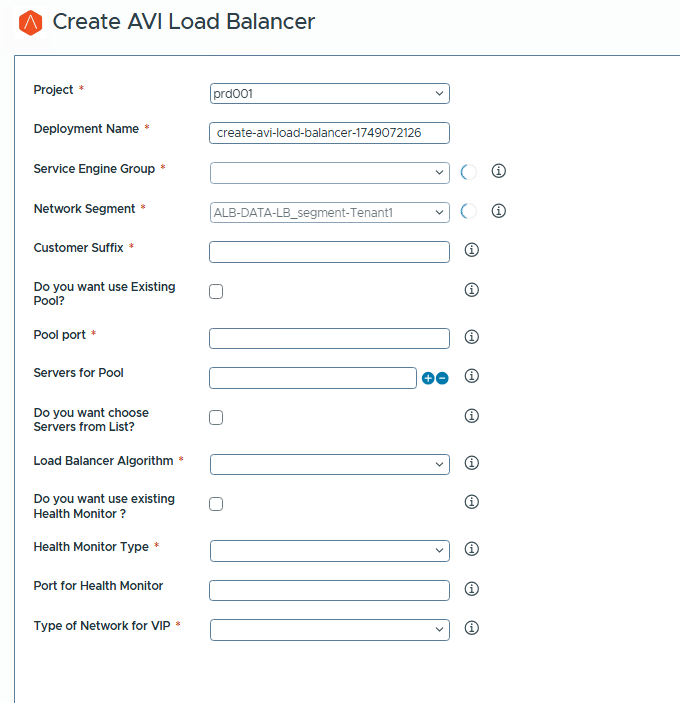

#### Form Fields

- **Project** (*Required*)
  - **Type:** Dropdown
  - **Description:** The Project for this Load Balancer is selected (e.g., `dbc2565a-05b5-4512-8225-60377cae6...`). A loading icon appears.

- **Deployment Name** (*Required, Read-only*)
  - **Type:** Text Input
  - **Description:** Name for this deployment. This is system-generated (e.g., based on catalog item name and a unique ID) and read-only. It identifies the overall load balancer deployment. Max 900 characters.

- **Service Engine Group** (*Required*)
  - **Type:** Dropdown
  - **Description:** The AVI Service Engine Group is selected. The signpost explains its role in resource allocation. List is dynamically populated. An info icon is present.

- **Network Segment** (*Required*)
  - **Type:** Dropdown
  - **Description:** The network segment (subnet) for the VIP is selected. The signpost explains its importance for network scope. List is dynamically populated. An info icon is present.

- **Customer Suffix** (*Required*)
  - **Type:** Text Input
  - **Description:** Short identifier/suffix for resource naming. The signpost explains its use. An info icon is present.

- **Do you want use Existing Pool?** (*Checkbox, Optional*)
  - **Type:** Checkbox
  - **Description:** Check to use a pre-configured AVI Server Pool. The signpost explains the choice. An info icon is present.

- **Pool** (*Dropdown, Conditionally Visible/Required*)
  - **Type:** Dropdown
  - **Description:** An existing AVI Server Pool is selected. The signpost describes these pools. List is dynamically populated.
  - **Visibility:** Visible and required if `Do you want use Existing Pool?` is checked. An info icon is present.

- **Pool port** (*Text Input, Conditionally Visible/Required*)
  - **Type:** Text Input
  - **Description:** Port number for the new pool's backend servers. The signpost stresses alignment with application.
  - **Visibility:** Visible and required if `Do you want use Existing Pool?` is NOT checked. An info icon is present.
  - **Constraints:** Valid port (0-65535). Pattern: `^((6553[0-5]...))$.

- **Servers for Pool** (*Array of Text Inputs, Conditionally Visible*)
  - **Type:** Array (multiple text inputs, indicated by `+` and `-` buttons)
  - **Description:** IP addresses of backend servers for the new pool are manually entered. The signpost advises on proper configuration.
  - **Visibility:** Visible if `Do you want use Existing Pool?` is NOT checked. An info icon is present.
  - **Constraints:** Valid IP addresses. Pattern: `^(25[0-5]|...)$`.

- **Do you want choose Servers from List?** (*Checkbox, Conditionally Visible*)
  - **Type:** Checkbox
  - **Description:** Check to select backend servers from a list of discovered VMs. The signpost highlights streamlining.
  - **Visibility:** Visible if `Do you want use Existing Pool?` is NOT checked. An info icon is present.

- **List of Virtual Machine** (*Dual List, Conditionally Visible*)
  - **Type:** Dual List
  - **Description:** VMs as backend servers are selected. The signpost explains the dual-list usage. List is dynamically populated.
  - **Visibility:** Visible if NOT using existing pool AND `Do you want choose Servers from List?` is checked.

- **Load Balancer Algorithm** (*Dropdown, Conditionally Visible/Required*)
  - **Type:** Dropdown
  - **Description:** LB algorithm for the new pool is selected (Round Robin, Least Connections, etc.). The signpost advises matching application needs.
  - **Visibility:** Visible and required if `Do you want use Existing Pool?` is NOT checked. An info icon is present.

- **Do you want use existing Health Monitor ?** (*Checkbox, Optional*)
  - **Type:** Checkbox
  - **Description:** Check to use a pre-configured AVI Health Monitor. The signpost explains benefits. An info icon is present.

- **Existing Health Monitor** (*Dropdown, Conditionally Visible/Required*)
  - **Type:** Dropdown
  - **Description:** An existing AVI Health Monitor is selected. The signpost describes pre-configured parameters. List is dynamically populated.
  - **Visibility:** Visible and required if `Do you want use existing Health Monitor ?` is checked. An info icon is present.

- **Health Monitor Type** (*Dropdown, Conditionally Visible/Required*)
  - **Type:** Dropdown
  - **Description:** Type for a new health monitor is selected (HTTP, TCP, ICMP, etc.). The signpost explains its purpose.
  - **Visibility:** Visible and required if `Do you want use existing Health Monitor ?` is NOT checked. An info icon is present.
  - **Choices:** `HEALTH_MONITOR_HTTP`, `HEALTH_MONITOR_HTTPS`, `HEALTH_MONITOR_TCP`, `HEALTH_MONITOR_ICMP`, `HEALTH_MONITOR_EXTERNAL`.

- **HTTP/HTTPS Request** (*Text Area, Conditionally Visible*)
  - **Type:** Text Area
  - **Description:** HTTP/S request for health monitors is defined (e.g., `GET / HTTP/1.0`). The signpost gives examples. Default: `GET / HTTP/1.0`.
  - **Visibility:** Visible for HTTP/S monitor types (if not using existing).

- **HTTP/HTTPS Response Code** (*Dual List, Conditionally Visible*)
  - **Type:** Dual List
  - **Description:** Expected healthy HTTP/S response codes are selected (e.g., 2XX, 3XX). The signpost gives examples and recommends 2XX.
  - **Visibility:** Visible for HTTP/S monitor types (if not using existing).
  - **Choices:** `1XX`, `2XX`, `3XX`, `4XX`, `5XX`, `ANY`.

- **Port for Health Monitor** (*Text Input, Conditionally Visible*)
  - **Type:** Text Input
  - **Description:** Port for the new health monitor. The signpost advises active configuration.
  - **Visibility:** Visible if `Do you want use existing Health Monitor ?` is NOT checked. An info icon is present.
  - **Constraints:** Valid port (0-65535). Pattern: `^((6553[0-5]...))$.

- **Code for External Health Monitor** (*Text Area, Conditionally Visible*)
  - **Type:** Text Area
  - **Description:** Script/code for an external health monitor. The signpost advises on logic.
  - **Visibility:** Visible for EXTERNAL monitor type (if not using existing).

- **Parameters for External Health Monitor** (*Text Input, Conditionally Visible*)
  - **Type:** Text Input
  - **Description:** Parameters for the external script. The signpost gives examples.
  - **Visibility:** Visible for EXTERNAL monitor type.

- **Path for External Health Monitor** (*Text Input, Conditionally Visible*)
  - **Type:** Text Input
  - **Description:** Path to the external script. The signpost clarifies location.
  - **Visibility:** Visible for EXTERNAL monitor type.

- **Variables for External Health Monitor** (*Text Input, Conditionally Visible*)
  - **Type:** Text Input
  - **Description:** Additional variables for the external script. The signpost explains.
  - **Visibility:** Visible for EXTERNAL monitor type.

- **Type of Network for VIP** (*Dropdown, Required*)
  - **Type:** Dropdown
  - **Description:** VIP allocation is selected: Static IP or Dynamic IP. The signpost explains the difference. An info icon is present.
  - **Choices:** `Static IP`, `Dynamic IP`.

- **VIP IP Address** (*Text Input, Conditionally Visible/Required*)
  - **Type:** Text Input
  - **Description:** Static IP address for the VIP. The signpost is direct.
  - **Visibility:** Visible and required if `Type of Network for VIP` is "Static IP".
  - **Constraints:** Valid IP address. Pattern: `^(25[0-5]|...)$`.

- **VIP IP Range** (*Text Input, Read-only, Conditionally Visible*)
  - **Type:** Text Input
  - **Description:** Displays available IP range for dynamic VIP. Auto-populated.
  - **Visibility:** Visible if `Type of Network for VIP` is "Dynamic IP".

#### Submitting the Request

1. `Project` is selected. `Deployment Name` will be auto-populated.
2. `Service Engine Group`, `Network Segment` are chosen. `Customer Suffix` is entered.
3. **Pool:** If using existing, checkbox is checked and `Pool` selected. If new, `Pool port`, servers (manual or list), and `Load Balancer Algorithm` are provided.
4. **Health Monitor:** If using existing, checkbox is checked and `Existing Health Monitor` selected. If new, `Health Monitor Type` is selected and its specific details provided.
5. **VIP:** `Type of Network for VIP` is selected. If "Static IP", `VIP IP Address` is entered.
6. All inputs are reviewed.
7. **Submit** is clicked.
8. Request status is monitored.

---
---

### Create AVI Health Checks

This guide explains the use of the "Create AVI Health Checks" catalog item to define new, custom health monitors in AVI (NSX Advanced Load Balancer). These can then be associated with server pools. The form is a single page, titled "General". Info icons (i) next to fields provide guidance.

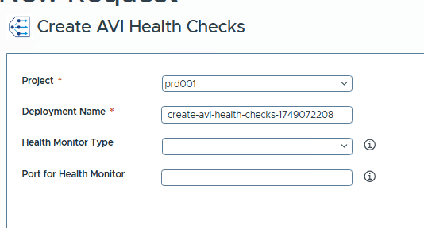

#### Form Fields

- **Project** (*Required*)
  - **Type:** Dropdown
  - **Description:** The Project for this Health Check is selected (e.g., `prd001`).

- **Deployment Name** (*Required, Read-only*)
  - **Type:** Text Input
  - **Description:** Name for this deployment/health monitor. This is system-generated (e.g., `create-avi-health-checks-1748593549`) and read-only. It identifies this specific health check creation task. Max 900 characters.

- **Health Monitor Type** (*Dropdown, Required*)
  - **Type:** Dropdown
  - **Description:** The type of health monitor is selected (HTTP, TCP, ICMP, etc.). The signpost explains its purpose. An info icon is present.
  - **Choices:** `HEALTH_MONITOR_HTTP`, `HEALTH_MONITOR_HTTPS`, `HEALTH_MONITOR_TCP`, `HEALTH_MONITOR_ICMP`, `HEALTH_MONITOR_EXTERNAL`.

- **Port for Health Monitor** (*Text Input, Optional*)
  - **Type:** Text Input
  - **Description:** Specific port for health checks. The signpost advises on active configuration. An info icon is present.
  - **Constraints:** Valid port (0-65535). Pattern: `^((6553[0-5]...))$.

- **HTTP/HTTPS Request** (*Text Area, Conditionally Visible*)
  - **Type:** Text Area
  - **Description:** HTTP/S request string (e.g., `GET / HTTP/1.0`). The signpost gives examples. Default: `GET / HTTP/1.0`.
  - **Visibility:** Visible for HTTP/S monitor types.

- **HTTP/HTTPS Response Code** (*Multi-Value Picker / Dual List, Conditionally Visible*)
  - **Type:** Multi-Value Picker (a dual list or similar multi-select)
  - **Description:** Expected healthy HTTP/S response codes are selected (e.g., 2XX). The signpost gives examples and recommends 2XX. Default: `2XX`.
  - **Visibility:** Visible for HTTP/S monitor types.
  - **Choices:** `1XX`, `2XX`, `3XX`, `4XX`, `5XX`, `ANY`.

- **Code for External Health Monitor** (*Text Area, Conditionally Visible*)
  - **Type:** Text Area
  - **Description:** Script/code for an external health monitor. The signpost advises on logic.
  - **Visibility:** Visible and required for EXTERNAL monitor type.

- **Parameters for External Health Monitor** (*Text Input, Conditionally Visible*)
  - **Type:** Text Input
  - **Description:** Parameters for the external script. The signpost gives examples.
  - **Visibility:** Visible for EXTERNAL monitor type.

- **Path for External Health Monitor** (*Text Input, Conditionally Visible*)
  - **Type:** Text Input
  - **Description:** Path to the external script. The signpost clarifies location.
  - **Visibility:** Visible for EXTERNAL monitor type.

- **Variables for External Health Monitor** (*Text Input, Conditionally Visible*)
  - **Type:** Text Input
  - **Description:** Additional variables for the external script. The signpost explains.
  - **Visibility:** Visible for EXTERNAL monitor type.

#### Submitting the Request

1. `Project` is selected. `Deployment Name` will be auto-populated.
2. `Health Monitor Type` is selected.
3. Optionally, `Port for Health Monitor` is specified.
4. **If HTTP/HTTPS type:** `HTTP/HTTPS Request` is provided and `HTTP/HTTPS Response Code`(s) are selected.
5. **If EXTERNAL type:** `Code for External Health Monitor` is provided and optionally its parameters, path, and variables.
6. Inputs are reviewed.
7. **Submit** is clicked.
8. Request status is monitored.

---
---

### Add or Remove a Security Policy

This guide explains the use of the "Add or Remove Security Policy" catalog item to create a new NSX Security Policy with a specified priority or remove an existing one. The form is a single page, titled "Manage". An info icon (i) is present for `Type of Action`.
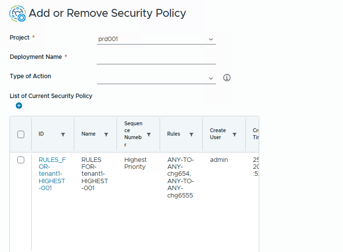

#### Form Fields

- **Project** (*Required*)
  - **Type:** Dropdown
  - **Description:** The Project for this operation is selected (e.g., `prd001`).

- **Deployment Name** (*Required*)
  - **Type:** Text Input
  - **Description:** Name for this management task (e.g., "Add-DMZ-Policy"). This identifies the specific request for adding/removing the policy. Max 900 characters.

- **Type of Action** (*Required*)
  - **Type:** Dropdown
  - **Description:** Action is selected: ADD (new policy) or REMOVE (delete policy). The signpost explains choices. An info icon is present.

- **Priority** (*Dropdown, Conditionally Visible/Required*)
  - **Type:** Dropdown
  - **Description:** Priority for a new policy is specified. The signpost explains its role in firewall application order. Policy name is derived from this.
  - **Visibility:** Visible and required if `Type of Action` is "ADD".
  - **Choices:** "Highest Priority", "High Priority", "Mid Priority", "Low Priority", "Lowest Priority".

- **Security Policy** (*Dropdown, Conditionally Visible/Required*)
  - **Type:** Dropdown
  - **Description:** An existing Security Policy to remove is selected. The signpost clarifies its use. List is dynamically populated.
  - **Visibility:** Visible and required if `Type of Action` is "REMOVE".

- **List of Current Security Policy** (*Data Grid, Read-only*)
  - **Type:** Data Grid
  - **Description:** Displays existing security policies (ID, Name, Sequence Number, Rules, Create User, Create Time, Comments, Path). The grid is populated with example policies like `RULES_FOR-tenant1-HIGHEST-001`. The `+` icon above the grid is for grid manipulation (e.g., column visibility).
  - **Visibility:** Always visible.

#### Submitting the Request

1. `Project` is selected, `Deployment Name` is entered.
2. `Type of Action` is chosen.
3. **If ADD:** `Priority` is selected.
4. **If REMOVE:** `Security Policy` to remove is selected.
5. Selections are reviewed, using `List of Current Security Policy` for reference.
6. **Submit** is clicked.
7. Request status is monitored.
