# VCS Servicenow Discovery Production Deployment Work Instruction

# Table of Contents

- [VCS Servicenow Discovery Production Deployment Work Instruction](#vcs-servicenow-discovery-production-deployment-work-instruction)
- [Table of Contents](#table-of-contents)
  - [Changelog](#changelog)
  - [Introduction](#introduction)
    - [Purpose](#purpose)
    - [Audience](#audience)
    - [Scope](#scope)
  - [Context](#context)
- [Discovery Configuration Prerequisites](#discovery-configuration-prerequisites)
  - [ServiceNow Instance](#servicenow-instance)
  - [Domain separation](#domain-separation)
  - [Mid Server Mid Server User and Run As User](#mid-server-mid-server-user-and-run-as-user)
    - [MID Server](#mid-server)
  - [MID Server User and Run as User](#mid-server-user-and-run-as-user)
- [MID Server Deployment steps](#mid-server-deployment-steps)
  - [MID Prerequisites](#mid-prerequisites)
  - [MID Server Instance deployment](#mid-server-instance-deployment)
  - [Service Account Creation](#service-account-creation)
- [Ordering / Implementation Process](#ordering--implementation-process)
  - [Process flow](#process-flow)
  - [Request: Mid server user \& confirm mid server name](#request-mid-server-user--confirm-mid-server-name)
  - [Create vCenter read only access user for discovery](#create-vcenter-read-only-access-user-for-discovery)
  - [Deploy 2x Mid server](#deploy-2x-mid-server)
  - [Request: Mid server integration CAT](#request-mid-server-integration-cat)
  - [Validate discovered CI's CAT](#validate-discovered-cis-cat)
    - [Validate CI completeness](#validate-ci-completeness)
    - [Validate CI relationships](#validate-ci-relationships)
    - [Validate Event Collector events](#validate-event-collector-events)
  - [Request: Mid server integration PROD](#request-mid-server-integration-prod)
- [ServiceNow vCenter Discovery Configuration by COA discovery team](#servicenow-vcenter-discovery-configuration-by-coa-discovery-team)
  - [Define Range Set](#define-range-set)
  - [Create the Discovery Schedule](#create-the-discovery-schedule)
  - [Create the Discovery Credential and validate its access](#create-the-discovery-credential-and-validate-its-access)
  - [Execute the Discovery Scan](#execute-the-discovery-scan)
- [Event Collector configuration for vCenter events](#event-collector-configuration-for-vcenter-events)
  - [Create the Event Collector](#create-the-event-collector)
  - [Testing the Event Collector events](#testing-the-event-collector-events)
- [Event Collector fix](#event-collector-fix)
- [Workaround for Event Collector functionality](#workaround-for-event-collector-functionality)
- [Future improvements](#future-improvements)
- [Support/Escalations](#supportescalations)

## Changelog

| Version | Date       | User               | Changes                                                                                                                                                                                         |
|---------|------------|--------------------|-------------------------------------------------------------------------------------------------------------------------------------------------------------------------------------------------|
| 0.1     | 25.06.2021 | Fausto Lozano      | Created Document                                                                                                                                                                                |
| 0.2     | 13.10.2021 | Faisal Khan        | Updated responsibilities (Onboarding team, Deployment Manager/Integration Architect, Discovery team), Contacts Notes, Current fixes in progress, headings and improvement in content and steps. |
| 0.3     | 02.11.2021 | Abhijeet Janwalkar | updates based on feedback, removed lot of blank lines, spaces                                                                                                                                   |
| 0.4     | 23.05.2022 | Alpesh Kumbhare    | Merge CMDB discovery documentation dhcSnowDiscoveryDeploymentGuide.md and wiServiceNowDiscoveryToEnrichCMDBWithLiveData.md                                                                      |
| 0.45    | 04.04.2022 | Oliver Scholle     | update COA Discovery PO (Pradeep), reduce cmdb update event list                                                                                                                                |
| 0.6     | 03.05.2022 | Oliver Scholle     | update Discovery ordering process                                                                                                                                                               |
| 0.7     | 13.05.2022 | Oliver Scholle     | changed naming convention for mid servers                                                                                                                                                       |
| 0.8     | 04.07.2022 | Vani Yemula        | updated mid server deploy steps                                                                                                                                                                 |
| 0.9     | 18.07.2022 | Vani Yemula        | Updated the excel template link for Service Now GSR                                                                                                                                             |
| 0.10    | 03.10.2025 | Tomasz Korniluk    | Updated to cover official ServiceNow KB0964029 fix about special characters exceptions for the discovery account (mid server user credentials)                                                  |

## Introduction

### Purpose

Deploy and integrate VCS into ServiceNow Cloud Discovery for Production VCS CMDB.

### Audience

- VCS Operations

### Scope

- Deploy MID Servers
- Create service accounts
- Integrate VCS with SNow
- Validate the connection

## Context

VCS management and compute vCenters can be scanned via API by ServiceNow mid servers to create and continuously update CMDB CIs with ServiceNow out of the box data model for VMware platforms
For dedicated (single customer) VCS platforms the discovered vCenter hosted virtual workload servers are discovered into a single customer dedicated Domain inside ServiceNow
For shared/multi tenant VCS platforms the discovered vCenter may contain hosted virtual workload servers from multiple tenants inside different resource pools but all discovered into a single shared domain inside ServiceNow
(A Domain is a logical group created to separate data, in our case we will identify a Domain as a Customer, client or an entity on which the CI’s are part of).

# Discovery Configuration Prerequisites

## ServiceNow Instance

Access to the [Global Production ServiceNow Instance](https://atosglobal.service-now) and [Global CAT ServiceNow Instance](https://atosglobalcat.service-now)

For testing each VCS should get two mid servers deployed with same name and credentials, one connected to ServiceNow CAT, one connected to ServiceNow Prod instance.

A User with admin role. The admin role is required to see Domain separation. This user is utilized to configure credentials, event collector and schedules for Discovery, it is also utilized to do validations of Data among the classes for vCenter Discovery and Event Collector Events.

## Domain separation

**In case of DEDICATED (single customer/tenant on VCS) vCenter:**
Discovery mid server and Integration user shall be deployed in customer domain.
All CI's will be created inside customer Domain.
**In case of SHARED (multi tenant) vCenter:**
Discovery mid server and user shall be deployed in domain **TOP/Uniformity/ATOS Delivery/Atos DC Shared CI** on which the vCenter will be discovered.
All CI's (shared infra but also customer VM instances) will be created inside Domain **"Atos DC Shared CI"** and **FO/Company "Atos VCS CIs"**

## Mid Server Mid Server User and Run As User

**Responsibility: -**

### MID Server

2x MID Server VM (Ubuntu) should be installed by VCS Deployment Manager/Integration Architect of the customer via Ansible role dhc-createMidServerCmdb.
MID instance name must be provided or validated by Discovery team. Each mid server VM should host a single mid server application/instance.
Latest naming format shared by Discovery team is as follows.

Naming convention:[DIS]-[CUSTOMER]-DHC-[locationCode]MID[###]  
Example: DIS-ANS-DHC-MAR01MID001
Mid server name shall be defined based on VCS naming convention in alignment with VCS Cloud Account naming

## MID Server User and Run as User

**MID Server User**

For creation of VCS MID Server Integration User in ServiceNow instance an ExcelSheet template - [Document Link](files/SnowDiscoveryDeployment/Siemens%20dhc%20request%20mid-server%20integration.xlsx) needs be filled by Deployment Manager/Integration Architect of the customer, and the template is to be attached to General Service Request (GSR) in Atos Service Catalog to discovery team

> **Warning:**
> ServiceNow officially publish KB0964029 article that MID server agent service will not start in case user account password contains special characters.
> Follow the KB0964029 ([ServiceNow official KB0964029 article link](https://support.servicenow.com/kb?id=kb_article_view&sysparm_article=KB0964029)) article to apply manually the fix in case user account password contains mentioned special characters.
> [ServiceNow document link](https://www.servicenow.com/docs/csh?topicname=mid-server-reserved-characters.html&version=latest) - ServiceNow official document explaining reserved characters for MID server agent used inside config.xml.

The naming convention for the MID Server user shall indicate  that this user and password is to be maintained by VCS operational team....
MID Server user/Integration user: `[CUSTOMER].dhc.midserver@discovery.com`
MID Server user/Integration user shall be requested twice once for CAT and once for PROD (ask for same same password on both instances)

**MID Server RunAs User**
Naming convention of Run as User is managed by discovery team and will be created and configured by discovery team without further request

# MID Server Deployment steps

Official SNOW documentation covering the installation is available under the following link:  
[SNOW Documentation](https://docs.servicenow.com/bundle/london-servicenow-platform/page/product/mid-server/concept/c_MIDServerInstallation.html)

## MID Prerequisites

The following details are needed for MID Server deployment:

- Service Now Integration user credentials
- Domain login in VCS environment with Ansible, Hashicorp access
- MID Instance name from Discovery team

## MID Server Instance deployment

We have playbook createMidServerCmdb.yml in manage phase for deploying new MID server along with MID server Instance.
There are two options given to deploy the MID server.
    1. Default - In this there are two MID servers deployed each for PROD and CAT environments.
                 mid001 and mid002 being the default server names, the IP and other MID Instance deployment details are prompted for user input.
    2. Custom - In this a single MID server is deployed, with custom MID server name.
This playbook will prompt for below inputs from user

- Enter domain username in format `dasId@domain.next`
- Enter the password for the domain user. Please note that the password you enter will not be displayed on   the screen.
- Enter SNOW integration user name for connecting SNOW
- Enter SNOW integration user password
- Enter MID instance name provided by Discovery team in format 'DIS-DHC-<CountryCode>-<01-99>' e.g DIS-DHC-UK-01
- Enter IP Address for <first MID Server>
- Enter IP Address for <second MID Server>
- Enter mid server hostname in the format mid<001-999>e.g - mid001. PS: mid001/mid002 are reserved for CAT/PROD mid servers
- Enter IP Address for <Custom MID Server>
- Enter snowInstanceUrl in format `https://<snowInstance>.service-now.com/`

Screenshot for playbook run

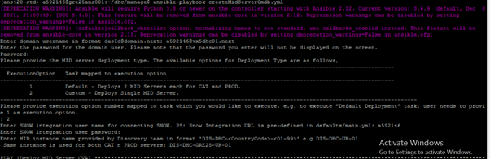

After Completion of playbook successfully, we will get below result

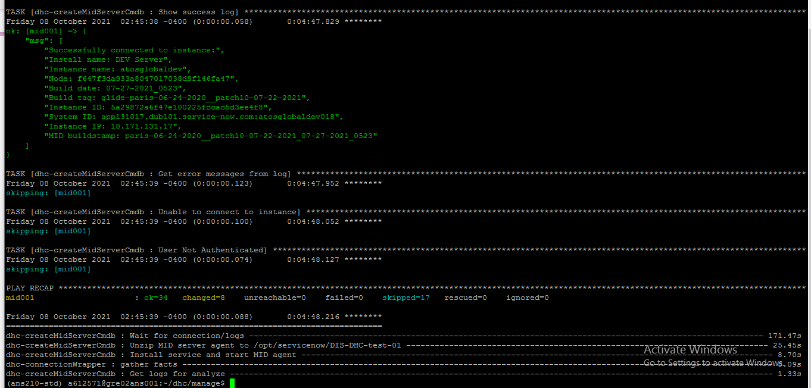

The following playbook is used for MID Deployment:

createMidServerCmdb.yml

## Service Account Creation

We need service account with Read only access on vCenter servers, the following steps are automated with the playbook createServiceAccount.yml.
This playbook will perform below tasks

- Create service account in format "svc-< locationCode >-mid01"
- Add Service account to HashiVault

This playbook will prompt for below inputs from user

- Enter domain username in format `dasId@domain.next`  -  *Enter your VCS Domain Account username*
- Enter the password for the domain user. Please note that the password you enter will not be displayed on   the screen.  - *Enter your password*
- Enter service name for service account in 3 Alphabets e.g. mid/git/adc  -  *Enter mid*
- Enter service account number in 2 digits number e.g. 01/02/03  -  *Enter 01*
- Enter group name which you want to add  in format - rsce-< locationCode >-vcs-l-readonly \r\n  If you want to add multiple groups please add group comma separated in format - rsce-< locationCode >-vcs-l-readonly,rsce-dhc-vop-l-admins \r\n If you do not want additional group, please press enter - *Enter rsce-< locationCode >-vcs-l-readonly*

Screenshot of playbook run

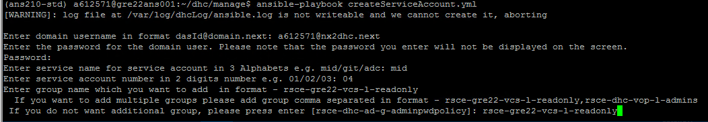

After Completion of playbook successfully, we will get below result

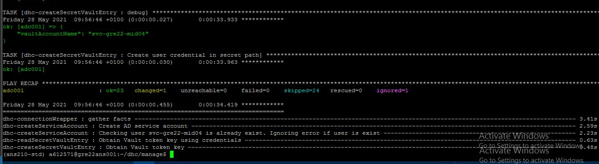
  
This is done using below playbook:

```yaml
# type: operational
# author: Alpesh Kumbhare
# date: 28-05-2021
# example usage: ansible-playbook createServiceAccount.yml
# mandatory extra vars: Not Applicable
# description: Playbook creates Service account in VCS Active Directory and adding it in default role Groups also in other role groups if user needs
# workInstruction: TBD
---
- name: Create Service Account in Active Directory
  hosts: adc001
  gather_facts: false

  vars_prompt:
    - name: username
      prompt: "Enter domain username in format dasId@domain.next"
      private: no
    - name : password
      prompt: "Enter the password for the domain user. Please note that the password you enter will not be displayed on the screen.\r\nPassword"
      private: yes
      unsafe: yes
    - name : serviceName
      prompt: "Enter service name for service account in 3 Alphabets e.g. mid/git/adc"
      private: no
    - name : serviceAccountNumber
      prompt: "Enter service account number in 2 digits number e.g. 01/02/03"
      private: no
    - name : additionalGroupInput
      prompt: "Enter group name which you want to add  in format - rsce-gre22-vcs-l-readonly \r\n  If you want to add multiple groups please add group comma separated in format - rsce-gre22-vcs-l-readonly,rsce-dhc-vop-l-admins \r\n If you do not want additional group, please press enter"
      private: no
      default: "rsce-dhc-ad-g-adminpwdpolicy"

  tasks:     
    - name: "Creating Service account in VCS Active Directory"
      include_role:
        name: dhc-createServiceAccount
```

Example MID Server is shown below:

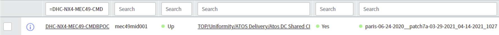

# Ordering / Implementation Process

## Process flow

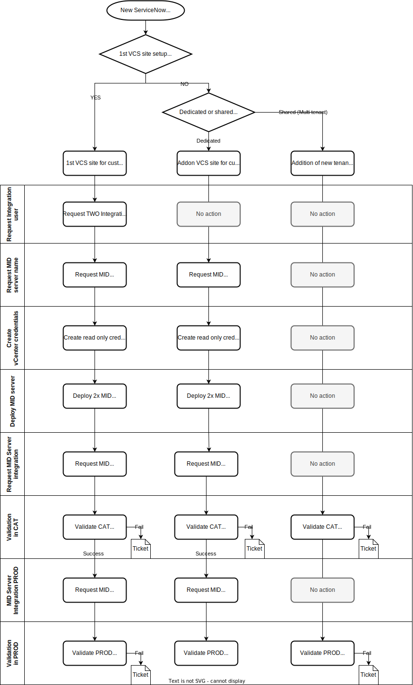

## Request: Mid server user & confirm mid server name

Create ServicNow Generic Service request to be sent to Discovery team  and provide mandatory inputs:

Create ServicNow Generic Service request to be sent to Discovery team and attach ExcelSheet template.
Atos Internal Service Catalog -> GDTS -> Service Request Management (ServiceNow) -> Generic Service Request
[Link](https://atosglobal.service-now.com/nav_to.do?uri=%2Fcom.glideapp.servicecatalog_cat_item_view.do%3Fv%3D1%26sysparm_id%3D75c2caafdbe133808471a7c74896191e%26sysparm_link_parent%3D44e475a80f55da401668956f62050e6b%26sysparm_catalog%3D9e6d62600f5d9a409850ecd692050eed%26sysparm_catalog_view%3Dcatalog_Atos_Internal_Service_Catalog)

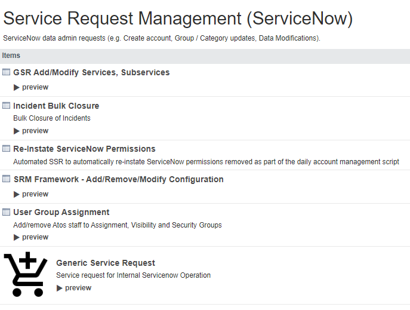

and provide mandatory inputs:

> Purpose: "VCS Cloud vCenter direct discovery. Please use VCS customer specific integration user to allow separate password rotation"
>
> VCS CI target domain: [Customer Domain|Atos DC Shared CI]
>
> Customer/Tenant: [Customer full name, ServiceNow FO | Atos VCS CIs]
>
> Mid server VM Name/IP: [hostname,ip address]
>
> Suggested mid instance name: Example: DIS-ANS-DHC-MAR01MID001 (to be confirmed by dicovery team)
>
> Group membership: **ATF2 MID-Server**

## Create vCenter read only access user for discovery

Create credentials in VCS management AD and Hashi Vault.

## Deploy 2x Mid server

2x MID Server VM (Ubuntu) should be installed by VCS Deployment Manager/Integration Architect of the customer via Ansble playbook manage/createMidServerCmdb.yml.
Using mid server name confirmed or corrected and integration user name/password provided by discovery team from previous step
To know more about requirements and how to install and configure the mid server see ServiceNow Documentation in the [link](https://docs.servicenow.com/bundle/quebec-servicenow-platform/page/product/mid-server/concept/mid-server-installation.html#mid-server-installation)

Example MID Server is shown below:


## Request: Mid server integration CAT

Create ServicNow Generic Service request to be sent to Discovery team and attach ExcelSheet template.
Atos Internal Service Catalog -> GDTS -> Service Request Management (ServiceNow) -> Generic Service Request
[Link](https://atosglobal.service-now.com/nav_to.do?uri=%2Fcom.glideapp.servicecatalog_cat_item_view.do%3Fv%3D1%26sysparm_id%3D75c2caafdbe133808471a7c74896191e%26sysparm_link_parent%3D44e475a80f55da401668956f62050e6b%26sysparm_catalog%3D9e6d62600f5d9a409850ecd692050eed%26sysparm_catalog_view%3Dcatalog_Atos_Internal_Service_Catalog)


and provide mandatory inputs:

> ServiceNow instance: **CAT**
>
> VCS CI target domain: [Customer Domain|Atos DC Shared CI]
>
> Customer/Tenant: [Customer full name, ServiceNow FO | Atos VCS CIs]
>
> Mid server VM Name/IP: [hostname,ip address]
>
> Mid server instance name: [midname]
>
> Mid server VM Name/IP: [hostname,ip address]
>
> Discovery Range Set [VCS Management vCenter IP, VCS Compute vCenter IP]
>
> Schedule: Daily 23:55 UTC
>
> Location/Site: [SerivceNow Location, VCS site code]
>
> vCenter read only credentials: [username, Contact for requesting password] (do not share any passwords in written cleartext)
>
> vCenter Events to monitor for adhoc discovery: "VmCreatedEvent, VmMigratedEvent" (future addition of VmReconfiguredEvent to be discussed)

[Note]: Discovery MUST NOT be enabled on vCenters where competing/incompatible scripted import table/transform map CI creation is enabled as well - e.g. for customer Siemens VCS's customer VMs are created via ServiceNow script include and compute vCenter(s) from VCS must not be discovered on scheduled or event based. the VCS management vCenter (.20) should be included in discovery. Compute workload domain vCenter (.60) can be discovered ONCE for initial CMDB population but must not remain in discovery configuration afterwards.

## Validate discovered CI's CAT

### Validate CI completeness

Validate with the Deployment manager/Integration architect  that the list of classes as mentioned in below heading **List of classes to validate** contains the correct information from the vCenters Discovered. To access each of the classes you can copy the name of any of the listed classes and add at the end the word **.list** then click enter. See below image.

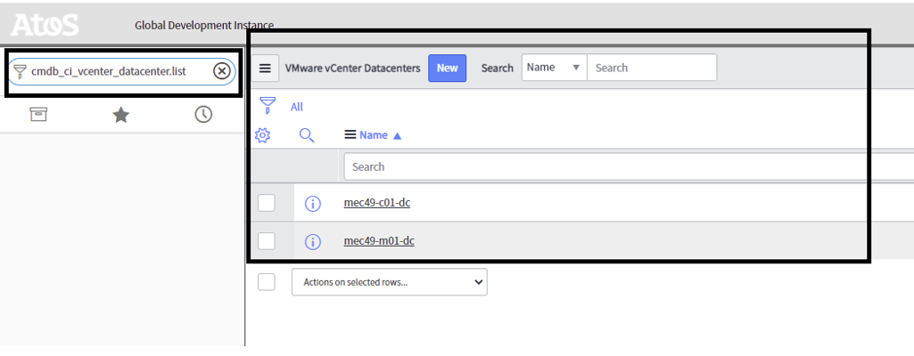

Validate that the records were created under the Domain on which the user is. To do this, click on the gear in the table list. A window will open with all the fields in the table, select Domain and save. Now you can see the Domain on which the data was created. See the below two images.

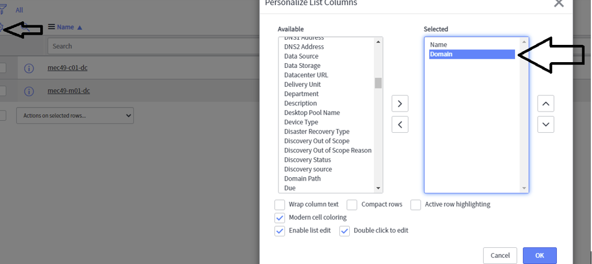

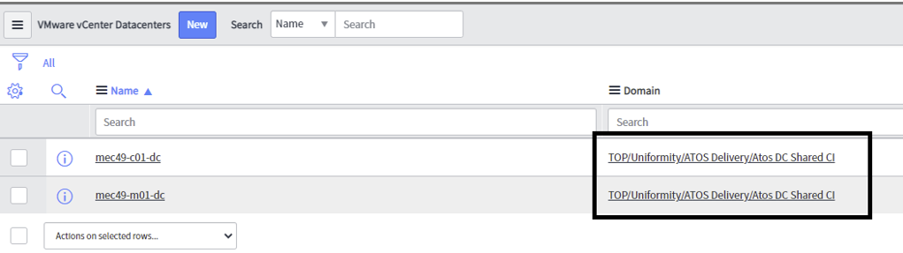

**List of classes to validate**

> cmdb_ci_vcenter_datacenter
>
> cmdb_ci_logical_datacenter
>
> cmdb_ci_esx_resource_pool
>
> cmdb_ci_vcenter_object
>
> cmdb_ci_vm_object
>
> cmdb_ci_vcenter_folder
>
> cmdb_ci_vcenter_datastore
>
> cmdb_ci_datastore
>
> cmdb_ci_vcenter_cluster
>
> cmdb_ci_host_cluster
>
> cmdb_ci_vcenter_network
>
> cmdb_ci_vcenter_dvs
>
> cmdb_ci_vmware_instance
>
> cmdb_ci_vm_instance
>
> cmdb_ci_vcenter_dv_port_group
>
> cmdb_ci_port_group
>
> cmdb_ci_vmware_template
>
> cmdb_ci_vm_template
>
> cmdb_ci_os_template
>
> cmdb_ci_vm_object
>
> cmdb_ci_vcenter
>
> cmdb_ci_appl
>
> cmdb_ci_drs_vm_config
>
> cmdb_ci_vcenter_vm_group
>
> cmdb_ci_vcenter_host_group
>
> cmdb_ci_vcenter_cluster_drs_rule
>
> cmdb_ci_cluster_vm_affinity_rule
>
> cmdb_ci_cluster_vm_host_rule

**Tags table**

> cmdb_key_value

See [Link](https://docs.servicenow.com/en-US/bundle/paris-it-operations-management/page/product/discovery/reference/r_VCenterDataCollected.html) for vendor description of expected discovery results.

Work with the Deployment manager/Integration architect to modify one or two values from one of the Virtual Server from the vCenter side.

- Number of CPU’s
- Memory RAM
- Turn on or off one of the virtual Servers

After making the modifications from the vCenter, Re-scan the vCenter from Snow and validate the new values for the Virtual Server are there you can use the table **cmdb_ci_vmware_instance.list**

Validate the Domain and Company columns are still **with the same target Domain and Company/FO** you’ve modified.

### Validate CI relationships

| Parent class Name                 | Relationship type                         | Child class Name                |
|-----------------------------------|-------------------------------------------|---------------------------------|
| Computer                          | Virtualized by::Virtualizes               | ESX Server                      |
| Computer                          | Instantiates::Instantiated by             | VM Instance                     |
| VMware Virtual Machine   Instance | Registered on::Has registered             | ESX Server                      |
| VMware Virtual Machine   Instance | Connected by::Connects                    | VMware vCenter Network          |
| Virtual Machine Template          | Connected by::Connects                    | VMware vCenter Network          |
| VMware vCenter Network            | Provided by::Provides                     | ESX Server                      |
| VMware vCenter Datastore          | Provides storage for::Stored on           | VMware Virtual Machine Instance |
| VMware vCenter Datastore          | Used by::Uses                             | ESX Server                      |
| VMware vCenter Datastore          | Provides storage for::Stored on           | Virtual Machine Template        |
| VMware vCenter Cluster            | Members::Member of                        | ESX Server                      |
| ESX Resource Pool                 | Defines resources for::Get resources from | VMware vCenter Cluster          |
| ESX Resource Pool                 | Defines resources for::Get resources from | ESX Server                      |
| VMware vCenter Folder             | Contains::Contained by                    | VMware vCenter Datastore        |
| VMware vCenter Folder             | Contains::Contained by                    | VMware vCenter Folder           |
| VMware vCenter Folder             | Contains::Contained by                    | Virtual Machine Template        |
| VMware vCenter Folder             | Contains::Contained by                    | VMware Virtual Machine Instance |
| VMware vCenter Datacenter         | Contains::Contained by                    | VMware vCenter Network          |
| VMware vCenter Datacenter         | Contains::Contained by                    | VMware Virtual Machine Instance |
| VMware vCenter Datacenter         | Contains::Contained by                    | ESX Server                      |
| VMware vCenter Datacenter         | Contains::Contained by                    | VMware vCenter Datastore        |
| VMware vCenter Datacenter         | Contains::Contained by                    | VMware vCenter Folder           |
| VMware vCenter Datacenter         | Contains::Contained by                    | VMware vCenter Cluster          |
| VMware vCenter Datacenter         | Contains::Contained by                    | Virtual Machine Template        |

[Note] Releationships "Instantiates::Instantiated by" and "Virtualized by::Virtualizes" are created by Business Rule "Virtual Computer Check" and not discovery

See [Link](https://docs.servicenow.com/en-US/bundle/paris-it-operations-management/page/product/discovery/reference/r_VCenterDataCollected.html) for vendor description of expected discovery results.

### Validate Event Collector events

**Responsibility: -**

Creation of a new Virtual Machine or modifying an existing Virtual Machine should be done by Deployment Manager/Integration Architect of the customer.

Validation on Snow should be done by Snow onboarding team.

**Steps: -**

All the Event Collector events are created in the table sysevent.list which contain the list of all the events In service Now. To identify Event collector records open the table filter by **automation.vcenter** on the **Name** column.

With the help of the Deployment manager/Integration architect do the below tests and validate in the Virtual Servers the modifications committed from the vCenter console. (You don’t need to rescan the vCenter for these tests).

1.- **Create a new virtual machine**

**Data Validation**

DO **NOT** RUN DISCOVERY

Check for the last created Event records in sysevent table with the name **automation.vcenter** and search the Event for **Creating** the Virtual Server.
Open the table cmdb_ci_vmware_instance.list and filter by the vCenter containing the new Virtual Server. Search for the new item created.

## Request: Mid server integration PROD

Create ServicNow Generic Service request to be sent to Discovery team and attach ExcelSheet template
Atos Internal Service Catalog -> GDTS -> Service Request Management (ServiceNow) -> Generic Service Request
[Link](https://atosglobal.service-now.com/nav_to.do?uri=%2Fcom.glideapp.servicecatalog_cat_item_view.do%3Fv%3D1%26sysparm_id%3D75c2caafdbe133808471a7c74896191e%26sysparm_link_parent%3D44e475a80f55da401668956f62050e6b%26sysparm_catalog%3D9e6d62600f5d9a409850ecd692050eed%26sysparm_catalog_view%3Dcatalog_Atos_Internal_Service_Catalog)

and provide mandatory inputs:

> ServiceNow instance: **PROD**
>
> VCS CI target domain: [Customer Domain|Atos DC Shared CI]
>
> Customer/Tenant: [Customer full name, ServiceNow FO | Atos VCS CIs]
>
> Mid server VM Name/IP: [hostname,ip address]
>
> Mid server instance name: [midname] Example: DIS-ANS-DHC-FR-01 (as provided by dicovery team before and used in mid deployment)
>
> Mid server VM Name/IP: [hostname,ip address]
>
> Discovery Range Set [VCS Management vCenter IP, VCS Compute vCenter IP]
>
> Schedule: Daily 23:55 UTC
>
> Location/Site: [SerivceNow Location, VCS site code]
>
> vCenter read only credentials: [username, Contact for requesting password] (do not share any passwords in written cleartext)
>
> vCenter Events to monitor for adhoc discovery: "VmCreatedEvent, VmMigratedEvent" (future addition of VmReconfiguredEvent to be discussed)
>
>**Note** Discovery MUST NOT be enabled on vCenters where competing/incompatible scripted import table/transform map CI creation is enabled as well - e.g. for customer Siemens VCS's customer VMs are created via ServiceNow script include and compute vCenter(s) from VCS must not be discovered on scheduled or event based. the VCS management vCenter (.20) should be included in discovery. Compute workload domain vCenter (.60) can be discovered ONCE for initial CMDB population but must not remain in discovery configuration afterwards.

**Validate discovered CI's PROD**

Repeat steps from chapter "Validate discovered CI's CAT" in prod ServiceNow instance

# ServiceNow vCenter Discovery Configuration by COA discovery team

Following steps will be executed by discovery team based on GSR input: -

## Define Range Set

Range set information to be provided by Deployment Manager/Integration Architect of the customer via GSR.

The naming shall be decided by Discovery team.

Example: DIS-ANS-VCS - Direct Discovery

Creation of Range Set should be done by discovery team.

**Steps: -**

1.- Access to the ServiceNow Instance with the user having admin role.

In case VCS CI target domain: [Customer domain]
Switch into the customer domain

In case VCS CI target domain: "Atos DC Shared CI"
Switch into the Shared domain **TOP/Uniformity/ATOS Delivery/Atos DC Shared CI**, see image below

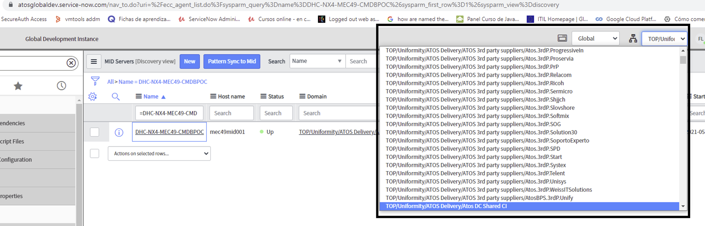

2.- Create the Range Sets for the vCenters to Discover. Write in the left navigation pane the word Range Set and select Under Discovery Module **Discovery Range Sets,** Once clicked, select **New** to create.

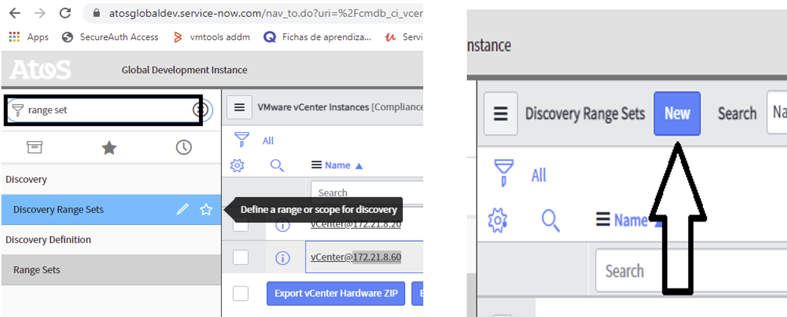

Fulfill the information in the Form for the Range Set. Save the record.

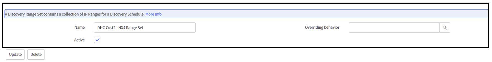

Open Again the Range Set and see the link Quick ranges. Click on it and write in the window opened the ip or ip’s of the vCenter to scan, if there are two ip’s you should use comma separation.

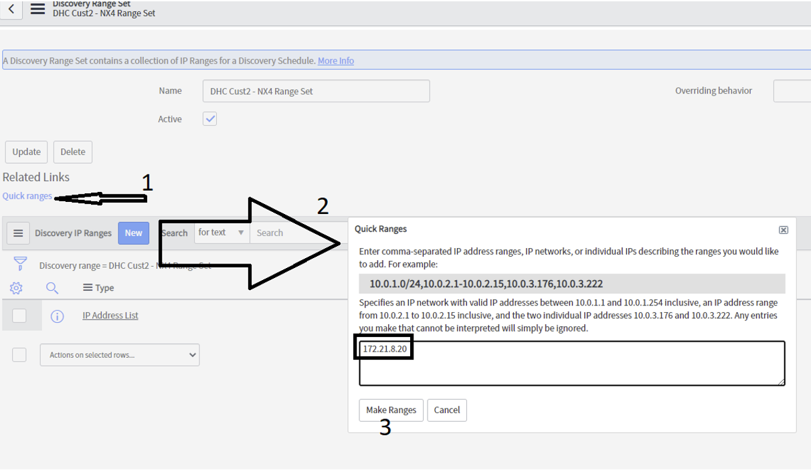

## Create the Discovery Schedule

The naming of Discovery Schedule should be selected by Discovery team.

Example: DIS-ANS-VCS - Direct Discovery

Creation of Discovery schedule on Snow should be done by Snow discovery team.

**Steps: -**

Write in the left Navigation Pane the word Discovery Schedule, once opened click on New

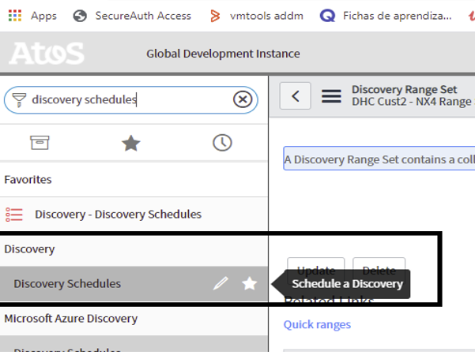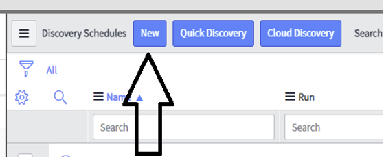

Fill in the information in the fields as below example on which you must select the Specific MID Server used, save the record, and open it again.

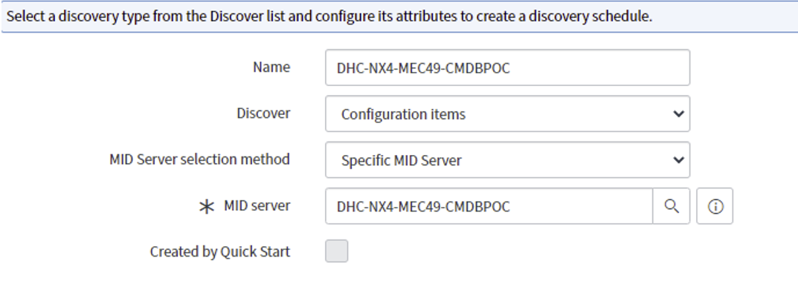

Again, in the Schedule created see now the button **Load the Related List**, click on it, and select the Tab/Section **Discovery Range Sets** select Edit. A window will open to show the Range Sets available. Select the Range Set created before and save. The range set is now added to the Schedule.

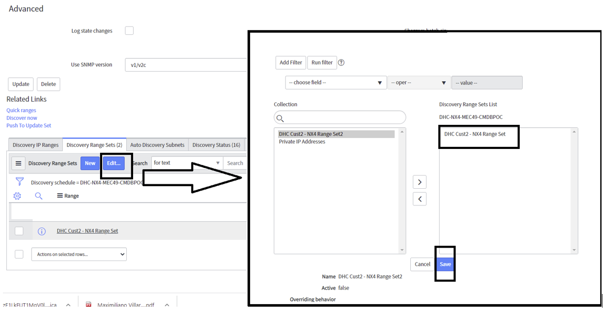

## Create the Discovery Credential and validate its access

The naming convention of Discovery Credentials record should be given by Discovery team.

Examples: DIS-ANS-VCS Linux, DIS-ANS-VCS Windows

Creation of Discovery credentials record in Snow should be done by Snow discovery team using vCenter read only credentials provided via GSR

**Steps: -**

Write in the left navigation pane the word Credential and select under the Discovery module the Credentials option. Then Click on New. Once Inside select the option from the list for VMWare Credentials.

**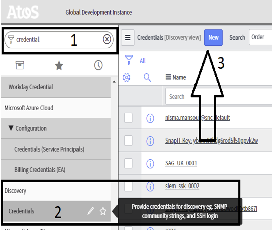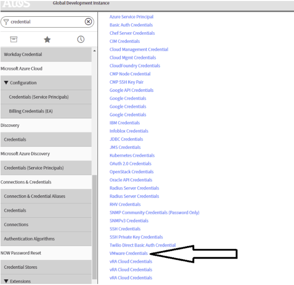**

Fill the blanks with the information of the account and Save.

To validate the credential get inside of it and click on the link Test Credential. A window will open, write the IP of the vCenter and the Mid Server to use.

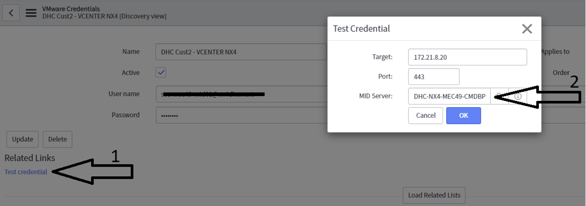

## Execute the Discovery Scan

**Responsibility: -**

For testing, initial Discovery scan should be done by Snow onboarding team in co-ordination with Deployment manager/Integration architect of the customer.

**Steps: -**

Write in the left Navigation pane the word Schedule and select the Schedule we have created in previous steps.

Open the record and select the link under **Related Links** section Discover Now. Once this is completed you will be directed to the Discovery Status table to see the Discovery job progress. Wait until complete.

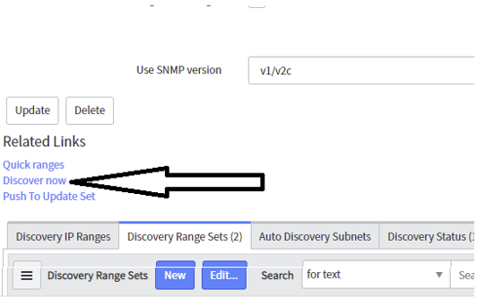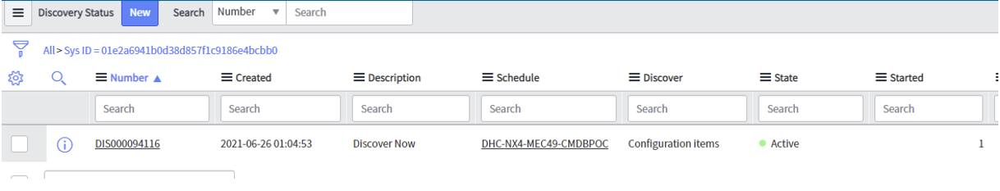

Once completed, get inside of the Discovery Status record to validate the scan of the CI, (see below image) under the **related list** select the section for **Devices**. You will be able to see the CI with a status of Created the first time and Updated for next Scans.

**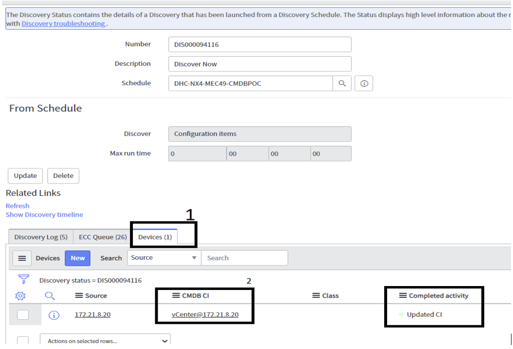**

# Event Collector configuration for vCenter events

## Create the Event Collector

**Steps: -**

Write in the left navigation pane **event collector**, select the option for vCenter Event Collectors as shown below, then click on new.

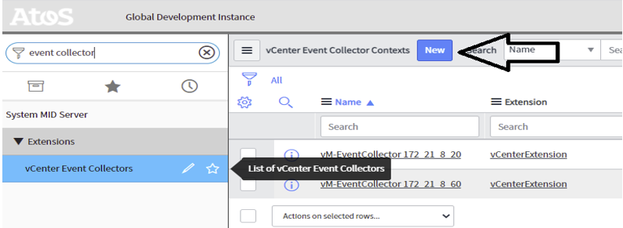

Fill the fields, accordingly, select the mid server to use for the Event configuration and the vCenter to be monitored from its events as shown in the below image. Click on Submit.

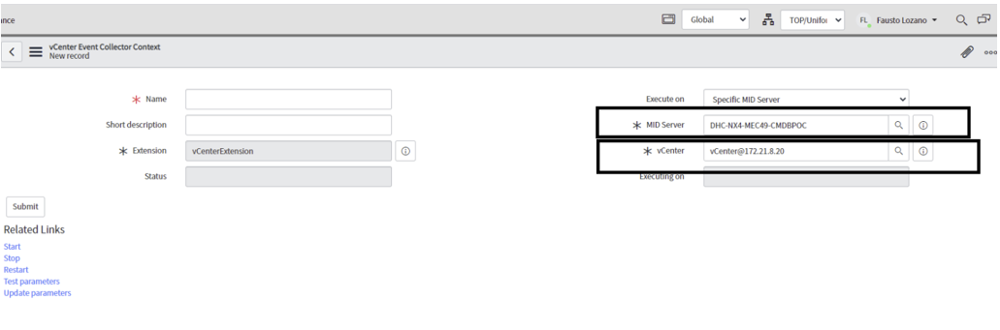

Open again the record you have created. Now you can see the reference to the vCenter Event table. Click on Edit to see the Slush bucket and select only VMCreatedEvent and VMClonedEvent. In order to reduce ecc queue load only these two events shall trigger an adhoc cmdb update for now, ensuring new VMs get visible on CMDB (changes to VMs would only be visible after next scheduled discovery run). Click Save.

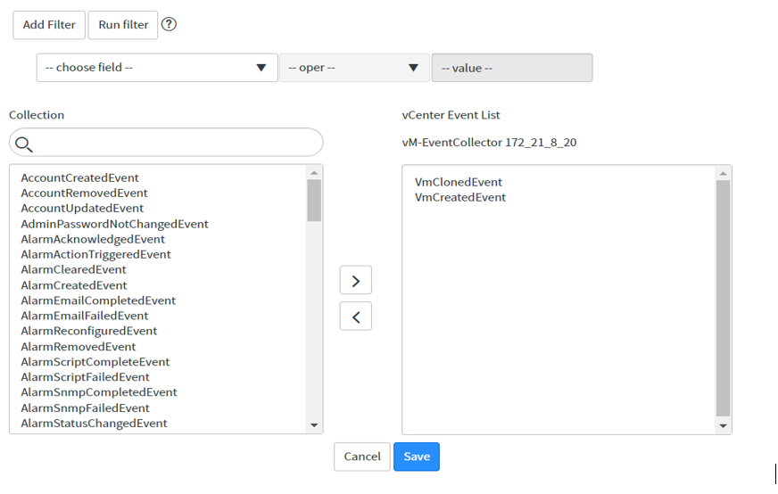

Once back to the record Form Start the service. Select from the Related Links section Start. The service Status should be visible as Started.

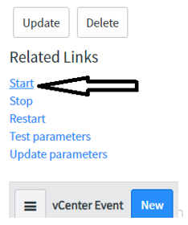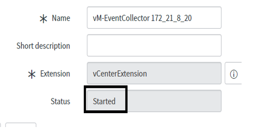

In the same section click on Test parameters to validate that the parameters added to the configuration.

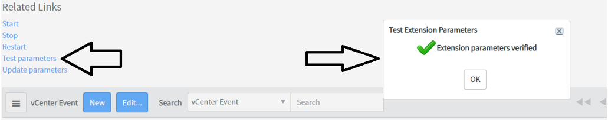

## Testing the Event Collector events

**Steps: -**

All the Event Collector events are created in the table sysevent.list which contain the list of all the events In service Now. To identify Event collector records open the table filter by **automation.vcenter** on the **Name** column.

With the help of the Deployment manager/Integration architect do the below tests and validate in the Virtual Servers the modifications committed from the vCenter console. (You don’t need to rescan the vCenter for these tests).

1.- **Create a new virtual machine**

**Data Validation**

Check for the last created Event records in sysevent table with the name **automation.vcenter** and search the Event for **Creating** the Virtual Server.
Open the table cmdb_ci_vmware_instance.list and filter by the vCenter containing the new Virtual Server. Search for the new item created.

**Important:**

**Notice** that to see the virtual Server created in this case you need **to re-run** the vCenter discovery schedule. (As mentioned in below heading **Fixes**, the Event collector functionality is not working with full features currently and this issue is not fixed yet. So, Virtual Servers are still not created automatically without running the Discovery schedule.)

2.- **Power off** the Virtual Server

**Data Validation**

Check for the last created Event records created in sysevent table with the name **automation.vcenter** and identify the Event for **power off** the Virtual Server.

As we did before write in the left navigation pane the name of the table **cmdb_ci_vm_instance.list** to open the **vm instance** table, search for the Virtual Server and validate in the column **State** the value modified as **Off**.

3.- **Power on** Virtual Server

**Data Validation**

Check for the last created Event records in sysevent table with the name **automation.vcenter** and identify the Event for **power on** the Virtual Server.
As we did before write in the left navigation pane the name of the table cmdb_ci_vm_instance.list to open the **vm instance** table, search for the Virtual Server with the State Column as **On**.

4.- Change the **number of cpu's** from the Virtual Server.

**Data Validation**

Check for the last created Event records in sysevent table with the name **automation.vcenter** and identify the Event for the modification to the **cpu’s** on the Virtual Server.
Open the table cmdb_ci_vmware_instance.list filter by the vCenter containing the Virtual Server modified, search for the Virtual Server and validate the number of **cpu’s** are changed.

# Event Collector fix

Historical issue case **CS5446939** (Child ticket **CS5625418)** opened with ServiceNow Support was fixed and vCenter Events shall lead to successful and immediate CI updates as of Q1/2022 - no further work arounds and business rules required to ensure event triggered discovery in global ATF2 DEV/CAT/PROD instance instances.

# Workaround for Event Collector functionality

Create a Business Rule as described below: -

**Steps: -**

Select the Update Set

Type Business Rules in Filter Navigator, open Business Rules table and click on New

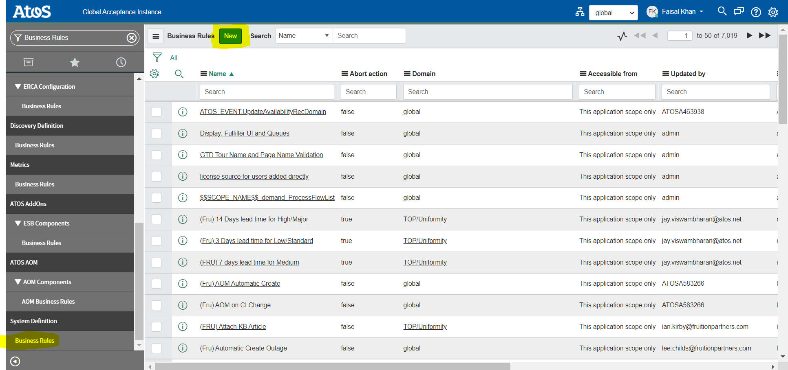

Add below values, also shown in screenshots

**Table:** ecc_queue

**Domain:** global

**Active:** True

**Advanced:** True

click on **when to run** tab

**When:** before

**Insert:** True

**Filter conditions:** source is IP address of the VCenter. Example Source is 172.22.32.20

click on **Advanced** tab

**Script** Add line in script 'current.agent="MID SERVER OF CUSTOMER";' Example: current.agent="mid.server.DHC-NX2-GRE22-CMDBCATPOC";

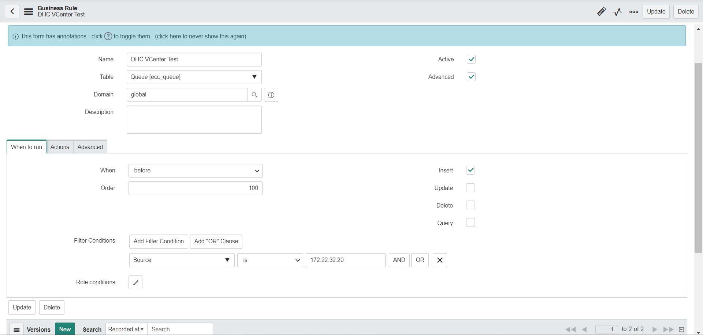

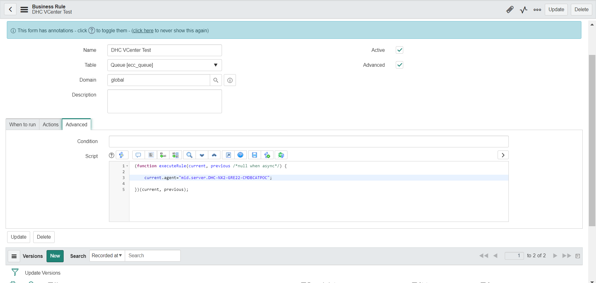

Save the record.

# Future improvements

Moving customer VMware VM Instance CIs on shared VCSs into customer domain/FO.
To update the CI's in customer domain the user is required to have Domain visibility of the customer.
Changing the Domain of the mid server user to TOP Domain which is a Parent Domain of Shared and customer domains.

1- Discover CI’s in shared domain

CI’s are created in (Domain Atos DC Shared CI and Company AtoS VCS CIs) when running the vCenter scan

2- Move and rediscover CI in Customer Domain

CI’s are still updated when running the vCenter Discovery from Shared Domain to Target Domains where they are changed, for purposes of this test we use OFFICE DEPOT AND SIEMENS MMSA Domains as targets se sample image below:

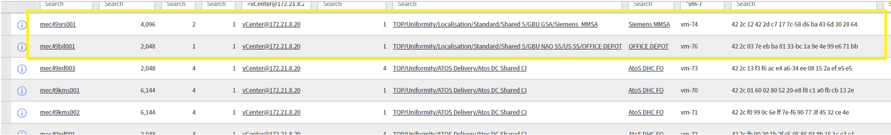

# Support/Escalations

The following persons can be reached out to via email:

- globaldiscoveryservice <globaldiscoveryservice@atos.net>  (Group Mailbox)
- Product owner Discovery: Sharma, Pradeep <pradeep.sharma@atos.net> (previously: Chougale, Tanaji <tanaji.chougale@atos.net>)
