# VCS Storage vMotion for DR Protected Virtual Machines

## Table of Contents

- [VCS Storage vMotion for DR Protected Virtual Machines](#vcs-storage-vmotion-for-dr-protected-virtual-machines)
  - [Table of Contents](#table-of-contents)
  - [Introduction](#introduction)
    - [Purpose](#purpose)
    - [Audience](#audience)
    - [Scope](#scope)
    - [Prerequisites](#prerequisites)
  - [Action Plan](#action-plan)
    - [Check DR Protection Status and remove DR protection from Virtual Machine](#check-dr-protection-status-and-remove-dr-protection-from-virtual-machine)
    - [Perform storage vMotion of Virtual Machine](#perform-storage-vmotion-of-virtual-machine)
    - [Verify Virtual Machine Functionality](#verify-virtual-machine-functionality)
    - [Enable DR protection on Virtual Machine](#enable-dr-protection-on-virtual-machine)
    - [Update Virtual Machine `UHC-SN-DR-PROTECTION-GROUP` tag](#update-virtual-machine-uhc-sn-dr-protection-group-tag)
    - [ServiceNow CMDB update](#servicenow-cmdb-update)
    - [Verify Virtual Machine Functionality](#verify-virtual-machine-functionality-1)
    - [Enable DR protection on Virtual Machine](#enable-dr-protection-on-virtual-machine-1)
    - [Update Virtual Machine `UHC-SN-DR-PROTECTION-GROUP` tag](#update-virtual-machine-uhc-sn-dr-protection-group-tag-1)
    - [ServiceNow CMDB update](#servicenow-cmdb-update-1)
  - [Changelog](#changelog)

## Introduction

### Purpose

These work instructions outline the procedure for performing Storage vMotion for Disaster Recovery (DR) protected Virtual Machines (VMs). Storage vMotion ensures seamless migration of VMs between datastores while maintaining high availability and ensuring disaster recovery readiness.

### Audience

- VCS Engineers
- VCS Architects

### Scope

The Instruction assumes that the reader has reasonable grasp of VCS infrastructure and VMware components.

### Prerequisites

- Access to the vCenter
- Access to the HashiVault
- Client Aviva visibility in ServiceNow
- Basic vCenter Knowledge
- Access to VMware vSphere environment.
- Proper permissions to perform Storage vMotion operations.
- Understanding of DR protection policies and configurations.
- Backup and verify critical data before initiating the Storage vMotion process.
- Approval via email to perform activity
- ServiceNow change request to perform activity

## Action Plan

### Check DR Protection Status and remove DR protection from Virtual Machine

> Caution:  
> Based on [KB78521](https://kb.vmware.com/s/article/78521) article, before performing storage vMotion we need to remove > DR protection from Virtual Machine.

1. Log in to VMware vSphere Client via `https://<locationCode>vcs002.<domainName>` with `administrator@vsphere.local` user account and from left menu click `Site Recovery`:  

    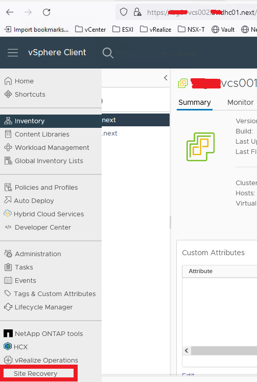

2. Click `OPEN Site Recovery`

    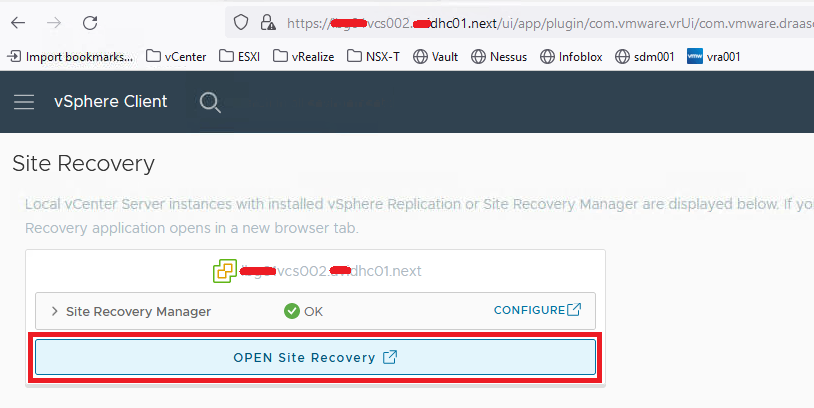

3. Provide credentials for DR site `administrator@vsphere.local` account and click `LOG IN`

    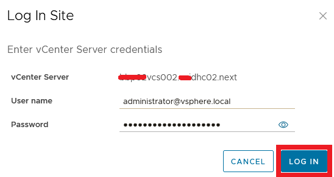

4. On the Site Recovery home tab, select a site pair, and click `VIEW DETAILS`  

    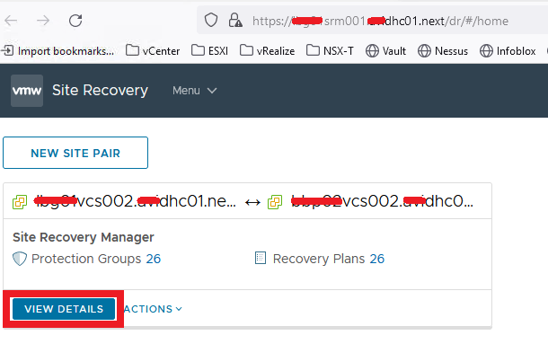

    > Caution:  
    > Ensure that the VM is currently protected by the Disaster Recovery (DR) solution.  
    > Verify that there are no ongoing DR operations or scheduled failovers for the VM.

5. Click the `Protection Groups` tab, select a protection group, and on the right pane, click the `Virtual Machines` tab
6. Right-click a virtual machine and click `Remove Protection` and click `Yes` to confirm the removal of protection from the virtual machine.

    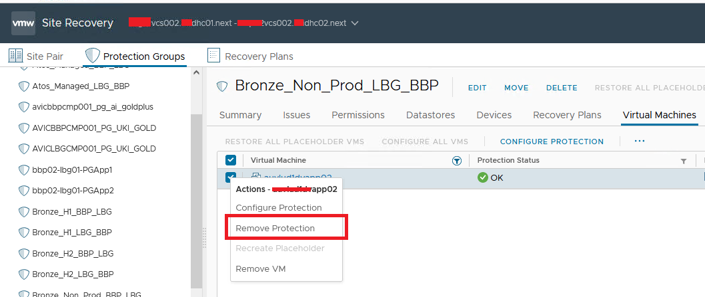

### Perform storage vMotion of Virtual Machine

1. Log in to VMware vSphere Client via `https://<locationCode>vcs001.<domainName>` or `https://<locationCode>vcs002.<domainName>` with `<dasId>@<domainName>` user account, go to the `VMs and Templates` view in the vSphere Client and locate the Virtual Machine that needs to be migrated using Storage vMotion  

    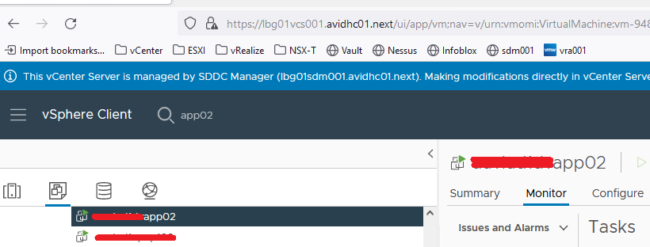

2. Right-click on the Virtual Machine to be migrated, choose `Migrate` from the context menu  

    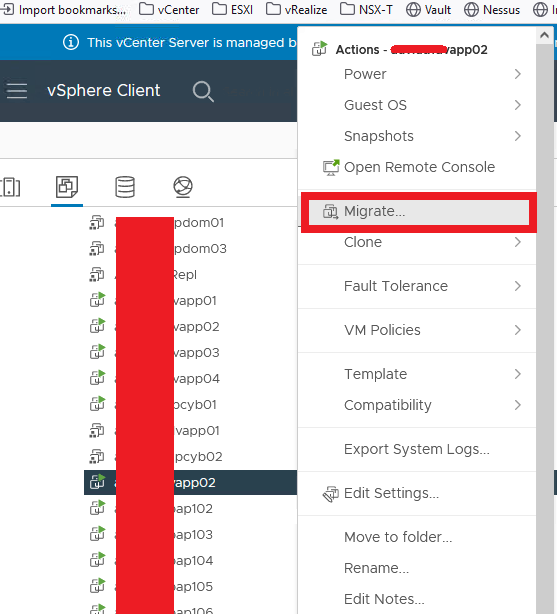
  
3. Choose `Change storage only` as the migration type, and click `NEXT` to proceed  

    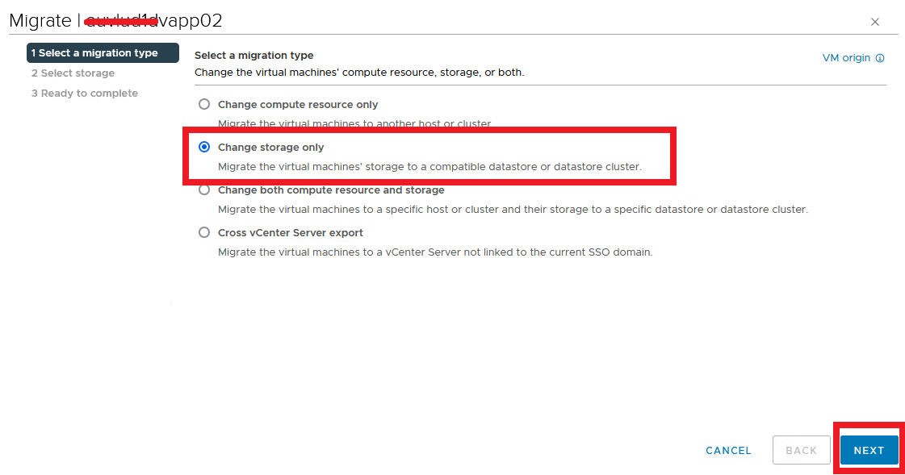

4. Select the destination datastore where the Virtual Machine will be migrated, ensure that the destination datastore is compatible with the DR solution and meets the required performance criteria, and click `NEXT` to continue  

    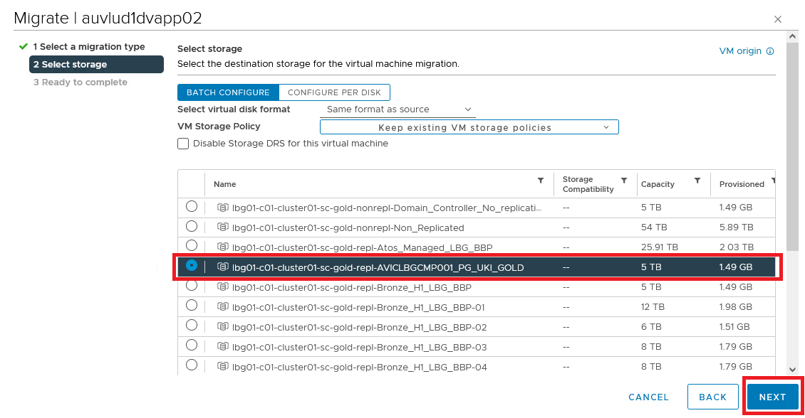

5. Review the details of the Storage vMotion operation, including the Virtual Machine name, source datastore, destination datastore, and any advanced options, verify that the migration settings align with DR protection requirements, and click `FINISH` to start the migration process  

    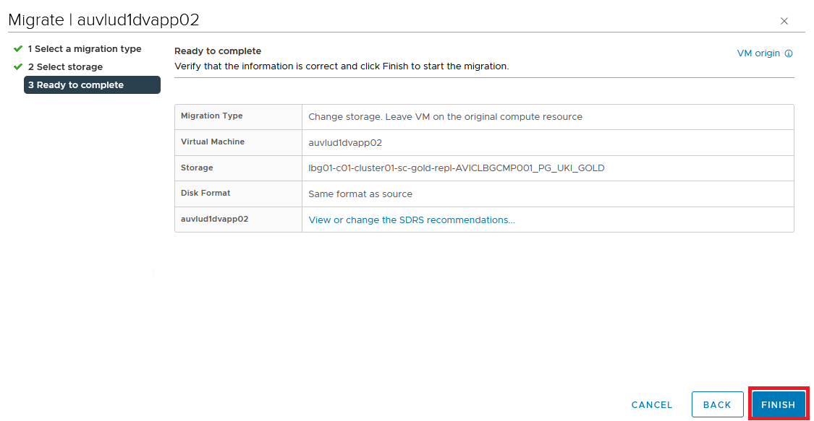

> Caution:  
> Monitor the progress of the storage vMotion operation from the vSphere Client.  
> Depending on the size of the VM and the network/storage performance, the migration may take some time to complete.

### Verify Virtual Machine Functionality

- once the storage vMotion process is complete, verify the functionality of the migrated Virtual Machine
- ensure that all applications and services hosted on the Virtual Machine are functioning as expected
- validate that there are no performance issues or data integrity issues

### Enable DR protection on Virtual Machine

1. Log in to VMware vSphere Client via `https://<locationCode>vcs002.<domainName>` with `administrator@vsphere.local` user account   and from left menu click `Site Recovery`  

    

2. Click `OPEN Site Recovery`  

    

3. Provide credentials for DR site `administrator@vsphere.local` account and click `LOG IN`  

    

4. On the Site Recovery home tab, select a site pair, and click `VIEW DETAILS`  

    

5. Click the `Protection Groups` tab, select a protection group, and on the right pane, click the Virtual Machines tab  

    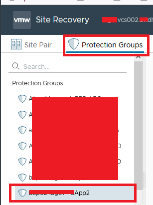

6. Right-click a virtual machine and click `Configure Protection`  

    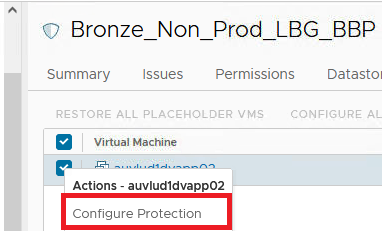

### Update Virtual Machine `UHC-SN-DR-PROTECTION-GROUP` tag

1. Log in to VMware vRealize Automation via `https://<locationCode>vra001.<domainName>` with `<dasId>@<domainName>` user account and in `My Services` click `Assembler`  

    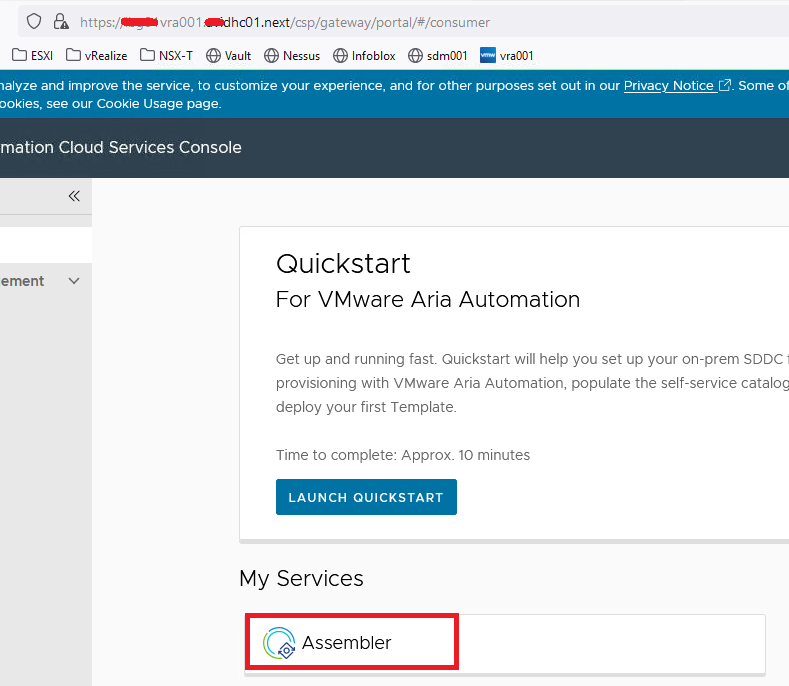

2. From `Resources` choose `Virtual Machines`  

    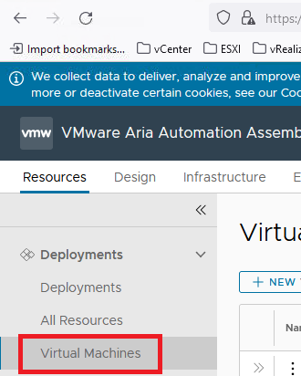

3. Click `...` and `Update Tags`  

    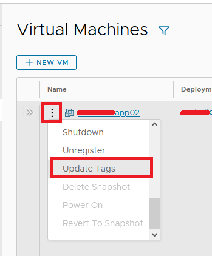

4. Select `UCH-SN-DR-PROTECTION-GROUP` tag and click `pencil` button  

    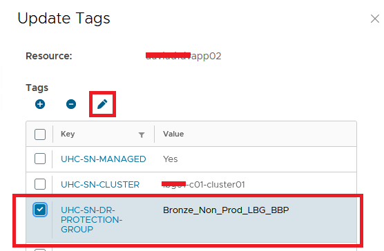

5. Change Value to the current storage and click `APPLY`  

    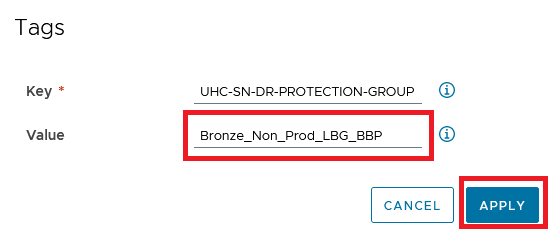

6. Updated tag should be visible in tags section  

    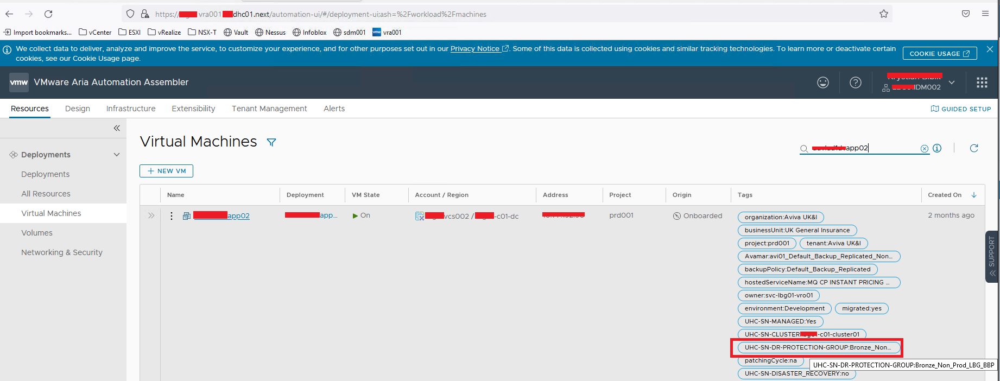

### ServiceNow CMDB update

1. Log in to VMware vRealize Automation via `https://<locationCode>vra001.<domainName>` with `<dasId>@<domainName>` user account and in `My Services` click `Orchestrator`

    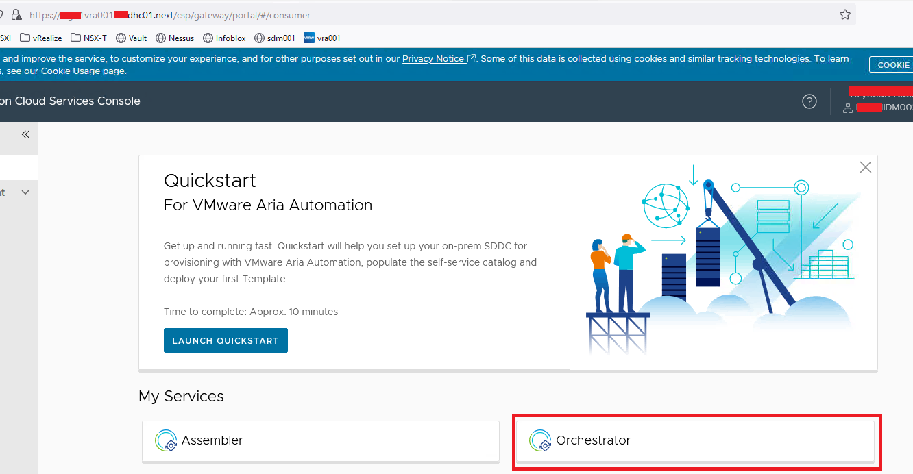

2. Select `Library` > `Actions` and type in filter `updateCmdbAviva` action and click `OPEN`  

    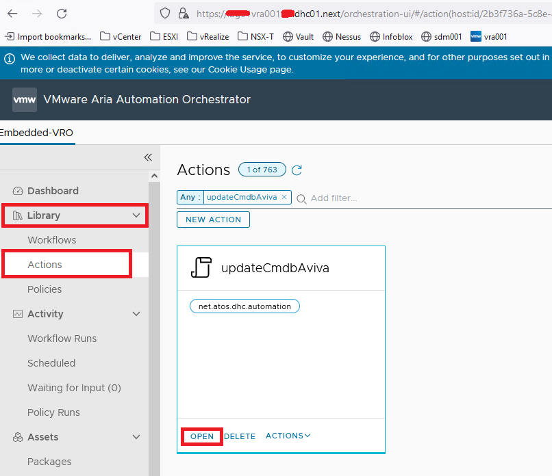

3. On `updateCmdbAviva` action click `RUN`  

    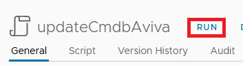
  
4. Fill in the required fields with updated DR policy and name of DR protected Virtual Machine and click `RUN`  

    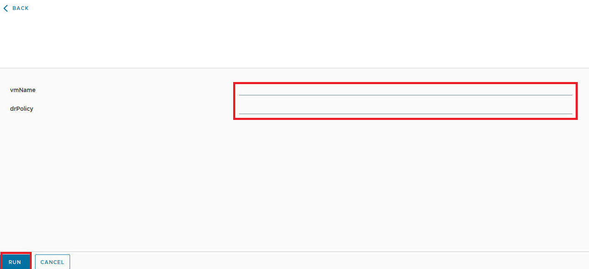

5. Validate in ServiceNow CMDB if configuration `Quota` entry has been changed  

    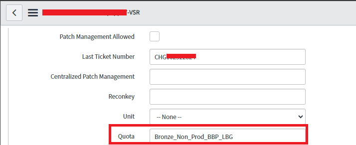

    > Caution:  
    > To update ServiceNow CMDB, please use VMware vRealize Orchestrator `updateCmdbAviva` action.  
    > If action failed, request a manual ServiceNow CMDB update of configuration `Quota` entry.

6. Review the details of the Storage vMotion operation, including the Virtual Machine name, source datastore, destination datastore, and any advanced options, verify that the migration settings align with DR protection requirements, and click `FINISH` to start the migration process.

    

Caution:  
Monitor the progress of the storage vMotion operation from the vSphere Client.  
Depending on the size of the VM and the network/storage performance, the migration may take some time to complete.

### Verify Virtual Machine Functionality

- once the storage vMotion process is complete, verify the functionality of the migrated Virtual Machine
- ensure that all applications and services hosted on the Virtual Machine are functioning as expected
- validate that there are no performance issues or data integrity issues

### Enable DR protection on Virtual Machine

1. Log in to VMware vSphere Client via `https://<locationCode>vcs002.<domainName>` with `administrator@vsphere.local` user account   and from left menu click `Site Recovery`  

    

2. Click `OPEN Site Recovery`  

    

3. Provide credentials for DR site `administrator@vsphere.local` account and click `LOG IN`  

    

4. On the Site Recovery home tab, select a site pair, and click `VIEW DETAILS`  

    

5. Click the `Protection Groups` tab, select a protection group, and on the right pane, click the Virtual Machines tab  

    

6. Right-click a virtual machine and click `Configure Protection`  

    

### Update Virtual Machine `UHC-SN-DR-PROTECTION-GROUP` tag

1. Log in to VMware vRealize Automation via `https://<locationCode>vra001.<domainName>` with `<dasId>@<domainName>` user account and in `My Services` click `Assembler`  

    

2. From `Resources` choose `Virtual Machines`  

    

3. Click `...` and `Update Tags`  

    

4. Select `UCH-SN-DR-PROTECTION-GROUP` tag and click `pencil` button  

    

5. Change Value to the current storage and click `APPLY`  

    

6. Updated tag should be visible in tags section  

    

### ServiceNow CMDB update

1. Log in to VMware vRealize Automation via `https://<locationCode>vra001.<domainName>` with `<dasId>@<domainName>` user account and in `My Services` click `Orchestrator`

    

2. Select `Library` > `Actions` and type in filter `updateCmdbAviva` action and click `OPEN`  

    

3. On `updateCmdbAviva` action click `RUN`  

    
  
4. Fill in the required fields with updated DR policy and name of DR protected Virtual Machine and click `RUN`  

    

5. Validate in ServiceNow CMDB if configuration `Quota` entry has been changed  

    

> Caution:  
> To update ServiceNow CMDB, please use VMware vRealize Orchestrator `updateCmdbAviva` action.  
> If action failed, request a manual ServiceNow CMDB update of configuration `Quota` entry.

## Changelog

| Version | Date       |               | Author         |
|---------|------------|---------------|----------------|
| 0.1     | 20/02/2024 | First version | Krystian Bibik |
