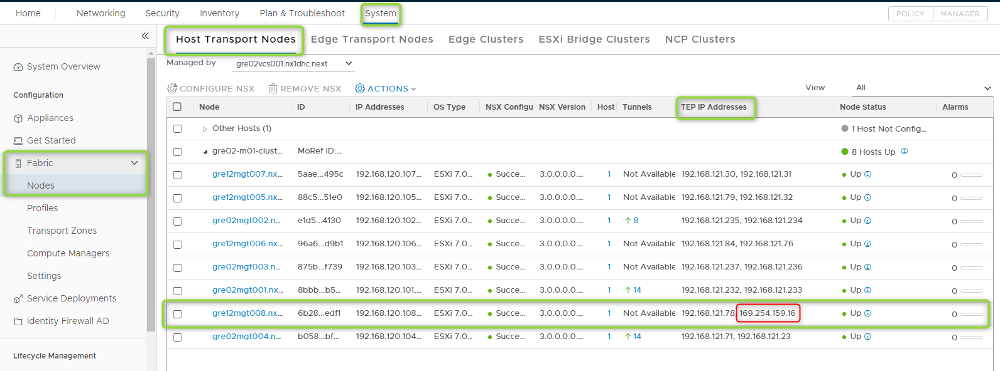
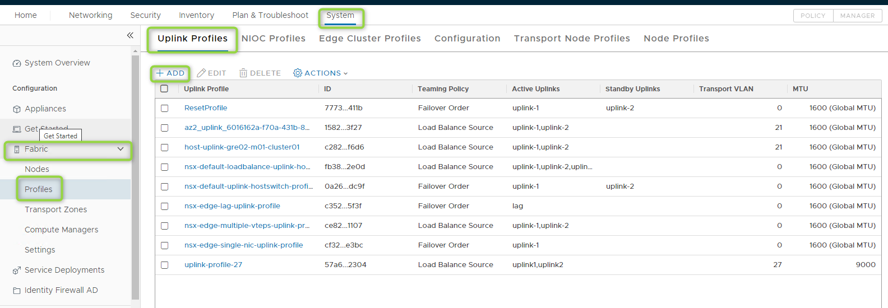
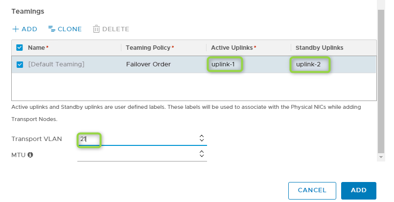
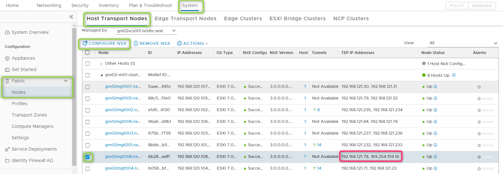
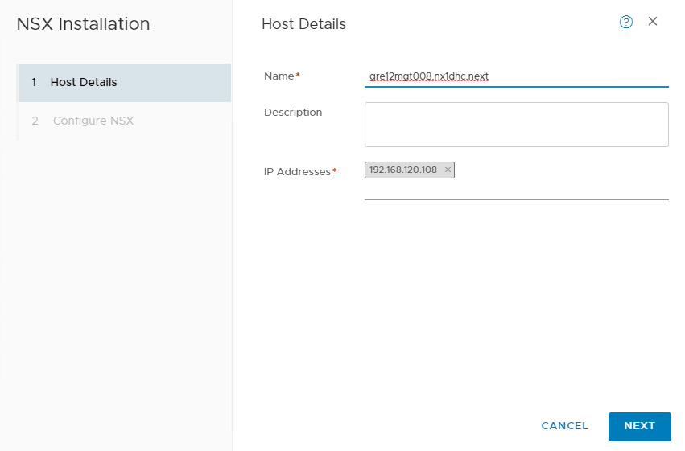
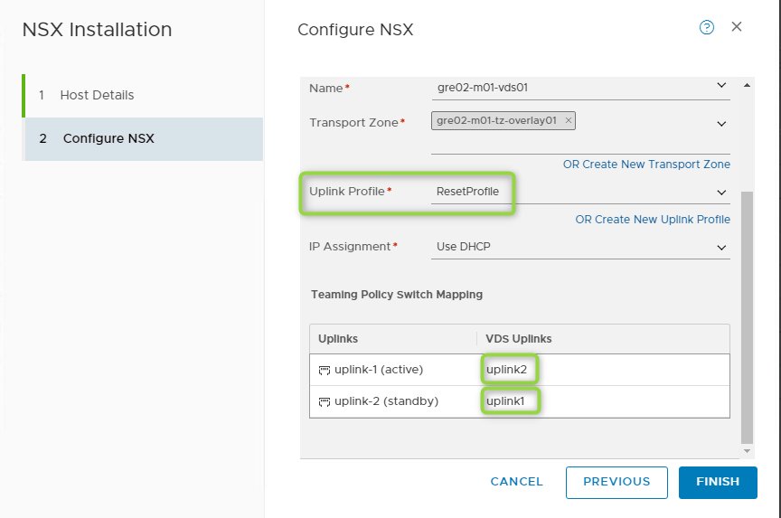
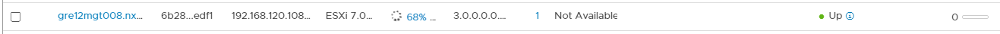
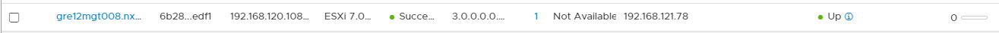
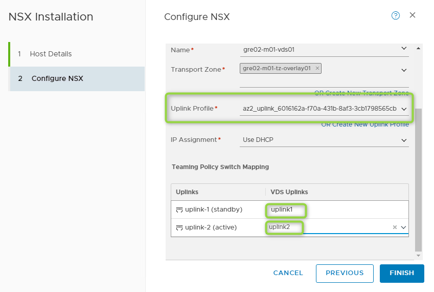

# Stretch Cluster Troubleshooting

## Changelog
  
| Date       | Description              | Author       |
| ---------- | ------------------------ | --------------- |
| 31/08/2020 | NSX-T VCS Problem | Pawel Zurawski |
| 15/12/2020 | Typos correction | Pawel Zurawski |

## Introduction

### Purpose

Provide solutions for known errors that can happen when stretching a VCS cluster, and need manual intervention.

### Audience

- VCS Operations
- VCS Engineers

### Scope

- Incorrect IP assignment on ESXi

## Problems description and troubleshooting

### IP address was not correctly assigned to one of VTEP interfaces for ESXi

1. Check if IP addresses was correctly assigned. In NSX-T Manager under System > Fabric > Nodes > Host Transport Nodes > < cluster >

   

2. If IP addresses was not assigned correctly create New Profile under System > Fabric > Profiles > Uplink Profiles

   

3. In Name field type "Reset Profile", go to Teaming section and choose following options

   Active Uplinks: uplink-1
   Standby Uplinks: uplink-2
   Transport VLAN: choose NSX-T Host Transport Nodes VLAN

   

4. Assign new Uplink Profile to ESXi Host Transport Node that has problems under:

   System > Fabric > Nodes > Host Transport Nodes > < cluster > > < node > > CONFIGURE NSX

   

   Leave first section unchanged:

   

   Change only following fields:

   - Uplink Profile: ResetProfile
   - uplink-1(active): choose interface that did not receive correct IP address
   - uplink-2(standby): choose second interface

   When new Uplink Profile will be chosen error message appear that Teaming Policy was cleared, this is expected and correct behaviour

   

   Wait till new Uplink Profile will be applied:

   
   

5. Change profile to correct profile again

   
