# VCS Test Plan

# Changelog

| Date       | TOS     | Issue       | Author             | Description                                                                                                                                       |
|------------|---------|-------------|--------------------|---------------------------------------------------------------------------------------------------------------------------------------------------|
| 2021.05.05 | VCS 1.3 | DHC-1986    | Marcin Kujawski    | Update for vCF 4.1 and VCS 1.3                                                                                                                    |
| 2022.07.14 | VCS 1.6 | CESDHC-422  | Kacper Kuliberda   | Add info about Test 1 automation                                                                                                                  |
| 2022.08.31 | VCS 1.6 | CESDHC-430  | Kacper Kuliberda   | Add info about Test 27 automation                                                                                                                 |
| 2022.08.31 | VCS 1.6 | CESDHC-439  | Jakub Zielinski    | Added info about Test 32 automation                                                                                                               |
| 2022.09.15 | VCS 1.6 | CESDHC-327  | Marcelino Sanchez  | Added info about Test 27 partial automation                                                                                                       |
| 2022.09.19 | VCS 1.6 | CESDHC-425  | Marcelino Sanchez  | Added Test 17 and updated test numbering                                                                                                          |
| 2022.10.13 | VCS 1.6 | CESDHC-415  | Marcelino Sanchez  | Updated vRA Cloud tests                                                                                                                           |
| 2022.10.17 | VCS 1.6 | CESDHC-4158 | Shyjin Varaprath   | Added Test 9,9a,15,15a,17,42,57,58 and updated test numbering                                                                                     |
| 2022.10.27 | VCS 1.6 | CESDHC-525  | Bojan Dragic       | Corrected HA Test                                                                                                                                 |
| 2022.12.08 | VCS 1.6 | CESDHC-5056 | Jakub Zielinski    | changes in test enumeration, bringing back manual instruction of automated tests, mentioning of createVraCloudToken.yml and executeInfraTests.yml |
| 2022.12.14 | VCS 1.6 | CESDHC-4949 | Michał Sobieraj    | Add EVC mode Test                                                                                                                                 |
| 2023.09.01 | VCS 1.8 | VCS-10129   | Piotr Lewandowski  | Add Backup SSRs Test                                                                                                                              |
| 2023.09.05 | VCS 1.8 | VCS-10130   | Karol Gomułkiewicz | Add Subscribed CL Test                                                                                                                            |

## Introduction

This Test Report provides documentary evidence of the completion of the technical build for the VMware Cloud Services.

### Purpose

Validate VCS infrastructure after deployment using step-by-step instructions.

### Audience

- Integration Architects
- VCS Build Engineers
- VCS Deployment Managers
- Cloud Tower Service Managers

### Scope

The scope of this document is verification of the technical build which includes:

- Successful implementation of VCS customer tenant.
- Successful implementation of all VCS functions including monitoring and reporting.
- Successful implementation of 3rd party services: CEB, ServiceNow, CMP (optional).

Elements that are out of scope:

- Service Process setup
- Staff Training

### Related Documents

This document is a subset of Atos Technology Lifecycle Management (ATLM) artefacts.

| Document                  | Document Name                                                  |
|---------------------------|----------------------------------------------------------------|
| VMware Cloud Services: HLD | [hldDigitalHybridCloud.md](../design/hldDigitalHybridCloud.md) |
| VCS Infrastructure: LLD   | [lldInfrastructure.md](../design/lldInfrastructure.md)         |
| VCS Service Catalog: LLD  | [lldServiceCatalog.md](../design/lldServiceCatalog.md)         |
| Naming Convention         | [namingConvention.md](../design/namingConvention.md)           |

# Used abbreviations

| Abbreviation | Description                    |
|--------------|--------------------------------|
| CDE          | Customer Dedicated Environment |
| VCS          | VMware Cloud Services          |
| ToS          | Turnover to Services           |
| ToP          | Turnover to Production         |
| CE           | Customer Engagement            |
| SSR          | Standard Service Request       |

# Infrastructure Requirements

1. VCS instance deployed after hardening stage.
2. All integrations implemented and finished (CEB, CMP, ServiceNow).
3. Platform Administrative account created with correct permissions in the VCS mgmt Active Directory.
4. Proper Permissions for Customer Tenant organization onvRA Cloud.
5. Access to Ansible Core VM in VCS.

# Assumptions

There is an assumption that the engineers following this process have:

- an understanding of VMware products and can navigate vCenter and vRA Cloud/Cloud Partner Navigator
- an understanding of VCS design
- an understanding how to run ansible playbooks
- sufficient privileges to access vCenter and vRA Cloud/Cloud Partner Navigator

# VCS password manager (Hashi Corp Vault)

VCS uses Hashi Corp Vault Password Manager. VCS platform administrators have privileges to login and **read** passwords from Vault.

>Warning. Credentials for all components are stored during deploy, refreshed in the hardening stage phase automatically. It is also valid for playbooks in the manage (production phase). Adjusting credentials manually will result later in failures in automation.

- connect to the password manager via web on port 8200, change method to **LDAP**. Use login in UPN format `<username>@<customerCode>dhc<instanceNumber>.next`
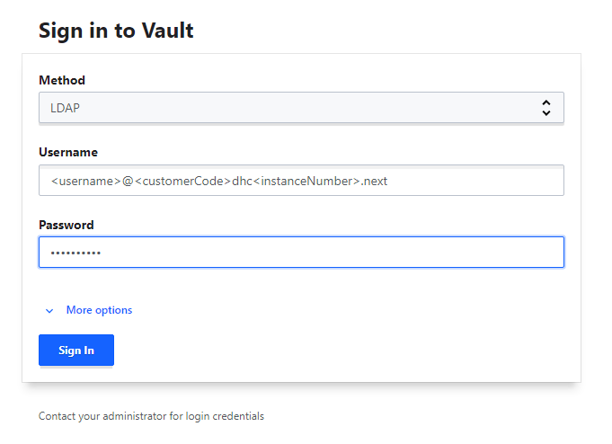

- navigate through secrets path to find credentials you are looking for
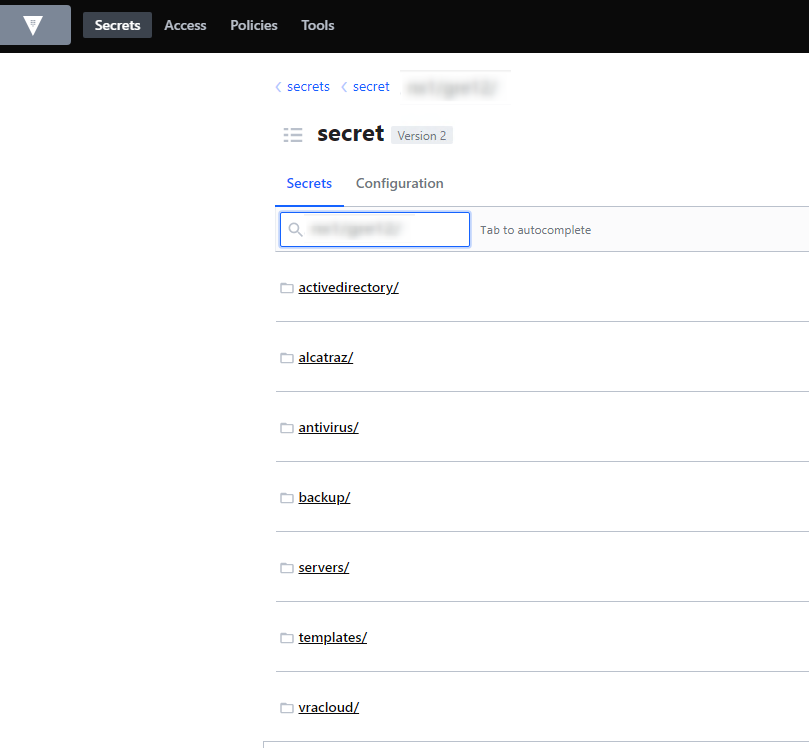

# Overview of steps involved

In general, testing is conducted from 2 perspectives:

- Customer Perspective (Workload hosting, Service Catalogue Automation)
- Cloud Operations perspective (Management infrastructure)

## Test method

Team members from the test team will act as the customer, will be instructed to behave as such. This means they will not use their technical knowledge to resolve issues or alter the system/application configuration if things do not work as expected.

Issues will be logged in a copy of the aforementioned Test Plan which will be dedicated to a specific build project.  
Issues shall be passed on to the build/development team for further investigation and resolution.  
Once a specific issue is fixed, a retest will take place.  
Tests shall be executed in parallel, if possible from technical and manpower point of view.

## Planning and tests list

| No.      |Type                |Description                                                                 |Result (Success/Failure)|
|----------|--------------------|----------------------------------------------------------------------------|------------------------|
| SDDC-1   | SDDC Management    | Check SDDC licenses                                                        |                        |
| SDDC-2   | SDDC Management    | Check SDDC bundles version                                                 |                        |
| SDDC-3   | SDDC Management    | Check vRealize Lifecycle Manager is deployed successfully                  |                        |
| SDDC-4   | SDDC Management    | Check Workload Domains status - MGT and CMP                                |                        |
| SDDC-5   | SDDC Management    | Check and validate vCenter connectivity in SDDC Manager                    |                        |
| SDDC-6   | SDDC Management    | Check health status of Clusters and Hosts in SDDC Manager                  |                        |
| SDDC-7   | SDDC Management    | Check certificates are created for vCF components                          |                        |
| SDDC-8   | SDDC Management    | Check backup settings                                                      |                        |
| SDDC-9   | SDDC Management    | Check and validate vMotion & vSAN network pool for sufficient free IPs     |                        |
| SDDC-10  | SDDC Management    | Perform an update precheck for the workload domains                        |                        |
| INFRA-1  | VCS Infrastructure | Check access to vCenter Servers                                            |                        |
| INFRA-2  | VCS Infrastructure | Check health status of Clusters in vCenter                                 |                        |
| INFRA-3  | VCS Infrastructure | Check health status of Hosts in vCenter ????                               |                        |
| INFRA-4  | VCS Infrastructure | Check vSphere general functionality: vMotion                               |                        |
| INFRA-5  | VCS Infrastructure | Check vSphere general functionality: HA                                    |                        |
| INFRA-6  | VCS Infrastructure | Check DRS status for each cluster in vCenter                               |                        |
| INFRA-7  | VCS Infrastructure | Check vCenter AD integration using LDAPS and service account               |                        |
| INFRA-8  | VCS Infrastructure | Verify if vROPs is synchronizing accounts with AD and vIDM                 |                        |
| INFRA-9  | VCS Infrastructure | Check vROps cluster health & Adapter instances data collection status      |                        |
| INFRA-10 | VCS Infrastructure | Check access to DNS                                                        |                        |
| INFRA-11 | VCS Infrastructure | Check access to Active Directory                                           |                        |
| INFRA-12 | VCS Infrastructure | Check Active Directory Domain Services                                     |                        |
| INFRA-13 | VCS Infrastructure | Check NSX-T configuration for Management                                   |                        |
| INFRA-14 | VCS Infrastructure | Check NSX-T configuration for Workload                                     |                        |
| INFRA-15 | VCS Infrastructure | Check LogInsight configuration                                             |                        |
| INFRA-16 | VCS Infrastructure | Check vRSLCM configuration                                                 |                        |
| INFRA-17 | VCS Infrastructure | Check vROPS configuration                                                  |                        |
| INFRA-18 | VCS Infrastructure | Check proper licenses are applied for VCS components (vCenter, ESXi hosts) |                        |
| INFRA-19 | VCS Infrastructure | Check the vSAN cluster configuration and health                            |                        |
| INFRA-20 | VCS Infrastructure | Check for disk groups, SSDs used for vSAN                                  |                        |
| INFRA-21 | VCS Infrastructure | Check Storage Policy Compliance on vSAN                                    |                        |
| INFRA-22 | VCS Infrastructure | Check Terminal Server configuration and license                            |                        |
| INFRA-23 | VCS Infrastructure | Check Anti-Virus Deep Security agents status                               |                        |
| INFRA-24 | VCS Infrastructure | Check with BDS team status of Anti-Virus protection                        |                        |
| INFRA-25 | VCS Infrastructure | Check monitoring for management machines                                   |                        |
| INFRA-26 | VCS Infrastructure | Check access and secrets availability in HashiCorp Vault                   |                        |
| INFRA-27 | VCS Infrastructure | Check domain membership of management servers                              |                        |
| INFRA-28 | VCS Infrastructure | Check status of vSAN encryption in vCenter                                 |                        |
| INFRA-29 | VCS Infrastructure | Check status of vSAN encryption in KMS servers                             |                        |
| INFRA-30 | VCS Infrastructure | Verify Event Management                                                    |                        |
| INFRA-31 | VCS Infrastructure | Check Internet Proxy functionality, whitelist/blacklist                    |                        |
| INFRA-32 | VCS Infrastructure | Reporting and Billing                                                      |                        |
| INFRA-33 | VCS Infrastructure | Ansible Python Virtual Environment                                         |                        |
| INFRA-34 | VCS Infrastructure | Check DR execution in case of A/P or A/A DR setup using vSphere SRM        |                        |
| HARD-1   | VCS Hardening      | Admin account creation in the management domain                            |                        |
| HARD-2   | VCS Hardening      | Patching of the management stack VMs (Linux & Windows)                     |                        |
| HARD-3   | VCS Hardening      | Firewall rules implementation - NSX-T microsegmentation                    |                        |
| HARD-4   | VCS Hardening      | VCS Hardening - Alcatraz Compliance management                             |                        |
| HARD-5   | VCS Hardening      | Nessus Vulnerability scanning                                              |                        |
| HARD-6   | VCS Hardening      | Active Directory Group Policy adjustments                                  |                        |
| HARD-7   | VCS Hardening      | Enable Kerberos WinRM transport mode                                       |                        |
| HARD-8   | VCS Hardening      | SDDC Manager reset VCF components credentials                              |                        |
| HARD-9   | VCS Hardening      | Management Servers credentials                                             |                        |
| HARD-10  | VCS Hardening      | ESXi hosts domain join                                                     |                        |
| HARD-11  | VCS Hardening      | Out of band management - remote controller card credentials (iDRAC)        |                        |
| HARD-12  | VCS Hardening      | Hardening of VCS Password Manager (HashiCorp Vault)                        |                        |
| HARD-13  | VCS Hardening      | Ansible vars and inventory cleanup                                         |                        |
| HARD-14  | VCS Hardening      | Prerequisite Virtual Machine log files transfer                            |                        |
| HARD-15  | VCS Hardening      | Confirm the availability of Nessus reports mailing cron job on ansible svr |                        |
| HARD-16  | VCS Hardening      | Confirm the license & plugins status of the Nessus server                  |                        |
| VRA-1    | vRA Cloud          | Check OS templates are imported in vCenter (CMP Cluster)                   |                        |
| VRA-2    | vRA Cloud          | Check vRA Cloud configuration                                              |                        |
| VRA-3    | vRA Cloud          | API calls verification in CAS (Code Stream) - Create VM                    |                        |
| VRA-4    | vRA Cloud          | API calls verification in CAS (Code Stream) - Power Operations             |                        |
| VRA-5    | vRA Cloud          | API calls verification in CAS (Code Stream) - Snapshot Operations          |                        |
| VRA-6    | vRA Cloud          | API calls verification in CAS (Code Stream) - Disk Operations              |                        |
| VRA-7    | vRA Cloud          | API calls verification in CAS (Code Stream) - Resize VM                    |                        |
| VRA-8    | vRA Cloud          | API calls verification in CAS (Code Stream) - Delete VM                    |                        |
| VRA-9    | vRA Cloud          | Check OS templates are synchronized with Published Content Library in vCenter (CMP Cluster)                    |                        |
| BACKUP-1 | Backup             | Check backup integration (VCS side)                                        |                        |
| BACKUP-2 | Backup             | Check backup integration (backup side)                                     |                        |
| BACKUP-3 | Backup             | Verify test backup and restore (mgt VM)                                    |                        |
| CMP-1    | CMP                | Check CMP integration                                                      |                        |
| CMP-2    | CMP                | Validate CPRs execution                                                    |                        |
| SNOW-1   | SNOW               | Validate CMDB for Customer Workload (CMP)                                  |                        |
| SNOW-2   | SNOW               | Validate CMDB for Mgmt CIs (MGT)                                           |                        |
| SNOW-3   | SNOW               | Verify Event Management                                                    |                        |
| SNOW-4   | SNOW               | Service Level Management                                                   |                        |
| SSR-1    | Day2 SSR           | Backup SSR functionality - Manage VM Backup Policy                         |                        |
| SSR-2    | Day2 SSR           | Backup SSR functionality - Backup On-Demand                                |                        |
| SSR-3    | Day2 SSR           | Backup SSR functionality - Backup Restore                                  |                        |

>Note: The screenshots are illustrative and cannot be used as source for input data.

## Testing Templates

In order to have a simple and clear view on all results, separate document is used to gather test's evidences.  
**Word template is available under [Appendix A](#appendix-a) section.**

Please use above template to record all results from VCS test plan.

# Test Plan

## SDDC Management

**Most SDDC Management tests are automated.**
In order to execute them, please logon to the ansible server and browse to `/opt/dhc/manage`. Execute playbook `executeInfraTests.yml` with the following tags:

```shell
ansible-playbook executeInfraTests.yml --tags sddc
```

>Note: you will be prompted to provide domain username, domain password, and tenant name.

The playbook will create a report in HTML format. Please see `dhcInfrastructureReport.html` file under `/backup/` for more details.

### Test SDDC-1 - Check SDDC licenses

This test is automated by `executeInfraTests.yml` playbook from `/opt/dhc/manage/` on the ansible server.

Additionally, the licenses can be gathered by executing the `generateLicensesReport.yml` playbook from `/opt/dhc/manage` on the ansible server.  
This playbook creates a report called `dhcLicensesReport.html` in `/backup/reports` on the ansible server.

Alternatively, the manual process:

|                  |                                                    |
|------------------|----------------------------------------------------|
| Test procedure   | Login to GUI of SDDC Manager                       |
| Test procedure   | Select Administrator → Licensing                   |
| Test procedure   | Check licences of all available products           |
| Expected results | SDDC Manager is open, and login is successful      |
| Expected results | Licenses are available, valid and not expired      |
| Expected results | 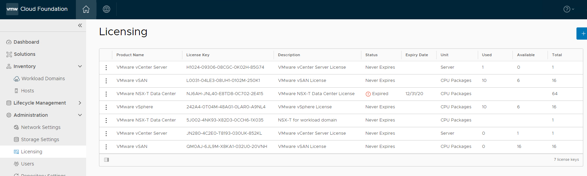 |

### Test SDDC-2 - Check SDDC bundles version

This test is automated by `executeInfraTests.yml` playbook from `/opt/dhc/manage/` on the ansible server.
Alternatively, the manual process:

|                  |                                                                        |
|------------------|------------------------------------------------------------------------|
| Test procedure   | Login to GUI of SDDC Manager                                           |
| Test procedure   | Select Repository → Bundles                                            |
| Test procedure   | Check a list of available bundles and connection to Bundles repository |
| Test procedure   | Select Administrator → Repository Settings                             |
| Test procedure   | Check whether connection to repository is Active                       |
| Expected results | SDDC Manager is open, and login is successful                          |
| Expected results | Access to bundles repository is working                                |
| Expected results | 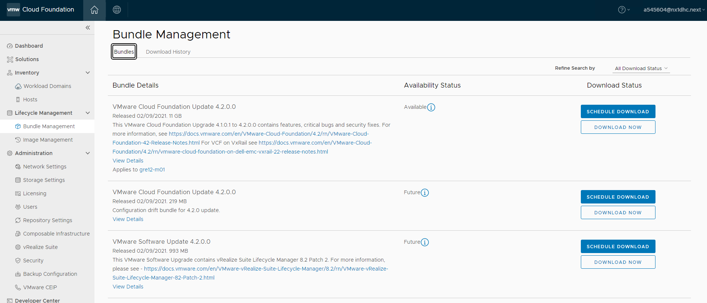                       |
| Expected results | 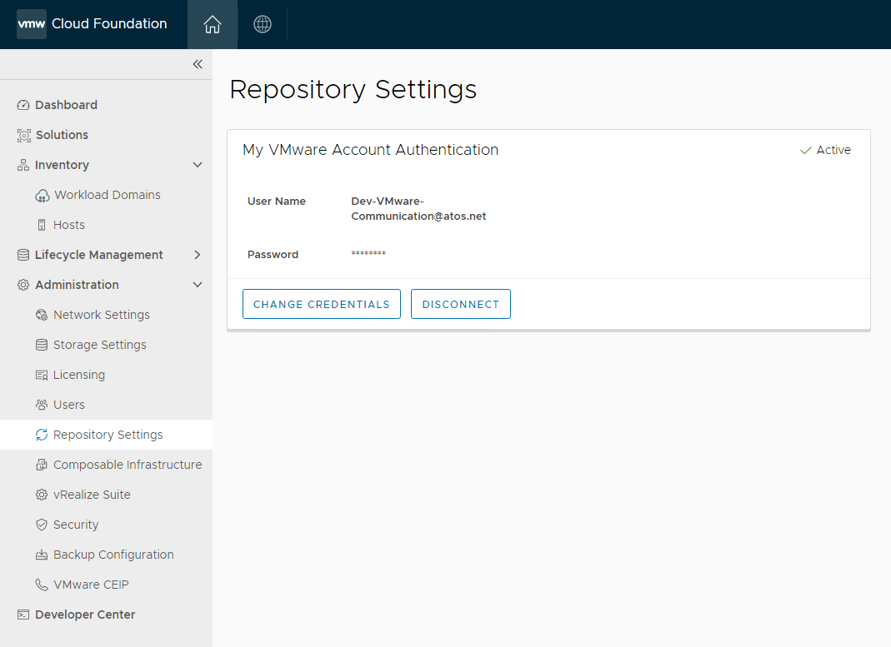                    |

### Test SDDC-3 - Check vRealize Lifecycle Manager is deployed successfully

This test is automated by `executeInfraTests.yml` playbook from `/opt/dhc/manage/` on the ansible server.
Alternatively, the manual process:

|                  |                                                                               |
|------------------|-------------------------------------------------------------------------------|
| Test procedure   | Login to GUI of SDDC Manager                                                  |
| Test procedure   | Select Administrator → vRealize Suite                                         |
| Test procedure   | Check connection to all components (except vRA Automation)                    |
| Expected results | SDDC Manager is open, and login is successful                                 |
| Expected results | Connection to all vRealize Suite components is Active (except vRA Automation) |
| Expected results | 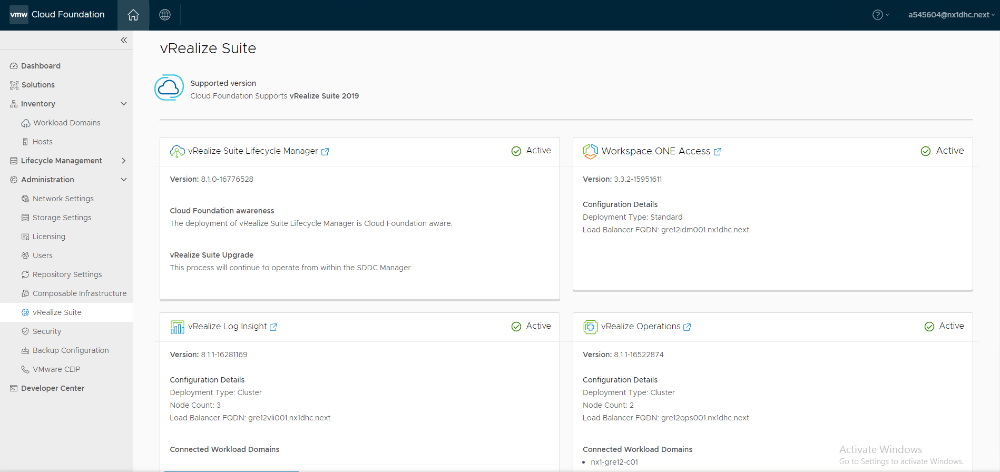                                  |

### Test SDDC-4 - Check Workload Domains status - MGT and CMP

This test is automated by `executeInfraTests.yml` playbook from `/opt/dhc/manage/` on the ansible server.
Alternatively, the manual process:

|                  |                                                                                                  |
|------------------|--------------------------------------------------------------------------------------------------|
| Test procedure   | Login to GUI of SDDC Manager.                                                                    |
| Test procedure   | Select Inventory → Workload Domains → View Details                                               |
| Test procedure   | Check status of Workload Domains                                                                 |
| Expected results | Both Workload Domains (Management and Virtual Infrastructure) are are visible with status Active |
| Expected results | 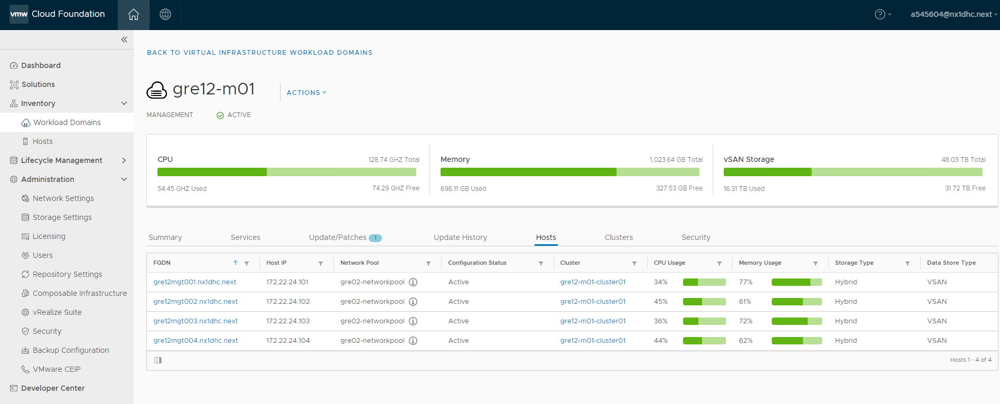                                        |
| Expected results | 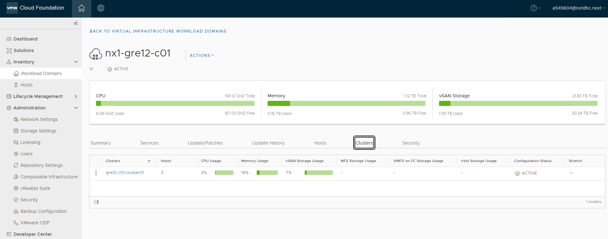                                          |

### Test SDDC-5 - Check and validate vCenter connectivity in SDDC Manager

This test is automated by `executeInfraTests.yml` playbook from `/opt/dhc/manage/` on the ansible server.
Alternatively, the manual process:

|                  |                                                                                   |
|------------------|-----------------------------------------------------------------------------------|
| Test procedure   | Login to GUI of SDDC Manager.                                                     |
| Test procedure   | Select Inventory → Workload Domains → View Details                                |
| Test procedure   | Select Workload Domain (MGT or CMP) → switch to tab Services                      |
| Test procedure   | Check presence of vCenter Servers                                                 |
| Expected results | vCenter Servers are available in both Workload Domains (MGT and CMP) and visible. |
| Expected results | 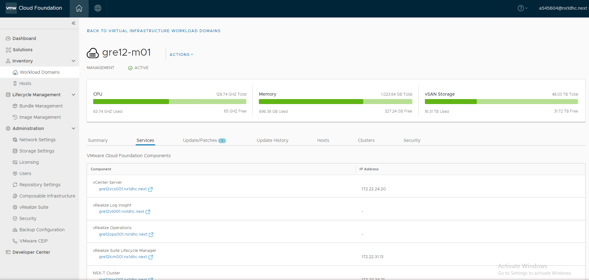                        |
| Expected results | 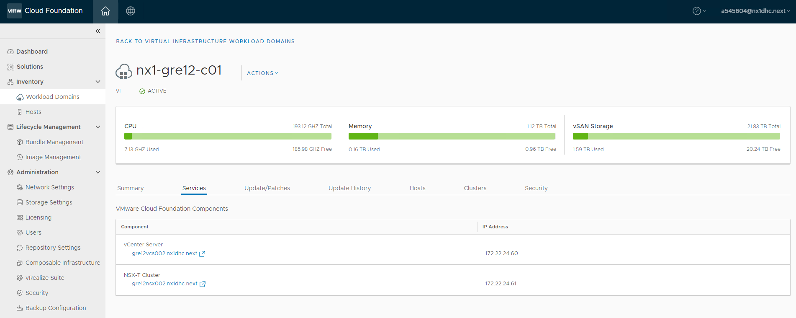                          |

### Test SDDC-6 - Check health status of Clusters and Hosts in SDDC Manager

This test is automated by `executeInfraTests.yml` playbook from `/opt/dhc/manage/` on the ansible server.
Alternatively, the manual process:

|                  |                                                                          |
|------------------|--------------------------------------------------------------------------|
| Test procedure   | Login to GUI of SDDC Manager.                                            |
| Test procedure   | Select Inventory → Workload Domains → View Details                       |
| Test procedure   | Select Workload Domain (MGT or CMP) → switch to tab Clusters             |
| Test procedure   | Check status of Clusters                                                 |
| Test procedure   | Select Workload Domain (MGT or CMP) → switch to tab Hosts                |
| Test procedure   | Check status of Hosts                                                    |
| Expected results | Clusters in both Workload Domains (MGT and CMP) are present and active.  |
| Expected results | All hosts in both Workload Domains (MGT and CMP) are present and active. |
| Expected results |                 |
| Expected results |                   |

### Test SDDC-7 - Check certificates are created for vCF components

This test is automated by `executeInfraTests.yml` playbook from `/opt/dhc/manage/` on the ansible server.
Alternatively, the manual process:

|                  |                                                           |
|------------------|-----------------------------------------------------------|
| Test procedure   | Login to GUI of SDDC Manager.                             |
| Test procedure   | Select Administration → Security → Certificate Management |
| Test procedure   | Check configuration of Certificate Authority              |
| Expected results | VCS ICA server is configured and active.                  |
| Expected results | 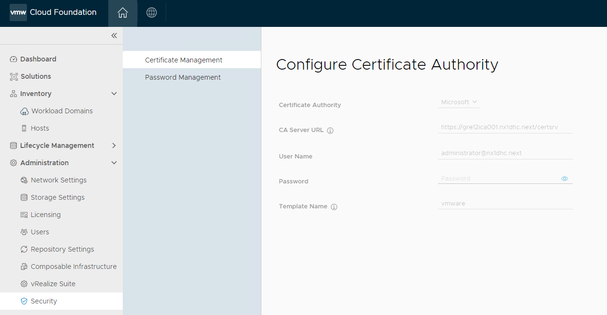              |

### Test SDDC-8 - Check backup settings

This test is automated by `executeInfraTests.yml` playbook from `/opt/dhc/manage/` on the ansible server.
Alternatively, the manual process:

|                  |                                                                                                        |
|------------------|--------------------------------------------------------------------------------------------------------|
| Test procedure   | Login to GUI of SDDC Manager.                                                                          |
| Test procedure   | Select Administration → Backup Configuration                                                           |
| Test procedure   | Check configuration of backup settings                                                                 |
| Expected results | Backup Server for SDDC Manager and NSX Manager configured to external destiny which is ansible core VM |
| Expected results | 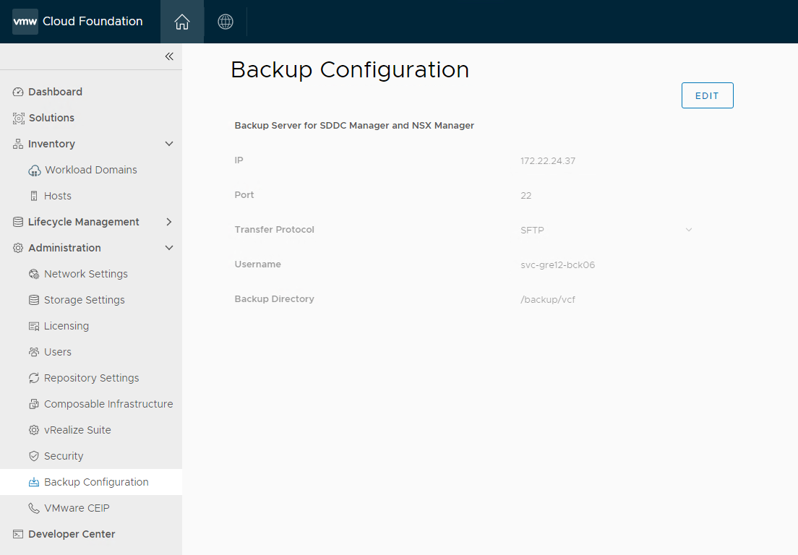                                                        |

### Test SDDC-9 - Check and validate vMotion & vSAN network pool for sufficient free IPs

|                  |                                                                 |
|------------------|-----------------------------------------------------------------|
| Test procedure   | Login to GUI of SDDC Manager.                                   |
| Test procedure   | Select Administration → Network Settings                        |
| Test procedure   | Click on the network pool name                                  |
| Expected results | Ample free IPs available for both the vMotion and vSAN networks |
| Expected results | 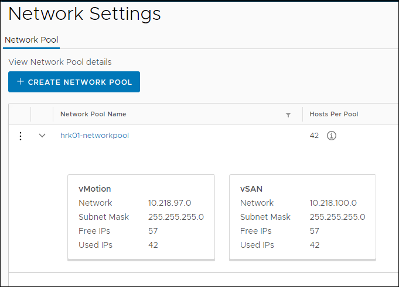    |

### Test SDDC-10 - Perform an update precheck for the workload domains

|                  |                                                                                          |
|------------------|------------------------------------------------------------------------------------------|
| Test procedure   | Login to GUI of SDDC Manager.                                                            |
| Test procedure   | Select Inventory → Workload Domains. Select a workload domain.                           |
| Test procedure   | Select on the Updates/Patches tab and click on the Precheck button                       |
| Expected results | The precheck should succeed and all the involved components should show ready for update |

## VCS Infrastructure

**Some of VCS Infrastructure tests are automated.**
In order to execute them, please logon to the ansible server and browse to `/opt/dhc/manage`. Execute playbook `executeInfraTests.yml` with the following tags:

```shell
ansible-playbook executeInfraTests.yml --tags infra
```

>Note: you will be prompted to provide domain username, domain password, and tenant name.

The playbook will create a report in HTML format. Please see `dhcInfrastructureReport.html` file under `/backup/` for more details.

### Test INFRA-1 - Check access to vCenter Servers

This test is automated by `executeInfraTests.yml` playbook from `/opt/dhc/manage/` on the ansible server.
Alternatively, the manual process:

|                  |                                                                                   |
|------------------|-----------------------------------------------------------------------------------|
| Test procedure   | Log in to your Terminal Server                                                    |
| Test procedure   | Open browser                                                                      |
| Test procedure   | Enter vSphere Client URL (`https://< hostname > or https://< ip_address:port >/`) |
| Test procedure   | Login using domain credentials                                                    |
| Expected results | Only authorized user should be able to login vCenter server successfully          |
| Expected results | URL is accessible                                                                 |
| Expected results | Login page is displayed                                                           |
| Expected results | Login is successful                                                               |
| Expected results | Both vCenter Servers (mgmt and cmp) are visible                                   |
| Expected results | 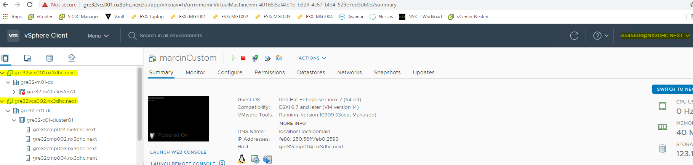                             |

### Test INFRA-2 - Check health status of Clusters in vCenter

This test is automated by `executeInfraTests.yml` playbook from `/opt/dhc/manage/` on the ansible server.
Alternatively, the manual process:

|                  |                                                        |
|------------------|--------------------------------------------------------|
| Test procedure   | Log in to vCenter server using vSphere Client.         |
| Test procedure   | Choice Datacenter and then Hosts and Clusters tab      |
| Test procedure   | Check both Clusters (management and workload)          |
| Expected results | Logon screen should be available                       |
| Expected results | Login successful                                       |
| Expected results | All Hosts and Clusters are listed under DataCenter     |
| Expected results | Health should be in GREEN                              |
| Expected results | Health status for both Clusters should be in GREEN     |
| Expected results | 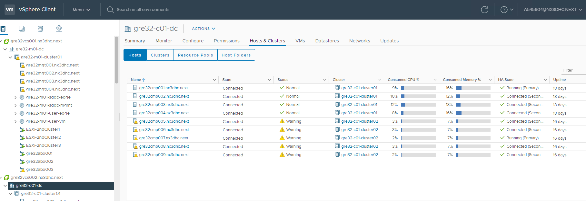 |

### Test INFRA-3 - Check health status of Hosts in vCenter

This test is automated by `executeInfraTests.yml` playbook from `/opt/dhc/manage/` on the ansible server.
Alternatively, the manual process:

|                  |                                                            |
|------------------|------------------------------------------------------------|
| Test procedure   | Login to vSphere Client                                    |
| Test procedure   | Navigate to Hosts and cluster                              |
| Test procedure   | Choice Datacenter and then Hosts and Clusters tab          |
| Test procedure   | Check all hosts in both Clusters (Management and Workload) |
| Expected results | Login to vSphere Web Client is successful                  |
| Expected results | Hosts and clusters are listed                              |
| Expected results | Hosts are visible under Cluster                            |
| Expected results | Health should be in GREEN                                  |
| Expected results | Health Status of all hosts should be GREEN                 |
| Expected results | 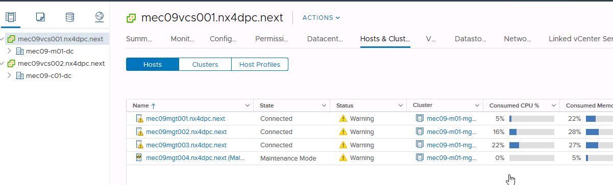             |
| Expected results | 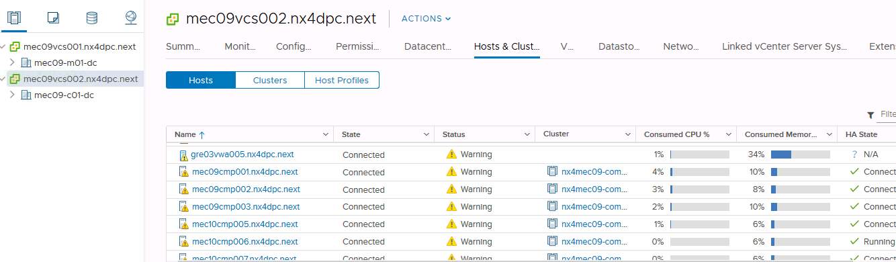            |

### Test INFRA-4 - Check vSphere general functionality: vMotion

This test is automated by `executeInfraTests.yml` playbook from `/opt/dhc/manage/` on the ansible server.
Alternatively, the manual process:

|                  |                                                                                                                                      |
|------------------|--------------------------------------------------------------------------------------------------------------------------------------|
| Test procedure   | Login to vSphere Client.                                                                                                             |
| Test procedure   | Navigate to VMs and Templates and expand the inventory                                                                               |
| Test procedure   | Select the virtual machine to be migrated and check whether machine is → Power on, if not than → Power On machine using steps below: |
| Test procedure   | a. Right click on virtual machine                                                                                                    |
| Test procedure   | b. Select Power > Power On                                                                                                           |
| Test procedure   | Go to Summary tab and scroll down to → Related Objects and note down current → Host name of virtual machine                          |
| Test procedure   | Right-click the virtual machine and select Migrate.                                                                                  |
| Test procedure   | On → Select the migration type page, click → Change compute resource only and click Next                                             |
| Test procedure   | On → Select Compute Resource page select appropriate Host as destination host for virtual machine                                    |
| Test procedure   | Check Compatibility pane                                                                                                             |
| Test procedure   | On "Select Network" page choose appropriate Destination network from the Drop down                                                   |
| Test procedure   | Click Next if Compatibility check is successful                                                                                      |
| Test procedure   | On "Select vMotion Priority" page select 'Schedule vMotion with high priority'                                                       |
| Test procedure   | On Ready to Complete page check and verify all the information and click Finish.                                                     |
| Test procedure   | Observe the changes on Recent Tasks Pane and wait for migration process to be completed                                              |
| Test procedure   | Repeat Step 4 to ensure that virtual machine is migrated successfully to new Host                                                    |
| Expected results | Login successful                                                                                                                     |
| Expected results | Options listed                                                                                                                       |
| Expected results | Machine powered on                                                                                                                   |
| Expected results | Migrate option selected                                                                                                              |
| Expected results | Compatibility checks succeeded                                                                                                       |
| Expected results | Compatibility checks succeeded                                                                                                       |
| Expected results | Migration process must be completed successfully                                                                                     |
| Expected results | Host name should reflect new destination Host                                                                                        |
| Expected results | 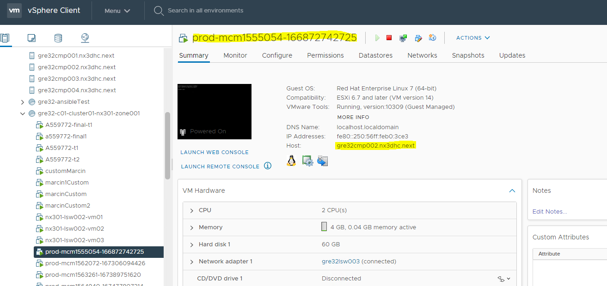                                                                                    |
| Expected results | 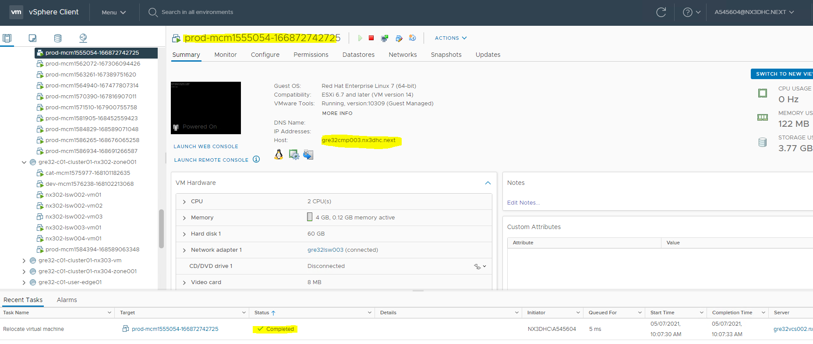                                                                                    |

### Test INFRA-5 - Check vSphere general functionality: HA

|                  |                                                                                                     |
|------------------|-----------------------------------------------------------------------------------------------------|
| Test procedure   | Login to vSphere Client                                                                             |
| Test procedure   | Select ESXi Host on which HA functionality is to be tested                                          |
| Test procedure   | Right click on selected host and Select Maintenance Mode → Enter Maintenance Mode                   |
| Test procedure   | Right click on Cluster and Select Settings → Change DRS from Fully Automated to Partially Automated |
| Test procedure   | Right click on selected host and Select Maintenance Mode → Exit Maintenance Mode                    |
| Test procedure   | Migrate one VM back to the Host chosen for this Test                                                |
| Test procedure   | Navigate to IPMI consoles (like iDRAC, BMC) and Power Off the Host                                  |
| Test procedure   | Check for the VM to be rebooted on the another Host(Log in into VM to check is it online)           |
| Test procedure   | Navigate to IPMI consoles (like iDRAC, BMC) and Power On the Host                                   |
| Test procedure   | Right click on Cluster and Select Settings → Change DRS from Partially Automated to Fully Automated |
| Expected results | Test VM is migrated to another Host in the cluster                                                  |
| Expected results | 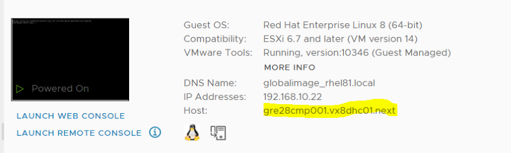                                                        |
| Expected results | 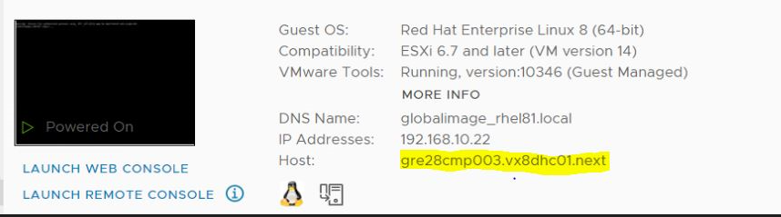                                                        |

### Test INFRA-6 - Check DRS status for each cluster in vCenter

|                  |                                                                           |
|------------------|---------------------------------------------------------------------------|
| Test procedure   | Login to vSphere Client                                                   |
| Test procedure   | Navigate to each cluster and select the Configure tab.                    |
| Test procedure   | Click on vSphere DRS under Services option                                |
| Expected results | Ensure that vSphere DRS is Turned On and DRS Automation Set appropriately |
| Expected results | 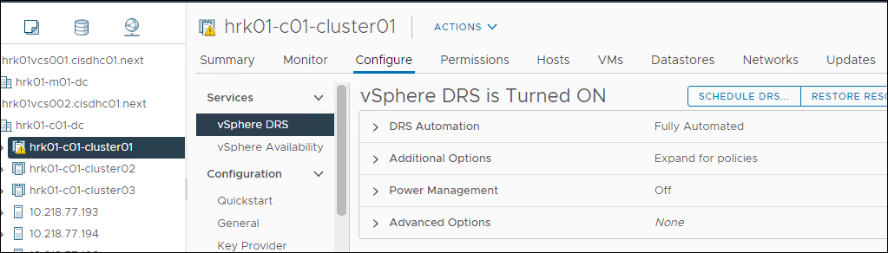                |

### Test INFRA-7 - Check vCenter AD integration using LDAPS and service account

|                  |                                                                                    |
|------------------|------------------------------------------------------------------------------------|
| Test procedure   | Login to vSphere Client using the `administrator@vsphere.local` account            |
| Test procedure   | Navigate to Administration menu -> Single Sign-On -> Configuration                 |
| Test procedure   | Select Identity Provider tab - Identity Sources -> <name as dhc domain> -> Edit    |
| Expected results | Ensure that Identity Source type is AD over LDAP & Binding username is svc-*-vcs01 |
| Expected results | 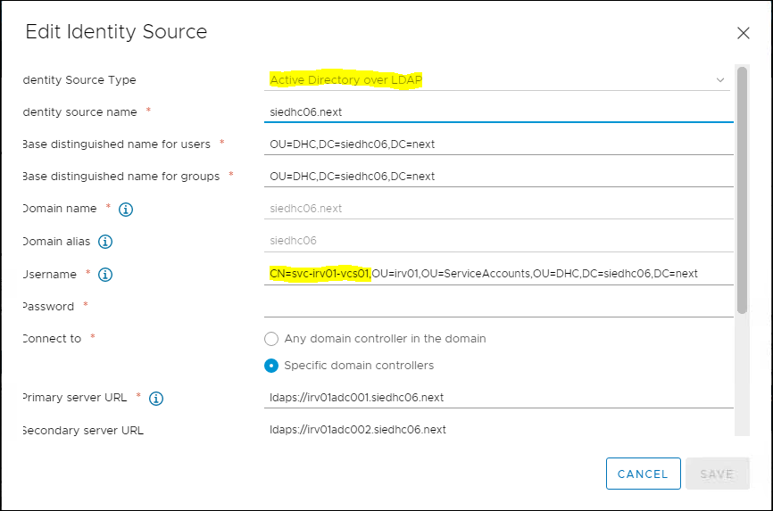                      |

### Test INFRA-8 - Verify if vROPs is synchronizing accounts with AD and vIDM

This test is automated by `executeInfraTests.yml` playbook from `/opt/dhc/manage/` on the ansible server.
Alternatively, the manual process:

|                  |                                                                              |
|------------------|------------------------------------------------------------------------------|
| Test procedure   | Open web browser and type vROPS address                                      |
| Test procedure   | After login in select Administration → Access → Authentication Sources       |
| Test procedure   | Select the Active Directory entry and click the Synchronize User Groups icon |
| Test procedure   | In the Confirmation dialog box, click Yes                                    |
| Test procedure   | Select vIDM entry press edit and then test                                   |
| Expected results | Logon screen should be available                                             |
| Expected results | Login successful                                                             |
| Expected results | For the source type AD auto synchronization should be true                   |
| Expected results | Confirmation dialog box appears                                              |
| Expected results | vIDM test should be successful                                               |
| Expected results | 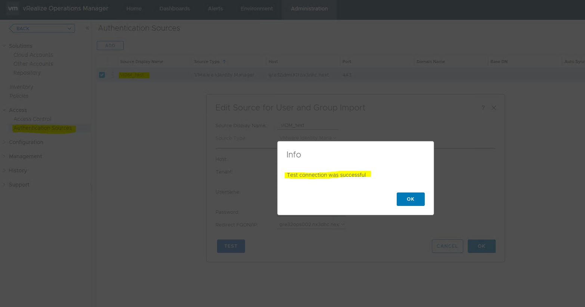                               |

### Test INFRA-9 - Check vROps cluster health & Adapter instances data collection status

|                  |                                                                        |
|------------------|------------------------------------------------------------------------|
| Test procedure   | Open web browser and type vROPS address                                |
| Test procedure   | After login in select Administration → Management → Cluster Management |
| Test procedure   | Select each cluster node and verify adapter instances status           |
| Expected results | The adapter instances status should show as data receiving             |
| Expected results | 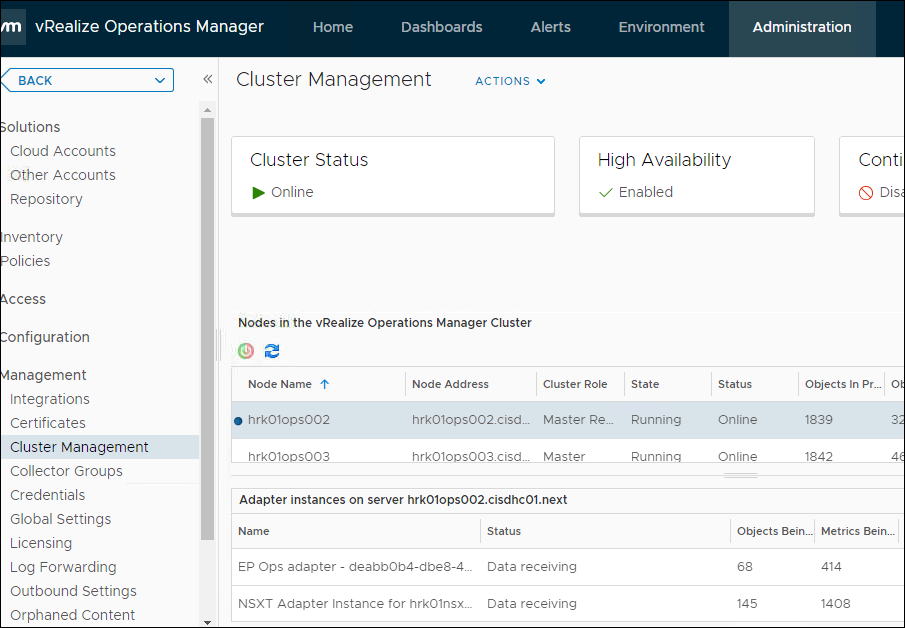         |

### Test INFRA-10 - Check access to DNS

This test is automated by `executeInfraTests.yml` playbook from `/opt/dhc/manage/` on the ansible server.
Alternatively, the manual process:

|                  |                                              |
|------------------|----------------------------------------------|
| Test procedure   | Login to AD server by RDP connection         |
| Test procedure   | Type 'DNS' in Search and click on DNS        |
| Expected results | AD server accessible                         |
| Expected results | DNS is accessible to domain users            |
| Expected results | 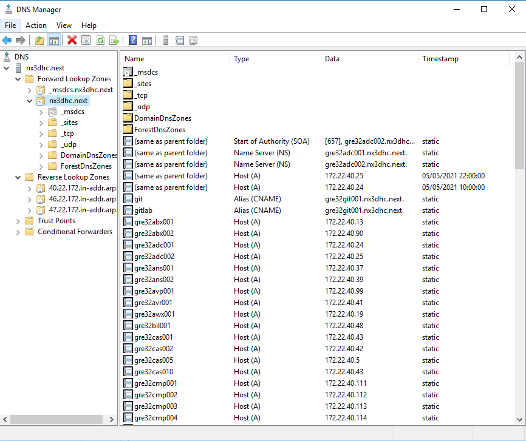 |

### Test INFRA-11 - Check access to Active Directory

This test is automated by `executeInfraTests.yml` playbook from `/opt/dhc/manage/` on the ansible server.
Alternatively, the manual process:

|                  |                                                    |
|------------------|----------------------------------------------------|
| Test procedure   | Login to AD server using by RDP connection         |
| Test procedure   | Type 'Active Directory Users and Computers'        |
| Expected results | AD server is accessible                            |
| Expected results | All users and groups are visible here              |
| Expected results | 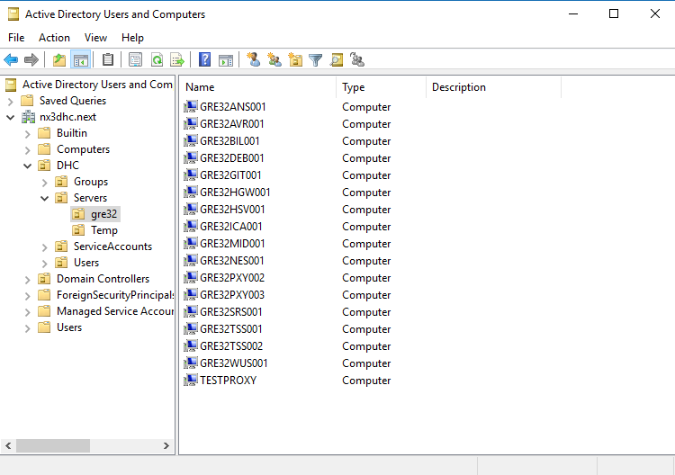 |

### Test INFRA-12 - Check status of Active Directory Domain Services

It checks the status of three active directory domain services (AD DS): AD replication, NTP, and DHCP services. The test has been automated using playbook `testAd.yml`. Run the test from the ansible server by navigating to `/opt/dhc/manage` and typing the following command:

```shell
ansible-playbook testAd.yml
```

>Note: you will be prompted to provide domain username and password. The account needs to be nested in platformadministrators domain group in order for this test to work.

A report in JSON format will be created. It can be found in `/backup/adTestReport-timeStamp.json`.

### Test INFRA-13 - Check NSX-T configuration for Management

|                  |                                                                                                                                                                                                                                                                                                                                               |
|------------------|-----------------------------------------------------------------------------------------------------------------------------------------------------------------------------------------------------------------------------------------------------------------------------------------------------------------------------------------------|
| Test procedure   | Login to NSX-T (nsx001)                                                                                                                                                                                                                                                                                                                       |
| Test procedure   | Click System → Fabric → Nodes                                                                                                                                                                                                                                                                                                                 |
| Test procedure   | Select Host Transport Nodes tab                                                                                                                                                                                                                                                                                                               |
| Test procedure   | Click "Managed by" on top and select management vCenter Server                                                                                                                                                                                                                                                                                |
| Test procedure   | Validate if cluster is created, hosts are connected and no errors or warnings appear                                                                                                                                                                                                                                                          |
| Test procedure   | Validate if all tunnels are up and running                                                                                                                                                                                                                                                                                                    |
| Test procedure   | Validate if two TEP IP Addresses are assigned per host                                                                                                                                                                                                                                                                                        |
| Test procedure   | Select Edge Transport Nodes tab                                                                                                                                                                                                                                                                                                               |
| Test procedure   | Validate if two nodes are present with green status                                                                                                                                                                                                                                                                                           |
| Test procedure   | Validate if all tunnels are up and running                                                                                                                                                                                                                                                                                                    |
| Test procedure   | Navigate to Networking → Tier-0 Gateways                                                                                                                                                                                                                                                                                                      |
| Test procedure   | Go to gateway, expand it and check BGP section underneath                                                                                                                                                                                                                                                                                     |
| Test procedure   | Click on "BGP Neighbours 2" → Information icon (for both IP addresses)                                                                                                                                                                                                                                                                        |
| Test procedure   | Validate that Connection State is ESTABLISHED (for both IP addresses)                                                                                                                                                                                                                                                                         |
| Test procedure   | (Optional) For more detailed output, you can login to NSX edge and type following commands:<br># get logical-router (note SERVICE_ROUTER_TIER0 vrf id)<br># vrf 'id'<br># get bgp neighbor summary<br># get bgp neighbor < neighbor-IP ><br># get bgp neighbor < neighbor-IP > advertised-routes<br># get bgp neighbor < neighbor-IP > routes |
| Test procedure   | Navigate to Networking → Load Balancing                                                                                                                                                                                                                                                                                                       |
| Test procedure   | Select Load Balancers tab                                                                                                                                                                                                                                                                                                                     |
| Test procedure   | Validate if vrops-https LB is present with 2 virtual servers assigned and status is Success                                                                                                                                                                                                                                                   |
| Test procedure   | Select Virtual Servers tab                                                                                                                                                                                                                                                                                                                    |
| Test procedure   | Validate if vrops-https Virtual Server is present with server pool assigned and status is Success                                                                                                                                                                                                                                             |
| Test procedure   | Select Server Pools tab                                                                                                                                                                                                                                                                                                                       |
| Test procedure   | Validate if vrops-https Server Pool is present with 2 members assigned and status is Success                                                                                                                                                                                                                                                  |
| Expected results | Login successful                                                                                                                                                                                                                                                                                                                              |
| Expected results | Host Transport Nodes have 2 TEP IP addresses assigned, tunnels are up and green, no issues reported                                                                                                                                                                                                                                           |
| Expected results | Edge Transport Nodes have two nodes created, tunnels are up and green, no issues reported                                                                                                                                                                                                                                                     |
| Expected results | BGP connectivity is established with proper advertised routes                                                                                                                                                                                                                                                                                 |
| Expected results | vROPS load balancer is created, all statuses green, 2 members assigned, statuses are Success                                                                                                                                                                                                                                                  |
| Expected results | 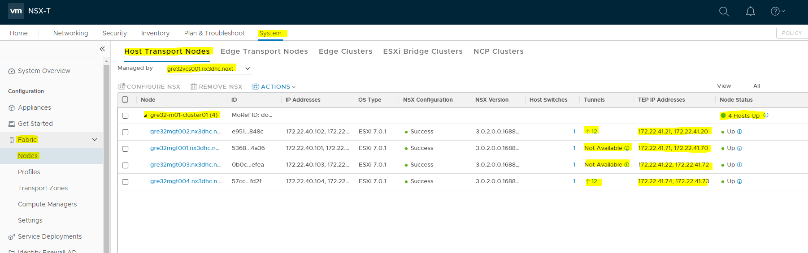                                                                                                                                                                                                                                                                                                |
| Expected results | 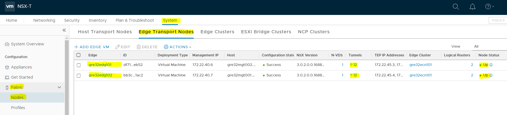                                                                                                                                                                                                                                                                                                |
| Expected results | 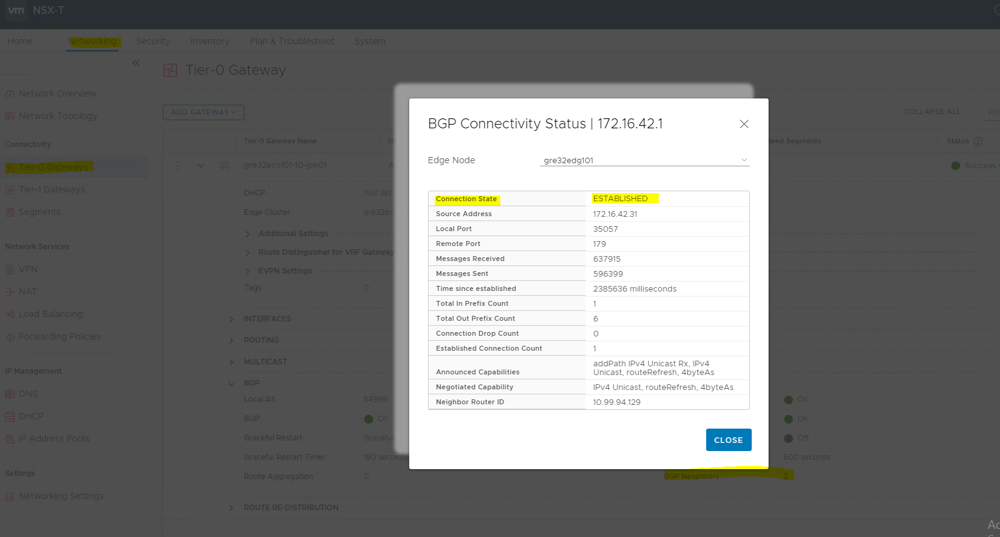                                                                                                                                                                                                                                                                                                |
| Expected results | 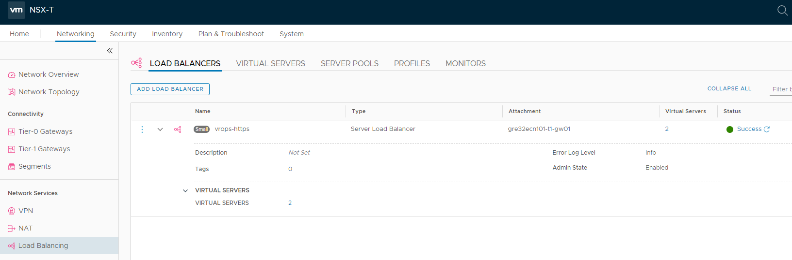                                                                                                                                                                                                                                                                                                |
| Expected results | 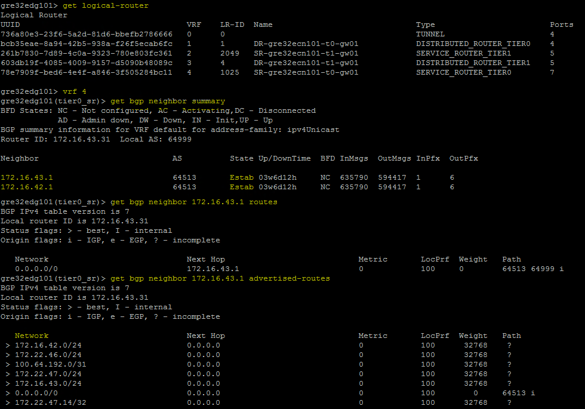                                                                                                                                                                                                                                                                                                |

### Test INFRA-14 - Check NSX-T configuration for Workload

|                  |                                                                                                                                                                                                                                                                                                                                         |
|------------------|-----------------------------------------------------------------------------------------------------------------------------------------------------------------------------------------------------------------------------------------------------------------------------------------------------------------------------------------|
| Test procedure   | Login to NSX-T (nsx002)                                                                                                                                                                                                                                                                                                                 |
| Test procedure   | Click System → Fabric → Nodes                                                                                                                                                                                                                                                                                                           |
| Test procedure   | Select Host Transport Nodes tab                                                                                                                                                                                                                                                                                                         |
| Test procedure   | Click "Managed by" on top and select workload vCenter Server                                                                                                                                                                                                                                                                            |
| Test procedure   | Validate if cluster is created, hosts are connected and no errors or warnings appear                                                                                                                                                                                                                                                    |
| Test procedure   | Validate if all tunnels are up and running                                                                                                                                                                                                                                                                                              |
| Test procedure   | Validate if two TEP IP Addresses are assigned per host                                                                                                                                                                                                                                                                                  |
| Test procedure   | Select Edge Transport Nodes tab                                                                                                                                                                                                                                                                                                         |
| Test procedure   | Validate if two nodes are present with green status                                                                                                                                                                                                                                                                                     |
| Test procedure   | Validate if all tunnels are up and running                                                                                                                                                                                                                                                                                              |
| Test procedure   | Navigate to Networking → Tier-0 Gateways                                                                                                                                                                                                                                                                                                |
| Test procedure   | Go to gateway, expand it and check BGP section underneath                                                                                                                                                                                                                                                                               |
| Test procedure   | Click on "BGP Neighbours 2" → Information icon (for both IP addresses)                                                                                                                                                                                                                                                                  |
| Test procedure   | Validate that Connection State is ESTABLISHED (for both IP addresses)                                                                                                                                                                                                                                                                   |
| Test procedure   | (Optional) For more detailed output, you can login to NSX edge and type following commands:<br># get logical-router (note SERVICE_ROUTER_TIER0 vrf id)<br># vrf 'id'<br># get bgp neighbor summary<br># get bgp neighbor <neighbor-IP><br># get bgp neighbor <neighbor-IP> advertised-routes<br># get bgp neighbor <neighbor-IP> routes |
| Expected results | Login successful                                                                                                                                                                                                                                                                                                                        |
| Expected results | Host Transport Nodes have 2 TEP IP addresses assigned, tunnels are up and green, no issues reported                                                                                                                                                                                                                                     |
| Expected results | Edge Transport Nodes have two nodes created, tunnels are up and green, no issues reported                                                                                                                                                                                                                                               |
| Expected results | BGP connectivity is established with proper advertised routes                                                                                                                                                                                                                                                                           |

### Test INFRA-15 - Check LogInsight configuration

|                  |                                                                            |
|------------------|----------------------------------------------------------------------------|
| Test procedure   | Login GUI of vRLI using domain account                                     |
| Test procedure   | Go to Management → Administration → Agents                                 |
| Test procedure   | Check if there are agents connected                                        |
| Test procedure   | Go to Integration → vSphere                                                |
| Test procedure   | Check if vCenter is configured                                             |
| Test procedure   | Go to Integration → vRealize Operations                                    |
| Test procedure   | Check if vROPS is configured                                               |
| Test procedure   | Go to Content Packs                                                        |
| Test procedure   | Check installed Content Packs                                              |
| Test procedure   | Go to Interactive Analytics → Manage Alerts.                               |
| Test procedure   | Check if Alerts are enabled                                                |
| Test procedure   | Go to Administration → Management → License                                |
| Test procedure   | Check if license is configured                                             |
| Expected results | Login successful                                                           |
| Expected results | Agents are available                                                       |
| Expected results | vSphere integration with vCenter Servers (MGT and CMP) is done and working |
| Expected results | vROPS integration is done and working:                                     |
| Expected results | - alerts integration is enabled                                            |
| Expected results | - launch in context is enabled                                             |
| Expected results | VCS Custom Content Pack is installed                                       |
| Expected results | Alert definitions provided by VCS Custom Content Pack are enabled          |
| Expected results | License is valid and Active                                                |
| Expected results | 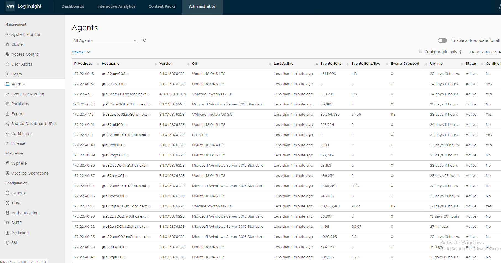                             |
| Expected results | 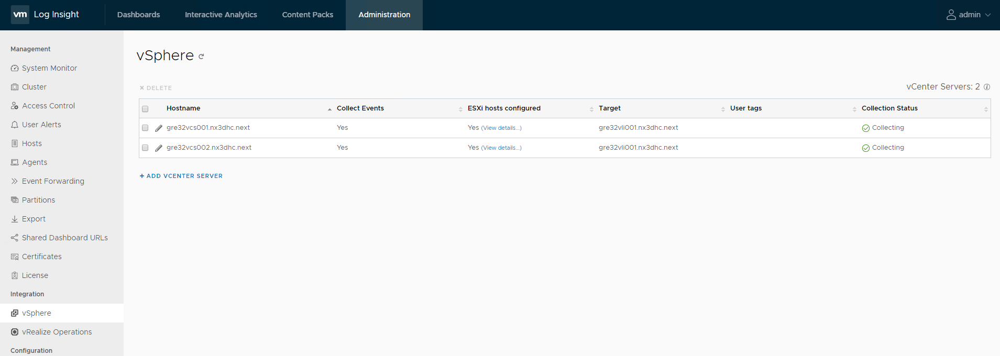                             |
| Expected results | 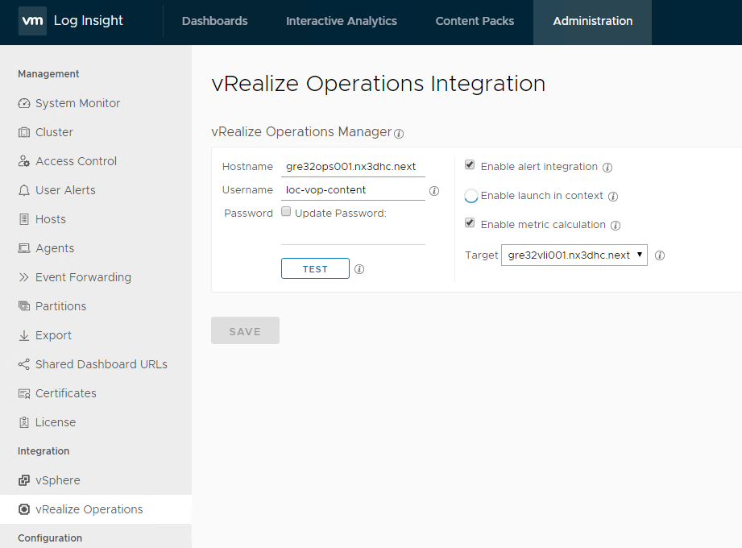                             |
| Expected results | 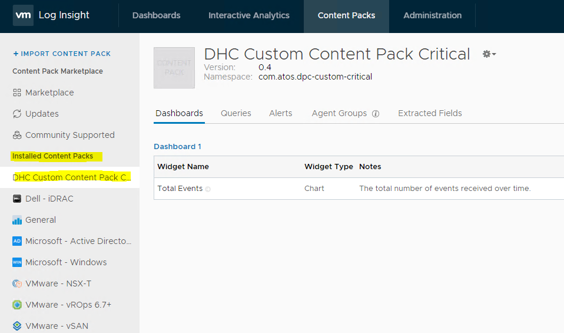                             |

### Test INFRA-16 - Check vRSLCM configuration

|                  |                                                                                                          |
|------------------|----------------------------------------------------------------------------------------------------------|
| Test procedure   | Login to vRSLCM using domain account                                                                     |
| Test procedure   | Go to Lifecycle Operations → Manage Environments                                                         |
| Test procedure   | Confirm presence of vRLI, vIDM, vRNI and vROPs environment                                               |
| Test procedure   | Expand (View Details) each environment and confirm presence of all components                            |
| Test procedure   | Navigate to Identity and Tenant Management → User Management and confirm that LCM Admins role is present |
| Test procedure   | Go to Marketplace → Marketplace                                                                          |
| Test procedure   | Validate if content is synced and available                                                              |
| Expected results | Login is successful                                                                                      |
| Expected results | vRLI, vIDM, vRNI and vROPs environments are visible and healthy                                          |
| Expected results | All components in each environments are visible and healthy                                              |
| Expected results | Compliance Status: Compliant                                                                             |
| Expected results | Operational Status: Healthy                                                                              |
| Expected results | For second cluster: Compliance Status: Compliant                                                         |
| Expected results | Operational Status: Healthy                                                                              |
| Expected results | rsce-< locationCode >-lcl-l-admins role is present                                                       |
| Test procedure   | Marketplace is synced and content is available                                                           |
| Expected results | 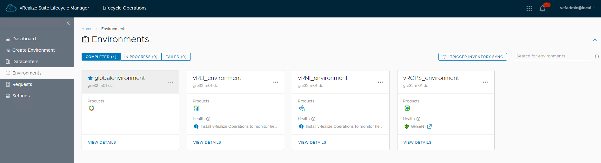                                                         |
| Expected results | 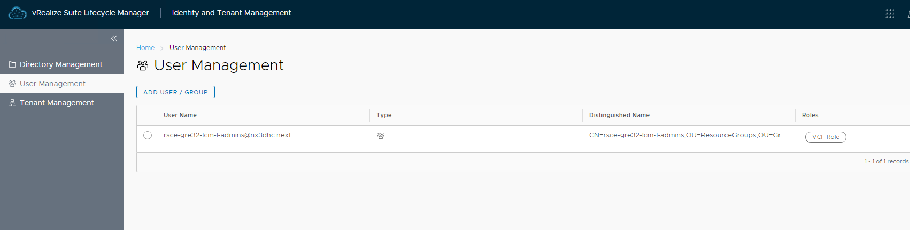                                                         |
| Expected results | 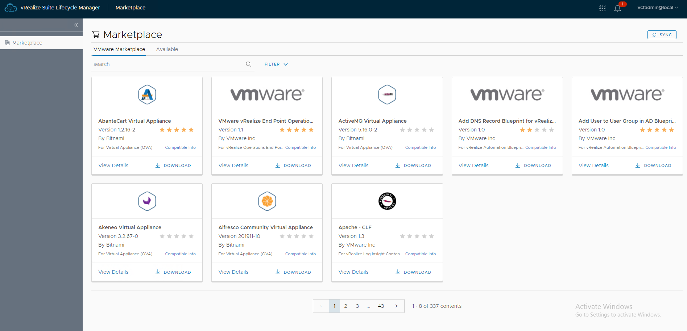                                                         |

### Test INFRA-17 - Check vROPS configuration

|                  |                                                                                                                   |
|------------------|-------------------------------------------------------------------------------------------------------------------|
| Test procedure   | Login to vROPS GUI with domain account                                                                            |
| Test procedure   | Go to Administration → Management → Cluster Management                                                            |
| Test procedure   | Check both Node status                                                                                            |
| Test procedure   | Go to Administration → Solutions → Cloud Accounts                                                                 |
| Test procedure   | Check Solutions configuration and Adapter Status                                                                  |
| Test procedure   | Go to Administration → Management → Licensing                                                                     |
| Test procedure   | Check if license is configured                                                                                    |
| Test procedure   | Go to Administration → Access → Access Control                                                                    |
| Test procedure   | Check User Accounts list.                                                                                         |
| Expected results | Login is successful                                                                                               |
| Expected results | Both cluster nodes are running and online                                                                         |
| Expected results | All solutions (except Active Directory, Operating Systems and vRA Assessments) are configured and receiving data. |
| Expected results | License is valid and active                                                                                       |
| Expected results | User loc-vop-content and loc-vop-epops is created                                                                 |
| Expected results | 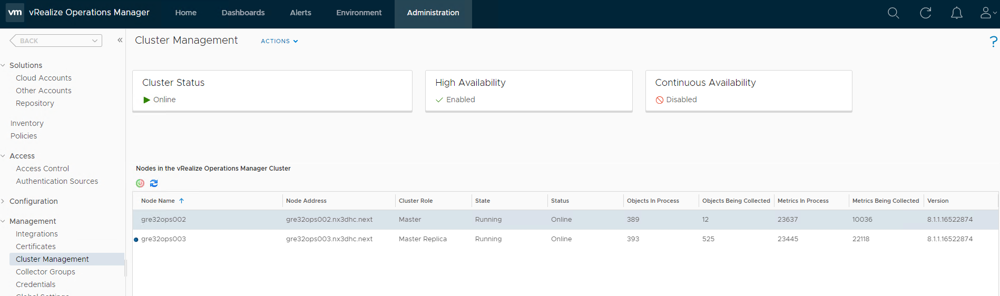                                                                   |
| Expected results | 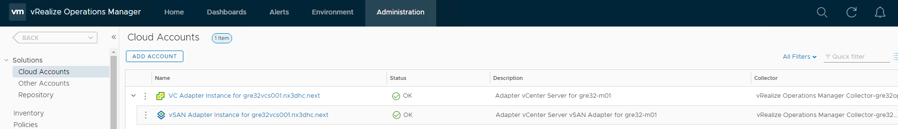                                                                   |
| Expected results | 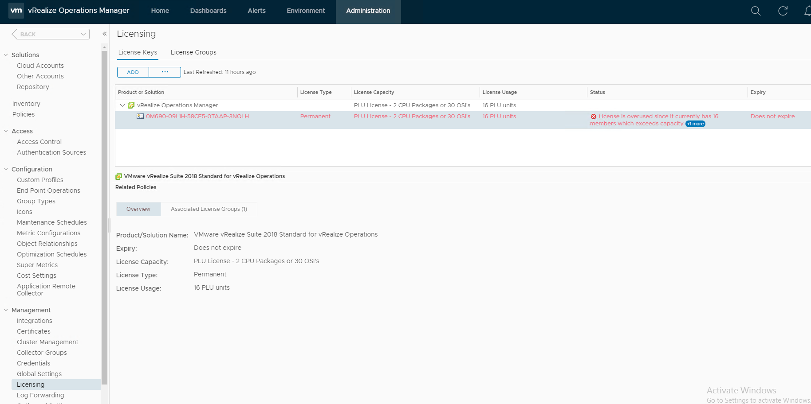                                                                   |
| Expected results | 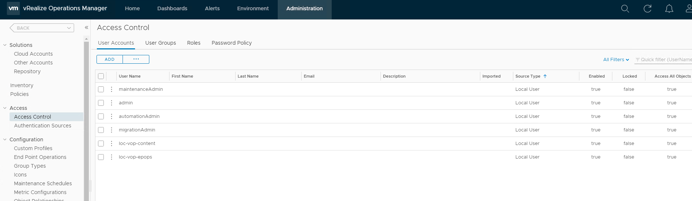                                                                   |

### Test INFRA-18 - Check proper licenses are applied for VCS components (vCenter, ESXi hosts)

|                  |                                                          |
|------------------|----------------------------------------------------------|
| Test procedure   | Open vSphere Web Client and login into it                |
| Test procedure   | Navigate to Menu → Administration → Licensing → Licenses |
| Test procedure   | Verify license for VMware elements                       |
| Expected results | The applied licenses are visible and assigned.           |
| Expected results | Verify license for VMware elements                       |
| Expected results | 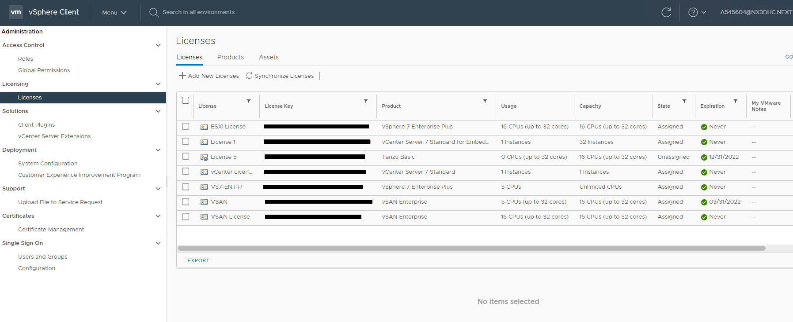        |

### Test INFRA-19 - Check the vSAN cluster configuration and health

|                  |                                                                                    |
|------------------|------------------------------------------------------------------------------------|
| Test procedure   | Open vSphere Client and login to it with domain account                            |
| Test procedure   | Navigate to Home → Hosts & clusters                                                |
| Test procedure   | Choice Cluster → Monitor → vSAN → Skyline Health                                   |
| Test procedure   | Click on Retest button and observe the changes                                     |
| Test procedure   | Perform the same operation for second cluster                                      |
| Expected results | Login to vCenter with domain account works                                         |
| Expected results | Hosts and Clusters are visible                                                     |
| Expected results | All test should be 'Passed' (or no serious problems reported)                      |
| Expected results | Cluster can report warnings related to imbalanced distribution only.               |
| Expected results | vSAN Build Recommendations could report warning due to lack of internet connection |
| Expected results | 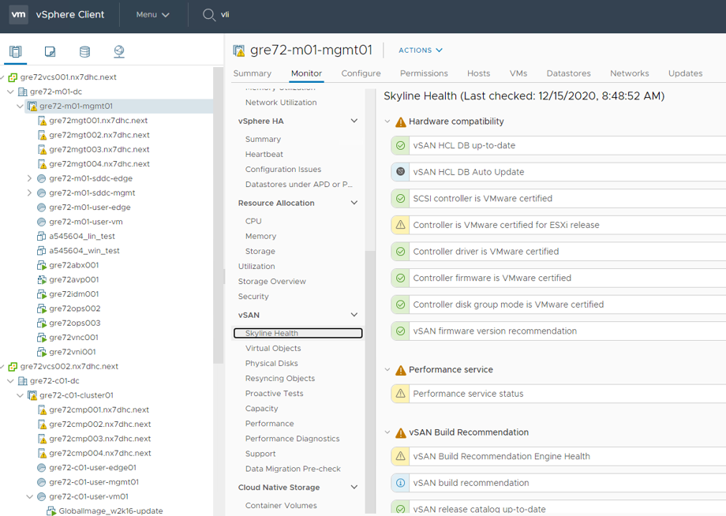                                |

### Test INFRA-20 - Check for disk groups, SSDs used for vSAN

|                  |                                                         |
|------------------|---------------------------------------------------------|
| Test procedure   | Login to the terminal server                            |
| Test procedure   | Open vSphere client and login to it with domain account |
| Test procedure   | Navigate to Home → Hosts & clusters                     |
| Test procedure   | Choice Cluster → Monitor → vSAN → Physical disks        |
| Test procedure   | Check disk groups for vSAN                              |
| Test procedure   | Check SSDs for vSAN                                     |
| Test procedure   | Perform step 4 to 6 for second cluster                  |
| Expected results | RDP session to jump server successful                   |
| Expected results | Login to vCenter with domain account works              |
| Expected results | Hosts and Clusters are visible                          |
| Expected results | All physical disks are listed                           |
| Expected results | 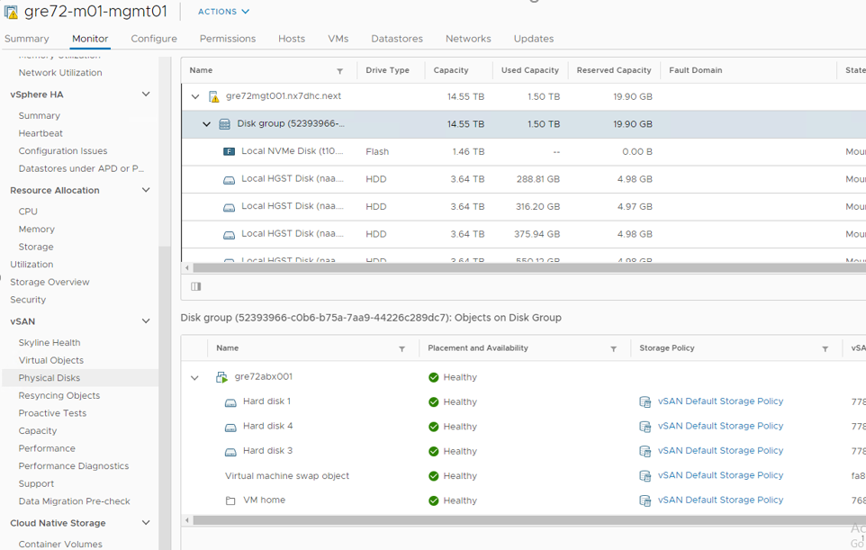          |

### Test INFRA-21 - Check Storage Policy Compliance on vSAN

|                  |                                                               |
|------------------|---------------------------------------------------------------|
| Test procedure   | Login to the terminal server                                  |
| Test procedure   | Open vSphere client and login to it with domain account       |
| Test procedure   | Navigate to Home → Hosts & clusters                           |
| Test procedure   | Choice Cluster → Monitor → vSAN → virtual objects             |
| Test procedure   | Check the compliance status and operational state for each VM |
| Test procedure   | Repeat step 2 & 3 for second cluster                          |
| Expected results | RDP session to jump server successful                         |
| Expected results | Login to vCenter with domain account works                    |
| Expected results | Hosts and Clusters are visible                                |
| Expected results | Compliance Status: Compliant                                  |
| Expected results | Operational Status: Healthy                                   |
| Expected results | For second cluster: Compliance Status: Compliant              |
| Expected results | Operational Status: Healthy                                   |
| Expected results | 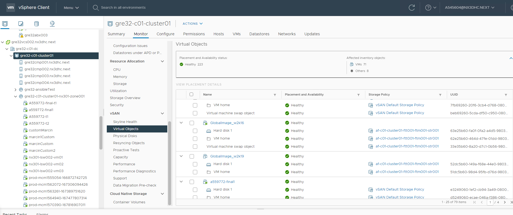           |

### Test INFRA-22 - Check Terminal Server configuration and license

This test has been partially automated using playbook `generateCalUsageReport.yml`. The playbook can be ran from the ansible server by navigating to the directory `/opt/dhc/manage` and entering the following command:

```shell
ansible-playbook generateCalUsageReport.yml
```

>Note: you will be prompted to provide domain username and password. The account needs to be nested in platformadministrators domain group in order for this test to work.
The playbook creates a report in JSON format. The report can be found in `/backup/calUsageReportTss001-timeStamp.json`.

The part of the test that has not been automated concerns ensuring that there are no visible issues in the terminal server by opening the RD Licensisng Manager and Diagnoser. See Table below for instructions.

|                  |                                                           |
|------------------|-----------------------------------------------------------|
| Test procedure   | Login to the terminal server                              |
| Test procedure   | Open Server Manager                                       |
| Test procedure   | Go to Remote Desktop Services → Servers                   |
| Test procedure   | Right-click on server and select → RD Licensing Manager   |
| Test procedure   | Right-click on server and select → RD Licensing Diagnoser |
| Expected results | Login successful                                          |
| Expected results | Activation status is: Activated                           |
| Expected results | No issues with Terminal Servers are visible               |
| Expected results | Licenses are added and visible                            |
| Expected results | 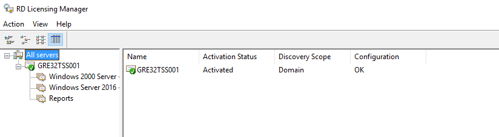             |

### Test INFRA-23 - Check Anti-Virus Deep Security Relay, and agents status

This test has been automated and can be executed by executing the 'testAvAgents.yml' playbook from '/opt/dhc/manage'.  
The end result of this playbook is a report generated at `/backup/testAvAgents-EXECUTION_TIMESTAMP.json`.  
Alternatively, the manual procedure:

|                  |                                                 |
|------------------|-------------------------------------------------|
| Test procedure   | Login to the terminal server by RDP             |
| Test procedure   | Use vSphere Client to log in to vCenter Server  |
| Test procedure   | Check whether Deep Secure Relay VM was deployed |
| Test procedure   | Logon to each Windows and Ubuntu VM             |
| Test procedure   | Check the Deep Secure Agent status              |
| Expected results | Login is successful                             |
| Expected results | Deep Secure Relay (avr001)  is deployed         |
| Expected results | OS agents are up and running                    |
| Expected results | 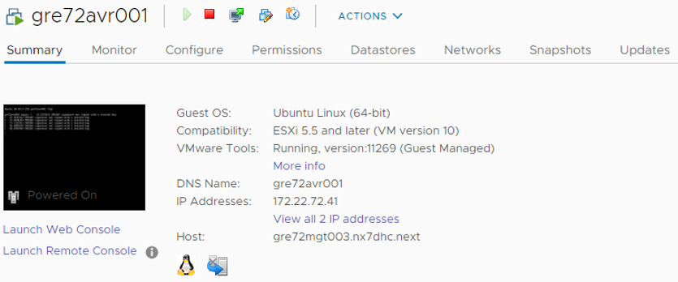   |
| Expected results | 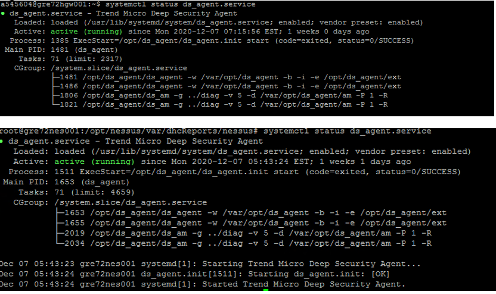   |
| Expected results | 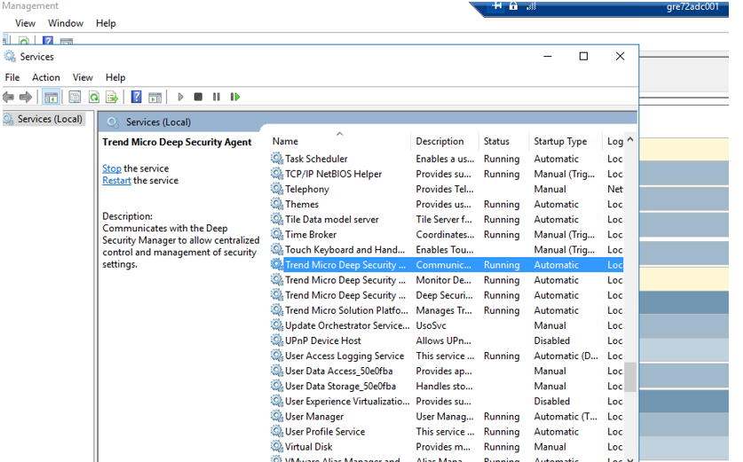   |

### Test INFRA-24 - Check with BDS team status of Anti-Virus protection

|                  |                                                                                                                                               |
|------------------|-----------------------------------------------------------------------------------------------------------------------------------------------|
| Test procedure   | For this test interaction with 3rd party (BDS team) is needed. Get contact for BDS support team from Integration Architect or Project Manager |
| Test procedure   | Check if Deep Secure Agents installed on the VCS Management stack are visible on Deep Security Management.                                    |
| Expected results | VCS Management stack is protected by the BDS Anti-Virus protection.                                                                           |
| Expected results | VMs are visible and online in the Deep Security Management.                                                                                   |
| Expected results | BDS team confirmation is required.                                                                                                            |
| Expected results | 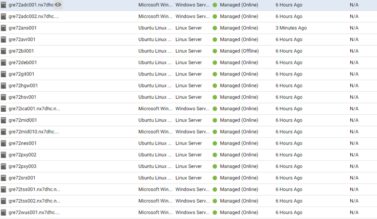                                                                                                  |

### Test INFRA-25 - Check monitoring for management machines

|                  |                                                      |
|------------------|------------------------------------------------------|
| Test procedure   | Login to the terminal server                         |
| Test procedure   | Login to vCenter Server using client                 |
| Test procedure   | Select a particular VM for test                      |
| Test procedure   | Shutdown guest                                       |
| Test procedure   | Open web browser                                     |
| Test procedure   | Login with domain account to vROPS                   |
| Test procedure   | Go to Alerts                                         |
| Test procedure   | Check if alert for inaccessible VM is present        |
| Test procedure   | Go to SNOW                                           |
| Test procedure   | Check if incident has been created for VM            |
| Expected results | Login to vCenter successful                          |
| Expected results | VM guest is powered off                              |
| Expected results | Login to vROPS successful                            |
| Expected results | Alert visible in Alerts view                         |
| Expected results | SNOW Incident created                                |
| Expected results | 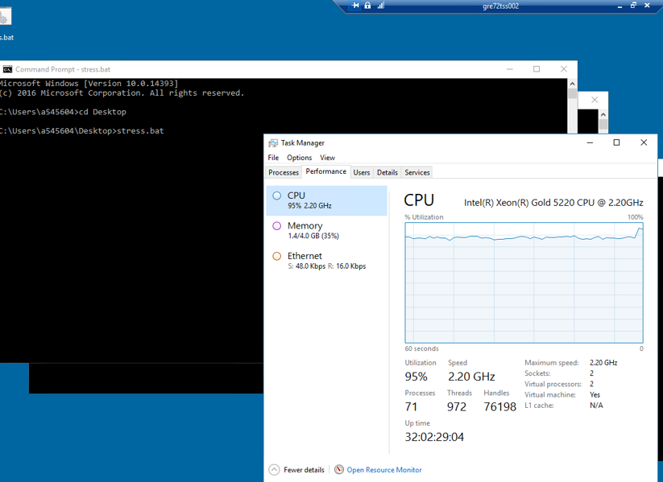 |
| Expected results | 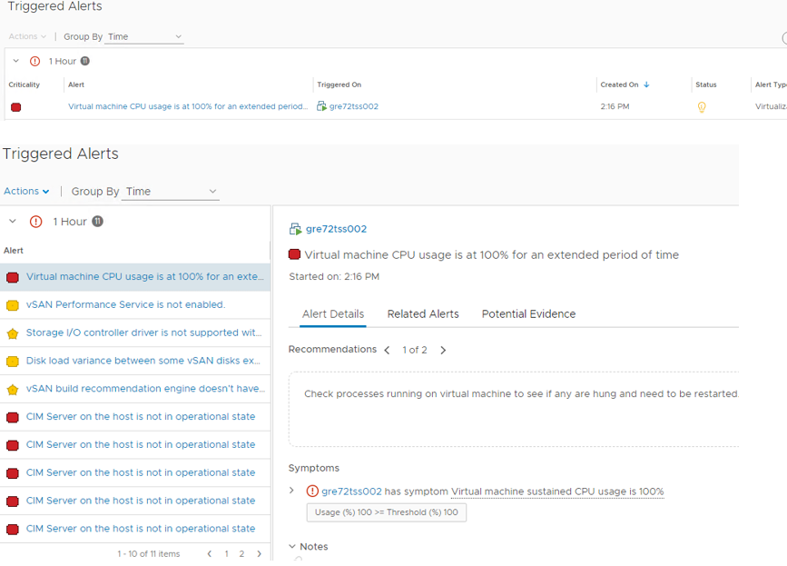 |
| Expected results | 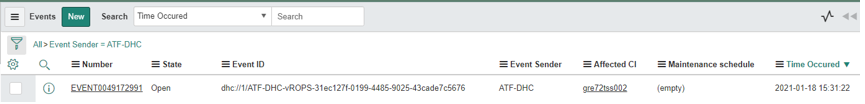 |
| Expected results | 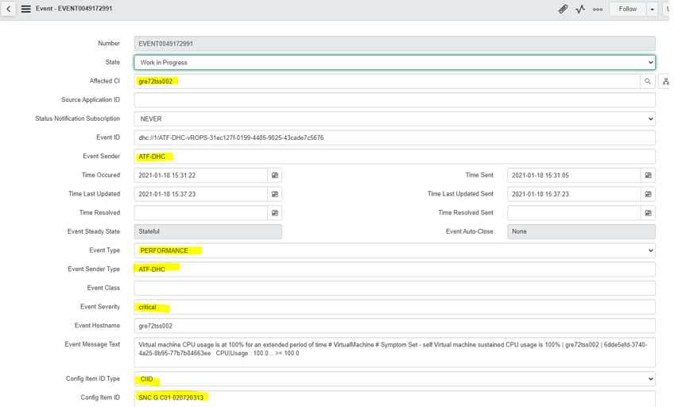 |

### Test INFRA-26 - Check access and secrets availability in HashiCorp Vault

This test is automated by `executeInfraTests.yml` playbook from `/opt/dhc/manage/` on the ansible server.
Alternatively, the manual process:

|                  |                                                     |
|------------------|-----------------------------------------------------|
| Test procedure   | Login to the terminal server                        |
| Test procedure   | Login to Hash Vault <https://hashiVault:8200>       |
| Test procedure   | Go to Secret                                        |
| Test procedure   | Check passwords availability                        |
| Expected results | Login to Hashi Vault is successful                  |
| Expected results | Passwords browsing is working                       |
| Expected results | Passwords are available                             |
| Expected results | 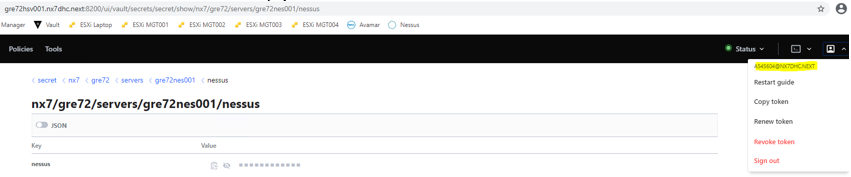 |

### Test INFRA-27 - Check domain membership of management servers

This test has been automated. In order to execute it, please log in to the ansible server and browse to `/opt/dhc/manage`. Execute the playbook `testLinuxAndWindowsDomainCreds.yml` by typing the following command:

```shell
ansible-playbook testLinuxAndWindowsDomainCreds.yml
```

>Note: you will be prompted to provide domain username and password. The account needs to be nested in platformadministrators domain group in order for this test to work.
Playbook will create a report in CSV format. Please see `/backup/testLinuxAndWindowsDomainCreds-datetime.csv` file.

Alternatively, the manual process:

|                  |                                                                                                  |
|------------------|--------------------------------------------------------------------------------------------------|
| Test procedure   | Logon to Windows Server using Active Directory account                                           |
| Test procedure   | Go to Administrative Tools → Active Directory Users and Computers                                |
| Test procedure   | Go to VCS → Servers                                                                              |
| Test procedure   | Check list of computer accounts                                                                  |
| Test procedure   | Logon to each Windows and Ubuntu VMs using domain account to confirm Active Directory membership |
| Expected results | All VMs from VCS Management stack are visible under the computer account list                    |
| Expected results | Logon to each Windows and Ubuntu VMs is successful using domain account                          |
| Expected results |                                                |

### Test INFRA-28 - Check status of vSAN encryption in vCenter

|                  |                                                                 |
|------------------|-----------------------------------------------------------------|
| Test procedure   | Login to the vCenter Server                                     |
| Test procedure   | Press vCenter server instance and navigate to Configure tab     |
| Test procedure   | Navigate to Security → Key Providers and select provider server |
| Test procedure   | Observe the list of KMS servers nodes                           |
| Test procedure   | Press cluster object and choice configure tab                   |
| Test procedure   | Press vSAN → Services                                           |
| Test procedure   | Observe the status of encryption                                |
| Test procedure   | Press cluster object and choice monitor tab                     |
| Test procedure   | Press vSAN → Health                                             |
| Test procedure   | Observe vCenter and all hosts in Encryption section             |
| Test procedure   | Check status of KMS nodes and cluster in vCenter KMS status tab |
| Test procedure   | Observe Key status                                              |
| Test procedure   | Change tab for Host KMS status                                  |
| Test procedure   | Observe Key status of each ESXi hosts                           |
| Test procedure   | Go to CPU AES-N section and observe the status                  |
| Expected results | Login to vCenter is working                                     |
| Expected results | KMS servers are up and connected                                |
| Expected results | Encryption is enabled on vSAN                                   |
| Expected results | KMS cluster is created and connected                            |
| Expected results | Key status of all ESXi servers is green                         |
| Expected results | CPU AES-N future is enabled                                     |
| Expected results | 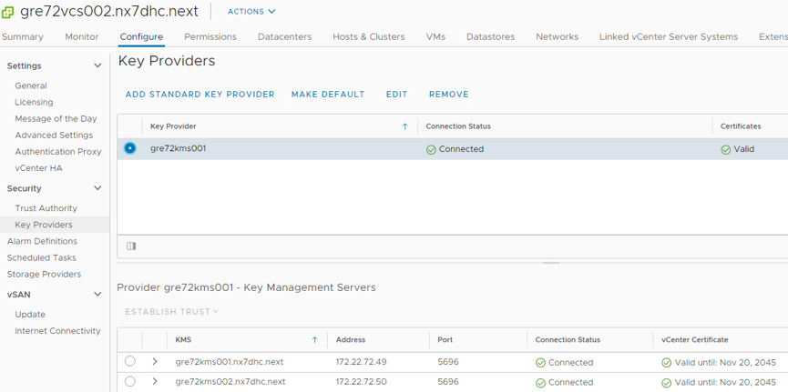            |
| Expected results | 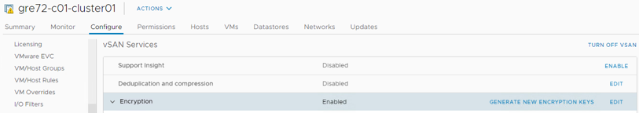            |
| Expected results | 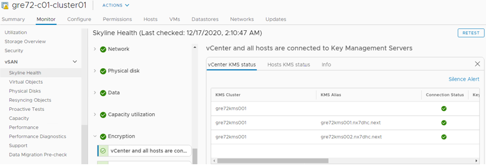            |
| Expected results | 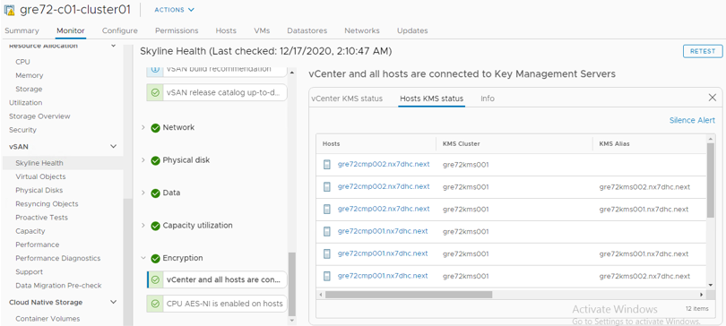            |
| Expected results | 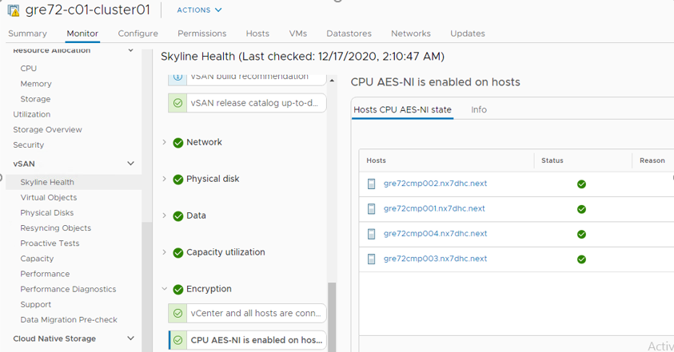            |

### Test INFRA-29 - Check status of vSAN encryption in KMS servers

|                  |                                                                                          |
|------------------|------------------------------------------------------------------------------------------|
| Test procedure   | Log into the Cloudlink webGUI on a first cluster node using secadmin                     |
| Test procedure   | Go to System → Cluster.                                                                  |
| Test procedure   | Verify the cluster status                                                                |
| Test procedure   | Go to System → License.                                                                  |
| Test procedure   | Verify license status                                                                    |
| Test procedure   | Go to Server → Syslog                                                                    |
| Test procedure   | Verify syslog server                                                                     |
| Test procedure   | Go to Server → >DNS                                                                      |
| Test procedure   | Verify DNS setup.                                                                        |
| Test procedure   | Go to System → Backup                                                                    |
| Test procedure   | Check backup setup.                                                                      |
| Expected results | Verify if the cluster status is listed as OK                                             |
| Expected results | License Subscription must be valid and active.                                           |
| Expected results | For Syslog hostname of vRLI load balancer has to be set and service has to be activated. |
| Expected results | Both local Domain Controller IP addresses are setup as DNS servers                       |
| Expected results | Backup is configured on SFTP provided by SDDC Manager                                    |
| Expected results | 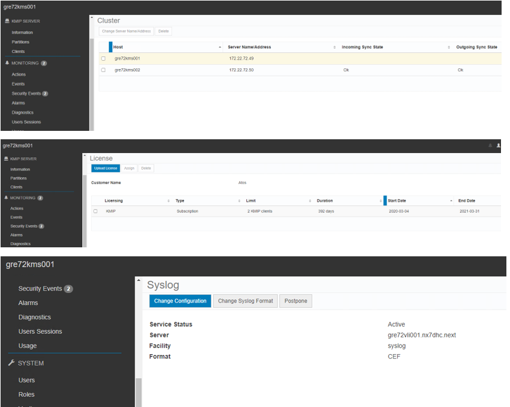                                            |
| Expected results | 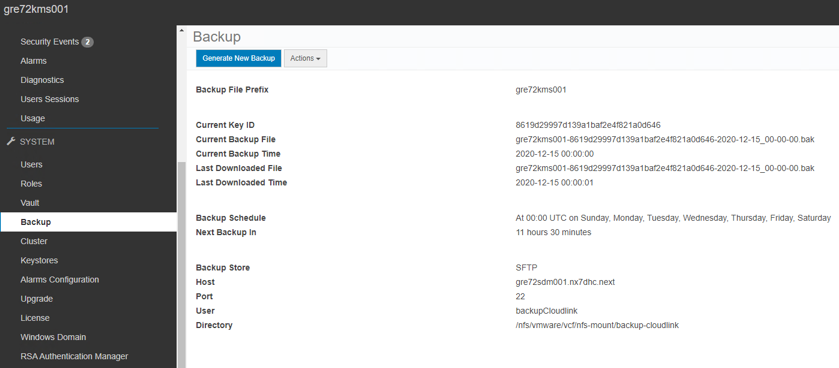                                            |

### Test INFRA-30 - Verify Event Management

|                  |                                                                        |
|------------------|------------------------------------------------------------------------|
| Test procedure   | Login to the vROps server                                              |
| Test procedure   | Go to adapters and make sure SNOW plugin is enabled and configured     |
| Test procedure   | Open SSH session to HTTP Gateway server (hgw001)                       |
| Test procedure   | Login to the host using credentials from Hashi Vault                   |
| Test procedure   | Go to → /opt/pubsubpy3.7/dpcop-pubsub-http-gw-master/pubsubhttpgateway |
| Test procedure   | Open entrypoint.sh file and validate if all parameters are correct     |
| Test procedure   | Check if dedicated project for VCS is created in ABS                   |
| Test procedure   | Check if Enent Listener is created in SNOW                             |
| Test procedure   | Check if MGT Cis are created in CMDB                                   |
| Test procedure   | Generate some load on VM to raise alert in vROPS                       |
| Test procedure   | Login to SNOW                                                          |
| Test procedure   | Look for a ticket raised under relevant CI                             |
| Expected results | Login successful                                                       |
| Expected results | SNOW plugin is enabled and configured                                  |
| Expected results | Login to hgw001 is successful                                          |
| Expected results | Parameters in entrypoint.sh are correctly defined                      |
| Expected results | Project and configuration on ABS side is done                          |
| Expected results | Event Listener is defined in SNOW                                      |
| Expected results | Alert in VROPS created                                                 |
| Expected results | A ticket for the MGMT CI is raised                                     |
| Expected results | Incident created as well with proper group assignment                  |
| Expected results | 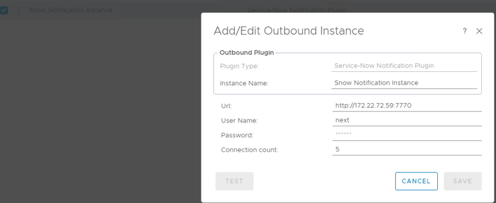                        |
| Expected results | 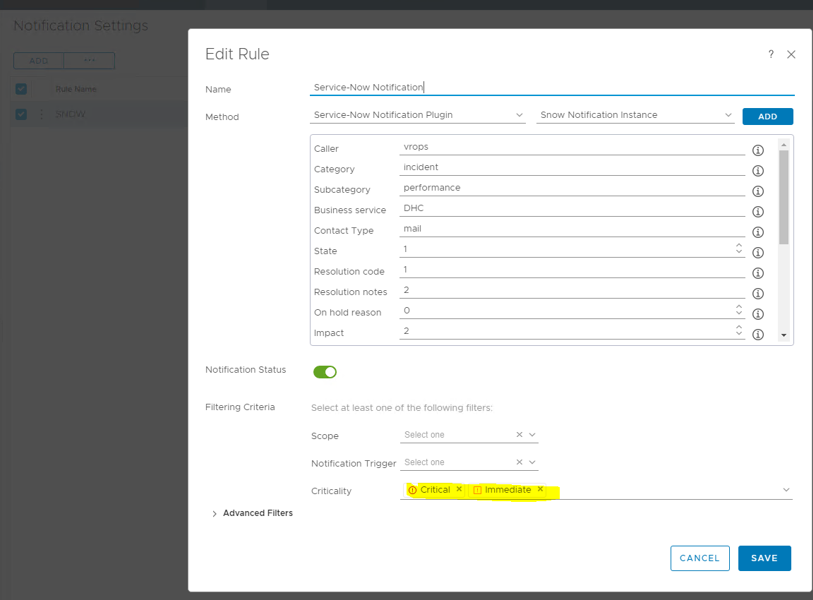                        |
| Expected results | 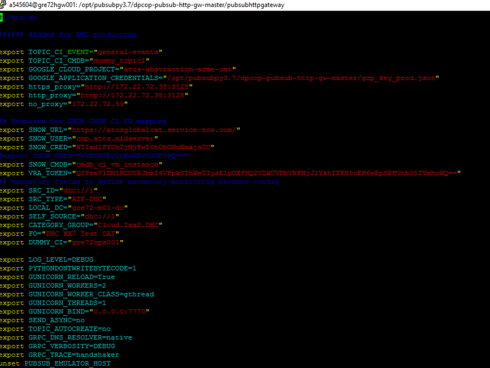                        |
| Expected results | 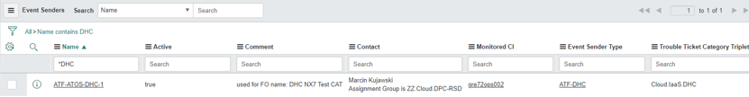                        |
| Expected results | 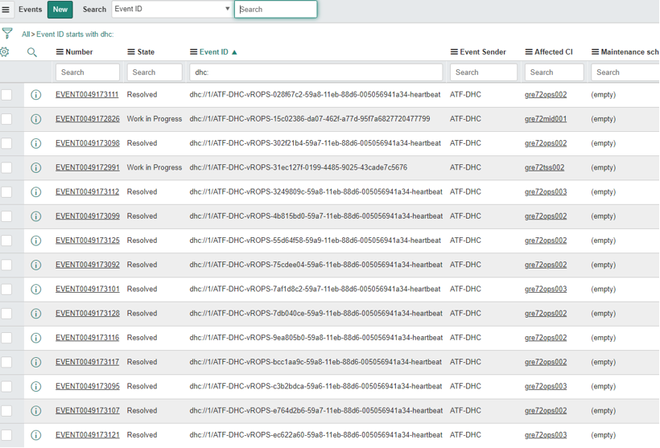                        |
| Expected results | 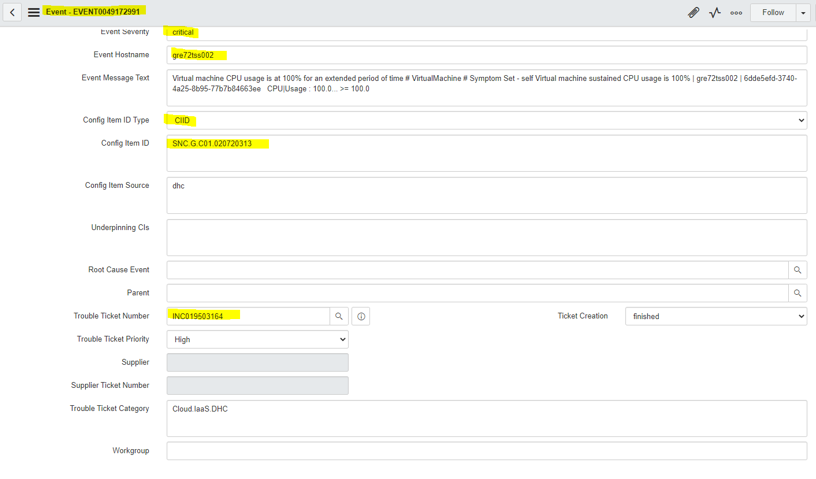                        |
| Expected results | 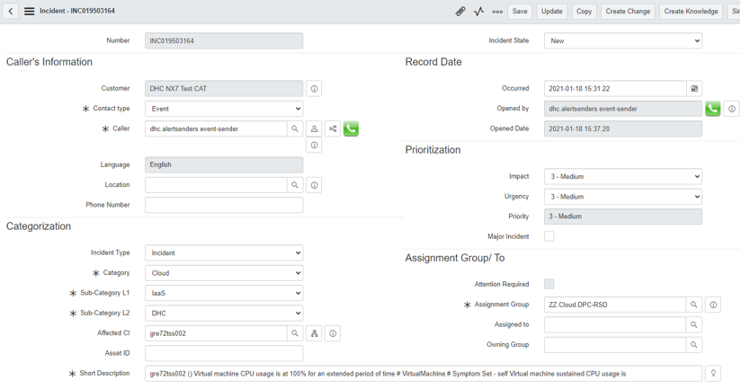                        |

### Test INFRA-31 - Check Internet Proxy functionality, whitelist/blacklist

This test is automated by `executeInfraTests.yml` playbook from `/opt/dhc/manage/` on the ansible server.
Alternatively, the manual process:

|                  |                                                                                                                                  |
|------------------|----------------------------------------------------------------------------------------------------------------------------------|
| Test procedure   | Log in to the Terminal Server and open Internet Explorer                                                                         |
| Test procedure   | Go to Tools → Internet Options                                                                                                   |
| Test procedure   | Go to the Connections tab and click LAN settings                                                                                 |
| Test procedure   | Check "Use a proxy" option and type in the Load-Balancer's proxy IP address and port 3128 (the default port for Squid), Click OK |
| Test procedure   | Navigate to vmware.com to make sure that the proxy is working.                                                                   |
| Test procedure   | Disable Proxy in the browser and navigate vmware.com once again.                                                                 |
| Test procedure   | Check all sites from the Proxy whitelist (actual list is available HERE)                                                         |
| Expected results | Internet access is possible only through the proxy server.                                                                       |
| Expected results | Internet connection doesn't work when proxy is not setup.                                                                        |
| Expected results | 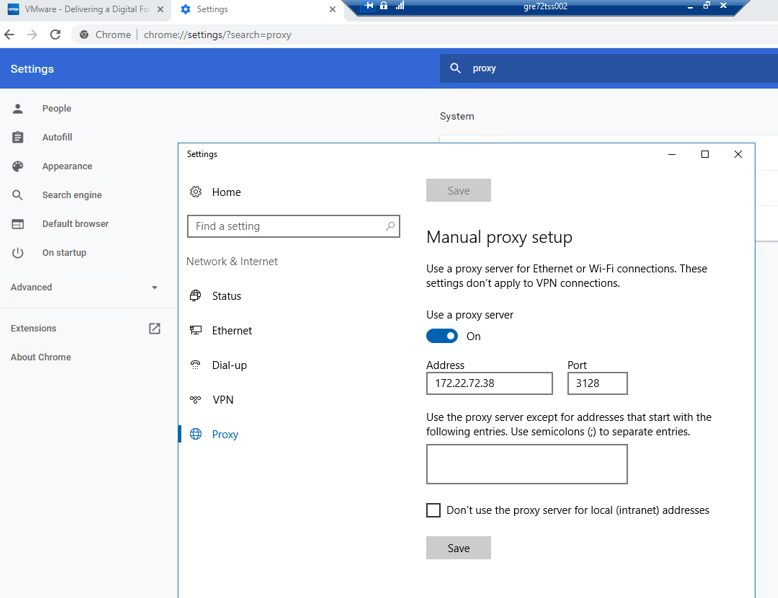                                                                                  |
| Expected results | 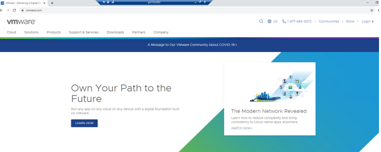                                                                                  |

### Test INFRA-32 - Reporting and Billing

This test is automated by `executeInfraTests.yml` playbook from `/opt/dhc/manage/` on the ansible server.
Alternatively, the manual process:

|                  |                                                                             |
|------------------|-----------------------------------------------------------------------------|
| Test procedure   | Login to the terminal server by RDP                                         |
| Test procedure   | Open browser and enter URL for vCenter Client                               |
| Test procedure   | Enter Username and Password                                                 |
| Test procedure   | Validate that VM → < location >bil001 is present                            |
| Test procedure   | Check if → billing-user exists in Hashi Vault (servers/< location >bil001/) |
| Expected results | Login successful                                                            |
| Expected results | Login window opens                                                          |
| Expected results | vSphere Client is accessible using domain credentials                       |
| Expected results | Billing VM is deployed                                                      |
| Expected results | User billing-user is present in Hashi Vault                                 |
| Expected results | Check status of billing by execution command: billing-status                |
| Expected results | Billing reports are present in /opt/billing-data folder                     |
| Expected results | 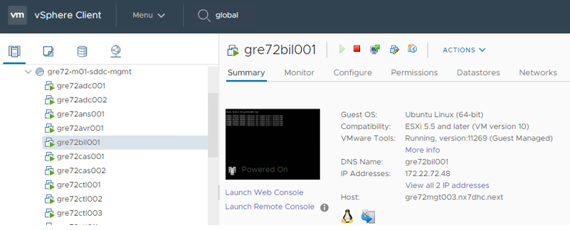                           |
| Expected results | 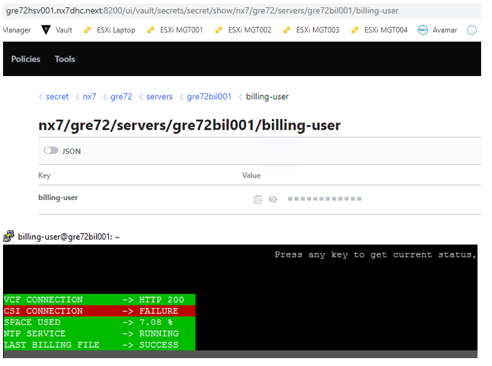                           |
| Expected results | 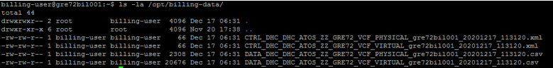                           |

### Test INFRA-33 - Ansible Python Virtual Environment

|                  |                                                                           |
|------------------|---------------------------------------------------------------------------|
| Test procedure   | Login to ans001 machine console                                           |
| Test procedure   | Once logged in you should be prompted about PytHon3 Virtual Environment   |
| Test procedure   | Validate that python venv is activated by executing: listPy3Venv.sh       |
| Test procedure   | Validate if all playbooks and repository is present (check /opt/dhc path) |
| Expected results | Python3 virtual environment information is prompted after logon           |
| Expected results | Python virtual environment is activated and listed                        |
| Expected results | All playbooks and repositories are in place                               |
| Expected results | 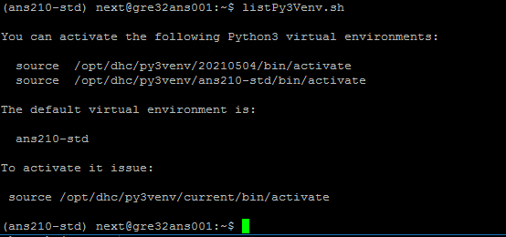                       |

### Test INFRA-34 - Check DR execution in case of A/P or A/A DR setup using vSphere SRM

|                  |                                                                                                |
|------------------|------------------------------------------------------------------------------------------------|
| Test procedure   | Login to SRM console                                                                           |
| Test procedure   | Invoke and execute a Recovery Plan for any DR protected test VM within a test Protection Group |
| Expected results | The test VM should be successfully failed over to the DR site and must be accessible           |
| Test Procedure   | Perform a failback test and move the test VM back to its protected site                        |
| Expected results | The VM should be failed back to its protected site and be accessible                           |

### Test INFRA-35 - Check if EVC Mode is enabled in Environment

|                  |                                                             |
|------------------|-------------------------------------------------------------|
| Test procedure   | Login to the terminal server by RDP                         |
| Test procedure   | Open browser and enter URL for vCenter Client               |
| Test procedure   | Enter Username and Password                                 |
| Test procedure   | Navigate to the Config tab of management cluster            |
| Test procedure   | Go into Configuration -> Vmware EVC Mode                    |
| Test procedure   | Check if EVC Mode is enabled on the level of the oldest CPU |
| Test procedure   | Repeat for every cluster in the environment                 |
| Expected results | EVC Mode is enabled on every cluster in the environment     |

## VCS Hardening

### Test HARDEN-1 - Admin account creation in the management domain

|                  |                                                                            |
|------------------|----------------------------------------------------------------------------|
| Test procedure   | Login as a created domain user to any windows system, i.e. tss001, adc001. |
| Test procedure   | Go to Active Directory Users and Computer                                  |
| Test procedure   | Go to VCS → Users → DHCAdmins                                              |
| Test procedure   | Check if admins have proper domain accounts                                |
| Expected results | Each admin must have a personal account.                                   |
| Expected results | 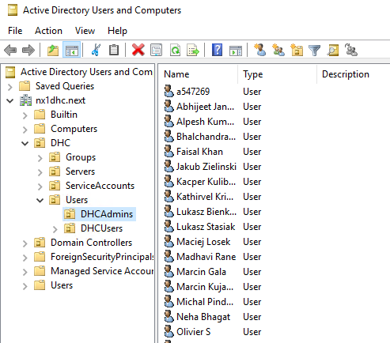                                |

### Test HARDEN-2 - Patching of the management stack VMs (Linux & Windows)

|                  |                                                                                                                                                                               |
|------------------|-------------------------------------------------------------------------------------------------------------------------------------------------------------------------------|
| Test procedure   | Windows servers: to check and see reports, login to WSUS (wus001) server and explore folders:<br>- D:\AnsiblePatchReport\post_patching <br> - D:\AnsiblePatchReport\on_demand |
| Test procedure   | Linux servers: to check and see reports, login to deb001 linux server and explore folder:<br>- /data/ansiblepatchreport/post_patching                                         |
| Expected results | Patching reports are available and confirm Management VMs have been updated.                                                                                                  |
| Expected results | 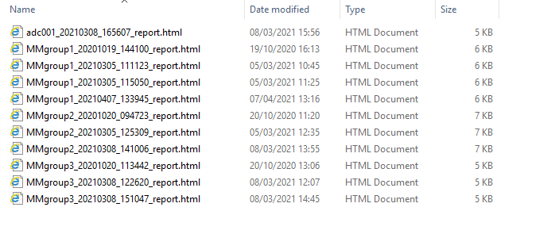                                                                                                                      |
| Expected results | 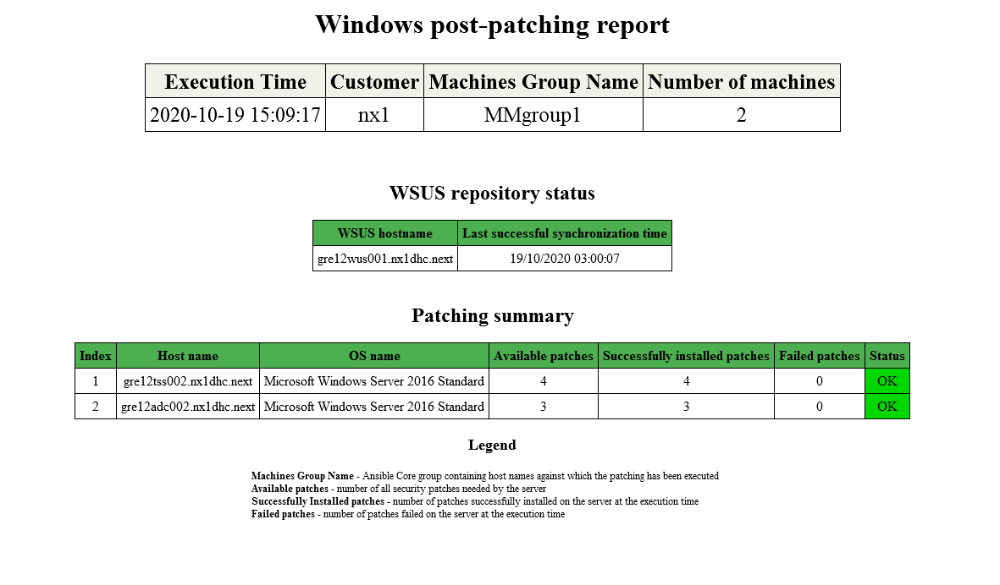                                                                                                                     |
| Expected results | 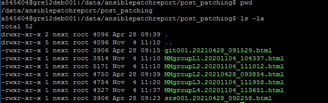                                                                                                                        |
| Expected results | 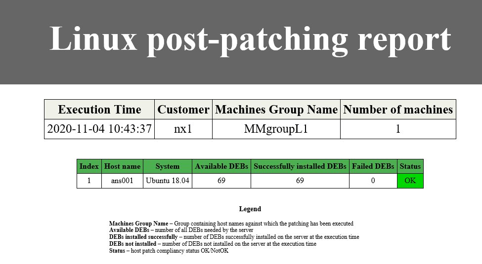                                                                                                                       |

### Test HARDEN-3 - Firewall rules implementation - NSX-T microsegmentation

|                  |                                                                                    |
|------------------|------------------------------------------------------------------------------------|
| Test procedure   | Login to NSX-T via HTTPS                                                           |
| Test procedure   | Navigate to Security → Distributed Firewall                                        |
| Test procedure   | Verify if sections, rules (sources, destinations, services, apply to) are existing |
| Test procedure   | Verify if last section is containing rule with DENY action                         |
| Test procedure   | Navigate to Inventory → Groups                                                     |
| Test procedure   | Verify if segments are created                                                     |
| Expected results | Rules are implemented and last section is containing DENY action.                  |
| Expected results | Segments are implemented.                                                          |
| Expected results | 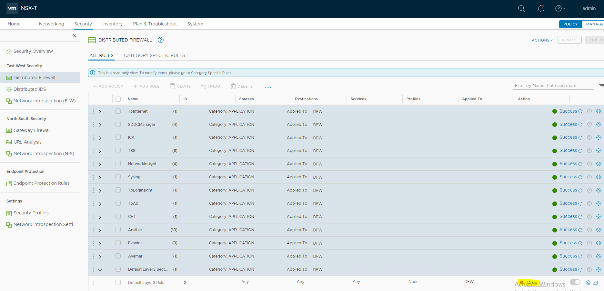                               |
| Expected results | 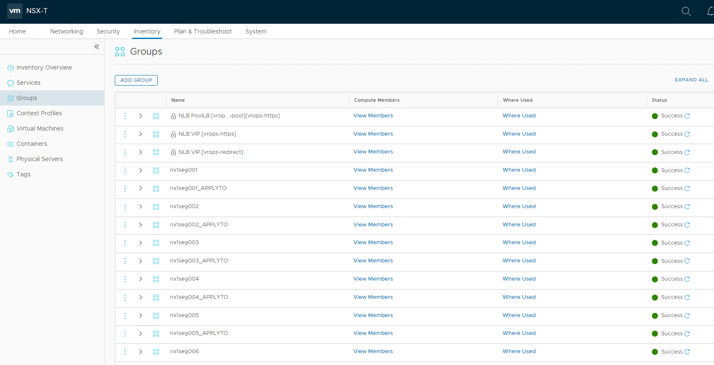                               |

### Test HARDEN-4 - Alcatraz Compliance management

|                  |                                                                                                                    |
|------------------|--------------------------------------------------------------------------------------------------------------------|
| Test procedure   | SSH to ans001                                                                                                      |
| Test procedure   | Change directory:                                                                                                  |
| Test procedure   |   cd /opt/dhc/deploy/roles/dhc-installAlcatraz/files/reports                                                       |
| Test procedure   | List directory content                                                                                             |
| Test procedure   |   ls -al                                                                                                           |
| Test procedure   | Check if these folders contain report files (file name format looks like < timestamp >_< hostname_result.xml >)        |
| Expected results | Confirm reports are in destination directory.                                                                      |
| Expected results | 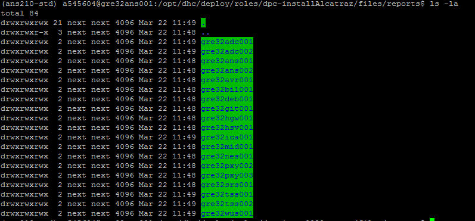 |
| Expected results | 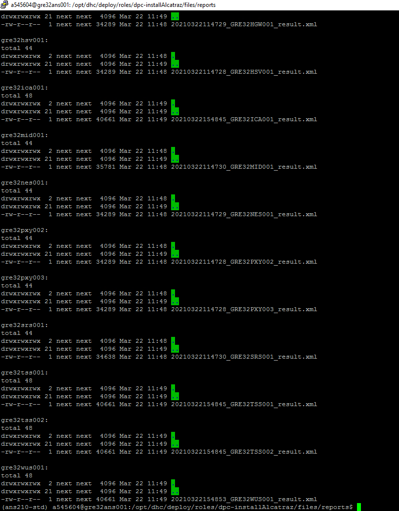 |

### Test HARDEN-5 - Nessus Vulnerability scanning

|                  |                                                                                                      |
|------------------|------------------------------------------------------------------------------------------------------|
| Test procedure   | SSH to Nessus server - nes001                                                                        |
| Test procedure   | Change directory                                                                                     |
| Test procedure   | cd /opt/nessus/var/dhcReports/nessus                                                                 |
| Test procedure   | List directory content                                                                               |
| Test procedure   | ls -al                                                                                               |
| Test procedure   | Check if folder contains report files ( file name format looks like Scan_< type >_< timestamp.csv >) |
| Expected results | Confirm Nessus reports have been successfully created                                                |
| Expected results | 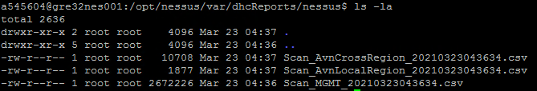                                                      |

### Test HARDEN-6 - Active Directory Group Policy adjustments

|                  |                                                                                               |
|------------------|-----------------------------------------------------------------------------------------------|
| Test procedure   | Login to all windows system, i.e. tss001, ica001                                              |
| Test procedure   | Navigate to: Control Panel → System and Security → Administrative Tools → Computer Management |
| Test procedure   | Confirm local "Administrator" account name has been changed to "c-kathos".                    |
| Expected results | Verify "Administrator" account name has been changed.                                         |
| Expected results |                                               |
| Test procedure   | Execute *kinit* command followed by your *domain login*                   |
| Test procedure   | IMPORTANT: please use capital letters in domain name!                     |
| Test procedure   | Execute *klist* command. As a result you should see valid kerberos ticket |
| Expected results | Confirm the valid Kerberos ticket exists                                  |
| Expected results | 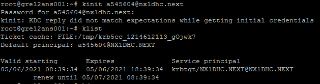                         |

### Test HARDEN-8 - SDDC Manager reset VCF components credentials

|                  |                                                                                             |
|------------------|---------------------------------------------------------------------------------------------|
| Test procedure   | Login to HashiCorp Vault by HTTPS:                                                          |
| Test procedure   | Navigate to secret → < customerCode > → < locationCode > → servers → < locationCode >sdm001 |
| Test procedure   | Check passwords for admin, ansible, root and vcf                                            |
| Test procedure   | Login to SDDC Manager:                                                                      |
| Test procedure   | SSH to the server using vcf and ansible account to confirm that passwords are valid         |
| Test procedure   | Switch user to root: run command "su". Provide password for user root.                      |
| Expected results | Confirm that records for admin, ansible, root and vcf have random and complex passwords.    |
| Expected results | Confirm you're able login to SDDC Manager as `administrator@vsphere.local`.                 |
| Expected results | 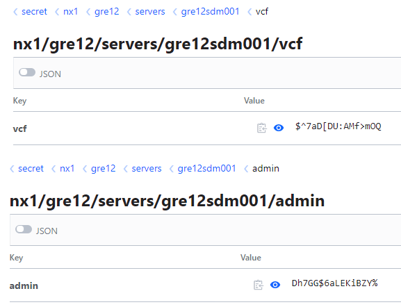                                              |
| Expected results | 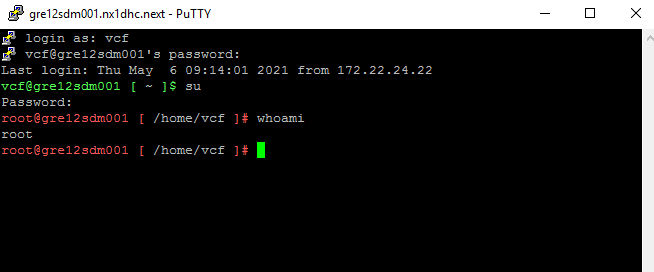                                              |
| Expected results | 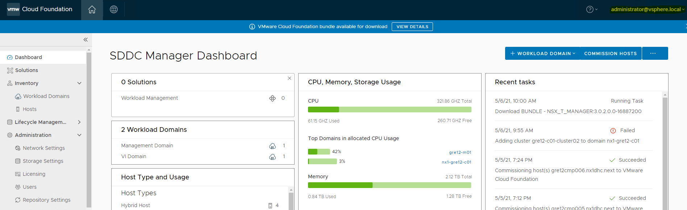                                              |

### Test HARDEN-9 - Management Servers credentials

|                  |                                                                 |
|------------------|-----------------------------------------------------------------|
| Test procedure   | Login to all linux system using local user 'next' account       |
| Test procedure   | Get user 'next' password from HashiCorp Vault                   |
| Test procedure   | Login to all Windows system using local user 'c-kathos' account |
| Test procedure   | Get 'c-kathos' user password from HashiCorp Vault               |
| Expected results | Login to Linux using account 'next' is successful.              |
| Expected results | Login to Windows using account 'c-kathos' is successful.        |
| Expected results | 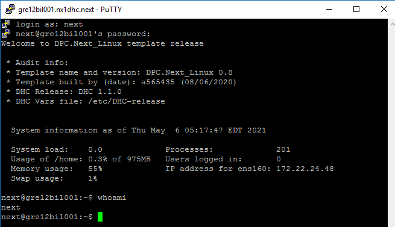                   |
| Expected results | 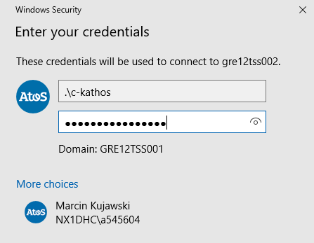               |
| Expected results | 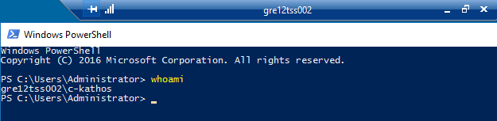               |

### Test HARDEN-10 - ESXi hosts domain join

This test has been automated. In order to execute it, please log in to the ansible server and browse to `/opt/dhc/manage`. Execute the playbook `testEsxiDomainCreds.yml` by typing the following command:

```shell
ansible-playbook testEsxiDomainCreds.yml
```

>Note: you will be prompted to provide domain username and password. The account needs to be nested in platformadministrators domain group in order for this test to work.
Playbook will create a report in CSV format. Please see `/backup/testEsxiDomainCreds-datetime.csv` file.

Alternatively, the manual process:

|                  |                                                   |
|------------------|---------------------------------------------------|
| Test procedure   | Login to several ESXi hosts using domain account. |
| Expected results | Login is possible using domain user account       |
| Expected results | 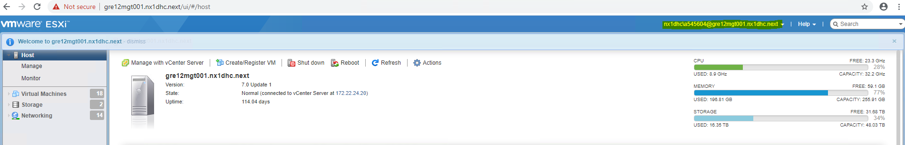     |

### Test HARDEN-11 - Out of band management - remote controller card credentials (iDRAC)

|                  |                                                                                            |
|------------------|--------------------------------------------------------------------------------------------|
| Test procedure   | Get user password from HashiCorp Vault.                                                    |
| Test procedure   | Login to oob management system using local admin account.                                  |
| Test procedure   | Open web browser and navigate to oob management system login page. Login as a local admin. |
| Expected results | Password is random and complex.                                                            |
| Expected results | Login is successful.                                                                       |
| Expected results | 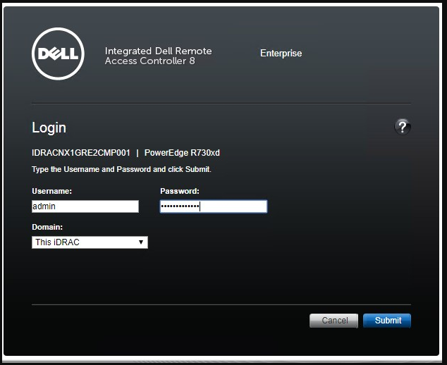                                             |

### Test HARDEN-12 - Hardening of VCS Password Manager (HashiCorp Vault)

|                  |                                                                     |
|------------------|---------------------------------------------------------------------|
| Test procedure   | Login to HashiCorp Vault password manager using domain user account |
| Expected results | Login is successful.                                                |
| Expected results | 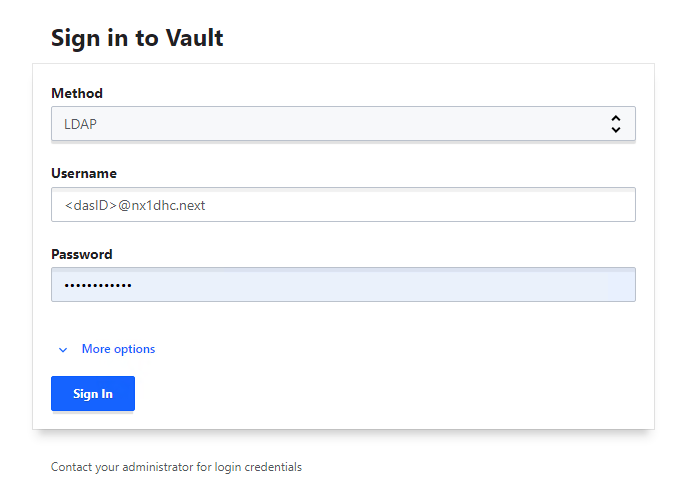                     |
| Expected results | 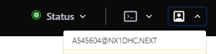                     |

### Test HARDEN-13 - Ansible vars and inventory cleanup

|                  |                                                                        |
|------------------|------------------------------------------------------------------------|
| Test procedure   | SSH to Ansible Management Core server (ans001).                        |
| Test procedure   | Use cat or your favourite text editor. Check:                          |
| Test procedure   | - /opt/dhc/deploy/hosts                                                |
| Test procedure   | - /opt/dhc/deploy/group_vars/all                                       |
| Test procedure   | - /opt/dhc/deploy/group_vars/nsxVars.yml                               |
| Expected results | Confirm files do not contain passwords or tokens stored in clear text. |
| Expected results | 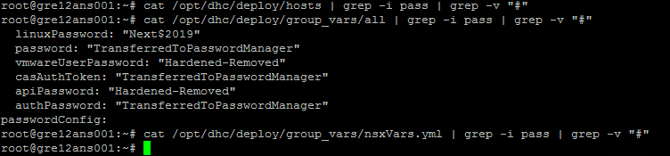                          |

### Test HARDEN-14 - Prerequisite Virtual Machine log files transfer

|                  |                                                                       |
|------------------|-----------------------------------------------------------------------|
| Test procedure   | SSH to Ansible Management Core server (ans001).                       |
| Test procedure   | Validate if /var/log/dhcLog/pre_ansible.log exists.                   |
| Expected results | Confirm logs gathered during deploy stages are visible in the folder. |
| Expected results | 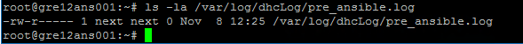                         |

### Test HARDEN-15 - Confirm the availability of Nessus reports mailing cron job on ansible server

|                  |                                                                                |
|------------------|--------------------------------------------------------------------------------|
| Test procedure   | SSH to Ansible Management Core server (ans001).                                |
| Test procedure   | Switch to the root user using sudo -i command                                  |
| Test procedure   | Check the crontab -l list.                                                     |
| Expected results | Confirm the cron job for exporting Nessus scan results is listed and scheduled |
| Expected results | 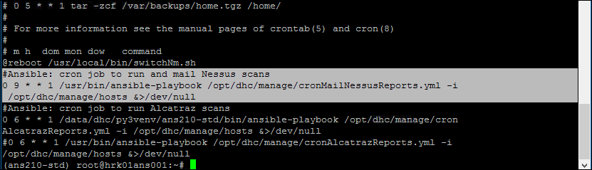          |

### Test HARDEN-16 - Confirm the license & plugins status of the Nessus server

|                  |                                                                                            |
|------------------|--------------------------------------------------------------------------------------------|
| Test procedure   | Login to the Nessus server console using the Nessus account                                |
| Test procedure   | Navigate to Settings -> About                                                              |
| Test procedure   | Click on the overview tab.                                                                 |
| Expected results | Confirm the Plugins last updated status is latest & License expiration date is not expired |
| Expected results | 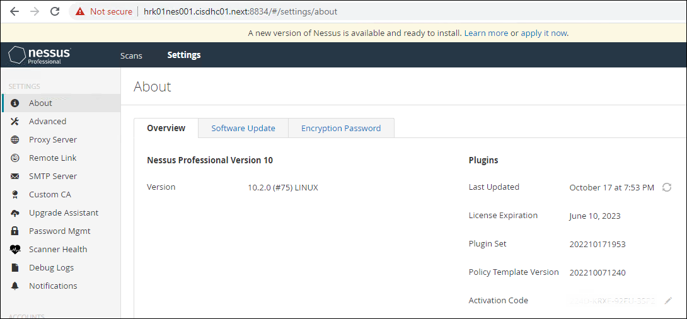                        |
  
## vRA Cloud

**All vRA Cloud tests are automated.**
Before you can execute the automated tests, there is one prerequisite - a token has to be generated in vRA Cloud. In order to do that execute the following playbook from `/opt/dhc/manage`:

```shell
ansible-playbook createVraCloudToken.yml
```

If you have not performed this action before and need more details about this process, please read more in `wiTenantBuilder.md` chapter `CAS Integration - Tenant organization token creation (*createVraCloudToken.yml*)`

Once your vra Cloud token is safely stored in Hashi Vault, in order to execute the vRA tests, please logon to the ansible server and browse to `/opt/dhc/manage`. Execute playbook `executeInfraTests.yml` with the following tags:

```shell
ansible-playbook executeInfraTests.yml --tags vra
```

Default casProjectName is "prd001", you may use extra variables to provide a different project name, e.g.,

```shell
ansible-playbook executeInfraTests.yml --tags vra -e "casProjectName=prd002"
```

>Note: you will be prompted to provide domain username, domain password, and tenant name.

The playbook will create a report in HTML format. Please see `dhcInfrastructureReport.html` file under `/backup/` for more details.

Tests covered by the playbook:

### Test VRA-1 - Check OS templates are imported in vCenter (CMP Cluster)

### Test VRA-2 - Check vRA Cloud configuration

### Test VRA-3 - API calls verification in CAS (Code Stream) - Create VM

### Test VRA-4 - API calls verification in CAS (Code Stream) - Power Operations

### Test VRA-5 - API calls verification in CAS (Code Stream) - Snapshot Operations

### Test VRA-6 - API calls verification in CAS (Code Stream) - Disk Operations

### Test VRA-7 - API calls verification in CAS (Code Stream) - Resize VM

### Test VRA-8 - API calls verification in CAS (Code Stream) - Delete VM

Tests covered by the manual action:

### Test VRA-9 - Check OS templates are synchronized with Published Content Library in vCenter (CMP Cluster)

### Test VRA-1 - Check OS templates are imported in vCenter (CMP Cluster)

Checks IF the OS templates are imported in CMP vCenter.

### Test VRA-2 - Check vRA Cloud configuration

Checks the configuration of the following components on vRA Cloud:

- vRA Cloud accounts:
  - NSX
  - vCenter Server
- Cloud zone
- Project zone
- Network profiles:
  - App
  - Db
  - Web
  - Tooling
- vRA Cloud blueprints
- Flavor mappings
- Image mappings
- Storage policies
- Storage profiles

### Test VRA-3 - API calls verification in CAS (Code Stream) - Create VM

Tests VM creation.

### Test VRA-4 - API calls verification in CAS (Code Stream) - Power Operations

Tests the following power operations:

- VM reboot
- VM reset
- VM shutdown
- VM power off
- VM power on

### Test VRA-5 - API calls verification in CAS (Code Stream) - Snapshot Operations

Tests the following snapshot operations:

- Create snapshot
- Revert to snapshot
- Delete snapshot

### Test VRA-6 - API calls verification in CAS (Code Stream) - Disk Operations

Tests the following disk operations:

- Add disk to VM
- Remove disk from VM
- Resize VM disk

### Test VRA-7 - API calls verification in CAS (Code Stream) - Resize VM

Tests the following operation:

- VM resize (CPU and memory).

### Test VRA-8 - API calls verification in CAS (Code Stream) - Delete VM

Tests the following operation:

- Delete VM

### Test VRA-9 - Check OS templates are synchronized with Published Content Library in vCenter (CMP Cluster)

|                  |                                                                                                      |
|------------------|------------------------------------------------------------------------------------------------------|
| Test procedure   | In VMware Aria Automation web console open Assembler and navigate to Infrastructure → Image Mappings |
| Test procedure   | The number of Account / region items should  correspond to the number of VCS sites configured        |
| Test procedure   | Open the first mapping and compare the configuration of the images by noting down its IDs            |
| Expected results | In projects with multiple Accounts / regions configured, number of regions should be at least   2    |
| Expected results | Image ID for each item remains the same for all configured mappings                                  |
| Expected results | 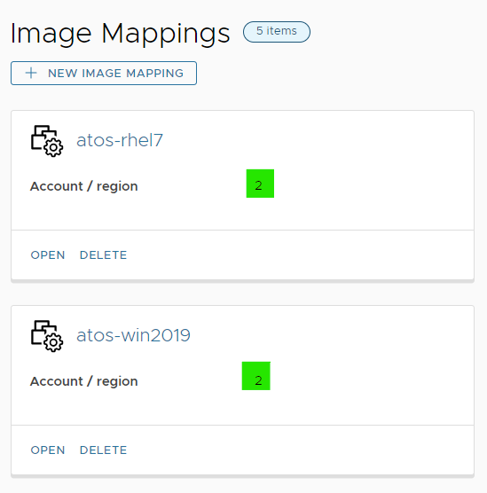                                               |
| Expected results | 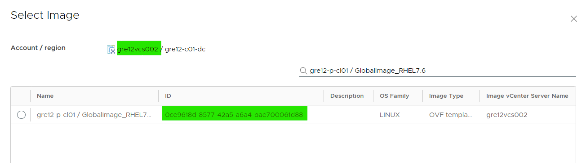                                                    |
| Expected results | 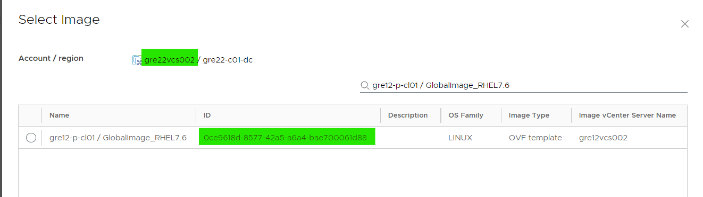                                                    |

## Backup

### Test BACKUP-1 - Check backup integration (VCS side)

|                  |                                                                                                                                                     |
|------------------|-----------------------------------------------------------------------------------------------------------------------------------------------------|
| Test procedure   | Backup proxy server (avp00x) is deployed in MGT cluster                                                                                             |
| Test procedure   | Tag "daily1800_3w" is added to each VM from VCS Management stack which should be backed up (check lldBackup.md)                                     |
| Test procedure   | CBT settings for all VMs in the MGT cluster (VM Edit Settings → VM Options → Advanced → Configuration Parameters → Edit Configuration → ctkEnabled) |
| Test procedure   | Dedicated user account for backup is created in vCenter (Administration → SSO → Users and Groups → Domain → vsphere.local                           |
| Expected results | Proxy is deployed avp00x)                                                                                                                           |
| Expected results | Tag is added to each VM "daily1800_3w"                                                                                                              |
| Expected results | CBT is setup (ctkEnabled = TRUE)                                                                                                                    |
| Expected results | Dedicated user `backup@vsphere.local` is created in vCenter.                                                                                        |
| Expected results | 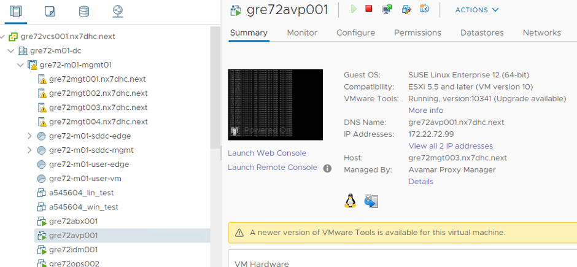                                                                                                |
| Expected results | 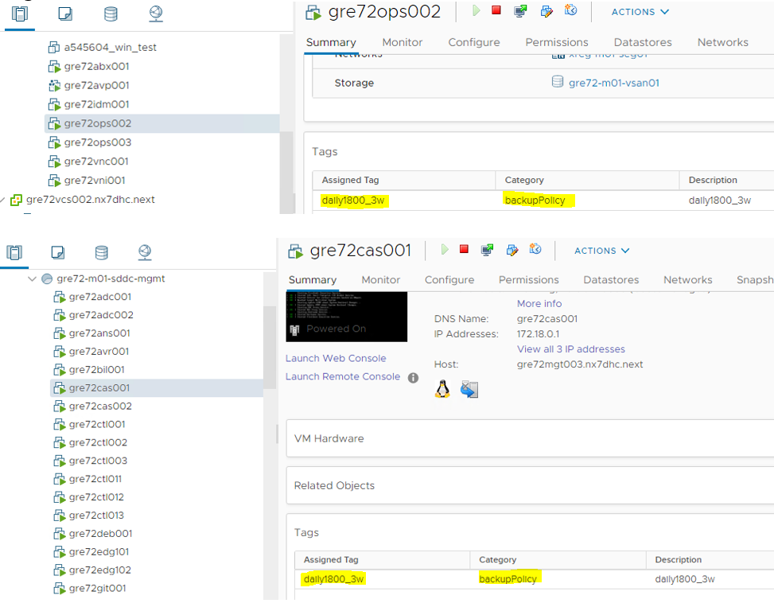                                                                                                  |
| Expected results | 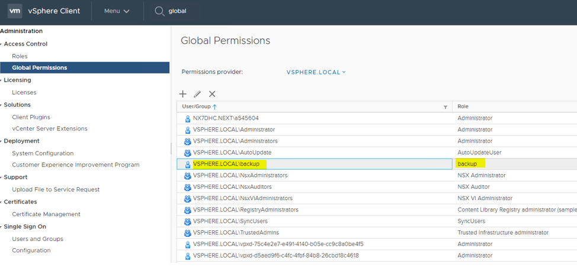                                                                                                 |

### Test BACKUP-2 - Check backup integration (backup side)

|                  |                                                                                                                              |
|------------------|------------------------------------------------------------------------------------------------------------------------------|
| Test procedure   | For this test interaction with 3rd party (CEB/backup team) is mandatory.                                                     |
| Test procedure   | Get contact to Backup team from Integration Architect or Project Manager.                                                    |
| Test procedure   | Check with backup team:                                                                                                      |
| Test procedure   | - Avamar/Networker is up and running                                                                                         |
| Test procedure   | - Datasets, schedules, retentions policies are configured                                                                    |
| Test procedure   | - Avamar/Networker is integrated with VCS vCenter                                                                            |
| Test procedure   | - VCS Management VMs are backed up                                                                                           |
| Test procedure   | - VCS Compute VMs are backed up (optionally)                                                                                 |
| Expected results | Backup team will deliver confirmation (written or screenshot) that VCS backup is fully configured and VCS VMs are protected. |
| Expected results | Dedicated user `backup@vsphere.local` is created in vCenter.                                                                 |
| Expected results | 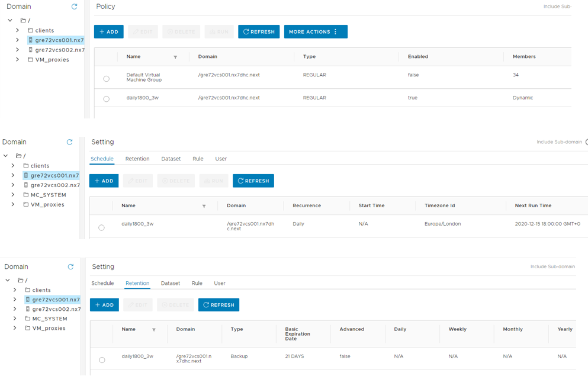                                                                       |
| Expected results | 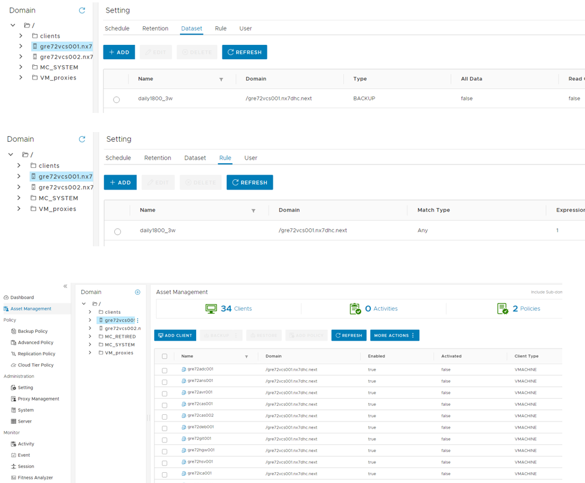                                                                       |

### Test BACKUP-3 -  Verify test backup and restore (mgt VM)

|                  |                                                                                                                                                |
|------------------|------------------------------------------------------------------------------------------------------------------------------------------------|
| Test procedure   | Check backup solution.                                                                                                                         |
| Test procedure   | For this test interaction with 3rd party (Backup team) is mandatory. Get contact to backup team from Integration Architect or Project Manager. |
| Test procedure   | Ask backup team to backup a particular VM from VCS Management stack                                                                            |
| Test procedure   | Ask backup team to restore a particular VM from VCS Management stack                                                                           |
| Expected results | Backup process is successful                                                                                                                   |
| Expected results | Restore process is successful and restored VM is visible in vCenter                                                                            |
| Expected results | 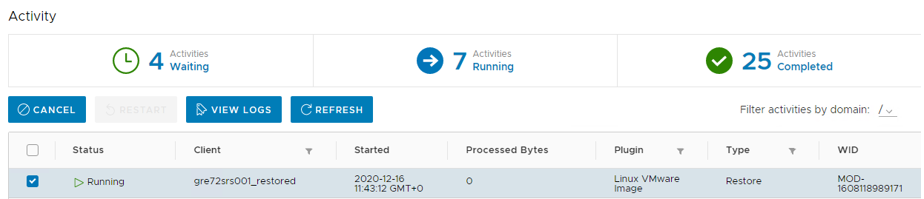                                                                                            |
| Expected results | 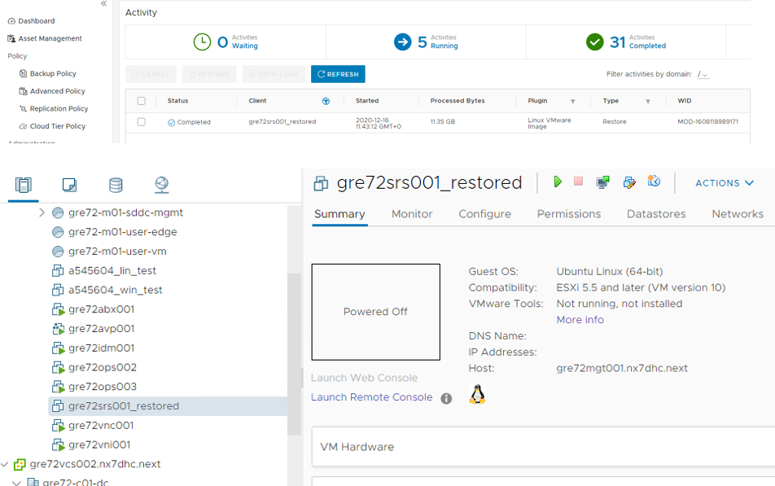                                                                                         |

## CMP (optional)

Applicable only if integration with CMP is in place, otherwise it can be skipped as not applicable part.

### Test CMP-1 - Check CMP integration

|                  |                                                                                                                                                                                         |
|------------------|-----------------------------------------------------------------------------------------------------------------------------------------------------------------------------------------|
| Test procedure   | Verify that CMP team received following information to execute discovery process:<br>- Account ID (from vRA Cloud)<br>- Project ID (from vRA Cloud)<br>- Datacenter name (from vCenter) |
| Test procedure   | Check if MID001 is created in vCenter                                                                                                                                                   |
| Test procedure   | Check if mid services are running on both VMs                                                                                                                                           |
| Test procedure   | Check log files if no errors occurred                                                                                                                                                   |
| Expected results | CMP Team received all information and CMP discovery is working                                                                                                                          |
| Expected results | MID001 is deployed in vCenter                                                                                                                                                           |
| Expected results | Services are up and running                                                                                                                                                             |
| Expected results | Logs do not contain any errors on MID servers                                                                                                                                           |

### Test CMP-2 - Validate CPRs excecution

CPRs execution results are stored in a separate document.
Please see CPRs Tests [Apendix B](#appendix-b) for details.

## Service Now

### Test SNOW-1 - Validate CMDB for Customer Workload

|                  |                                                                                                          |
|------------------|----------------------------------------------------------------------------------------------------------|
| Test procedure   | Login to SNOW.                                                                                           |
| Test procedure   | Go to → VM Instances table.                                                                              |
| Test procedure   | Check if there are any CIs present for Company.                                                          |
| Test procedure   | Validate if proper CMDB relations are set and details included                                           |
| Test procedure   | Trigger removal of one Virtual Machine from vRA Cloud                                                    |
| Test procedure   | Validate if CI status changed to Decommissioned in CMDB and related CI field "Inactive" is set to "TRUE" |
| Expected results | Login successful                                                                                         |
| Expected results | VM Instances table contains CIs related to particular FO name/Company name                               |
| Expected results | CIs are configured correctly with relationship                                                           |
| Expected results | VM successfully deleted from vRA and vCenter                                                             |
| Expected results | CI status is updated to "Decommissioned" in CMDB and related CI field "Inactive" is set to "TRUE"        |

### Test SNOW-2 - Validate CMDB for Management CIs

|                  |                                                                                |
|------------------|--------------------------------------------------------------------------------|
| Test procedure   | Login to SNOW                                                                  |
| Test procedure   | Check if MGT CIs are created in CMDB (via CMP Discovery process)               |
| Test procedure   | Go to → VM Instances table (table: cmdb_ci_vm_instance.LIST)                   |
| Test procedure   | Check if there are any CIs present for Company.                                |
| Test procedure   | Validate if proper CMDB relations are set and details included                 |
| Expected results | Login successful                                                               |
| Expected results | VM Instances table contains MGT CIs related to particular FO name/Company name |
| Expected results | CIs are configured correctly with relationship                                 |
| Expected results | 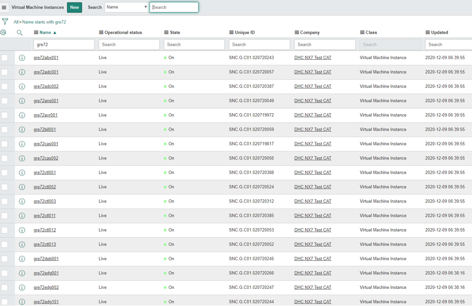                                |
| Expected results | 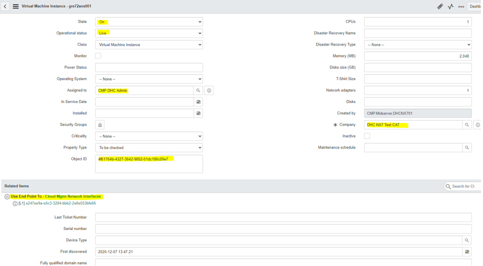                                 |

### Test SNOW-3 - Verify Event Management

|                  |                                                                                                                                                                                                                                                                                                                 |
|------------------|-----------------------------------------------------------------------------------------------------------------------------------------------------------------------------------------------------------------------------------------------------------------------------------------------------------------|
| Test procedure   | Login to SNOW                                                                                                                                                                                                                                                                                                   |
| Test procedure   | Check if MGT CIs are created in CMDB (via CMP Discovery process)                                                                                                                                                                                                                                                |
| Test procedure   | Generate some load on VM to raise alert in vROPS                                                                                                                                                                                                                                                                |
| Test procedure   | Login to SNOW                                                                                                                                                                                                                                                                                                   |
| Test procedure   | Look for a ticket raised under relevant CI                                                                                                                                                                                                                                                                      |
| Test procedure   | Check if Incident ticket contains:<br>FO name = `SNOW FO for Customer`<br>Incident category = `Cloud.IaaS.DHC`<br>Assignment group = `ZZ.Cloud.DHC-DevSecOps`<br>Affected CI = must be filled field and CI must be available in the CMDB<br>Service Level that belongs to the priority must be running/measured |
| Expected results | Login successful                                                                                                                                                                                                                                                                                                |
| Expected results | CMP machines CIs are created in CMDB                                                                                                                                                                                                                                                                            |
| Expected results | Alert in VROPS created for CMP VM                                                                                                                                                                                                                                                                               |
| Expected results | A ticket for the CMP CI is raised                                                                                                                                                                                                                                                                               |
| Expected results | All necessary information is included in SNOW ticket                                                                                                                                                                                                                                                            |

### Test SNOW-4 - Service Level Management

|                  |                                                                                                                                                                                                                                                                                                                               |
|------------------|-------------------------------------------------------------------------------------------------------------------------------------------------------------------------------------------------------------------------------------------------------------------------------------------------------------------------------|
| Test procedure   | Trigger a new CPR request from CMP Portal                                                                                                                                                                                                                                                                                     |
| Test procedure   | Check if RITM request has proper SLA configured and if this SLA is running                                                                                                                                                                                                                                                    |
| Test procedure   | Check if Incident (created in one above test) has proper prio 1, 2 or 3 assigned and also has SLA configured and running                                                                                                                                                                                                      |
| Expected results | CPR has SLA configured and running (verified in the related RITM request)                                                                                                                                                                                                                                                     |
| Expected results | Incident with prio 1, 2 or 3 (prio 4 is not configured) has the SLA configured and running (verified in the related RITM request) according to resolution times as follows:<br>- DHC.Inc.P1.OLA.Cloud.03hrRes.24 *7* 365<br>- DHC.Inc.P2.OLA.Cloud.8hrRes.08:00-18:00x5-PL<br>- DHC.Inc.P3.OLA.Cloud.18hrRes.08:00-18:00x5-PL |

## Day2 SSR

### Test SSR-1 - Backup SSR functionality - Manage VM Backup Policy

|                  |                                                                                                                                                                                                                 |
|------------------|-----------------------------------------------------------------------------------------------------------------------------------------------------------------------------------------------------------------|
| Test procedure   | A test VM deployed in VRA is required for verifying Day2 SSRs.                                                                                                                                                  |
| Test procedure   | In Service Broker verify that the policy definition ending with "day2actions-users-standard" has the Cloud.vSphere.Machine.custom.{tenant}-managevmbackuppolicy action listed                                   |
| Test procedure   | In Cloud Assembly go to the test Deployment and verify that the **Manage VM Backup Policy** action is available as a day2 action for the virtual machine                                                        |
| Test procedure   | Run the day2 action to remove the default backup policy, run it again to add a different policy and finally run the action to modify the exising policy - the action has 3 possible options - Add/Remove/Modify |
| Expected results | 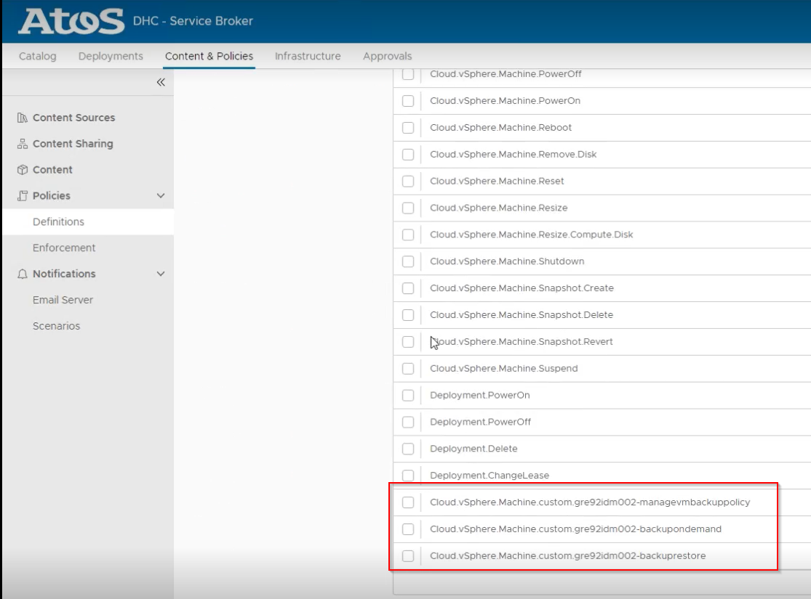                                                                                                                                                                |
| Expected results | 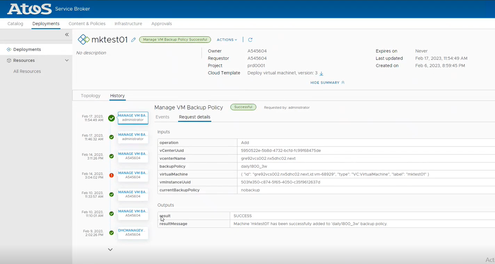                                                                                                                                                  |

### Test SSR-2 - Backup SSR functionality - Backup SSR functionality - Backup On-Demand

|                  |                                                                                                                                                                         |
|------------------|-------------------------------------------------------------------------------------------------------------------------------------------------------------------------|
| Test procedure   | A test VM deployed in VRA is required for verifying Day2 SSRs.                                                                                                          |
| Test procedure   | In Service Broker verify that the policy definition ending with "day2actions-users-standard" has the Cloud.vSphere.Machine.custom.{tenant}-backupondemand action listed |
| Test procedure   | In Cloud Assembly go to the test Deployment and verify that the **Backup On-Demand** action is available as a day2 action for the virtual machine                       |
| Test procedure   | Run the day2 action to perform an on-demand VM backup                                                                                                                   |
| Expected results |                                                                                                                         |
| Expected results | 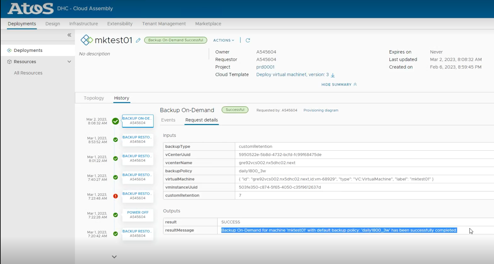                                                                                                        |

### Test SSR-3 - Backup SSR functionality - Backup SSR functionality - Backup Restore

|                  |                                                                                                                                                                        |
|------------------|------------------------------------------------------------------------------------------------------------------------------------------------------------------------|
| Test procedure   | A test VM deployed in VRA is required for verifying Day2 SSRs.                                                                                                         |
| Test procedure   | In Service Broker verify that the policy definition ending with "day2actions-users-standard" has the Cloud.vSphere.Machine.custom.{tenant}-backuprestore action listed |
| Test procedure   | In Cloud Assembly go to the test Deployment and verify that the **Backup Restore** action is available as a day2 action for the virtual machine                        |
| Test procedure   | Run the day2 action to perform a restore operation using the backup created in the previous test                                                                       |
| Expected results |                                                                                                                        |
| Expected results | 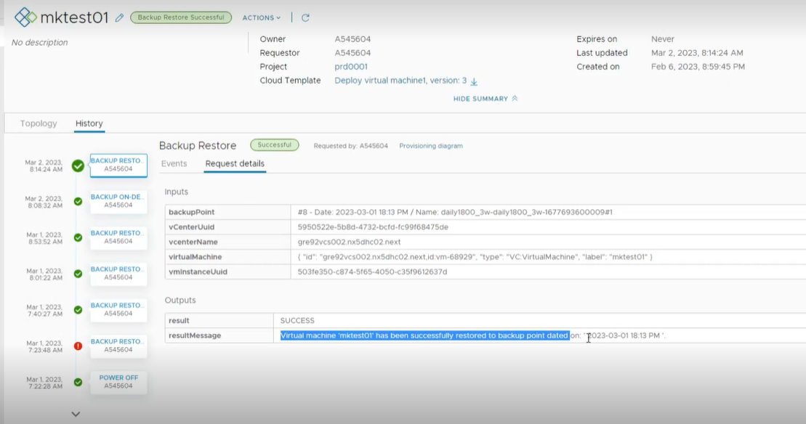                                                                                                        |

# Appendix A

| Document Name          | Document                                                                                     |
|------------------------|----------------------------------------------------------------------------------------------|
| VCS Test Plan Template | [dhcTestPlan_Template.docx](../workInstructions/files/dhcTestPlan/dhcTestPlan_Template.docx) |

# Appendix B

| Document Name              | Document                                                                                           |
|----------------------------|----------------------------------------------------------------------------------------------------|
| VCS CMP Test Plan Template | [dhcCmpTestPlan_Template.docx](../workInstructions/files/dhcTestPlan/dhcCmpTestPlan_Template.xlsx) |
