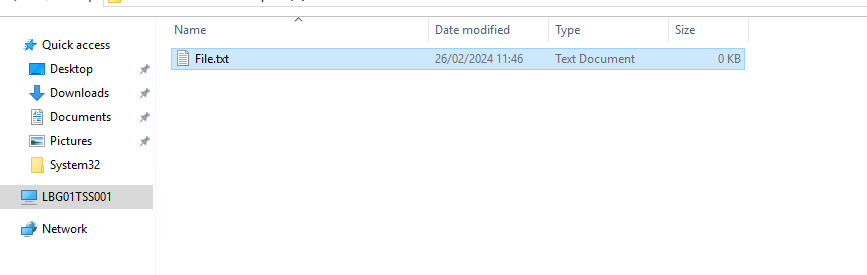
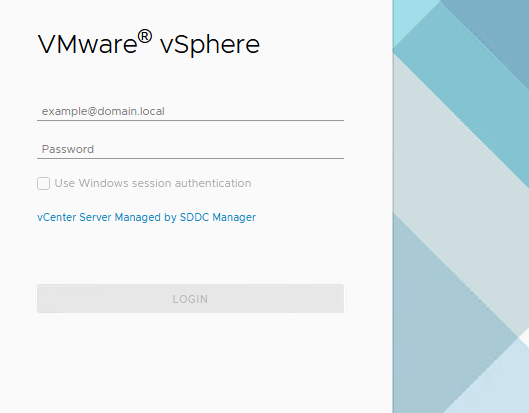
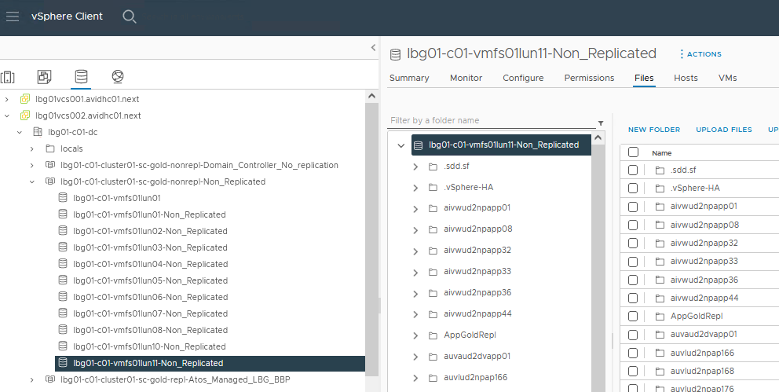
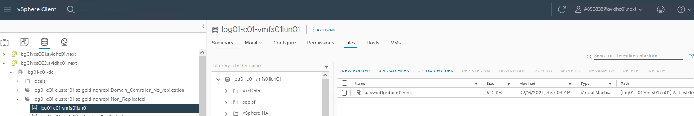

# VCS Upload ISO to LUN Datastore

## Table of Contents

- [VCS Upload ISO to LUN Datastore](#vcs-upload-iso-to-lun-datastore)
  - [Table of Contents](#table-of-contents)
  - [Introduction](#introduction)
    - [Purpose](#purpose)
    - [Audience](#audience)
  - [Scope](#scope)
    - [Prerequisites](#prerequisites)
    - [Action Plan](#action-plan)
  - [Changelog](#changelog)

## Introduction

### Purpose

This instruction covers the action of moving the ISO file from the Terminal server onto the datastore in the vCenter.

### Audience

- VCS Engineers
- VCS Architects

## Scope

The Instruction assumes that the reader has reasonable grasp of VCS infrastructure and VMware components.

### Prerequisites

- Access to the vCenter
- Basic vCenter Knowledge
- Datastore LUN ready in the environment
- Datastore LUN name
- File ready for upload

### Action Plan

After gathering all the prerequisites info, engineer can proceed with upload of the file following the steps below:

1. Begin the action with locating the file on the terminal server.

    >FQDN of terminal server: https://\<locationCode>tss001.\<searchDomain>

    

2. After locating the file which needs to be uploaded turn on the internet browser and navigate to the vCenter GUI. Log in.

    >FQDN of vCenter server: https://\<locationCode>vcs001.\<searchDomain>

    

3. In the vCenter navigate to the Datastores Tab. In there find the datastore on which you'd like to upload the file.

    

4. After finding the Datastore find the path inside to which the file should be uploaded.

    

5. As a last step, click the `UPLOAD FILES` button, in the popup locate the file from the terminal server and click on it. After choosing confirm the action.

    

6. After finishing all of the steps above the file has been successfully moved to the datastore in the vCenter environment.

## Changelog

| Version | Date          | Description                                                                                                                                                         | Author             |
|---------|---------------|---------------------------------------------------------------------------------------------------------------------------------------------------------------------|--------------------|
| 0.1     | 26/02/2024    | First version | Michał Sobieraj |
