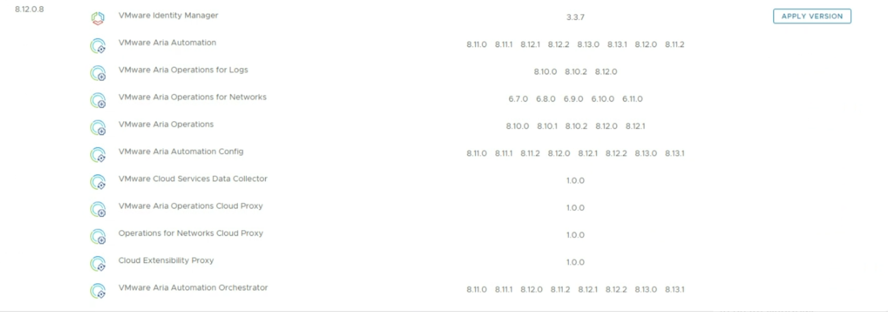
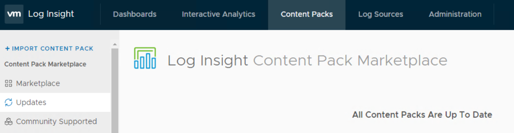
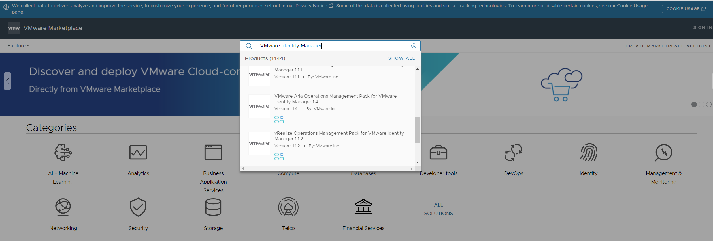

# VCF Upgrade to 4.5.1

## Table of Contents

- [VCF Upgrade to 4.5.1](#vcf-upgrade-to-451)
  - [Table of Contents](#table-of-contents)
  - [Changelog](#changelog)
  - [Introduction](#introduction)
    - [Purpose](#purpose)
    - [Audience](#audience)
    - [Scope](#scope)
    - [Related Documents](#related-documents)
  - [Preliminary information](#preliminary-information)
  - [Prerequisites](#prerequisites)
    - [Upgrade Prerequisites](#upgrade-prerequisites)
    - [Power off Avamar proxies](#power-off-avamar-proxies)
    - [Check/Configure Proxy](#checkconfigure-proxy)
    - [List of bundles](#list-of-bundles)
  - [Upgrade procedure](#upgrade-procedure)
    - [VMware Async Patch Tool](#vmware-async-patch-tool)
    - [Upgrade SDDC Manager](#upgrade-sddc-manager)
    - [Upgrade vRealize Components](#upgrade-vrealize-components)
      - [Supported versions as of LCM 8.12.0 PSPAK 8](#supported-versions-as-of-lcm-8120-pspak-8)
      - [**vRealize Suite Lifecycle Manager 8.8.2 PSPAK 7** (ETA 1h)](#vrealize-suite-lifecycle-manager-882-pspak-7-eta-1h)
      - [**vRealize Suite Lifecycle Manager 8.12.0**](#vrealize-suite-lifecycle-manager-8120)
      - [**vRealize Suite Lifecycle Manager 8.12.0 PSPAK 8** (ETA 1h)](#vrealize-suite-lifecycle-manager-8120-pspak-8-eta-1h)
      - [**VMware Identity Manager (Workspace ONE Access)** (ETA 4h)](#vmware-identity-manager-workspace-one-access-eta-4h)
      - [**vRealize Log Insight** (ETA 1h)](#vrealize-log-insight-eta-1h)
      - [**Content Pack upgrade procedure** (ETA 2h)](#content-pack-upgrade-procedure-eta-2h)
      - [**vRealize Operation Manager** (ETA 2h)](#vrealize-operation-manager-eta-2h)
      - [Download the vROPS upgrade 8.x WITH cloudproxy](#download-the-vrops-upgrade-8x-with-cloudproxy)
      - [Management Packs upgrade](#management-packs-upgrade)
      - [**vRealize Network Insight** (ETA 3h)](#vrealize-network-insight-eta-3h)
      - [**vRealize Network Insight Patch installation**](#vrealize-network-insight-patch-installation)
      - [**vRealize Network Insight Patch manual installation**](#vrealize-network-insight-patch-manual-installation)
      - [**vRealize Automation** (optional) (ETA 3h)](#vrealize-automation-optional-eta-3h)
      - [**Virtual Infrastructure Layer in Management Domain**](#virtual-infrastructure-layer-in-management-domain)
      - [**NSX-T Data Center**](#nsx-t-data-center)
      - [**vCenter Server**](#vcenter-server)
      - [**ESXi hosts**](#esxi-hosts)
        - [**vSAN Witness Hosts**](#vsan-witness-hosts)
    - [Post-checks](#post-checks)
    - [**Virtual Infrastructure Layer in Workload Domain**](#virtual-infrastructure-layer-in-workload-domain)
      - [**NSX-T Data Center**](#nsx-t-data-center-1)
      - [**vCenter Server**](#vcenter-server-1)
      - [**ESXi hosts**](#esxi-hosts-1)
      - [**vSAN Witness Hosts**](#vsan-witness-hosts-1)
    - [Post-checks](#post-checks-1)
  - [Compliance Overview](#compliance-overview)
  - [Known issues](#known-issues)

## Changelog
  
| Date       | Issue    | Author          | TOS  | Description |
| ---------- | -------- | --------------- | ---- | ------------------------- |
| 12/10/2023 | VCS-6605 | Adrian Giurgiu / Adrian Cristea   |      | Initial version creation  |
| 14/02/2024 | VCS-12248 | Mariusz Stanek   |      | VIDM declustering added |

## Introduction

### Purpose

The purpose of this document is to describe the steps that should be performed in order to upgrade VCF from version 4.5.0 (VCS 1.7) to 4.5.1 (VCS 1.8).

Both domains - the Management Domain (MGT) and the Workload Domain (VI WD) - are upgraded separately.  

### Audience

1. VCS Engineers,
2. VCS Operations,
3. VCS Architects.

### Scope

The scope of this document covers the following:

1. Upgrade of SDDC management components (MGT domain):
    - SDDC Manager
    - vRealize Suite Lifecycle Manager
    - vRealize Log Insight
    - vRealize Operations Manager
    - VMware Identity Manager (Workspace ONE Access)
    - vRealize Network Insight
    - NSX-T Data Center
    - vCenter Server
    - ESXi hosts
2. Upgrade of Workload Domain (VI WD)
    - NSX-T Data Center
    - vCenter Server
    - ESXi hosts

### Related Documents

| Document |
| -------- |
| [VCS 1.8 - wiLifeCycleManagement](wiLifeCycleManagement-DHC1.8.md)|

## Preliminary information

The upgrade process consists of the following steps:

1. Upgrade of SDDC Manager from ver. 4.5.0 to 4.5.1
2. Upgrade of VCF components from ver. 4.5.0 to 4.5.1 for Management domain
3. Upgrade of VCF components from ver. 4.5.0 to 4.5.1 for Workload domain

with the management domain being upgraded first (as it hosts the core components) and workload domain(s) second.

Before you start an upgrade of VCS (VCF components and vRealize Suite components), make sure that you are familiar with the update and upgrade planning guidance that is part of [VMware Cloud Foundation Product Documentation 4.5](https://docs.vmware.com/en/VMware-Cloud-Foundation/4.5/vcf-lifecycle/GUID-B384B08D-3652-45E2-8AA9-AF53066F5F70.html).

## Prerequisites

It is important to back up all VMs before upgrade using standard VCS backup solution. Before starting an update take a backup of the SDDC Manager VM and take a snapshot of relevant VMs in your management domain.
If a component upgrade fails, the order of operations ensures that backward compatibility and interoperability are maintained between the layers. You can roll back to a previous version of the components in a layer by using the backup or snapshots.

In addition, it is possible to create file-based backup solution for management VMs (sdm001, vcs001, vcs002), to back up ESXi hosts configuration and to export vSphere Distributed Switches (mgmt and cmp) configuration to avoid downtime and data loss in case of a system failure.   If some of the management component does fail, it can be restored to the latest backup.
  As agreed, `<locationCode>ans001` VM acts as an external SFTP backup server. Additional 200GiB disk ( /backup) is added to store backup files for above components.

In order to check if ans001 is configured as an external SFTP do the following:

1. In SDDC Manager, select `Administration` > `Backup Configuration`.
2. Confirm if IP address of `<locationCode>ans001` server is visible as IP address of external SFTP backup server.
3. Confirm if */backup/vcf* path  is provided as backup directory path of the server.

Prior to the upgrade of both vCenter instances, you will be asked to create the offline (with both VC VMs powered down) snapshots. This is to ensure a consistent state of both servers (especially regarding the replication between them) in case a need arises to revert the state.

### Upgrade Prerequisites

1. Do not run any domain operations while an update is in progress. Examples of domain operations: creating a new VI domain, adding hosts to a cluster or adding a cluster to a workload domain, removing clusters or hosts from a workload domain.

2. Confirm that the passwords for all VMware Cloud Foundation components are valid and not in expired state. This includes passwords for: NSX-T, vROps, vNI, vLI, IDM, etc.

3. Check if the replication between both vCenter servers is working:

   - Login via SSH to both vCenters as root and execute `shell`
   - Execute `/usr/lib/vmware-vmdir/bin/vdcrepadmin -f showpartnerstatus -h localhost -u administrator` (password for `Administrator@vsphere.local` will be required)   on both vCenters and check the results. They both should display the information that both vCenters are in sync.

    ```bash
    Host available:   Yes
    Status available: Yes
    My last change number:             15025
    Partner has seen my change number: 15025
    Partner is 0 changes behind.
    ```

    Additionally, you may check the Directory Service log: `/var/log/vmware/vmdird/vmdird-syslog.log` for any errors.
    If you encounter any replication inconsistencies or errors in the log, please contact VMware Support to address any problems beforehand.

4. Check the status of all NSX-T environments regarding their upgrade state:

   - Login to NSX-T Manager, go to `System` > `Upgrade` and check whether or not the upgrade status is `Complete`:

   
   - If not, i.e. you may see something like this:

   

   then please schedule an appropriate time to finish up the upgrade first.

5. Check both vCenter servers using the Lookup Service Doctor tool (lsdoctor) available at [KB80469](https://kb.vmware.com/s/article/80469).
   This tool is used to identify and address problems with the PSC/SSO Domain data.

   - Download the tool from the article, extract and upload it to both vCenters, e.g. to `/tmp` directory
   - Execute `python /tmp/lsdoctor-master/lsdoctor.py -l` and if the tool discovers any problems, please address them with VMware Support.

   >NOTE: do not execute the tool with any switches other than `-l`. It's the only switch that doesn't modify anything and as such it's safe to use it on our own.        Remaining functionalities can be used only under VMware Support's supervision.

6. It is extremely important that both vCenter servers are checked for any potential problems prior to the upgrade

   - Check if all services are starting correctly after restart
   - As an extra precaution, please have a look at the following log file: `/var/log/vmware/applmgmt/PatchRunner.log` and look for the following phrases:
   - `INFO __main__ Patch vCSA succeeded` - to check whether the last upgrade completed successfully
   - `ERROR __main__ Patch vCSA failed` - to check if it failed

   during the time of the last VC upgrade.

7. Please check if `/etc/vmware-vlcm/version.txt` file exists and if it contains the version of the internal vLCM   service, e.g. `0.0.3`. If the file doesn't exist, please create it by executing

   ```bash
   echo "0.0.3" > /etc/vmware-vlcm/version.txt
   ```

    If the file exists on 1st vCenter, but doesn't exist on the 2nd one, copy the version value from the 1st VC.

If any of those three checks show any problems, please contact VMware support to address those. This is especially important if vCenter servers were upgraded in the past. The server might seem to work fine, but underneath there might be problems that can cause the next upgrade to fail

### Power off Avamar proxies

Powered on Avamar proxies do not allow hosts to enter maintenance mode. Before you start upgrade, power off all avamar proxies on the cluster. Avamar proxies have `<locationCode>avp00X` VM name.

### Check/Configure Proxy

 LCM is configured to work with "My VMware" account, LCM automatically polls the depot to access the bundles.
 VCS uses a proxy server to access the VMware depot and download the LCM bundles.

 >NOTE: LCM only supports proxy servers that do not require authentication.

 Proxy server should be already configured for SDDC Manager but if there is any problem to get to VMware depot please check the configuration:

- Connect via SSH to SDDC Manager `<locationCode>sdm001` VM with the user name `vcf`
- Execute `su` command and provide root password
- Open `/opt/vmware/vcf/lcm/lcm-app/conf/application-prod.properties` file and verify whether the following settings are correct for your specific environment:

  ```yaml
    lcm.depot.adapter.proxyEnabled=true  
    lcm.depot.adapter.proxyHost='proxy IP address'  
    lcm.depot.adapter.proxyPort='proxy port'  
  ```

If any modification of the file are needed, remember to restart the lcm service afterwards for the new settings to kick in:

- Execute `systemctl restart lcm` command
- Wait 5 minutes and then download the bundles.

### List of bundles

**SDDC Manager**

| Component       | Bundle ID | Size | Version | Description | Update to version |
| ------------- |:-------------:| -----:|-----:|-----:|-----:|
| SDDC Manager| 65b6d750-5ef3-4456-b4c2-65ef96048fb6 | 2GB | 4.16.0-176690  | [This VMware Cloud Foundation upgrade bundle to 4.5.1.0 contains features, critical bugs and security fixes](https://docs.vmware.com/en/VMware-Cloud-Foundation/4.5.1/rn/vmware-cloud-foundation-451-release-notes/index.html) | 4.5.1.0-21682411 |
| SDDC Manager drift| 8a132cc7-f9b7-4f69-b654-7ea8f7059905 | 262MB | 4.16.1-176691 | SDDC Manager version update | 4.5.1.0-21682411 |

**vRealize Suite bundles**

>NOTE: vRealize Suite software versions are no longer tied to VCF. Since VCF 4.4 you are free to upgrade vRealize components to whatever version supported by vRealize Suite Lifeycle Manager. vRealize Suite is no longer downloaded via SDDC manager.

| Component       | Bundle ID | Size | Version | Description | Update to version |
| ------------- |:-------------:| -----:|-----:|-----:|-----:|
| vRSLCM | no bundle ID | 1.46GB | no bundle version | [This VMware Software Upgrade bundle contains vRealize Suite Lifecycle Manager 8.12.0](https://docs.vmware.com/en/VMware-Aria-Suite-Lifecycle/8.12/rn/vmware-aria-suite-lifecycle-812-release-notes/index.html) | 8.12.0.7-21628952 |

**Virtual Infrastructure Layer**

| Component       | Bundle ID | Size | Version | Description | Update to version |
| ------------- |:-------------:| -----:|-----:|-----:|-----:|
| NSX-T Data Center | e5f9e44f-9123-425e-bee9-07806379d671 | 9GB | 4.16.10-173214 | [This VMware Software Upgrade bundle contains NSX-T 3.2.2.1](https://docs.vmware.com/en/VMware-NSX/3.2.2.1/rn/vmware-nsxt-data-center-3221-release-notes/index.html) | 3.2.2.1.0-21487560 |
| vCenter Server | 3b8ae94b-582b-4356-b152-2b01e947a072 | 7GB | 4.16.12-173216 | [This VMware Software Upgrade bundle contains VMware vCenter Server 7.0 Update 3l](https://docs.vmware.com/en/VMware-vSphere/7.0/rn/vsphere-vcenter-server-70u3l-release-notes.html) | 7.0.3.01400-21477706 |
| ESXi | 2b458531-b783-458e-bc43-3da1ddcd096f | 400MB | 4.16.24-173218 | [This VMware Software Upgrade bundle contains VMware ESXi 7.0 Update 3l](https://docs.vmware.com/en/VMware-vSphere/7.0/rn/vsphere-esxi-70u3l-release-notes.html) | 7.0.3-21424296 |

>NOTE: The vCenter Server and ESXi appliances must be upgraded to AT LEAST the previously mentioned versions. If the installed versions are higher than this, no upgrade is required.
>
>NOTE: If during the process of downloading bundles, you encounter one of the following errors:

- `LcmException: Bundle tar file size XXXXXXXX does NOT match the manifest value XXXXXXXX`
- `LcmException: bundle checksum does NOT match the manifest value`

please follow the `DOWNLOADING BUNDLE FAILED` workaround, described in the `Known Issues` section

## Upgrade procedure

### VMware Async Patch Tool

The [Async Patch Tool](https://docs.vmware.com/en/VMware-Cloud-Foundation/services/ap-tool/GUID-ED6AEE19-CB7D-44E7-A7D8-D54F8C5CC05D.html) is a utility that allows you to apply critical patches outside of the normal VMware Cloud Foundation lifecycle management process. It also provides options for managing async patches and upgrading a VMware Cloud Foundation instance that includes async patches.

VCS prepared internal documentation to follow [Security patching using VMware Async Patch Tool](dhcAsyncPatchTool.md).

Please refer to below additional documents if it is required to use Vmware Async Patch Tool outside of normal LCM process:

- [VCS NSX-T upgrade process using Vmware Async Patch Tool](https://github.com/GLB-CES-PrivateCloud/DHC-Engineering/blob/master/documentation/analysisNsxUpgrade.md)
- [VROps upgrade process using Vmware Async Patch Tool](dhcVropsUpgradeTo-8.10.md)

### Upgrade SDDC Manager

- Ensure you have a recent successful backup of SDDC Manager using an external SFTP server, as described in the `Prerequisites` section.
- Ensure you have taken a snapshot of the SDDC Manager appliance and that you have recent successful backups of the components managed by SDDC Manager, including vCenter Server.
- Go to `Inventory` > `Workload Domains` > `(location code)-m01` management domain > `Updates/Patches`
- Execute the upgrade pre-check before every upgrade bundle installation. Ensure that the pre-check results are green before proceeding. A failed pre-check may cause the update to fail.

  

  >NOTE: If pre-check results are red, please resolve any problems and re-run the pre-check until it passes successfully. Solutions to some recurring problems might be listed in the `Known issues` chapters of this work instruction and also in older upgrade instructions.
- Expand the `Available updates` and from the `Select Cloud Foundation version` drop-down menu, select `Cloud Foundation 4.5.1.0`.

  This upgrade bundle should be visible:

  ```yaml
  - VMware Cloud Foundation Update 4.5.1.0
  Released: May 11, 2023
  Size: 2 GB
  Version: 4.16.0-176690
  Description: This VMware Cloud Foundation Upgrade bundle to 4.5.1.0 contains features, critical bugs and security fixes. For more information, see https://docs.vmware.com/en/VMware-Cloud-Foundation/4.5.1/rn/vmware-cloud-foundation-451-release-notes/index.html For VCF on VxRail, see https://docs.vmware.com/en/VMware-Cloud-Foundation/4.5.1/rn/vmware-cloud-foundation-451-on-dell-emc-vxrail-release-notes/index.html
  Bundle ID: 65b6d750-5ef3-4456-b4c2-65ef96048fb6
  Update to Version: 4.5.1.0-21682411
  Description: SDDC Manager version update

  ETA: 35min
  ```

- Download the bundle and click `Update Now` or `Schedule Update` depending on your schedule/timeline and follow the upgrade steps described here: [Apply VMware Cloud Foundation Upgrade Bundle](https://docs.vmware.com/en/VMware-Cloud-Foundation/4.5/vcf-lifecycle/GUID-E101AFB5-1034-4CF9-B96E-A2E70DCF02F5.html#GUID-9E77C737-AEE1-470D-80A3-6C498C4E3F10).

  >TIP: It's worth to refresh the update status page, as it often reports *In progress* state thought the upgrade is already *Finished*

- After upgrade completes successfully, execute another pre-check and ensure that the pre-check results are green before proceeding

- Expand the `Available updates` and from the `Select Cloud Foundation version` drop-down menu, select `Cloud Foundation 4.5.1.0`

  This upgrade bundle should be visible:

  ```yaml
  - VMware Cloud Foundation Update 4.5.1.0
  Released: May 11, 2023
  Size: 262 MB
  Version: 4.16.1-176691
  Description: The configuration drift bundle for VMware Cloud Foundation 4.5.1.0
  Bundle ID: 8a132cc7-f9b7-4f69-b654-7ea8f7059905
  Update to Version: 4.5.1.0-21682411

  ETA: 3min
  ```

- Download the bundle and click `Update Now` or `Schedule Update` depending on your schedule/timeline and follow the upgrade steps described here: [Apply Configuration Drift Bundle](https://docs.vmware.com/en/VMware-Cloud-Foundation/4.5/vcf-lifecycle/GUID-E101AFB5-1034-4CF9-B96E-A2E70DCF02F5.html#GUID-FC2B3247-9080-40CC-9B24-CCB0B7A428EB).
- After the successful drift bundle installation, perform an [Operational Verification of SDDC Manager](https://docs.vmware.com/en/VMware-Cloud-Foundation/4.5/vcf-operations/GUID-B29A8186-4779-4549-834C-47A7C10499E7.html).

### Upgrade vRealize Components

> NOTE: vRealize Components upgrade are now dependent from vRSLCM appliance and PSPAK versions. You are free to upgrade to any supported version of the vRealize suite software. Tested with LCM Policy 8.12.0.0

#### Supported versions as of LCM 8.12.0 PSPAK 8



#### **vRealize Suite Lifecycle Manager 8.8.2 PSPAK 7** (ETA 1h)

This step enables the upgrade of vRSLCM to 8.12. The product support pack must be at least PSPAK 7.

- Verify that you have taken a snapshot of VMware vRealize Suite Lifecycle Manager.
- Log in to vRealize Lifecycle Manager.
- On the Lifecycle Operations dashboard, navigate to `Settings` > `Product Support Pack`.
- Go to the `Support for Additional Product Versions` section. If the list is not auto-populated, click `CHECK SUPPORT PACKS ONLINE`. The vRealize Suite Lifecycle Manager auto-populates the list of available support versions.
- When the list is populated, click `Apply Version` in `Settings` > `Product Support Pack` for the appropriate content `version 8.8.2.7`.
- Once the PSPAK 7 installation is triggered successfully, VMware vRealize Suite Lifecycle Manager services are restarted and you are redirected to VMware vRealize Suite Lifecycle Manager UI login page.
- To verify your new PSPAK 7, on the Lifecycle Operations dashboard, navigate to `Settings` > `Product Support Pack`. The option lists the `Policy 8.8.2.7.`
- If FIPS mode has been disabled prior to upgrade, re-enable FIPS Mode Compliance.

#### **vRealize Suite Lifecycle Manager 8.12.0**

  Download below upgrade package from VMware Customer Connect [website](https://customerconnect.vmware.com/downloads/details?downloadGroup=SUITELIFECYCLE812&productId=1034):

  ```yaml
  - VMware vRealize Suite Lifecycle Manager 8.12 Update Repository Archive
  Release date: 2023-04-20
  Size: 881.2 MB
  Build Number: 21628952
  Description: VMware vRealize Suite Lifecycle Manager 8.12 Update Repository Archive
  Use this ISO package to upgrade an older version virtual appliance of VMware vRealize Suite Lifecycle Manager to version 8.12. Please refer to the Installation and Administration guide for more details
  ETA: 20min
  ```

- Upload the `VMware-Aria-Suite-Lifecycle-Appliance-8.12.0.7-21628952-updaterepo.iso` iso file to VSAN datastore in Management Domain
- Attach the iso file to the CD-ROM drive of LCM appliance
- Log into the LCM appliance using `vcfadmin@local` account
- Browse to `vRSLCM` > `Lifecycle Operations` > `Settings` > `System Upgrade'
- Select Repository Type `CDROM` and click `CHECK FOR UPGRADE` Button
- Proceed with the upgrade process
- Once vRealize Suite Lifecycle Manager is upgraded, perform an [Operational Verification of vRealize Suite Lifecycle Manager](https://docs.vmware.com/en/VMware-Cloud-Foundation/4.5/vcf-operations/GUID-3FDF80B1-1462-4AEE-AAA7-8A07D3D7F170.html).

#### **vRealize Suite Lifecycle Manager 8.12.0 PSPAK 8** (ETA 1h)

- Verify that you have taken a snapshot of VMware vRealize Suite Lifecycle Manager.
- Log in to vRealize Lifecycle Manager.
- On the Lifecycle Operations dashboard, navigate to `Settings` > `Product Support Pack`.
- Go to the `Support for Additional Product Versions` section. If the list is not auto-populated, click `CHECK SUPPORT PACKS ONLINE`. The vRealize Suite Lifecycle Manager auto-populates the list of available support versions.
- When the list is populated, click `Apply Version` in `Settings` > `Product Support Pack` for the appropriate content `version 8.12.0.8`.
- Once the PSPAK 8 installation is triggered successfully, VMware vRealize Suite Lifecycle Manager services are restarted and you are redirected to VMware vRealize Suite Lifecycle Manager UI login page.
- To verify your new PSPAK 8, on the Lifecycle Operations dashboard, navigate to `Settings` > `Product Support Pack`. The option lists the `Policy 8.12.0.8.`
- If FIPS mode has been disabled prior to upgrade, re-enable FIPS Mode Compliance.

#### **VMware Identity Manager (Workspace ONE Access)** (ETA 4h)

Please follow: [VIDM Declustering WI](wiDeclusteringVidm.md) which describes how to replace the existing, clustered VMware Identity Manager instance with a one-node installation version 3.3.7.

#### **vRealize Log Insight** (ETA 1h)

- Ensure you have a recent successful backup of of the vRealize Log Insight virtual appliances (vli001a, vli001b,vli001c)
- Perform an inventory sync in vRSLCM for the Log Insight environment: go to Lifecycle Operations > Environments > vRLI Environment > Details > ... > Trigger Inventory Sync
- Make sure that auto-upgrade or vRLI agents is enabled: log in to the vRealize Log Insight and navigate to `Administration` > `Management` > `Agents` and check if `Enable auto-update for all agents` option is enabled.

- Go to the `vRSLCM` > `Lifecycle Operations` > `Settings` > `Binary Mapping` and check if the `vRealize Log Insight 8.10.2` upgrade bundle is available:
- If not, download it from VMware: in the `Binary Mapping` section click `Add binaries` > `My VMware` > `Discover` > select `vRealize Log Insight 8.10.2 upgrade bundle` and click `Add`. Wait for the request to finish successfully and re-check if the bundle is visible.
- If the download from My VMware fails due to the configured account not having proper entitlements, as an alternative you can download the upgrade bundle manually (file name: `VMware-vRealize-Log-Insight-8.10.2-21638564.pak`), upload it to the */data* folder on vRSLCM appliance VM using e.g. WinSCP.
  Then go to `Lifecycle Operations` > `Settings` > `Binary Mapping`, click `Add Binaries` and location type:  `Local`. In `Base Location` enter */data*, click `Discover`, select the  bundle and click ADD button. Wait for mapping request to finish, verify the bundle is visible and delete it from */data* folder
- Go to `Environments` > `vRLI_environment` > `View Details`
- Click `Upgrade` and follow the upgrade wizard
- Check if all agents are upgraded to the newest version.
- Repeat the inventory sync

#### **Content Pack upgrade procedure** (ETA 2h)

With vRealize Log Insight upgraded to the latest version (8.10.2), we now upgrade the content packs for use with vRLI.

- The Content Pack Marketplace requires a connection from your web browser to the internet. Check your browser's connection settings (proxy settings).
- Follow the steps described in [Upgrade the Content Packs on vRealize Log Insight](https://docs.vmware.com/en/VMware-Validated-Design/6.2/sddc-upgrade/GUID-93BAA0DC-875A-4380-9405-4632764C48AA.html).
- As a result, all Content Packs should be up to date.

  

- Once both vRealize Log Insight and content packs are upgraded, perform an [Operational Verification of vRealize Log Insight](https://docs.vmware.com/en/VMware-Validated-Design/6.2/sddc-operational-verification/GUID-FDA86887-0C01-455B-9E23-C314AC1FB695.html).
- In step [Verify the vRealize Log Insight Agent Status for the Virtual Appliances of the Management Domain](https://docs.vmware.com/en/VMware-Validated-Design/6.2/sddc-operational-verification/GUID-7561C712-B761-454A-B7BE-CD1F02FEB36A.html) to verify syslog data collection status for all appliances of the management domain using Photon OS just sort agents by OS. In VCS there is no `SDDC - Photon OS` agent group.
- In step [Verify the vRealize Log Insight Agent Status for the Workspace ONE Access Appliances](https://docs.vmware.com/en/VMware-Validated-Design/6.2/sddc-operational-verification/GUID-121DE2D2-FA1E-46A7-82E4-CEB1B1AD85EC.html) to verify syslog data collection status for the region-specific Workspace ONE Access appliances just sort agents by Hostname and check status for `<locationCode>idm001.<searchdomain>`. In VCS there is no `SDDC - Linux OS` agent group.
- Skip `Verify the Log Forwarding Status of vRealize Automation` if VCS vRA Cloud is in use.

#### **vRealize Operation Manager** (ETA 2h)

- Ensure you have a recent successful backup of the vROps VMs `<locationCode>ops002` and `<locationCode>ops003`.
- Perform the `inventory sync` of the vROPS_environment, exactly the same way as it was done for vRLI.
- Prior to the upgrade, it is recommended to run the Pre-Upgrade Readiness Assessment Tool. Its goal is to analyze the potential impact following the reduction of metrics in various versions of the product, as well as to evaluate the feasibility for upgrade.
In case of an upgrade failure, VMware support may ask whether this validation was performed and ask for the report to be provided to aid in their troubleshooting. A correct version of the tool must be downloaded, i.e. matching the vROps version you plan to upgrade to (8.10.2). Download link [here](https://customerconnect.vmware.com/downloads/details?downloadGroup=VROPS-8102&productId=1350&rPId=100555) and the release notes [here](https://docs.vmware.com/en/vRealize-Operations/8.10.2/rn/vrealize-operations-8102-release-notes/index.html).

#### Download the vROPS upgrade 8.x WITH cloudproxy

- Go to the `vRSLCM` > `Lifecycle Operations` > `Settings` > `Binary Mapping` and check if the `vRealize Operations 8.10.2` upgrade bundle is available:
- If not, download it from VMware: in the `Binary Mapping` section click `Add binaries` > `My VMware` > `Discover` > select `vRealize Operations 8.10.3 upgrade bundle` and click `Add`. Wait for the request to finish successfully and re-check if the bundle is visible.
- If the download from My VMware fails due to the configured account not having proper entitlements, as an alternative you can download the upgrade bundle manually (file name: `vRealize_Operations_Manager_With_CP-8.x-to-8.10.2.21179042.pak`) from [here](https://customerconnect.vmware.com/downloads/details?downloadGroup=VROPS-8102&productId=1350&rPId=100555), upload it to the */data* folder on vRSLCM appliance VM using e.g. WinSCP.
- Then go to `Lifecycle Operations` > `Settings` > `Binary Mapping`, click `Add Binaries` and location type:  `Local`. In `Base Location` enter */data*, click `Discover`, select the  bundle and click ADD button. Wait for mapping request to finish, verify the bundle is visible and delete it from */data* folder
- Go to `Environments` > `vROPS_environment` > `View Details`
- Click `Upgrade` and follow the upgrade wizard
- Once vRealize Operation Manager is upgraded, perform an [Operational Verification of vRealize Operations Manager](https://docs.vmware.com/en/VMware-Validated-Design/6.2/sddc-operational-verification/GUID-C2B5127D-01A5-4F2B-A6A3-BB39F8C19A2D.html).
- Repeat the inventory sync
- If the vROPS is upgraded with cloudproxy, then telegraf agents also need to be updated using the link here [wiUpdateTelegrafAgent](wiUpdateTelegrafAgent.md).

#### Management Packs upgrade

After vROPS upgrade, login into the vRealize Operations UI  `https://<locationCode>ops002.<domainName>/ui`, go to `Data Sources\Integrations\Accounts` and validate if the state of the configured integrations is shown as "OK". Upgrade cannot be started while there are any Warnings/Errors. Please fix them before proceeding with the upgrade!
In `Data Sources\Integrations\Repository` tab, note down the versions of the management packs with configured integrations in `Data Sources\Integrations\Accounts`. The values accumulated before and after the update should then be compared with the values in the table below.

| Management Pack | Installed compatible version | Other compatible versions |  Notes |
|---|---|---|---|
|vSphere | 8.10.2.21178535 |  | part of VROPS, cannot be updated |
|VMware Cloud on AWS | 8.10.2.21178527 |  | part of VROPS, cannot be updated |
|AWS| 8.10.2.21178531 |  | part of VROPS, cannot be updated |
|vSAN| 8.10.2.21178533  |  | part of VROPS, cannot be updated |
|vRealize Automation 8.x| 8.10.2.21178510 |  | part of VROPS, cannot be updated |
|vRealize Log Insight| 8.10.2.21178536 |  | part of VROPS, cannot be updated |
|vRealize Network Insight| 8.10.2.21178529 |  | part of VROPS, cannot be updated |
|NSX-T | 8.10.2.21178523 |  | part of VROPS, cannot be updated |
|vSphere Replication Adapter | 8.7 |  | The appropriate version must be used taking into account your vSphere Replication version |
|VMware Identity Manager Management Pack | 1.4.0.21587999 |  | The appropriate version must be used taking into account your IDM version |
|Site Recovery Manager Adapter | 8.7 |  | The appropriate version must be used taking into account your SRM version |
|SDDC Management Health | 8.10.1.21563387 |  | The appropriate version must be used taking into account your SDDC Manager version |
|Management Pack for Storage Devices | | 8.4.1.19367390 | |
|VMware Aria Operations Aggregator Management Pack |  | 2.1, 2.0, 2.0.1  | |

For other managament pack compatibility please check [here](https://interopmatrix.vmware.com/Interoperability)

Any inconsistency between the current and the expected state should be resolved by installation the latest compatible Management Pack's version according to the example.


Management Pack's binaries are accessible from [VMware Marketplace](https://marketplace.cloud.vmware.com/) as .pak files. After clicking the upgrade button in the `Data Sources\Integrations\Repository` location, follow the Software Update wizard to complete the upgrade process (pak files must be downloaded manually).



#### **vRealize Network Insight** (ETA 3h)

- Ensure you have a recent successful backup of the vRNI VMs `<locationCode>vni001` and `<locationCode>vnc001`.
- Perform inventory sync
- Go to the `vRSLCM` > `Lifecycle Operations` > `Settings` > `Binary Mapping` and check if the `vRealize Network Insight 6.7.0` upgrade bundle is available:
- If not, download it from VMware: in the `Binary Mapping` section click `Add binaries` > `My VMware` > `Discover` > select `vRealize Network Insight 6.7.0 upgrade bundle` and click `Add`. Wait for the request to finish successfully and re-check if the bundle is visible.
- If the download from My VMware fails due to the configured account not having proper entitlements, as an alternative you can download the upgrade bundle manually from [here](https://customerconnect.vmware.com/en/downloads/details?downloadGroup=VRNI-670&productId=1070&rPId=83873) (file name: `VMware-vRealize-Network-Insight.6.7.0.1656233033.upgrade.bundle`), upload it to the */data* folder on vRSLCM appliance VM using e.g. WinSCP.
  Then go to `Lifecycle Operations` > `Settings` > `Binary Mapping`, click `Add Binaries` and location type:  `Local`. In `Base Location` enter */data*, click `Discover`, select the  bundle and click ADD button. Wait for mapping request to finish, verify the bundle is visible and delete it from */data* folder (Important note: if Network Insigh will be upgraded manually then patch must be additionally done)
- Go to `Environments` > `vRNI` > `View Details`
- Click `Upgrade` and follow the upgrade wizard

- Once done, restart both vms in order:

  ```yaml
  <locationCode>vnc001
  <locationCode>vni001
  ```

- Once vRealize Network Insight is upgraded, log in to vRNI web interface (vni001 appliance VM) and verify that it is up and running.
- delete upgrade bundle file from vRealize Suite Lifecycle Manager */data/* folder on `<locationCode>lcm001` (only when manual upload was performed)
- Repeat inventory sync

> Note: there is a possibility that after the upgrade of vRealize Log Insight and/or vRealize Network Insight appliances, the Network Insight will be visible as `localhost` on the list of agents inside Log
  Insight. To fix that, execute the following playbook on *ans001* server from */opt/dhc/update* folder:

  ```yaml
  ansible-playbook configureVniLiAgent.yml
  ```

Validate the state by going to `Log Insight` > `Administration` > `Agents` and checking if `vni001` host is visible correctly and showing as active.

#### **vRealize Network Insight Patch installation**

- Verify that you have taken a snapshot of vRealize Network Insight VMs.
- Log in to vRealize Lifecycle Manager.
- On the Lifecycle Operations dashboard, navigate to `Settings` > `Binary Mapping` > `Patch Binaries`.
- Click `Check Patches Online`.
- Find `vRealize Network Insight 6.7.0 Patch6` and click arrow to downloand in tab `Action`.
- When downloaded navigate to `Environments` > `vRNI` > `...` > `Patches` > `Install Patch`.
- Choose `vRealize Network Insight 6.7.0 Patch6` click `Next` and follow installation steps.
- Once the Patch6 installation is triggered successfully, vRealize Network Insight services are restarted and you can open vRealize Network Insight UI login page.
  
#### **vRealize Network Insight Patch manual installation**

- You can download the patch bundle manually from [here](https://customerconnect.vmware.com/en/downloads/details?downloadGroup=VRNI-670&productId=1070&rPId=83873) (file name: `VMware-vRNI.6.7.0.P6.1688972173.patch.bundle`), upload it to the */data* folder on vRSLCM appliance VM using e.g. WinSCP.
  Then go to `Lifecycle Operations` > `Settings` > `Binary Mapping` > `Patch Binaries`, click `Add Patch Binaries` and location type:  `Local`. In `Base Location` enter */data*, click `Discover`, select the patch bundle and click ADD button. Wait for mapping request to finish, verify the bundle is visible and delete it from */data* folder.
- Go to `Environments` > `vRNI` > `View Details`
- Click `...` > `Patches` > `Install pacth` and follow the upgrade wizard

#### **vRealize Automation** (optional) (ETA 3h)

Important note: Since version 8.12 assigned amount of RAM must be increased from 42GB to 48GB for each vra VMS

If vRA-on-prem has been deployed in the environment, please perform below steps to upgrade the vRA infrastructure

- Ensure you have a recent successful backup of the vRA VMs `<locationCode>vra002`, `<locationCode>vra003` and `<locationCode>vra004`.
- Perform inventory sync
- Go to the `vRSLCM` > `Lifecycle Operations` > `Settings` > `Binary Mapping` and check if the `vRealize Automation 8.12.1` upgrade bundle is available:
- If not, download it from VMware: in the `Binary Mapping` section click `Add binaries` > `My VMware` > `Discover` > select `vRealize Automation 8.12.1 upgrade bundle` and click `Add`. Wait for the request to finish successfully and re-check if the bundle is visible.
- If the download from My VMware fails due to the configured account not having proper entitlements, as an alternative you can download the upgrade bundle manually from [here](https://customerconnect.vmware.com/downloads/details?downloadGroup=AUTOMATION-8121&productId=1418&rPId=105498) (file name: `Prelude_VA-8.12.1.31050-21768489-updaterepo.iso`), upload it to the */data* folder on vRSLCM appliance VM using e.g. WinSCP.
  Then go to `Lifecycle Operations` > `Settings` > `Binary Mapping`, click `Add Binaries` and location type:  `Local`. In `Base Location` enter */data*, click `Discover`, select the  bundle and click ADD button. Wait for mapping request to finish, verify the bundle is visible and delete it from */data* folder
- Go to `Environments` > `<locationCode>vra001` > `View Details`
- Click `Upgrade` and follow the upgrade wizard
- Once vRealize Automation is upgraded, perform an [Operational Verification of vRealize Automation](https://docs.vmware.com/en/VMware-Validated-Design/6.2/sddc-operational-verification/GUID-11A28FC8-3B7E-4C84-8CDC-1DDE4C5A6E52.html).
- Repeat the inventory sync

Important note: If enviorement uses version lower than 8.7 then some additional intermediate upgrade must be done. It is not possible to upgrade from version lower than 8.7 to 8.12.2 directly.

If it is required additionally see [wiUpgradeVraUsingVrlcm.md](wiUpgradeVraUsingVrlcm.md)

#### **Virtual Infrastructure Layer in Management Domain**

Next step is to upgrade the virtual infrastructure layer in Management Domain:

- NSX-T Data Center:
  - NSX-T Edge cluster
  - NSX-T Host cluster
  - NSX-T Manager cluster
- vCenter Server
- ESXi hosts

> Note: All NSX-T components (Edge cluster, Host cluster and Manager cluster) are upgraded by a single bundle.

Verify that you have recent backups of the NSX-T Manager nodes and the vCenter Server virtual machines.

#### **NSX-T Data Center**

- Ensure you have a recent successful backup of NSX-T Manager and Edge nodes
- Go to `Inventory` > `Workload Domains` > `<locationCode>-m01` management domain > `Updates/Patches`
- Execute the upgrade pre-check before every upgrade bundle installation. Ensure that the pre-check results are green before proceeding.
- Expand the `Available updates` and from the `Select Cloud Foundation version` drop-down menu, select `Cloud Foundation 4.5.1.0`

  This upgrade bundle should be visible:

  ```yaml
  - VMware Cloud Foundation Update 4.5.1.0
  Released: May 11, 2023
  Size: 9 GB
  Version: 4.16.10-173214
  Description: This VMware Software Upgrade bundle contains NSX-T Data Center 3.2.2.1.0. For more information, see https://docs.vmware.com/en/VMware-NSX/3.2.2.1/rn/vmware-nsxt-data-center-3221-release-notes/index.html
  Bundle ID: e5f9e44f-9123-425e-bee9-07806379d671
  Update to Version: 3.2.2.1.0-21487560
  Description: NSX_T_MANAGER Update Bundle

  ETA: 3h
  ```

- Download the bundle and click `Update Now` or `Schedule Update` depending on your schedule/timeline and follow the upgrade steps described here: [Upgrade NSX-T Data Center](https://docs.vmware.com/en/VMware-Cloud-Foundation/4.5/vcf-lifecycle/GUID-E101AFB5-1034-4CF9-B96E-A2E70DCF02F5.html#GUID-2D0DF7AF-4FE6-4A8C-AC2E-275E7F23FEBA__GUID-826A028E-7134-4B4F-AB42-1AD518D677D6).
- In case of having multiple Edge and/or Host cluster, it's possible to upgrade them sequentially, instead of in parallel (which is the default behavior). To enable sequential upgrade, select the relevant options:

The downside to doing it sequentially is the prolonged upgrade time, but on the other hand, it gives you better control over the upgrade process. Of course, in case of having only a single Edge and/or Host cluster, this is irrelevant.
- Once NSX-T Data Center is upgraded, perform an [Operational Verification of VMware NSX-T Data Center](https://docs.vmware.com/en/VMware-Cloud-Foundation/4.5/vcf-operations/GUID-7567A790-4CAA-438C-9E8B-00B5319FC42E.html).

#### **vCenter Server**

> In case VMware Async Patch Tool was used to patch vCenter, the update might be skipped if the target version is already in place.

- Ensure you have a recent successful backup of all the vCenter appliances sharing the same SSO domain.
- If possible, create offline (with both VC VMs powered down) snapshots of both vCenter VMs at the same time. This is to ensure a consistent state of both servers (especially regarding the replication between them) in case a need arises to revert the state.
- If possible, redo the [Upgrade Prerequisites](#upgrade-prerequisites) no. 3 (replication check), 5 (lsdoctor check) and 6 (VC status check after the last upgrade, if applicable)
- Go to `Inventory` > `Workload Domains` > `(customerCode)-(locationCode)-m01` management domain > `Updates/Patches`
- Execute the upgrade pre-check before every upgrade bundle installation. Ensure that the pre-check results are green before proceeding.
- Expand the `Available updates` and from the `Select Cloud Foundation version` drop-down menu, select `Cloud Foundation 4.5.1.0`.
  This upgrade bundle should be visible:

  ```yaml
  - VMware Cloud Foundation Update 4.5.1.0
  Released: May 11, 2023
  Size: 7 GB
  Version: 4.16.12-173216
  Description: This VMware Software Upgrade bundle contains vCenter Server 7.0 Update 3l. Customers should NOT run vCenter upgrades in parallel as it is not-supported for vCenters running in ELM mode. For more information, see https://docs.vmware.com/en/VMware-vSphere/7.0/rn/vsphere-vcenter-server-70u3l-release-notes.html
  Bundle ID: 3b8ae94b-582b-4356-b152-2b01e947a072
  Update to Version: 7.0.3.01400-21477706
  Description: VMware vCenter Server Update Bundle

  ETA: 2h
  ```

- Click `Update Now` or `Schedule Update` depending on your schedule/timeline and follow the upgrade steps described here: [Upgrade vCenter Server](https://docs.vmware.com/en/VMware-Cloud-Foundation/4.5/vcf-lifecycle/GUID-E101AFB5-1034-4CF9-B96E-A2E70DCF02F5.html).
- Once vCenter is upgraded, perform an [Operational Verification of vSphere](https://docs.vmware.com/en/VMware-Cloud-Foundation/4.5/vcf-operations/GUID-D8629B82-9BEB-4E2D-ABB6-D50E9657D58B.html), including the verification of the possibility to [access vCenter using an Active Directory account](https://docs.vmware.com/en/VMware-Validated-Design/6.2/sddc-operational-verification/GUID-30685840-25EA-4A0E-A1DA-5F69D4E458DA.html).
- After the vCenter upgrade, please repeat the [Upgrade Prerequisites](#upgrade-prerequisites) no. 3, 5 and 6.

#### **ESXi hosts**

> **If there is a need to add custom drivers during the ESXi upgrade process, please follow the steps described in chapter `Upgrade ESXi with VMware Cloud Foundation Stock ISO and Async NIC Driver` in [dhcDellEsxiUpgradeWithCustomImages.md](dhcDellEsxiUpgradeWithCustomImages.md) document, however the process was not tested for VCS 1.6**

- Go to `Inventory` > `Workload Domains` > `(customerCode)-(locationCode)-m01` management domain > `Updates/Patches`
- Execute the upgrade pre-check before every upgrade bundle installation. Ensure that the pre-check results are green before proceeding
- Expand the `Available updates` and from the `Select Cloud Foundation version` drop-down menu, select `Cloud Foundation 4.5.1.0`
  This upgrade bundle should be visible:

  ```yaml
  - VMware Cloud Foundation Update 4.5.1.0
  Released: May 11, 2023
  Size: 400 MB
  Version: 4.16.24-173218
  This VMware Software Upgrade bundle contains VMware ESXi 7.0 Update 3l. For more information, see https://docs.vmware.com/en/VMware-vSphere/7.0/rn/vsphere-esxi-70u3l-release-notes.html.
  Bundle ID: 2b458531-b783-458e-bc43-3da1ddcd096f
  Update to Version: 7.0.3-21424296
  Description: VMware ESXi Server Update Bundle

  ETA: 2h10min
  ```

- Click `Update Now` or `Schedule Update` depending on your schedule/timeline and follow the upgrade steps described here: [Upgrade ESXi](https://docs.vmware.com/en/VMware-Cloud-Foundation/4.5/vcf-lifecycle/GUID-E101AFB5-1034-4CF9-B96E-A2E70DCF02F5.html).
- Once ESXi hosts are upgraded, perform an [Operational Verification of vSphere](https://docs.vmware.com/en/VMware-Cloud-Foundation/4.5/vcf-operations/GUID-D8629B82-9BEB-4E2D-ABB6-D50E9657D58B.html).

##### **vSAN Witness Hosts**

In case of vSAN stretched clusters, vSphere Lifecycle Manager (vLCM) depot must be used to upgrade vSAN Witness Host. Please follow steps described in [Upgrade vSAN Witness Host](https://docs.vmware.com/en/VMware-Cloud-Foundation/4.5/vcf-lifecycle/GUID-E101AFB5-1034-4CF9-B96E-A2E70DCF02F5.html) documentation.
Here's the [VCF 4.5.1 Release Notes](https://docs.vmware.com/en/VMware-Cloud-Foundation/4.5.1/rn/vmware-cloud-foundation-451-release-notes/index.html) link, with the Bill of Materials listing the correct version of VSAN Witness Appliance to upgrade to.

### Post-checks

To confirm the Management domain is fully upgraded to ver. 4.5.1.0, log in to SDDC Manager and go to `Lifecycle Management` > `Release Versions`. Management domain should be visible in `Available Cloud Foundation`, version 4.5.1.0.

### **Virtual Infrastructure Layer in Workload Domain**

Once the upgrade of management domain is finished, the next step is to upgrade the Virtual Infrastructure in Workload Domain.

- NSX-T Data Center:
  - NSX-T Edge cluster
  - NSX-T Host cluster
  - NSX-T Manager cluster
- vCenter Server
- ESXi hosts

> Note: All NSX-T components (Edge cluster, Host cluster and Manager cluster) are upgraded by a single bundle.

Verify that you have recent backups of the NSX-T Manager nodes and the vCenter Server virtual machines.

#### **NSX-T Data Center**

- Go to `Inventory` > `Workload Domains` > `(customerCode)-(locationCode)-c01` compute domain > `Updates/Patches`
- Execute the upgrade pre-check before every upgrade bundle installation. Ensure that the pre-check results are green before proceeding. A failed pre-check may cause the update to fail.
- Expand the `Available updates` and from the `Select Cloud Foundation version` drop-down menu, select `Cloud Foundation 4.5.1.0`.
  This upgrade bundle should be visible:

  ```yaml
  - VMware Cloud Foundation Update 4.5.1.0
  Released: May 11, 2023
  Size: 9 GB
  Version: 4.16.10-173214
  Description: This VMware Software Upgrade bundle contains NSX-T Data Center 3.2.2.1.0. For more information, see https://docs.vmware.com/en/VMware-NSX/3.2.2.1/rn/vmware-nsxt-data-center-3221-release-notes/index.html
  Bundle ID: e5f9e44f-9123-425e-bee9-07806379d671
  Update to Version: 3.2.2.1.0-21487560
  Description: NSX_T_MANAGER Update Bundle

  ETA: 2h
  ```

- Click `Update Now` or `Schedule Update` depending on your schedule/timeline and follow the upgrade steps described here: [Upgrade NSX-T Data Center](https://docs.vmware.com/en/VMware-Cloud-Foundation/4.5/vcf-lifecycle/GUID-3B41CF79-C721-4AFC-A263-0672143DF41E.html#GUID-2D0DF7AF-4FE6-4A8C-AC2E-275E7F23FEBA__GUID-826A028E-7134-4B4F-AB42-1AD518D677D6).
- In case of having multiple Edge and/or Host cluster, it's possible to upgrade them sequentially, instead of in parallel (which is the default behavior). To enable sequential upgrade, select the relevant options:

The downside to doing it sequentially is the prolonged upgrade time, but on the other hand, it gives you better control over the upgrade process. Of course, in case of having only a single Edge and/or Host cluster, this is irrelevant.
- Once NSX-T Data Center is upgraded, perform an [Operational Verification of VMware NSX-T Data Center](https://docs.vmware.com/en/VMware-Cloud-Foundation/4.5/vcf-operations/GUID-7567A790-4CAA-438C-9E8B-00B5319FC42E.html).

#### **vCenter Server**

> In case VMware Async Patch Tool was used to patch vCenter, the update might be skipped if the target version is already in place.

- Ensure you have a recent successful backup of all the vCenter appliances sharing the same SSO domain.
- If possible, create offline (with both VC VMs powered down) snapshots of both vCenter VMs at the same time. This is to ensure a consistent state of both servers (especially regarding the replication between them) in case a need arises to revert the state.
- If possible, redo the [Upgrade Prerequisites](#upgrade-prerequisites) no. 3 (replication check), 5 (lsdoctor check) and 6 (VC status check after the last upgrade, if applicable)
- Go to `Inventory` > `Workload Domains` > `(customerCode)-(locationCode)-c01` compute domain > `Updates/Patches`
- Execute the upgrade pre-check before every upgrade bundle installation. Ensure that the pre-check results are green before proceeding.
- Expand the `Available updates` and from the `Select Cloud Foundation version` drop-down menu, select `Cloud Foundation 4.5.1.0.
  This upgrade bundle should be visible:

  ```yaml
  - VMware Cloud Foundation Update 4.5.1.0
  Released: May 11, 2023
  Size: 7 GB
  Version: 4.16.12-173216
  Description: This VMware Software Upgrade bundle contains vCenter Server 7.0 Update 3l. Customers should NOT run vCenter upgrades in parallel as it is not-supported for vCenters running in ELM mode. For more information, see https://docs.vmware.com/en/VMware-vSphere/7.0/rn/vsphere-vcenter-server-70u3l-release-notes.html
  Bundle ID: 3b8ae94b-582b-4356-b152-2b01e947a072
  Update to Version: 7.0.3.01400-21477706
  Description: VMware vCenter Server Update Bundle

  ETA: 2h
  ```

- Click `Update Now` or `Schedule Update` depending on your schedule/timeline and follow the upgrade steps described here: [Upgrade vCenter Server](https://docs.vmware.com/en/VMware-Cloud-Foundation/4.5/vcf-lifecycle/GUID-3B41CF79-C721-4AFC-A263-0672143DF41E.html#GUID-F9E0A7C2-6C68-45B9-939A-C0D0114C3516__GUID-13BC04AD-A851-46DD-9DBB-114F609B1551).
- Once vCenter is upgraded, perform an [Operational Verification of vSphere](https://docs.vmware.com/en/VMware-Cloud-Foundation/4.5/vcf-operations/GUID-D8629B82-9BEB-4E2D-ABB6-D50E9657D58B.html), including the verification of the possibility to [access vCenter using an Active Directory account](https://docs.vmware.com/en/VMware-Cloud-Foundation/services/vcf-identity-and-access-management-v1/GUID-B8923E4A-5ED9-4996-B530-5BA31969B65F.html).
- After the vCenter upgrade, please repeat the [Upgrade Prerequisites](#upgrade-prerequisites) no. 3, 5 and 6.

#### **ESXi hosts**

> **If there is a need to add custom drivers during the ESXi upgrade process, please follow the steps described in chapter `Upgrade ESXi with VMware Cloud Foundation Stock ISO and Async NIC Driver` in [dhcDellEsxiUpgradeWithCustomImages.md](dhcDellEsxiUpgradeWithCustomImages.md) document, however the process was not tested for VCS 1.8*

- Go to `Inventory` > `Workload Domains` > `(customerCode)-(locationCode)-c01` compute domain > `Updates/Patches`
- Execute the upgrade pre-check before every upgrade bundle installation. Ensure that the pre-check results are green before proceeding.
- Expand the `Available updates` and from the `Select Cloud Foundation version` drop-down menu, select `Cloud Foundation 4.5.1.0`.
  This upgrade bundle should be visible:

  ```yaml
  - VMware Cloud Foundation Update 4.5.1.0
  Released: May 11, 2023
  Size: 400 MB
  Version: 4.16.24-173218
  This VMware Software Upgrade bundle contains VMware ESXi 7.0 Update 3l. For more information, see https://docs.vmware.com/en/VMware-vSphere/7.0/rn/vsphere-esxi-70u3l-release-notes.html.
  Bundle ID: 2b458531-b783-458e-bc43-3da1ddcd096f
  Update to Version: 7.0.3-21424296
  Description: VMware ESXi Server Update Bundle

  ETA: 35min
  ```

- Click `Update Now` or `Schedule Update` depending on your schedule/timeline and follow the upgrade steps described here: [Upgrade ESXi](https://docs.vmware.com/en/VMware-Cloud-Foundation/4.5/vcf-lifecycle/GUID-3B41CF79-C721-4AFC-A263-0672143DF41E.html).
- Once ESXi hosts are upgraded, perform an [Operational Verification of vSphere](https://docs.vmware.com/en/VMware-Cloud-Foundation/4.5/vcf-operations/GUID-D8629B82-9BEB-4E2D-ABB6-D50E9657D58B.html).

#### **vSAN Witness Hosts**

In case of vSAN stretched clusters, vSphere Lifecycle Manager (vLCM) depot must be used to upgrade vSAN Witness Host. Please follow steps described in [Upgrade vSAN Witness Host](https://docs.vmware.com/en/VMware-Cloud-Foundation/4.5/vcf-lifecycle/GUID-E101AFB5-1034-4CF9-B96E-A2E70DCF02F5.html) section of documentation.
Here's the [VCF 4.5.1 Release Notes](https://docs.vmware.com/en/VMware-Cloud-Foundation/4.5.1/rn/vmware-cloud-foundation-451-release-notes/index.html) link, with the Bill of Materials listing the correct version of VSAN Witness Appliance to upgrade to.

### Post-checks

To confirm the compute domain is fully upgraded to ver. 4.5.1.0, log in to SDDC Manager and go to `Lifecycle Management` > `Release Versions`. Compute domain should be visible in `Available Cloud Foundation`, version 4.5.1.0.

## Compliance Overview
  
Please check the [Compliance Overview](wiComplianceOverview.md) document for any post-LCM actions and remediation that need to be  implemented,  log4j vulnerability being an example.

## Known issues

- [LCM service crashing on SDDC Manager](https://kb.vmware.com/s/article/95536) - SDDC Manager bundle download problem, retrieving bundles failed, retrieving update patches failed

>Furthermore, please follow chapters `Known issues` in previous VCS version documentation.
