# VCF Upgrade to 4.5.2

## Table of Contents

- [VCF Upgrade to 4.5.2](#vcf-upgrade-to-452)
  - [Table of Contents](#table-of-contents)
  - [Changelog](#changelog)
  - [Introduction](#introduction)
    - [Purpose](#purpose)
    - [Audience](#audience)
    - [Scope](#scope)
    - [Related Documents](#related-documents)
  - [Preliminary information](#preliminary-information)
  - [Prerequisites](#prerequisites)
    - [Upgrade Prerequisites](#upgrade-prerequisites)
    - [Power off Avamar proxies](#power-off-avamar-proxies)
    - [Check/Configure Proxy](#checkconfigure-proxy)
  - [List of steps for upgrade from DHC-1.7.1 (VCF 4.5.0) to DHC-1.8.2 (VCF 4.5.2)](#list-of-steps-for-upgrade-from-dhc-171-vcf-450-to-dhc-182-vcf-452)
  - [List of steps for upgrade from DHC-1.8.x (VCF 4.5.1) to DHC-1.8.2 (VCF 4.5.2)](#list-of-steps-for-upgrade-from-dhc-18x-vcf-451-to-dhc-182-vcf-452)
  - [Upgrade procedure](#upgrade-procedure)
    - [\[Step 1a\] Upgrade SDDC Manager](#step-1a-upgrade-sddc-manager)
    - [\[Step 1b\] Upgrade SDDC Manager Drift Bundle](#step-1b-upgrade-sddc-manager-drift-bundle)
    - [Upgrade vRealize/Aria Suite Components](#upgrade-vrealizearia-suite-components)
      - [\[Step 2a\] **VMware Aria Suite Lifecycle 8.12**](#step-2a-vmware-aria-suite-lifecycle-812)
      - [\[Step 2b\] **VMware Aria Suite Lifecycle 8.12.0 PSPACK 9**](#step-2b-vmware-aria-suite-lifecycle-8120-pspack-9)
      - [Supported versions as of LCM 8.12.0 PSPACK 9](#supported-versions-as-of-lcm-8120-pspack-9)
      - [\[Step 3a\] **VMware Aria Operations for Logs 8.10.2**](#step-3a-vmware-aria-operations-for-logs-8102)
      - [\[Step 3b\] **Content Pack Marketplace upgrade procedure**](#step-3b-content-pack-marketplace-upgrade-procedure)
      - [\[Step 4\] **VMware Aria Operations 8.12.1**](#step-4-vmware-aria-operations-8121)
      - [\[Step 5\] **VMware Aria Operations for Networks 6.9.0**](#step-5-vmware-aria-operations-for-networks-690)
      - [\[Step 6\] **VMware Aria Automation 8.13.0**](#step-6-vmware-aria-automation-8130)
      - [\[Step 7\] **VMware Site Recovery Manager 8.7**](#step-7-vmware-site-recovery-manager-87)
      - [\[Step 8a\] **VMware Aria Operations for Logs 8.12.0**](#step-8a-vmware-aria-operations-for-logs-8120)
      - [\[Step 8b\] **Content Pack Marketplace upgrade procedure**](#step-8b-content-pack-marketplace-upgrade-procedure)
      - [\[Step 9a\] **VMware Aria Suite Lifecycle 8.12 Patching**](#step-9a-vmware-aria-suite-lifecycle-812-patching)
      - [\[Step 9b\] **VMware Aria Suite Lifecycle 8.14**](#step-9b-vmware-aria-suite-lifecycle-814)
      - [\[Step 9c\] **VMware Aria Suite Lifecycle 8.14.0 PSPACK 7**](#step-9c-vmware-aria-suite-lifecycle-8140-pspack-7)
      - [Supported versions as of LCM 8.14.0 PSPACK 7](#supported-versions-as-of-lcm-8140-pspack-7)
      - [\[Step 10\] **Replacing clustered VMware Identity Manager instance with a one-node installation of Workspace ONE Access 3.3.7**](#step-10-replacing-clustered-vmware-identity-manager-instance-with-a-one-node-installation-of-workspace-one-access-337)
      - [\[Step 11a\] **VMware Aria Operations for Logs 8.14.1**](#step-11a-vmware-aria-operations-for-logs-8141)
      - [\[Step 11b\] **Content Pack Marketplace upgrade procedure**](#step-11b-content-pack-marketplace-upgrade-procedure)
      - [\[Step 12a\] **VMware Aria Operations 8.14.1**](#step-12a-vmware-aria-operations-8141)
      - [\[Step 12b\] **VMware Aria Operations Management Packs upgrade**](#step-12b-vmware-aria-operations-management-packs-upgrade)
      - [\[Step 13\] **VMware Aria Operations for Networks 6.11.0**](#step-13-vmware-aria-operations-for-networks-6110)
      - [\[Step 14\] **VMware Aria Automation 8.16.0**](#step-14-vmware-aria-automation-8160)
      - [\[Step 15\] **VMware Site Recovery Manager 8.8**](#step-15-vmware-site-recovery-manager-88)
    - [**Virtual Infrastructure Layer in Management Domain**](#virtual-infrastructure-layer-in-management-domain)
      - [\[Step 16\] **VMware NSX-T Data Center 3.2.3.1**](#step-16-vmware-nsx-t-data-center-3231)
      - [\[Step 17\] **VMWare vCenter Server Appliance 7.0 Update 3m**](#step-17-vmware-vcenter-server-appliance-70-update-3m)
      - [\[Step 18\] **VMware ESXi 7.0 Update 3n**](#step-18-vmware-esxi-70-update-3n)
        - [**vSAN Witness Hosts**](#vsan-witness-hosts)
    - [Post-checks](#post-checks)
    - [**Virtual Infrastructure Layer in Workload Domain**](#virtual-infrastructure-layer-in-workload-domain)
      - [\[Step 19\] **VMware NSX-T Data Center 3.2.3.1**](#step-19-vmware-nsx-t-data-center-3231)
      - [\[Step 20\] **VMWare vCenter Server Appliance 7.0 Update 3m**](#step-20-vmware-vcenter-server-appliance-70-update-3m)
      - [\[Step 21\] **VMware ESXi 7.0 Update 3n**](#step-21-vmware-esxi-70-update-3n)
      - [**vSAN Witness Hosts**](#vsan-witness-hosts-1)
    - [Post-checks](#post-checks-1)
    - [**VMware ESXi 7.0 Update 3p through Async Patch Tool**](#vmware-esxi-70-update-3p-through-async-patch-tool)
      - [\[Step 22\] **Management domain**](#step-22-management-domain)
        - [**vSAN Witness Hosts**](#vsan-witness-hosts-2)
      - [\[Step 23\] **Workload domain**](#step-23-workload-domain)
        - [**vSAN Witness Hosts**](#vsan-witness-hosts-3)
  - [Compliance Overview](#compliance-overview)
  - [Known issues](#known-issues)

## Changelog
  
| Date       | Issue    | Author          | TOS  | Description |
| ---------- | -------- | --------------- | ---- | ------------------------- |
| 08/02/2024 | VCS-10927 | Mariusz Stanek / Adrian Giurgiu  |      | Initial version creation  |
| 28/06/2024 | VCS-13154 | Mariusz Stanek  |      | Steps for DHC-1.7.1 and DHC-1.8.x separated  |
| 27/08/2024 | VCS-13474 | Nicu Butaru  |      | TOS 1.8.2 Findings  |

## Introduction

### Purpose

The purpose of this document is to describe the steps that should be performed in order to upgrade VCF from version 4.5.0 (VCS 1.7.1) to 4.5.2 (VCS 1.8.2).

Both domains - the Management Domain (MGT) and the Workload Domain (VI WD) - are upgraded separately.  

### Audience

1. VCS Engineers,
2. VCS Operations,
3. VCS Architects.

### Scope

The scope of this document covers the following:

1. Upgrade of SDDC management components (MGT domain):
    - SDDC Manager
    - VMware Aria Suite Lifecycle (vRealize Suite Lifecycle Manager)
    - VMware Aria Operations for Logs (vRealize Log Insight)
    - VMware Aria Operations (vRealize Operations Manager)
    - Workspace ONE Access (VMware Identity Manager)
    - VMware Aria Operations for Networks (vRealize Network Insight)
    - VMware Aria Automation (VMware vRealize Automation)
    - VMware Site Recovery Manager
    - NSX-T Data Center
    - vCenter Server
    - ESXi hosts
2. Upgrade of Workload Domain (VI WD)
    - NSX-T Data Center
    - vCenter Server
    - ESXi hosts

### Related Documents

| Document |
| -------- |
| [VCS 1.8.2 - wiLifeCycleManagement](wiLifeCycleManagement-DHC1.8.2.md)|

## Preliminary information

The upgrade process consists of the following steps:

1. Upgrade of SDDC Manager from ver. 4.5.0 to 4.5.2 or from ver. 4.5.1 to 4.5.2.
2. Upgrade of VCF components from ver. 4.5.0 to 4.5.2 or from ver. 4.5.1 to 4.5.2 for Management domain.
3. Upgrade of VCF components from ver. 4.5.0 to 4.5.2 or from ver. 4.5.1 to 4.5.2 for Workload domain.
4. Upgrade of ESXi hosts through Async Patch Tool.

with the management domain being upgraded first (as it hosts the core components) and workload domain(s) second.

Before you start an upgrade of VCS (VCF components and vRealize Suite components), make sure that you are familiar with the update and upgrade planning guidance that is part of [VMware Cloud Foundation Product Documentation 4.5](https://docs.vmware.com/en/VMware-Cloud-Foundation/4.5/vcf-lifecycle/GUID-B384B08D-3652-45E2-8AA9-AF53066F5F70.html).

## Prerequisites

It is important to back up all VMs before upgrade using standard VCS backup solution. Before starting an update take a backup of the SDDC Manager VM and take a snapshot of relevant VMs in your management domain.
If a component upgrade fails, the order of operations ensures that backward compatibility and interoperability are maintained between the layers. You can roll back to a previous version of the components in a layer by using the backup or snapshots.

In addition, it is possible to create file-based backup solution for management VMs (sdm001, vcs001, vcs002), to back up ESXi hosts configuration and to export vSphere Distributed Switches (mgmt and cmp) configuration to avoid downtime and data loss in case of a system failure.   If some of the management component does fail, it can be restored to the latest backup.
  As agreed, `<locationCode>ans001` VM acts as an external SFTP backup server. Additional 200GiB disk ( /backup) is added to store backup files for above components.

In order to check if ans001 is configured as an external SFTP do the following:

1. In SDDC Manager, select `Administration` > `Backup Configuration`.
2. Confirm if IP address of `<locationCode>ans001` server is visible as IP address of external SFTP backup server.
3. Confirm if */backup/vcf* path  is provided as backup directory path of the server.

Prior to the upgrade of both vCenter instances, you will be asked to create the offline (with both VC VMs powered down) snapshots. This is to ensure a consistent state of both servers (especially regarding the replication between them) in case a need arises to revert the state.

### Upgrade Prerequisites

1. Do not run any domain operations while an update is in progress. Examples of domain operations: creating a new VI domain, adding hosts to a cluster or adding a cluster to a workload domain, removing clusters or hosts from a workload domain.

2. Confirm that the passwords for all VMware Cloud Foundation components are valid and not in expired state. This includes passwords for: NSX-T, vROps, vNI, vLI, IDM, etc.

3. Check if the replication between both vCenter servers is working:

   - Login via SSH to both vCenters as root and execute `shell`
   - Execute `/usr/lib/vmware-vmdir/bin/vdcrepadmin -f showpartnerstatus -h localhost -u administrator` (password for `Administrator@vsphere.local` will be required)   on both vCenters and check the results. They both should display the information that both vCenters are in sync.

    ```bash
    Host available:   Yes
    Status available: Yes
    My last change number:             15025
    Partner has seen my change number: 15025
    Partner is 0 changes behind.
    ```

    Additionally, you may check the Directory Service log: `/var/log/vmware/vmdird/vmdird-syslog.log` for any errors.
    If you encounter any replication inconsistencies or errors in the log, please contact VMware Support to address any problems beforehand.

4. Check the status of all NSX-T environments regarding their upgrade state:

   - Login to NSX-T Manager, go to `System` > `Upgrade` and check whether or not the upgrade status is `Complete`:

   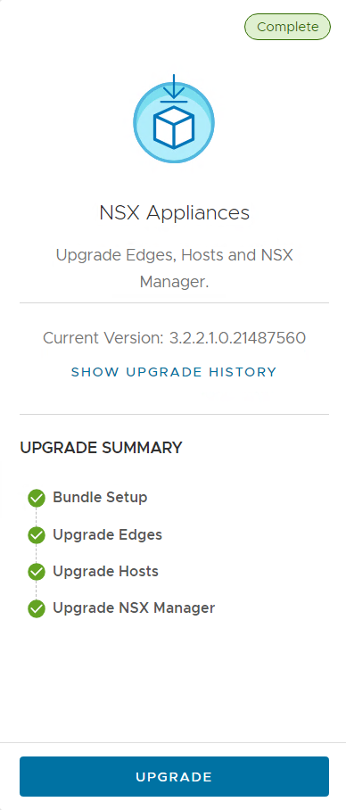
   - If not, i.e. you may see something like this:

   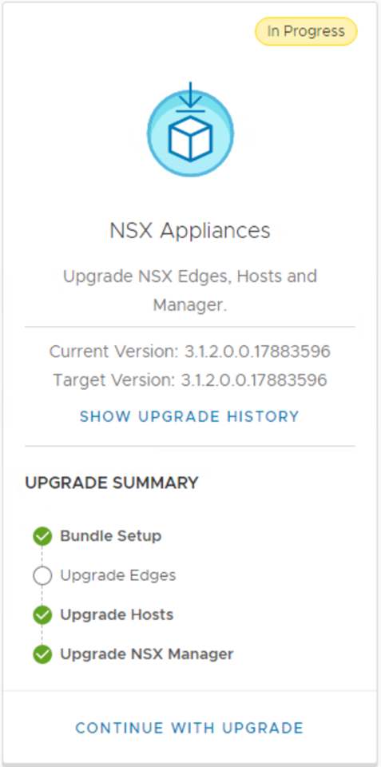

   then please schedule an appropriate time to finish up the upgrade first.

5. Check both vCenter servers using the Lookup Service Doctor tool (lsdoctor) available at [KB80469](https://kb.vmware.com/s/article/80469).
   This tool is used to identify and address problems with the PSC/SSO Domain data.

   - Download the tool from the article, extract and upload it to both vCenters, e.g. to `/tmp` directory
   - Execute `python /tmp/lsdoctor-master/lsdoctor.py -l` and if the tool discovers any problems, please address them with VMware Support.

   >NOTE: do not execute the tool with any switches other than `-l`. It's the only switch that doesn't modify anything and as such it's safe to use it on our own.        Remaining functionalities can be used only under VMware Support's supervision.

6. It is extremely important that both vCenter servers are checked for any potential problems prior to the upgrade:

   - Check if all services are starting correctly after restart.
   - As an extra precaution, please have a look at the following log file: `/var/log/vmware/applmgmt/PatchRunner.log` and look for the following phrases:
   - `INFO __main__ Patch vCSA succeeded` - to check whether the last upgrade completed successfully.
   - `ERROR __main__ Patch vCSA failed` - to check if it failed.

   during the time of the last VC upgrade.

7. Please check if `/etc/vmware-vlcm/version.txt` file exists and if it contains the version of the internal vLCM   service, e.g. `0.0.3`. If the file doesn't exist, please create it by executing;

   ```bash
   echo "0.0.3" > /etc/vmware-vlcm/version.txt
   ```

    If the file exists on 1st vCenter, but doesn't exist on the 2nd one, copy the version value from the 1st VC.

If any of those three checks show any problems, please contact VMware support to address those. This is especially important if vCenter servers were upgraded in the past. The server might seem to work fine, but underneath there might be problems that can cause the next upgrade to fail.

### Power off Avamar proxies

Powered on Avamar proxies do not allow hosts to enter maintenance mode. Before you start upgrade, power off all avamar proxies on the cluster. Avamar proxies have `<locationCode>avp00X` VM name.

### Check/Configure Proxy

 LCM is configured to work with "My VMware" account, LCM automatically polls the depot to access the bundles.
 VCS uses a proxy server to access the VMware depot and download the LCM bundles.

 >NOTE: LCM only supports proxy servers that do not require authentication.

 Proxy server should be already configured for SDDC Manager and VMware Aria Suite Lifecycle but if there is any problem to get to VMware depot please check the configuration.

## List of steps for upgrade from DHC-1.7.1 (VCF 4.5.0) to DHC-1.8.2 (VCF 4.5.2)

| Step no.   | Component | Current version  | Target version  | Build |
| ---------- | --------  | ---------------  | ----            | ------------------------- |
| [Step 1a](#step-1a-upgrade-sddc-manager) | SDDC manager | 4.15.0-163030 | 4.17.0-187856 | 4.5.2.0-22223457 |
| [Step 1b](#step-1b-upgrade-sddc-manager-drift-bundle) | SDDC Drift Bundle | 4.15.1-163031 | 4.17.1-187857 | 4.5.2.0-22223457 |
| [Step 2a](#step-2a-vmware-aria-suite-lifecycle-812) | VMware Aria Suite Lifecycle | 8.8.2.3 | 8.12 | 8.12.0.7-21628952 |
| [Step 2b](#step-2b-vmware-aria-suite-lifecycle-8120-pspack-9) | VMware Aria Suite Lifecycle PSPAK | none | newest | |
| [Step 3a](#step-3a-vmware-aria-operations-for-logs-8102) | VMware Aria Operations for Logs | 8.8.2 | 8.10.2 | 8.10.2-21638564 |
| [Step 3b](#step-3b-content-pack-marketplace-upgrade-procedure) | VMware Aria Operations for Logs Markeplace | none | newest | |
| [Step 4](#step-4-vmware-aria-operations-8121) | VMware Aria Operations | 8.6.3 | 8.12.1 | 8.12.1-21952151 |
| [Step 5](#step-5-vmware-aria-operations-for-networks-690) | VMware Aria Operations for Networks | 6.7.0 | 6.9.0 | 6.9.0-1673888786 |
| [Step 6](#step-6-vmware-aria-automation-8130) | VMware Aria Automation | 8.9.1 | 8.13.0 | 8.13.0-22178981 |
| [Step 7](#step-7-vmware-site-recovery-manager-87) | VMware Site Recovery Manager | 8.5 | 8.7 | 8.7.0.22178981 |
| [Step 8a](#step-8a-vmware-aria-operations-for-logs-8120) | VMware Aria Operations for Logs | 8.10.2 | 8.12.0 | 8.12.0-21696970 |
| [Step 8b](#step-8b-content-pack-marketplace-upgrade-procedure) | VMware Aria Operations for Logs Markeplace | none | newest | |
| [Step 9a](#step-9a-vmware-aria-suite-lifecycle-812-patching) | VMware Aria Suite Lifecycle Patching | 8.12.0.7 Patch 1 | 8.12.0.7 Patch 3 | 8.12.0.7-21628952 |
| [Step 9b](#step-9b-vmware-aria-suite-lifecycle-814) | VMware Aria Suite Lifecycle | 8.12.0.7 | 8.14 | 8.14.0.4-22630472 |
| [Step 9c](#step-9c-vmware-aria-suite-lifecycle-8140-pspack-7) | VMware Aria Suite Lifecycle 8.14.0 PSPACK 7 | none | newest | |
| [Step 10](#step-10-replacing-clustered-vmware-identity-manager-instance-with-a-one-node-installation-of-workspace-one-access-337) | Workspace ONE Access re-deploy | 3.3.6 | 3.3.7 | 3.3.7.21173100 |
| [Step 11a](#step-11a-vmware-aria-operations-for-logs-8141) | VMware Aria Operations for Logs | 8.10.2 | 8.14.1 | 8.14.1-22806512 |
| [Step 11b](#step-11b-content-pack-marketplace-upgrade-procedure) | VMware Aria Operations for Logs Markeplace | none | newest | |
| [Step 12a](#step-12a-vmware-aria-operations-8141) | VMware Aria Operations | 8.12.1 | 8.14.1 | 8.14.1-22798982 |
| [Step 12b](#step-12b-vmware-aria-operations-management-packs-upgrade) | VMware Aria Operations Management Pack |  | listed in section |  |
| [Step 13](#step-13-vmware-aria-operations-for-networks-6110) | VMware Aria Operations for Networks | 6.9.0 | 6.11.0 | 6.11.0-1692527086 |
| [Step 14](#step-14-vmware-aria-automation-8160) | VMware Aria Automation | 8.13.0 | 8.16.0 | 8.16.0.33697-23103949 |
| [Step 15](#step-15-vmware-site-recovery-manager-88) | VMware Site Recovery Manager | 8.7 | 8.8 | 8.8.0.8239-23263427 |
| [Step 16](#step-16-vmware-nsx-t-data-center-3231) | VMware NSX-T (MGMT) | 3.2.1.2.0 | 3.2.3.1 | 3.2.3.1-22104592 |
| [Step 17](#step-17-vmware-vcenter-server-appliance-70-update-3m) | VMware vCenter Server Appliance (MGMT) | 7.0 Update 3h | 7.0 Update 3m | 7.0.3.01500-21784236 |
| [Step 18](#step-18-vmware-esxi-70-update-3n) | VMware ESXi (MGMT)| 7.0 Update 3g | 7.0 Update 3n | 7.0.3-21930508 |
| [Step 19](#step-19-vmware-nsx-t-data-center-3231) | VMware NSX-T (WRKLD) | 3.2.1.2.0 | 3.2.3.1 | 3.2.3.1-22104592 |
| [Step 20](#step-20-vmware-vcenter-server-appliance-70-update-3m) | VMware vCenter Server Appliance (WRKLD) | 7.0 Update 3h | 7.0 Update 3m | 7.0.3.01500-21784236 |
| [Step 21](#step-21-vmware-esxi-70-update-3n) | VMware ESXi (WRKLD)| 7.0 Update 3g | 7.0 Update 3n | 7.0.3-21930508 |
| [Step 22](#step-22-management-domain) | VMware ESXi (MGMT) Async Upgrade | 7.0 Update 3n | 7.0 Update 3p | 7.0.3-23307199 |
| [Step 23](#step-23-workload-domain) | VMware ESXi (WRKLD) Async Upgrade | 7.0 Update 3n | 7.0 Update 3p | 7.0.3-23307199 |

## List of steps for upgrade from DHC-1.8.x (VCF 4.5.1) to DHC-1.8.2 (VCF 4.5.2)

| Step no.   | Component | Current version  | Target version  | Build |
| ---------- | --------  | ---------------  | ----            | ------------------------- |
| [Step 1a](#step-1a-upgrade-sddc-manager) | SDDC manager | 4.16.0-176690 | 4.17.0-187856 | 4.5.2.0-22223457 |
| [Step 1b](#step-1b-upgrade-sddc-manager-drift-bundle) | SDDC Drift Bundle | 4.16.1-176691 | 4.17.1-187857 | 4.5.2.0-22223457 |
| steps ommited    | | | | |
| [Step 5](#step-5-vmware-aria-operations-for-networks-690) | VMware Aria Operations for Networks | 6.7.0 | 6.9.0 | 6.9.0-1673888786 |
| steps ommited    | | | | |
| [Step 7](#step-7-vmware-site-recovery-manager-87) | VMware Site Recovery Manager | 8.5 | 8.7 | 8.7.0.22178981 |
| [Step 8a](#step-8a-vmware-aria-operations-for-logs-8120) | VMware Aria Operations for Logs | 8.10.2 | 8.12.0 | 8.12.0-21696970 |
| [Step 8b](#step-8b-content-pack-marketplace-upgrade-procedure) | VMware Aria Operations for Logs Markeplace | none | newest | |
| [Step 9a](#step-9a-vmware-aria-suite-lifecycle-812-patching) | VMware Aria Suite Lifecycle Patching | 8.12.0.7 Patch 1 | 8.12.0.7 Patch 3 | 8.12.0.7-21628952 |
| [Step 9b](#step-9b-vmware-aria-suite-lifecycle-814) | VMware Aria Suite Lifecycle | 8.12.0.7 | 8.14 | 8.14.0.4-22630472 |
| [Step 9c](#step-9c-vmware-aria-suite-lifecycle-8140-pspack-7) | VMware Aria Suite Lifecycle 8.14.0 PSPACK 7 | none | newest | |
| steps ommited    | | | | |
| [Step 11a](#step-11a-vmware-aria-operations-for-logs-8141) | VMware Aria Operations for Logs | 8.12 | 8.14.1 | 8.14.1-22806512 |
| [Step 11b](#step-11b-content-pack-marketplace-upgrade-procedure) | VMware Aria Operations for Logs Markeplace | none | newest | |
| [Step 12a](#step-12a-vmware-aria-operations-8141) | VMware Aria Operations | 8.10.2 | 8.14.1 | 8.14.1-22798982 |
| [Step 12b](#step-12b-vmware-aria-operations-management-packs-upgrade) | VMware Aria Operations Management Pack |  | listed in section |  |
| [Step 13](#step-13-vmware-aria-operations-for-networks-6110) | VMware Aria Operations for Networks | 6.9.0 | 6.11.0 | 6.11.0-1692527086 |
| [Step 14](#step-14-vmware-aria-automation-8160) | VMware Aria Automation | 8.12.1 | 8.16.0 | 8.16.0.33697-23103949 |
| [Step 15](#step-15-vmware-site-recovery-manager-88) | VMware Site Recovery Manager | 8.7 | 8.8 | 8.8.0.8239-23263427 |
| [Step 16](#step-16-vmware-nsx-t-data-center-3231) | VMware NSX-T (MGMT) | 3.2.2.1.0 | 3.2.3.1 | 3.2.3.1-22104592 |
| [Step 17](#step-17-vmware-vcenter-server-appliance-70-update-3m) | VMware vCenter Server Appliance (MGMT) | 7.0 Update 3l | 7.0 Update 3m | 7.0.3.01500-21784236 |
| [Step 18](#step-18-vmware-esxi-70-update-3n) | VMware ESXi (MGMT)| 7.0 Update 3l | 7.0 Update 3n | 7.0.3-21930508 |
| [Step 19](#step-19-vmware-nsx-t-data-center-3231) | VMware NSX-T (WRKLD) | 3.2.2.1.0 | 3.2.3.1 | 3.2.3.1-22104592 |
| [Step 20](#step-20-vmware-vcenter-server-appliance-70-update-3m) | VMware vCenter Server Appliance (WRKLD) | 7.0 Update 3l | 7.0 Update 3m | 7.0.3.01500-21784236 |
| [Step 21](#step-21-vmware-esxi-70-update-3n) | VMware ESXi (WRKLD)| 7.0 Update 3l | 7.0 Update 3n | 7.0.3-21930508 |
| [Step 22](#step-22-management-domain) | VMware ESXi (MGMT) Async Upgrade | 7.0 Update 3n | 7.0 Update 3p | 7.0.3-23307199 |
| [Step 23](#step-23-workload-domain) | VMware ESXi (WRKLD) Async Upgrade | 7.0 Update 3n | 7.0 Update 3p | 7.0.3-23307199 |

## Upgrade procedure

### [Step 1a] Upgrade SDDC Manager

Estimated upgrade time: ~45m

- Ensure you have a recent successful backup of SDDC Manager using an external SFTP server, as described in the `Prerequisites` section.
- Ensure you have taken a snapshot of the SDDC Manager appliance and that you have recent successful backups of the components managed by SDDC Manager, including vCenter Server.
- Go to `Inventory` > `Workload Domains` > `(location code)-m01` management domain > `Updates/Patches`.
- Execute the upgrade pre-check before every upgrade bundle installation. Ensure that the pre-check results are green before proceeding. A failed pre-check may cause the update to fail.

  

  >NOTE: If pre-check results are red, please resolve any problems and re-run the pre-check until it passes successfully. Solutions to some recurring problems might be listed in the `Known issues` chapters of this work instruction and also in older upgrade instructions.
- Expand the `Available updates` and from the `Select Cloud Foundation version` drop-down menu, select `Cloud Foundation 4.5.2.0`.

  This upgrade bundle should be visible:

  ```yaml
  - VMware Cloud Foundation Update 4.5.2.0
  Released: Aug 17, 2023
  Size: 2 GB
  Version: 4.17.1-187857
  Description: This VMware Cloud Foundation Upgrade bundle to 4.5.2.0 contains features, critical bugs and security fixes. For more information, see https://docs.vmware.com/en/VMware-Cloud-Foundation/4.5.2/rn/vmware-cloud-foundation-452-release-notes/index.html For VCF on VxRail, see https://docs.vmware.com/en/VMware-Cloud-Foundation/4.5.2/rn/vmware-cloud-foundation-452-on-dell-emc-vxrail-release-notes/index.html
  Bundle ID: 363bd141-7d19-4287-9c7a-091c11042ca0
  Update to Version: 4.5.2.0-22223457
  Description: SDDC Manager version update
  ```

### [Step 1b] Upgrade SDDC Manager Drift Bundle

Estimated upgrade time: ~30m

- Download the bundle and click `Update Now` or `Schedule Update` depending on your schedule/timeline and follow the upgrade steps described here: [Apply VMware Cloud Foundation Upgrade Bundle](https://docs.vmware.com/en/VMware-Cloud-Foundation/4.5/vcf-lifecycle/GUID-E101AFB5-1034-4CF9-B96E-A2E70DCF02F5.html#GUID-9E77C737-AEE1-470D-80A3-6C498C4E3F10).

  >TIP: It's worth to refresh the update status page, as it often reports *In progress* state thought the upgrade is already *Finished*.

- After upgrade completes successfully, execute another pre-check and ensure that the pre-check results are green before proceeding.

- Expand the `Available updates` and from the `Select Cloud Foundation version` drop-down menu, select `Cloud Foundation 4.5.2.0`.

  This upgrade bundle should be visible:

  ```yaml
  - VMware Cloud Foundation Update 4.5.2.0
  Released: Aug 17, 2023
  Size: 263 MB
  Version: 4.17.1-187857
  Description: The configuration drift bundle for VMware Cloud Foundation 4.5.2.0
  Bundle ID: 85192dee-1d47-4211-bbdb-999d604f601f 
  Update to Version: 4.5.2.0-22223457
  ```

- Download the bundle and click `Update Now` or `Schedule Update` depending on your schedule/timeline and follow the upgrade steps described here: [Apply Configuration Drift Bundle](https://docs.vmware.com/en/VMware-Cloud-Foundation/4.5/vcf-lifecycle/GUID-E101AFB5-1034-4CF9-B96E-A2E70DCF02F5.html#GUID-FC2B3247-9080-40CC-9B24-CCB0B7A428EB).
- After the successful drift bundle installation, perform an [Operational Verification of SDDC Manager](https://docs.vmware.com/en/VMware-Cloud-Foundation/4.5/vcf-operations/GUID-B29A8186-4779-4549-834C-47A7C10499E7.html).

### Upgrade vRealize/Aria Suite Components

#### [Step 2a] **VMware Aria Suite Lifecycle 8.12**

Old name: VMware vRealize Suite Lifecycle Manager

Estimated upgrade time: ~30m

Important note: If FIPS Mode Compliance is enabled in VMware Aria Suite Lifecycle, you must manually disable it. See: [Activate or deactivate FIPS Mode Compliance in VMware Aria Suite Lifecycle](https://docs.vmware.com/en/VMware-Aria-Suite-Lifecycle/8.12/lifecycle-install-upgrade-manage/GUID-4C29A6BF-2570-47A7-8A8B-591AC4C8A5CD.html).

  Download below upgrade package from Broadcom Support Portal [website](https://support.broadcom.com/group/ecx/productfiles?displayGroup=VMware%20Aria%20Suite%20-%20Standard&release=2019&os=&servicePk=202421&language=EN&groupId=204011) (choose 8.12 version from dropdown filter):

  ```yaml
  - VMware Aria Suite Lifecycle 8.12 Update Repository Archive
  Release date: 2023-04-20
  Size: 1.46 GB
  Build Number: 21628952
  Description: VMware vRealize Suite Lifecycle Manager 8.12 Update Repository Archive
  Use this ISO package to upgrade an older version virtual appliance of VMware vRealize Suite Lifecycle Manager to version 8.12. Please refer to the Installation and Administration guide for more details
  ```

- Verify that you have taken a snapshot of VMware vRealize Suite Lifecycle Manager.
- Upload the `VMware-Aria-Suite-Lifecycle-Appliance-8.12.0.7-21628952-updaterepo.iso` iso file to VSAN datastore in Management Domain.
- Attach the iso file to the CD-ROM drive of LCM appliance.
- Log into the LCM appliance using `vcfadmin@local` account.
- Browse to `vRSLCM` > `Lifecycle Operations` > `Settings` > `System Upgrade'.
- Select Repository Type `CDROM` and click `CHECK FOR UPGRADE` Button.
- Proceed with the upgrade process.
- Once vRealize Suite Lifecycle Manager is upgraded, perform an [Operational Verification of vRealize Suite Lifecycle Manager](https://docs.vmware.com/en/VMware-Cloud-Foundation/4.5/vcf-operations/GUID-3FDF80B1-1462-4AEE-AAA7-8A07D3D7F170.html).

#### [Step 2b] **VMware Aria Suite Lifecycle 8.12.0 PSPACK 9**

Estimated upgrade time: ~1h

- Verify that you have taken a snapshot of VMware vRealize Suite Lifecycle Manager.
- Log in to vRealize Lifecycle Manager.
- On the Lifecycle Operations dashboard, navigate to `Settings` > `Product Support Pack`.
- Go to the `Support for Additional Product Versions` section. If the list is not auto-populated, click `CHECK SUPPORT PACKS ONLINE`. The vRealize Suite Lifecycle Manager auto-populates the list of available support versions.
- When the list is populated, click `Apply Version` in `Settings` > `Product Support Pack` for the appropriate content `version 8.12.0.9`.
- Once the PSPAK 9 installation is triggered successfully, VMware vRealize Suite Lifecycle Manager services are restarted and you are redirected to VMware vRealize Suite Lifecycle Manager UI login page.
- To verify your new PSPAK 9, on the Lifecycle Operations dashboard, navigate to `Settings` > `Product Support Pack`. The option lists the `Policy 8.12.0.9.`
- If FIPS mode has been disabled prior to upgrade, re-enable FIPS Mode Compliance.

> NOTE: During documentation creation PSPACK 9 was the newest. If there will be some new version for example PSPACK 12 then please use the newest.

#### Supported versions as of LCM 8.12.0 PSPACK 9

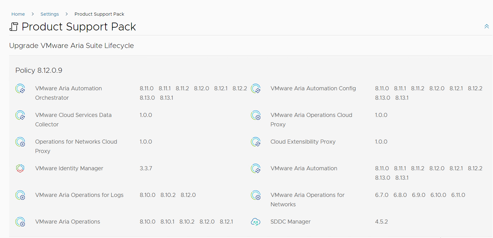

> NOTE: Aria Suite Lifecycle no longer supports downloads from MyVMware.
> <https://knowledge.broadcom.com/external/article/368614/aria-suite-lifecycle-no-longer-supports.html>

#### [Step 3a] **VMware Aria Operations for Logs 8.10.2**

Also known as: VMware vRealize Log Insight

Estimated upgrade time: ~2h

- Ensure you have a recent successful backup of of the vRealize Log Insight virtual appliances (vli001a, vli001b,vli001c).
- Ensure Aria Operations for logs certificates are valid. In LCM navigate to `Locker>Certificates` and verify that Aria Operations for Logs certificate is Healty (green tick).
- Ensure Aria Operations for logs internal certificate is valid : Run the following command to check the expiration date:

  ```shell
  echo "" | keytool -list -keystore /usr/lib/loginsight/application/etc/3rd_config/keystore -rfc 2> /dev/null | openssl x509 -noout -enddate
  ```

  In case certificate is expired please follow <https://knowledge.broadcom.com/external/article/342206/replace-expired-internal-certificate-in.html#prerequisites> to renew it .
- Perform an inventory sync in vRSLCM for the Log Insight environment: go to Lifecycle Operations > Environments > vRLI Environment > Details > ... > Trigger Inventory Sync.
- Auto-upgrade of vRLI agents is not working in VCS so agents are updated using playbook: `updateLogInsightAgent.yml` from `Manage`.

  ```yaml
  ansible-playbook updateLogInsightAgent.yml
  ```

  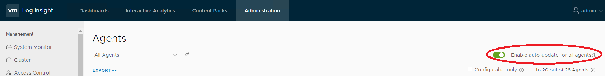
- Go to the `vRSLCM` > `Lifecycle Operations` > `Settings` > `Binary Mapping` and check if the `VMware Aria Operations for Logs 8.10.2` upgrade bundle is available.
  > NOTE: Aria Suite Lifecycle no longer supports downloads from MyVMware
- Download the upgrade bundle manually (file name: `VMware-vRealize-Log-Insight-8.10.2-21638564.pak`) from [here](https://support.broadcom.com/group/ecx/productfiles?subFamily=VMware%20Aria%20Operations%20for%20Logs&displayGroup=VMware%20Aria%20Operations%20for%20Logs&release=8.10.2&os=&servicePk=203679&language=EN), upload it to the */data* folder on vRSLCM appliance VM using e.g. WinSCP.
  Then go to `Lifecycle Operations` > `Settings` > `Binary Mapping`, click `Add Binaries` and location type:  `Local`. In `Base Location` enter */data*, click `Discover`, select the  bundle and click ADD button. Wait for mapping request to finish, verify the bundle is visible and delete it from */data* folder.
- Go to `Environments` > `vRLI_environment` > `View Details`.
- Click `Upgrade` and follow the upgrade wizard.
- Check if all agents are upgraded to the newest version.
- Repeat the inventory sync.

#### [Step 3b] **Content Pack Marketplace upgrade procedure**

Estimated upgrade time: ~1h

With vRealize Log Insight upgraded to the latest version (8.10.2), we now upgrade the content packs for use with vRLI.

- The Content Pack Marketplace requires a connection from your web browser to the internet. Check your browser's connection settings (proxy settings).
- Follow the steps described in [Upgrade the Content Packs on vRealize Log Insight](https://docs.vmware.com/en/VMware-Validated-Design/6.2/sddc-upgrade/GUID-93BAA0DC-875A-4380-9405-4632764C48AA.html).
- As a result, all Content Packs should be up to date.

  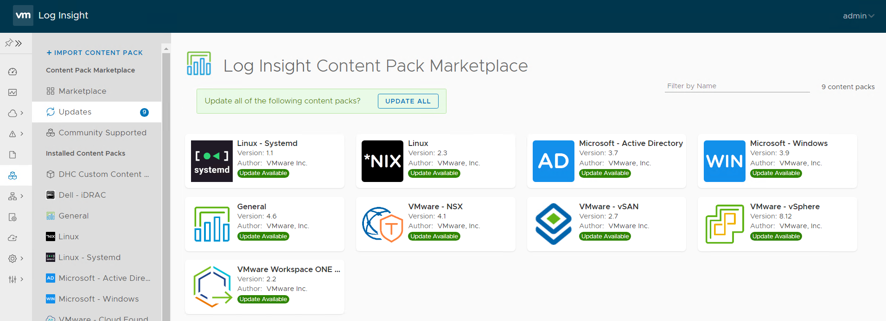

  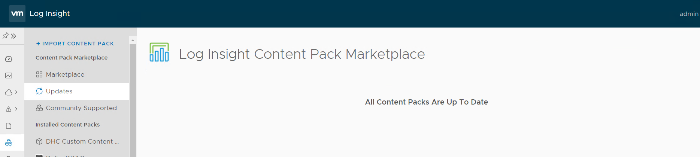

- Once both vRealize Log Insight and content packs are upgraded, perform an [Operational Verification of vRealize Log Insight](https://docs.vmware.com/en/VMware-Validated-Design/6.2/sddc-operational-verification/GUID-FDA86887-0C01-455B-9E23-C314AC1FB695.html).
- In step [Verify the vRealize Log Insight Agent Status for the Virtual Appliances of the Management Domain](https://docs.vmware.com/en/VMware-Validated-Design/6.2/sddc-operational-verification/GUID-7561C712-B761-454A-B7BE-CD1F02FEB36A.html) to verify syslog data collection status for all appliances of the management domain using Photon OS just sort agents by OS. In VCS there is no `SDDC - Photon OS` agent group.
- In step [Verify the vRealize Log Insight Agent Status for the Workspace ONE Access Appliances](https://docs.vmware.com/en/VMware-Validated-Design/6.2/sddc-operational-verification/GUID-121DE2D2-FA1E-46A7-82E4-CEB1B1AD85EC.html) to verify syslog data collection status for the region-specific Workspace ONE Access appliances just sort agents by Hostname and check status for `<locationCode>idm001.<searchdomain>`. In VCS there is no `SDDC - Linux OS` agent group.
- Skip `Verify the Log Forwarding Status of vRealize Automation` if VCS vRA Cloud is in use.

#### [Step 4] **VMware Aria Operations 8.12.1**

Also known as: VMware vRealize Operations

Estimated upgrade time: ~2h

- Ensure you have a recent successful backup of the vROps VMs `<locationCode>ops002` and `<locationCode>ops003`.
- Perform the `inventory sync` of the vROPS_environment, exactly the same way as it was done for vRLI.
- Prior to the upgrade, it is recommended to run the Pre-Upgrade Readiness Assessment Tool. Its goal is to analyze the potential impact following the reduction of metrics in various versions of the product, as well as to evaluate the feasibility for upgrade.
In case of an upgrade failure, VMware support may ask whether this validation was performed and ask for the report to be provided to aid in their troubleshooting. A correct version of the tool must be downloaded, i.e. matching the vROps version you plan to upgrade to (8.12.1). Download link [here](https://support.broadcom.com/group/ecx/productfiles?subFamily=VMware%20Aria%20Operations&displayGroup=VMware%20Aria%20Operations&release=8.12.1&os=&servicePk=202990&language=EN) and the release notes [here](https://docs.vmware.com/en/VMware-Aria-Operations/8.12.1/rn/vmware-aria-operations-8121-release-notes/index.html).
- Go to the `vRSLCM` > `Lifecycle Operations` > `Settings` > `Binary Mapping` and check if the `VMware Aria Operations 8.12.1` upgrade bundle is available.
  > NOTE: Aria Suite Lifecycle no longer supports downloads from MyVMware
- Download the upgrade bundle manually (file name: `vRealize_Operations_Manager_With_CP-8.x-to-8.12.1.21952629.pak`) from [here](https://support.broadcom.com/group/ecx/productfiles?subFamily=VMware%20Aria%20Operations&displayGroup=VMware%20Aria%20Operations&release=8.12.1&os=&servicePk=202990&language=EN), upload it to the */data* folder on vRSLCM appliance VM using e.g. WinSCP.
- Then go to `Lifecycle Operations` > `Settings` > `Binary Mapping`, click `Add Binaries` and location type:  `Local`. In `Base Location` enter */data*, click `Discover`, select the  bundle and click ADD button. Wait for mapping request to finish, verify the bundle is visible and delete it from */data* folder.
- Go to `Environments` > `vROPS_environment` > `View Details`.
- Click `Upgrade` and follow the upgrade wizard.
- Once vRealize Operation Manager is upgraded, perform an [Operational Verification of vRealize Operations Manager](https://docs.vmware.com/en/VMware-Validated-Design/6.2/sddc-operational-verification/GUID-C2B5127D-01A5-4F2B-A6A3-BB39F8C19A2D.html).
- Repeat the inventory sync.
- If the vROPS is upgraded with cloudproxy, then telegraf agents also need to be updated using the link here [wiUpdateTelegrafAgent](wiUpdateTelegrafAgent.md).

#### [Step 5] **VMware Aria Operations for Networks 6.9.0**

Also known as: VMware vRealize Network Insight

Estimated upgrade time: ~3h

- Ensure you have a recent successful backup of the vRNI VMs `<locationCode>vni001` and `<locationCode>vnc001`.
- Perform inventory sync.
- Go to the `vRSLCM` > `Lifecycle Operations` > `Settings` > `Binary Mapping` and check if the `VMware Aria Operations for Networks 6.9.0` upgrade bundle is available.
  > NOTE: Aria Suite Lifecycle no longer supports downloads from MyVMware
- Download the upgrade bundle manually from [here](https://support.broadcom.com/group/ecx/productfiles?subFamily=VMware%20vRealize%20Network%20Insight&displayGroup=VMware%20vRealize%20Network%20Insight&release=6.9.0&os=&servicePk=203718&language=EN) (file name: `VMware-vRealize-Network-Insight.6.9.0.1673888786.upgrade.bundle`), upload it to the */data* folder on vRSLCM appliance VM using e.g. WinSCP.
  Then go to `Lifecycle Operations` > `Settings` > `Binary Mapping`, click `Add Binaries` and location type:  `Local`. In `Base Location` enter */data*, click `Discover`, select the  bundle and click ADD button. Wait for mapping request to finish, verify the bundle is visible and delete it from */data* folder (Important note: if Network Insigh will be upgraded manually then patch must be additionally done).
- Go to `Environments` > `vRNI` > `View Details`.
- Click `Upgrade` and follow the upgrade wizard and if precheck will fail with free space alert please [https://kb.vmware.com/s/article/88977](https://kb.vmware.com/s/article/88977).

- Once done, restart both vms in order:

  ```yaml
  <locationCode>vnc001
  <locationCode>vni001
  ```

- Once vRealize Network Insight is upgraded, log in to vRNI web interface (vni001 appliance VM) and verify that it is up and running.
- Delete upgrade bundle file from vRealize Suite Lifecycle Manager */data/* folder on `<locationCode>lcm001` (only when manual upload was performed).
- Repeat inventory sync.

> Note: there is a possibility that after the upgrade of vRealize Log Insight and/or vRealize Network Insight appliances, the Network Insight will be visible as `localhost` on the list of agents inside Log
  Insight. To fix that, execute the following playbook on *ans001* server from */opt/dhc/update* folder:

  ```yaml
  ansible-playbook configureVniLiAgent.yml
  ```

Validate the state by going to `Log Insight` > `Administration` > `Agents` and checking if `vni001` host is visible correctly and showing as active.

#### [Step 6] **VMware Aria Automation 8.13.0**

Also known as: VMware vRealize Automation

Estimated upgrade time: ~3h

Important note: Since version 8.12 assigned ammount of RAM must be increased from 42 GB to 48 GB for each `vra` VM.

If vRA-on-prem has been deployed in the environment, please perform below steps to upgrade the vRA infrastructure:

- Ensure you have a recent successful backup of the vRA VMs `<locationCode>vra002`, `<locationCode>vra003` and `<locationCode>vra004`.
- Perform inventory sync.
- Go to the `vRSLCM` > `Lifecycle Operations` > `Settings` > `Binary Mapping` and check if the `vRealize Automation 8.13.0` upgrade bundle is available.
  > NOTE: Aria Suite Lifecycle no longer supports downloads from MyVMware
- Download the upgrade bundle manually from [here](https://support.broadcom.com/group/ecx/productfiles?subFamily=VMware%20Aria%20Automation&displayGroup=VMware%20Aria%20Automation&release=8.13&os=&servicePk=202730&language=EN) (file name: `Prelude_VA-8.13.0.31759-22178981-updaterepo.iso`), upload it to the */data* folder on vRSLCM appliance VM using e.g. WinSCP.
  Then go to `Lifecycle Operations` > `Settings` > `Binary Mapping`, click `Add Binaries` and location type:  `Local`. In `Base Location` enter */data*, click `Discover`, select the  bundle and click ADD button. Wait for mapping request to finish, verify the bundle is visible and delete it from */data* folder.
- Go to `Environments` > `<locationCode>vra001` > `View Details`.
- Click `Upgrade` and follow the upgrade wizard.
- Once vRealize Automation is upgraded, perform an [Operational Verification of vRealize Automation](https://docs.vmware.com/en/VMware-Validated-Design/6.2/sddc-operational-verification/GUID-11A28FC8-3B7E-4C84-8CDC-1DDE4C5A6E52.html).
- Repeat the inventory sync.

#### [Step 7] **VMware Site Recovery Manager 8.7**

Please follow [Site Recovery Manager and vSphere Replication upgrade WI](wiSrmVsrUpgradeTo8.7.md) use version 8.7.0 from [here](https://support.broadcom.com/group/ecx/productfiles?subFamily=VMware%20Site%20Recovery%20Manager&displayGroup=VMware%20Site%20Recovery%20Manager&release=8.7.0&os=&servicePk=203085&language=EN) and adapters from [here](https://support.broadcom.com/group/ecx/productfiles?subFamily=VMware%20Site%20Recovery%20Manager&displayGroup=VMware%20Site%20Recovery%20Manager&release=8.7.0&os=&servicePk=203085&language=EN) (`Drivers & Tools` section).

#### [Step 8a] **VMware Aria Operations for Logs 8.12.0**

Also known as: VMware vRealize Log Insight

Estimated upgrade time: ~2h

- Ensure you have a recent successful backup of of the vRealize Log Insight virtual appliances (vli001a, vli001b,vli001c).
- Perform an inventory sync in vRSLCM for the Log Insight environment: go to Lifecycle Operations > Environments > vRLI Environment > Details > ... > Trigger Inventory Sync.
- Make sure that auto-upgrade or vRLI agents is enabled: log in to the vRealize Log Insight and navigate to `Administration` > `Management` > `Agents` and check if `Enable auto-update for all agents` option is enabled.
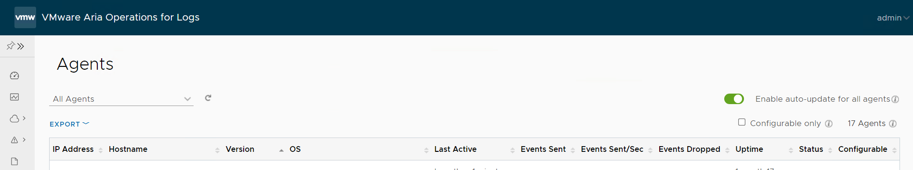.
- Go to the `vRSLCM` > `Lifecycle Operations` > `Settings` > `Binary Mapping` and check if the `VMware Aria Operations for Logs 8.12.0` upgrade bundle is available.
  > NOTE: Aria Suite Lifecycle no longer supports downloads from MyVMware
- Download the upgrade bundle manually (file name: `VMware-vRealize-Log-Insight-8.12.0-21696970.pak`) from [here](https://support.broadcom.com/group/ecx/productfiles?subFamily=VMware%20Aria%20Operations%20for%20Logs&displayGroup=VMware%20Aria%20Operations%20for%20Logs&release=8.12.0&os=&servicePk=202996&language=EN), upload it to the */data* folder on vRSLCM appliance VM using e.g. WinSCP.
  Then go to `Lifecycle Operations` > `Settings` > `Binary Mapping`, click `Add Binaries` and location type:  `Local`. In `Base Location` enter */data*, click `Discover`, select the  bundle and click ADD button. Wait for mapping request to finish, verify the bundle is visible and delete it from */data* folder.
- Go to `Environments` > `vRLI_environment` > `View Details`.
- Click `Upgrade` and follow the upgrade wizard.
- Check if all agents are upgraded to the newest version.
- Repeat the inventory sync.

#### [Step 8b] **Content Pack Marketplace upgrade procedure**

Estimated upgrade time: ~1h

With vRealize Log Insight upgraded to the latest version (8.12.0), we now upgrade the content packs for use with vRLI.

- The Content Pack Marketplace requires a connection from your web browser to the internet. Check your browser's connection settings (proxy settings).
- Follow the steps described in [Upgrade the Content Packs on vRealize Log Insight](https://docs.vmware.com/en/VMware-Validated-Design/6.2/sddc-upgrade/GUID-93BAA0DC-875A-4380-9405-4632764C48AA.html).
- As a result, all Content Packs should be up to date.

  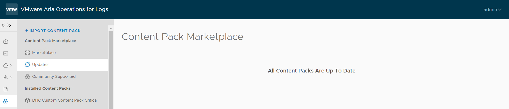

- Once both vRealize Log Insight and content packs are upgraded, perform an [Operational Verification of vRealize Log Insight](https://docs.vmware.com/en/VMware-Validated-Design/6.2/sddc-operational-verification/GUID-FDA86887-0C01-455B-9E23-C314AC1FB695.html).
- In step [Verify the vRealize Log Insight Agent Status for the Virtual Appliances of the Management Domain](https://docs.vmware.com/en/VMware-Validated-Design/6.2/sddc-operational-verification/GUID-7561C712-B761-454A-B7BE-CD1F02FEB36A.html) to verify syslog data collection status for all appliances of the management domain using Photon OS just sort agents by OS. In VCS there is no `SDDC - Photon OS` agent group.
- In step [Verify the vRealize Log Insight Agent Status for the Workspace ONE Access Appliances](https://docs.vmware.com/en/VMware-Validated-Design/6.2/sddc-operational-verification/GUID-121DE2D2-FA1E-46A7-82E4-CEB1B1AD85EC.html) to verify syslog data collection status for the region-specific Workspace ONE Access appliances just sort agents by Hostname and check status for `<locationCode>idm001.<searchdomain>`. In VCS there is no `SDDC - Linux OS` agent group.
- Skip `Verify the Log Forwarding Status of vRealize Automation` if VCS vRA Cloud is in use.

#### [Step 9a] **VMware Aria Suite Lifecycle 8.12 Patching**

Also known as: VMware vRealize Suite Lifecycle Manager

Estimated upgrade time: ~30min

This step is required due to issues during direct update from version 8.12 to 8.14 without patch applied.

- Verify that you have taken a snapshot of VMware vRealize Suite Lifecycle Manager.
- Log in to vRealize Lifecycle Manager.
- On the Lifecycle Operations dashboard, navigate to `Settings` > `Binary Mapping` > `Patch Binaries`.
- Click `Check Patches Online`.
- Find `VMware Aria Suite Lifecycle 8.12.0 Patch3` and click arrow to download in tab `Action`.
- When downloaded navigate to `Settings` > `System Patches` > `New Patch`.
- Choose `VMware Aria Suite Lifecycle 8.12.0 Patch3` click `Next` and follow installation steps.
- Once the Patch3 installation is triggered successfully, VMware vRealize Suite Lifecycle Manager services are restarted and you are redirected to VMware vRealize Suite Lifecycle Manager UI login page.
- To verify your new Patch3, on the Lifecycle Operations dashboard, navigate to `Settings` > `System Details`. The option lists the `PATCH3`.

#### [Step 9b] **VMware Aria Suite Lifecycle 8.14**

Also known as: VMware vRealize Suite Lifecycle Manager

Estimated upgrade time: ~30min

Important note: If FIPS Mode Compliance is enabled in VMware Aria Suite Lifecycle, you must manually disable it. See: [Activate or deactivate FIPS Mode Compliance in VMware Aria Suite Lifecycle](https://docs.vmware.com/en/VMware-Aria-Suite-Lifecycle/8.12/lifecycle-install-upgrade-manage/GUID-4C29A6BF-2570-47A7-8A8B-591AC4C8A5CD.html).

 Download below upgrade package from Broadcom Support Portal [website](https://support.broadcom.com/group/ecx/productfiles?displayGroup=VMware%20Aria%20Suite%20-%20Standard&release=2019&os=&servicePk=202421&language=EN&groupId=204011) (choose 8.14 version from dropdown filter):

  ```yaml
  - VMware Aria Suite Lifecycle 8.14 Update Repository Archive
  Release date: 2023-10-19
  Size: 1.53 GB
  Build Number: 22630472
  Description: VMware vRealize Suite Lifecycle Manager 8.14 Update Repository Archive
  Use this ISO package to upgrade an older version virtual appliance of VMware vRealize Suite Lifecycle Manager to version 8.14. Please refer to the Installation and Administration guide for more details
  ```

- Verify that you have taken a snapshot of VMware vRealize Suite Lifecycle Manager.
- Upload the `VMware-Aria-Suite-Lifecycle-Appliance-8.14.0.4-22630472-updaterepo.iso` iso file to VSAN datastore in Management Domain.
- Attach the iso file to the CD-ROM drive of LCM appliance.
- Log into the LCM appliance using `vcfadmin@local` account.
- Browse to `vRSLCM` > `Lifecycle Operations` > `Settings` > `System Upgrade'.
- Select Repository Type `CDROM` and click `CHECK FOR UPGRADE` Button.
- Proceed with the upgrade process.
- Once vRealize Suite Lifecycle Manager is upgraded, perform an [Operational Verification of vRealize Suite Lifecycle Manager](https://docs.vmware.com/en/VMware-Cloud-Foundation/4.5/vcf-operations/GUID-3FDF80B1-1462-4AEE-AAA7-8A07D3D7F170.html).

#### [Step 9c] **VMware Aria Suite Lifecycle 8.14.0 PSPACK 7**

Estimated upgrade time: ~30min

- Verify that you have taken a snapshot of VMware vRealize Suite Lifecycle Manager.
- Log in to vRealize Lifecycle Manager.
- On the Lifecycle Operations dashboard, navigate to `Settings` > `Product Support Pack`.
- Go to the `Support for Additional Product Versions` section. If the list is not auto-populated, click `CHECK SUPPORT PACKS ONLINE`. The vRealize Suite Lifecycle Manager auto-populates the list of available support versions.
- When the list is populated, click `Apply Version` in `Settings` > `Product Support Pack` for the appropriate content `version 8.14.0.7`.
- Once the PSPAK 7 installation is triggered successfully, VMware vRealize Suite Lifecycle Manager services are restarted and you are redirected to VMware vRealize Suite Lifecycle Manager UI login page.
- To verify your new PSPAK 7, on the Lifecycle Operations dashboard, navigate to `Settings` > `Product Support Pack`. The option lists the `Policy 8.14.0.7.`
- If FIPS mode has been disabled prior to upgrade, re-enable FIPS Mode Compliance.

> NOTE: During documentation creation PSPACK 7 was the newest. If there will be some new version for example PSPACK 12 then please use the newest.

#### Supported versions as of LCM 8.14.0 PSPACK 7

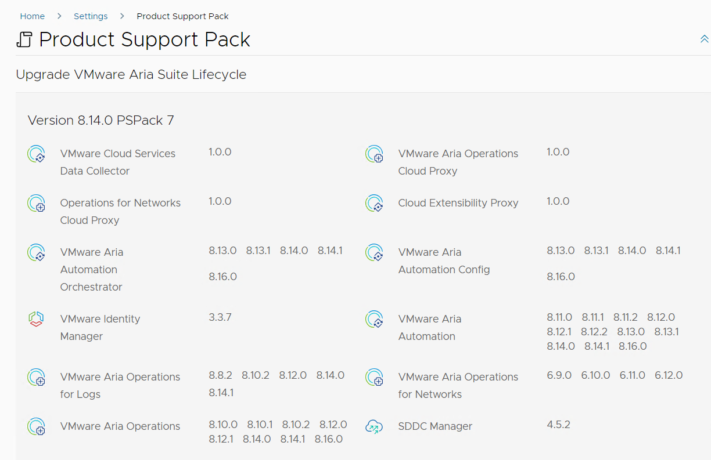

#### [Step 10] **Replacing clustered VMware Identity Manager instance with a one-node installation of Workspace ONE Access 3.3.7**

Also known as: VMware Identity Manager

Estimated upgrade time: 4h

Workspace ONE Access must be declustered so it will be redeployed with version 3.3.7. Please follow [wiDeclusteringVidm WI](wiDeclusteringVidm.md).

- Once VMware Identity Manager is declustered, remove weak SHA1 algorithms and ciphers from VMware Aria Operations. Follow [https://kb.vmware.com/s/article/95835](https://kb.vmware.com/s/article/95835) and then [https://knowledge.broadcom.com/external/article?articleNumber=327325](https://knowledge.broadcom.com/external/article?articleNumber=327325) or run a playbook:

```shell
ansible-playbook removeDeprecatedCiphersForSsh_idm.yml
```

- Perform an [Operational Verification of Clustered Workspace ONE Access](https://docs.vmware.com/en/VMware-Cloud-Foundation/4.5/vcf-operations/GUID-5AAF48BA-8B0B-4066-B785-B36E688E855C.html).
- Repeat the inventory sync.

#### [Step 11a] **VMware Aria Operations for Logs 8.14.1**

Also known as: VMware vRealize Log Insight

Estimated upgrade time: ~2h

Important pre-requsite: It is required to remove weak SHA1 algorithms and ciphers from VMware Aria Operations for Logs because it will not allow to sync. Error can be misleading and pointing to wrong hostname. Follow procedure for `VMware Operations for Logs` from [https://kb.vmware.com/s/article/95835](https://kb.vmware.com/s/article/95835) pointing to [https://kb.vmware.com/s/article/95974](https://kb.vmware.com/s/article/95974) or run a playbook:

```shell
ansible-playbook removeDeprecatedCiphersForSsh_log.yml
```

- Ensure you have a recent successful backup of of the vRealize Log Insight virtual appliances (vli001a, vli001b,vli001c).
- Perform an inventory sync in vRSLCM for the Log Insight environment: go to `Lifecycle Operations` > `Environments` > `vRLI Environment` > `Details` > `...` > `Trigger Inventory Sync`.
- Make sure that auto-upgrade or vRLI agents is enabled: log in to the vRealize Log Insight and navigate to `Administration` > `Management` > `Agents` and check if `Enable auto-update for all agents` option is enabled.

- Go to the `vRSLCM` > `Lifecycle Operations` > `Settings` > `Binary Mapping` and check if the `VMware Aria Operations for Logs 8.14.1` upgrade bundle is available.
  > NOTE: Aria Suite Lifecycle no longer supports downloads from MyVMware
- Download the upgrade bundle manually (file name: `VMware-vRealize-Log-Insight-8.14.1-22806512.pak`) from [here](https://support.broadcom.com/group/ecx/productfiles?subFamily=VMware%20Aria%20Operations%20for%20Logs&displayGroup=VMware%20Aria%20Operations%20for%20Logs&release=8.14.1&os=&servicePk=203000&language=EN)), upload it to the */data* folder on vRSLCM appliance VM using e.g. WinSCP.
  Then go to `Lifecycle Operations` > `Settings` > `Binary Mapping`, click `Add Binaries` and location type:  `Local`. In `Base Location` enter */data*, click `Discover`, select the  bundle and click ADD button. Wait for mapping request to finish, verify the bundle is visible and delete it from */data* folder.
- Go to `Environments` > `vRLI_environment` > `View Details`.
- Click `Upgrade` and follow the upgrade wizard.
- Check if all agents are upgraded to the newest version.
- Repeat the inventory sync.

#### [Step 11b] **Content Pack Marketplace upgrade procedure**

Estimated upgrade time: ~1h

With vRealize Log Insight upgraded to the latest version (8.14.1), we now upgrade the content packs for use with vRLI.

- The Content Pack Marketplace requires a connection from your web browser to the internet. Check your browser's connection settings (proxy settings).
- Follow the steps described in [Upgrade the Content Packs on vRealize Log Insight](https://docs.vmware.com/en/VMware-Validated-Design/6.2/sddc-upgrade/GUID-93BAA0DC-875A-4380-9405-4632764C48AA.html).
- As a result, all Content Packs should be up to date.

  

- Once both vRealize Log Insight and content packs are upgraded, perform an [Operational Verification of vRealize Log Insight](https://docs.vmware.com/en/VMware-Validated-Design/6.2/sddc-operational-verification/GUID-FDA86887-0C01-455B-9E23-C314AC1FB695.html).
- In step [Verify the vRealize Log Insight Agent Status for the Virtual Appliances of the Management Domain](https://docs.vmware.com/en/VMware-Validated-Design/6.2/sddc-operational-verification/GUID-7561C712-B761-454A-B7BE-CD1F02FEB36A.html) to verify syslog data collection status for all appliances of the management domain using Photon OS just sort agents by OS. In VCS there is no `SDDC - Photon OS` agent group.
- In step [Verify the vRealize Log Insight Agent Status for the Workspace ONE Access Appliances](https://docs.vmware.com/en/VMware-Validated-Design/6.2/sddc-operational-verification/GUID-121DE2D2-FA1E-46A7-82E4-CEB1B1AD85EC.html) to verify syslog data collection status for the region-specific Workspace ONE Access appliances just sort agents by Hostname and check status for `<locationCode>idm001.<searchdomain>`. In VCS there is no `SDDC - Linux OS` agent group.
- Skip `Verify the Log Forwarding Status of vRealize Automation` if VCS vRA Cloud is in use.

#### [Step 12a] **VMware Aria Operations 8.14.1**

Also known as: VMware vRealize Operations

Estimated upgrade time: ~2h

- Ensure you have a recent successful backup of the vROps VMs `<locationCode>ops002` and `<locationCode>ops003`.
- Perform the `inventory sync` of the vROPS_environment, exactly the same way as it was done for vRLI.
- Prior to the upgrade, it is recommended to run the Pre-Upgrade Readiness Assessment Tool. Its goal is to analyze the potential impact following the reduction of metrics in various versions of the product, as well as to evaluate the feasibility for upgrade.
In case of an upgrade failure, VMware support may ask whether this validation was performed and ask for the report to be provided to aid in their troubleshooting. A correct version of the tool must be downloaded, i.e. matching the vROps version you plan to upgrade to (8.14.1). Download link [here](https://support.broadcom.com/group/ecx/productfiles?subFamily=VMware%20Aria%20Operations&displayGroup=VMware%20Aria%20Operations&release=8.14.1&os=&servicePk=202992&language=EN) and the release notes [here](https://docs.vmware.com/en/VMware-Aria-Operations/8.14.1/rn/vmware-aria-operations-8141-release-notes/index.html).
- Go to the `vRSLCM` > `Lifecycle Operations` > `Settings` > `Binary Mapping` and check if the `VMware Aria Operations 8.14.1` upgrade bundle is available.
  > NOTE: Aria Suite Lifecycle no longer supports downloads from MyVMware
- Download the upgrade bundle manually (file name: `vRealize_Operations_Manager_With_CP-8.10.x-to-8.14.1.22798982.pak`) from [here](https://support.broadcom.com/group/ecx/productfiles?subFamily=VMware%20Aria%20Operations&displayGroup=VMware%20Aria%20Operations&release=8.14.1&os=&servicePk=202992&language=EN), upload it to the */data* folder on vRSLCM appliance VM using e.g. WinSCP.
- Then go to `Lifecycle Operations` > `Settings` > `Binary Mapping`, click `Add Binaries` and location type:  `Local`. In `Base Location` enter */data*, click `Discover`, select the  bundle and click ADD button. Wait for mapping request to finish, verify the bundle is visible and delete it from */data* folder.
- Go to `Environments` > `vROPS_environment` > `View Details`.
- Click `Upgrade` and follow the upgrade wizard.
- Remove weak SHA1 algorithms and ciphers from VMware Aria Operations. Follow [https://kb.vmware.com/s/article/95835](https://kb.vmware.com/s/article/95835) and then [https://kb.vmware.com/s/article/95967](https://kb.vmware.com/s/article/95967) or run a playbook:

```shell
ansible-playbook removeDeprecatedCiphersForSsh_vrops.yml
```

- Once vRealize Operation Manager is upgraded, perform an [Operational Verification of vRealize Operations Manager](https://docs.vmware.com/en/VMware-Validated-Design/6.2/sddc-operational-verification/GUID-C2B5127D-01A5-4F2B-A6A3-BB39F8C19A2D.html).
- Repeat the inventory sync.
- If the vROPS is upgraded with cloudproxy, then telegraf agents also need to be updated using the link here [wiUpdateTelegrafAgent](wiUpdateTelegrafAgent.md).

#### [Step 12b] **VMware Aria Operations Management Packs upgrade**

After vROPS upgrade, login into the vRealize Operations UI  `https://<locationCode>ops001.<domainName>/ui`, go to `Data Sources\Integrations\Accounts` and validate if the state of the configured integrations is shown as "OK". Upgrade cannot be started while there are any Warnings/Errors. Please fix them before proceeding with the upgrade!\
In `Data Sources\Integrations\Repository` tab, note down the versions of the management packs with configured integrations in `Data Sources\Integrations\Accounts`. The values accumulated before and after the update should then be compared with the values in the table below.

| Management Pack | Installed compatible version | Download |  Notes |
|---|---|---|---|
| vCenter | 8.14.1.22799019 |  | part of VROPS, cannot be updated |
| VMware Cloud on AWS | 8.14.1.22798999 |  | part of VROPS, cannot be updated |
| AWS| 8.14.1.22799014 |  | part of VROPS, cannot be updated |
| Microsoft Azure| 8.14.1.22799002 |  | part of VROPS, cannot be updated |
| vSAN| 8.14.1.22799016 |  | part of VROPS, cannot be updated |
| VMware Aria Operations for Networks | 8.14.1.22799012 |  | part of VROPS, cannot be updated |
| VMware Aria Operations for Logs | 8.14.1.22799020 |  | part of VROPS, cannot be updated |
| VMware Aria Automation | 8.14.1.22798989 |  | part of VROPS, cannot be updated |
| Service Discovery | 8.14.1.22799008 |  | part of VROPS, cannot be updated |
| OS and Application Monitoring | 8.14.1.22799018 |  | part of VROPS, cannot be updated |
| NSX-T| 8.14.1.22799010 |  | part of VROPS, cannot be updated |
| vSphere Replication Adapter | 8.8 | [download](https://support.broadcom.com/group/ecx/productfiles?displayGroup=VMware%20vSphere%20-%20Essentials%20Plus&release=8.0&os=&servicePk=202630&language=EN&groupId=204423) (Drivers & Tools) | The appropriate version must be used taking into account your vSphere Replication version |
| Site Recovery Manager Adapter | 8.8 | [download](https://support.broadcom.com/group/ecx/productfiles?subFamily=VMware%20Site%20Recovery%20Manager&displayGroup=VMware%20Site%20Recovery%20Manager&release=8.8.0.1&os=&servicePk=203090&language=EN) (Drivers & Tools) | The appropriate version must be used taking into account your SRM version |
| VMware Workspace ONE Access | 1.4.1.23179289 | [download](https://marketplace.cloud.vmware.com/services/details/vmware-aria-operations-management-pack-for-vmware-identity-manager-1-4-1-2?slug=true) | The appropriate version must be used taking into account your IDM version |
| SDDC Health Monitoring | 8.12.0.21602246 | [download](https://marketplace.cloud.vmware.com/services/details/vmware-aria-operations-management-pack-for-sddc-health-monitoring-8-12-1?slug=true) | The appropriate version must be used taking into account your SDDC Manager version |
| Management Pack for Storage Devices | 8.12.0.21592050 | [download](https://marketplace.cloud.vmware.com/services/details/vmware-aria-operations-management-pack-for-storage-devices-8-12-1?slug=true) | |
| VMware Aria Operations Management Pack for Dell EMC Unity | 4.2.0.20230330.202425 | [download](https://customerconnect.vmware.com/downloads/details?downloadGroup=MP-DELL-EMC-UNITY-420&productId=1049&rPId=111476) | |

For other managament pack compatibility please check [here](https://interopmatrix.vmware.com/Interoperability).

Any inconsistency between the current and the expected state should be resolved by installation the latest compatible Management Pack's version according to the example.

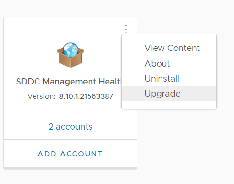

Management Pack's binaries are accessible from [VMware Marketplace](https://marketplace.cloud.vmware.com/) or from [Broadcom Support Portal](https://support.broadcom.com/group/ecx/downloads) as .pak files. After clicking the upgrade button in the `Data Sources\Integrations\Repository` location, follow the Software Update wizard to complete the upgrade process (pak files must be downloaded manually).

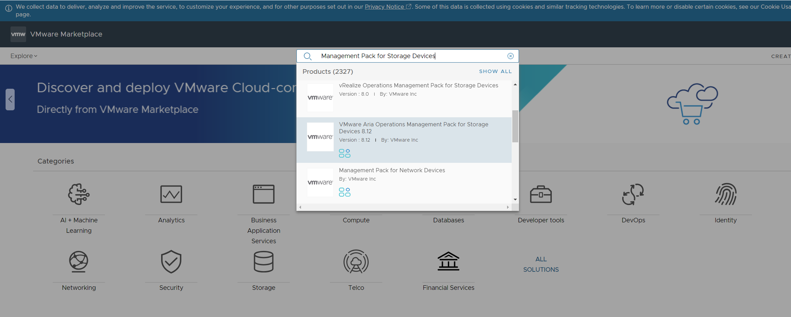

After vROPS upgrade, login into the VMware Aria Operations UI `https://<locationCode>ops001.<domainName>/ui`, go to `Data Sources\Integrations\Accounts` and validate if the state of the configured integrations is shown as "OK". Please fix any noticed Warnings/Errors.
> NOTE: Log insight adapter in VROPS now requires credentials

#### [Step 13] **VMware Aria Operations for Networks 6.11.0**

Also known as: VMware vRealize Network Insight

Estimated upgrade time: ~3h

Important pre-requsite: It is required to remove weak SHA1 algorithms and ciphers from VMware Aria Operations for Networks because it will not allow to sync. Error can be misleading and pointing to wrong console password. Follow procedure for `VMware Operations for Networks` from [https://kb.vmware.com/s/article/95835](https://kb.vmware.com/s/article/95835) or run a playbook:

```shell
ansible-playbook removeDeprecatedCiphersForSsh_vni.yml
```

- Ensure you have a recent successful backup of the vRNI VMs `<locationCode>vni001` and `<locationCode>vnc001`.
- Perform inventory sync.
- Go to the `vRSLCM` > `Lifecycle Operations` > `Settings` > `Binary Mapping` and check if the `VMware Aria Operations for Networks 6.11.0` upgrade bundle is available.
  > NOTE: Aria Suite Lifecycle no longer supports downloads from MyVMware
- Download the upgrade bundle manually from [here](https://support.broadcom.com/group/ecx/productfiles?subFamily=VMware%20Aria%20Operations%20for%20Networks&displayGroup=VMware%20Aria%20Operations%20for%20Networks&release=6.11.0&os=&servicePk=202994&language=EN) (file name: `VMware-Aria-Operations-for-Networks.6.11.0.1692527086.upgrade.bundle`), upload it to the */data* folder on vRSLCM appliance VM using e.g. WinSCP.
  Then go to `Lifecycle Operations` > `Settings` > `Binary Mapping`, click `Add Binaries` and location type:  `Local`. In `Base Location` enter */data*, click `Discover`, select the  bundle and click ADD button. Wait for mapping request to finish, verify the bundle is visible and delete it from */data* folder (Important note: if Network Insigh will be upgraded manually then patch must be additionally done).
- Go to `Environments` > `vRNI` > `View Details`.
- Click `Upgrade` and follow the upgrade wizard and if precheck will fail with free space alert please [https://kb.vmware.com/s/article/8897](https://kb.vmware.com/s/article/8897) or [https://kb.vmware.com/s/article/88977](https://kb.vmware.com/s/article/88977).
- If during update you will see `Error Code: LCMVRNICONFIG90095` when `Check upgrade status` is being done then please do [https://kb.vmware.com/s/article/95835](https://kb.vmware.com/s/article/95835) one more time or run a playbook `ansible-playbook removeDeprecatedCiphersForSsh_vni.yml`. It seems that during upgrade sshd_conf is being replaced with a wrong one.
  > Note : Check upgrade status on VNI GUI. If upgrade status is successful in GUI, remove the SHA1 ciphers - don't have to wait for the error in LCM

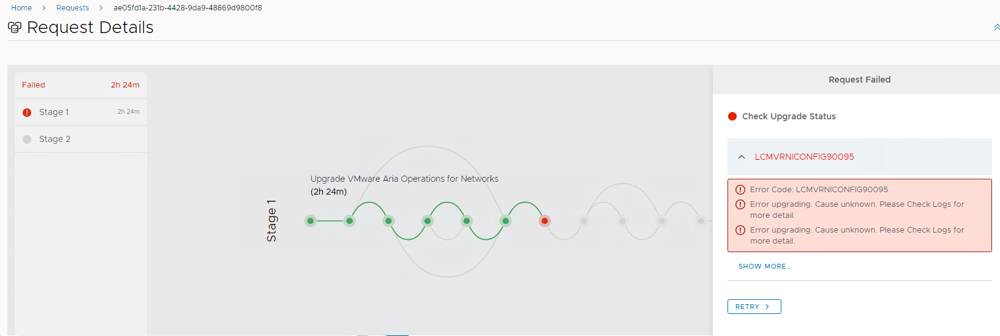

- Once done, restart both vms in order:

  ```yaml
  <locationCode>vnc001
  <locationCode>vni001
  ```

- Once vRealize Network Insight is upgraded, log in to vRNI web interface (vni001 appliance VM) and verify that it is up and running.
- Delete upgrade bundle file from vRealize Suite Lifecycle Manager */data/* folder on `<locationCode>lcm001` (only when manual upload was performed).
- Repeat inventory sync.

> Note: there is a possibility that after the upgrade of vRealize Log Insight and/or vRealize Network Insight appliances, the Network Insight will be visible as `localhost` on the list of agents inside Log
  Insight. To fix that, execute the following playbook on *ans001* server from */opt/dhc/update* folder:

  ```yaml
  ansible-playbook configureVniLiAgent.yml
  ```

Validate the state by going to `Aria Operations for Logs` > `Management` > `Agents` and checking if `vni001` host is visible correctly and showing as active.

#### [Step 14] **VMware Aria Automation 8.16.0**

Also known as: VMware vRealize Automation

Estimated upgrade time: ~3h

Important note: Since version 8.12 assigned ammount of RAM must be increased from 42 GB to 48 GB for each `vra` VM.

If vRA-on-prem has been deployed in the environment, please perform below steps to upgrade the vRA infrastructure:

- Ensure you have a recent successful backup of the vRA VMs `<locationCode>vra002`, `<locationCode>vra003` and `<locationCode>vra004`.
- Perform inventory sync.
- Go to the `vRSLCM` > `Lifecycle Operations` > `Settings` > `Binary Mapping` and check if the `VMware Aria Automation 8.16.0` upgrade bundle is available.
  > NOTE: Aria Suite Lifecycle no longer supports downloads from MyVMware
- Download the upgrade bundle manually from [here](https://support.broadcom.com/group/ecx/productfiles?subFamily=VMware%20Aria%20Automation&displayGroup=VMware%20Aria%20Automation&release=8.16.0&os=&servicePk=202734&language=EN) (file name: `Prelude_VA-8.16.0.33697-23103949-updaterepo.iso`), upload it to the */data* folder on vRSLCM appliance VM using e.g. WinSCP.
  Then go to `Lifecycle Operations` > `Settings` > `Binary Mapping`, click `Add Binaries` and location type:  `Local`. In `Base Location` enter */data*, click `Discover`, select the  bundle and click ADD button. Wait for mapping request to finish, verify the bundle is visible and delete it from */data* folder.
- Go to `Environments` > `<locationCode>vra001` > `View Details`.
- Click `Upgrade` and follow the upgrade wizard.
  > NOTE: If upgrade fails at validation stage in LCM : Check upgrade status on VRA002 in :  `/var/log/vmware/prelude/upgrade-report-latest`.
  > If all nodes show status The node is upgraded successfully run `vracli upgrade exec –resume` on master (VRA002).[vrealize-automation-upgrade-fails](https://knowledge.broadcom.com/external/article/314785/vrealize-automation-upgrade-fails-due-to.html)
- Remove weak SHA1 algorithms and ciphers from VMware Aria automation. Follow [https://kb.vmware.com/s/article/95835](https://kb.vmware.com/s/article/95835) or run a playbook:

```shell
ansible-playbook removeDeprecatedCiphersForSsh_vra.yml
```

- Once vRealize Automation is upgraded, perform an [Operational Verification of vRealize Automation](https://docs.vmware.com/en/VMware-Validated-Design/6.2/sddc-operational-verification/GUID-11A28FC8-3B7E-4C84-8CDC-1DDE4C5A6E52.html).
- Repeat the inventory sync.

Once vRA is upgraded to 8.16 , Infoblox plugin must also be updgraded from 1.4 to 1.5.1 . For instructions how to do it please follow : <https://docs.vmware.com/en/vRealize-Automation/8.11/Using-and-Managing-Cloud-Assembly/GUID-5EA6CE96-122C-45C0-A753-353D4BB8735E.html>
Download from: <https://marketplace.cloud.vmware.com/services/details/aria-automation-infoblox-plugin-1-5-1-2?slug=true>

#### [Step 15] **VMware Site Recovery Manager 8.8**

Please follow [Site Recovery Manager and vSphere Replication version 8.8 upgrade WI](wiSrmVsrUpgradeTo8.8.md) use version 8.8.0 from [here](https://support.broadcom.com/group/ecx/productfiles?subFamily=VMware%20Site%20Recovery%20Manager&displayGroup=VMware%20Site%20Recovery%20Manager&release=8.8.0.3&os=&servicePk=203091&language=EN) and adapters from [here](https://support.broadcom.com/group/ecx/productfiles?subFamily=VMware%20Site%20Recovery%20Manager&displayGroup=VMware%20Site%20Recovery%20Manager&release=8.8.0.3&os=&servicePk=203091&language=EN) (`Drivers & Tools` section).

### **Virtual Infrastructure Layer in Management Domain**

Next step is to upgrade the virtual infrastructure layer in Management Domain:

- NSX-T Data Center:
  - NSX-T Edge cluster
  - NSX-T Host cluster
  - NSX-T Manager cluster
- vCenter Server
- ESXi hosts

> Note: All NSX-T components (Edge cluster, Host cluster and Manager cluster) are upgraded by a single bundle.

Verify that you have recent backups of the NSX-T Manager nodes and the vCenter Server virtual machines.

#### [Step 16] **VMware NSX-T Data Center 3.2.3.1**

- Ensure you have a recent successful backup of NSX-T Manager and Edge nodes.
- Go to `Inventory` > `Workload Domains` > `<locationCode>-m01` management domain > `Updates/Patches`.
- Execute the upgrade pre-check before every upgrade bundle installation. Ensure that the pre-check results are green before proceeding.
- Expand the `Available updates` and from the `Select Cloud Foundation version` drop-down menu, select `Cloud Foundation 4.5.2.0`.

  This upgrade bundle should be visible:

  ```yaml
  - VMware Cloud Foundation Update 4.5.2.0
  Released: Aug 17, 2023
  Size: 9 GB
  Version: 4.17.10-186732
  Description: This VMware Software Upgrade bundle contains NSX-T Data Center 3.2.3.1 For more information, see https://docs.vmware.com/en/VMware-NSX/3.2.3.1/rn/vmware-nsxt-data-center-3231-release-notes/index.html
  Bundle ID: 259b722b-f8b5-4b4c-9e71-4ebe135cd38e
  Update to Version: 3.2.3.1.0-22104592
  Description: NSX_T_MANAGER Update Bundle

  ETA: 3h
  ```

- Download the bundle and click `Update Now` or `Schedule Update` depending on your schedule/timeline and follow the upgrade steps described here: [Upgrade NSX-T Data Center](https://docs.vmware.com/en/VMware-Cloud-Foundation/4.5/vcf-lifecycle/GUID-E101AFB5-1034-4CF9-B96E-A2E70DCF02F5.html#GUID-2D0DF7AF-4FE6-4A8C-AC2E-275E7F23FEBA__GUID-826A028E-7134-4B4F-AB42-1AD518D677D6).
- In case of having multiple Edge and/or Host cluster, it's possible to upgrade them sequentially, instead of in parallel (which is the default behavior). To enable sequential upgrade, select the relevant options:

The downside to doing it sequentially is the prolonged upgrade time, but on the other hand, it gives you better control over the upgrade process. Of course, in case of having only a single Edge and/or Host cluster, this is irrelevant.
- Once NSX-T Data Center is upgraded, perform an [Operational Verification of VMware NSX-T Data Center](https://docs.vmware.com/en/VMware-Cloud-Foundation/4.5/vcf-operations/GUID-7567A790-4CAA-438C-9E8B-00B5319FC42E.html).

#### [Step 17] **VMWare vCenter Server Appliance 7.0 Update 3m**

- Ensure you have a recent successful backup of all the vCenter Server Appliances sharing the same SSO domain.
- If possible, create offline (with both VC VMs powered down) snapshots of both vCenter VMs at the same time. This is to ensure a consistent state of both servers (especially regarding the replication between them) in case a need arises to revert the state.
- If possible, redo the [Upgrade Prerequisites](#upgrade-prerequisites) no. 3 (replication check), 5 (lsdoctor check) and 6 (VC status check after the last upgrade, if applicable).
- Go to `Inventory` > `Workload Domains` > `(customerCode)-(locationCode)-m01` management domain > `Updates/Patches`.
- Execute the upgrade pre-check before every upgrade bundle installation. Ensure that the pre-check results are green before proceeding.
- Expand the `Available updates` and from the `Select Cloud Foundation version` drop-down menu, select `Cloud Foundation 4.5.2.0`.
  This upgrade bundle should be visible:

  ```yaml
  - VMware Cloud Foundation Update 4.5.2.0
  Released: Aug 17, 2023
  Size: 7 GB
  Version: 4.17.12-180563
  Description: This VMware Software Upgrade bundle contains vCenter Server 7.0 Update 3m. Customers should NOT run vCenter upgrades in parallel as it is not-supported for vCenters running in ELM mode. For more information, see https://docs.vmware.com/en/VMware-vSphere/7.0/rn/vsphere-vcenter-server-70u3m-release-notes/index.html
  Bundle ID: 4ac2b679-5e5b-43a6-b74b-5fd4e3c978c0
  Update to Version: 7.0.3.01500-21784236
  Description: VMware vCenter Server Update Bundle

  ETA: 2h
  ```

- Click `Update Now` or `Schedule Update` depending on your schedule/timeline and follow the upgrade steps described here: [Upgrade vCenter Server](https://docs.vmware.com/en/VMware-Cloud-Foundation/4.5/vcf-lifecycle/GUID-E101AFB5-1034-4CF9-B96E-A2E70DCF02F5.html).
- Once vCenter is upgraded, perform an [Operational Verification of vSphere](https://docs.vmware.com/en/VMware-Cloud-Foundation/4.5/vcf-operations/GUID-D8629B82-9BEB-4E2D-ABB6-D50E9657D58B.html), including the verification of the possibility to [access vCenter using an Active Directory account](https://docs.vmware.com/en/VMware-Validated-Design/6.2/sddc-operational-verification/GUID-30685840-25EA-4A0E-A1DA-5F69D4E458DA.html).
- After the vCenter upgrade, please repeat the [Upgrade Prerequisites](#upgrade-prerequisites) no. 3, 5 and 6.

#### [Step 18] **VMware ESXi 7.0 Update 3n**

> **If there is a need to add custom drivers during the ESXi upgrade process, please follow the steps described in chapter `Upgrade ESXi with VMware Cloud Foundation Stock ISO and Async NIC Driver` in [dhcDellEsxiUpgradeWithCustomImages.md](dhcDellEsxiUpgradeWithCustomImages.md) document, however the process was not tested for VCS 1.8.2**

- Go to `Inventory` > `Workload Domains` > `(customerCode)-(locationCode)-m01` management domain > `Updates/Patches`.
- Execute the upgrade pre-check before every upgrade bundle installation. Ensure that the pre-check results are green before proceeding.
- Expand the `Available updates` and from the `Select Cloud Foundation version` drop-down menu, select `Cloud Foundation 4.5.2.0`.
  This upgrade bundle should be visible:

  ```yaml
  - VMware Cloud Foundation Update 4.5.2.0
  Released: Aug 17, 2023
  Size: 401 MB
  Version: 4.17.24-183027
  This VMware Software Upgrade bundle contains VMware ESXi 7.0 Update 3n. For more information, see https://docs.vmware.com/en/VMware-vSphere/7.0/rn/vsphere-esxi-70u3n-release-notes.html.
  Bundle ID: b9462fde-a7d0-4965-b217-cd09bd21bcc5
  Update to Version: 7.0.3-21930508
  Description: VMware ESXi Server Update Bundle

  ETA: 2h10min
  ```

- Click `Update Now` or `Schedule Update` depending on your schedule/timeline and follow the upgrade steps described here: [Upgrade ESXi](https://docs.vmware.com/en/VMware-Cloud-Foundation/4.5/vcf-lifecycle/GUID-E101AFB5-1034-4CF9-B96E-A2E70DCF02F5.html) (Important note: Upgrade the vSAN Disk Format for vSAN clusters if required).
- Once ESXi hosts are upgraded, perform an [Operational Verification of vSphere](https://docs.vmware.com/en/VMware-Cloud-Foundation/4.5/vcf-operations/GUID-D8629B82-9BEB-4E2D-ABB6-D50E9657D58B.html).

##### **vSAN Witness Hosts**

In case of vSAN stretched clusters, vSphere Lifecycle Manager (vLCM) depot must be used to upgrade vSAN Witness Host. Please follow steps described in [Upgrade vSAN Witness Host](https://docs.vmware.com/en/VMware-Cloud-Foundation/4.5/vcf-lifecycle/GUID-E101AFB5-1034-4CF9-B96E-A2E70DCF02F5.html) documentation.
Here's the [VCF 4.5.2 Release Notes](https://docs.vmware.com/en/VMware-Cloud-Foundation/4.5.2/rn/vmware-cloud-foundation-452-release-notes/index.html) link, with the Bill of Materials listing the correct version of VSAN Witness Appliance to upgrade to.

### Post-checks

To confirm the Management domain is fully upgraded to ver. 4.5.2.0, log in to SDDC Manager and go to `Lifecycle Management` > `Release Versions`. Management domain should be visible in `Available Cloud Foundation`, version 4.5.2.0.

### **Virtual Infrastructure Layer in Workload Domain**

Once the upgrade of management domain is finished, the next step is to upgrade the Virtual Infrastructure in Workload Domain.

- NSX-T Data Center:
  - NSX-T Edge cluster
  - NSX-T Host cluster
  - NSX-T Manager cluster
- vCenter Server
- ESXi hosts

> Note: All NSX-T components (Edge cluster, Host cluster and Manager cluster) are upgraded by a single bundle.

Verify that you have recent backups of the NSX-T Manager nodes and the vCenter Server virtual machines.

#### [Step 19] **VMware NSX-T Data Center 3.2.3.1**

- Go to `Inventory` > `Workload Domains` > `(customerCode)-(locationCode)-c01` compute domain > `Updates/Patches`.
- Execute the upgrade pre-check before every upgrade bundle installation. Ensure that the pre-check results are green before proceeding. A failed pre-check may cause the update to fail.
- Expand the `Available updates` and from the `Select Cloud Foundation version` drop-down menu, select `Cloud Foundation 4.5.2.0`.
  This upgrade bundle should be visible:

  ```yaml
  - VMware Cloud Foundation Update 4.5.2.0
  Released: Aug 17, 2023
  Size: 9 GB
  Version: 4.17.10-186732
  Description: This VMware Software Upgrade bundle contains NSX-T Data Center 3.2.3.1 For more information, see https://docs.vmware.com/en/VMware-NSX/3.2.3.1/rn/vmware-nsxt-data-center-3231-release-notes/index.html
  Bundle ID: 259b722b-f8b5-4b4c-9e71-4ebe135cd38e
  Update to Version: 3.2.3.1.0-22104592
  Description: NSX_T_MANAGER Update Bundle

  ETA: 2h
  ```

- Click `Update Now` or `Schedule Update` depending on your schedule/timeline and follow the upgrade steps described here: [Upgrade NSX-T Data Center](https://docs.vmware.com/en/VMware-Cloud-Foundation/4.5/vcf-lifecycle/GUID-3B41CF79-C721-4AFC-A263-0672143DF41E.html#GUID-2D0DF7AF-4FE6-4A8C-AC2E-275E7F23FEBA__GUID-826A028E-7134-4B4F-AB42-1AD518D677D6).
- In case of having multiple Edge and/or Host cluster, it's possible to upgrade them sequentially, instead of in parallel (which is the default behavior). To enable sequential upgrade, select the relevant options:

The downside to doing it sequentially is the prolonged upgrade time, but on the other hand, it gives you better control over the upgrade process. Of course, in case of having only a single Edge and/or Host cluster, this is irrelevant.
- Once NSX-T Data Center is upgraded, perform an [Operational Verification of VMware NSX-T Data Center](https://docs.vmware.com/en/VMware-Cloud-Foundation/4.5/vcf-operations/GUID-7567A790-4CAA-438C-9E8B-00B5319FC42E.html).

#### [Step 20] **VMWare vCenter Server Appliance 7.0 Update 3m**

> In case VMware Async Patch Tool was used to patch vCenter, the update might be skipped if the target version is already in place.

- Ensure you have a recent successful backup of all the vCenter appliances sharing the same SSO domain.
- If possible, create offline (with both VC VMs powered down) snapshots of both vCenter VMs at the same time. This is to ensure a consistent state of both servers (especially regarding the replication between them) in case a need arises to revert the state.
- If possible, redo the [Upgrade Prerequisites](#upgrade-prerequisites) no. 3 (replication check), 5 (lsdoctor check) and 6 (VC status check after the last upgrade, if applicable).
- Go to `Inventory` > `Workload Domains` > `(customerCode)-(locationCode)-c01` compute domain > `Updates/Patches`.
- Execute the upgrade pre-check before every upgrade bundle installation. Ensure that the pre-check results are green before proceeding.
- Expand the `Available updates` and from the `Select Cloud Foundation version` drop-down menu, select `Cloud Foundation 4.5.2.0.
  This upgrade bundle should be visible:

  ```yaml
  - VMware Cloud Foundation Update 4.5.2.0
  Released: Aug 17, 2023
  Size: 7 GB
  Version: 4.17.12-180563
  Description: This VMware Software Upgrade bundle contains vCenter Server 7.0 Update 3m. Customers should NOT run vCenter upgrades in parallel as it is not-supported for vCenters running in ELM mode. For more information, see https://docs.vmware.com/en/VMware-vSphere/7.0/rn/vsphere-vcenter-server-70u3m-release-notes/index.html
  Bundle ID: 4ac2b679-5e5b-43a6-b74b-5fd4e3c978c0
  Update to Version: 7.0.3.01500-21784236
  Description: VMware vCenter Server Update Bundle

  ETA: 2h
  ```

- Click `Update Now` or `Schedule Update` depending on your schedule/timeline and follow the upgrade steps described here: [Upgrade vCenter Server](https://docs.vmware.com/en/VMware-Cloud-Foundation/4.5/vcf-lifecycle/GUID-3B41CF79-C721-4AFC-A263-0672143DF41E.html#GUID-F9E0A7C2-6C68-45B9-939A-C0D0114C3516__GUID-13BC04AD-A851-46DD-9DBB-114F609B1551).
- Once vCenter is upgraded, perform an [Operational Verification of vSphere](https://docs.vmware.com/en/VMware-Cloud-Foundation/4.5/vcf-operations/GUID-D8629B82-9BEB-4E2D-ABB6-D50E9657D58B.html), including the verification of the possibility to [access vCenter using an Active Directory account](https://docs.vmware.com/en/VMware-Cloud-Foundation/services/vcf-identity-and-access-management-v1/GUID-B8923E4A-5ED9-4996-B530-5BA31969B65F.html).
- After the vCenter upgrade, please repeat the [Upgrade Prerequisites](#upgrade-prerequisites) no. 3, 5 and 6.

#### [Step 21] **VMware ESXi 7.0 Update 3n**

> **If there is a need to add custom drivers during the ESXi upgrade process, please follow the steps described in chapter `Upgrade ESXi with VMware Cloud Foundation Stock ISO and Async NIC Driver` in [dhcDellEsxiUpgradeWithCustomImages.md](dhcDellEsxiUpgradeWithCustomImages.md) document, however the process was not tested for VCS 1.8*

- Go to `Inventory` > `Workload Domains` > `(customerCode)-(locationCode)-c01` compute domain > `Updates/Patches`.
- Execute the upgrade pre-check before every upgrade bundle installation. Ensure that the pre-check results are green before proceeding.
- Expand the `Available updates` and from the `Select Cloud Foundation version` drop-down menu, select `Cloud Foundation 4.5.2.0`.
  This upgrade bundle should be visible:

  ```yaml
  - VMware Cloud Foundation Update 4.5.2.0
  Released: Aug 17, 2023
  Size: 401 MB
  Version: 4.17.24-183027
  This VMware Software Upgrade bundle contains VMware ESXi 7.0 Update 3n. For more information, see https://docs.vmware.com/en/VMware-vSphere/7.0/rn/vsphere-esxi-70u3n-release-notes.html.
  Bundle ID: b9462fde-a7d0-4965-b217-cd09bd21bcc5
  Update to Version: 7.0.3-21930508
  Description: VMware ESXi Server Update Bundle

  ETA: 35min
  ```

- Click `Update Now` or `Schedule Update` depending on your schedule/timeline and follow the upgrade steps described here: [Upgrade ESXi](https://docs.vmware.com/en/VMware-Cloud-Foundation/4.5/vcf-lifecycle/GUID-3B41CF79-C721-4AFC-A263-0672143DF41E.html) (Important note: Upgrade the vSAN Disk Format for vSAN clusters if required).
- Once ESXi hosts are upgraded, perform an [Operational Verification of vSphere](https://docs.vmware.com/en/VMware-Cloud-Foundation/4.5/vcf-operations/GUID-D8629B82-9BEB-4E2D-ABB6-D50E9657D58B.html).

#### **vSAN Witness Hosts**

In case of vSAN stretched clusters, vSphere Lifecycle Manager (vLCM) depot must be used to upgrade vSAN Witness Host. Please follow steps described in [Upgrade vSAN Witness Host](https://docs.vmware.com/en/VMware-Cloud-Foundation/4.5/vcf-lifecycle/GUID-E101AFB5-1034-4CF9-B96E-A2E70DCF02F5.html) section of documentation.
Here's the [VCF 4.5.2 Release Notes](https://docs.vmware.com/en/VMware-Cloud-Foundation/4.5.2/rn/vmware-cloud-foundation-452-release-notes/index.html) link, with the Bill of Materials listing the correct version of VSAN Witness Appliance to upgrade to.

### Post-checks

To confirm the compute domain is fully upgraded to ver. 4.5.2.0, log in to SDDC Manager and go to `Lifecycle Management` > `Release Versions`. Compute domain should be visible in `Available Cloud Foundation`, version 4.5.2.0.

### **VMware ESXi 7.0 Update 3p through Async Patch Tool**

#### [Step 22] **Management domain**

> **If there is a need to add custom drivers during the ESXi upgrade process, please follow the steps described in chapter `Upgrade ESXi with VMware Cloud Foundation Stock ISO and Async NIC Driver` in [dhcDellEsxiUpgradeWithCustomImages.md](dhcDellEsxiUpgradeWithCustomImages.md) document, however the process was not tested for VCS 1.8*.

- Use `Async Patch Tool` to add ESXi 7.0 Update 3p (7.0.3-23307199) to SDDC Manager. Process is described [here](dhcAsyncPatchTool.md).
- Go to `Inventory` > `Workload Domains` > `(customerCode)-(locationCode)-m01` management domain > `Updates/Patches`.
- Execute the upgrade pre-check before every upgrade bundle installation. Ensure that the pre-check results are green before proceeding.
- In `Available updates` new upgrade bundle should be visible:

  ```yaml
  - VMware Cloud Foundation Update 4.5.2.0
  Released: Mar 5, 2024
  Size: 405 MB
  Version: 1.1.1-000001
  This VMware Software Upgrade bundle contains VMware ESXi 7.0 Update 3p. For more information, see https://docs.vmware.com/en/VMware-vSphere/7.0/rn/vsphere-esxi-70u3p-release-notes/index.html.
  Bundle ID: 31c03cc0-3f16-48ea-9264-b3ff8284bedb-apTool
  Update to Version: 7.0.3-23307199
  Description: ESX_HOST

  ETA: 35min
  ```

- Click `Update Now` or `Schedule Update` depending on your schedule/timeline and follow the upgrade steps described here: [Upgrade ESXi](https://docs.vmware.com/en/VMware-Cloud-Foundation/4.5/vcf-lifecycle/GUID-3B41CF79-C721-4AFC-A263-0672143DF41E.html) (Important note: Upgrade the vSAN Disk Format for vSAN clusters if required).
- Once ESXi hosts are upgraded, perform an [Operational Verification of vSphere](https://docs.vmware.com/en/VMware-Cloud-Foundation/4.5/vcf-operations/GUID-D8629B82-9BEB-4E2D-ABB6-D50E9657D58B.html).

##### **vSAN Witness Hosts**

In case of vSAN stretched clusters, vSphere Lifecycle Manager (vLCM) depot must be used to upgrade vSAN Witness Host. Please follow steps described in [Upgrade vSAN Witness Host](https://docs.vmware.com/en/VMware-Cloud-Foundation/4.5/vcf-lifecycle/GUID-E101AFB5-1034-4CF9-B96E-A2E70DCF02F5.html) documentation.

#### [Step 23] **Workload domain**

> **If there is a need to add custom drivers during the ESXi upgrade process, please follow the steps described in chapter `Upgrade ESXi with VMware Cloud Foundation Stock ISO and Async NIC Driver` in [dhcDellEsxiUpgradeWithCustomImages.md](dhcDellEsxiUpgradeWithCustomImages.md) document, however the process was not tested for VCS 1.8*.

- Use `Async Patch Tool` to add ESXi 7.0 Update 3p (7.0.3-23307199) to SDDC Manager. Process is described [here](dhcAsyncPatchTool.md).
- Go to `Inventory` > `Workload Domains` > `(customerCode)-(locationCode)-c01` compute domain > `Updates/Patches`.
- Execute the upgrade pre-check before every upgrade bundle installation. Ensure that the pre-check results are green before proceeding.
- In `Available updates` new upgrade bundle should be visible:

  ```yaml
  - VMware Cloud Foundation Update 4.5.2.0
  Released: Mar 5, 2024
  Size: 405 MB
  Version: 1.1.1-000001
  This VMware Software Upgrade bundle contains VMware ESXi 7.0 Update 3p. For more information, see https://docs.vmware.com/en/VMware-vSphere/7.0/rn/vsphere-esxi-70u3p-release-notes/index.html.
  Bundle ID: 31c03cc0-3f16-48ea-9264-b3ff8284bedb-apTool
  Update to Version: 7.0.3-23307199
  Description: ESX_HOST

  ETA: 35min
  ```

- Click `Update Now` or `Schedule Update` depending on your schedule/timeline and follow the upgrade steps described here: [Upgrade ESXi](https://docs.vmware.com/en/VMware-Cloud-Foundation/4.5/vcf-lifecycle/GUID-3B41CF79-C721-4AFC-A263-0672143DF41E.html) (Important note: Upgrade the vSAN Disk Format for vSAN clusters if required).
- Once ESXi hosts are upgraded, perform an [Operational Verification of vSphere](https://docs.vmware.com/en/VMware-Cloud-Foundation/4.5/vcf-operations/GUID-D8629B82-9BEB-4E2D-ABB6-D50E9657D58B.html).

##### **vSAN Witness Hosts**

In case of vSAN stretched clusters, vSphere Lifecycle Manager (vLCM) depot must be used to upgrade vSAN Witness Host. Please follow steps described in [Upgrade vSAN Witness Host](https://docs.vmware.com/en/VMware-Cloud-Foundation/4.5/vcf-lifecycle/GUID-E101AFB5-1034-4CF9-B96E-A2E70DCF02F5.html) documentation.

## Compliance Overview
  
Please check the [Compliance Overview](wiComplianceOverview.md) document for any post-LCM actions and remediation that need to be  implemented,  log4j vulnerability being an example.

## Known issues

Most of experienced issues were described in coresponding sections. Additional known problems information below.

1. [LCM service crashing on SDDC Manager](https://kb.vmware.com/s/article/95536) - SDDC Manager bundle download problem, retrieving bundles failed, retrieving update patches failed.

2. Post upgrade SDDC manager showed disconnected status for VRLI,VROPS and VRSLCM accounts (under Password management). The passwords were valid and accounts were not locked. If this happens please Check /var/log/vmware/vcf/operationsmanager/operationsmanager.log on SDM001 for this type of error: "com.jcraft.jsch.JSchException: reject HostKey: gre72lcm001.nx7dhc01.next"
<https://www.dmware.nl/2024/04/sddc-manager-has-disconnected-vrli-vrops-and-vrslcm-accounts>/<br>
We fixed this by adding the `ecdsa-sha2-nistp256` keys for all accounts. Once for IP address, once for FQDN to 3 files on SDM001 : /etc/vmware/vcf/commonsvcs/known_hosts, /root/.ssh/known_hosts, /home/vcf/.ssh/known_hosts.
This can be done from SDM001 by running the commands like in this example:<br>
ssh-keyscan -4 -t ecdsa-sha2-nistp256 gre72vli001c.nx7dhc01.next >> /etc/vmware/vcf/commonsvcs/known_hosts<br>
ssh-keyscan -4 -t ecdsa-sha2-nistp256 172.22.124.31 >> /etc/vmware/vcf/commonsvcs/known_hosts<br>
ssh-keyscan -4 -t ecdsa-sha2-nistp256 gre72vli001c.nx7dhc01.next >> /root/.ssh/known_hosts<br>
ssh-keyscan -4 -t ecdsa-sha2-nistp256 172.22.124.31 >> /root/.ssh/known_hosts<br>
ssh-keyscan -4 -t ecdsa-sha2-nistp256 gre72vli001c.nx7dhc01.next >> /home/vcf/.ssh/known_hosts<br>
ssh-keyscan -4 -t ecdsa-sha2-nistp256 172.22.124.31 >> /home/vcf/.ssh/known_hosts<br>
<https://knowledge.broadcom.com/external/article/314627/sddc-manager-knownhosts-files-contain-mu.html><br>

>Furthermore, please follow chapters `Known issues` in previous VCS version documentation.
