# VCF Upgrade to 5.1.0

## Table of Contents

- [VCF Upgrade to 5.1.0](#vcf-upgrade-to-510)
  - [Table of Contents](#table-of-contents)
  - [Changelog](#changelog)
  - [Introduction](#introduction)
    - [Purpose](#purpose)
    - [Audience](#audience)
    - [Scope](#scope)
    - [Related Documents](#related-documents)
  - [Preliminary information](#preliminary-information)
  - [Prerequisites](#prerequisites)
    - [Upgrade Prerequisites](#upgrade-prerequisites)
    - [Power off Avamar proxies](#power-off-avamar-proxies)
    - [Check/Configure Proxy](#checkconfigure-proxy)
  - [Upgrade procedure](#upgrade-procedure)
    - [Upgrade SDDC Manager](#upgrade-sddc-manager)
    - [Apply VMware Cloud Foundation Configuration Updates](#apply-vmware-cloud-foundation-configuration-updates)
    - [Virtual Infrastructure Layer in Management Domain](#virtual-infrastructure-layer-in-management-domain)
      - [NSX-T Data Center](#nsx-t-data-center)
      - [vCenter Server](#vcenter-server)
      - [ESXi hosts](#esxi-hosts)
        - [vSAN Witness Hosts](#vsan-witness-hosts)
    - [Post-checks](#post-checks)
    - [Virtual Infrastructure Layer in Workload Domain](#virtual-infrastructure-layer-in-workload-domain)
      - [NSX-T Data Center](#nsx-t-data-center-1)
      - [vCenter Server](#vcenter-server-1)
      - [ESXi hosts](#esxi-hosts-1)
      - [vSAN Witness Hosts](#vsan-witness-hosts-1)
    - [Post-checks](#post-checks-1)
    - [Re-enable the compatibility checks in SDDC Manager](#re-enable-the-compatibility-checks-in-sddc-manager)
  - [Compliance Overview](#compliance-overview)
  - [Known issues](#known-issues)

## Changelog
  
| Date       | Issue    | Author          | TOS  | Description |
| ---------- | -------- | --------------- | ---- | ------------------------- |
| 13/08/2024 | VCS-13642 | Mariusz Stanek   |      | Initial version creation  |

## Introduction

### Purpose

The purpose of this document is to describe the steps that should be performed in order to upgrade VCF from version 4.5.2 (VCS 1.9.1) to 5.1.0 (VCS 2.0).

Both domains - the Management Domain (MGT) and the Workload Domain (VI WD) - are upgraded separately.  

### Audience

1. VCS Engineers,
2. VCS Operations,
3. VCS Architects.

### Scope

The scope of this document covers the following:

1. Upgrade of SDDC management components (MGT domain):
    - SDDC Manager
    - NSX-T Data Center
    - vCenter Server
    - ESXi hosts
2. Upgrade of Workload Domain (VI WD)
    - NSX-T Data Center
    - vCenter Server
    - ESXi hosts

### Related Documents

| Document |
| -------- |
| [VCS 2.0 - wiLifeCycleManagement](wiLifeCycleManagement-DHC2.0.1.md)|

## Preliminary information

The upgrade process consists of the following steps:

1. Upgrade of SDDC Manager from ver. 4.5.2 to 5.1.0
2. Upgrade of VCF components from ver. 4.5.2 to 5.1.0 for Management domain
3. Upgrade of VCF components from ver. 4.5.2 to 5.1.0 for Workload domain

with the management domain being upgraded first (as it hosts the core components) and workload domain(s) second.

Before you start an upgrade of VCS (VCF components), make sure that you are familiar with:

1. [Life Cycle Management Design for VMware Cloud Foundation 5.1](https://docs.vmware.com/en/VMware-Cloud-Foundation/5.1/vcf-design/GUID-B40ADAC6-11FE-4B25-9CFC-99A01232C0C0.html).
2. [VMware Cloud Foundation 5.1 Release Notes](https://docs.vmware.com/en/VMware-Cloud-Foundation/5.1/rn/vmware-cloud-foundation-51-release-notes/index.html).
3. [Single Instance Topology Upgrade Sequence for VMware Cloud Foundation 5.1.1](https://docs.vmware.com/en/VMware-Cloud-Foundation/5.1/vcf-lifecycle/GUID-2E70DA12-2DF3-456D-88C2-21BB35876AB1.html#GUID-2E70DA12-2DF3-456D-88C2-21BB35876AB1)

## Prerequisites

During migration from vSAN, vSphere and vCenter version 7 to 8 it is required to have new licenses, see [Prepare for Upgrade](https://docs.vmware.com/en/VMware-Cloud-Foundation/5.1/vcf-lifecycle/GUID-2E70DA12-2DF3-456D-88C2-21BB35876AB1.html#GUID-2E70DA12-2DF3-456D-88C2-21BB35876AB1).

It is important to back up all VMs before upgrade using standard VCS backup solution. Before starting an update take a backup of the SDDC Manager VM and take a snapshot of relevant VMs in your management domain.
If a component upgrade fails, the order of operations ensures that backward compatibility and interoperability are maintained between the layers. You can roll back to a previous version of the components in a layer by using the backup or snapshots.

In addition, it is possible to create file-based backup solution for management VMs (sdm001, vcs001, vcs002), to back up ESXi hosts configuration and to export vSphere Distributed Switches (mgmt and cmp) configuration to avoid downtime and data loss in case of a system failure. If some of the management component does fail, it can be restored to the latest backup.
  As agreed, `<locationCode>ans001` VM acts as an external SFTP backup server. Additional 200GiB disk ( /backup) is added to store backup files for above components.

In order to check if ans001 is configured as an external SFTP do the following:

1. In SDDC Manager, select `Administration` > `Backup Configuration`.
2. Confirm if IP address of `<locationCode>ans001` server is visible as IP address of external SFTP backup server.
3. Confirm if */backup/vcf* path  is provided as backup directory path of the server.

Prior to the upgrade of both vCenter instances, you will be asked to create the offline (with both VC VMs powered down) snapshots. This is to ensure a consistent state of both servers (especially regarding the replication between them) in case a need arises to revert the state.

### Upgrade Prerequisites

1. Do not run any domain operations while an update is in progress. Examples of domain operations: creating a new VI domain, adding hosts to a cluster or adding a cluster to a workload domain, removing clusters or hosts from a workload domain.

2. Confirm that the passwords for all VMware Cloud Foundation components are valid and not in expired state. This includes passwords for: NSX-T, vROps, vNI, vLI, IDM, etc.

3. Check if the replication between both vCenter servers is working:

   - Login via SSH to both vCenters as root and execute `shell`
   - Execute `/usr/lib/vmware-vmdir/bin/vdcrepadmin -f showpartnerstatus -h localhost -u administrator` (password for `Administrator@vsphere.local` will be required)   on both vCenters and check the results. They both should display the information that both vCenters are in sync.

    ```bash
    Host available:   Yes
    Status available: Yes
    My last change number:             15025
    Partner has seen my change number: 15025
    Partner is 0 changes behind.
    ```

    Additionally, you may check the Directory Service log: `/var/log/vmware/vmdird/vmdird-syslog.log` for any errors.
    If you encounter any replication inconsistencies or errors in the log, please contact VMware Support to address any problems beforehand.

4. Check the status of all NSX-T environments regarding their upgrade state:

   - Login to NSX-T Manager, go to `System` > `Upgrade` and check whether or not the upgrade status is `Complete`:

   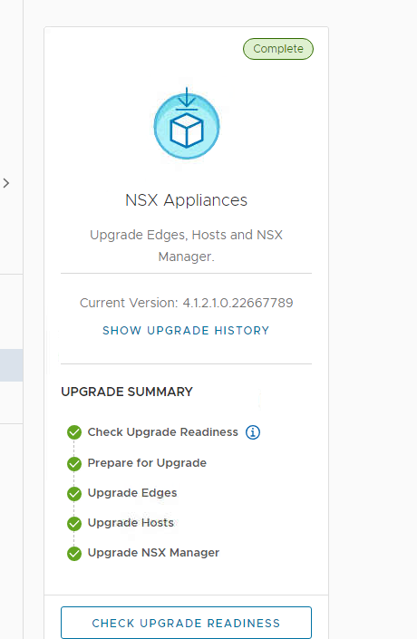
   - If not, i.e. you may see something like this:

   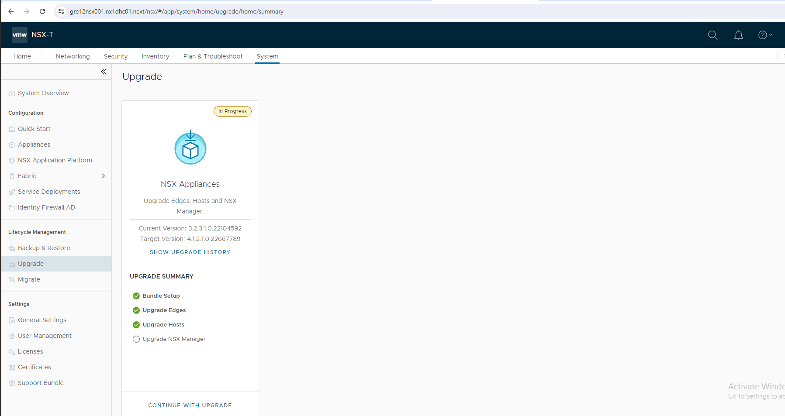

   then please schedule an appropriate time to finish up the upgrade first.

5. Check both vCenter servers using the Lookup Service Doctor tool (lsdoctor) available at [KB80469](https://kb.vmware.com/s/article/80469).
   This tool is used to identify and address problems with the PSC/SSO Domain data.

   - Download the tool from the article, extract and upload it to both vCenters, e.g. to `/tmp` directory
   - Execute `python /tmp/lsdoctor-master/lsdoctor.py -l` and if the tool discovers any problems, please address them with VMware Support.

   >NOTE: do not execute the tool with any switches other than `-l`. It's the only switch that doesn't modify anything and as such it's safe to use it on our own.        Remaining functionalities can be used only under VMware Support's supervision.

6. It is extremely important that both vCenter servers are checked for any potential problems prior to the upgrade

   - Check if all services are starting correctly after restart
   - As an extra precaution, please have a look at the following log file: `/var/log/vmware/applmgmt/PatchRunner.log` and look for the following phrases:
   - `INFO __main__ Patch vCSA succeeded` - to check whether the last upgrade completed successfully
   - `ERROR __main__ Patch vCSA failed` - to check if it failed

   during the time of the last VC upgrade.

7. Please check if `/etc/vmware-vlcm/version.txt` file exists and if it contains the version of the internal vLCM service, e.g. `0.0.3`. If the file doesn't exist, please create it by executing

   ```bash
   echo "0.0.3" > /etc/vmware-vlcm/version.txt
   ```

    If the file exists on 1st vCenter, but doesn't exist on the 2nd one, copy the version value from the 1st VC.

If any of those three checks show any problems, please contact VMware support to address those. This is especially important if vCenter servers were upgraded in the past. The server might seem to work fine, but underneath there might be problems that can cause the next upgrade to fail

### Power off Avamar proxies

Powered on Avamar proxies do not allow hosts to enter maintenance mode. Before you start upgrade, power off all avamar proxies on the cluster. Avamar proxies have `<locationCode>avp00X` VM name.

### Check/Configure Proxy

 SDDC Manager is configured to work with "My VMware Depot" account, it connects the depot to access the bundles.
 VCS uses a proxy server to access the VMware depot and download the upgrade bundles.

 >NOTE: SDDC only supports proxy servers that do not require authentication.

 Proxy server should be already configured for SDDC Manager but if there is any problem to get to VMware depot please check the configuration:

- Connect via SSH to SDDC Manager `<locationCode>sdm001` VM with the user name `vcf`
- Execute `su` command and provide root password
- Open `/opt/vmware/vcf/lcm/lcm-app/conf/application-prod.properties` file and verify whether the following settings are correct for your specific environment:

  ```yaml
    lcm.depot.adapter.proxyEnabled=true  
    lcm.depot.adapter.proxyHost='proxy IP address'  
    lcm.depot.adapter.proxyPort='proxy port'  
  ```

If any modification of the file are needed, remember to restart the lcm service afterwards for the new settings to kick in:

- Execute `systemctl restart lcm` command
- Wait 5 minutes and then download the bundles.

## Upgrade procedure

### Upgrade SDDC Manager

Important Note: To avoid further upgrade issues it is a good practice to cleanup all old bundles from SDDC Manager. Please follow: [https://knowledge.broadcom.com/external/article/312173/how-to-bundle-cleanup-utility.html](https://knowledge.broadcom.com/external/article/312173/how-to-bundle-cleanup-utility.html). For example:

1. Make a snapshot of SDDC Manager.
2. Login to SDDC Manager, use Developer Center and use some API call for listing all bundles statuses [Bundles -> /v1/bundles GET].
3. Collect all bundles with `sucesfull` status.
4. Use removal script:

```bash
   /opt/vmware/vcf/lcm/lcm-app/bin/bundle_cleanup.py <bundle id>
```

Example list of bundles to remove from LAB:

```bash
python bundle_cleanup.py b9462fde-a7d0-4965-b217-cd09bd21bcc5
python bundle_cleanup.py 4ac2b679-5e5b-43a6-b74b-5fd4e3c978c0
python bundle_cleanup.py abf4b936-14b7-42ce-8c4b-bc0754f299f6
python bundle_cleanup.py 259b722b-f8b5-4b4c-9e71-4ebe135cd38e
python bundle_cleanup.py c6a50311-47be-4b53-891d-9f5ecb75d087
python bundle_cleanup.py 34b75350-c552-4c93-b306-75658a3332a4
python bundle_cleanup.py 4f2f5d65-53ca-4b58-a85c-49d5b337cc64
python bundle_cleanup.py 4581e5e3-b82f-46b9-99cc-e35584f14de0
python bundle_cleanup.py b984c5e4-167a-4886-8f23-be34c9176ca9
python bundle_cleanup.py 6b61665e-0e4d-45dd-b1f5-057275b1cfb1
python bundle_cleanup.py 0ac7d2e9-1d92-4bfb-8925-798aa85a177d
python bundle_cleanup.py 0cb6a2cc-214e-41fd-a4b5-40311af991ac
python bundle_cleanup.py 084d1af4-7bfb-4ea4-84e5-c3fe445e8fe4
python bundle_cleanup.py a980d29f-7548-4b0e-bc94-aa690ffb7966
python bundle_cleanup.py 9e3175b7-57bc-49cf-8e22-c3885061b48a
python bundle_cleanup.py c49b858d-ed29-48bb-9d13-403d96a3ece3
python bundle_cleanup.py 4ea809be-5359-4ac8-b32f-2337c0820d8b
python bundle_cleanup.py fd85a861-a972-4da8-b708-8b35aa897e25
python bundle_cleanup.py 00a3b5c2-dbfb-498f-bdc1-1d47010e0fcb
python bundle_cleanup.py 3bbd1018-1e3f-478d-b201-4287aeb136d8
python bundle_cleanup.py 13d87a53-298d-4ee5-98ca-b9e10eece7a5
python bundle_cleanup.py 8c178f33-b28d-47d0-88da-aa94f309a042
python bundle_cleanup.py 193486eb-53f5-40c7-8012-b5dcab515ebf
python bundle_cleanup.py 3c32c5d6-b5e0-49c6-9a86-90bcd3de671e
python bundle_cleanup.py 05be2afd-990d-45bd-9472-fab032e8c696
python bundle_cleanup.py 4073e1c9-4eeb-4d46-97b5-374daa24be41
python bundle_cleanup.py 043e2b99-b36f-45b9-a4a2-1632a24764ef
python bundle_cleanup.py 85192dee-1d47-4211-bbdb-999d604f601f
python bundle_cleanup.py 363bd141-7d19-4287-9c7a-091c11042ca0
python bundle_cleanup.py b9308692-c98a-4afc-b49f-601f16105d92 
```

Example result of particular bundle removal:

```bash
root@gre12sdm001 [ /opt/vmware/vcf/lcm/lcm-app/bin ]# python bundle_cleanup.py 4ac2b679-5e5b-43a6-b74b-5fd4e3c978c0
-----------------------------------------------------
LOG FILE : /var/log/vmware/vcf/lcm/bundle_cleanup.log
-----------------------------------------------------
2024-07-25 13:40:32,294 [INFO] root: Performing cleanup for bundle with IDs : ['4ac2b679-5e5b-43a6-b74b-5fd4e3c978c0']
2024-07-25 13:40:32,861 [INFO] root: Bundle cleanup complete.
```

- Ensure you have a recent successful backup of SDDC Manager using an external SFTP server, as described in the `Prerequisites` section.
- Ensure you have taken a snapshot of the SDDC Manager appliance and that you have recent successful backups of the components managed by SDDC Manager, including vCenter Server.
- Go to `Inventory` > `Workload Domains` > `(location code)-m01` management domain > `Updates/Patches`
- Execute the upgrade pre-check before every upgrade bundle installation. Ensure that the pre-check results are green before proceeding. A failed pre-check may cause the update to fail.

  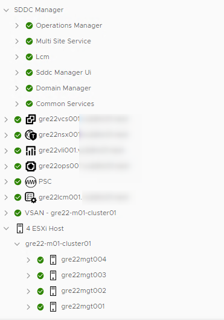

  >NOTE: If pre-check results are red, please resolve any problems and re-run the pre-check until it passes successfully. Solutions to some recurring problems might be listed in the `Known issues` chapters of this work instruction and also in older upgrade instructions.
- Expand the `Available updates` and from the `Select Cloud Foundation version` drop-down menu, select `Cloud Foundation 5.1.0.0`.

  This upgrade bundle should be visible:

  ```yaml
  - VMware Cloud Foundation Update 5.1.0.0
  Released: Nov 7, 2023
  Size: 2 GB
  Version: 5.3.0-198937
  Description: This VMware Cloud Foundation Upgrade bundle to 5.1 contains features, critical bugs and security fixes. For more information, see https://docs.vmware.com/en/VMware-Cloud-Foundation/5.1/rn/vmware-cloud-foundation-51-release-notes/index.html. For VMware Cloud Foundation Skip Upgrade Dependency on WCP, refer to https://kb.vmware.com/s/article/92227
  Bundle ID: b9308692-c98a-4afc-b49f-601f16105d92
  Update to Version: 5.1.0.0-22688368
  Description: SDDC Manager version update

  ETA: 45min
  ```

- Download the bundle and click `Update Now` or `Schedule Update` depending on your schedule/timeline and follow the upgrade steps.

  >TIP: It's worth to refresh the update status page, as it often reports *In progress* state thought the upgrade is already *Finished*.

- When upgrade is done and it is possible to login again a lot of errors can be noticed as follows:

  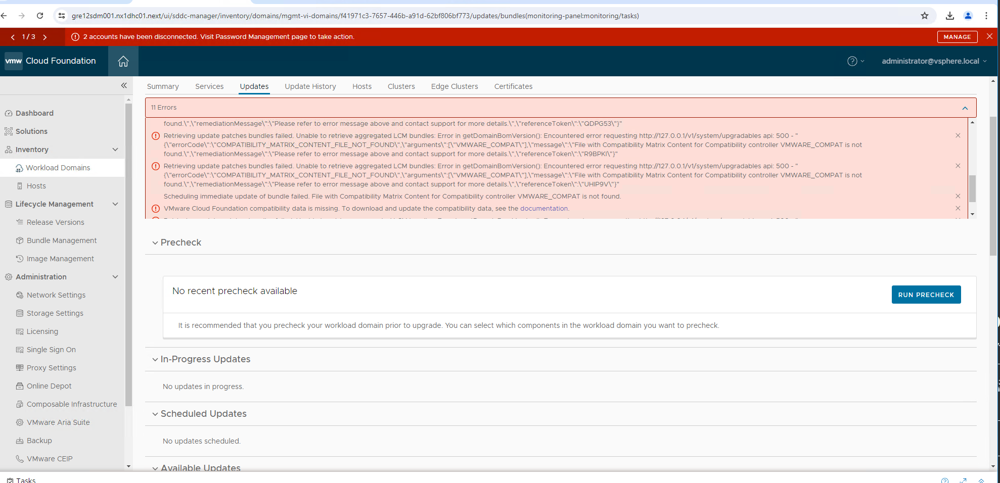

- Some errors can be fixed after execution of [https://knowledge.broadcom.com/external/article?legacyId=90074](https://knowledge.broadcom.com/external/article?legacyId=90074):

1. SSH into SDDC Manager appliance with the vcf user and su to root.
2. Edit the file: /opt/vmware/vcf/lcm/lcm-app/conf/compatibility.flag
3. Update the property vcf.compatibility.controllers.compatibilityCheckEnabled to false
4. Save and close the file.
5. Restart Lifecycle Management by running the command: systemctl restart lcm

- Number of errors will be reduced after performing above flag change. You can see:

  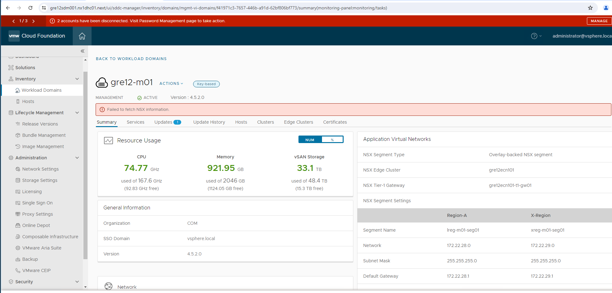

  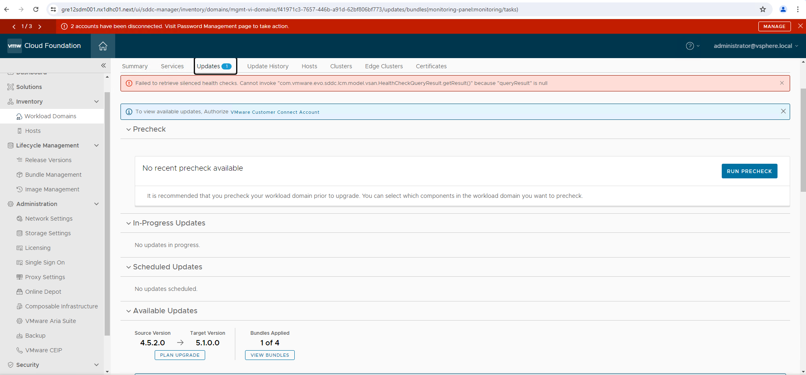

  To fix `To view available updates. Authorize VMware Customer Connect Account` click on communicate and add password once again:

  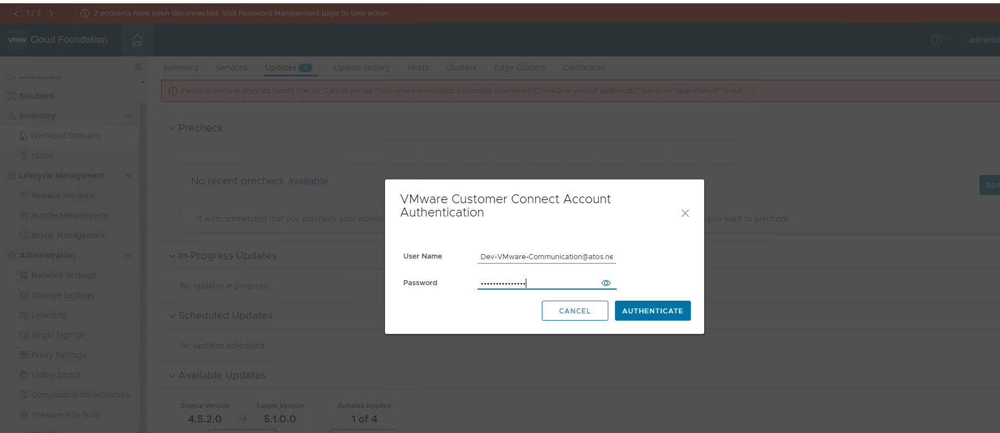

- If you click on download next bundle so NSX then you can see following error which must be also fixed:

  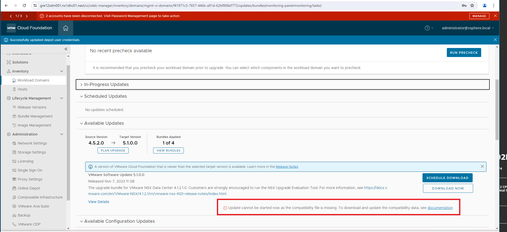

  To fix this error we must download compatibility matrix using Offline Bundle Transfer Utility as follows:

```bash
root@gre12sdm001 [ /opt/vmware/vcf/lcm/lcm-tools/bin ]# ./lcm-bundle-transfer-util --download --compatibilityMatrix --depotUser Dev-VMware-Communication@atos.net --ps gre12pxy001.nx1dhc01.next:3128

root@gre12sdm001 [ /opt/vmware/vcf/lcm/lcm-tools/bin ]# cd  /root/PROD2/evo/vmw/

root@gre12sdm001 [ ~/PROD2/evo/vmw/Compatibility ]# cp VmwareCompatibilityData.json /home/vcf/Compatibility/

root@gre12sdm001 [ ~/PROD2/evo/vmw/Compatibility ]# system restart lcm
```

- After above action you can again see communicate `To view available updates. Authorize VMware Customer Conect Account` click on communicate and add password once again.

- Run precheck once again after all above actions. You will see some errors related with compatibility, not downloaded bundles and so on. Ignored them to see if they will appear after upgrade and version change.

 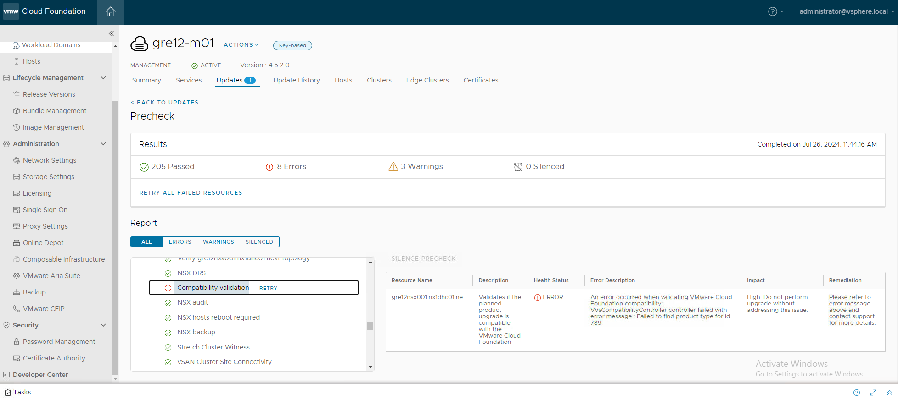

 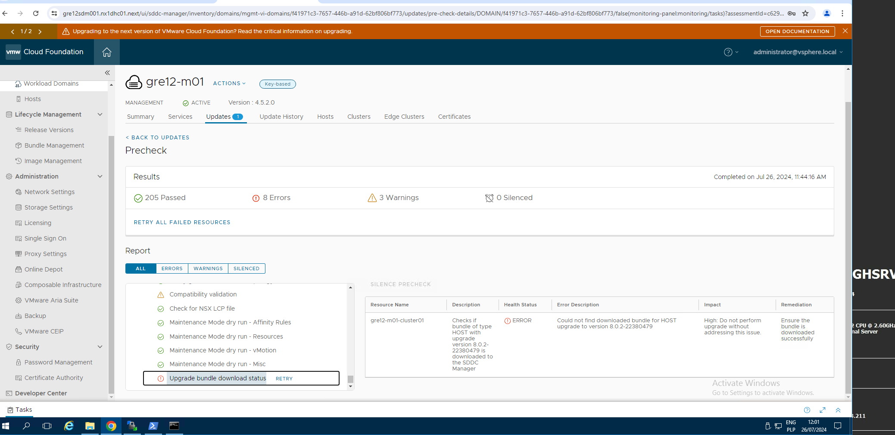

 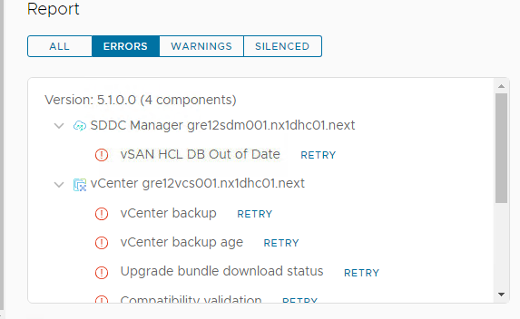

 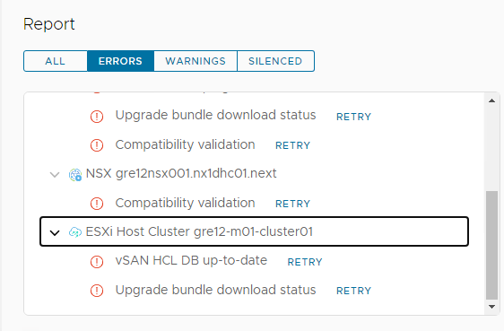

 HCL issue can be fixed using [https://knowledge.broadcom.com/external/article/315556/updating-the-vsan-hcl-database-manually.html](https://knowledge.broadcom.com/external/article/315556/updating-the-vsan-hcl-database-manually.html)

### Apply VMware Cloud Foundation Configuration Updates

Please follow section [Apply VMware Cloud Foundation Configuration Updates](https://docs.vmware.com/en/VMware-Cloud-Foundation/5.1/vcf-lifecycle/GUID-2E70DA12-2DF3-456D-88C2-21BB35876AB1.html#GUID-2E70DA12-2DF3-456D-88C2-21BB35876AB1)

### Virtual Infrastructure Layer in Management Domain

Next step is to upgrade the virtual infrastructure layer in Management Domain:

- NSX-T Data Center:
  - NSX-T Edge cluster
  - NSX-T Host cluster
  - NSX-T Manager cluster
- vCenter Server
- ESXi hosts

> Note: All NSX-T components (Edge cluster, Host cluster and Manager cluster) are upgraded by a single bundle.

Verify that you have recent backups of the NSX-T Manager nodes and the vCenter Server virtual machines.

#### NSX-T Data Center

- Ensure you have a recent successful backup of NSX-T in NSX-T manager.
- Go to `Inventory` > `Workload Domains` > `<locationCode>-m01` management domain > `Updates/Patches`
- Execute the upgrade pre-check before every upgrade bundle installation. During precheck from 4.5.2 to 5.1.0 you will see some errors related with compatibility, not downloaded bundles, missing backups. They must be ignored but other issues must be checked if they will appear.
- Expand the `Available updates` and from the `Select Cloud Foundation version` drop-down menu, select `Cloud Foundation 5.1.0.0`

  This upgrade bundle should be visible:

  ```yaml
  - VMware Cloud Foundation Update 5.1.0.0
  Released: Nov 7, 2023
  Size: 11 GB
  Version: 5.3.10-198939
  Info: The upgrade bundle for VMware NSX Data Center 4.1.2.1.0. Customers are strongly encouraged to run the NSX Upgrade Evaluation Tool. For more information, see https://docs.vmware.com/en/VMware-NSX/4.1.2.1/rn/vmware-nsx-4121-release-notes/index.html
  Bundle ID: 39759b15-d985-4c15-85d6-7d44fd24df45
  Update to Version: 4.1.2.1.0-22667789
  Description: NSX_T_MANAGER Update Bundle

  ETA: 3h
  ```

- Download the bundle and click `Update Now` or `Schedule Update` depending on your schedule/timeline and follow the upgrade steps described here: [Upgrade NSX from 3.2.2.x / 3.2.3.x](https://docs.vmware.com/en/VMware-Cloud-Foundation/5.1/vcf-lifecycle/GUID-2E70DA12-2DF3-456D-88C2-21BB35876AB1.html#GUID-2E70DA12-2DF3-456D-88C2-21BB35876AB1).
- In case of having multiple Edge and/or Host cluster, it's possible to upgrade them sequentially, instead of in parallel (which is the default behavior). To enable sequential upgrade, select the relevant options:
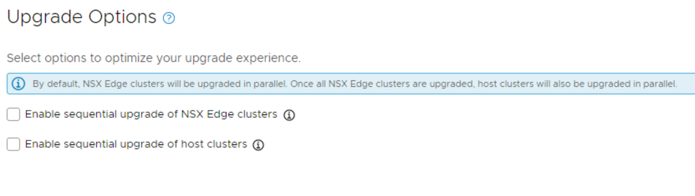
The downside to doing it sequentially is the prolonged upgrade time, but on the other hand, it gives you better control over the upgrade process. Of course, in case of having only a single Edge and/or Host cluster, this is irrelevant.
- Once NSX-T Data Center is upgraded, perform an [Operational Verification of VMware NSX-T Data Center](https://docs.vmware.com/en/VMware-Cloud-Foundation/4.5/vcf-operations/GUID-7567A790-4CAA-438C-9E8B-00B5319FC42E.html).

#### vCenter Server

- Ensure that you have new license for version 8th.
- Ensure that you have a temporary IP address in the management subnet (it is a migration from vCenter 7 to vCenter 8).
- Ensure you have a recent successful backup of all the vCenter appliances sharing the same SSO domain.
- If possible, create offline (with both VC VMs powered down) snapshots of both vCenter VMs at the same time. This is to ensure a consistent state of both servers (especially regarding the replication between them) in case a need arises to revert the state.
- If possible, redo the [Upgrade Prerequisites](#upgrade-prerequisites) no. 3 (replication check), 5 (lsdoctor check) and 6 (VC status check after the last upgrade, if applicable)
- Go to `Inventory` > `Workload Domains` > `(customerCode)-(locationCode)-m01` management domain > `Updates/Patches`
- Execute the upgrade pre-check before every upgrade bundle installation. During precheck from 4.5.2 to 5.1.0 you will see some errors related with compatibility, not downloaded bundles, missing backups. They must be ignored but other issues must be checked if they will appear.
- Expand the `Available updates` and from the `Select Cloud Foundation version` drop-down menu, select `Cloud Foundation 5.1.0.0`.
  This upgrade bundle should be visible:

  ```yaml
  - VMware Cloud Foundation Update 5.1.0.0
  Released: Nov 7, 2023
  Size: 18 GB
  Version: 5.3.12-198935
  Info: The upgrade bundle for VMware vCenter Server 8.0 Update 2a. For more information, see https://docs.vmware.com/en/VMware-vSphere/8.0/rn/vsphere-vcenter-server-80u2a-release-notes/index.html
  Bundle ID: 0a1ba239-eab9-41c6-b0e6-9738a463bdbe
  Update to Version: 8.0.2.00100-22617221
  Description: VMware vCenter Server Update Bundle

  ETA: 2h
  ```

- Click `Update Now` or `Schedule Update` depending on your schedule/timeline and follow the upgrade steps described here: [Upgrade vCenter Server for VMware Cloud Foundation](https://docs.vmware.com/en/VMware-Cloud-Foundation/5.1/vcf-lifecycle/GUID-2E70DA12-2DF3-456D-88C2-21BB35876AB1.html#GUID-2E70DA12-2DF3-456D-88C2-21BB35876AB1). It is required to use temporary IP address during the upgrade.
- Once vCenter is upgraded, perform an [Operational Verification of vSphere](https://docs.vmware.com/en/VMware-Cloud-Foundation/4.5/vcf-operations/GUID-D8629B82-9BEB-4E2D-ABB6-D50E9657D58B.html), including the verification of the possibility to [access vCenter using an Active Directory account](https://docs.vmware.com/en/VMware-Validated-Design/6.2/sddc-operational-verification/GUID-30685840-25EA-4A0E-A1DA-5F69D4E458DA.html).
- After the vCenter upgrade, check if product is properly licensed. Go to `vCenter` > `Administration` > `Licensing` > `Licenses` (check also `Assets`). If not then add/assign proper one license.
- Login to SDDC Manager go to `Administration` > `Licenses` and add proper license keys. Then check if there are any errors/communicates stating that vCenter is in Evaluation license mode.
- After the vCenter upgrade, please repeat the [Upgrade Prerequisites](#upgrade-prerequisites) no. 3, 5 and 6.

#### ESXi hosts

> **If there is a need to add custom drivers during the ESXi upgrade process, please follow the steps described in chapter `Upgrade ESXi with VMware Cloud Foundation Stock ISO and Async NIC Driver` in [dhcDellEsxiUpgradeWithCustomImages.md](dhcDellEsxiUpgradeWithCustomImages.md) document, however the process was not tested for VCS 2.0**

- Ensure that you have new license version 8th.
- Go to `Inventory` > `Workload Domains` > `(customerCode)-(locationCode)-m01` management domain > `Updates/Patches`
- Execute the upgrade pre-check before every upgrade bundle installation. During precheck from 4.5.2 to 5.1.0 you will see some errors related with compatibility, not downloaded bundles, missing backups. They must be ignored but other issues must be checked if they will appear.
- Expand the `Available updates` and from the `Select Cloud Foundation version` drop-down menu, select `Cloud Foundation 5.1.0.0`
  This upgrade bundle should be visible:

  ```yaml
  - VMware Cloud Foundation Update 5.1.0.0
  Released: Nov 7, 2023
  Size: 671 MB
  Version: 5.3.24-198934
  The upgrade bundle for VMware ESXi 8.0 Update 2. For more information, see https://docs.vmware.com/en/VMware-vSphere/8.0/rn/vsphere-esxi-802-release-notes/index.html. Cumulative Bundle
  Bundle ID: efca585c-4fd8-4ec4-9b08-c50701aa2f7d
  Update to Version: 8.0.2-22380479
  Description: VMware ESXi Server Update Bundle

  ETA: 2h10min
  ```

- Click `Update Now` or `Schedule Update` depending on your schedule/timeline and follow the upgrade steps described here: [Upgrade ESXi with vSphere Lifecycle Manager Baselines for VMware Cloud Foundation](https://docs.vmware.com/en/VMware-Cloud-Foundation/5.1/vcf-lifecycle/GUID-2E70DA12-2DF3-456D-88C2-21BB35876AB1.html#GUID-2E70DA12-2DF3-456D-88C2-21BB35876AB1).
- After the ESXi upgrade, check if product is properly licensed. Go to `vCenter` > `Administration` > `Licensing` > `Licenses` (check also `Assets`). If not then add/assign proper one license.
- Login to SDDC Manager go to `Administration` > `Licenses` and add proper license keys. Then check if there are any errors/communicates stating that ESXi is in Evaluation license mode.

 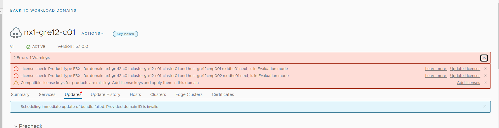

- Once ESXi hosts are upgraded, perform an [Operational Verification of vSphere](https://docs.vmware.com/en/VMware-Cloud-Foundation/4.5/vcf-operations/GUID-D8629B82-9BEB-4E2D-ABB6-D50E9657D58B.html).

##### vSAN Witness Hosts

In case of vSAN stretched clusters, vSphere Lifecycle Manager (vLCM) depot must be used to upgrade vSAN Witness Host. Please follow steps described in [Upgrade vSAN Witness Host for VMware Cloud Foundation](https://docs.vmware.com/en/VMware-Cloud-Foundation/5.1/vcf-lifecycle/GUID-2E70DA12-2DF3-456D-88C2-21BB35876AB1.html#GUID-2E70DA12-2DF3-456D-88C2-21BB35876AB1) documentation.

Here's the [VMware Cloud Foundation 5.1 Release Notes](https://docs.vmware.com/en/VMware-Cloud-Foundation/5.1/rn/vmware-cloud-foundation-51-release-notes/index.html) link, with the Bill of Materials listing the correct version of VSAN Witness Appliance to upgrade to.

### Post-checks

To confirm the Management domain is fully upgraded to ver. 5.1.0.0, log in to SDDC Manager and go to `Lifecycle Management` > `Release Versions`. Management domain should be visible in `Available Cloud Foundation`, version 5.1.0.0.

### Virtual Infrastructure Layer in Workload Domain

Once the upgrade of management domain is finished, the next step is to upgrade the Virtual Infrastructure in Workload Domain.

- NSX-T Data Center:
  - NSX-T Edge cluster
  - NSX-T Host cluster
  - NSX-T Manager cluster
- vCenter Server
- ESXi hosts

> Note: All NSX-T components (Edge cluster, Host cluster and Manager cluster) are upgraded by a single bundle.

Verify that you have recent backups of the NSX-T Manager nodes and the vCenter Server virtual machines.

#### NSX-T Data Center

- Ensure you have a recent successful backup of NSX-T in NSX-T manager.
- Go to `Inventory` > `Workload Domains` > `(customerCode)-(locationCode)-c01` compute domain > `Updates/Patches`
- Execute the upgrade pre-check before every upgrade bundle installation. During precheck from 4.5.2 to 5.1.0 you will see some errors related with compatibility, not downloaded bundles, missing backups. They must be ignored but other issues must be checked if they will appear.
- Expand the `Available updates` and from the `Select Cloud Foundation version` drop-down menu, select `Cloud Foundation 5.1.0.0`.

  This upgrade bundle should be visible:

  ```yaml
  - VMware Cloud Foundation Update 5.1.0.0
  Released: Nov 7, 2023
  Size: 11 GB
  Version: 5.3.10-198939
  Info: The upgrade bundle for VMware NSX Data Center 4.1.2.1.0. Customers are strongly encouraged to run the NSX Upgrade Evaluation Tool. For more information, see https://docs.vmware.com/en/VMware-NSX/4.1.2.1/rn/vmware-nsx-4121-release-notes/index.html
  Bundle ID: 39759b15-d985-4c15-85d6-7d44fd24df45
  Update to Version: 4.1.2.1.0-22667789
  Description: NSX_T_MANAGER Update Bundle

  ETA: 2h
  ```

- Download the bundle and click `Update Now` or `Schedule Update` depending on your schedule/timeline and follow the upgrade steps described here: [Upgrade NSX from 3.2.2.x / 3.2.3.x](https://docs.vmware.com/en/VMware-Cloud-Foundation/5.1/vcf-lifecycle/GUID-2E70DA12-2DF3-456D-88C2-21BB35876AB1.html#GUID-2E70DA12-2DF3-456D-88C2-21BB35876AB1).
- In case of having multiple Edge and/or Host cluster, it's possible to upgrade them sequentially, instead of in parallel (which is the default behavior). To enable sequential upgrade, select the relevant options:

The downside to doing it sequentially is the prolonged upgrade time, but on the other hand, it gives you better control over the upgrade process. Of course, in case of having only a single Edge and/or Host cluster, this is irrelevant.
- Once NSX-T Data Center is upgraded, perform an [Operational Verification of VMware NSX-T Data Center](https://docs.vmware.com/en/VMware-Cloud-Foundation/4.5/vcf-operations/GUID-7567A790-4CAA-438C-9E8B-00B5319FC42E.html).

#### vCenter Server

- Ensure that you have new license for version 8th.
- Ensure that you have a temporary IP address in the management subnet (it is a migration from vCenter 7 to vCenter 8).
- Ensure you have a recent successful backup of all the vCenter appliances sharing the same SSO domain.
- If possible, create offline (with both VC VMs powered down) snapshots of both vCenter VMs at the same time. This is to ensure a consistent state of both servers (especially regarding the replication between them) in case a need arises to revert the state.
- If possible, redo the [Upgrade Prerequisites](#upgrade-prerequisites) no. 3 (replication check), 5 (lsdoctor check) and 6 (VC status check after the last upgrade, if applicable)
- Go to `Inventory` > `Workload Domains` > `(customerCode)-(locationCode)-c01` compute domain > `Updates/Patches`
- Execute the upgrade pre-check before every upgrade bundle installation.  During precheck from 4.5.2 to 5.1.0 you will see some errors related with compatibility, not downloaded bundles, missing backups. They must be ignored but other issues must be checked if they will appear.
- Expand the `Available updates` and from the `Select Cloud Foundation version` drop-down menu, select `Cloud Foundation 5.1.0.0.
  This upgrade bundle should be visible:

  ```yaml
  - VMware Cloud Foundation Update 5.1.0.0
  Released: Nov 7, 2023
  Size: 18 GB
  Version: 5.3.12-198935
  Info: The upgrade bundle for VMware vCenter Server 8.0 Update 2a. For more information, see https://docs.vmware.com/en/VMware-vSphere/8.0/rn/vsphere-vcenter-server-80u2a-release-notes/index.html
  Bundle ID: 0a1ba239-eab9-41c6-b0e6-9738a463bdbe
  Update to Version: 8.0.2.00100-22617221
  Description: VMware vCenter Server Update Bundle

  ETA: 2h
  ```

- Click `Update Now` or `Schedule Update` depending on your schedule/timeline and follow the upgrade steps described here: [Upgrade vCenter Server for VMware Cloud Foundation](https://docs.vmware.com/en/VMware-Cloud-Foundation/5.1/vcf-lifecycle/GUID-2E70DA12-2DF3-456D-88C2-21BB35876AB1.html#GUID-2E70DA12-2DF3-456D-88C2-21BB35876AB1). It is required to use temporary IP address during the upgrade.
- Once vCenter is upgraded, perform an [Operational Verification of vSphere](https://docs.vmware.com/en/VMware-Cloud-Foundation/4.5/vcf-operations/GUID-D8629B82-9BEB-4E2D-ABB6-D50E9657D58B.html), including the verification of the possibility to [access vCenter using an Active Directory account](https://docs.vmware.com/en/VMware-Validated-Design/6.2/sddc-operational-verification/GUID-30685840-25EA-4A0E-A1DA-5F69D4E458DA.html).
- After the vCenter upgrade, check if product is properly licensed. Go to `vCenter` > `Administration` > `Licensing` > `Licenses` (check also `Assets`). If not then add/assign proper one license.
- Login to SDDC Manager go to `Administration` > `Licenses` and add proper license keys. Then check if there are any errors/communicates stating that vCenter is in Evaluation license mode.
- After the vCenter upgrade, please repeat the [Upgrade Prerequisites](#upgrade-prerequisites) no. 3, 5 and 6.

#### ESXi hosts

> **If there is a need to add custom drivers during the ESXi upgrade process, please follow the steps described in chapter `Upgrade ESXi with VMware Cloud Foundation Stock ISO and Async NIC Driver` in [dhcDellEsxiUpgradeWithCustomImages.md](dhcDellEsxiUpgradeWithCustomImages.md) document, however the process was not tested for VCS 2.0*

- Go to `Inventory` > `Workload Domains` > `(customerCode)-(locationCode)-c01` compute domain > `Updates/Patches`
- Execute the upgrade pre-check before every upgrade bundle installation. During precheck from 4.5.2 to 5.1.0 you will see some errors related with compatibility, not downloaded bundles, missing backups. They must be ignored but other issues must be checked if they will appear.
- Expand the `Available updates` and from the `Select Cloud Foundation version` drop-down menu, select `Cloud Foundation 5.1.0.0`.
  This upgrade bundle should be visible:

  ```yaml
  - VMware Cloud Foundation Update 5.1.0.0
  Released: Nov 7, 2023
  Size: 671 MB
  Version: 5.3.24-198934
  The upgrade bundle for VMware ESXi 8.0 Update 2. For more information, see https://docs.vmware.com/en/VMware-vSphere/8.0/rn/vsphere-esxi-802-release-notes/index.html. Cumulative Bundle
  Bundle ID: efca585c-4fd8-4ec4-9b08-c50701aa2f7d
  Update to Version: 8.0.2-22380479
  Description: VMware ESXi Server Update Bundle

  ETA: 35min
  ```

- Click `Update Now` or `Schedule Update` depending on your schedule/timeline and follow the upgrade steps described here: [Upgrade ESXi with vSphere Lifecycle Manager Baselines for VMware Cloud Foundation](https://docs.vmware.com/en/VMware-Cloud-Foundation/5.1/vcf-lifecycle/GUID-2E70DA12-2DF3-456D-88C2-21BB35876AB1.html#GUID-2E70DA12-2DF3-456D-88C2-21BB35876AB1).
- After the ESXi upgrade, check if product is properly licensed. Go to `vCenter` > `Administration` > `Licensing` > `Licenses` (check also `Assets`). If not then add/assign proper one license.
- Login to SDDC Manager go to `Administration` > `Licenses` and add proper license keys. Then check if there are any errors/communicates stating that ESXi is in Evaluation license mode.

 

- Once ESXi hosts are upgraded, perform an [Operational Verification of vSphere](https://docs.vmware.com/en/VMware-Cloud-Foundation/4.5/vcf-operations/GUID-D8629B82-9BEB-4E2D-ABB6-D50E9657D58B.html).

#### vSAN Witness Hosts

In case of vSAN stretched clusters, vSphere Lifecycle Manager (vLCM) depot must be used to upgrade vSAN Witness Host. Please follow steps described in [Upgrade vSAN Witness Host for VMware Cloud Foundation](https://docs.vmware.com/en/VMware-Cloud-Foundation/5.1/vcf-lifecycle/GUID-2E70DA12-2DF3-456D-88C2-21BB35876AB1.html#GUID-2E70DA12-2DF3-456D-88C2-21BB35876AB1) documentation.

Here's the [VMware Cloud Foundation 5.1 Release Notes](https://docs.vmware.com/en/VMware-Cloud-Foundation/5.1/rn/vmware-cloud-foundation-51-release-notes/index.html) link, with the Bill of Materials listing the correct version of VSAN Witness Appliance to upgrade to.

### Post-checks

To confirm the compute domain is fully upgraded to ver. 5.1.0.0, log in to SDDC Manager and go to `Lifecycle Management` > `Release Versions`. Compute domain should be visible in `Available Cloud Foundation`, version 5.1.0.0.

### Re-enable the compatibility checks in SDDC Manager

To re-eanble the compatibility checks use [https://knowledge.broadcom.com/external/article?legacyId=90074](https://knowledge.broadcom.com/external/article?legacyId=90074):

1. SSH into SDDC Manager appliance with the vcf user and su to root.
2. Edit the file: /opt/vmware/vcf/lcm/lcm-app/conf/compatibility.flag
3. Update the property vcf.compatibility.controllers.compatibilityCheckEnabled to true
4. Save and close the file.
5. Restart Lifecycle Management by running the command: systemctl restart lcm

## Compliance Overview
  
Please check the [Compliance Overview](wiComplianceOverview.md) document for any post-LCM actions and remediation that need to be  implemented, log4j vulnerability being an example.

## Known issues

Compatibility errors described in SDDC Manager upgrade section.
