# VCF Upgrade to 5.2.0

## Changelog
  
| Date       | Issue    | Author          | TOS  | Description |
| ---------- | -------- | --------------- | ---- | ------------------------- |
| 15/10/2024 | VCS-14148 | Mariusz Stanek   |      | Initial version creation |
| 30/10/2024 | VCS-14276 | Nicu Butaru   |      | Added Patching for vCenter,ESXi,NSX from SDDC |
| 03/04/2025 | VCS-15113 | Mariusz Stanek  |      | Update WI links since docs.vmware references are not valid anymore |
| 19/03/2025 | VCS-15410 | Mariusz Stanek  |     | Documentation changes provided by TOS                          |
| 01/04/2025 | VCS-15680 | Nicu Butaru  |     | Documentation changes provided by TOS                          |
| 11/04/2025 | VCS-15564 | Mariusz Stanek  |     | Upgrade changes provided by TOS                          |
| 15/04/2025 | VCS-15699 | Mariusz Stanek  |     | NSX Edge Cluster credentials error fix added                |
| 24/04/2025 | VCS-15681 | Lukasz Bienkowski | | Add step to enable VCF bundle download token |
| 06/05/2025 | VCS-15907 | Mariusz Stanek | | IWA to LDAP on vCenter |
| 22/05/2025 | VCS-16081 | Mariusz Stanek | | Revert esxAdminsGroupAutoAdd paramater value on ESXi section added |
| 15/08/2025 | VCS-16779 | Mariusz Stanek |     | Extra variable example for updateEsxiHostAd.yml added |
| 08/11/2025 | VCS-17576 | Lukasz Bienkowski |  | Adjust section about download token, add known issues in patching section, fix link descriptions |
| 06/02/2026 | VCS-17343 | Rachel Beulah | | Adjust vCenter Server section to include backup tagging |

## Introduction

### Purpose

The purpose of this document is to describe the steps that should be performed in order to upgrade VCF from version 4.5.2 (VCS 1.8.4) to 5.2.0 (VCS 2.0.1).

Both domains - the Management Domain (MGT) and the Workload Domain (VI WD) - are upgraded separately.  

### Audience

1. VCS Engineers,
2. VCS Operations,
3. VCS Architects.

### Scope

The scope of this document covers the following:

1. Upgrade of SDDC management components (MGT domain):
    - SDDC Manager
    - NSX-T Data Center
    - vCenter Server
    - ESXi hosts
2. Upgrade of Workload Domain (VI WD)
    - NSX-T Data Center
    - vCenter Server
    - ESXi hosts
3. Patch MGT domain and Workload Domain
    - NSX-T Data Center
    - vCenter Server
    - ESXi hosts

### Related Documents

| Document |
| -------- |
| [VCS 2.0.1 - wiLifeCycleManagement](wiLifeCycleManagement-DHC2.0.1.md)|

## Preliminary information

The upgrade process consists of the following steps:

1. Upgrade of SDDC Manager from ver. 4.5.2 to 5.2.0
2. Upgrade of VCF components from ver. 4.5.2 to 5.2.0 for Management domain
3. Upgrade of VCF components from ver. 4.5.2 to 5.2.0 for Workload domain

with the management domain being upgraded first (as it hosts the core components) and workload domain(s) second.

Before you start an upgrade of VCS (VCF components), make sure that you are familiar with:

1. [VMware Cloud Foundation 5.2 Lifecycle Management](https://techdocs.broadcom.com/us/en/vmware-cis/vcf/vcf-5-2-and-earlier/5-2/vmware-cloud-foundation-lifecycle-management.html).
2. [VMware Cloud Foundation 5.2 Release Notes](https://techdocs.broadcom.com/us/en/vmware-cis/vcf/vcf-5-2-and-earlier/5-2/vcf-release-notes/vmware-cloud-foundation-52-release-notes.html).
3. [Upgrade the Management Domain to VMware Cloud Foundation 5.2.x](https://techdocs.broadcom.com/us/en/vmware-cis/vcf/vvs/1-0/upgrade-the-management-domain-to-vmware-cloud-foundation-5-2.html).
4. [Upgrade VI Workload Domains to VMware Cloud Foundation 5.2.x](https://techdocs.broadcom.com/it/it/vmware-cis/vcf/vcf-5-2-and-earlier/5-2/upgrade-workload-domains-to-vcf-5-2.html)

## Hardware and firmware compatibility

It is required to check hardware/firmware compatibility during upgrade preparations. It can be also required to contact with hardware vendor if there are any concerns with compatible version.

Below links can help during compatibility check process:

1. [ESXi 8.0 Hardware requirements](https://techdocs.broadcom.com/us/en/vmware-cis/vsphere/vsphere/8-0/esxi-upgrade-8-0/upgrading-esxi-hosts-upgrade/esxi-requirements-upgrade/esxi-hardware-requirements-upgrade.html)
2. [CPU Support Deprecation and Discontinuation In vSphere Releases](https://knowledge.broadcom.com/external/article?legacyId=82794)
3. [Using the VMware Product Interoperability Matrixes](https://knowledge.broadcom.com/external/article/343230/using-the-vmware-product-interoperabilit.html)

General Broadcom compatibility guides:

1. [Systems/Servers](https://compatibilityguide.broadcom.com/search?program=server&persona=live&column=partnerName&order=asc)
2. [CPU series](https://compatibilityguide.broadcom.com/search?program=cpu&persona=live&column=cpuSeries&order=asc)
3. [Storage/SAN](https://compatibilityguide.broadcom.com/search?program=san&persona=live&column=partnerName&order=asc)
4. [IO Devices](https://compatibilityguide.broadcom.com/search?program=io&persona=live&column=brandName&order=asc)
5. [Guest OS](https://compatibilityguide.broadcom.com/search?program=software&persona=live&column=osVendors&order=asc)

## Prerequisites

During migration it is required to have new licenses, see [VMware Cloud Foundation Upgrade Prerequisites](https://techdocs.broadcom.com/us/en/vmware-cis/vcf/vcf-5-2-and-earlier/5-2/vmware-cloud-foundation-lifecycle-management/upgrade-prequisites-lifecycle.html). According to the information received from Global VMware TAM for Atos the license keys will need an upgrade (vSphere / VSAN 8, NSX 4) through the Broadcom portal by the Atos Contract Administration Team

It is important to back up all VMs before upgrade using standard VCS backup solution. Before starting an update take a backup of the SDDC Manager VM and take a snapshot of relevant VMs in your management domain.
If a component upgrade fails, the order of operations ensures that backward compatibility and interoperability are maintained between the layers. You can roll back to a previous version of the components in a layer by using the backup or snapshots.

In addition, it is possible to create file-based backup solution for management VMs (sdm001, vcs001, vcs002), to back up ESXi hosts configuration and to export vSphere Distributed Switches (mgmt and cmp) configuration to avoid downtime and data loss in case of a system failure. If some of the management component does fail, it can be restored to the latest backup.
  As agreed, `<locationCode>ans001` VM acts as an external SFTP backup server. Additional 200GiB disk ( /backup) is added to store backup files for above components.

In order to check if ans001 is configured as an external SFTP do the following:

1. In SDDC Manager, select `Administration` > `Backup Configuration`.
2. Confirm if IP address of `<locationCode>ans001` server is visible as IP address of external SFTP backup server.
3. Confirm if */backup/vcf* path  is provided as backup directory path of the server.

Prior to the upgrade of both vCenter instances, you will be asked to create the offline (with both VC VMs powered down) snapshots. This is to ensure a consistent state of both servers (especially regarding the replication between them) in case a need arises to revert the state.

### Upgrade Prerequisites

1. Do not run any domain operations while an update is in progress. Examples of domain operations: creating a new VI domain, adding hosts to a cluster or adding a cluster to a workload domain, removing clusters or hosts from a workload domain.

2. Confirm that the passwords for all VMware Cloud Foundation components are valid and not in expired state. This includes passwords for: NSX-T, Aria Operations, Aria Operations for Networks, Aria Operations for Logs, Workspace ONE Access, etc.

3. Check if the replication between both vCenter servers is working:

   - Login via SSH to both vCenters as root and execute `shell`
   - Execute `/usr/lib/vmware-vmdir/bin/vdcrepadmin -f showpartnerstatus -h localhost -u administrator` (password for `Administrator@vsphere.local` will be required)   on both vCenters and check the results. They both should display the information that both vCenters are in sync.

    ```bash
    Host available:   Yes
    Status available: Yes
    My last change number:             15025
    Partner has seen my change number: 15025
    Partner is 0 changes behind.
    ```

    Additionally, you may check the Directory Service log: `/var/log/vmware/vmdird/vmdird-syslog.log` for any errors.
    If you encounter any replication inconsistencies or errors in the log, please contact VMware Support to address any problems beforehand.

4. Check the status of all NSX-T environments regarding their upgrade state:

   - Login to NSX-T Manager, go to `System` > `Upgrade` and check whether or not the upgrade status is `Complete`:

   
   - If not, i.e. you may see something like this:

   

   then please schedule an appropriate time to finish up the upgrade first.

5. Check both vCenter servers using the Lookup Service Doctor tool (lsdoctor) available at [KB80469](https://knowledge.broadcom.com/external/article?legacyId=80469).
   This tool is used to identify and address problems with the PSC/SSO Domain data.

   - Download the tool from the article, extract and upload it to both vCenters, e.g. to `/tmp` directory
   - Execute `python /tmp/lsdoctor-master/lsdoctor.py -l` and if the tool discovers any problems, please address them with VMware Support.

   >NOTE: do not execute the tool with any switches other than `-l`. It's the only switch that doesn't modify anything and as such it's safe to use it on our own.        Remaining functionalities can be used only under VMware Support's supervision.

6. It is extremely important that both vCenter servers are checked for any potential problems prior to the upgrade

   - Check if all services are starting correctly after restart
   - As an extra precaution, please have a look at the following log file: `/var/log/vmware/applmgmt/PatchRunner.log` and look for the following phrases:
   - `INFO __main__ Patch vCSA succeeded` - to check whether the last upgrade completed successfully
   - `ERROR __main__ Patch vCSA failed` - to check if it failed

   during the time of the last VC upgrade.

7. Please check if `/etc/vmware-vlcm/version.txt` file exists and if it contains the version of the internal vLCM service, e.g. `0.0.3`. If the file doesn't exist, please create it by executing

   ```bash
   echo "0.0.3" > /etc/vmware-vlcm/version.txt
   ```

    If the file exists on 1st vCenter, but doesn't exist on the 2nd one, copy the version value from the 1st VC.

   If any of these three checks show any problems, please contact VMware support to address those. This is especially important if vCenter server was upgraded in the past. The server might seem to work fine, but underneath there might be problems that can cause the next upgrade to fail.

8. Both vCenter servers must be migrated to `Active Directory over LDAP` instead of `Active Directory (Integrated Windows Authentication)`. For more details see <https://knowledge.broadcom.com/external/article/314324/removal-of-integrated-windows-authentica.html>. Identity Provider can be checked through vCenter `Administration` > `Single Sign On` > `Configuration` > `Identity Provider` > `Identity Sources` and it should look similar to below VX5 lab environment:

  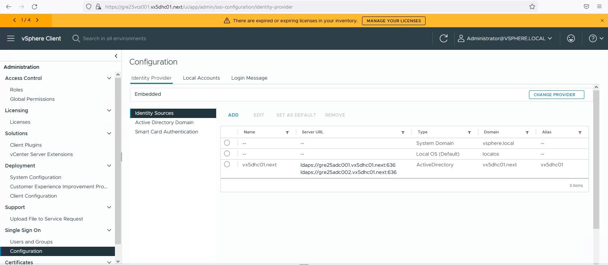

  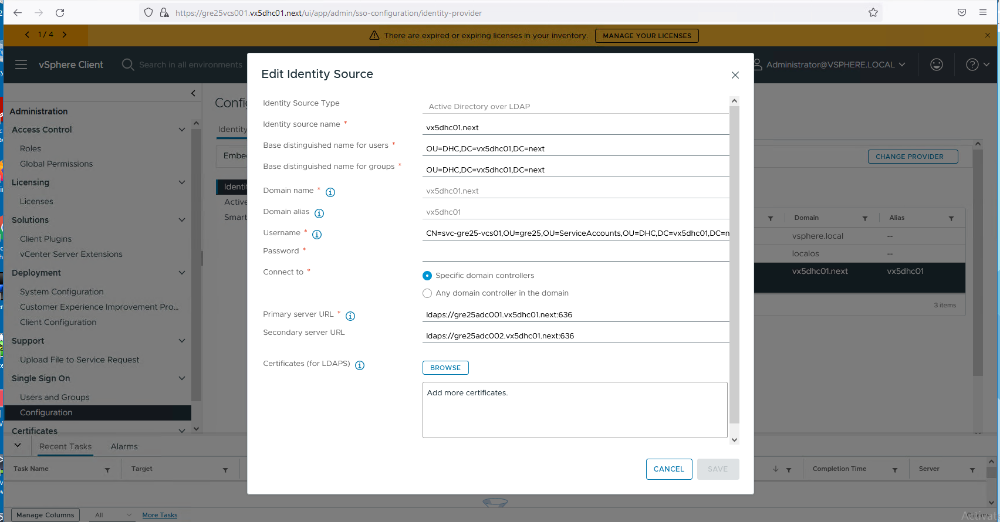

  If `Active Directory (Integrated Windows Authentication)` is still there then it can be reconfigured by executing playbook from `update` repository. It requires `manage` to be also in the same branch because playbook uses task from `manage` repository:

  ```bash
  ansible-playbook configureLdapVcenter.yml
  ```

### Power off Avamar proxies

Powered on Avamar proxies do not allow hosts to enter maintenance mode. Before you start upgrade, power off all avamar proxies on the cluster. Avamar proxies have `<locationCode>avp00X` VM name.

### Enable VCF bundle download token in SDDC manager

Starting 23.04.2025 Broadcom changed the way how bundles are downloaded by SDDC manager. There is a need to generate download token in Broadcom support portal and adjust files on SDDC manager. Procedure is explained in following KB article:

[VCF authenticated downloads configuration update instructions](https://knowledge.broadcom.com/external/article/390098)

Only step 1 (Download Token) is required to be done, there is no need to proceed with step 2 in the KB (Update the Download repository URLs for each Product / Component).
Obtaining a token is a prerequisite to run an automation prepared for step 2 as the playbook asks for it via prompt.

Please execute following playbook from */opt/dhc/update* on ans001:

```yaml
ansible-playbook enableVcfBundleDownloadToken.yml
```

NOTE: If there is any need to configure download token again (for example after SDDC upgrade if settings are lost) there is a playbook in */opt/dhc/manage* which can be used for this purpose:

```yaml
ansible-playbook configureVcfDownloadToken.yml
```

### Check/Configure Proxy

 SDDC Manager is configured to work with "My VMware Depot" account, it connects the depot to access the bundles.
 VCS uses a proxy server to access the VMware depot and download the upgrade bundles.

 >NOTE: SDDC only supports proxy servers that do not require authentication.

 Proxy server should be already configured for SDDC Manager but if there is any problem to get to VMware depot please check the configuration:

- Connect via SSH to SDDC Manager `<locationCode>sdm001` VM with the user name `vcf`
- Execute `su` command and provide root password
- Open `/opt/vmware/vcf/lcm/lcm-app/conf/application-prod.properties` file and verify whether the following settings are correct for your specific environment:

  ```yaml
    lcm.depot.adapter.proxyEnabled=true  
    lcm.depot.adapter.proxyHost='proxy IP address'  
    lcm.depot.adapter.proxyPort='proxy port'  
  ```

If any modification of the file are needed, remember to restart the lcm service afterwards for the new settings to kick in:

- Execute `systemctl restart lcm` command
- Wait 5 minutes and then download the bundles.

## Upgrade procedure

### Upgrade SDDC Manager

Estimated Upgrade Time: 45 min

- Ensure you have a recent successful backup of SDDC Manager using an external SFTP server, as described in the `Prerequisites` section.
- Ensure you have taken a snapshot of the SDDC Manager appliance and that you have recent successful backups of the components managed by SDDC Manager, including vCenter Server.
- Go to `Inventory` > `Workload Domains` > `(location code)-m01` management domain > `Updates/Patches`
- Execute the upgrade pre-check before every upgrade bundle installation. Ensure that the pre-check results are green before proceeding. A failed pre-check may cause the update to fail.

  

  >NOTE: If pre-check results are red, please resolve any problems and re-run the pre-check until it passes successfully. Solutions to some recurring problems might be listed in the `Known issues` chapters of this work instruction and also in older upgrade instructions.
- Expand the `Available updates` and from the `Select Cloud Foundation version` drop-down menu, select `Cloud Foundation 5.2.0.0`.

PRECHECK ERROR FIX NOTES:

If during precheck from 4.5.2 to 5.2.0 you see `vSphere SHA-1 validation` and `spherelet-version-mismatch-precheck` errors then re-run precheck - these two errors should dissappear.

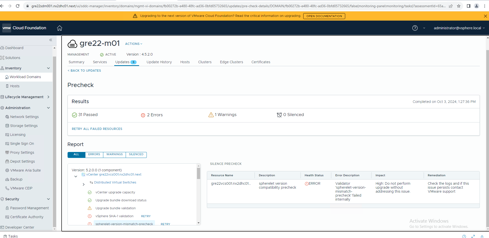

If precheck shows vSAN HCL DB Out of Date error then it can be fixed by executing SDDC Manager API call vSanHcl. Navigate to `Developer Center` > `API Explorer` > `Developer Center` > `vSanHcl`. Open `PATCH /v1/vsan-hcl`, click `EXECUTE` and `CONTINUE`. Finally in `Response` section `Status: 202, Accepted appears`. Error is extensively described [vSAN HCL DB out of date - How to update via SDDC manager](https://stephanmctighe.com/2025/03/13/vsan-hcl-db-out-of-date-how-to-update-via-sddc-manager/)

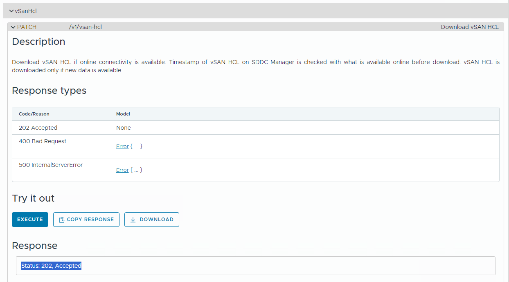

  This upgrade bundle should be visible:

  ```yaml
  - VMware Cloud Foundation Update 5.2.0.0
  Released: Jul 22, 2024
  Size: 2 GB
  Version: 5.5.0-224290
  Description: The upgrade bundle for VMware Cloud Foundation 5.2 contains features, critical bugs and security fixes. For more information, see https://docs.vmware.com/en/VMware-Cloud-Foundation/5.2/rn/vmware-cloud-foundation-52-release-notes/index.html. For VMware Cloud Foundation Skip Upgrade Dependency on WCP, refer to https://kb.vmware.com/s/article/88962.
  Bundle ID: b5ef5cb1-7dee-4b11-8abf-1dc42022662f
  Update to Version: 5.2.0.0-24108943
  Description: SDDC Manager version update

  ```

- Download the bundle and click `Update Now` or `Schedule Update` depending on your schedule/timeline and follow the upgrade steps. If upgrade will fail during `Update VCF Service and Platform rpms` follow fix procedure described in [KB 374980](https://knowledge.broadcom.com/external/article/374980/sddc-upgarde-to-52-fails-on-update-vcf-s.html).

 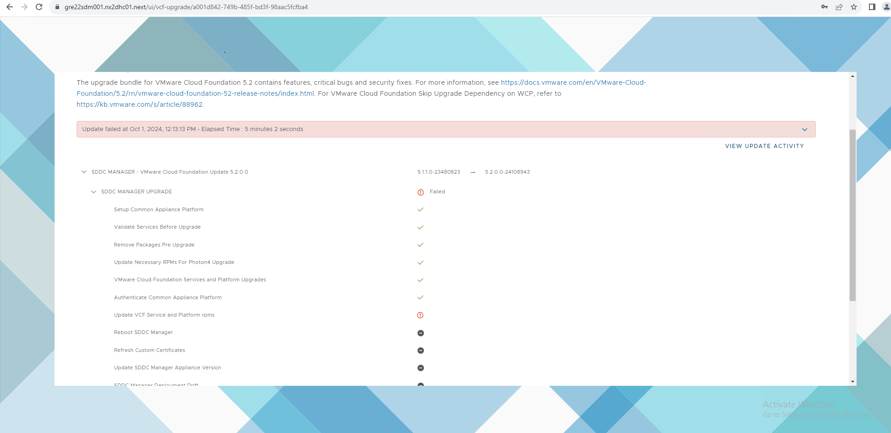

  >TIP: It's worth to refresh the update status page, as it often reports *In progress* state thought the upgrade is already *Finished*.

### Apply VMware Cloud Foundation Configuration Updates

Estimated Upgrade Time: 20 min

Please follow section [Apply VMware Cloud Foundation Configuration Updates](https://techdocs.broadcom.com/us/en/vmware-cis/vcf/vcf-5-2-and-earlier/5-2/vmware-cloud-foundation-lifecycle-management/upgrade-the-management-domain-to-vmware-cloud-foundation-5-2-lifecycle/apply-configuration-updates-lifecycle.html)

### Virtual Infrastructure Layer in Management Domain

Next step is to upgrade the virtual infrastructure layer in Management Domain:

- NSX-T Data Center:
  - NSX-T Edge cluster
  - NSX-T Host cluster
  - NSX-T Manager cluster
- vCenter Server
- ESXi hosts

> Note: All NSX-T components (Edge cluster, Host cluster and Manager cluster) are upgraded by a single bundle.

Verify that you have recent backups of the NSX-T Manager nodes and the vCenter Server virtual machines.

#### NSX-T Data Center

Estimated Upgrade Time: 3 h

- Ensure you have a recent successful backup of NSX-T in NSX-T manager.
- Go to `Inventory` > `Workload Domains` > `<locationCode>-m01` management domain > `Updates/Patches`
- Execute the upgrade pre-check before every upgrade bundle installation. Fix errors if there are any.

PRECHECK ERROR FIX NOTES:

If during precheck from 4.5.2 to 5.2.0 you see `vSphere SHA-1 validation` and `spherelet-version-mismatch-precheck` errors then re-run precheck - these two errors should dissapear.


If precheck shows vSAN HCL DB Out of Date error then it can be fixed by executing SDDC Manager API call vSanHcl. Navigate to `Developer Center` > `API Explorer` > `Developer Center` > `vSanHcl`. Open `PATCH /v1/vsan-hcl`, click `EXECUTE` and `CONTINUE`. Finally in `Response` section `Status: 202, Accepted appears`. Error is extensively described [vSAN HCL DB out of date - How to update via SDDC manager](https://stephanmctighe.com/2025/03/13/vsan-hcl-db-out-of-date-how-to-update-via-sddc-manager/)


- Expand the `Available updates`, `Target Version 5.2.0.0` NSX Data Center upgrade should appear:

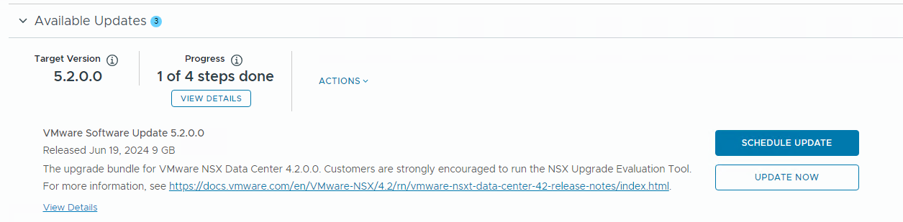

  NSX Data Center upgrade bundle details:

  ```yaml
  - VMware Cloud Foundation Update 5.2.0.0
  Released: Jul 22, 2024
  Size: 9 GB
  Version: 5.5.10-224293
  Info: The upgrade bundle for VMware NSX Data Center 4.2.0.0. Customers are strongly encouraged to run the NSX Upgrade Evaluation Tool. For more information, see https://docs.vmware.com/en/VMware-NSX/4.2/rn/vmware-nsxt-data-center-42-release-notes/index.html.
  Bundle ID: e1c44d55-e97a-4227-ab04-db6f37ece0de
  Update to Version: 4.2.0.0.0-24105817
  Description: NSX_T_MANAGER Update Bundle

  ```

BUGFIX NOTE: If after SDDC upgrade, the NSX upgrade bundle is not listed in the available updates and progress section states "step 1 of 1" (instead of "1 of 4") as below:

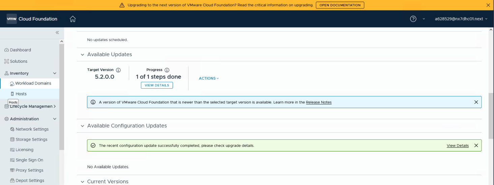

Follow kb [Bypass SDDC Manager upgrade compatibility checks when upgrade is unavailable due to missing compatibility data](https://knowledge.broadcom.com/external/article/323368/bypass-sddc-manager-upgrade-compatibilit.html) to fix this problem.

- Download the bundle and click `Update Now` or `Schedule Update` depending on your schedule/timeline and follow the upgrade steps described here: [Upgrade NSX for VMware Cloud Foundation 5.2.x](https://techdocs.broadcom.com/us/en/vmware-cis/vcf/vcf-5-2-and-earlier/5-2/vmware-cloud-foundation-lifecycle-management/upgrade-the-management-domain-to-vmware-cloud-foundation-5-2-lifecycle/upgrade-nsx-for-vcf-5-2-lifecycle.html).
- In case of having multiple Edge and/or Host cluster, it's possible to upgrade them sequentially, instead of in parallel (which is the default behavior). To enable sequential upgrade, select the relevant options:

The downside to doing it sequentially is the prolonged upgrade time, but on the other hand, it gives you better control over the upgrade process. Of course, in case of having only a single Edge and/or Host cluster, this is irrelevant.
- After NSX-T was upgraded check if new alarm is triggered: [Remote Logging Not Configured](https://knowledge.broadcom.com/external/article?legacyId=92742)  
In order to set up the Remote Logging apply the mention KB for NSX or run the playbook:  

```yml
~/dhc/update$ ansible-playbook configureNsxRemoteLogging.yml -e domainType=Management -v
```

- Once NSX-T Data Center is upgraded, perform an [Operational Verification of VMware NSX-T Data Center](https://techdocs.broadcom.com/us/en/vmware-cis/vcf/vcf-5-2-and-earlier/4-5/vmware-cloud-foundation-operations-4-5/operational-verification-of-vmware-cloud-foundation-operations/operational-verification-of-vmware-nsx-t-data-center-operations.html).

#### vCenter Server

Estimated Upgrade Time: 2 h

- Ensure that you have new license for vSAN version 8th.
- Ensure that you have a temporary IP address in the management subnet (it is a migration from vCenter 7 to vCenter 8).
- Ensure you have a recent successful backup of all the vCenter appliances sharing the same SSO domain.
- Verify if there is a succesfull backup through VAMI (port 5480).
- If possible, create offline (with both VC VMs powered down) snapshots of both vCenter VMs at the same time. This is to ensure a consistent state of both servers (especially regarding the replication between them) in case a need arises to revert the state.
- If possible, redo the [Upgrade Prerequisites](#upgrade-prerequisites) no. 3 (replication check), 5 (lsdoctor check) and 6 (VC status check after the last upgrade, if applicable)
- Go to `Inventory` > `Workload Domains` > `(customerCode)-(locationCode)-m01` management domain > `Updates/Patches`
- Execute the upgrade pre-check before every upgrade bundle installation.

PRECHECK ERROR FIX NOTES:

If during precheck from 4.5.2 to 5.2.0 you see `vSphere SHA-1 validation` and `spherelet-version-mismatch-precheck` errors then re-run precheck - these two errors should dissapear.


- Expand the `Available updates`, `Target Version 5.2.0.0` vCenter Server upgrade should appear.

  vCenter Server upgrade bundle details:

  ```yaml
  - VMware Cloud Foundation Update 5.2.0.0
  Released: Jul 22, 2024
  Size: 18 GB
  Version: 5.5.12-224295
  Info: The upgrade bundle for VMware vCenter Server 8.0.3. For more information, see https://docs.vmware.com/en/VMware-vSphere/8.0.3/rn/vsphere-vcenter-server-803-release-notes.html.
  Bundle ID: d715084c-c989-4089-8571-6e353a49e5d4
  Update to Version: 8.0.3.00100-24091160
  Description: VMware vCenter Server Update Bundle

  ```

- Click `Update Now` or `Schedule Update` depending on your schedule/timeline and follow the upgrade steps described here: [Upgrade vCenter Server for VMware Cloud Foundation 5.2.x](https://techdocs.broadcom.com/us/en/vmware-cis/vcf/vcf-5-2-and-earlier/5-2/vmware-cloud-foundation-lifecycle-management/upgrade-the-management-domain-to-vmware-cloud-foundation-5-2-lifecycle/upgrade-vcenter-server-for-vmware-cloud-foundation-5-2-lifecycle.html). It is required to use temporary IP address during the upgrade.
- Perform license verification from vCenter and SDDC perspective:
  - Go to `vCenter` > `Administration` > `Licensing` > `Licenses` (check also `Assets`).
  - Go to SDDC Manager `Administration` > `Licenses` and add proper license keys. Then check if there are any errors/communicates stating that vCenter is in Evaluation license mode.
  - If there are any licensing type issues then the best way is to import them through SDDC Manager. See section [Re-licensing](#re-licensing).
- Once vCenter is upgraded, perform an [Operational Verification of vSphere](https://techdocs.broadcom.com/us/en/vmware-cis/vcf/vcf-5-2-and-earlier/4-5/vmware-cloud-foundation-operations-4-5/operational-verification-of-vmware-cloud-foundation-operations/operational-verification-of-vsphere-operations.html#GUID-D8629B82-9BEB-4E2D-ABB6-D50E9657D58B-en), including the verification of the possibility to [access vCenter using an Active Directory account](https://techdocs.broadcom.com/us/en/vmware-cis/vcf/vcf-5-2-and-earlier/4-5/verify-authentication-to-vcenter-server-as-a-cloud-admin.html).
- After the vCenter upgrade, please repeat the [Upgrade Prerequisites](#upgrade-prerequisites) no. 3, 5 and 6.

##### Backup Tag

- Ensure that the newly deployed vCenter VM has the backup tag manually added, as backup tags are not automatically inherited during the vCenter migration.
- Refer **Backup LLD** for backup tags: [List of the VMs and its tags for backup](../design/lldBackup.md#list-of-the-vms-and-its-tags-for-backup)

#### ESXi hosts

Estimated Upgrade Time: 3 h

> **If there is a need to add custom drivers during the ESXi upgrade process, please follow the steps described in chapter `Upgrade ESXi with VMware Cloud Foundation Stock ISO and Async NIC Driver` in [dhcDellEsxiUpgradeWithCustomImages.md](dhcDellEsxiUpgradeWithCustomImages.md) document, however the process was not tested for VCS 2.0*

- Ensure that you have new license for vSphere version 8th.
- Go to `Inventory` > `Workload Domains` > `(customerCode)-(locationCode)-m01` management domain > `Updates/Patches`
- Execute the upgrade pre-check before every upgrade bundle installation. Fix errors if there are any.
- Expand the `Available updates`, `Target Version 5.2.0.0` ESXi hosts upgrade should appear.

  ESXi hosts upgrade bundle details:

  ```yaml
  - VMware Cloud Foundation Update 5.2.0.0
  Released: Jul 22, 2024
  Size: 606 MB
  Version: 5.5.24-224292
  The upgrade bundle for VMware ESXi 8.0.3. For more information, see https://docs.vmware.com/en/VMware-vSphere/8.0.3/rn/vsphere-esxi-803-release-notes.html. Cumulative Bundle
  Bundle ID: 52dbedc6-845e-4485-af50-fc59e44283a5
  Update to Version: 8.0.3-24022510
  Description: VMware ESXi Server Update Bundle

  ```

- Click `Update Now` or `Schedule Update` depending on your schedule/timeline and follow the upgrade steps described here [Upgrade ESXi for VMware Cloud Foundation](https://techdocs.broadcom.com/us/en/vmware-cis/vcf/vcf-5-2-and-earlier/5-2/vmware-cloud-foundation-lifecycle-management/upgrade-the-management-domain-to-vmware-cloud-foundation-5-2-lifecycle/upgrade-esxi-for-vmware-cloud-foundation-5-2-1-lifecycle.html).
- Perform license verification from vCenter and SDDC perspective:
  - Go to `vCenter` > `Administration` > `Licensing` > `Licenses` (check also `Assets`).
  - Go to SDDC Manager `Administration` > `Licenses` and add proper license keys. Then check if there are any errors/communicates stating that vCenter is in Evaluation license mode.
  - If there are any licensing type issues then the best way is to import them through SDDC Manager. See section [Re-licensing](#re-licensing).

 

- Once ESXi hosts are upgraded, perform an [Operational Verification of vSphere](https://techdocs.broadcom.com/us/en/vmware-cis/vcf/vcf-5-2-and-earlier/4-5/vmware-cloud-foundation-operations-4-5/operational-verification-of-vmware-cloud-foundation-operations/operational-verification-of-vsphere-operations.html#GUID-D8629B82-9BEB-4E2D-ABB6-D50E9657D58B-en).

#### vSAN Disk format change

Estimated Upgrade Time: 10 min

It is required to change VSAN disk version after upgrade. In `vcs001` click on `(customerCode)-(locationCode)-m01-cluster01` and navigate to `vSAN` > `Disk Management`. Current disk version will be visible:

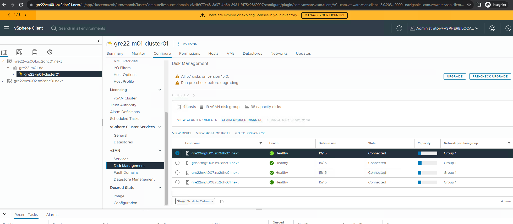

Click `PRE-CHECK UPGRADE`, result should be green:

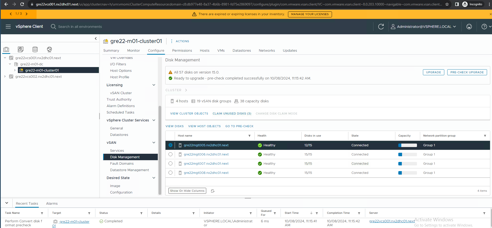

If precheck is green, click `UPGRADE`:

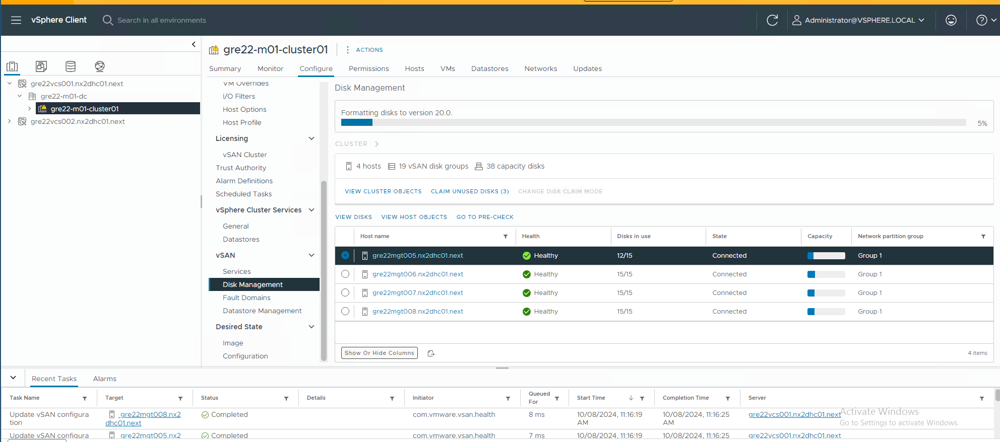

Finally all disks will be upgraded to proper version:

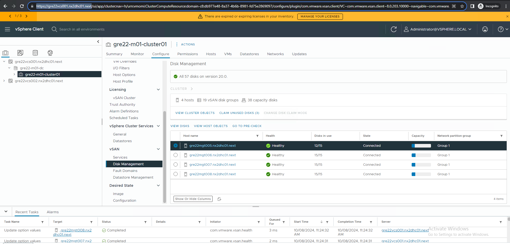

Broadcom source for [Upgrade vSAN on-disk format versions](https://techdocs.broadcom.com/us/en/vmware-cis/vcf/vcf-5-2-and-earlier/5-2/vmware-cloud-foundation-lifecycle-management/upgrade-the-management-domain-to-vmware-cloud-foundation-5-2-lifecycle/upgrade-vsan-on-disk-format-versions-lifecycle.html).

#### vSAN Witness Hosts

In case of vSAN stretched clusters, vSphere Lifecycle Manager (vLCM) depot must be used to upgrade vSAN Witness Host. Please follow steps described in section [Upgrade vSAN Witness Host for VMware Cloud Foundation](https://techdocs.broadcom.com/us/en/vmware-cis/vcf/vcf-5-2-and-earlier/5-2/vmware-cloud-foundation-lifecycle-management/upgrade-the-management-domain-to-vmware-cloud-foundation-5-2-lifecycle/upgrade-esxi-with-vsphere-lifecycle-manager-baselines-for-vmware-cloud-foundation-5-2-lifecycle/upgrade-vsan-witness-hosts-lifecycle.html) documentation.

Here's the [VMware Cloud Foundation 5.2 Release Notes](https://techdocs.broadcom.com/us/en/vmware-cis/vcf/vcf-5-2-and-earlier/5-2/vcf-release-notes/vmware-cloud-foundation-52-release-notes.html#GUID-f60d3a56-6059-4012-ad44-cabf313ce6ac-en_id-0ca57a6f-9a25-40f4-d248-8489e66cf554) link, with the Bill of Materials listing the correct version of VSAN Witness Appliance to upgrade to.

#### Re-licensing

Estimated Upgrade Time: 20 min

During migration from vSAN and vSphere 7 to 8 re-licensing is required. Below we see that ESXi and vSAN require new licenses. More info [Update licenses for a workload domain lifecycle](https://techdocs.broadcom.com/us/en/vmware-cis/vcf/vcf-5-2-and-earlier/5-2/vmware-cloud-foundation-lifecycle-management/upgrade-the-management-domain-to-vmware-cloud-foundation-5-2-lifecycle/update-licenses-for-a-workload-domain-lifecycle.html).

> Note: If when trying to add the license you get the Error: "Failed to add license: The SDDC Manager is unable to recognize the license key" , follow [KB375046](https://knowledge.broadcom.com/external/article/375046/the-sddc-manager-is-unable-to-recognize.html) or run playbook: `relicense201Fix.yml` from `update`.  
example: `ans001:~/dhc/update$ ansible-playbook relicense201Fix.yml -v`

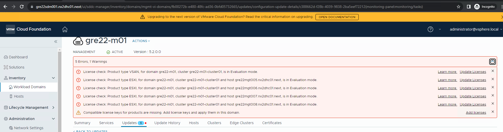

It can be done from SDDC manager. If licenses are already added to SDDC manager and you see errors as show above then click on `Update Licenses`, choose `vSAN` and click `NEXT`:

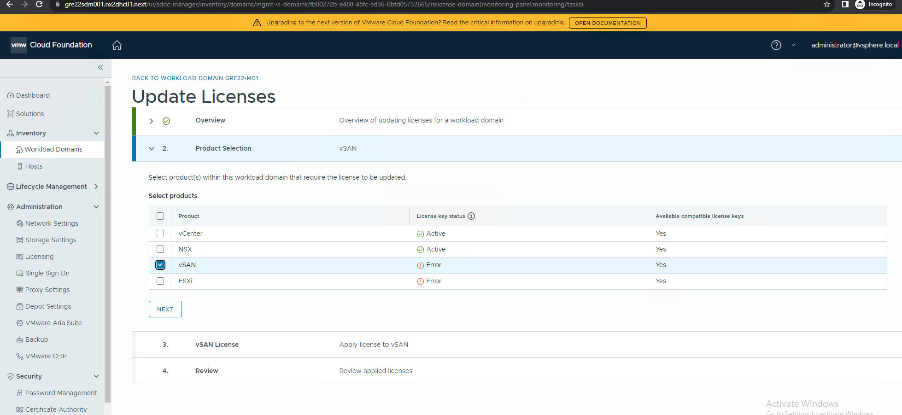

Select proper license and click `NEXT`:

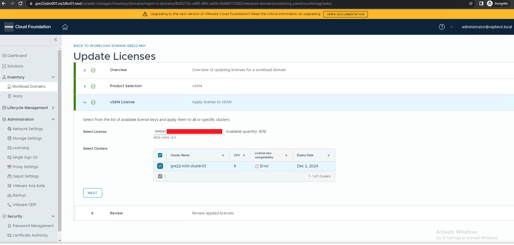

Click `SUBMIT`:

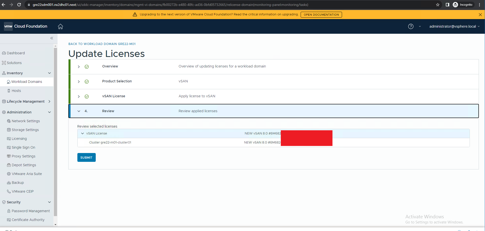

New license is being applied:

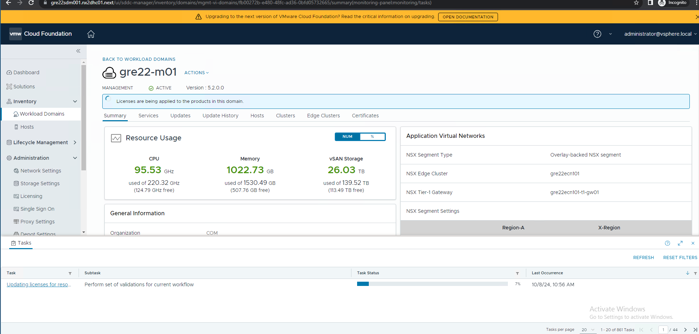

Now we must do the same for ESXi hosts, so click `Update Licenses`:

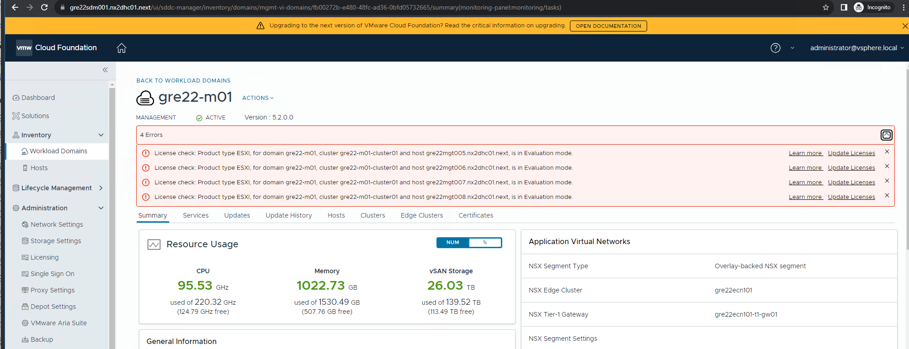

Choose `ESXi` and click `NEXT`:

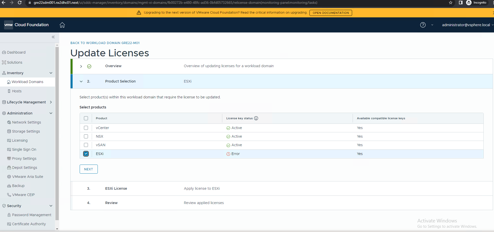

Select proper license and click `NEXT`:

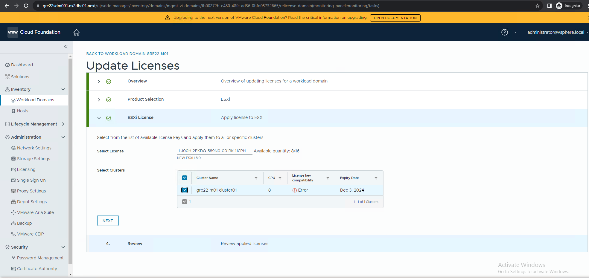

Click `SUBMIT`:

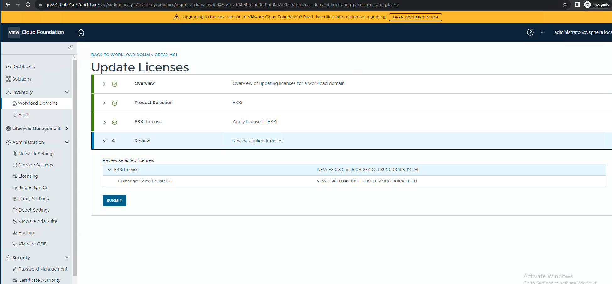

New license in being applied:

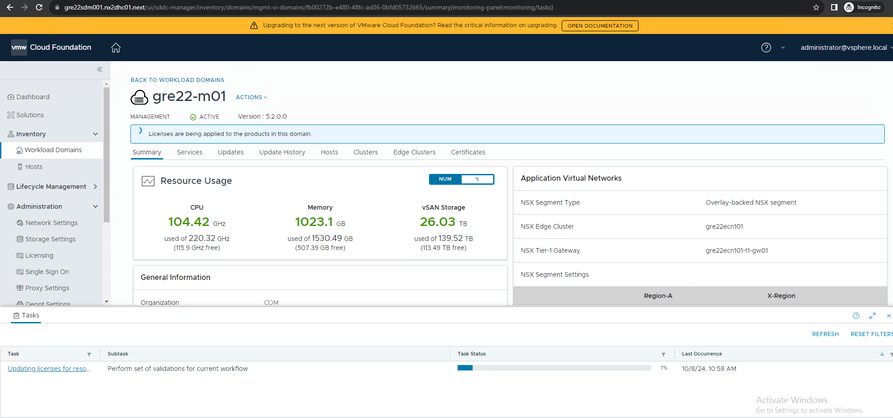

Licensing errors have been cleared.

#### Distributed switch upgrade

Estimated Upgrade Time: 10 min

Important note: Procedure describes upgrade from version 7 to 8 only. Initial versions lower than 7 are not reflected below and upgrade procedure can be different.

Please make a configuration backup of distributed switch before upgrade. For more details see [Back Up and Restore a vSphere Distributed Switch Configuration](https://techdocs.broadcom.com/us/en/vmware-cis/vsphere/vsphere/8-0/vsphere-networking-8-0/networking-backup-and-restore/exporting-importing-and-restoring-vsphere-distributed-switch-configurations.html#GUID-BE48C292-F222-4095-BCF8-D6444A785E16-en).

Upgrade procedure is also described by Broadcom [Upgrade vSphere distributed switch versions lifecycle](https://techdocs.broadcom.com/us/en/vmware-cis/vcf/vcf-5-2-and-earlier/5-2/vmware-cloud-foundation-lifecycle-management/upgrade-the-management-domain-to-vmware-cloud-foundation-5-2-lifecycle/upgrade-vsphere-distributed-switch-versions-lifecycle.html).

Before an upgrade example version is `7.0.0`:

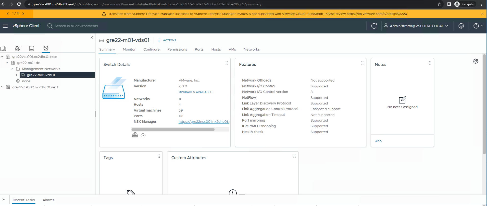

Click on `Upgrade Distributed Switch`:

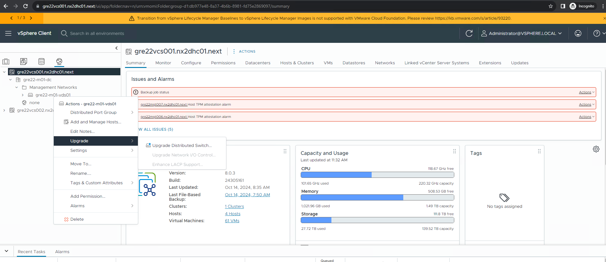

Choose version `8.0.3`:

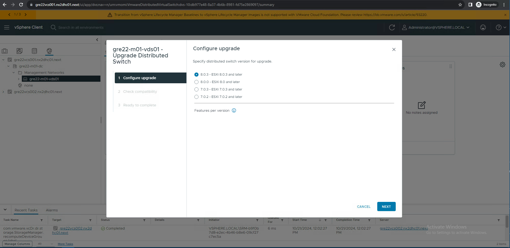

Check compatibility and click `NEXT`:

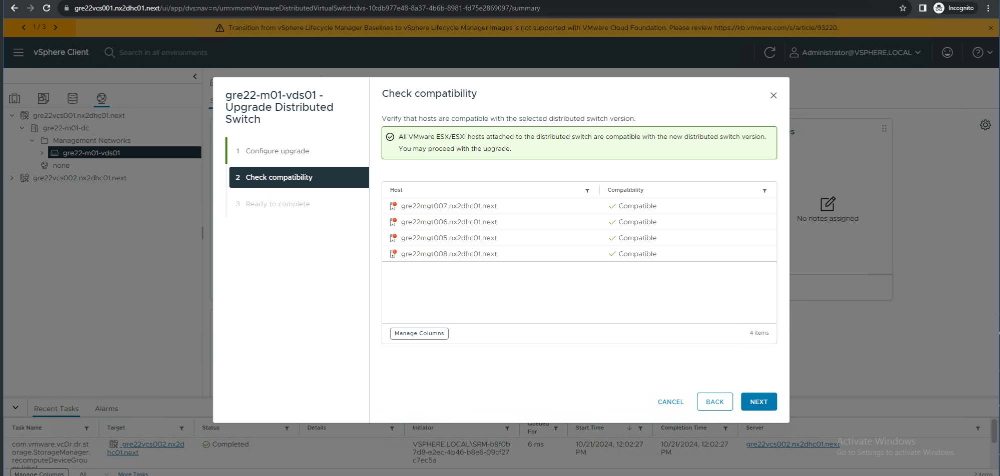

Review selections and click `FINISH`:

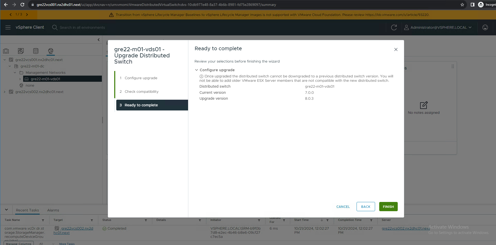

Check status of upgrade task and new distributed switch version:

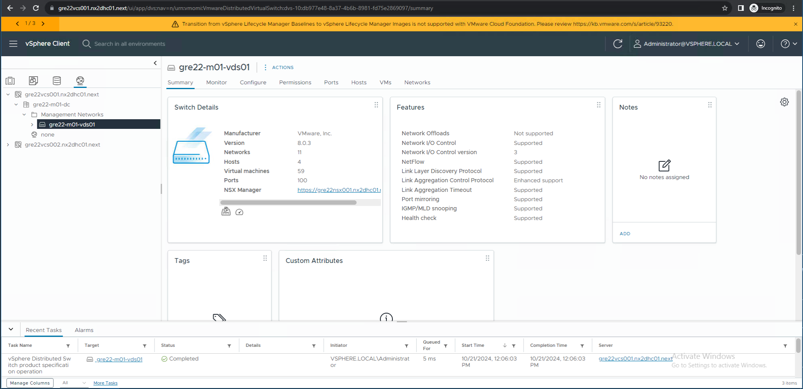

#### Apply VMware Cloud Foundation Configuration Updates

Estimated Upgrade Time: 20 min

Configuration updates may be required after you apply software updates.  

- In the navigation pane, click `Inventory` > `Workload Domains`(Select target domain) > `Updates` > `Available Configuration Updates` > `Apply All`.  
Please follow section [Apply VMware Cloud Foundation Configuration Updates](https://techdocs.broadcom.com/us/en/vmware-cis/vcf/vcf-5-2-and-earlier/5-2/vmware-cloud-foundation-lifecycle-management/upgrade-the-management-domain-to-vmware-cloud-foundation-5-2-lifecycle/apply-configuration-updates-lifecycle.html) if needed.

### Post-checks

To confirm the Management domain is fully upgraded to ver. 5.2.0.0, log in to SDDC Manager and go to `Lifecycle Management` > `Release Versions`. Management domain should be visible in `Available Cloud Foundation Versions`, version 5.2.0.0.

### Virtual Infrastructure Layer in Workload Domain

Once the upgrade of management domain is finished, the next step is to upgrade the Virtual Infrastructure in Workload Domain.

- NSX-T Data Center:
  - NSX-T Edge cluster
  - NSX-T Host cluster
  - NSX-T Manager cluster
- vCenter Server
- ESXi hosts

> Note: All NSX-T components (Edge cluster, Host cluster and Manager cluster) are upgraded by a single bundle.

Verify that you have recent backups of the NSX-T Manager nodes and the vCenter Server virtual machines.

Before proceeding with a VI workload domain upgrade you must first plan the upgrade to your target version.  

- In the navigation pane, click `Inventory` > `Workload Domains`.
- On the Workload Domains page, click the workload domain you want to upgrade and click the `Updates` tab.
- Under `Available Updates`, click `PLAN UPGRADE`.
- Select the target version ( 5.2.0 ) from the drop-down, and click `NEXT`
- On the Plan Upgrade for VMware Cloud Foundation screen, review the versions, and click `CONFIRM`


#### NSX-T Data Center

Estimated Upgrade Time: 3 h

- Ensure you have a recent successful backup of NSX-T in NSX-T manager.
- Go to `Inventory` > `Workload Domains` > `(customerCode)-(locationCode)-c01` compute domain > `Updates/Patches`
- Execute the upgrade pre-check before every upgrade bundle installation. Fix errors if there are any.

> Note: Following error can be reported during pre-check: NSX Edge Cluster credentials check failed internally.

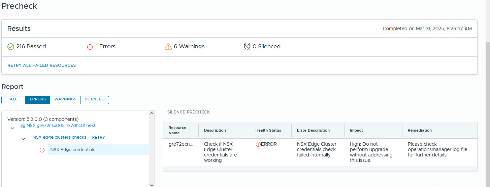

This issue is cosmetic and can be safely ignored as it is decribed by Broadcom [SDDC manager pre-check reports NSX edge issue](https://knowledge.broadcom.com/external/article/374568/sddc-manager-precheck-reports-nsx-edge-c.html)

- Expand the `Available updates`, `Target Version 5.2.0.0` NSX Data Center upgrade should appear:


  NSX Data Center upgrade bundle details:

  ```yaml
  - VMware Cloud Foundation Update 5.2.0.0
  Released: Jul 22, 2024
  Size: 9 GB
  Version: 5.5.10-224293
  Info: The upgrade bundle for VMware NSX Data Center 4.2.0.0. Customers are strongly encouraged to run the NSX Upgrade Evaluation Tool. For more information, see https://docs.vmware.com/en/VMware-NSX/4.2/rn/vmware-nsxt-data-center-42-release-notes/index.html.
  Bundle ID: e1c44d55-e97a-4227-ab04-db6f37ece0de
  Update to Version: 4.2.0.0.0-24105817
  Description: NSX_T_MANAGER Update Bundle

  ```

- Download the bundle and click `Update Now` or `Schedule Update` depending on your schedule/timeline and follow the upgrade steps described here: [Upgrade NSX for VMware Cloud Foundation 5.2.x](https://techdocs.broadcom.com/us/en/vmware-cis/vcf/vcf-5-2-and-earlier/5-2/vmware-cloud-foundation-lifecycle-management/upgrade-workload-domains-to-vcf-5-2-lifecycle/GUID-2D0DF7AF-4FE6-4A8C-AC2E-275E7F23FEBA_copy-lifecycle.html).
- In case of having multiple Edge and/or Host cluster, it's possible to upgrade them sequentially, instead of in parallel (which is the default behavior). To enable sequential upgrade, select the relevant options:

The downside to doing it sequentially is the prolonged upgrade time, but on the other hand, it gives you better control over the upgrade process. Of course, in case of having only a single Edge and/or Host cluster, this is irrelevant.
- After NSX-T was upgraded check if new alarm is triggered: [Remote Logging Not Configured](https://knowledge.broadcom.com/external/article?legacyId=92742)  
In order to set up the Remote Logging apply the mention KB for NSX or run the playbook:  

```yml
~/dhc/update$ ansible-playbook configureNsxRemoteLogging.yml -e domainType=Management -v
```

- Once NSX-T Data Center is upgraded, perform an [Operational Verification of VMware NSX-T Data Center](https://techdocs.broadcom.com/us/en/vmware-cis/vcf/vcf-5-2-and-earlier/4-5/vmware-cloud-foundation-operations-4-5/operational-verification-of-vmware-cloud-foundation-operations/operational-verification-of-vmware-nsx-t-data-center-operations.html).

#### vCenter Server

Estimated Upgrade Time: 2 h

- Ensure that you have new license for vSAN version 8th.
- Ensure that you have a temporary IP address in the management subnet (it is a migration from vCenter 7 to vCenter 8).
- Ensure you have a recent successful backup of all the vCenter appliances sharing the same SSO domain.
- Verify if there is a succesfull backup through VAMI (port 5480).
- If possible, create offline (with both VC VMs powered down) snapshots of both vCenter VMs at the same time. This is to ensure a consistent state of both servers (especially regarding the replication between them) in case a need arises to revert the state.
- If possible, redo the [Upgrade Prerequisites](#upgrade-prerequisites) no. 3 (replication check), 5 (lsdoctor check) and 6 (VC status check after the last upgrade, if applicable)
- Go to `Inventory` > `Workload Domains` > `(customerCode)-(locationCode)-c01` compute domain > `Updates/Patches`
- Execute the upgrade pre-check before every upgrade bundle installation. If during precheck from 4.5.2 to 5.2.0 you see `vSphere SHA-1 validation` and `spherelet-version-mismatch-precheck` errors then re-run precheck - these two errors should dissapear.


- Expand the `Available updates`, `Target Version 5.2.0.0` vCenter Server upgrade should appear.

  vCenter Server upgrade bundle details:

  ```yaml
  - VMware Cloud Foundation Update 5.2.0.0
  Released: Jul 22, 2024
  Size: 18 GB
  Version: 5.5.12-224295
  Info: The upgrade bundle for VMware vCenter Server 8.0.3. For more information, see https://docs.vmware.com/en/VMware-vSphere/8.0.3/rn/vsphere-vcenter-server-803-release-notes.html.
  Bundle ID: d715084c-c989-4089-8571-6e353a49e5d4
  Update to Version: 8.0.3.00100-24091160
  Description: VMware vCenter Server Update Bundle
  
  ```

- Click `Update Now` or `Schedule Update` depending on your schedule/timeline and follow the upgrade steps described here: [Upgrade vCenter Server for VMware Cloud Foundation 5.2.x](https://techdocs.broadcom.com/us/en/vmware-cis/vcf/vcf-5-2-and-earlier/5-2/vmware-cloud-foundation-lifecycle-management/upgrade-workload-domains-to-vcf-5-2-lifecycle/GUID-A2E3B776-F64A-42B5-8266-51FF74B96D6C_copy-lifecycle.html). It is required to use temporary IP address during the upgrade.
- Perform license verification from vCenter and SDDC perspective:
  - Go to `vCenter` > `Administration` > `Licensing` > `Licenses` (check also `Assets`).
  - Go to SDDC Manager `Administration` > `Licenses` and add proper license keys. Then check if there are any errors/communicates stating that vCenter is in Evaluation license mode.
  - If there are any licensing type issues then the best way is to import them through SDDC Manager. See section [Re-licensing](#re-licensing).
- Once vCenter is upgraded, perform an [Operational Verification of vSphere](https://techdocs.broadcom.com/us/en/vmware-cis/vcf/vcf-5-2-and-earlier/4-5/vmware-cloud-foundation-operations-4-5/operational-verification-of-vmware-cloud-foundation-operations/operational-verification-of-vsphere-operations.html#GUID-D8629B82-9BEB-4E2D-ABB6-D50E9657D58B-en), including the verification of the possibility to [access vCenter using an Active Directory account](https://techdocs.broadcom.com/us/en/vmware-cis/vcf/vcf-5-2-and-earlier/4-5/verify-authentication-to-vcenter-server-as-a-cloud-admin.html).
- After the vCenter upgrade, please repeat the [Upgrade Prerequisites](#upgrade-prerequisites) no. 3, 5 and 6.

##### Backup Tag

- Ensure that the newly deployed vCenter VM has the backup tag manually added, as backup tags are not automatically inherited during the vCenter migration.
- Refer **Backup LLD** for backup tags: [List of the VMs and its tags for backup](../design/lldBackup.md#list-of-the-vms-and-its-tags-for-backup)

#### ESXi hosts

Estimated Upgrade Time: 3 h

> **If there is a need to add custom drivers during the ESXi upgrade process, please follow the steps described in chapter `Upgrade ESXi with VMware Cloud Foundation Stock ISO and Async NIC Driver` in [dhcDellEsxiUpgradeWithCustomImages.md](dhcDellEsxiUpgradeWithCustomImages.md) document, however the process was not tested for VCS 2.0*

- Ensure that you have new license for vSphere version 8th.
- Go to `Inventory` > `Workload Domains` > `(customerCode)-(locationCode)-c01` compute domain > `Updates/Patches`
- Execute the upgrade pre-check before every upgrade bundle installation. Fix errors if there are any.
- Expand the `Available updates`, `Target Version 5.2.0.0` ESXi hosts upgrade should appear.

  ESXi hosts upgrade bundle details:

  ```yaml
  - VMware Cloud Foundation Update 5.2.0.0
  Released: Jul 22, 2024
  Size: 606 MB
  Version: 5.5.24-224292
  The upgrade bundle for VMware ESXi 8.0.3. For more information, see https://docs.vmware.com/en/VMware-vSphere/8.0.3/rn/vsphere-esxi-803-release-notes.html. Cumulative Bundle
  Bundle ID: 52dbedc6-845e-4485-af50-fc59e44283a5
  Update to Version: 8.0.3-24022510
  Description: VMware ESXi Server Update Bundle

  ```

- Click `Update Now` or `Schedule Update` depending on your schedule/timeline and follow the upgrade steps described here: [Upgrade ESXi for VMware Cloud Foundation](https://techdocs.broadcom.com/us/en/vmware-cis/vcf/vcf-5-2-and-earlier/5-2/vmware-cloud-foundation-lifecycle-management/upgrade-workload-domains-to-vcf-5-2-lifecycle/GUID-DEEE8F6C-C95C-4491-96AA-F93B8803857C_copy-lifecycle.html).
- Perform license verification from vCenter and SDDC perspective:
  - Go to `vCenter` > `Administration` > `Licensing` > `Licenses` (check also `Assets`).
  - Go to SDDC Manager `Administration` > `Licenses` and add proper license keys. Then check if there are any errors/communicates stating that vCenter is in Evaluation license mode.
  - If there are any licensing type issues then the best way is to import them through SDDC Manager. See section [Re-licensing](#re-licensing).

 

- Once ESXi hosts are upgraded, perform an [Operational Verification of vSphere](https://techdocs.broadcom.com/us/en/vmware-cis/vcf/vcf-5-2-and-earlier/4-5/vmware-cloud-foundation-operations-4-5/operational-verification-of-vmware-cloud-foundation-operations/operational-verification-of-vsphere-operations.html#GUID-D8629B82-9BEB-4E2D-ABB6-D50E9657D58B-en).

#### vSAN Disk format change

Estimated Upgrade Time: 10 min

Follow the steps described in [Management Domain vSAN Disk format change](#vsan-disk-format-change) section but apply them to Workload domain if required.

#### vSAN Witness Hosts

In case of vSAN stretched clusters, vSphere Lifecycle Manager (vLCM) depot must be used to upgrade vSAN Witness Host. Please follow steps described in section [Upgrade vSAN Witness Host for VMware Cloud Foundation](https://techdocs.broadcom.com/us/en/vmware-cis/vcf/vcf-5-2-and-earlier/5-2/vmware-cloud-foundation-lifecycle-management/upgrade-the-management-domain-to-vmware-cloud-foundation-5-2-lifecycle/upgrade-esxi-with-vsphere-lifecycle-manager-baselines-for-vmware-cloud-foundation-5-2-lifecycle/upgrade-vsan-witness-hosts-lifecycle.html) documentation.

Here's the [VMware Cloud Foundation 5.2 Release Notes](https://techdocs.broadcom.com/us/en/vmware-cis/vcf/vcf-5-2-and-earlier/5-2/vcf-release-notes/vmware-cloud-foundation-52-release-notes.html#GUID-f60d3a56-6059-4012-ad44-cabf313ce6ac-en_id-0ca57a6f-9a25-40f4-d248-8489e66cf554) link, with the Bill of Materials listing the correct version of VSAN Witness Appliance to upgrade to.

#### Re-licensing

Estimated Upgrade Time: 20 min

During migration from vSAN and vSphere 7 to 8 re-licensing is required. Please follow steps described in [Management Domain re-licensing](#re-licensing) section but apply them to Workload domain components. More info [Update licenses for a workload domain lifecycle](https://techdocs.broadcom.com/us/en/vmware-cis/vcf/vcf-5-2-and-earlier/5-2/vmware-cloud-foundation-lifecycle-management/upgrade-the-management-domain-to-vmware-cloud-foundation-5-2-lifecycle/update-licenses-for-a-workload-domain-lifecycle.html).

#### Distributed switch upgrade

Estimated Upgrade Time: 10 min

Important note: Procedure describes upgrade from version 7 to 8 only. Initial versions lower than 7 are not reflected below and upgrade procedure can be different.

Please make a configuration backup of distributed switch before upgrade. For more details see [Back Up and Restore a vSphere Distributed Switch Configuration](https://techdocs.broadcom.com/us/en/vmware-cis/vsphere/vsphere/8-0/vsphere-networking-8-0/networking-backup-and-restore/exporting-importing-and-restoring-vsphere-distributed-switch-configurations.html#GUID-BE48C292-F222-4095-BCF8-D6444A785E16-en).

Upgrade procedure is also described by Broadcom [Upgrade vSphere distributed switch versions lifecycle](https://techdocs.broadcom.com/us/en/vmware-cis/vcf/vcf-5-2-and-earlier/5-2/vmware-cloud-foundation-lifecycle-management/upgrade-the-management-domain-to-vmware-cloud-foundation-5-2-lifecycle/upgrade-vsphere-distributed-switch-versions-lifecycle.html).

Before an upgrade example version is `7.0.0`:

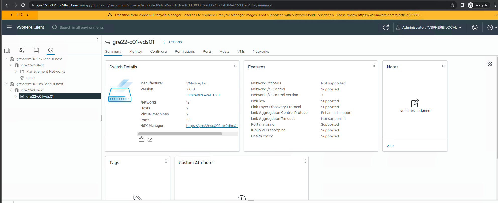

Click on `Upgrade Distributed Switch`:

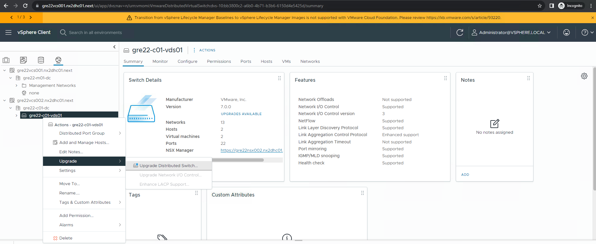

Choose version `8.0.3`:

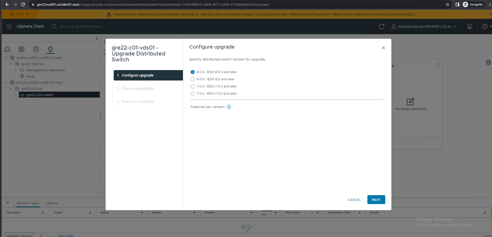

Check compatibility and click `NEXT`:

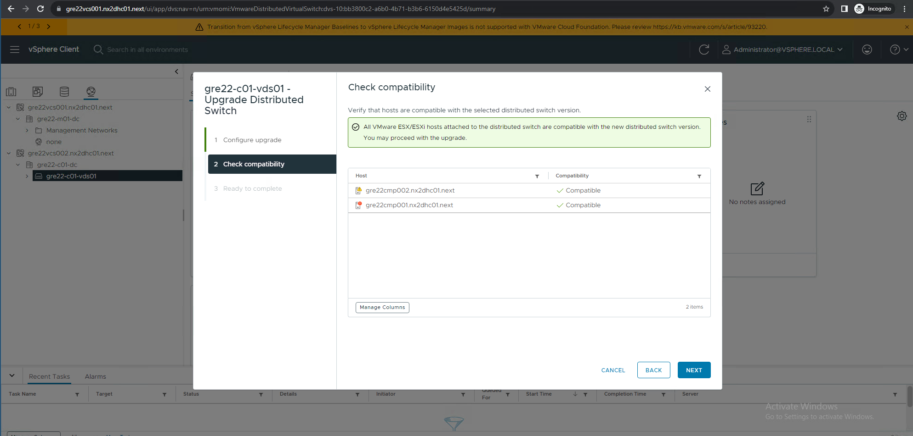

Review selections and click `FINISH`:

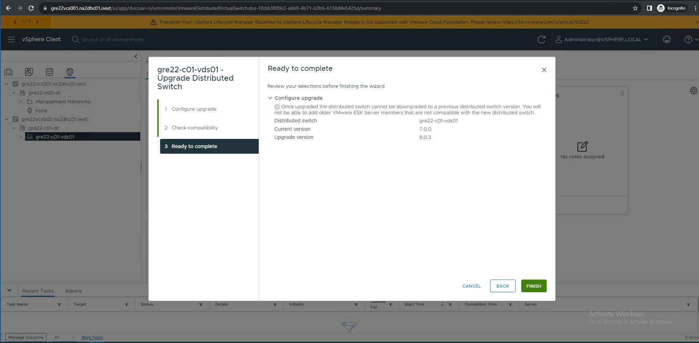

Check status of upgrade task and new distributed switch version:

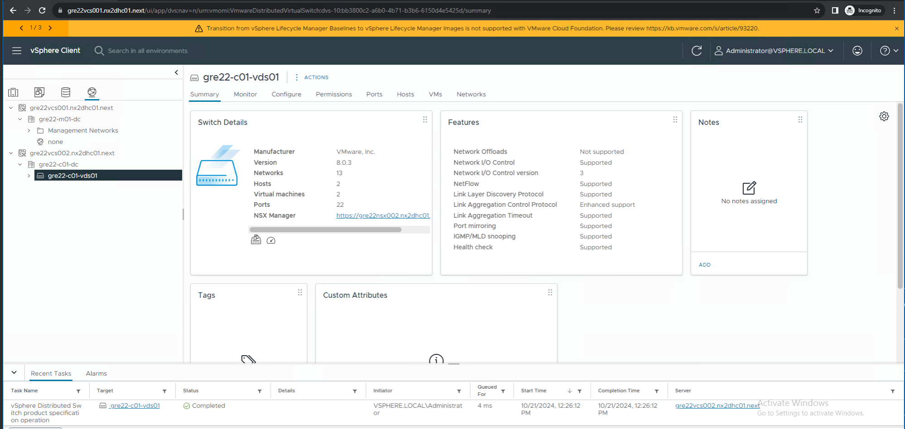

#### Apply VMware Cloud Foundation Configuration Updates

Estimated Upgrade Time: 20 min

Configuration updates may be required after you apply software updates.  

- In the navigation pane, click `Inventory` > `Workload Domains`(Select target domain) > `Updates` > `Available Configuration Updates` > `Apply All`.  
Please follow section [Apply VMware Cloud Foundation Configuration Updates](https://techdocs.broadcom.com/us/en/vmware-cis/vcf/vcf-5-2-and-earlier/5-2/vmware-cloud-foundation-lifecycle-management/upgrade-the-management-domain-to-vmware-cloud-foundation-5-2-lifecycle/apply-configuration-updates-lifecycle.html) if needed.
=======

### Post-checks

To confirm the compute domain is fully upgraded to ver. 5.2.0.0, log in to SDDC Manager and go to `Lifecycle Management` > `Release Versions`. Compute domain should be visible in `Available Cloud Foundation Versions`, version 5.2.0.0.

IMPORTANT NOTE: Follow section `To re-enable the compatibility checks ...` in kb [Bypass SDDC Manager upgrade compatibility checks when upgrade is unavailable due to missing compatibility data](https://knowledge.broadcom.com/external/article/323368/bypass-sddc-manager-upgrade-compatibilit.html) if compatibility checks have been disabled after SDDC Manager upgrade.

# Patch NSX, vCenter, ESXi

Estimated Upgrade Time: depends on number of patched components

New versions of NSX,vCenter,ESXi were released fixing security issues,vulnerabilities,bugs.
From VCF 5.2.0 a new feature is enabled: Asynchronous SDDC Manager Upgrades: VCF users can now upgrade SDDC Manager independently from the rest of the BOM to apply critical fixes, security patches, and to enable specific features related to SDDC Manager.

Go to `Inventory` -> `Workload Domains` -> select desired cluster (starting with MGT then compute) -> `updates` -> Scroll down to `Available Updates` -> `Plan patching` -> Select Component you want to patch (NSX->vCenter->ESXi)-> Select target version(latest version) -> Validate selection to confirm compatibility and click `Confirm` -> `Done`

Latest versions available at this time:
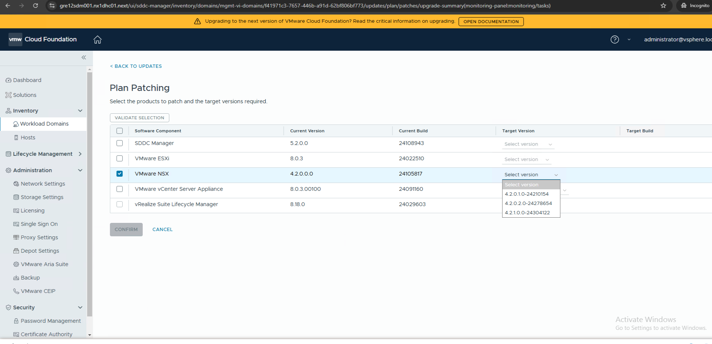
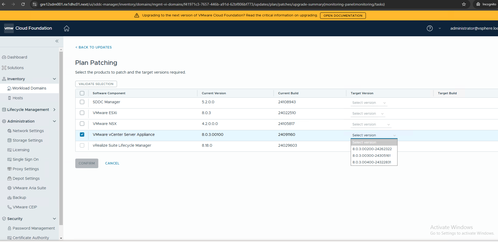
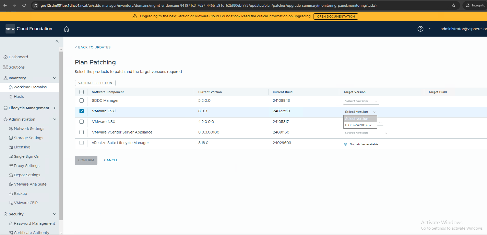

If desired bundle is not visible on available updates (especially for vCenter and ESXi) it can be enabled manually. This is a known bug and there is an automation prepared which can enable a bundle. Please execute the playbook from */opt/dhc/manage*:

```yaml
ansible-playbook importPatchBundle.yml
```

NOTE: To import a bundle there is a need to provide bundle ID which is then related to desired patch version. Bundles are listed on following website [VMware Cloud Foundation - Upgrade Bundle Details](https://knowledge.broadcom.com/external/article/327207/vmware-cloud-foundation-upgrade-bundle.html)

There is a known issue with downloading patches for ESXi. The error looks like/is similar to:

```yaml
A general system error occurred:
Failed to download VIB(s): URL:
https://hostupdate.broadcom.com/software/VUM/PRODUCTION/main/esx/vmw/vib20/<vib_name>.vib
Error: HTTP Error Code: 403
```

This can be resolved using the following KB - [Error: A general system error occurred: Failed to download VIB(s): Error: HTTP Error Code: 403, vLCM fails to download the ESXi patches and images from online repositories](https://knowledge.broadcom.com/external/article/390121)

## Apply VMware Cloud Foundation Configuration Updates

Estimated Upgrade Time: 20 min

Configuration updates may be required after you apply software updates.

- In the navigation pane, click `Inventory` > `Workload Domains`(Select target domain) > `Updates` > `Available Configuration Updates` > `Apply All`.  

Please follow section [Apply VMware Cloud Foundation Configuration Updates](https://techdocs.broadcom.com/us/en/vmware-cis/vcf/vcf-5-2-and-earlier/5-2/vmware-cloud-foundation-lifecycle-management/upgrade-the-management-domain-to-vmware-cloud-foundation-5-2-lifecycle/apply-configuration-updates-lifecycle.html) if needed.

# Revert esxAdminsGroupAutoAdd paramater value on ESXi

IMPORTANT NOTE: For ESXi 8.0 Update 3 onwards the ESXi advanced setting "Config.HostAgent.plugins.hostsvc.esxAdminsGroupAutoAdd" is set to "false" by default. This was changed due to security concerns. On versions of ESXi prior to Update 3 it is set to "true" by default. It is important to note that changing this to "false" does not remove any permissions already granted to the "ESX Admins" group.

Therefor it is possible to have an ESXi host that was patched from a version prior to Update 3 that has "ESX Admins" group logins working with "Config.HostAgent.plugins.hostsvc.esxAdminsGroupAutoAdd" currently set to "false" after patching to U3. The same can be said if this setting was manually set to "false".

For more details see [KB390063](https://knowledge.broadcom.com/external/article/390063/cannot-login-to-esxi-hosts-with-ad-users.html)

To perform above action (change esxAdminsGroupAutoAdd back to True) execute playbook:

```yml
ansible-playbook updateEsxiHostAd.yml
```

It will remove ESXi hosts from domain, change esxAdminsGroupAutoAdd back to True and rejoin to Active Directory domain.

If you experience below error:

```yml
TASK [dhc-updateEsxiHostAd : Password for a vCenter user] ************************************************************************************************************************************
fatal: [localhost]: FAILED! => {"msg": "The task includes an option with an undefined variable.. 'ansible.utils.unsafe_proxy.AnsibleUnsafeText object' has no attribute 'value'\n\nThe error appears to be in '/data/dhc/update/roles/dhc-updateEsxiHostAd/tasks/main.yml': line 20, column 3, but may\nbe elsewhere in the file depending on the exact syntax problem.\n\nThe offending line appears to be:\n\n\n- name: Password for a vCenter user\n  ^ here\n"}
```

Then run playbook with extra variable defined:

```yml
ansible-playbook updateEsxiHostAd.yml -e vCenterAdminUsername="administrator@vsphere.local"
```

# Compliance Overview
  
Please check the [Compliance Overview](wiComplianceOverview.md) document for any post-LCM actions and remediation that need to be  implemented, log4j vulnerability being an example.

# Known issues

RPMS upgrade error described in SDDC Manager section.

Compatibility checks issues mentioned in kb [Bypass SDDC Manager upgrade compatibility checks when upgrade is unavailable due to missing compatibility data](https://knowledge.broadcom.com/external/article/323368/bypass-sddc-manager-upgrade-compatibilit.html)

Issues with bundle visibility for patching and errors with downloading patches for ESXi are described in patching section.
