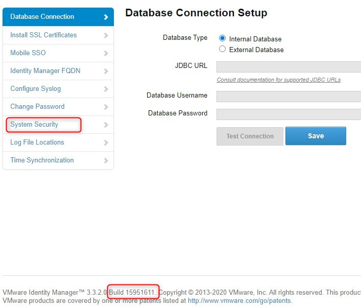
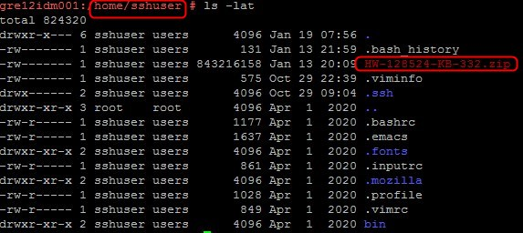
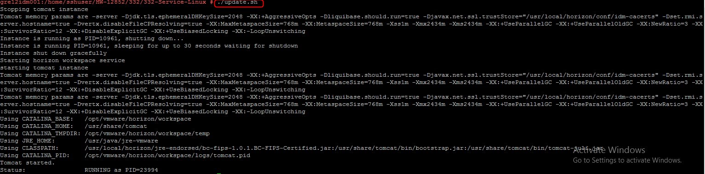
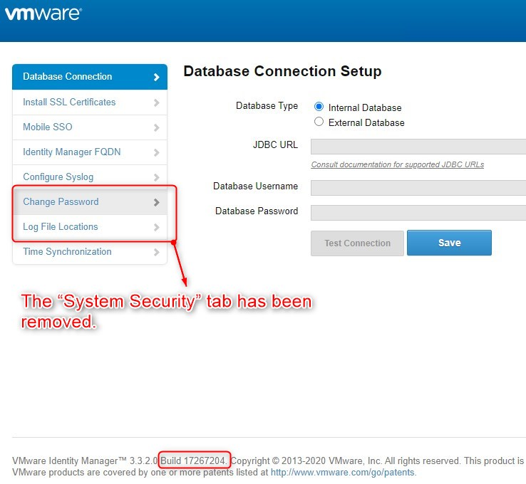

# VIDM Update

## Table of contents

- [VIDM Update](#vidm-update)
  - [Table of contents](#table-of-contents)
  - [Changelog](#changelog)
  - [Introduction](#introduction)
    - [Purpose](#purpose)
    - [Scope](#scope)
    - [Related Documents](#related-documents)
  - [Prerequisites](#prerequisites)
  - [Patch installation steps](#patch-installation-steps)
  
## Changelog
  
| Version | Date       |   TOS   |   Issue   |    Author    |   Description     |
| ------- | ---------- | ------- | --------- |  ------------ | -------------  |
| 0.1     | 19/01/2021 |         |           |  Maciej Losek | First version |

## Introduction

### Purpose

The purpose of this document is to describe steps which must be performed to fix the vulnerability identified against the reported CVE: CVE-2020-4006.
CVE-2020-4006 has been determined to affect some releases of Workspace ONE Access, VMware Identity Manager, and VMware Identity Manager Connector. More details: <https://kb.vmware.com/s/article/81754>
This work instruction is a part of [wiLifeCycleManagement.md](wiLifeCycleManagement.md)

### Scope

The scope of this document covers the following:

1. Install patch for VMware Identity Manager 3.3.2

### Related Documents

|                       Document                           |
|----------------------------------------------------------|
| [LLD Disaster Recovery](../design/lldDisasterRecovery.md) |
| [wiLifeCycleManagement](wiLifeCycleManagement.md) |

## Prerequisites

Before you start please download the patch `Hotfix HW-128524 3.3.2.zip` from <https://my.vmware.com/web/vmware/downloads/details?downloadGroup=VIDM_ONPREM_332&productId=938&rPId=52738>

## Patch installation steps

1. Launch the Configurator login page <https://vIDM-FQDN:8443/cfg/login> and record the “Build” version (in VCS 1.2 it should be `15951611`) and pay attention that `System Security` tab is visible:
    - 
2. Copy `Hotfix HW-128524 3.3.2.zip` file to `/home/sshuser` on VMware Identity Manager using WinSCP or any other SFTP client.
    - 
3. SSH to vIDM and backup the configuration folders:
    - `cp -R /opt/vmware/horizon/workspace/webapps/cfg /opt/vmware/horizon/workspace/webapps/cfg_backup`  
    - `cp -R /opt/vmware/horizon/workspace/webapps/hc /opt/vmware/horizon/workspace/webapps/hc_backup`
4. Unzip the file location:
    - `unzip /home/sshuser/HW-128524.zip -d /home/sshuser/HW-128524`
5. Go to /home/sshuser and run `update.sh` from shell:
    - `./update.sh`
    - The .war files are replaced on the appliance and the Identity Manager/Access service is restarted.
    - 
6. To validate the patch is successfully applied on the node, launch the Configurator login page <https://vIDM-FQDN:8443/cfg/login>, and verify that the “Build” version has been updated. The expected build number is `17267204`. Please note that `“`System Security`”` tab on Configurator UI has been removed.  
    - 
