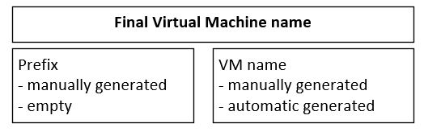
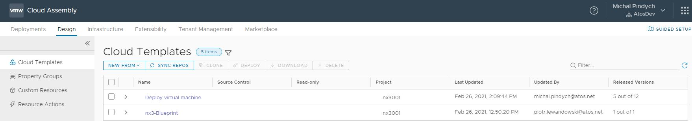
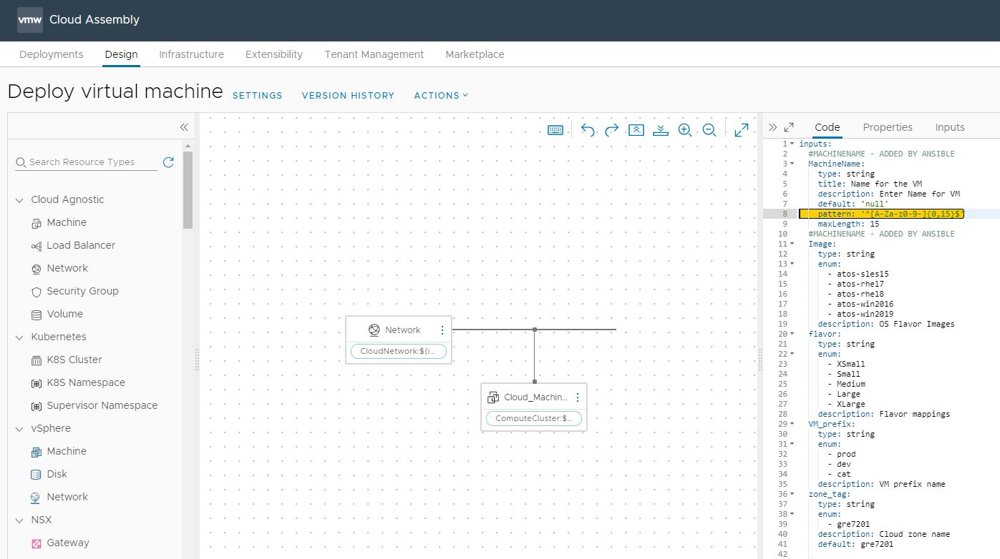
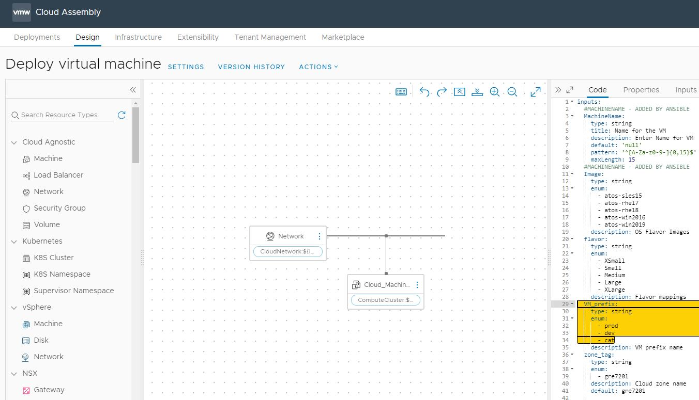
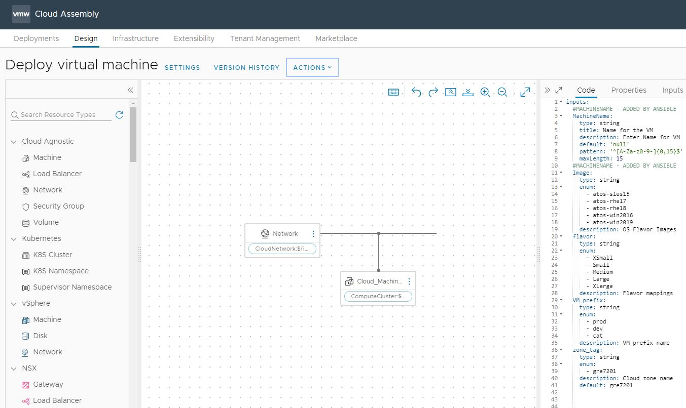
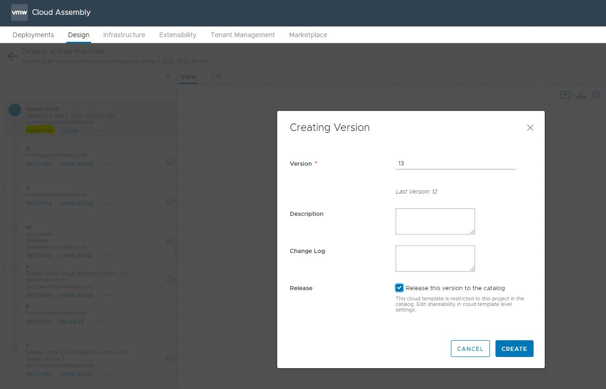
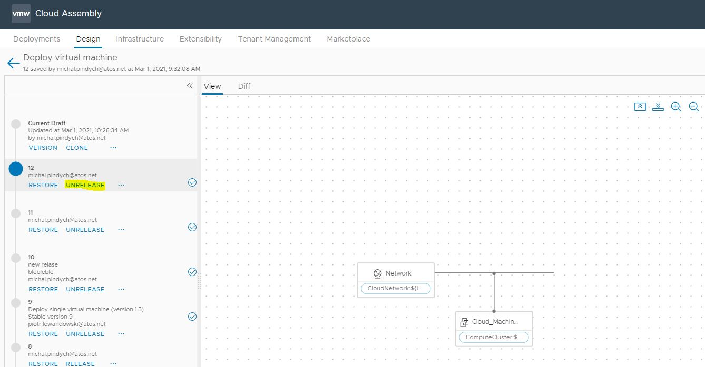
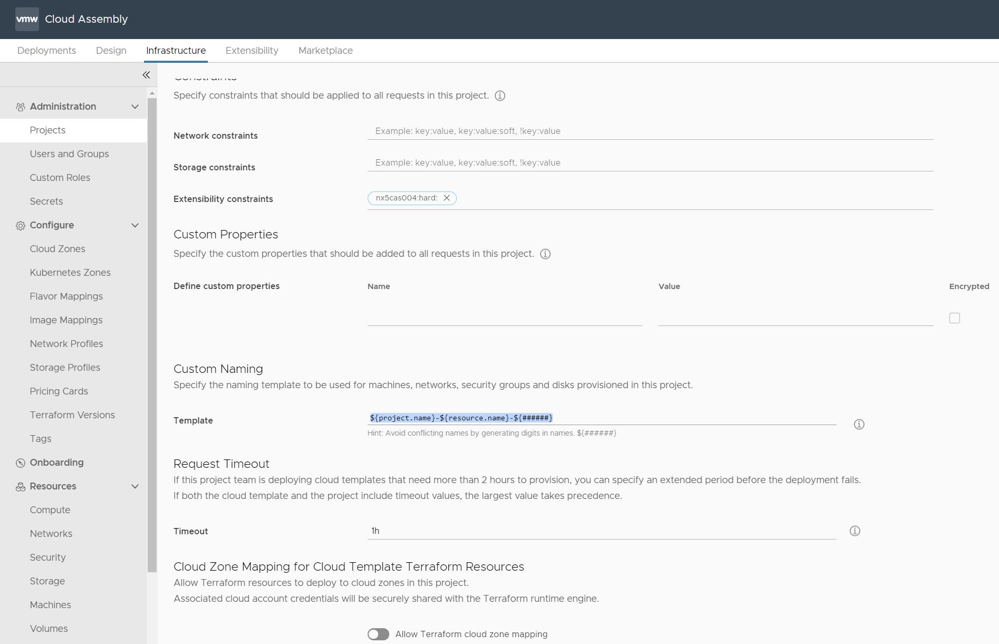

# VM Name Customization

# Changelog

| Version | Date | Author | Changes |
|---------|------|------|---------|
| 0.1 | 28.02.2021 | Michal Pindych | Document creation |

## Introduction

### Purpose

Create or modify the VM naming template in Cloud Assembly.

### Audience

- VCS Engineering
- VCS Operations

### Scope

This document covers the following topics

- Description of prefix and virtual machine name
- Description of VM custom naming template
- Validation mechanisms
- Adjustments that can be introduced

# Virtual machine naming convention

Final virtual machine name consist two parts: prefix (if defined ) and virtual machine name itself which can be generated manually or dynamically.



## VM prefix

In order to distinguish from each other for example different environments (prod, pre-prod, dev ) we can use prefix functionality. Every time a new virtual machine will be provisioning - a specific prefix will be added before the actual name. Using prefix functionality is optional.

Sample prefix configuration in Cloud Assembly blueprint

```yaml
inputs:
  VM_prefix:
    type: string
    enum:
      - prod
      - dev
      - cat
    description: VM prefix name

# blueprint body 

Cloud_Machine_1:
    type: Cloud.Machine
    properties:
      image: '${input.Image}'
      flavor: '${input.flavor}'
      name: '${input.VM_prefix}'
      newName: '${input.MachineName}'

```

## VM name

Virtual machine name (together with optional prefix) uniquely identifies the given resource. Name can be generated manually - in this case during provisioning we need to specify it, or if no arguments will be the provided, mechanism of automated name generation will be executed using custom naming template.  

Sample name configuration in Cloud Assembly blueprint:

```shell
inputs:
  MachineName:
    type: string
    title: Name for the VM
    description: Enter Name for VM
    default: 'null'
    pattern: '^[A-Za-z0-9-]{0,15}$'
    maxLength: 15
    
# blueprint body 

Cloud_Machine_1:
    type: Cloud.Machine
    properties:
      image: '${input.Image}'
      flavor: '${input.flavor}'
      name: '${input.VM_prefix}'
      newName: '${input.MachineName}'

```

## VM Custom naming template

In case of deployment of resources without user interaction, we can create a naming template for all deployments from a Cloud Assembly project. In this scenario, all variables are pulled from the system as it is deployed or from project custom properties.

Please refer to below expression placed in:

- Cloud Assembly -> Infrastructure -> Projects -> Provisioning ->  Custom Naming -> Template

```shell
${project.name}-${resource.name}-${######}
```

- ${project.name} - project properties (for example specific project name)
- ${resource.name} - include the resource name from cloud template blueprint
- ${######} - add digits to generated names to make them unique (6 digits in this case )

# Virtual machine naming validation

During the provisioning of the virtual machine, additional checks are performed to ensure that name is consistent with the defined policy ( for example 15 sign restriction) and if no duplicates exist on vCenter.

## VM name validation

Virtual machine name validation is implemented using Cloud Assembly "pattern:" blueprint expression as shown below:

```yaml
  MachineName:
    type: string
    title: Name for the VM
    description: Enter Name for VM
    default: 'null'
    pattern: '^[A-Za-z0-9-]{0,15}$'
    maxLength: 15
```

Please refer to the syntax which define allowable characters for string inputs.

```shell
pattern: '^[A-Za-z0-9-]{0,15}$'
```

In this case the name can only consist of capital and small letters from a to z , digits from 0 to 9 and its length is restricted to 15 characters.

## VM name duplication validation

Every time the new virtual machine is provisioned - this Cloud Assembly subscription is executed: "CheckVMAvailability". The purpose of this check is to be sure that provided virtual machine name will not be duplicated on vCenter.

The mechanism of this validation looks like this:

- New virtual machine is provisioned
- Specific event - "pre allocation for compute resources" - execute "CheckVMAvailability" subscription
- "CheckVMAvailability" subscription is responsible for the execution of the vRO on-prem workflow task
- vRO workflow task return error if the virtual machine name is already existing on vCenter

# Virtual machine naming adjustments

## Adjustment of prefix and VM name

| Description| Cloud Assembly Blueprint |
|:--------------|:----------|
| Please navigate to Cloud Assembly -> Design -> Cloud Templates and choose a specific blueprint that should be modified - in our case "Deploy  virtual machine".  |  |
| In Blueprint adjust the "pattern" field if required.  |  |
| In Blueprint adjust the "VM prefix" section if required. |  |
| After modification blueprint should be released, in order to do that please click "Version History" | |
| Release the current version of the blueprint  |  |
| Unrelease the previous version of the blueprint |  |

## Adjustment of Custom naming template

| Description| Cloud Assembly Project |
|:--------------|:----------|
| Navigate to: Cloud Assembly -> Infrastructure -> Projects -> Provisioning -> Custom Naming -> Template , then update template field with specific custom naming template. |  |
