# VRA Cloud Blueprints Guide

## Changelog

| Version | Date | User | Changes |
|---------|------|------|---------|
| 0.1 | 18.02.2020 | Jakub Wosko | draft version |
| 0.2 |  | Tomasz Korniluk | review and updates |
| 0.3 | 14.04.2020 | Jakub Wosko | add chapter 8.8.1 Red Hat cloud-init download and install applications |

## Introduction

Deployments begin with blueprints, the specifications that define the machines, applications, and services that you create on cloud resources by way of Cloud Assembly.
As a blueprint developer, you can design blueprints that target specific cloud vendors, or make them
cloud agnostic. The cloud zones that are assigned to your project determine which approach you might take.
Cloud Assembly blueprint creation is an infrastructure-as-code process. You add and connect components in the design canvas to get started.

### Purpose

Create and deploy Cloud Assembly blueprints.

### Audience

- VCS Engineering
- VCS Operations

### Scope

This document covers the following tasks and activities:

- **Create, change and manage blueprints**
- **Deploy blueprints**
- **VCS blueprint examples**

The following tasks are out of scope of this document:

- **Manage access to VMware Cloud Services**

# 5. Prerequisites

- Access to VMware Cloud Services
- Access to VMware Cloud Assembly
- Cloud resource infrastructure need to be defined first
- Cloud Assembly project that includes infrastructure resources as cloud zones must be created

# 6. Ways to create blueprints

Cloud Assembly creates and saves blueprints as code, which allows you to easily design and reuse
blueprints.

You can build a blueprint from a blank canvas or take advantage of existing code.

# 7. How to access to blueprint design page

1. Log in to Cloud Services via url: [VMware Cloud Services](https://console.cloud.vmware.com/)

2. Choose **VMware Cloud Assembly** by clicking on the button

    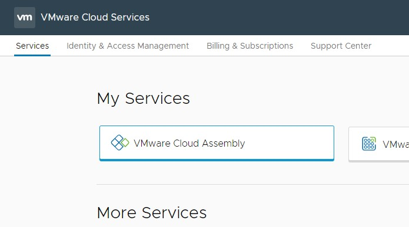

3. CLick on link **Blueprints** in the left upper corner of the page.

    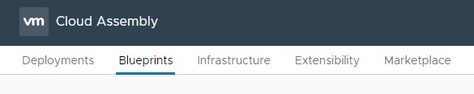

    Here you can see earlier created blueprints.

    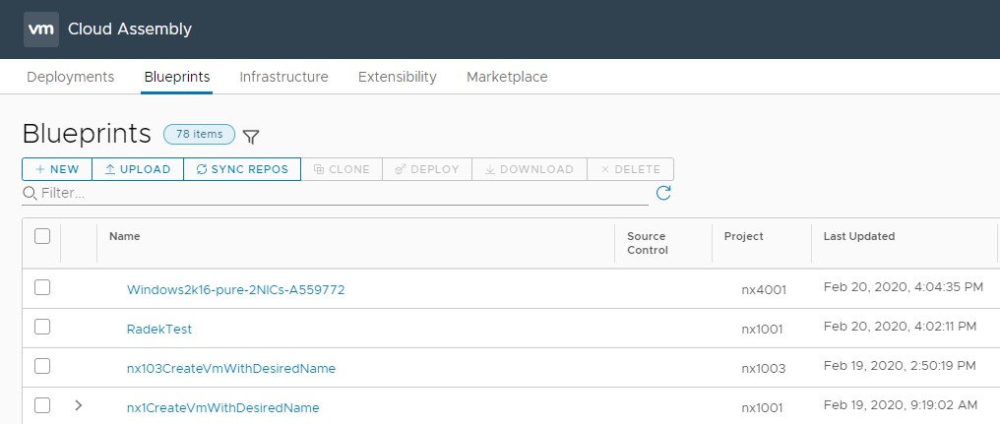

Now you have three options to create new blueprint:

- create new blueprint from scratch
- clone existing one
- upload blueprint from YAML file

### 7.1 Create new blueprint from scratch

1. To create new blueprint from scratch click **NEW**

    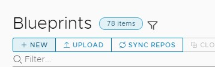

2. Next provide necessary basic configuration fields:
    - name
    - assign project
    - optionally
    - write description
    - change "Blueprint sharing in Service Broker"

    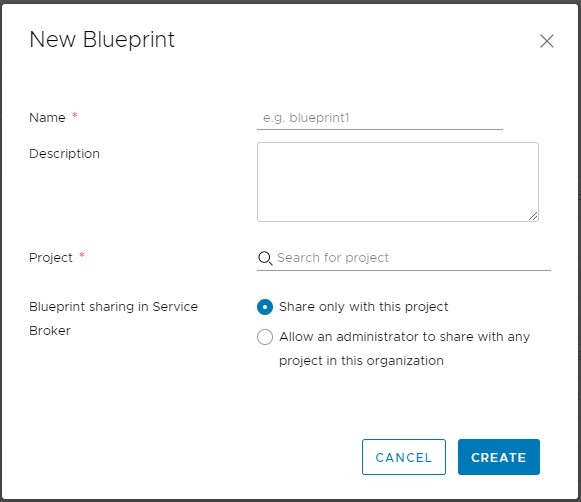

    and click **CREATE** button

### 7.2 Clone existing blueprint

1. Select source blueprint and click **CLONE**

   

2. Next provide necessary basic configuration fields:
    - name
    - assign project
    - choose version to be cloned
    - optionally
    - write description
    - change "Blueprint sharing in Service Broker"

    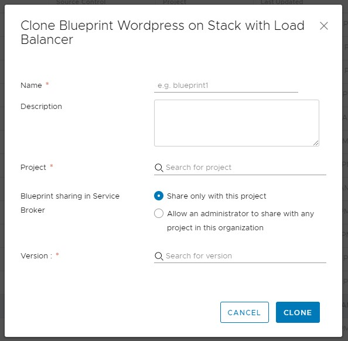

    and click **CLONE** button

3. To edit cloned blueprint, click on the name provided in 1.

    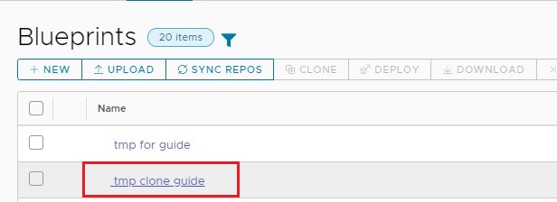

### 7.3 Upload blueprint from YAML file

1. To upload blueprint from YAML file click **UPLOAD**
    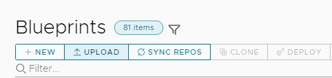

2. Next provide necessary basic configuration fields:
    - name
    - assign project
    - choose file to upload
    - optionally
    - write description
    - change "Blueprint sharing in Service Broker"

    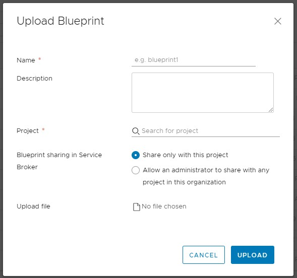

    and click **UPLOAD** button

3. To edit uploaded blueprint, click on the name provided in 1.

    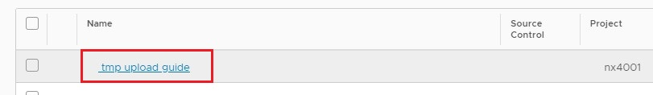

VCS Team prepared some blueprint examples. This topic is described in chapter [11. VCS blueprint examples](#11-vcs-blueprint-examples).
  
# 8. Blueprint design page

Design page is used to edit blueprints in Cloud Assembly.
  
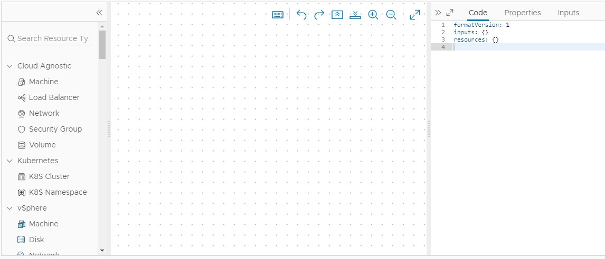
  
Using design page you can create or update Cloud Assembly blueprint specifications for the machines or applications that you want to provision.

Main steps to work with design page:

1. Locate components.
2. Drag components to the canvas.
3. Connect components.
4. Configure components in the code editor.

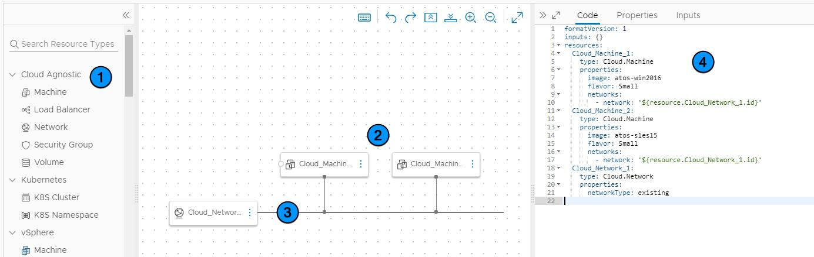

The code editor allows you to type, cut, copy, and paste code directly. If you're uncomfortable editing code, you can select a resource in the design canvas, click the code editor **Properties** tab, and enter values there. Property values that you enter appear in the code as if you had typed them directly.

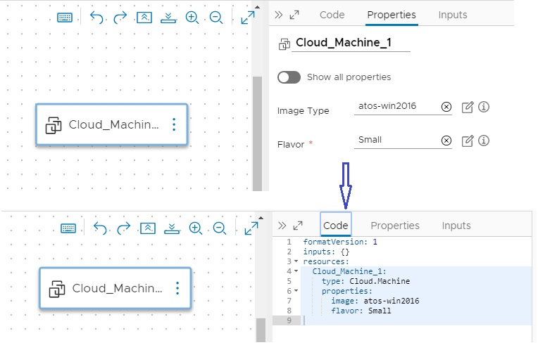
  
### 8.1 Cloud Agnostic Components

You can deploy cloud agnostic components to any cloud vendor. At provisioning time, the deployment uses cloud specific resources that match.

For example, if you expect a blueprint to deploy to both AWS and vSphere cloud zones, use cloud agnostic components.

Here is a list of main components used for VCS blueprints:

- Machine
- Network
- Volume (optional additional disks)

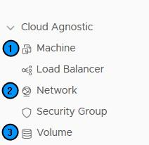
  
### 8.2 Cloud Vendor Components

Amazon Web Services, Microsoft Azure, and VMware vSphere components can only be deployed to matching AWS, Azure, or vSphere cloud zones.

You can add cloud agnostic components to a blueprint that contains cloud specific components for a particular vendor. Just be aware of what the project cloud zones support in terms of vendor.

Here is a list of main vSphere components used for VCS blueprints:

- vSphere:
  - Machine
  - Network
- NSX
  - Load Balancer
  - Network

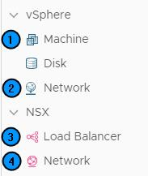

> IMPORTANT: Building blueprints for VCS try to use only agnostic components if it is possible.
  
### 8.3 How to connect blueprint components

Use the graphical design canvas to connect Cloud Assembly blueprint components.

You can connect components when they are compatible for a connection.

For example:

- Connecting a load balancer to a cluster of machines.
- Connecting a machine to a network.
- Connecting external storage to a machine.

To connect, hover over the edge of a component to reveal the connection bubble. Then, click and drag the bubble to the target component and release.

In the code editor, additional code for the source component appears in the target component code.

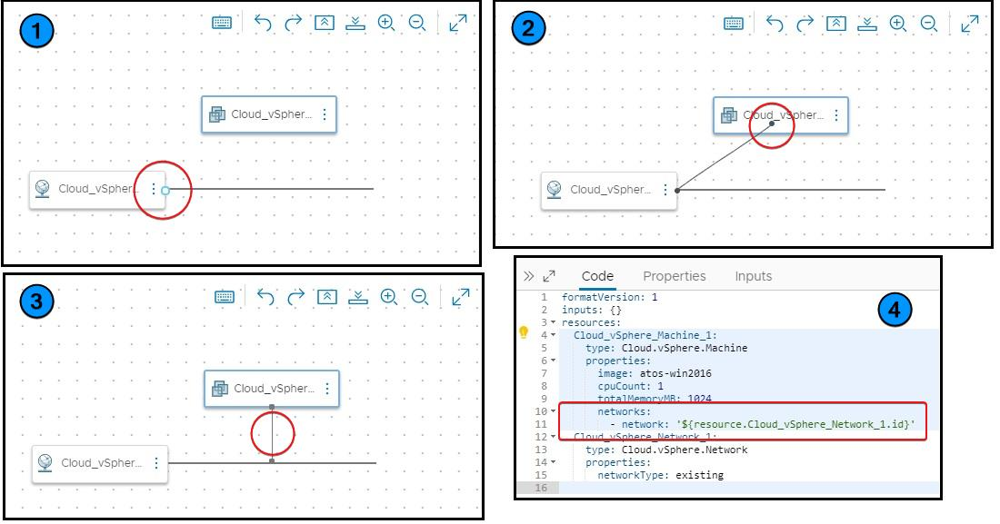
  
### 8.4  Validation of blueprint code

Adding Cloud Assembly components and connecting them in the canvas only creates starter code. To fully configure them, edit the code.

The code editor allows you to type code directly or enter property values into a form. To help with direct code creation, the Cloud Assembly editor includes syntax completion and error checking features.

For example:

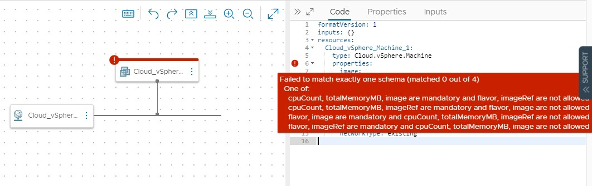

Code editor has implemented schema help for properties. To use it just click on <ins>properties</ins> of the component to see all available parameters, or click on property name to see more about it.

For example:

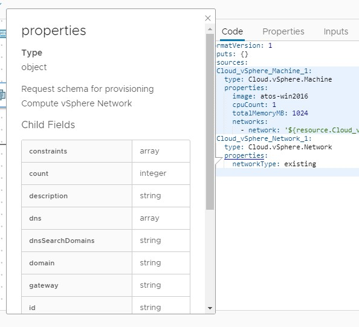
  
### 8.5 Input parameters

As a blueprint developer, you use input parameters so that users can make custom selections at request time.

When users supply inputs, you no longer need to save multiple copies of blueprints that are only slightly different.

For example, you might create one blueprint for a Windows 2016 Server, where users can deploy that one blueprint to different cloud resource environments and apply different image, size of VM, VM prefix name etc.

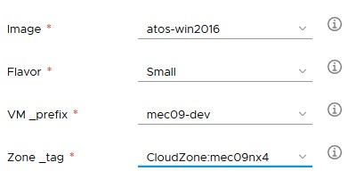

#### Input parameters definition

To define input parameters add an **inputs** section in the blueprint.
In the following example, machine size, operating system, and number of clustered servers are selectable.

```yaml
inputs:
size:
  type: string
  enum:
    - small
    - medium
  description: Size of Nodes
  title: Node Size
image:
  type: string
  enum:
    - coreos
    - ubuntu
  title: Select Image/OS
count:
  type: integer
  default: 2
  maximum: 5
  minimum: 2
  title: Wordpress Cluster Size
  description: Wordpress Cluster Size (Number of nodes)
```

Then, in the **resources** section, reference an input parameter using `${input.property-name}` syntax.

If a property name includes a space, delimit with square brackets and double quotes instead of using dot notation: `${input["property name"]}`

> IMPORTANT: In blueprint code, you cannot use the word **input** except to indicate an input parameter.

Example:

```yaml
resources:
WebTier:
  type: Cloud.Machine
  properties:
    name: wordpress
    flavor: '${input.size}'
    image: '${input.image}'
    count: '${input.count}'
```  

#### Input parameters from GUI

Another option to define inputs is to use **Inputs** tab.

In this tab it is able to create new, edit and delete input parameter.

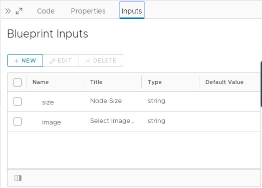

### 8.6 Component deployment sequence

1. Explicit dependency
   Sometimes, a component needs another to be deployed first.  
   For example, a database server might need to exist first, before an application server can be created and configured to access it.
      - An explicit dependency sets the build order at deployment time, or for scale in or scale out actions. You can add an explicit dependency using the graphical design canvas or the code editor.
      - Design canvas option — draw a connection starting at the dependent component and ending at the component to be deployed first.
      - Code editor option - add a **dependsOn** property to the dependent component, and identify the component to be deployed first.
      - An explicit dependency creates a solid arrow in the canvas.

   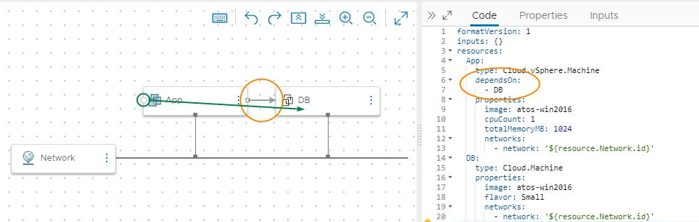

2. Implicit dependency or property binding

   Sometimes, a component property needs a value found in a property of another component.

   For example, a backup server might need the operating system image of the database server that is being backed up, so the database server must exist first.

   Also called a property binding, an implicit dependency controls build order by waiting until the needed property is available before deploying the dependent component. You add an implicit dependency using the code editor.

   Edit the dependent component, adding a property that identifies the component and property that must exist first.

      An implicit dependency or property binding creates a dashed arrow in the canvas.

   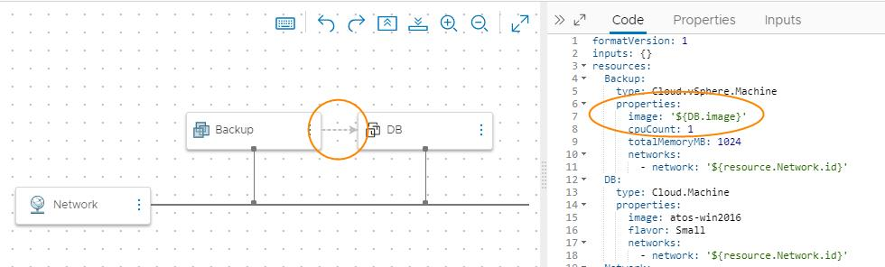

### 8.7 Add vSphere customization specifications

Customization specifications let you apply guest operating system settings at deployment time, when deploying to vSphere based cloud zones.

The customization specification must exist in vSphere, at the target that you deploy to.

Edit the blueprint code directly.

The following example points to a <ins>cloud-assembly-linux</ins> customization specification for a WordPress host on vSphere.

```yaml
resources:
     WebTier:
       type: Cloud.vSphere.Machine    
       properties:     
           name: wordpress      
           cpuCount: 2
           totalMemoryMB: 1024
           imageRef: 'Template: ubuntu-16.04'      
           customizationSpec: 'cloud-assembly-linux'      
           resourceGroupName: '/Datacenters/Datacenter/vm/deployments'
```

### 8.8 Automatically initialize a machine - cloudConfig

There is a possibility to add a **cloudConfig** section to machines.

With this parameter it is possible to add machine initialization commands that run at deployment time.

To execute cloudConfig part affected OS templates must contains proper cloud agent depending of OS flavour.

- Linux — initialization commands follow the open [cloud-init](http://www.cloud-init.io/ "cloud-init") standard.
- Windows — initialization commands use [Cloudbase-init](http://www.cloudbase.it/cloudbase-init "Cloudbase-init").

<ins>cloudConfig</ins> could be used to automate the application of user data or settings at instance creation time.
  
For example:

- Setting a hostname
- Setting static IP address
- Generating and setting up SSH private keys
- Installing packages

Important module of <ins>cloudConfig</ins> is **runcmd**. Using this module it is able to run native shell command (for Linux systems) or run PowerShell scripts (for Windows).

Example of cloudConfig section:

```yaml
    cloudConfig: |
      #cloudConfig
      hostname: ${input.VM_prefix}web${input.VM_sufix}1
      fqdn: ${input.VM_prefix}web${input.VM_sufix}1.${input.doaminName}
      manage_etc_hosts: true
      ssh_pwauth: yes
      chpasswd:
        list: |
          ${input.username}:${input.password}
        expire: false
      users:
        - default
        - name: ${input.username}
          lock_passwd: false
          sudo: ['ALL=(ALL) NOPASSWD:ALL']
          groups: [root, sudo, adm]
          shell: '/bin/bash'
      runcmd:
      - service sshd start
      - nmcli connection modify "System ens192" ipv4.address ${input.staticipweb1}/${input.ipmask} ipv4.gateway ${input.ipgateway}
      - nmcli connection modify "System ens192" ipv4.method manual
      - nmcli connection up "System ens192"
      - ip route add default via ${input.ipgateway}
```  

Commands used in cloudConfig section are performed at first boot after OS deployment.

In VCS Manage OS templates in compute clusters have cloud-init (for Linux) and Cloudbase-init (for Windows) integrated.

### 8.8.1 Red Hat cloud-init download and install applications

To download and install applications for Red Hat using cloud-init it is necessary to subscribe VM to Red Hat Customer Portal using subscription-manager.
User and password used for subscription can be get from input parameters.

Example code for subscription:

```yaml
  cloudConfig: |
    runcmd:
    - subscription-manager config --server.proxy_hostname=${input.proxy_hostname} --server.proxy_port=${input.proxy_port}
    - subscription-manager register --username ${input.redhat_login} --password ${input.redhat_password}
    - subscription-manager attach --auto
```

Example how to download and install app

```yaml
  cloudConfig: |
    runcmd:
    - yum install httpd -y
```

And at the end example how to unregister VM from Red Hat Customer Portal

```yaml
  cloudConfig: |
    runcmd:
    - subscription-manager unregister
```

Here you can find example with full *cloudConfig* section for Web server: [cloud-initExample](files/cloud-initExample.txt "cloud-initExample.txt")

### 8.9 Save different versions of a blueprint

As a blueprint developer, you can safely capture a snapshot of a working blueprint before risking further changes.

At deployment time, you can select any of your versions to deploy.

#### Capture a blueprint version

From the design page, click **Version** button in the bottom of the page, and provide a name.

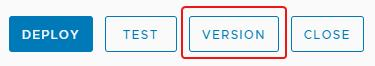

The name must be alphanumeric, with no spaces, and only periods, hyphens, and underscores allowed as special characters.

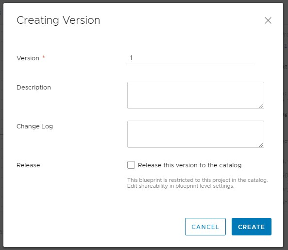

#### Release a version to users of Service Broker

From the design page, click **Version History**.

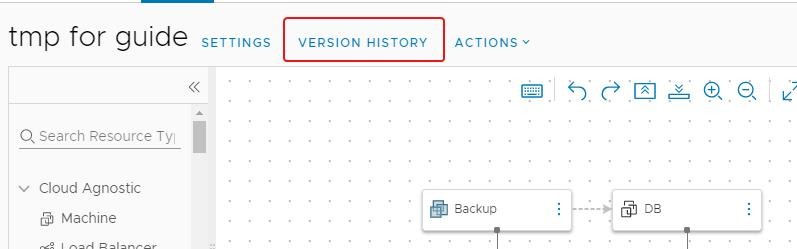
On the left, select a version and click **Release**. You cannot release the current draft until you version it.

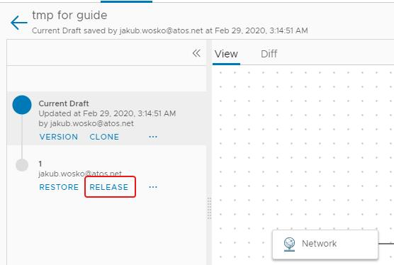

When more than one version of a blueprint is released, Service Broker uses the most recent one.

#### Compare blueprint versions

When changes and versions accumulate, you might want to identify differences among them.

From the <ins>Version History</ins> view, select a version, and click **Diff**.

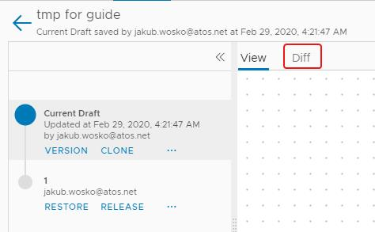

Then, from the **Diff against** drop-down, select another version to compare to.

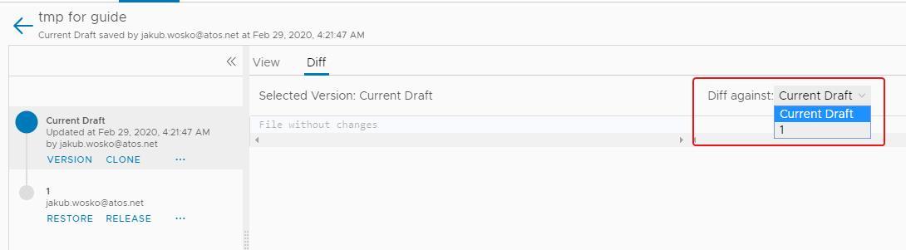

Note that you can toggle between reviewing code differences or visual topology differences.

Code Differences

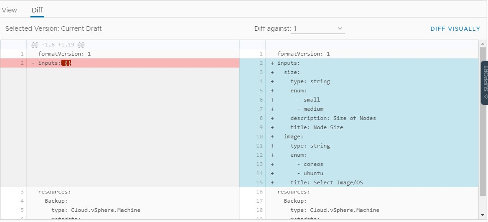

Visual Topology Differences

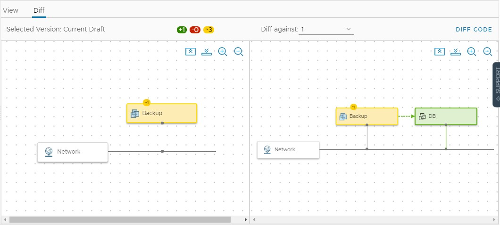

# 9. Testing blueprint before dependent

When blueprint appears to be finished, it is possible to test it.

The test is only a simulation and does not actually deploy virtual machines or other resources. The simulation exposes potential issues, such as not having any resource capabilities defined that match hard constraints in the blueprint.

To perform test:

1. click on **TEST** button in left botton corner of the design page.

   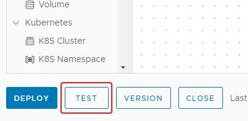

2. Enter input values, and click **TEST**

   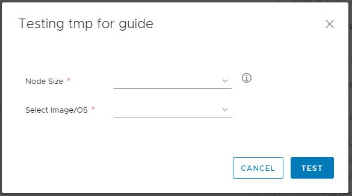

The test includes a link to a Provisioning Diagram, where you can inspect the simulated deployment flow and see any errors that occurred.

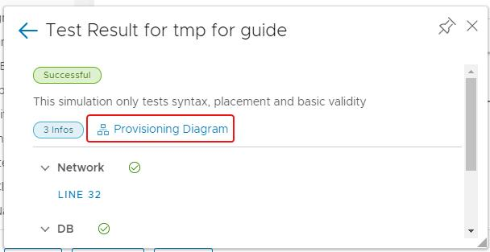

Example when error occurs

  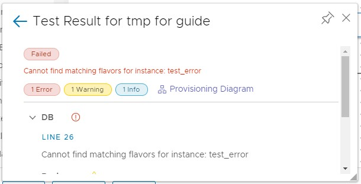

  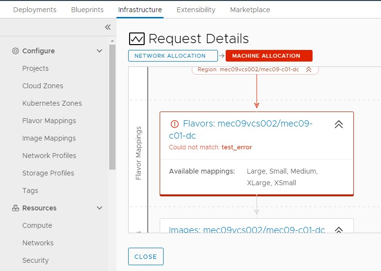

After the blueprint passes the simulation, it could be deployed by click **DEPLOY** button.

> IMPORTANT: A successful simulation only guarantee that all blueprint input fields are correct and reflected data defined inside vRA cloud under affected cloud zone.

# 10. Deploy blueprint

There are two ways to deploy the blueprint:

1. Click **DEPLOY** button in the design page

   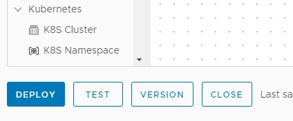

2. Select blueprint from <ins>Blueprints</ins> tab and click **DEPLOY**

   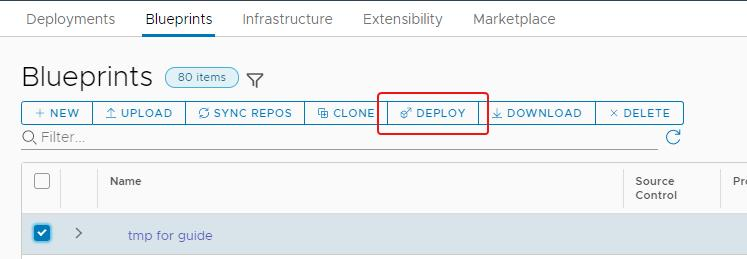

Next steps for both ways are:
  
1. Fill deployment form:
   - choose "Create a new deployment" or update existing
   - provide "Deployment name"
   - choose "Blueprint version"
   - optionally enter "Description"

   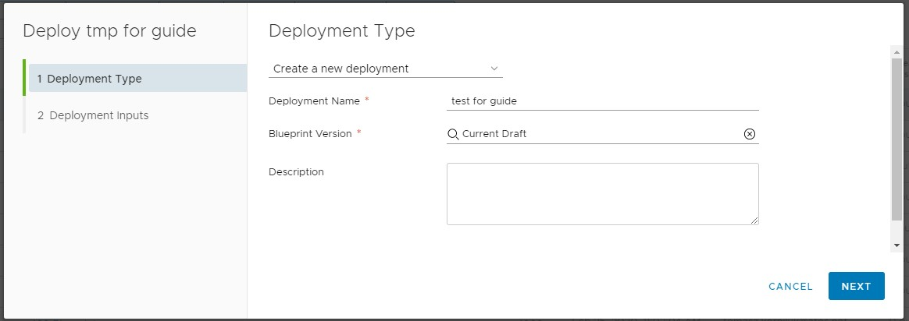

   and click **NEXT** button

2. Provide Input parameters for the blueprint (if any)

   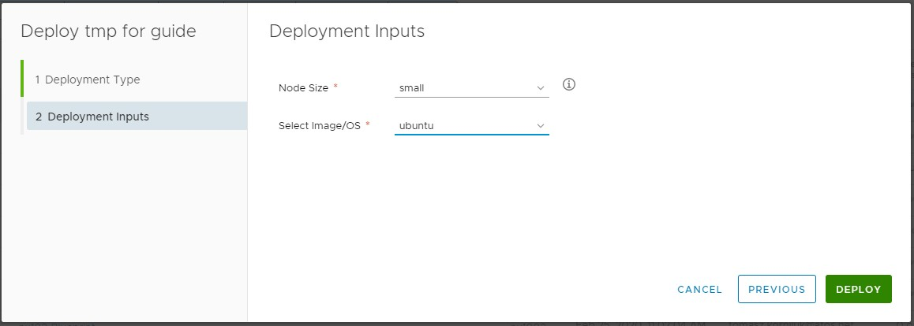

   and click **DEPLOY**

3. Automatically Deployment details will be opened

   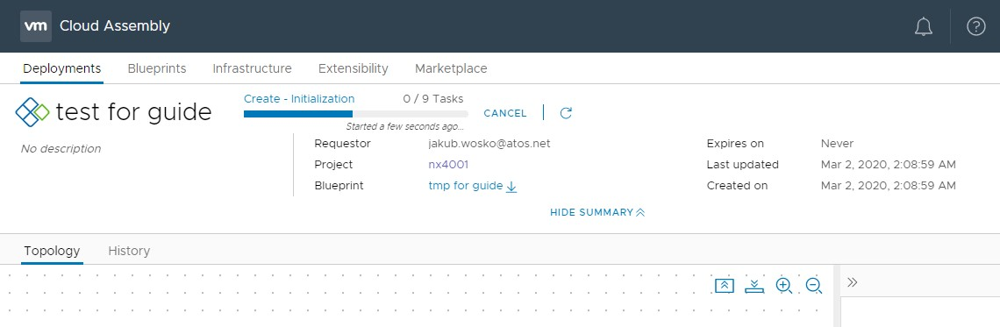

   Here you can follow step by step how deployment is progressing.
  
# 11. VCS blueprint examples

VCS development team prepared some blueprint examples which could be uploaded to vRA Cloud.
These examples would be find on Ansible management host (ans001) in path <ins>/opt/dhc/blueprints</ins>.

### 11.1 Application blueprint

This example blueprint shows design for Wordpress on the Lamp Stack with Active Directory integration.

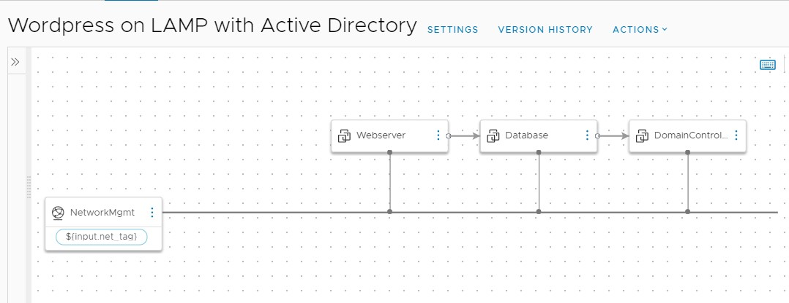

Blueprint deploys:

- Active Directory Domain Controller
- Database server
- Http server with WordPress.

After servers deployment, WordPress is configured with AD to authenticate AD users.

Components used in this blueprint:

- agnostic:
  - Network
  - Machine

Used operating systems:

- Red Hat 7.6 with cloud-init installed for WordPress and Database servers
- Microsoft Windows 2016 Server with cloudbase-init installed for Active Directory server

**Prerequisites** for this blueprint:

- active Cloud Proxy
- added Cloud Account for vCenter
- project created in vRA Cloud
- Cloud zone configured
- Flavour Mapping configured
- Image Mapping configured
- Network profile created
- Storage profile created
- Red Hat user login to register VM in subscription, without this install packages is not possibilities.

### 11.2 Application blueprint with load balancer

This example blueprint shows design for Wordpress on the Lamp Stack with Load Balancer.

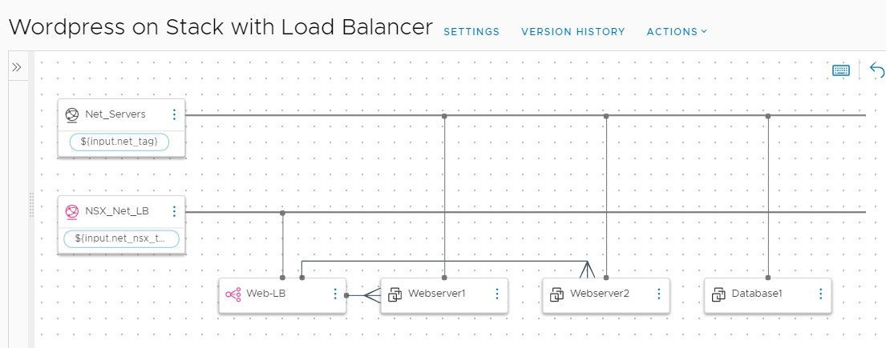

Blueprint deploys Load Balancer, two linux HTTP servers which are added to load balancer pool and server for database for WordPress.

Components used in this blueprint:

- vSphere:
  - Network
- Machine
  - NSX Network
- NSX Load Balancer

Used operating systems:

- Red Hat 7.6 with cloud-init installed
  
**Prerequisites** are the same as in chapter 11.1 Application blueprint and extended by:

- additional Network profile for NSX load balancer with proper configuration:
  - choose **Create an on-demand network**
- provided **Network Resources** section
- config networks for VMs and LB:
  - set IPv4 CIDR
  - set IPv4 default gateway
- create IP range for Load Balancer network

In this scenario please pay attention for Load Balancer code.
Example code looks like:

```yaml
  Web-LB:
    type: Cloud.NSX.LoadBalancer
    properties:
      name: '${input.VM_prefix}lbw${input.VM_sufix}1-${input.VM_env}'
      address: '${input.staticLbWebVipIP}'
      routes:
        - protocol: HTTP
          port: 80
          healthCheckConfiguration:
            protocol: HTTP
            port: 80
            urlPath: /
            intervalSeconds: 20
            unhealthyThreshold: 5
            healthyThreshold: 2
            timeoutSeconds: 10
      network: '${resource.NSX_Net_LB.id}'
      instances:
        - '${resource.Webserver1.id}'
        - '${resource.Webserver2.id}'
      internetFacing: false
```

Important section here is **healthCheckConfiguration** it defines how Load Balancer will test connection to servers:

- protocol
- port
- urlPath to test Wordpress
- time thresholds

Section **instances** defines which servers will be added to Load Balancer pool.

# 12. VMware document reference
  
This guide has been created based on VMware document "Using and Managing vRealize Automation Cloud Assembly".
Here you can find more information about blueprints [Using and Managing vRealize Automation Cloud Assembly](https://docs.vmware.com/en/vRealize-Automation/8.0/using-and-managing-vrealize-automation-cloud-assembly.pdf).
