# vROPS upgrade to 8.10

## Table of Contents

- [Changelog](#changelog)
- [Introduction](#introduction)
- [Related Documents](#related-documents)
- [Preliminary information](#preliminary-information)
- [Prerequisites](#prerequisites)
- [Upgrade Procedure](#upgrade-procedure)

## Changelog
  
| Date       | Issue    | Author                                   | TOS | Description     |
| ---------- | -------- | ---------------------------------------- | --- | --------------- |
| 10/07/2023 | VCS-9922 | Krzysztof Olszewski / Karol Gomulkiewicz |     | Initial version |
| 16/08/2023 | VCS-10439 | Piotr Lewandowski |     | Post-review updates |
| 22/08/2023 | VCS-9922 | Marcin Kujawski |     | Adding step to sync LCM after upgrade |

## Introduction

### Purpose

Async in-place upgrade of vRealize Operations Manager from version 8.6.2/8.6.3 to 8.10.

### Scope

The scope of this document covers the following:

1. Firewall rules adjustment in NSX-T
2. Removal vROps Epops Agents and installation of Telegraf Agents
3. Cleanup in vROPS UI
4. vROps Cloud Proxy deployment
5. Custom service monitoring
6. vROPS upgrade
7. Sync vRSLCM environment after upgrade

## Related Documents

| Document                                                                                                                  |
| ------------------------------------------------------------------------------------------------------------------------- |
| [Software Defined Networks Firewall LLD](../design/lldSoftwareDefinedNetworksFirewall.md)                                 |
| [Replace vRops Epops Agents with vROps Telegraf Agents](wiReplaceVropsEpopsAgentWithTelegrafAgent.md) |

## Preliminary information

The upgrade process consists of the following steps:

1. Applying in NSX-T firewall additional ruleset corresponding to vROPS Cloud Proxy, according to [Software Defined Networks Firewall LLD](../design/lldSoftwareDefinedNetworksFirewall.md)
2. Removing vROps Epops Agents from management VMs
3. Removing vROps Epops Adapter instances from vROps UI
4. Deploying vROps Cloud Proxy
5. Installing vROps Telegraf Agent on management VMs
6. Enabling custom service monitoring on VCS management VMs
7. Upgrading vROPS 8.6.2/8.6.3 to 8.10
8. Syncing vROPS environment in vRSLCM after the upgrade
9. Telegraf Agent upgrade 8.6.2/8.6.3 to 8.10

## Prerequisites

It is important to back up `<locationCode>ops002`, `<locationCode>ops003` VMs before the upgrade using the standard VCS backup solution. Before starting an upgrade take a snapshot of relevant (vROPS) VMs in your management domain.
If a component upgrade fails, you can roll back to a previous version of the components by using either the backup or snapshots.

### Upgrade Prerequisites

1. Confirm that the passwords for vROPS are valid and not in expired state. It should be checked for all nodes and all local accounts ("admin" and "root", typically) directly on affected servers and in the SDDC Manager as well.

2. Check the status of vROPS environment regarding their upgrade state:

   - Log into the vRealize Operations Administrator interface at `https://<locationCode>ops002.<domainName>/admin`, go to `System Status` and check whether or not the Cluster Status is `Online`, Availability Status is `Enabled`, nodes state are `Running` and nodes Status is `Online`:
      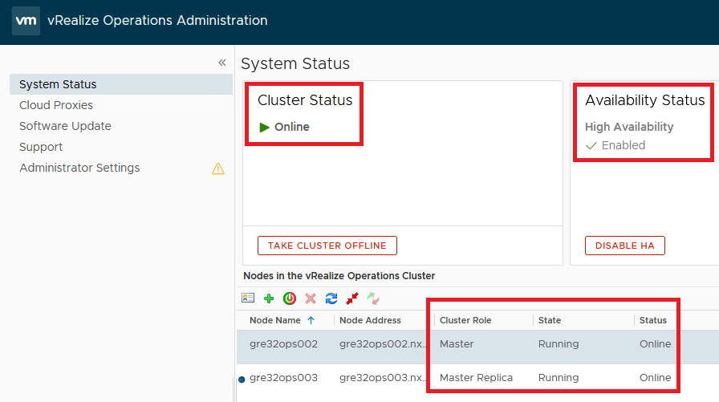

   - Go to `Cloud Proxies` and check whether or not the Health Status is `Healthy` and Upgrade Status is `Complete`:
       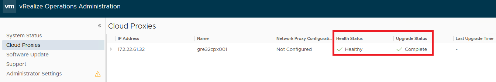
   - Login into the vRealize Operations UI  `https://<locationCode>ops002.<domainName>/ui`, go to `Data Sources\Integrations\Accounts` and validate if the state of the configured integrations is shown as "OK". Upgrade cannot be started while there are any Warnings/Errors. Please fix them before proceeding with the upgrade!
   - In `Data Sources\Integrations\Repository` tab, note down the versions of the management packs with configured integrations in `Data Sources\Integrations\Accounts`.
  
3. Download upgrade bundle from <https://vmware.com>

4. Ensure vRSLCM is in version 8.10.

### List of bundles

**vROPS**

| Component                                           | Build Number | Size   | Version | Description                                                                                                                                                                                                                               |
| --------------------------------------------------- | ------------ | ------ | ------: | ----------------------------------------------------------------------------------------------------------------------------------------------------------------------------------------------------------------------------------------- |
| vRealize Operations - Virtual Appliance upgrade pak | 20570120     | 3.78GB |    8.10 | [This upgrade .pak file includes the OS upgrade files from Photon to Photon, the vApp upgrade files, and Cloud Appliance upgrade files.](https://customerconnect.vmware.com/en/downloads/details?downloadGroup=VROPS-8100&productId=1350) |

## Upgrade procedure

### NSX-T firewall  

You have to create as many rules for `Cpx` as it is defined in [Software Defined Networks Firewall LLD](../design/lldSoftwareDefinedNetworksFirewall.md)

#### Procedure

- Log into `https://<locationCode>nsx001.<domainName>` with administrator privileges
- Go to `Inventory` > `Groups`
- Click `Add Group` button
- Provide group name `<customerCode>seg079`
- Click `Set Members` > `IP Addresses`
- Enter an IP address for vROPS Cloud Proxy `<xRegion Network>.32` and click `Apply`
  
  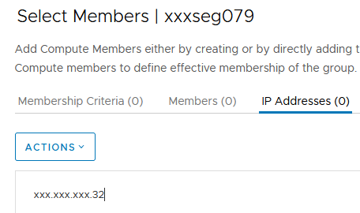
- Click `Add Group` button
- Provide group name `<customerCode>seg079_APPLYTO`
- Click `Set Members` > `Membership Criteria` > `Add Criteria`
- Select `Virtual Machine` > `Name` > `Contains` > `<locationCode>cpx001` and click `Apply`
  
  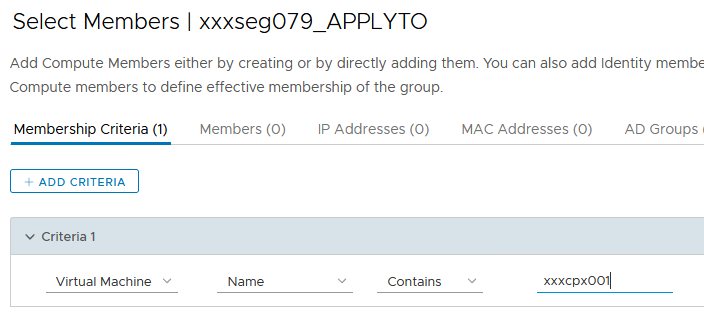
- Go to `Security` > `Distributed Firewall` and click `+Add Policy`
- Click `New Policy` in the newly created entry and provide a name `Cpx`
  
  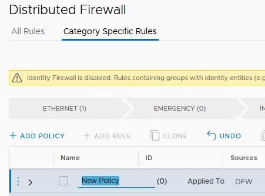

- Click three dots in the newly created policy and select `Add rule`
- Click `New Rule` in the newly created entry and provide a name `ToCpx`
  
   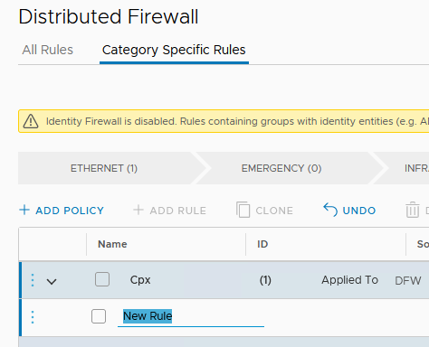
- Under `Sources` add `<customerCode>seg001`
- Under `Destinations` add `<customerCode>seg079`
- Under `Services` add `TCP4505`
- Under `Applied To` add `<customerCode>seg079_APPLYTO`

> NOTE:  
In case of any specific Service doesn't exist, first you must create it. Go to `Inventory` > `Services`, click `Add Service`, provide `Name`, click `Set Service Entries`, click `Add Service Entry`, provide `Name`, select `Service Type` e.g. TCP, provide `Additional Properties`
>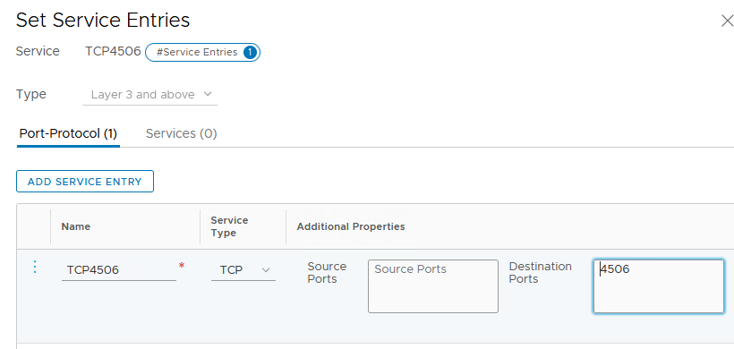

### Please execute above steps to add all required traffic rules for vROPS Cloud Proxy `(policy name: Cpx)` mentioned in [Software Defined Networks Firewall LLD](../design/lldSoftwareDefinedNetworksFirewall.md)

### vROPS Cloud Proxy deployment

Please follow the work instruction [Replace vRops Epops Agents with vROps Telegraf Agents](wiReplaceVropsEpopsAgentWithTelegrafAgent.md)

### vROPS upgrade

> NOTE:  
Double check that after Cloud Proxy deployment, vROPS is working properly as described in point number 2 of the [Upgrade Prerequisites](#prerequisites).
Please ensure that all installed Telegraf Agents have the green status.

It is mandatory to create a snapshot of each node in the cluster and cloud proxy before you upgrade a vRealize Operations cluster. Once the upgrade is completed sucessfully, you must delete the snapshot to avoid performance degradation.

### Procedure

- Log into the vRealize Operations Administrator interface at `https://<locationCode>ops002.<domainName>/admin`
- Go to `System Status`, click `Take Cluster Offline`
- When all nodes are offline log into the `https://<locationCode>vcs001.<domainName>` using `vSphere client`
- Right-click the vRealize Operations virtual machines `<locationCode>ops002`, `<locationCode>ops003`, `<locationCode>cpx001`
- Click `Power` and select `Shut down Guest OS`
- Wait until all VMs are powered off
- Right-click the vRealize Operations virtual machines `<locationCode>ops002`, `<locationCode>ops003`, `<locationCode>cpx001`
- Click `Snapshot` and then click `Take Snapshot`
- Name the snapshot using a meaningful name such as "Pre-Update"
- Uncheck the `Include Virtual Machine Memory` check box
- Uncheck the `Quiesce Guest File System (requires VM Tools)` check box
- Click `OK`
- Repeat these steps for each node in the cluster and each cloud proxy (cpx)
- Right-click the vRealize Operations virtual machines `<locationCode>ops002`, `<locationCode>ops003`, `<locationCode>cpx001`
- Click `Power` and click `Power On`
- Repeat these steps for each node in the cluster and each cloud proxy (cpx)
- Wait until all vROPS VMs are up and runnig
- Log into the vRealize Operations Administrator interface at `https://<locationCode>ops002.<domainName>/admin`
- Go to `System Status`, click `Take Cluster Online`
- When all nodes are online, go to the `Software Update` on the left pane
- Click `Install a Software Update...` in the main pane
- Follow the steps in the wizard to locate and install your PAK file

  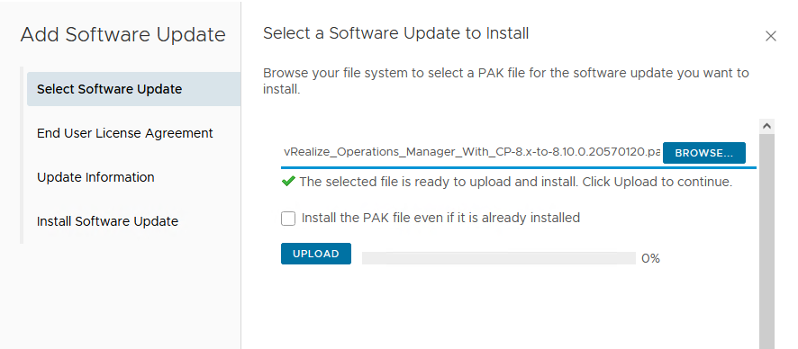
- This updates the OS on the virtual appliance and restarts each virtual machine
  
  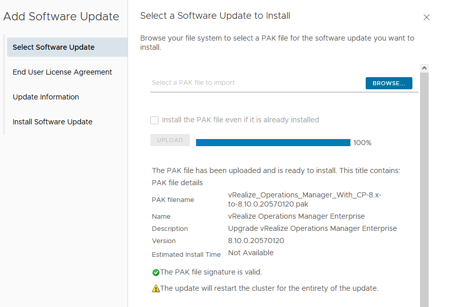
- Read and accept the `End User License Agreement and Update Information`, and click `Next`

  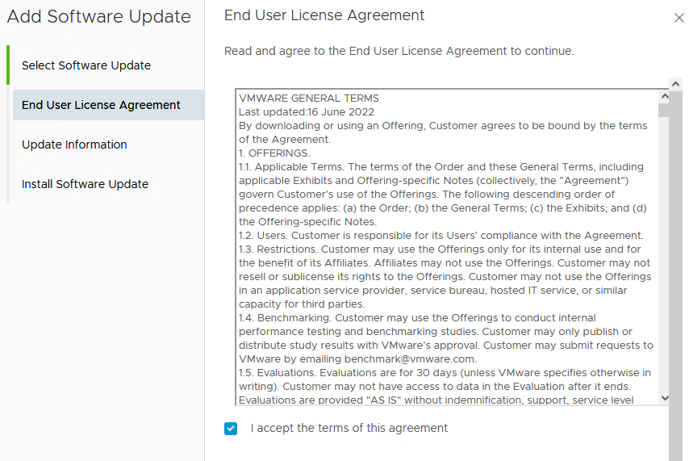
- Click `Next` and on the final screen click `Install`
  >NOTE:  
  After you click `Install`, the installer will restart the vRealize Operations administrator interface, and you will be logged out. Log in once again to the vRealize Operations administrator interface when it is ready, and follow the upgrade status in the software upgrade page.
- Log back into the `https://<locationCode>ops002.<domainName>/admin`  
  The main `Cluster Status` page appears and cluster goes online automatically. The status page also displays the Bring Online button, but do not click it.
- Clear the browser cache and if the browser page does not refresh automatically, refresh the page
- The cluster status changes to Going Online
- Once the cluster status changes to Online, the upgrade is complete
  
  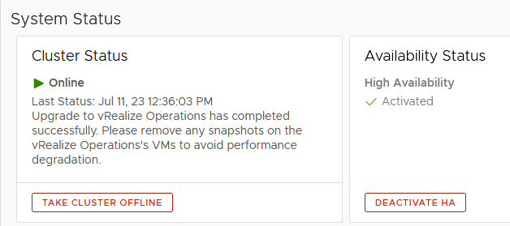
- Click `Software Update` to check that the upgrade is done  
  A message indicating that the upgrade completed successfully appears in the main pane.
  
  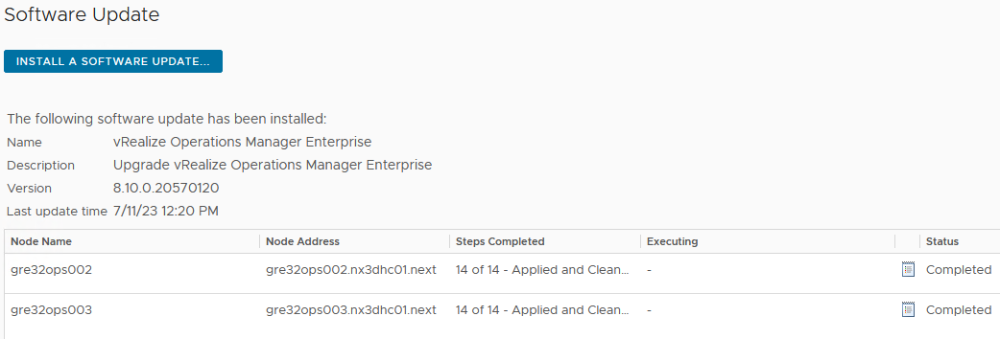
  >NOTE:  
  The cloud proxy (cpx) upgrade starts automatically after the vRealize Operations upgrade is complete successfully.
- Click `Cloud Proxies` on the left pane to check the result

  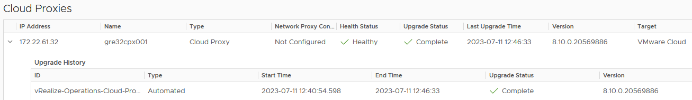

- Open web browser and login to vRSLCM URL: `https://<locationCode>lcm001.<domainName>` as `admin@local` user
- Navigate to `Lifecycle Operations` -> `Environments`
- Click on `View Details` link within `vROPS_environment` and click on 3-dots icon and select `Trigger Inventory Sync`

 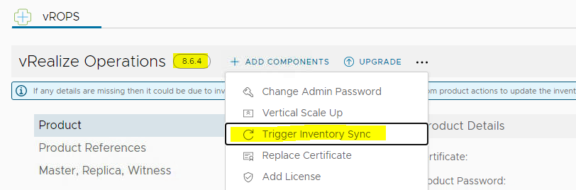

- Click `Submit` to start the inventory sync
  
 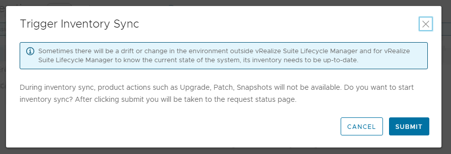

- Monitor the request status until it will be fully completed

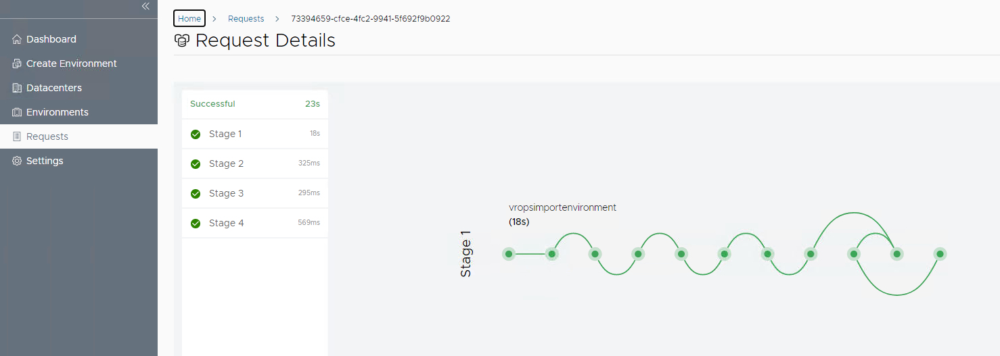

- Navigate again to `Lifecycle Operations` -> `Environments` and click on `View Details` link within `vROPS_environment`
- Make sure the version of vROPS environment increases to 8.10.0

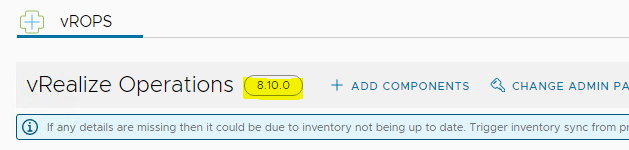

### Management Packs upgrade

After vROPS upgrade, login into the vRealize Operations UI  `https://<locationCode>ops002.<domainName>/ui`, go to `Data Sources\Integrations\Accounts` and validate if the state of the configured integrations is shown as "OK". Upgrade cannot be started while there are any Warnings/Errors. Please fix them before proceeding with the upgrade!
In `Data Sources\Integrations\Repository` tab, note down the versions of the management packs with configured integrations in `Data Sources\Integrations\Accounts`. The values accumulated before and after the update should then be compared with the values in the table below.

| Management Pack | Latest compatible version | Other compatible versions |  Notes |
|---|---|---|---|
|vSphere | 8.10.0.20569938 |  | part of VROPS, cannot be updated|
|VMware Cloud on AWS | 8.10.0.20569922 |  | part of VROPS, cannot be updated|
|vSAN|8.10.0.20569934  |  | part of VROPS, cannot be updated|
|vRealize Automation 8.x|8.10.0.20569906 |  | part of VROPS, cannot be updated|
|vRealize Log Insight| 8.10.0.20569940 |  | part of VROPS, cannot be updated|
|vRealize Network Insight| 8.10.0.20569926 |  | part of VROPS, cannot be updated|
|NSX-T | 8.10.0.20569914 |  | part of VROPS, cannot be updated|
|vSphere Replication Adapter | 8.7 | 8.6 |The appropriate version should be used taking into account your vSphere Replication version|
|VMware Identity Manager Management Pack | 1.3.1 | 1.3 |The appropriate version should be used taking into account your IDM version|
|Site Recovery Manager Adapter | 8.7 | 8.6 |The appropriate version should be used taking into account your SRM version|
|SDDC Management Health | 8.10 | 8.10.1 |The appropriate version should be used taking into account your SDDC Manager version|
|Management Pack for Storage Devices | 8.4.1.19367390 |  ||
|VMware Aria Operations Aggregator Management Pack | 2.0.1 | 2.1, 2.0  ||
|VMware vRealize End Point Operations for Active Directory | 1.1 |  |Newest version is not officially supported |
|Dell EMC VxRail Management Pack for vRealize Operations| 1.1| |Newest version is not officially supported|

Any inconsistency between the current and the expected state should be resolved by installation the latest compatible Management Pack's version according to the example.

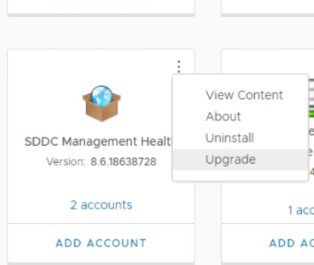

Management Pack's binaries are accessible from VMware Marketplace as .pak files. After clicking the upgrade button in the `Data Sources\Integrations\Repository` location, follow the Software Update wizard to complete the upgrade process.

### Telegraf Agent upgrade

Due to the fact that Telegraf Agent is not upgraded automatically, it has to be done manually.

- Log into the vRealize Operations interface at `https://<locationCode>ops002.<domainName>`
- On the left pane select `Environment` > `Applications`
- Click `Manage Telegraf Agents`
- Check all checkboxes near endpoints, where Telegraf Agent is currently installed

  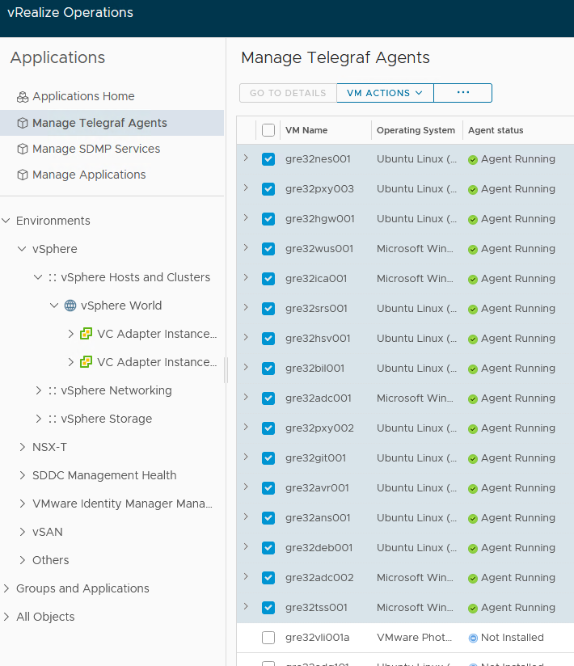
- Hover over the three dots, click and select `Update`
  
  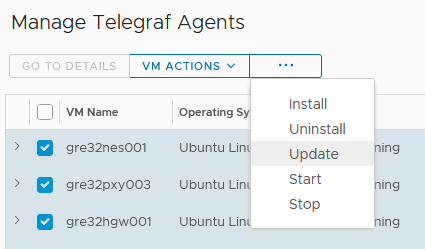  

- Finally `Telegraf Agent`  should be upgraded to version 8.10

  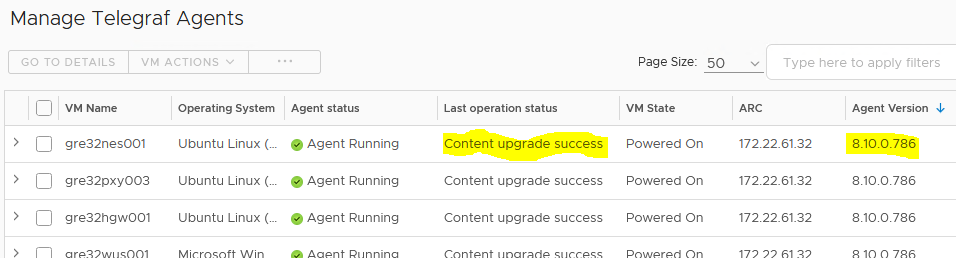

## Post upgrade tasks

### Removing snapshots

- Log into the `https://<locationCode>vcs001.<domainName>` using `vSphere client`
- Right-click the vRealize Operations virtual machines `<locationCode>ops002`, `<locationCode>ops003`, `<locationCode>cpx001`
- Click `Snapshot`, select a snapshot with the name you provided earlier and then click `Delete`
- Click `Delete`
- Repeat these steps for each node in the cluster and each cloud proxy (cpx)
