# VSAN Stretched Cluster DR Network Disconnect - Management Compute Test

# Changelog
  
| Version | Date       | Description              | Author       |
| ------- | ---------- | ------------------------ | --------------- |
| 0.1     | 14/02/2020 | First version | Maciej Losek |
| 0.2     | 21/06/2022 | Minor updates | Lukasz Tomaszewski |

## Introduction

### Purpose

Test unplanned network disconnection of the entire rack ( Mgmt cluster and CMP cluster) to check if all Mgmt and Cmp VMs will move into the secondary zone.

### Audience

- VCS Operations
- VCS Engineers

### Scope

- Remove VLANs
- Observe VMs spin up on second site
- Validate service continuity

## Scenario

Steps that should be taken to test unplanned network disconnection:

1. The entry point is that all VMs from AZ1 (MGMT and CMP) run on ESXi hosts in Primary Zone and all are pingable.
2. Using vSphere Client make sure that all VMs (MGMT and CMP) from AZ1 are hosted by ESXi hosts in primary site.
3. Make sure that vSAN Stretched Cluster is Healthy
4. Start pinging all VMs using fping tool. This binary can be installed on Ubuntu VMs by executing: sudo apt install fping.
5. On both Top of Rack Switches (tor11 and tor12 in nx5- names depend on env) on trunk interface port channel 120 (rack uplink- depends on env) remove vlans xx-xy (vland tag depends on env.)
6. During tests vCenter server will be unavailable.
7. Using fping, monitor if VMs from mgmt and cmp cluster are restarted on Secondary Site.
8. VMs should restart in order specified under restart priority settings.
9. When VCSA is up, log in and check if all VMs from mgmt and cmp clusters are vMotioned successfully from AZ1 to AZ2.
10. Once VMs are started on secondary zone, all of them are pingable.
11. Check if all mgmt services work correctly:
    - Domain Controllers and DNS;
    - log in to both VCSA (mgmt and cmp) using `administrator@vsphere.local` account ( check VMs status );
    - log in to TSS01 and TSS02 using domain account;
    - check ssh connectivity to ans001;
    - check if <https://vIDM_FQDN> is responsive, log in and check if all AD groups and users are synced.
    - check if <https://Vault_FQDN> is responsive
    - check if <https://vROPS_FQDN> is responsive, log in and check stretched cluster dashboard- both fault domain, hosts and VMs should be visible
    - check if <https://vRLI_FQDN> is responsive and log in
    - check if <https://NSXT_Manager_FQDN> is responsive and log in - check edge nodes status;
    - check ssh connectivity to all MID servers
    - check vRA Cloud VM deployment
    - check if <https://SDDCMANAGER_FQDN> is responsive and log in, check AZ1 MGMT ESXi hosts status
12. Check if CMP VMs work properly.
13. Check vSAN Health status of both clusters. It may happen that some vSAN components and objects will be in Absent state. It means that vSAN detects a temporary component failure where the component might recover and restore its working state. vSAN should start rebuilding components if they are not available within a certain time interval. By default in VCS, vSAN starts rebuilding absent components after 60 minutes.

# Result of tests

DR tests for entire rack (Mgmt and Cmp clusters) was performed in NX5 environment and finished successfully. Due to fact that this env was not integrated to vRA Cloud, Service Now and KMS these services couldn't be tested.
Rest of services were responsive. Below link to recorded presentation and logs as a proof:
[DR_tests](https://sp2013.myatos.net/ms/gd/cloud/eso/pp/dpc/dpc_dev_other/Recorded%20presentations/DHC-DrTests-MgmtCmp.avi)

#### Step 2- all mgmt and cmp VMs run on ESXi hosts in Primary Zone- VMs were up and pingable

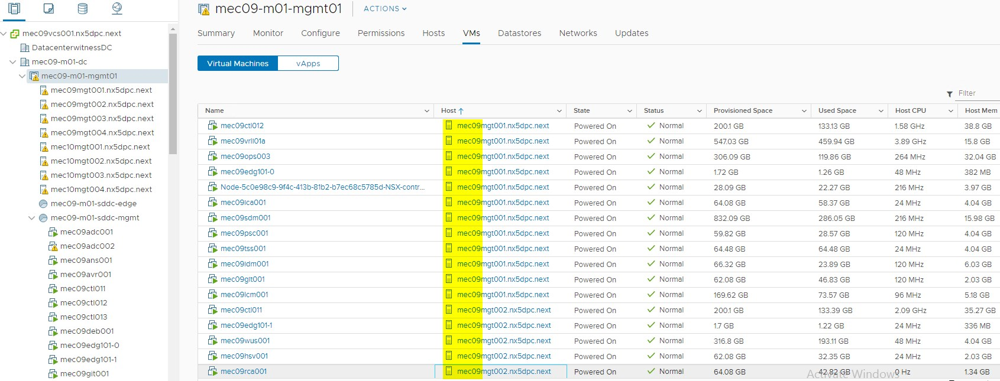
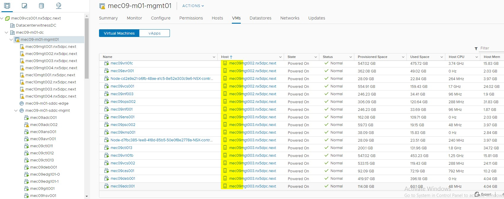
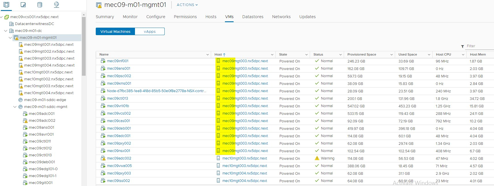
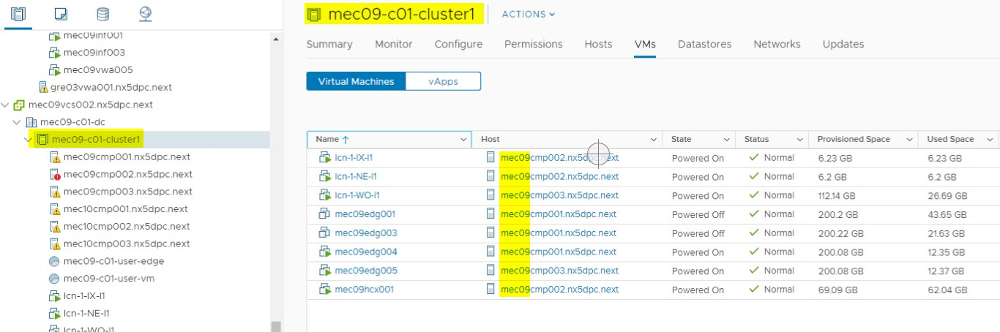
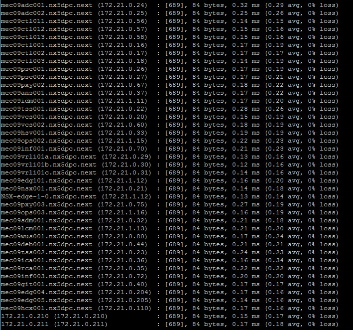

#### Step 3- vSAN Stretched Cluster was Healthy

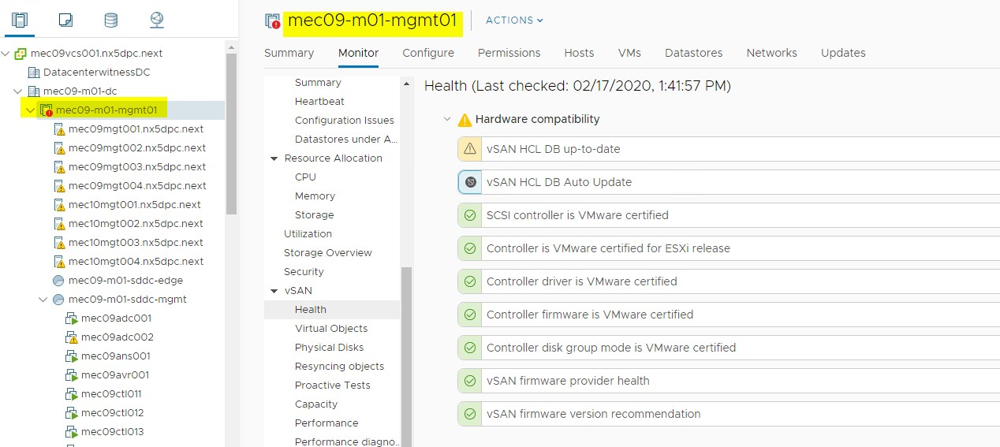
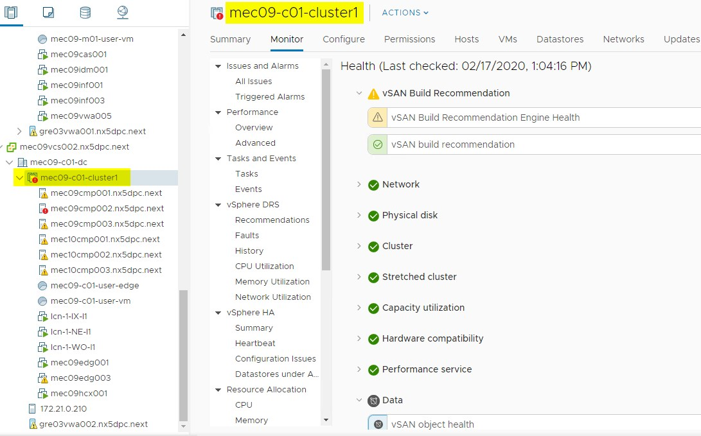

#### Step 4 - Ping started

#### Step 5,6- AZ1 ESXi hosts disconnected - vCSA stopped responding

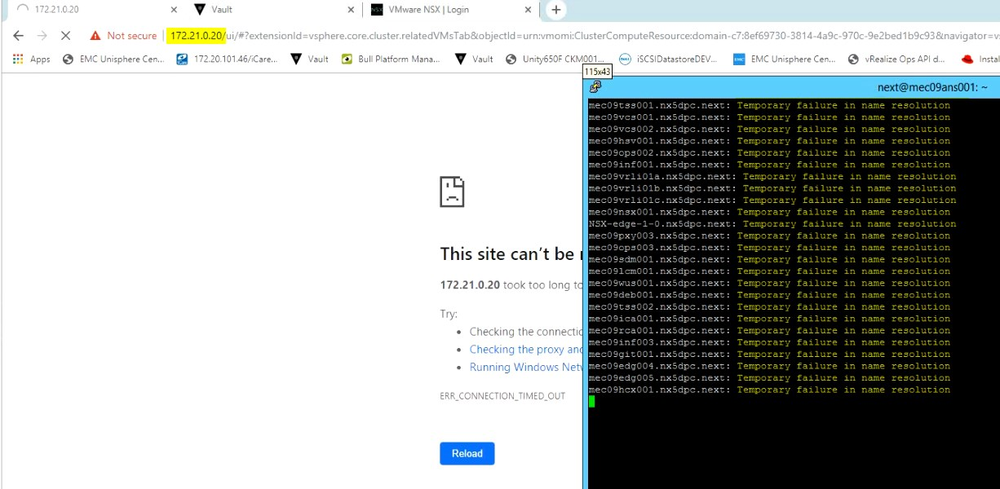

#### Step 7, 8- All VMs become unavailable

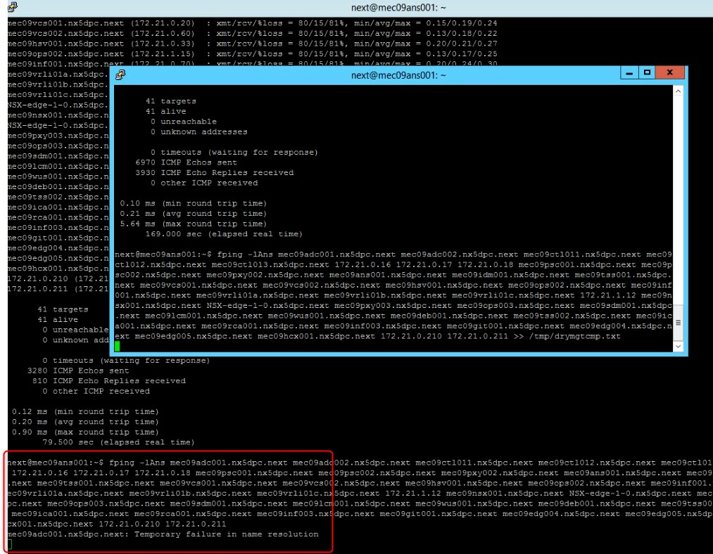
  
#### Step 9- All VMs have been failover to AZ2

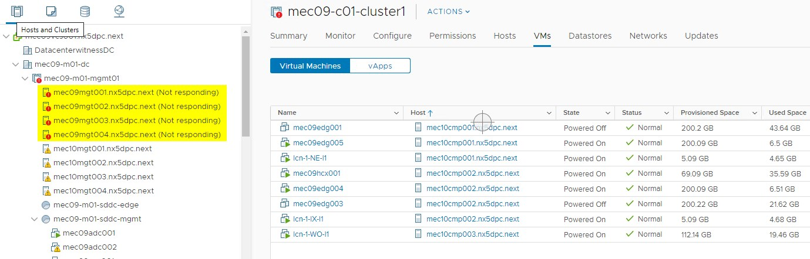
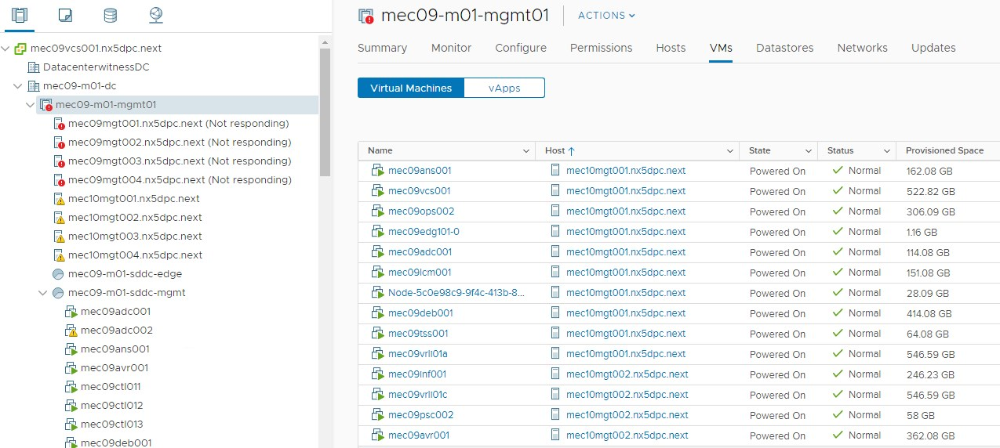
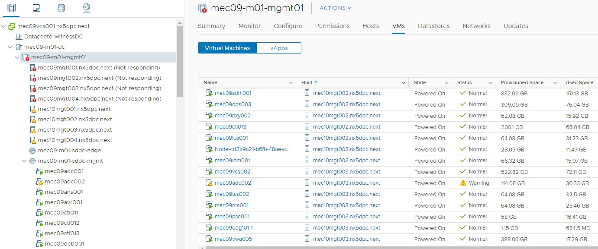
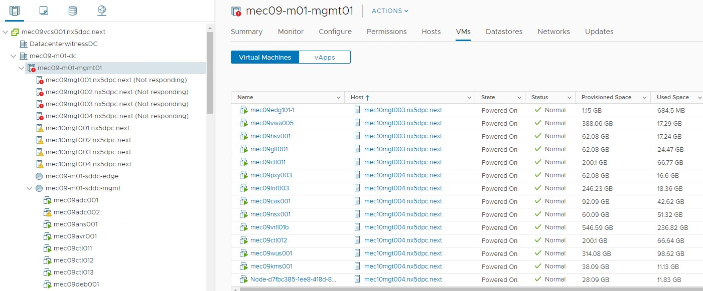
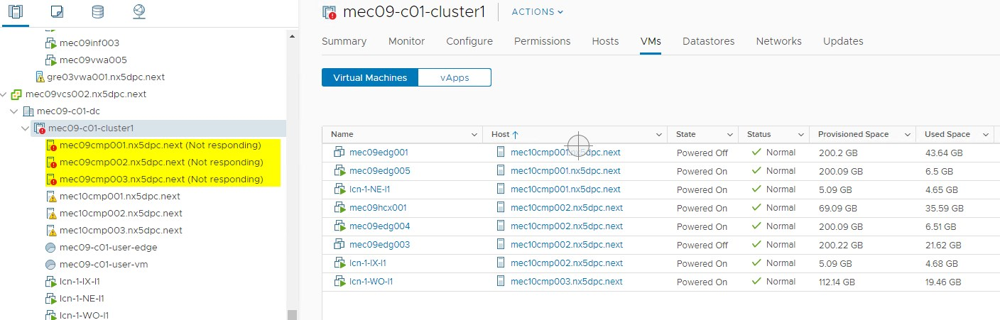
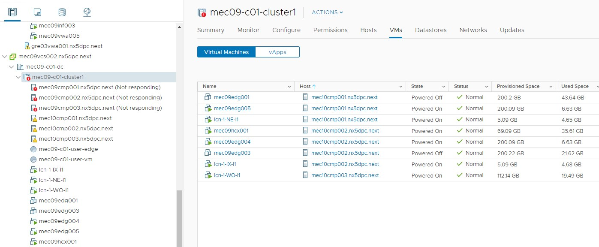

#### Step 10- Checking if all services are running
