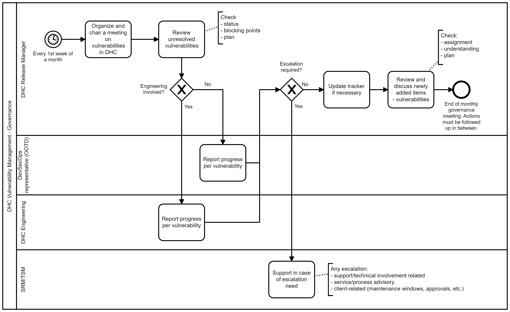
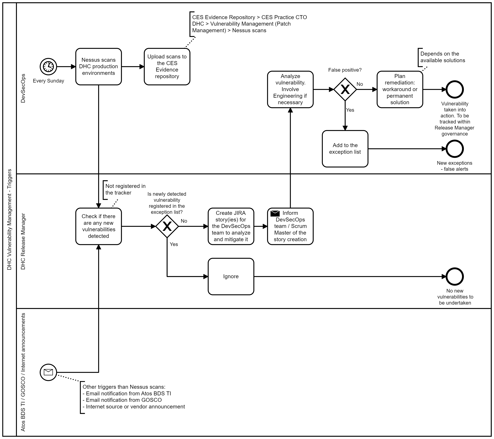

# Vulnerability Management in VCS

## Content

- [Vulnerability Management in VCS](#vulnerability-management-in-vcs)
  - [Content](#content)
  - [Document control](#document-control)
  - [Introduction](#introduction)
    - [Purpose](#purpose)
    - [Audience](#audience)
    - [Scope](#scope)
  - [Related Documents](#related-documents)
- [Process Description](#process-description)
  - [Process Goals](#process-goals)
  - [Measure - Key Performance Indicators](#measure---key-performance-indicators)
  - [Governance](#governance)
  - [Process Activators](#process-activators)
  - [Contacts \& Responsibilities](#contacts--responsibilities)

## Document control

| Version | Date | Description | Author |
|---------|------|-------------|--------|
|0.1|27.04.2022|DHC-4632 Initial process description.|Pawel Osial|

## Introduction

### Purpose

Describe the Vulnerability Management in VCS production services.

### Audience

- Release Manager
- VCS Operations
- VCS Engineering
- SRM/TSMs

### Scope

Additionally this document is a formal description of the actions taken around detected vulnerabilities within all production VCS environments. Management, GOSCO, OSCO, and auditors can be also considered as audience of this document.

## Related Documents

|Document|URL|
|--------|---|
|Security Measure Exceptions - Will be officially replaced by the vulnerability tracker soon|[LINK](../design/SecurityMeasureExceptions.md)|
|Vulnerability Management LLD|[LINK](../design/lldVulnerabilityManagement.md)|
|VCS Vulnerability and exceptions tracker|[LINK](https://atos365.sharepoint.com/:x:/r/sites/100001848/CES%20Evidence%20Repository/CES%20Practice%20CTO%20DHC/Vulnerability%20Management%20(Patch%20Management)/DHC%20Vulnerability%20and%20exceptions%20tracker.xlsx?d=wf9c2c34fc07d42c5b2759eae981e2eaa&csf=1&web=1&e=lwcPr9)|
|Nessus scans evidence repository|[LINK](https://atos365.sharepoint.com/sites/100001848/CES%20Evidence%20Repository/Forms/AllItems.aspx?OR=Teams%2DHL&CT=1643720096214&sourceId=&params=%7B%22AppName%22%3A%22Teams%2DDesktop%22%2C%22AppVersion%22%3A%2227%2F22010300408%22%7D&id=%2Fsites%2F100001848%2FCES%20Evidence%20Repository%2FCES%20Practice%20CTO%20DHC%2FVulnerability%20Management%20%28Patch%20Management%29%2FNessus%20scans&viewid=05b27bd5%2D15b8%2D4db1%2D8554%2Dc8166dd2b710)|

# Process Description

## Process Goals

The goal of this process is to have all production VCS environments scanned for vulnerabilities on a regular basis (weekly), and have those detected vulnerabilities analyzed and mitigated. Quick mitigation of the detected vulnerabilities will prevent the VCS service from security threats and will ensure platform safeness.

## Measure - Key Performance Indicators

No formal KPIs have been set around this process yet. For now informal KPIs are:

|KPI|
|---|
|Resolve all critical vulnerabilities within a month from detection|
|Zero escalations around resourcing and progress in vulnerabilities mitigation|

Vulnerability Management tracker is capable of tracking those KPIs. Further KPIs analysis and their formalization will take place after some time of process being in use.

## Governance

To control detected vulnerabilities and to track their mitigations, a tracker has been established and monthly meetings are scheduled. Vulnerability management governance workflow is defined below in BPMN notation.

Monthly governance calls agenda:

1. Review unresolved vulnerabilities
2. Discuss and update open items
3. Review newly added items (*Vulnerabilities can come from different sources. [Detailed explanation of process triggers](#process-activators).*)
4. Plan remediations - JIRA stories, etc... (*JIRA Stories should be created regularly independently of monthly meetings*)
5. AOB

## Process Activators

Below graph provides workflow of activating the vulnerability management process in BPMN notation. Triggers can be as followed:

- Nessus Scan results
- Atos BDS TI internal notification
- GOSCO email notification
- OSCO email notification
- any other source from the Internet, e.g. vendor website

## Contacts & Responsibilities

|Role|Name|Contact details|Responsibility|
|----|----|---------------|--------------|
|Release Manager|Karolina Cygan|`karolina.cygan@atos.net`|Track/coordinate vulnerabilities; chase for progress; update the tracker; chair the meetings; open JIRA stories;|
|DevSecOps representative (OOTD)|N/A|DHC-DevSecOps Group Mailbox <DHC-DevSecOps@atos.net>|Upload Nessus scans to the CES Evidence repository; join monthly meetings; gather updates on open items in the tracker from the team members;|
|DevSecOps representative|any team member assigned to vulnerability mitigation|N/A|test remediations in the VX3 environment; implement remediations;|
|Engineering|Lukasz Tomaszewski|`lukasz.tomaszewski@atos.net`|Support in case of complex vulnerabilities/remediations; takes care of product related vulnerabilities;|
|SRM/TSM|SRM - Pawel Osial; BTN TSM - Michal Rolewicz; SFA TSM - Janusz Jucewicz|`pawel.osial@atos.net`; `michal.rolewicz@atos.net`; `janusz.jucewicz@atos.net`|Support in case of escalation required or any other client/service/process related matters;|
