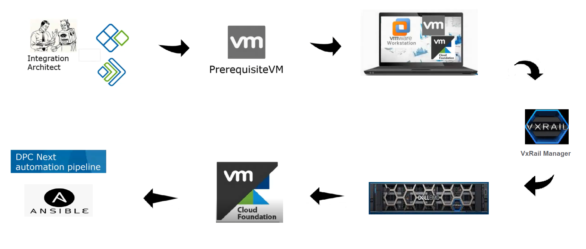
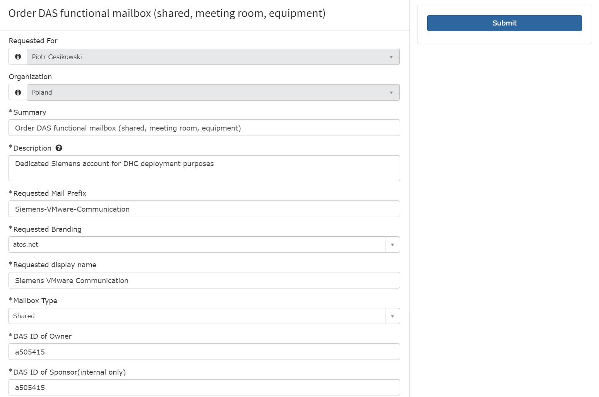
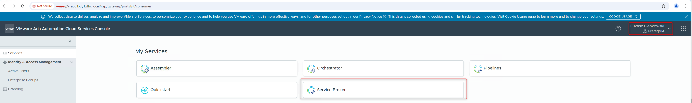
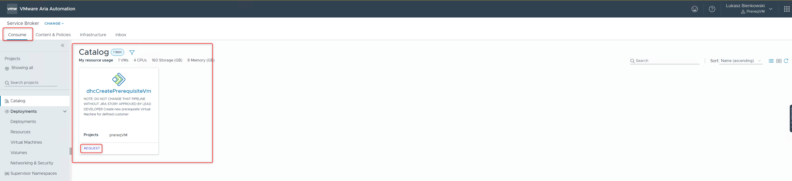
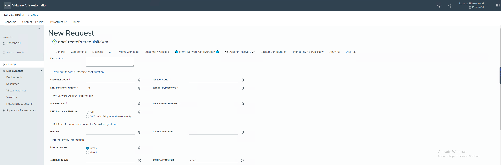
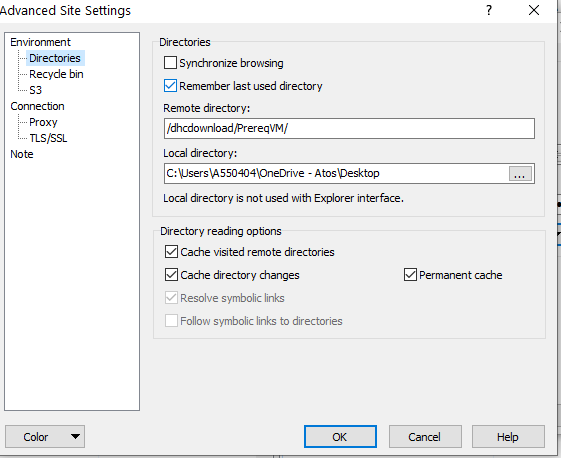
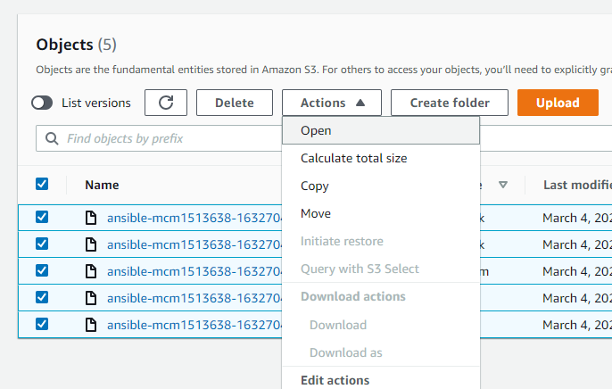

# VCS on VxRail Build Guide

# Table of Contents

- [VCS on VxRail Build Guide](#vcs-on-vxrail-build-guide)
- [Table of Contents](#table-of-contents)
- [Changelog](#changelog)
- [Introduction](#introduction)
- [Software Repository](#software-repository)
- [VCS on VxRail build steps overview](#vcs-on-vxrail-build-steps-overview)
- [VMware service account](#vmware-service-account)
- [DELL EMC service account](#dell-emc-service-account)
- [Input data](#input-data)
  - [Naming Convention](#naming-convention)
  - [Infrastructure Requirements](#infrastructure-requirements)
    - [Network Infrastructure](#network-infrastructure)
  - [List of input parameters for Prerequisite VM](#list-of-input-parameters-for-prerequisite-vm)
    - [General inputs](#general-inputs)
    - [Licenses](#licenses)
    - [Git](#git)
    - [Mgmt workload inputs](#mgmt-workload-inputs)
    - [Customer workload inputs](#customer-workload-inputs)
    - [Customer network configuration inputs](#customer-network-configuration-inputs)
    - [Management network configuration inputs](#management-network-configuration-inputs)
    - [Disaster Recovery inputs](#disaster-recovery-inputs)
    - [Backup integration](#backup-integration)
    - [Monitoring/ServiceNow integration inputs](#monitoringservicenow-integration-inputs)
    - [Antivirus integration](#antivirus-integration)
    - [Alcatraz integration](#alcatraz-integration)
  - [vCF Bill of Materials](#vcf-bill-of-materials)
  - [List of vCF Download Bundle IDs](#list-of-vcf-download-bundle-ids)
- [Deployment steps](#deployment-steps)
  - [VCS on DELL EMC VxRail (VCF on VxRail)](#vcs-on-dell-emc-vxrail-vcf-on-vxrail)
  - [Creating Prerequisite VM](#creating-prerequisite-vm)
    - [IMPORT the Prerequisite VM on the Workstation](#import-the-prerequisite-vm-on-the-workstation)
    - [Creating Prerequisite VM Video](#creating-prerequisite-vm-video)
  - [VxRail Manager Initialization](#vxrail-manager-initialization)
  - [Bring Up of vCF and non-VCF components (stage0, stage1, stage2)](#bring-up-of-vcf-and-non-vcf-components-stage0-stage1-stage2)
    - [Build Steps](#build-steps)
  - [Manual RBAC implementation for VMware Identity Manager](#manual-rbac-implementation-for-vmware-identity-manager)
  - [MID servers - Snow/CMP](#mid-servers---snowcmp)
  - [Remote board security hardening](#remote-board-security-hardening)
    - [iDRAC](#idrac)
      - [Configure basic settings for DELL iDRACs](#configure-basic-settings-for-dell-idracs)
      - [Configure Syslog](#configure-syslog)
      - [Configure Secure SNMP](#configure-secure-snmp)
  - [vSAN Encryption](#vsan-encryption)
  - [VCS Hardening (stage3)](#vcs-hardening-stage3)
- [Lifecycle Management](#lifecycle-management)
- [Post deployment activities](#post-deployment-activities)
  - [DC Networking Sign Off](#dc-networking-sign-off)
  - [Multi-tenancy Deployment Scenarios - VRA integration](#multi-tenancy-deployment-scenarios---vra-integration)
  - [SCG Deployment](#scg-deployment)
  - [VCS backup integration](#vcs-backup-integration)
  - [Alcatraz framework integration (Tosca)](#alcatraz-framework-integration-tosca)
  - [Nessus scheduled email reports](#nessus-scheduled-email-reports)
  - [CMDB auto discovery enablement](#cmdb-auto-discovery-enablement)
  - [Compliance overview](#compliance-overview)
  - [Reporting overview](#reporting-overview)
  - [End to End Testing for VCS and DHCVXRAIL](#end-to-end-testing-for-vcs-and-dhcvxrail)
  - [Operational and integration playbooks](#operational-and-integration-playbooks)
    - [Recommendations](#recommendations)

# Changelog

|    Date    |   TOS   |   Issue   | Author | Description |
| ---------- | ------- | --------- | ------ | ----------- |
| 24.12.2021 | DHCVXR 1.0 |   | Rohit Singh     | Initial document creation |
| 28.12.2021 | DHCVXR 1.0 |   | Vishnu Panchal  | Making minor changes |
| 24.05.2022 | DHCVXR 1.0 |   | Rohit Singh     | Adding steps for factory reset |
| 21.06.2022 | DHCVXR 1.0 |   | Rohit Singh     | Updating suggestions recommended by Kacper |

# Introduction

This document provides step-by-step procedure for deploying a VCS on VxRail. Target audience is DHCVXR Devops team, deployment engineers, integration architect and all people who wants to know or involved in VCS on VxRail deployment  procedure. It is assumed that the reader has reasonable understanding of DellEMC VxRail platform & VCS architecture and design.

# Software Repository

The following resource repositories store ansible scripts (playbooks, and roles), documentation and binaries required for VCS deployment and VCS on VxRail deployment. Their content is retrieved automatically during the VCS deployment.

| Resource repository | URI| Comment|
| ------ | ------ | ------ |
| Amazon S3 |  | software and images available from Code Stream pipe line when creating PrerequisiteVM|
| VCS on VxRail Github Repository | <https://github.com/GLB-CES-PrivateCloud/DHCVXR-Deploy> | Software Repository |
| VCS on VxRail Documents Repository | <https://github.com/GLB-CES-PrivateCloud/DHC-Documentation> | Document Repository common for VCS and DHCVXR  |

# VCS on VxRail build steps overview



1. Integration Architect gathers details of VxRail hardware, network, backup integration, antivirus integration, service now integration etc. Integration architect should also verify DC LAN design with NDCS (for supportability) and against DHC requirements (for compliance) at
this stage.
2. Integration Architect creates service account in Atos, VMware and Dell systems.
3. Integration Architect executes creation of prerequisite VM task on VMware Console. The Prerequisite VM is required during the VxRail BringUp, SDDC Bring UP, vCF on VxRail BringUp as it provides initial DNS, DHCP, NTP services as well as orchestrates non-VCF components build up.
4. Integration architect shares prerequisite VM OVA with deployment team.
5. Deployment team downloads prerequisite VM OVA, The prerequisite VM OVA is imported to workstation.
6. Deployment team connects laptop with VMware Workstation that runs prereqVM to VCS switches (management network).
7. Verify VxRail nodes are racked, nodes powered ON. Cabling and network configuraiton done. Nodes should be accessible over iDRAC.
8. Download VxRail 7.0.241 code from DellEMC.
9. After above steps are completed, proceed with Stage0, Stage1 and Stage2 deployment.

# VMware service account

1. Create shared email account ({ customerCode}-VMware-Communication) in @atos.net domain.
    - Open Atos Service Portal - PISA
    - go to IT -> Communications and Email -> Email Mailbox -> Order DAS functional mailbox
      
    - Click Submit
    - Account creation shouldn't take more than 24h
    - After creation of email account open PISA Portal once again
    - Go to IT -> Communications and Email -> Email Mailbox -> Manage mailbox permissions (bulk addition/removal)
    - Complete and attach "BulkPermission Template" with the all account that should have permissions to the newly created shared mail account (i.e members of the Ops Team that will provide support for the particular VCS customer)
2. Create a myVMware account:
    - Open <https://my.vmware.com/>
    - Select “Register”
    - Enter `xxx@atos.net` account as the account’s email address

       

    - Make sure to select VMware partner YES and Organization.

       

    - Note down the password
    - Click Sign-Up
3. Wait for registration email message that will be sent to `xxx@atos.net` email account from `donotreply@vmware.com`.
  
    - Use the link provided to activate the account.
4. Contact `contract-administration@atos.net` and request new account to be assigned software download rights.

# DELL EMC service account

Create a DellEMC support service account required for VxRail LCM.

1. Open [EMC Login](https://support.emc.com/) which will redirect to dell.com for SSO authentication or new account creation

   

2. Please use shared email account ({ customerCode}-VMware-Communication) in @atos.net domain created in last step
3. Enter password for the account and note it down, this password will be required later during VCS deployment as input.
4. Click on "Create Account"
   You will receive an email with OTP for account creation.

    

5. Enter OTP received on email to validate account.

    

6. At this stage account will be created and you will be redirected to finish the registration-

    

7. Select appropritate category for account-

    

8. Provide phone no. for the account and click submit.

    

9. Select Company the account belongs to-

    

10. Confirm selected organization, click on submit.

    

11. Now you will be redirected to Welcome page in support portal.

    

** Make sure that this account has access all DellEMC sites where products are installed  

** Make sure this account has got package download rights. If any issues, contact `support@emc.com`  

# Input data

The deployment steps that are described in the next paragraph require a number of input data.

Make sure all the data is gathered before you go into actual implementation.

---

## Naming Convention

All the input data must be aligned with the latest approved [naming convention](../design/namingConvention.md).

**IMPORTANT**

Especially pay attention to domain name which is concatenation of variables and hard-coded string values.  
VCS domain name is equal to:  `< customerCode >dhc< dhcInstance >.next`, i.e. `nx3dhc01.next` or `nx1dhc01.next` or `nx8dhc01.next`.

## Infrastructure Requirements

Following documents describes components that are not directly managed and created by DHC, and are required for correct build process.

- [Network](https://github.com/rohitsiingh/vxrail-docs/blob/main/lldSoftwareDefinedNetworks.md)
- [VSAN Witness](dhcVsanWitnessAppliance.md)

### Network Infrastructure

For TOP process, it is required that there are checks performed throughout the installation of VCS on VxRail to ensure that the network design is compliant with both VCS on VxRail design and NDCS supportability.
It is broken in to three parts.

1. Validation with VCS on VxRail requirements and NDCS requirements at design stage
2. Validation with NDCS at implementation time that assumptions are correct and design is valid in real world.
3. Post install check against design and configuration to ensure network is deployed as expected by DHC and NDCS.

## List of input parameters for Prerequisite VM

The Prerequisite VM is required during the VxRail bring up, SDDC Bring UP as it provides initial DNS, DHCP, NTP services as well as it orchestrates non-VCF components build up.  
The Prerequisite VM is generated with each VCS deployment.  The parameters below are only a sample values, but it's a good starting point for Integration Architect what kind of data have to be gathered.

### General inputs

| Input  Parameters  |   example  for  DEV  nx1  env  | Description |
| ------ | ------ | ------ |
| customerCode  |   nx1  | Naming convention 3 Alpha , used as prefix for management domain creation |
| locationCode  |   gre02  | Location code variable represented by 3 letters and 2 digits |
| dhcInstance | 01 | VCS instance number represented by 2 digits starting from 01. Number indicates VCS instance |
| temporaryPassword | | Password used for initial deployment of all components including components of VxRail |
| vraCloudDefaultOrganization | CAS Atos | vRA Cloud Organization. The name will be used to generate authentication token|
| vmwareUser  |   VMware service account  user name  |   VMware service account  user  name  used  for  bundles  downloading  and  other  VMware  integration  like  CAS  token. For Cloud Assembly token generation it is required that vRA Cloud user has Member and Support user roles assigned. VMware service account can be requested as described in “VMware service account” chapter in this document |
| vmwareUserPassword  |   VMware service account user password  |   VMware service account password  used  for  bundles  downloading  and  other  VMware  integration  like  CAS  token |
| dellUser  |   Dell Service account user name  |   Dell service account user name used for LCM activities |
| dellUserPassword  |   Dell service account user password  |   Dell service account user password |
| ntpServer1 | 10.99.94.144 | IP address of external to VCS NTP Server, provided by DC as described in DC Physical Requirements section of SDN LLD, this value is mandatory|
| ntpServer2 | 10.99.94.145 | IP address of external to VCS NTP Server, provided by DC as described in DC Physical Requirements section of SDN LLD, if only one IP address was provided, leave this field empty |
| InternetAccess  |   proxy  |   [direct/proxy] Access to internet from DHC. <BR> proxy  -  (default)  -  proxy  value  indicates  that  DPC  Web-Proxy  will  use  another  Proxy  as  parent  proxy  to  forward  traffic,  proxy  will  be  configured  under  /etc/squid/squid.conf  cache_peer  section <BR> direct  -  value  indicates  that  DPC  Web-Proxy  will  have  direct  access  to  the  Internet,  no  parent  proxy  will  be  configured  on  DPC  Proxy  under  /etc/squid/squid.conf |
| externalProxyAuthMethod  |   none  |   Parent  Proxy  authentication  method. <BR> none  -  (default  value,  Web  Proxy  for  Grenoble  Environment  does not  require authentication)  -  no  authentication  required. <br> basic  -  username/password  authentication |
| externalProxyIp  |   192.168.255.12  |   IP address of external Web Proxy Server if exist. </BR> IP  address  of  Parent  proxy  for  DPC  Proxy,  default  value  192.168.255.12  (Web  Proxy  for  Grenoble  Environment) <BR> Notice:  please  be  aware  that  in  this  version  of  Code  Stream  all  variables  need  to  be  filled,  this  mean  even  if  "direct"  access  is  chosen,  this  variable  need  to  be  filled  with  random  value ??|
| externalProxyLogin  |   test  |   username  used  by  Parent  Proxy  for  authentication,  default  value  test  (Web  Proxy  for  Grenoble  Environment  is  not  requiring  authentication)notice:  please  be  aware  that  in  this  version  of  Code  Stream  all  variables  need  to  be  filled,  this  mean  even  if  "direct"  access  is  chosen  or  "none"  for  authentication  method  is  chosen,  this  variable  need  to  be  filled  with  random  value |
| externalProxyPassword  |   test  |   password  used  by  Parent  Proxy  for  authentication,  default  value  test  (Web  Proxy  for  Grenoble  Environment  is  not  requiring  authentication)notice:  please  be  aware  that  in  this  version  of  Code  Stream  all  variables  need  to  be  filled,  this  mean  even  if  "direct"  access  is  chosen  or  "none"  for  authentication  method  is  chosen,  this  variable  need  to  be  filled  with  random  value |
| externalProxyPort  |   8080  |   TCP  port  that  Parent  Proxy  for  DPC  Proxy  will  listen  for  web  traffic,  default  value  8080  (Web  Proxy  for  Grenoble  Environment  port)notice:  please  be  aware  that  in  this  version  of  Code  Stream  all  variables  need  to  be  filled,  this  mean  even  if  "direct"  access  is  chosen,  this  variable  need  to  be  filled  with  random  value |

### Licenses

| Field description<br>*Input  Parameter name*  | example  for  DEV  nx1  env  | Description |
| ------ | ------ | ------ |
| ESXi host License Key<br>*esxiLicense* | | Provide license for ESXi hosts |
| NSX-T License Key<br>*nsxtLicense* | | Provide NSX-T license |
| vRNI License Key<br>*vrniLicense* | |Copy from NSX-T field if ENTERPRISE license key is used, otherwise provide dedicated vRealize Network Insight License Key|
| VROPS License Key<br>*vropsLicense*  | | Provide license for VMware Operation Manager <BR> i.e. VR7-OENO-C VMware vRealize Operations 7 Enterprise <br>or optionally <i> VMware vRealize Suite Enterprise license</i>|
| vRLI License Key for Compute Cluster <br>*vrliLicenseKeyForCmpCluster*  |    | Provide license for VMware Log Insight <br> i.e.VR-LIS8-OSI-C VMware vRealize Log Insight 8 <br>or optionally *VMware vRealize Suite Enterprise license*|
| Infoblox License Key<br>*infobloxLicense* |  | Provide license for infoblox |
| Compute vCenter License Key <br>*vcsComputeLicense*  | | Provide license for management vCenter |
| VSAN Compute Cluster License Key<br>*vsanComputeLicense*  |     | Provide license for compute vCenter <BR> i.e. ST6-EN-C VMware Virtual SAN 6 Enterprise|
| Remote Desktop Terminal Server License Key<br>*terminalServerLicense* | | Provide license for Remote Desktop Terminal Server |
| Nessus License | | Provide license for Nessus |

### Git

| Field description<br>*Input  Parameter name*  | example  for  DEV  nx8  env  | Description |
| ------ | ------ | ------ |
| *gitbranch* | DHC-X.X-latest | Choose the git repository as a source for code|

### Mgmt workload inputs

| Field description<br>*Input  Parameter name*  | example  for  DEV  nx1  env  | Description |
| ------ | ------ | ------ |
| *numberOfManagementHosts* | 4 | Define number of management hosts |
| *vsanEncryption* | true | [true or false] Default is true. This will install KMS appliances during VCS installation |
| *enableWsusAutoPatchApproval*  |   true  | [true or false] Enable critical and security patches auto approval on WSUS repository for the VCS management VMs. |
| *managementHostsStartCidr* | 101 | define starting cidr for management hosts |

>Note: When stretching MGMT cluster numberOfManagementHosts  needs to be set to number of all hosts in a stretch cluster.This is in future roadmap for VxRail.

### Customer workload inputs

| Field description<br>*Input  Parameter name*  | example  for  DEV  nx1  env  | Description |
| ------ | ------ | ------ |
| *numberOfComputeHostsInWorkloadDomain* | 4 | Define amount of hosts in workload domains |
| 1st vmnicId<br>*vmnic1Id* | | Provide compute host management 1st network adapter ID physically connected to VCS top of rack switch. Expected single digit value.|
| 2nd vmnicId<br>*vmnic2Id* | | Provide compute host management 2nd network adapter ID physically connected to VCS top of rack switch. Expected single digit value.|

>Note: When stretching CMP cluster numberOfComputeHostsInWorkloadDomain  needs to be set to total number of all hosts in a stretch cluster.This is in future roadmap for VxRail.

### Customer network configuration inputs

| Field description<br>*Input  Parameter name*  | example  for  DEV  nx1  env  | Description |
| ------ | ------ | ------ |
| *nsxT0uplinkIp*  |   172.16.40.1  | < valid IP address > Define IP address of the T0 Logical Router on Uplink |
| *nsxT0uplinkSubnetPrefixLength*  |   24  | < numeric 1-30 > Define Subnet Prefix Length of the T0 Logical Router on Uplink |
| *nsxT0uplinkVlan* |   200 for Grenoble (NX1,NX2,NX3,NX7,NX8) and 40 for Mechelen (NX4,NX5)  | Provide VLAN value connecting Customer Router and DPC T0 Logical Router |
| *nsxEnableDefaultLogicalSwitchesBuild*  |   1  | value 1 build default logical switches WEB, APP and DB connected to T1 Logical router; value 0 skip building default logical switches|
| *nsxBgpOrStatic*  |   BGP  | values [BGP/STATIC] Determine Customer network uplink configuration |
| *nsxBgpAsNumber*  |   65302  | < numeric 1-65535 > Mandatory when Customer Network uplink set to BGP. Define Autonomous System of the T0 Logical Router. Value should be different than any AS used by Customer and different than neighbourAsNumber. |
| *nsxNeighborAsNumber*  |   200  | < numeric 1-65535 > Mandatory when Customer Network uplink set to BGP. Define Autonomous System Number of the Customer router ( this value should be different than t0 bgpAsNumber ) |
| *nsxNeighborIp*  |   2.2.2.2  | < valid IP address > Mandatory when Customer Network uplink set to BGP. Define IP address of the BGP neighbour (Customer router IP) |
| *nsxNeighborName*  |   neighbour4  | < Alpha > Mandatory when Customer Network uplink set to BGP. Define name of the Neighbour (Customer router potentially) |
| *nsxStaticRouteDescription*  |   routeDescription  | < Alpha > Mandatory when Customer Network uplink set to STATIC. Define Static Route Description. |
| *nsxStaticRouteName*  |   routeName  | < Alpha > Mandatory when Customer Network uplink set to STATIC. Define Static route Name |
| *nsxStaticRouteNetwork*  |   20.0.0.0/24  | < valid network IP address > Mandatory when Customer Network uplink set to STATIC. Define Network which we would like to reach from DPC (potentially whole Customer WAN). |
| *nsxStaticRouteNextHopAddress*  |   2.2.2.1  | < valid IP address > Mandatory when Customer Network uplink set to STATIC. Define Static Route Next Hop Address (Customer router IP) |

>**IMPORTANT**: `In general to create new logical switches/network segments in workload domain the following steps have to performed (after stage2 deployment):`
>
> 1. Create new network segment in workload domain NSX-T manager and connect newly created network segment to T1 logical router.
> 2. Add information about newly created network segment to IPAM - Infoblox appliance.
> 3. Create new Network Profile for newly create network segment in Cloud Assembly.
> 4. Assign IP range created in IPAM to the Network Profile in Cloud Assembly.
>
> To help in customer networks creation, work instruction and description of dedicated playbooks is available here:
>
> [Work Instruction Creating Customer Networks](wiCustomerNetworks.md)

### Management network configuration inputs

Ensure at this stage that all parameters meet DHC design specifications and check with NDCS to ensure DC LAN supportability.

| Field description<br>*Input  Parameter name*  | example  for  DEV  nx8  env  | Description |
| ------ | ------ | ------ |
| Edge network<br>*networkEdgeCidr* | 172.22.132 | Edge Transport Node Network first three octets |
| Edge network Gateway<br>*networkEdgeGateway* | 1 | Edge Transport Node Network Gateway last octet |
| Edge network Netmask<br>*networkEdgeNetmask* | 255.255.255.0 | Edge Transport Node Network Netmask |
| Edge network Vlan<br>*networkEdgeVlan* | 2804 | Edge Transport Node Network Vlan Id |
| Mgmt network<br>*networkMgmtCidr*  |   172.22.128  | Management Network first three octets |
| Mgmt network Gateway<br>*networkMgmtGateway*  |   1  | Management Network Gateway |
| Mgmt network Netmask<br>*networkMgmtNetmask*  |   255.255.255.0  | Management Network netmask |
| Mgmt network Vlan<br>*networkMgmtVlan*  |   2800  | Management Network VLAN id |
| Vmotion network<br>*networkVmotionCidr*  |   172.22.130  | vMotion Network first three octets |
| Vmotion network Gateway<br>*networkVmotionGateway*  |   1  | vMotion gateway |
| Vmotion network Netmask<br>*networkVmotionNetmask*  |   255.255.255.0  | vMotion netmask  |
| Vmotion network Vlan<br>*networkVmotionVlan*  |   2802  |  |
| VSAN network<br>*networkVsanCidr*  |   172.22.131  | VSAN Network first three octets |
| VSAN network Gateway<br>*networkVsanGateway*  |   1  |  |
| VSAN network Netmask<br>*networkVsanNetmask*  |   255.255.255.0  |  |
| VSAN network Vlan<br>*networkVsanVlan*  |   2803  |  |
| Discovery Vlan<br>*networkDiscoveryVlan*  |   2899  | VxRail Network Discovery Vlan |
| Vxlan network<br>*networkVxlanCidr*  |   172.22.129  | VXLAN Network first three octets |
| Vxlan network Gateway<br>*networkVxlanGw*  |   1  |  |
| Vxlan network Vlan<br>*networkVxlanVlan*  |   2801  |  |
| Avn Local Region network<br>*networkAvnLocalRegionCidr* | 172.22.135 | CF 4.x AVN Local Region network address - !! first three octects only !! |
| <br>*networkAvnLocalRegionNetmask* | | CF 4.x AVN Local Region network mask |
|Avn Local Region Gw<br>*networkAvnLocalRegionGw*|1|vCF 4.x AVN Local Region Gateway !! last octet only !! example: 1|
|Avn Cross Region Name<br>*networkAvnCrossRegionName*|xreg-m01-seg01|Application Virtual Network Cross Region Name. The name must match with the value in the VCF bring-up input file|
| Avn Cross Region network<br>*networkAvnCrossRegionCidr* | 172.22.136 | vCF 4.x AVN CrossRegion network address !! first three octets only !!|
| Avn Cross Region Netmask<br>*networkAvnCrossRegionNetmask* | | vCF 4.x AVN CrossRegion network mask |
| Avn Cross Region Gw<br>*networkAvnCrossRegionGw*|1|vCF 4.x AVN CrossRegion gateway !! only last octet !! example: 1|
| Avn Uplink1 network<br>*networkAvnUplink1Cidr* | 172.16.42 | vCF 4.x uplink1 to T0 network address !! only first three octets !! |
| Avn Uplink1 Gateway<br>*networkAvnUplink1Gw* | 1 | vCF 4.x Uplink1 to T0 gateway !! only last octet !!|
| Avn Uplink1 Vlan<br>*networkAvnUplink1Vlan* | 202 | vCF 4.x Uplink1 to T0 vlan-id |
|Avn Uplink1 MTU <br>*networkAvnUplink1Mtu* | 1500 | vCF 4.x uplink2 to T0 MTU |
| Avn Uplink1 Netmask<br>*networkAvnUplink1Netmask* | 255.255.255.0| CF 4.x Uplink1 to T0 network mask |
| Avn Uplink2 network<br>*networkAvnUplink2Cidr* | 172.16.43 | vCF 4.x uplink2 to T0 network address !! first three octets !!|
| Avn Uplink2 Gateway<br>*networkAvnUplink2Gw* | 1 | vCF 4.x uplink2 to T0 gateway !! only last octet !! |
| Avn Uplink2 Vlan<br>*networkAvnUplink2Vlan* | 203| vCF 4.x uplink2 to T0 vlan-id |
| Avn Uplink2 MTU<br>*networkAvnUplink2Mtu* | 1500| vCF 4.x uplink2 to T0 MTU |
| Avn Uplink2 Netmask<br>*networkAvnUplink2Netmask* | 255.255.255.0| vCF 4.x uplink2 to T0 network mask |
| Avn T0 Uplink1 Node1 network IP<br>*networkAvnT0Uplink1Node1Ip* | | vCF 4.x uplink1 to T0 node 1 IP address !! only last octet !! |
| Avn T0 Uplink1 Node2 network IP<br>*networkAvnT0Uplink1Node2Ip* | | vCF 4.x uplink1 to T0 node 2 IP address !! only last octet !! |
| Avn T0 Uplink2 Node1 network IP<br>*networkAvnT0Uplink2Node1Ip* | | CF 4.x uplink2 to T0 node 1 IP address !! only last octet !!|
| Avn T0 Uplink2 Node2 network IP<br>*networkAvnT0Uplink2Node2Ip* | | CF 4.x uplink2 to T0 node 2 IP address !! only last octet !!|
| Avn T0 Uplink1 Bgp Neighbour IP<br>*networkAvnT0Uplink1BgpNeighborIp* | | vCF 4.x uplink1 BGP neighbor IP address !! only last octet !! |
| Avn T0 Uplink2 Bgp Neighbour Ip<br>*networkAvnT0Uplink2BgpNeighborIp* | | vCF 4.x uplink2 BGP neighbor IP address !! only last octet !!|
| Avn T0 Bgp Local AS number<br>*networkAvnT0BgpLocalAs* | | vCF 4.x T0 BGP AS number (local AS) |
| Avn T0 Bgp Neighbour AS number<br>*networkAvnT0BgpNeighborAs* | | vCF 4.x ToR BGP AS number (remote AS) |

### Disaster Recovery inputs

| Field description<br>*Input  Parameter name*  | example  for  DEV  nx1  env  | Description |
| ------ | ------ | ------ |
| *drType* | no DR - standalone cluster <br> active-active stretched cluster <br> active-passive cluster | Define Disaster Recovery type. |
| *locationCodeDr* |  | Code of disaster recovery location represented by 3 letters and 2 digits |
| *vsanMgmtWitnessName* | | Management Cluster vSAN Witness hostname |
| *vsanMgmtWitnessSize* | medium | Management Cluster vSAN Witness Host size<br>MEDIUM - Supports up to 500 VMs/21,000 Witness Components  <BR> LARGE - Supports over 500 VMs/45,000 Witness Components |
| *vsanMgmtWitnessIpAddress* |  | Management Cluster vSAN Witness MGT IP address (vmk0) |
| *vsanMgmtWitnessNetworkCidr* |  | Management Cluster vSAN Witness Host network address in CIDR notation - xxx.xxx.xxx.xxx/prefix |
| *vsanCmpWitnessName* | | Compute Cluster vSAN Witness hostname |
| *vsanCmpWitnessSize* | medium/large | Compute Cluster vSAN Witness Host size<br>MEDIUM - Supports up to 500 VMs/21,000 Witness Components  <BR> LARGE - Supports over 500 VMs/45,000 Witness Components |
| *vsanCmpWitnessIpAddress* |  | Compute Cluster vSAN Witness host MGT IP address (vmk0) |
| *vsanCmpWitnessNetworkCidr* |  | ompute Cluster vSAN Witness Host network address in CIDR notation - xxx.xxx.xxx.xxx/prefix |

>Note: Active-Passive cluster is build on top of stand-alone VCS site build. Go to specific work instruction for the implementation in the post hardenining activities.

### Backup integration

| Field description<br>*Input  Parameter name*  |   example  for  DEV  nx1  env  |  Description |
| ------ | ------ | ------ |
| *backupAmountofCustomerVms*  | 50 | Number of Avamar Proxy Agents will be installed automatically based on the value. Every 50 VMs will require additional Avamar Proxy Agent. |
| *backupAvamarServerFqdn* | GRE2AVE001.nx1dhc.next | Ask CEB Integration architect to provide a fully qualified domain name of Avamar server |
| *backupAvamarServerIP* | 192.168.120.98 | Ask CEB Integration architect to provide an IP address of Avamar Server |
| *backupDataDomainFqdn* |  | Ask CEB Integration architect to provide a fully qualified domain name of Data Domain appliance |
| *backupDataDomainIP* |  | Ask CEB Integration architect to provide an IP address of Data Domain appliance |
| *backupEnableAvamarBackupofCustomerVms* | true  | [true/false] Value true enables Avamar Proxy Agents installation on Customer Workload Domain. False will limit proxy agent installation to management domain only. |

>Note: Backup integration is to be executed on fully hardened VCS environment. Go to specific work instruction for the implementation in the post hardenining activities.

### Monitoring/ServiceNow integration inputs

| Field description<br>*Input  Parameter name*  |   example  for  DEV  nx1  env  | Description |
| ------ | ------ | ------ |
| *snowInstanceUrl* | | Ask SNOW team (or CMP team if integrating with CMP) for the service now instance URL|
| *snowUser* | | Ask SNOW team (or CMP team if integrating with CMP) for user/pass to automatically integrate MID servers with SNOW/CMP|
| *snowUserPassword* |  | Ask SNOW/CMP team for user/pass to automatically integrate MID servers with SNOW/CMP |
|Enable integration with CMP <br>*enableEvaniosMidServer*| |Dedicated Evanios mid server will be installed to monitor virtual machines on compute workloads. |
|Functional Organization Name <br>*httpGatewayIntegrationFoName*||Ask SNOW Team to deliver Functional Organization Name|
|Incident support group name <br>*httpGatewayIntegrationPointCategoryGroup*||Provide snow support group name to which the VCS event will be routed i.e. Cloud.IaaS.DHC|
|snow event agent name <br>*httpGatewayIntegrationPointSrcType*||Ask SNOW Team for the event agent name (Customer unique) Standard naming i.e. ATF--DHC-|
|snow event agent source<br>*httpGatewayIntegrationPointSrcId*|dhc://1|By default it's dhc://< nb > where < nb >  where is the number provided at the end of "snow event agent name' field. Rely on default value unless SNOW team states differently.|
|GCP Project ID Name<br>*httpGatewayIntegrationPointHgwGoogleCloudProject*|atos-abstraction-layer-dev|Ask AbstractionLayer team for the Google Cloud Project ID name i.e. atos-abstraction-layer-dev|
|PubSub Topic Name<br>*httpGatewayIntegrationPointHgwTopicCiEvent*|monitoring-events1|Ask Abstraction Layer team for the PubSub instance topic name that handles events from HTTP GW i.e. monitoring-events1|
|GCP json file [base64 encrypted]<br>*httpGatewayIntegrationPointGcpJsonFile*|*a very long encrypted string*|Ask AbstractionLayer team for the configuration json file. The file content must be put as **base64 encrypted line**.|

### Antivirus integration

Integration with Atos Shared Antivirus Services

>Note: Antivirus is provided by Atos BDS team. Refer to the dhcOlaBdsDeepSecurity.md document for more details.

| Field description<br>*Input  Parameter name*  |   example  for  DEV  nx1  env  | Description |
| ------ | ------ | ------ |
|*deepSecurityTenantId*|52160910-755C-E20B-EA18-29355FA3B5DE|Antivirus tenant ID for Deep Security|
|*deepSecurityToken*|89F3F569-C9E8-1B5C-1906-216A6A4920C4|Antivirus Security Token|
|*deepSecurityLinuxPolicyId*|17|policy id provided by Deep Sec Team for Linux|
|*deepSecurityWindowsPolicyId*|6|policy id provided by Deep Sec Team for Windows|

### Alcatraz integration

Integration with Atos Shared Compliancy Services

>Note: Alcatraz integration inputs can be obtained by following this [Work Instruction](wiAlcatrazIntegration.md)

| Field description<br>*Input  Parameter name*  |   example  for  DEV  nx1  env  | Description |
| ------ | ------ | ------ |
|*Alcatraz Customer Name*| dummyCST |customer name provided by Alcatraz team|
|*Alcatraz Provider ID*| GPXY |provider ID provided by Alcatraz team|
|*Alcatraz Username*| ITC_GPXY |username for Alcatraz account provided by Alcatraz team|
|*Alcatraz password*| dummyPass |password for Alcatraz account provided by Alcatraz team|

## vCF Bill of Materials

It is highly recommended to read VMware Cloud Foundation Release Notes to understand fundamentals.

1. [vCF 4.3.1 on VxRail Release Notes](https://docs.vmware.com/en/VMware-Cloud-Foundation/4.3.1/rn/vmware-cloud-foundation-431-on-dell-emc-vxrail-release-notes.html)

## List of vCF Download Bundle IDs

The tables below provide the Bundle IDs required for proper building VCS non-vCF components.
VCS discovers vCF version and downloads bundles automatically.
Refer to role vars `/deploy/roles/dhc-downloadBundles/defaults/main.yml` in the code repository for exact bundle IDs and to understand what vCF version is currently supported by DHC.

```yaml
vcfBundlesIds:
  431:
    # vIDM
    - abf4b936-14b7-42ce-8c4b-bc0754f299f6
    #vRSLCM 8.4.1 Patch2
    - 0cb6a2cc-214e-41fd-a4b5-40311af991ac      
    # vROPS
    - a980d29f-7548-4b0e-bc94-aa690ffb7966
    # vRLI
    - 084d1af4-7bfb-4ea4-84e5-c3fe445e8fe4
    # vCenter
    - c49b858d-ed29-48bb-9d13-403d96a3ece3      
    # NSX-T
    - 9e3175b7-57bc-49cf-8e22-c3885061b48a
```

---

# Deployment steps

Gathering all the data mandatory to build VCS is not straight forward, requires wide VCS architectural knowledge and cooperation with integration architect from various departments (network, backup, antivirus etc)

When all the required data have been gathered, the VCS deployment can be started.

## VCS on DELL EMC VxRail (VCF on VxRail)

VCS on VxRail deployment workflow is different than the standard VCS deployment process, the steps required for VCS on VxRail scenario are described in the table below.

| Step | Details |
| ---- | ------- |
| 1. Creating Prerequisite VM | Covered in section `Creating Prerequisite VM` MUST include VxRail related inputs as well |
| 2. VxRail Manager Initialization | Covered by [VxRailManagerInitializationAutomation.md](VxRailManagerInitializationAutomation.md) |
| 3. Bring Up of vCF and non-VCF components (stage0, stage1, stage2) | Run playbook `ansible-playbook dhc-VxRailBuilder.yml` |
| 4. Manual RBAC implementation for VMware Identity Manager | Covered in section `Manual RBAC implementation for VMware Identity Manager` |
| 5. MID servers - Snow/CMP | Covered in section `MID servers - Snow/CMP` |
| 6. Remote board security hardening | Covered in section `Remote board security hardening` |
| 7. vSAN Encryption | Covered in section `Remote board security hardening` |
| 8. VCS Hardening (stage3) | Covered in section `VCS Hardening (stage3)` |

## Creating Prerequisite VM

1. Log on to Cloud Assembly [console.cloud.vmware.com/csp/gateway/portal/#/consumer](https://console.cloud.vmware.com/csp/gateway/portal/#/consumer) portal.
   Make sure that Atos Cloud Engineering organization is selected.

2. Navigate to *Service Broker*:
   

3. In the menu navigate to *Catalog* and search for the *dhcCreatePrerequisiteVm* and request it:
   

4. Provide the input data prepared for including VxRail required inputs. Do not omit any tab.

      >Note: This is the place where you define all parameters required to properly build VCS and VCS on VxRail. The data provided here will determine the quality of the build process.

   

5. Wait for the task completion in Service Broker and subtasks on Code Stream:
  
  

6. Once the task has been completed you are going to receive two e-mails allowing you to login to the AWS S3 bucket and download the newly created Prerequisite VM.
  

### IMPORT the Prerequisite VM on the Workstation

Next, we have to log in to the S3 bucket based on credentials sent via email and download prerequisiteVm ovf template. This can be done either through the AWS console (web browser) or a tool such as WinSCP or AWS CLI . To download the files using WinSCP, the file protocol needs to be set to Amazon S3. The *Access Key ID* and *Secret Access Key* are provided in the e-mail. The remote directory needs to be set directly to */dhcdownload/PrereqVM/* folder, as account permissions are limited to this particular path:



To download multiple files at once from the AWS Console, select all required files and click *Open* in the Actions dropdown menu, as the *Download* option is greyed-out when multiple files are selected:



>Note: prerequisiteVM must have two networks adapters, first attached to management network, second to VXLAN/Overlay network.

### Creating Prerequisite VM Video

Demo presents creation of prerequisite VM for VCS dev environment *nx3*.
Large amount of inputs is prepopulated, however it want be the case for production.
VM creation takes up to 1h, the video has been cut to 20min to safe the time.


## VxRail Manager Initialization
  
We need to factory reset and initialize the vxrail nodes to perform bringup of VCF and non-VCF components.
Refer the documentation [VxRailManagerInitializationAutomation.md](VxRailManagerInitializationAutomation.md) which covers step by step details.

## Bring Up of vCF and non-VCF components (stage0, stage1, stage2)

>Important: Do not execute playbooks as root and do not execute playbooks via sudo as the scripts are going to fail. Playbooks must be executed as a non-privileged user named next. You can check the current user issuing commands whoami and id. Initial next user password is static, is well known to deployment and development teams, search in their password managers databases.

Creation and configuration of all the vCF and non-vCF components are orchestrated via ansible playbooks stored in the /opt/dhcvxr/deploy directory.

### Build Steps

*0. Check that time is correct on PrerequisiteVM*

*1. Ssh to Ansible PrerequisiteVM "networkMgmt.Cidr.39" (i.e NX1 it is 172.22.24.39) with user `next`*, navigate to */opt/dhcvxr/deploy* directory:

```shell
cd /opt/dhcvxr/deploy
```

*2. Run DPC Next Master Build playbook:*

```shell
ansible-playbook dhc-VxRailBuilder.yml
```

Note: There are **tags** defined in *dhc-VxRailBuilder.yml*. You may find it useful.

Example usage:

Run *stage1* pipeline

```shell
ansible-playbook dhc-VxRailBuilder.yml --tags stage1
```

Run *stage1* playbooks, skip first 3:

```shell
ansible-playbook dhc-VxRailBuilder.yml --tags stage1 --skip-tags 1-1,1-2,1-3
```

Run single playbook, i.e first one:

```shell
ansible-playbook dhc-VxRailBuilder.yml --tags 1-0
```

Run Bastion Hosts creation and configuration playbook:

```shell
ansible-playbook dhc-VxRailBuilder.yml --tags bastionHost
```

Run stage1 and stage2 without Cloud Assembly integration part:

```shell
ansible-playbook dhc-VxRailBuilder.yml --tags stage1,stage2 --skip-tags cloudAssembly
```

Review dhc-VxRailBuilder.yml playbook to understand VCS build order and read tags names referring to the tasks

## Manual RBAC implementation for VMware Identity Manager

After building non-VCF components manual RBAC implementation on VMware Identity Manager is required. This step couldn't be automated because in the current version of VCF public APIs are not available.

First, as a prerequisite, VMware identity Manager has to be already joined to Active Directory.

Next:

- In the VMware Identity Manager console Roles tab, select the role and click 'Assign'.
- Enter a name in the search box and select group: `rsce-dpc-idm-l-superadmin` for Super Admin role. Click 'Save'
- Enter a name in the search box and select group: `rsce-dpc-idm-l-readonly` for ReadOnly Admin role. Click 'Save'

>NOTE: Only groups with fewer than 500 users in the group can be promoted to an administrator role.

The user profile page is updated to show the role.

---

## MID servers - Snow/CMP

From VCS version 1.5 onwards default Mid servers installation is excluded from deployment phase as well as Integration with CMP is no longer available.

The mid servers installation combined with CMDB auto discovery enablement is available as post deployment activities.

---

## Remote board security hardening

The iDRAC (DellEMC) and Bull Sequana (BMC/iCare) management interfaces need to be securely configured.
Default passwords are replaced by an automated hardening process within separate pipeline however remaining security settings need to be applied manually.

### iDRAC

#### Configure basic settings for DELL iDRACs

- During Power-On Self-Test (POST), press `F2` when F2 = System Setup is displayed in the upper right corner of the screen.
- On the System Setup Main Menu page, click iDRAC Settings, and then click Network. Specify the following settings:

|Parameter|Value|
| --- | --- |
|Enable NIC|Set this to Enabled|
|NIC Selection|Select the Dedicated|
|Register DRAC on DNS|Select Enabled|
|DNS DRAC Name|IDRAC< SERVERNAME >|
|Auto Config Domain Name|Set this to Disabled|
|Static DNS Domain Name|Specify the domain name|
|Enable IPv4|Set this to Enabled|
|Enable DHCP|Select Disabled, enter the values for IP Address, Gateway, and Subnet Mask|
|Use DHCP to obtain DNS server addresses|Set this to Disabled, enter the value of the DNS server|

- Click Back, Finish, and then click Yes when prompted to save changes.

#### Configure Syslog

- Open iDRAC on the first host in the environment. Log on using the default username / password.
- `R730` - Once loaded, navigate to Overview > Server> Logs. Click the Settings tab. Tick the Remote Syslog Enabled option. Enter the IP address of the Log Insight. Save the change and close iDRAC. Repeat this step for ALL hosts.
- `R740` - Once loaded, navigate to Configuration > System Setting > >Remote Syslog Settings. Select Enabled from drop-down menu. Enter the IP address of the Log Insight. Save the change and close iDRAC. Repeat this step for ALL hosts.

#### Configure Secure SNMP

- Log in to the iDRAC on the selected first server of the management cluster.
- `R730` - Go to iDRAC Settings -> Network -> Services. Scroll down to SNMP Agent section and change the SNMP Community Name to dhcidrac. Scroll to the bottom of the page and click Apply. Repeat these steps for all Dell ESXi hosts.
- `R740` - Go to Configuration > System Setting > SNMP Traps Configuration. Scroll down to SNMP Settings section and change the Community String to dhcidrac. Click Apply. Repeat these steps for all Dell ESXi hosts.

---

## vSAN Encryption

During the deployment KMS cluster required for the vSAN data encryption is created automatically. Both KMS servers are also automatically added to the compute vCenter server.
>Note:
>
> - To enable the vSAN encryption follow the steps described in chapter **Enable vSAN Encryption CMP cluster** from the [Configure Cloudlink](dhcConfigureCloudlinkKms.md) work instruction.
> - Initial Cloudlink (KMS) deployment is using development license. It has to be updated with the license purchased for the Customer deployment. To manually update the license key follow the steps described in chapter **"License Update"** from the [Configure Cloudlink](dhcConfigureCloudlinkKms.md) work instruction.

---

## VCS Hardening (stage3)

There is a number of activities that have to be performed on VCS before turn over to production.

Follow step-by-step instructions provided in [Hardening](wiHardening.md) document.

>Note: **After hardening** all the playbooks in ***/opt/dhcvxr/deploy* become OBSOLETE**

VCS and DHCVXR delivers:

- Operational playbooks in the  ***/opt/dhcvxr/manage*** folder.
- Life Cycle Management playbooks in the ***/opt/dhcvxr/update*** folder.

>Refer to [List of Operational Playbooks](operationalPlaybooks.md) that describes playbooks located in the */opt/dhcvxr/manage* folder on *ans001* server.

# Lifecycle Management

Depending on the actual greenfield version of VCS that has been used for the build, there may have been already LCM activities available for VCF and non-VCF components. Hence, if applicable for specific version, it is imperative at this stage to proceed further with the LCM tasks by following the guidelines in the document **[Lifecycle Management](workInstructions/wiLifeCycleManagement.md)**.

>Note: Pure VCF bringup for the version may differ from the one specified in the VCS Lifecycle Management work instructions even for the same VCS release. For example GF 1.5 relies on VCF 4.3.1, but the LCM instruction was tested already on the VCF 4.3.1.1. Take it into account please and validate default bringup version with the one tested during LCM activities.

---

# Post deployment activities

## DC Networking Sign Off

After all the above activities have been completed it is essential that a review is carried out between:

- The install Team
- Customer Integration Architect
- NDCS networking team

To ensure that the configuration of the final VCS (networking and DC LAN elements) matches that of the design and is configured as expected. This evidence / check forms part of the ToP process.

---

## Multi-tenancy Deployment Scenarios - VRA integration

From VCS version 1.5 onwards, integration with VMware Cloud Services is excluded from the deployment into the manage phase.

Available scenarios:

- Set up a new Customer and new Tenant Organization
- Set up a new Tenant for the existing Customer Organization

Follow [Tenant Builder](wiTenantBuilder.md) work instruction to integrate VCS with VRA.

---
  
## SCG Deployment

Secure connect gateway is an enterprise monitoring technology that is delivered as an appliance and a stand-alone application. It monitors your devices and proactively detects hardware issues that may occur. Kindly refer to the document [VxRailScgDeploymentGuide.md](https://github.com/GLB-CES-PrivateCloud/DHC-Documentation/blob/develop/workInstructions/VxRailScgDeploymentGuide.md) to deploy and configure SCG.
  
---

## VCS backup integration

The [Avamar Integration](wiAvamarIntegration.md) document provides information needed to integrate backup.

---

## Alcatraz framework integration (Tosca)

Refer to [Alcatraz Integration](wiAlcatrazIntegration.md) document. It describes VCS integration with Alcatraz framework (part of ATF 2.0) for compliance scanning.

---

## Nessus scheduled email reports

During deployment, a Nessus vulnerability scanner instance is created within VCS environment. Configuration consists of 2 scans for management and vROps networks which are scheduled for weekly execution. Dashboard and reports are available via Nessus web interface.

Scans can be run on demand by executing them via:

- Nessus web interface `https://<locationCode>nes001:8834`
- Ansible playbook execution (example can be found at: manage/roles/dhc-manageNessusScans/README.md)

If required, VCS is also prepared to send reports (as an encrypted attachment) via email. This requires additional manual configuration.

To enable report delivery via email do the following:

1. Check/change password to encrypt/decrypt an attachment

   During Nessus installation a random password is generated and stored in HashiCorp Vault under:

    ```shell
    {{ vault environment path }}/servers/< locationCode >nes001/email
    ```

    If needed it can be changed via HashiCorp Vault web interface.

2. Set recipient list

   Edit */opt/dvxr/dhc-manage/group_vars/mailtoRecipients.yml* to set recipient list:

    ```yaml
     nessus:
       mailTo:
       - "example1@atos.net"
       - "example2@atos.net"
    ```

3. Run playbook to configure cron job

   Set up a cron job to sent encrypted report via email (scheduled weekly)

   ```shell
   /dhc/manage/ansible-playbook createCronJobForMailNessusReports.yml
   ```

4. Install gpg software on client computer

     To decrypt report you need to download and install gpg software on a client computer.
     As an example for Windows operating systems gpg4win can be downloaded from: <https://www.gpg4win.org/>

---

## CMDB auto discovery enablement

Enablement of CMDB auto discovery is optional.
Refer to [VCS Servicenow Discovery Production Deployment](dhcSnowDiscoveryDeploymentGuide.md) Work instruction document for guidance.

---

## Compliance overview

Refer to [Compliance Overview](wiComplianceOverview.md) work instruction to implement and validate Atos Compliance Standards.

---

## Reporting overview

During the VCS deployment and hardening there is a bunch of logs and reports created from multiple components.

The [Reporting Overview](wiReportingOverview.md) work instruction provides step-by step instructions on how to generate and were to find reports available in VCS environment.

---

## End to End Testing for VCS and DHCVXRAIL

End to end testing needs to be done for VCS using [dhcTestPlan.md](dhcTestPlan.md)
Additional test cases for VxRail can be done using [dhcVxRailTestPlan.md](dhcVxRailTestPlan.md)

---

## Operational and integration playbooks

**After hardening** all the playbooks in  ***/opt/dhcvxr/deploy*** folder become OBSOLETE**

VCS delivers:

- Operational playbooks in the ***/opt/dhcvxr/manage*** folder.
- Life Cycle Management playbooks in the ***/opt/dhcvxr/update*** folder.

Refer to [List of Operational Playbooks](operationalPlaybooks.md) document that describes playbooks located in the */opt/dhcvxr/manage* folder on *ans001* server.

The list contains the reference to playbook name, it's description and the name of related work instruction.

### Recommendations

VCS Engineering team strongly suggest to execute the bellow as immediate post deployment operational playbooks:

- [Patch Global Image windows templates](wiManageGlobalImageWindowsPatching.md) with recent patches.
