# Factory Reset of VxRail Nodes

# Table of Contents

- [Factory Reset of VxRail Nodes](#factory-reset-of-vxrail-nodes)
- [Table of Contents](#table-of-contents)
- [Changelog](#changelog)
  - [Introduction](#introduction)
  - [Purpose](#purpose)
  - [Scope](#scope)
  - [Imaging or Resetting to factory settings the VxRail nodes](#imaging-or-resetting-to-factory-settings-the-vxrail-nodes)
  - [Upgrade the RASR image on the node using ISO](#upgrade-the-rasr-image-on-the-node-using-iso)
  - [Install the Dell Upgrade Packages from SD](#install-the-dell-upgrade-packages-from-sd)
  - [Factory Reset from SD](#factory-reset-from-sd)

# Changelog
  
| Date    | TOS        |  Issue             | Author          | Description          |
| ------- | ---------- | ------------------------ | --------------- | --------------- |
| 28/12/2021 | DHCVXR1.0  | First version | Rohit Singh |  Initial document |

## Introduction

This document describes factory reset procedue for VxRail using ISO

## Purpose

The purpose of this document is to describe steps that should be performed to factory reset the Vxrail nodes.

## Scope

The scope of this document covers the following:

1. Imaging/Resetting to factory settings the VxRail nodes

## Imaging or Resetting to factory settings the VxRail nodes

If it's not already done, all VxRail hosts have to be imaging or resetting to factory settings by using Dell EMC RASR (Rapid Appliance Self Recovery) process.
This procedure requires the node to be power-cycled. If this RASR image upgrade is run on a currently running cluster, the cluster might be impacted. This procedure contains the following steps:

1. Upgrade the RASR image on the node using ISO.
2. Install the Dell Upgrade Packages (DUPs) from SD.
3. Factory Reset from SD.

## Upgrade the RASR image on the node using ISO

1. In a Windows client, open iDRAC web UI and launch virtual console.
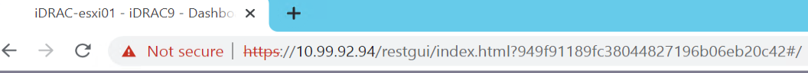
2. In the Virtual Console window, click Virtual Media tab and select Connect Virtual Media.
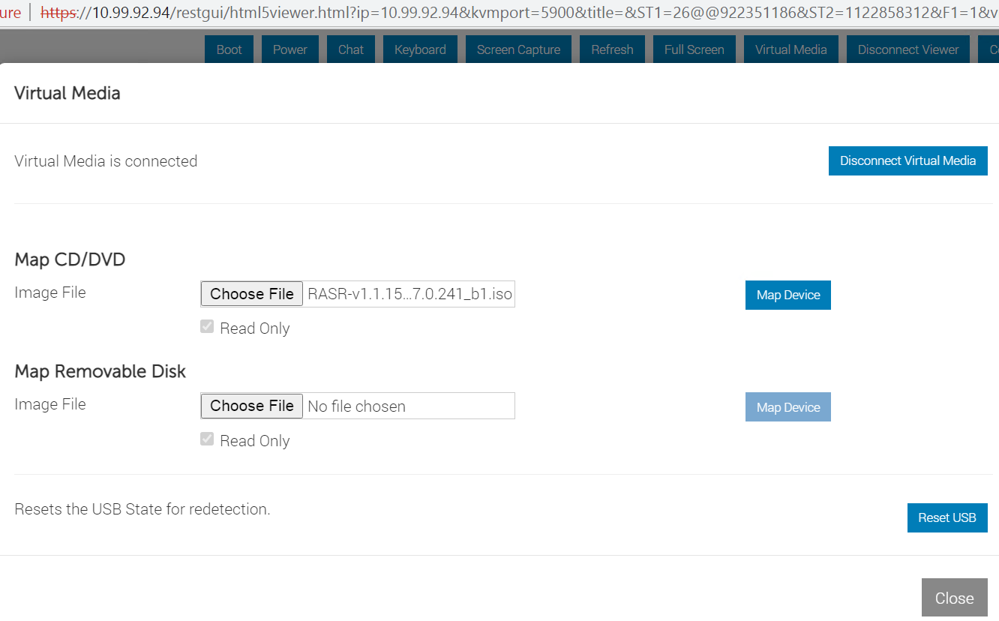
3. Click Next Boot and select Virtual CD/DVD/ISO.
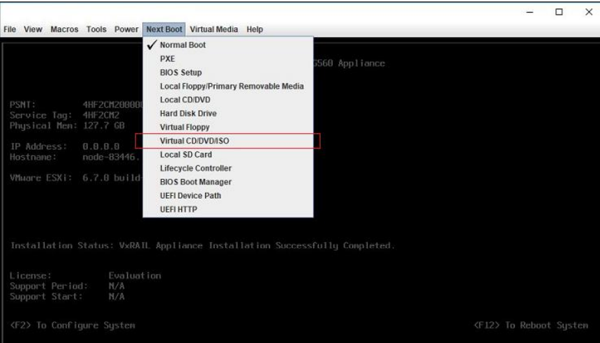
4. Click Power and select Reset System (warm boot).The system will boot to the RASR Update Utility menu.
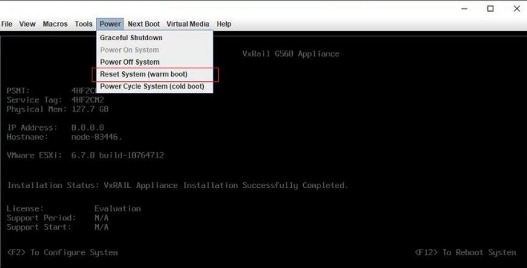
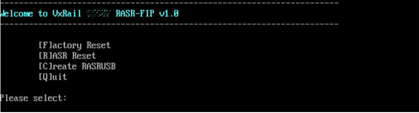
5. Type R to select RASR Reset, and then type Y to continue.
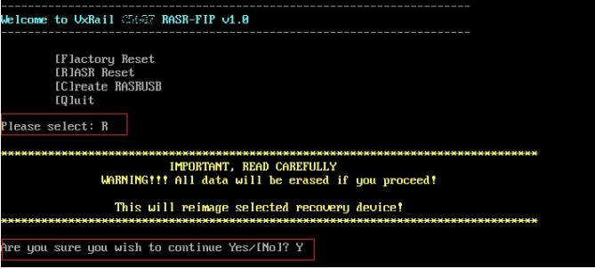
6. The RASR Reset process begins. Monitor the progress until completion. This portion of the process will take approximately 30 minutes.
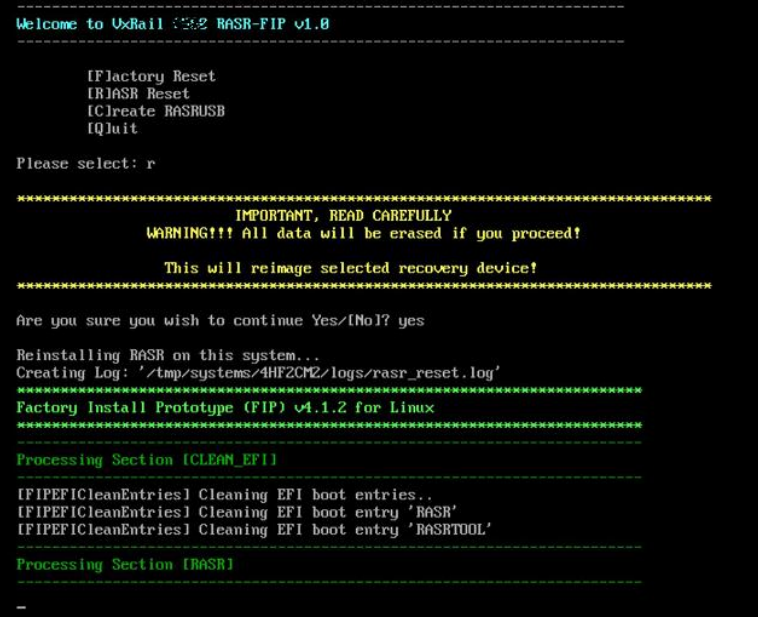

## Install the Dell Upgrade Packages from SD

1. After completing RASR reset through ISO, disconnect virtual media by selecting Virtual Media then Disconnect Virtual Media.

   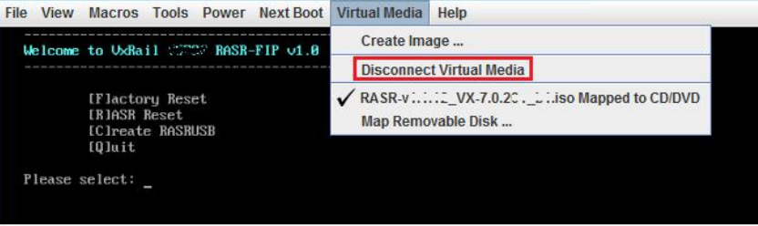

2. From the RASR Main menu, Type Q to quit and Y to reboot.

   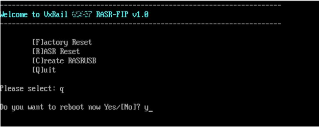

3. During boot, press F11 to enter Boot Manager.

   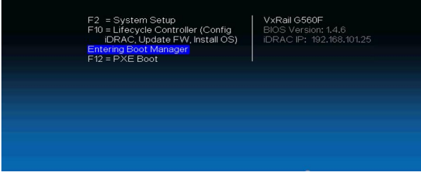

4. Select One-shot UEFI Boot Menu.

   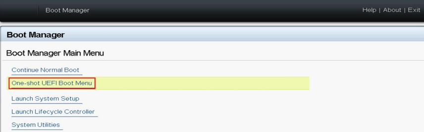

5. Select Internal SD: RASRTOOL.

   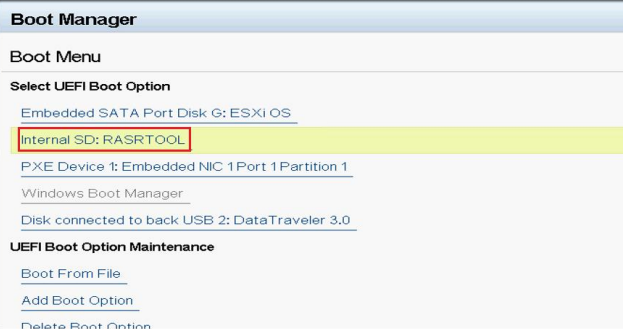

6. System will reboot to start RASR.

   

7. At the VxRail RASR Menu, type 99 then press Enter. The VxRail RASR Support Menu will open.

   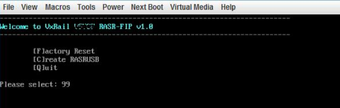

8. Type I to select Install (DUP(s) and press Enter.The system will be scanned to determine compatible DUPs. See next screen. Firmware version and list might be different per platform.

   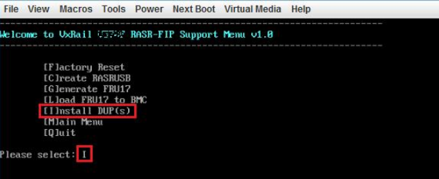

9. Type U to select Upgrade from the Support menu and press Enter.

   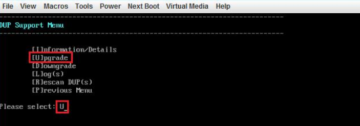

10. Type R to select Rolling DUP(s) Upgrade and press Enter.The DUP upgrades will begin. The system will automatically reboot after each DUP is installed.The DUP upgrades will begin. The system will automatically reboot after each DUP is installed.

   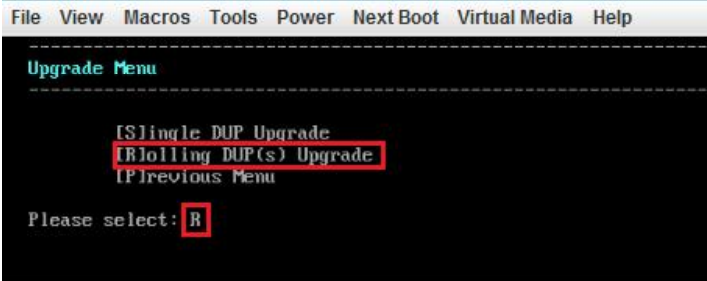

## Factory Reset from SD

1. The system will boot to the RASR Update Utility menu.Type F to do Factory Reset and type Y to continue

   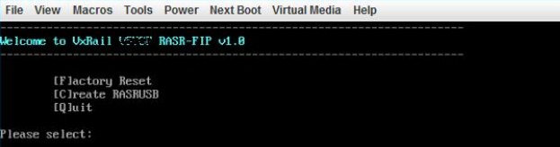

2. Ensure all external storage devices are disconnected correctly to prevent the potential risks of data corruption. If yes, type Disconnected to continue. Press any key to exit Factory Reset.

   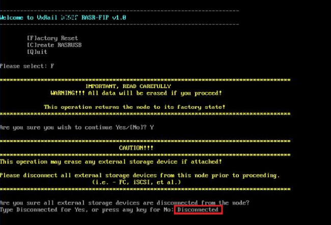

3. Factory Reset completes and displays message “Factory install Prototype (FIP) successfully completed”. Press Enter to continue and return to RASR Update Utility menu.

   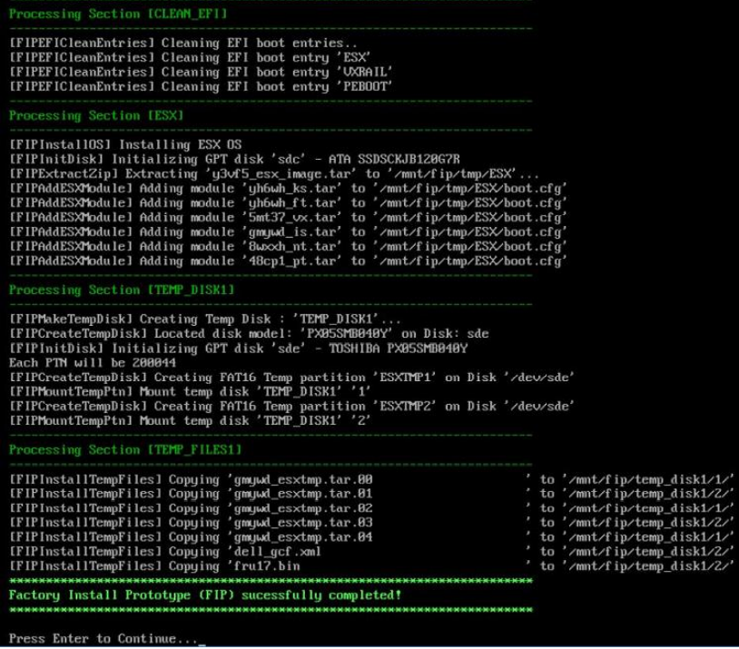

4. Enter Q to quit and Yes to reboot the system

   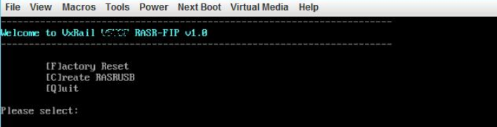

5. Once installation is completed completed message will pop post reboot.

   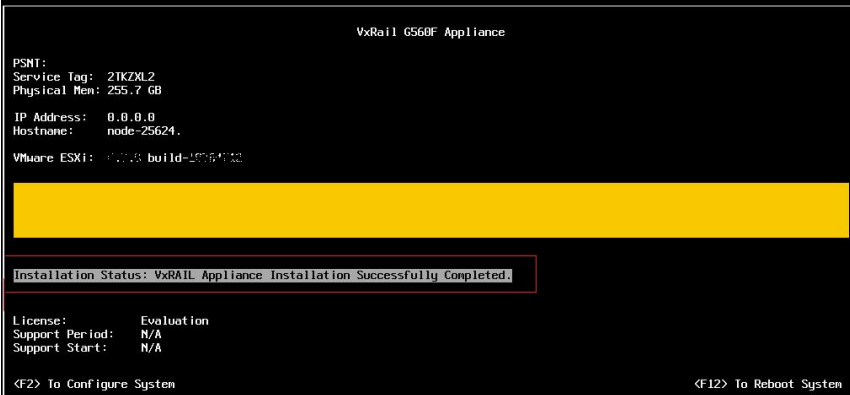
