# VCS VxRail Test Plan

# Table of contents

- [VCS VxRail Test Plan](#vcs-vxrail-test-plan)
- [Table of contents](#table-of-contents)
- [Changelog](#changelog)
- [Introduction](#introduction)
  - [Purpose](#purpose)
  - [Audience](#audience)
- [Scope](#scope)
- [Related Documents](#related-documents)
- [Used abbreviations](#used-abbreviations)
- [Infrastructure Requirements](#infrastructure-requirements)
- [Assumptions](#assumptions)
- [Password manager (Hashi Corp Vault)](#password-manager-hashi-corp-vault)
- [Overview of steps involved](#overview-of-steps-involved)
  - [Test method](#test-method)
  - [Planning and tests list](#planning-and-tests-list)
  - [Testing Templates](#testing-templates)
- [Test Plan](#test-plan)
  - [SDDC Management](#sddc-management)
    - [Test 1 - Check In SDDC VXRAIL MANAGER certificates](#test-1---check-in-sddc-vxrail-manager-certificates)
    - [Test 2 - Check In SDDC VXRAIL MANAGER Passwords and Validate in vault](#test-2---check-in-sddc-vxrail-manager-passwords-and-validate-in-vault)
  - [DHCVXR Infrastructure](#dhcvxr-infrastructure)
    - [Test 3 - Browse VxRail(s) IP and verify redirection to vCenter and externalization](#test-3---browse-vxrails-ip-and-verify-redirection-to-vcenter-and-externalization)
    - [Test 4 - Check and validate VxRail plugin from vCenter - MGT and CMP](#test-4---check-and-validate-vxrail-plugin-from-vcenter---mgt-and-cmp)
    - [Test 5 - Check and validate VxRail Cluster Health in vCenter - MGT and CMP](#test-5---check-and-validate-vxrail-cluster-health-in-vcenter---mgt-and-cmp)
    - [Test 6 - Check health status of VxRail Clusters and Hosts in vCenter - MGT and CMP](#test-6---check-health-status-of-vxrail-clusters-and-hosts-in-vcenter---mgt-and-cmp)
    - [Test 7 - Check VxRail host invenotry in vCenter and Validate - MGT and CMP](#test-7---check-vxrail-host-invenotry-in-vcenter-and-validate---mgt-and-cmp)
    - [Test 8 - Check Dell support account configured for VxRail in vCenter - MGT and CMP](#test-8---check-dell-support-account-configured-for-vxrail-in-vcenter---mgt-and-cmp)
    - [Test 9 - Check and Validate SCG is configured for VxRail](#test-9---check-and-validate-scg-is-configured-for-vxrail)
    - [Test 10 - Check and Validate Internet Proxy is configured for VxRail cluster](#test-10---check-and-validate-internet-proxy-is-configured-for-vxrail-cluster)
    - [Test 11 - Verify if VxRail related dashboards are present in vROps](#test-11---verify-if-vxrail-related-dashboards-are-present-in-vrops)
    - [Test 12 - Verify if VxRail related views are present in vROps](#test-12---verify-if-vxrail-related-views-are-present-in-vrops)
    - [Test 13 - Verify if VxRail related reports are present in vROps](#test-13---verify-if-vxrail-related-reports-are-present-in-vrops)
    - [Test 14 - Verify VxRail related alerts are captured in vROPS](#test-14---verify-vxrail-related-alerts-are-captured-in-vrops)
    - [Test 15 - Verify if vRLI is receving logs from Vxrail manager](#test-15---verify-if-vrli-is-receving-logs-from-vxrail-manager)
- [Appendix A](#appendix-a)

# Changelog

|    Date    |   TOS   |   Issue   | Author | Description |
|------------|---------|-----------|--------|-------------|
| 25.05.2022 | DHCVXR 1.0 |  | Aamod Aithal K B  | Creation of VCS on VxRail test plan vcf 4.3.1 and VxRail 7.0.241               |
| 30.05.2022 | DHCVXR 1.0 |  | Divyaprakash J |  Modified table of contents and added test cases related to reviews , reports and alerts of Vxrail in Vrops |
| 07.06.2022 | DHCVXR 1.0 |  | Aamod Aithal K B | Deleted Vxrail test plan template document present in files under workinstructions and added sharepoint link to refer the same |

# Introduction

This Test Report provides additional documentary evidence of the completion of the technical build for the VMware Cloud Services on VxRail.

## Purpose

The purpose of this document is to provide detailed step-by-step instructions to test additional DHVXR Infrastructure on VxRail after finished deployment phase.

## Audience

This document is intended for the VCS build on VxRail and development engineers tasked with performing VCS and DHCVXR tests. It is advised that you read the VCS and DHCVXR related LLDs and get familiar with all VCS and DHCVXR components.

- Integration Architects
- VCS and DHCVXR Build Engineers
- VCS Deployment Managers
- Cloud Tower Service Managers

# Scope

The scope of this document is verification of the technical build which includes:

- Successful implementation of all DHCVXR functions including monitoring and reporting.
- Successful implementation of 3rd party services: CEB, ServiceNow, CMP (optional).
- These are the additional test cases specific to DHCVXR . Already existing VCS test cases can be found in Related Documents section under VCS Test Plan.

Elements that are out of scope:

- Service Process setup
- Staff Training

# Related Documents

This document is a subset of Atos Technology Lifecycle Management (ATLM) artefacts.

| Document                       | Document Name                                                     |
|--------------------------------|-------------------------------------------------------------------|
| VMware Cloud Services: HLD      | [hldDigitalHybridCloud.md](../design/hldDigitalHybridCloud.md)    |
| VCS Infrastructure: LLD        | [lldInfrastructure.md](../design/lldInfrastructure.md)            |
| VCS Service Catalog: LLD       | [lldServiceCatalog.md](../design/lldServiceCatalog.md)            |
| VCS Test Plan                  | [dhcTestPlan.md](dhcTestPlan.md)            |
| Naming Convention              | [namingConvention.md](../design/namingConvention.md)              |

# Used abbreviations

| Abbreviation | Description                                 |
|--------------|---------------------------------------------|
| CDE          | Customer Dedicated Environment              |
| VCS          | VMware Cloud Services                       |
| DHCVXR         | VMware Cloud Services on VxRail             |
| ToS          | Turnover to Services                        |
| ToP          | Turnover to Production                      |
| CE           | Customer Engagement                         |

# Infrastructure Requirements

1. DHCVXR instance deployed after hardening stage.
2. All integrations implemented and finished (CEB, CMP, ServiceNow).
3. Platform Administrative account created with correct permissions in the DHCVXR mgmt Active Directory.
4. Access to Ansible Core VM in DHCVXR.

# Assumptions

There is an assumption that the engineers following this process have:

- an understanding of VCS and DHCVXR design
- an understanding how to run ansible playbook

# Password manager (Hashi Corp Vault)

DHCVXR uses Hashi Corp Vault Password Manager. DHCVXR platform administrators have privileges to login and **read** passwords from Vault.

>Warning. Credentials for all components are stored during deploy, refreshed in the hardening stage phase automatically. It is also valid for playbooks in the manage (production phase). Adjusting credentials manually will result later in failures in automation.

- connect to the password manager via web on port 8200, change method to **LDAP**. Use login in UPN format `<username>@<customerCode>dhc<instanceNumber>.next`
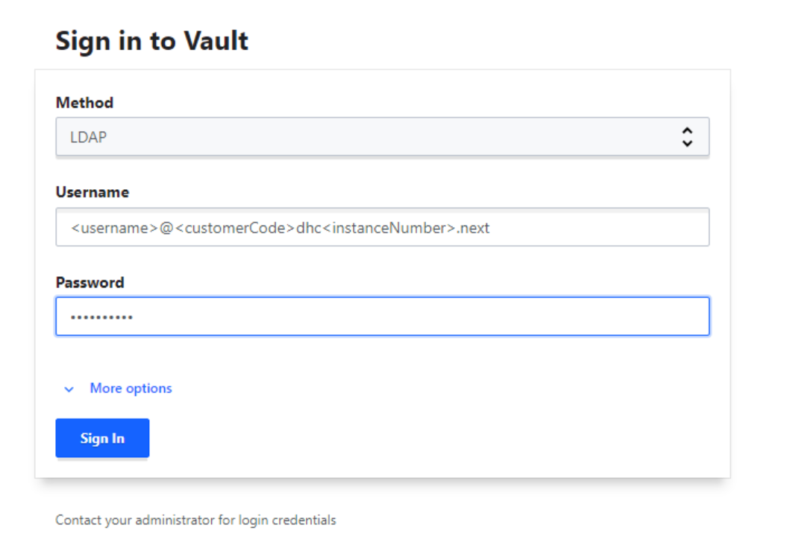

- navigate through secrets path to find credentials you are looking for
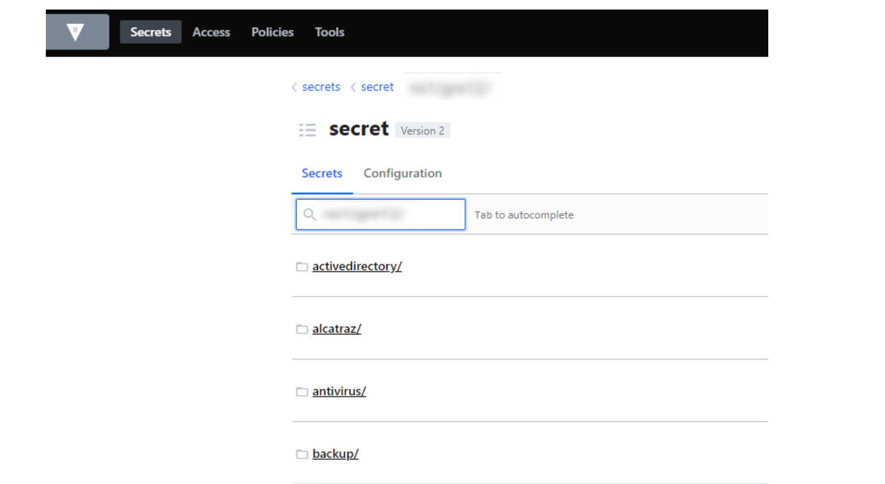

# Overview of steps involved

In general, testing is conducted from 2 perspectives:

- Customer Perspective (Workload hosting, Service Catalogue Automation)
- Cloud Operations perspective (Management infrastructure)

## Test method

Team members from the test team will act as the customer, will be instructed to behave as such. This means they will not use their technical knowledge to resolve issues or alter the system/application configuration if things do not work as expected.

Issues will be logged in a copy of the aforementioned Test Plan which will be dedicated to a specific build project.  
Issues shall be passed on to the build/development team for further investigation and resolution.  
Once a specific issue is fixed, a retest will take place.  
Tests shall be executed in parallel, if possible from technical and manpower point of view.

## Planning and tests list

|   No.       | Type                        | Description                                                                | Result (Success/Failure)|
|-------------|-----------------------------|----------------------------------------------------------------------------|------------------------|
| Test 1      | SDDC Management             | Check In SDDC VXRAIL MANAGER certificates                                  |                        |
| Test 2      | SDDC Management             | Check In SDDC VXRAIL MANAGER Passwords and Validate in vault               |                        |
| Test 3      | DHCVXR Infrastructure       | Browse VxRail(s) IP and verify redirection to vCenter and externalization  |                        |
| Test 4      | DHCVXR Infrastructure       | Check and validate VxRail plugin from vCenter - MGT and CMP                |                        |
| Test 5      | DHCVXR Infrastructure       | Check and validate VxRail Cluster Health in vCenter - MGT and CMP          |                        |
| Test 6      | DHCVXR Infrastructure       | Check health status of VxRail Clusters and Hosts in vCenter - MGT and CMP  |                        |
| Test 7      | DHCVXR Infrastructure       | Check VxRail host invenotry in vCenter and Validate - MGT and CMP          |                        |
| Test 8      | DHCVXR Infrastructure       | Check Dell support account configured for VxRail in vCenter - MGT and CMP  |                        |
| Test 9      | DHCVXR Infrastructure       | Check and Validate SCG is configured for VxRail                            |                        |
| Test 10     | DHCVXR Infrastructure       | Check and Validate Internet Proxy is configured for VxRail cluster         |                        |
| Test 11     | DHCVXR Infrastructure       | Verify if VxRail related dashboards are present in vROps                   |                        |
| Test 12     | DHCVXR Infrastructure       | Verify if VxRail related views are present in vROps                        |                        |
| Test 13     | DHCVXR Infrastructure       | Verify if VxRail related reports are present in vROps                      |                        |
| Test 14     | DHCVXR Infrastructure       | Verify VxRail related alerts are captured in vROPS                         |                        |
| Test 15     | DHCVXR Infrastructure       | Verify if vRLI is receving logs from Vxrail manager                        |                        |

>Note: The screenshots are illustrative and cannot be used as source for input data.

## Testing Templates

In order to have a simple and clear view on all results, separate document is used to gather test's evidences.  
**Word template is available under [Appendix A](#appendix-a) section.**

Please use above template to record all results from DHCVXR test plan.

# Test Plan

## SDDC Management

### Test 1 - Check In SDDC VXRAIL MANAGER certificates

|                  |                                                                        |
|------------------|------------------------------------------------------------------------|
| Test procedure   | Login to GUI of SDDC Manager                                           |
| Test procedure   | Go to Workload Domains                                      |
| Test procedure   | Select " MANAGEMENT " for management domain and " VI "  for VI domain.                           |
| Test procedure   | Go to Security and Check VxRail manager certificate issuer is internal CA server                          |
| Expected results | Check Status = "ACTIVE" and certificate Operation Status = "Certificate Installation - SUCCESSFUL"        |
| Expected results | For both domain the certifcate should be installed successfully and status must be active                        |
| Expected results | Certificates are available, valid and not expired                          |
| Expected results | 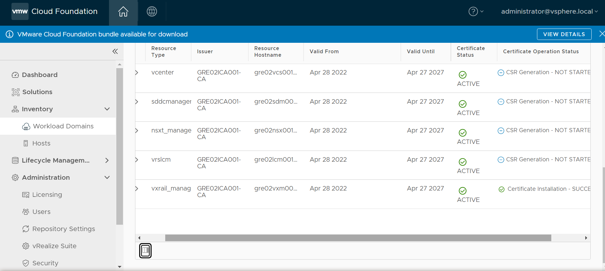 |

### Test 2 - Check In SDDC VXRAIL MANAGER Passwords and Validate in vault

|                  |                                                                             |
|------------------|-----------------------------------------------------------------------------|
| Test procedure   | Login to GUI of SDDC Manager                                                |
| Test procedure   | Select Administration → security →   Password management                                            |
| Test procedure   | Select "VXRAIL MANAGER"                                |
| Test procedure   |  Check all VxRail manager(s) root and mystic account with respective domain is visible.                         |
| Expected results |   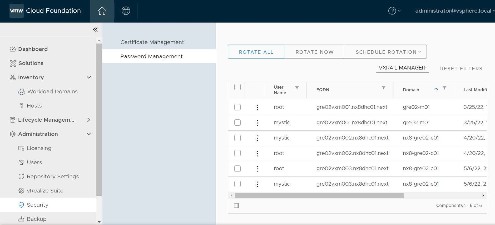                        |
| Test procedure   |  Try connecting to VxRail manager appliance using putty session fetch user and password from vault|
| Test procedure   | Login with mystic and switch to root for test for all vxrail manager(s)|
| Expected results | 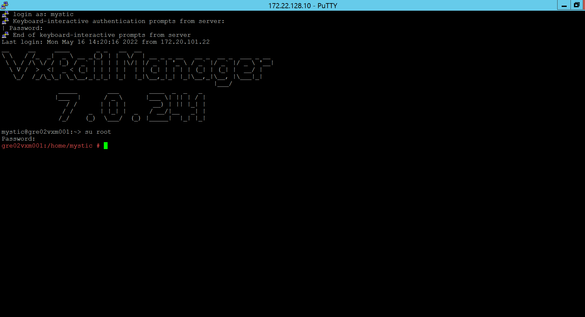 |
| Expected results | 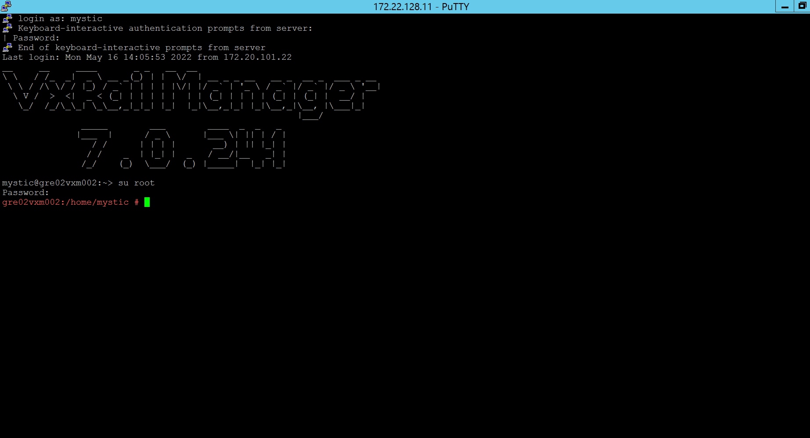 |

## DHCVXR Infrastructure

### Test 3 - Browse VxRail(s) IP and verify redirection to vCenter and externalization

|                  |                                                                                |
|------------------|--------------------------------------------------------------------------------|
| Test procedure   | Go to the browser in the terminal server                                                   |
| Test procedure   | browse to Vxrail IP(s) to see if it redirects to respective vCenter with the credentials                                      |
| Expected results | login is successful                                  |
| Expected results | 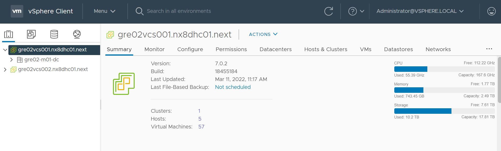 |

### Test 4 - Check and validate VxRail plugin from vCenter - MGT and CMP

|                  |                                                    |
|------------------|----------------------------------------------------|
| Test procedure   | Login into the vcenter via vsphere web client .       |
| Test procedure   | Check VxRail plugin is visible in home page.                    |
| Test procedure   |  When clicked on VxRail plugin VxRail Dashboard for respective vCenter is visible|
| Expected results |  VxRail plugin VxRail Dashboard for respective vCenter is visible |
| Expected results | .png) |

### Test 5 - Check and validate VxRail Cluster Health in vCenter - MGT and CMP

|                  |                                                                                    |
|------------------|------------------------------------------------------------------------------------|
| Test procedure   | Login to vcenter via vsphere web client.                      |
| Test procedure   | Go to Hosts and Clusters |
| Test procedure   | Select management/workload cluster →Configure → VxRail → Health Monitoring   |  
| Expected results | Check health monitoring is enabled |
| Expected results | 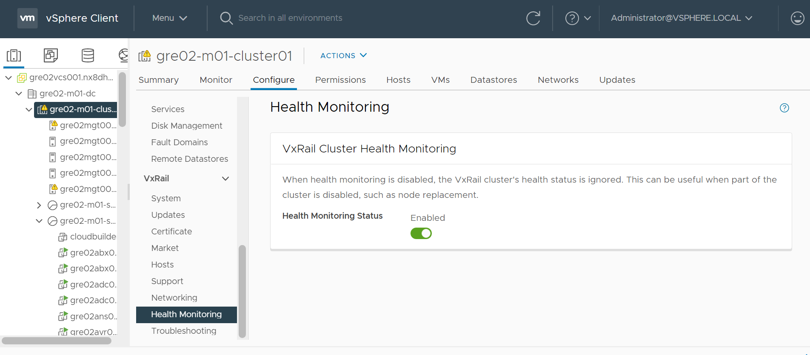 |

### Test 6 - Check health status of VxRail Clusters and Hosts in vCenter - MGT and CMP

|                  |                                                                         |
|------------------|-------------------------------------------------------------------------|
| Test procedure   | Login to vcenter via vsphere web client                                                     |
| Test procedure   | Select Hosts and clusters                                  |
| Test procedure   | Select management/workload cluster ->Monitor -> VxRail -> Appliances                                            |
| Expected results | Check whether cluster health is green and connected status yes and operational state is OK |
| Expected results | 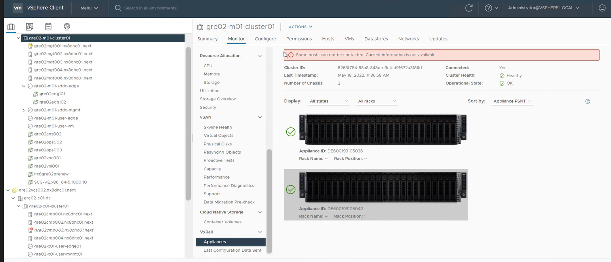 |

### Test 7 - Check VxRail host invenotry in vCenter and Validate - MGT and CMP

|                  |                                                                                    |
|------------------|------------------------------------------------------------------------------------|
| Test procedure   | Login to vcenter via vsphere web client                                                     |
| Test procedure   | Select Hosts and clusters                                  |
| Test procedure   | Select management/workload cluster ->Configure -> VxRail -> Hosts                                            |
| Expected results | Check host invenotry, and status is visible and operational status is available                                   |
| Expected results |  |

### Test 8 - Check Dell support account configured for VxRail in vCenter - MGT and CMP

|                  |                                                                                    |
|------------------|------------------------------------------------------------------------------------|
| Test procedure   | Login to vcenter via vsphere web client                                                     |
| Test procedure   | Select Hosts and clusters                                  |
| Test procedure   | Select management/workload cluster ->Configure -> VxRail -> Support                                             |
| Test procedure   | Check whether "Currently logged in as"  having Dell support account configured            |
| Expected results |  |

### Test 9 - Check and Validate SCG is configured for VxRail

|                  |                                                                                |
|------------------|--------------------------------------------------------------------------------|
| Test procedure   | Log in to your vCenter via vsphere web client |
| Test procedure   | Select Hosts and clusters  |
| Test procedure   | Select management/workload cluster ->Configure -> VxRail -> Support            |
| Test procedure   | Check SCG account status,connection,configuration details           |
| Expected results | 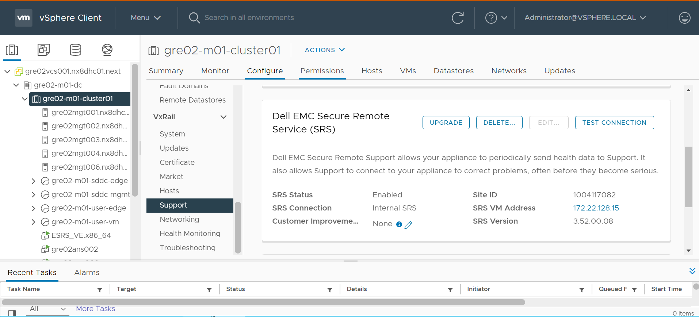 |

### Test 10 - Check and Validate Internet Proxy is configured for VxRail cluster

|                  |                                                                              |
|------------------|------------------------------------------------------------------------------|
| Test procedure   | Log in to vCenter server using vSphere Client.                               |
| Test procedure   | Select Hosts and clusters                           |
| Test procedure   | Select management/workload cluster → Configure → VxRail → Networking                           |
| Test procedure   | Check Internet Connection : Enabled                              |
| Test procedure   | Check Configure Proxy Settings : IPaddress (of proxy) , protocol (secure), and Proxy Status should be enabled.  |
| Test procedure   | Check Traffic Throttle Configuration : Level = Advance.                               |
| Expected results | 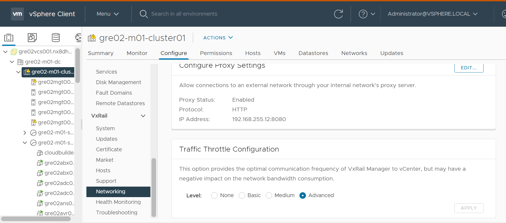 |

### Test 11 - Verify if VxRail related dashboards are present in vROps

|                  |                                                            |
|------------------|------------------------------------------------------------|
| Test procedure   | Login into the vRops via web          |
| Test procedure   | Select Dashboards |
| Test procedure   | Check for VxRail Operations Overview dashboard |
| Test procedure   | Check for Troubleshoot VxRail dashboard |
| Test procedure   | Check for VxRail Capacity Overview dashboard |
| Expected results | All the above 3 dashboards should be visible displaying respective details of vxrail manager(s)   |
| Expected results | 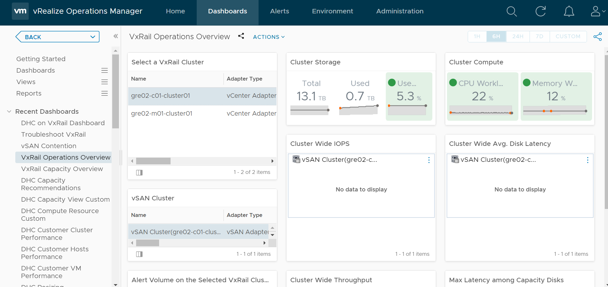 |
| Expected results | 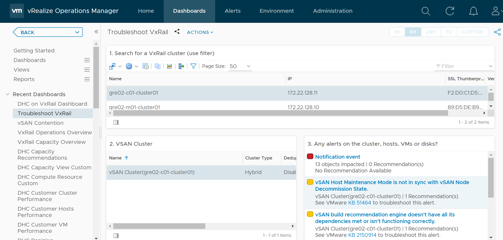 |
| Expected results | 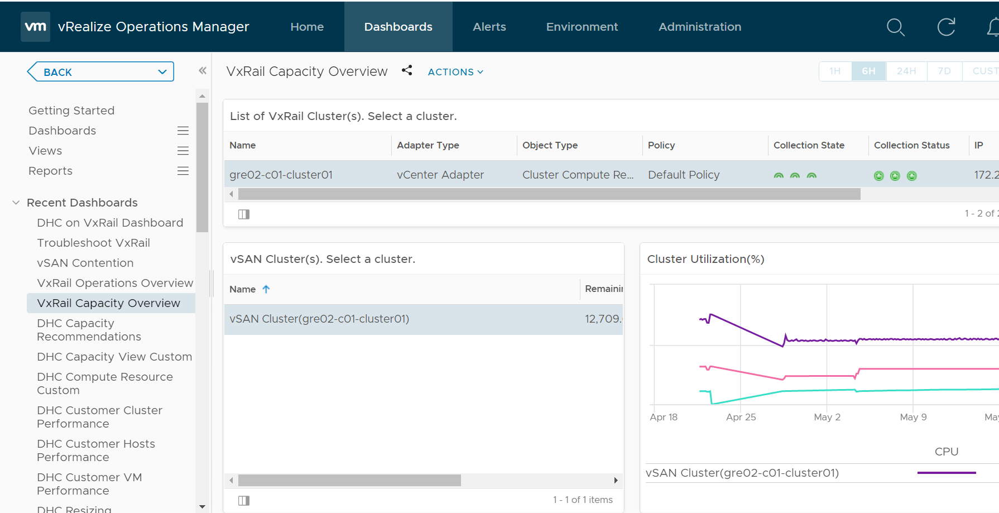 |

### Test 12 - Verify if VxRail related views are present in vROps

|                  |                                                            |
|------------------|------------------------------------------------------------|
| Test procedure   | Open web browser and type vROPS address          |
| Test procedure   | After login in select Dashboard -> Views -> Manage view |
| Test procedure   | Check if VxRail related views is present by searching in searchbox. |
| Expected results | VxRail related view with name “VCS on VxRail View” should be visible.  |
| Expected results | 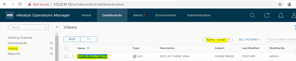 |

### Test 13 - Verify if VxRail related reports are present in vROps

|                  |                                                            |
|------------------|------------------------------------------------------------|
| Test procedure   | Open web browser and type vROPS address          |
| Test procedure   | After login in select Dashboard -> Reports -> View report template |
| Test procedure   | Check if VxRail related reports is present by searching in searchbox. |
| Expected results | VxRail related view with name “VCS on VxRail Report” should be visible. |
| Expected results | 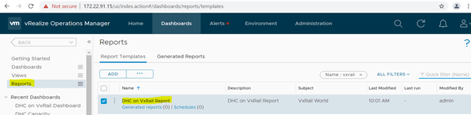 |

### Test 14 - Verify VxRail related alerts are captured in vROPS

|                  |                                                                                                              |
|------------------|--------------------------------------------------------------------------------------------------------------|
| Test procedure   | Login into vRops via web                                                                                     |
| Test procedure   | Select Alerts -> Triggered alerts -> All                |
| Test procedure   | Apply filters defined by Vxrail Manager pack  and Group by criticality              |
| Expected results | 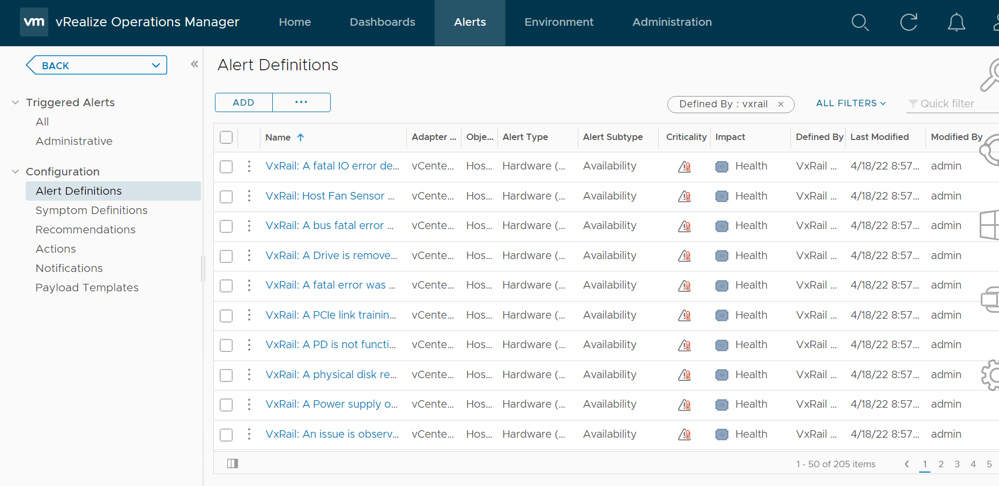 |

### Test 15 - Verify if vRLI is receving logs from Vxrail manager

|                  |                                                                                                              |
|------------------|--------------------------------------------------------------------------------------------------------------|
| Test procedure   | Log in to vli |
| Test procedure   | Select Administration  |
| Test procedure   | Select Hosts -> Vxrail manager(s)           |  
| Test procedure   | Check whether the logs of particular vxrail manager host is available|
| Expected results | 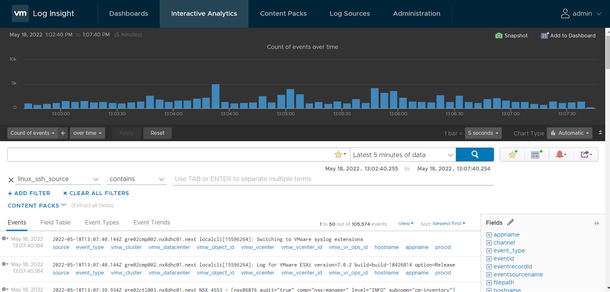 |

# Appendix A

| Document Name                 | Document                                                                                                      |
|-------------------------------|---------------------------------------------------------------------------------------------------------------|
| DHCVXR Test Plan Template        | [dhcvxrTestPlan_Template.docx](https://atos365.sharepoint.com/:w:/r/sites/600003668/DHCVXR/TOS%20DVXR%201.0/dhcvxrTestPlan_Template.docx?d=w3b392183431344209ab2bbac15c008ce&csf=1&web=1&e=KpYV2n)                  |
