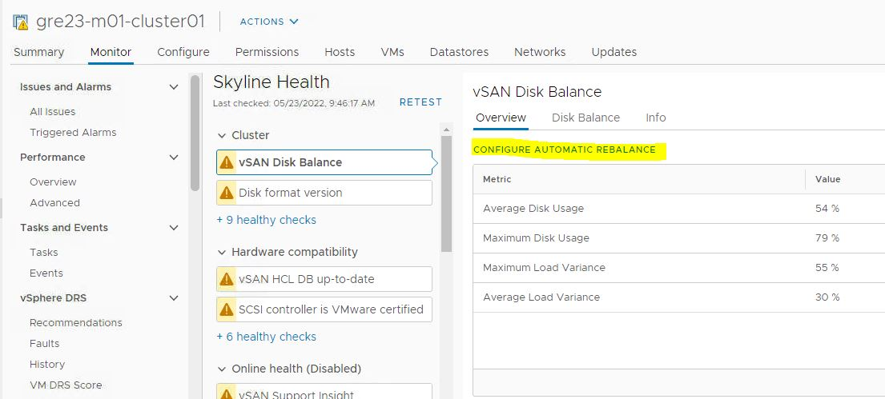
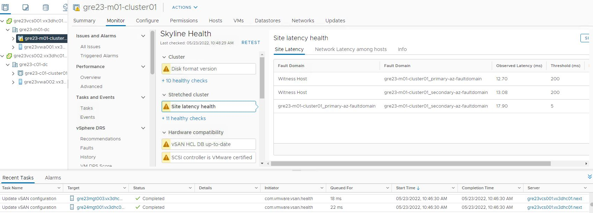
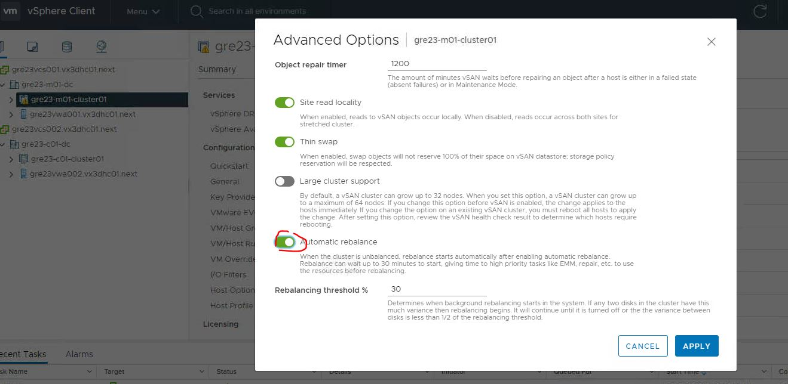
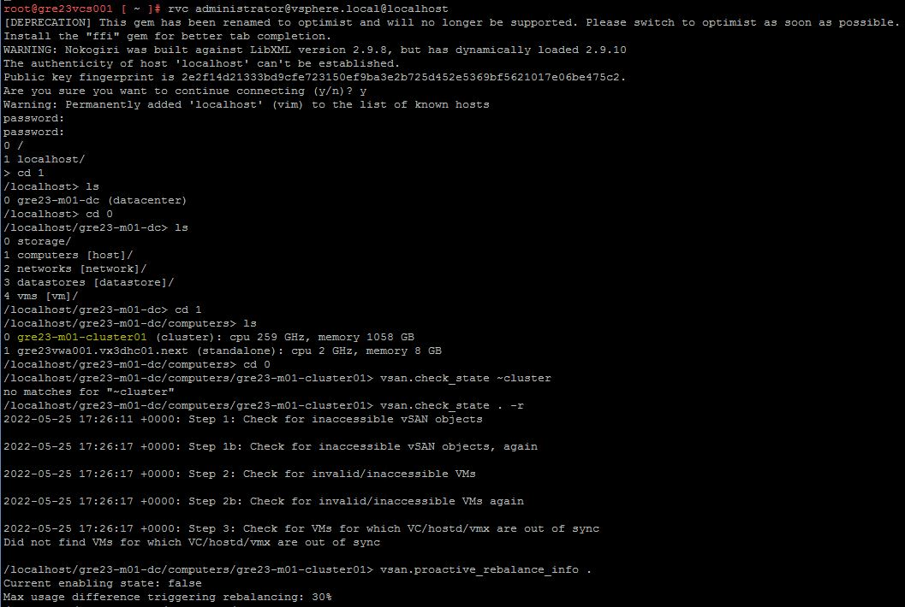
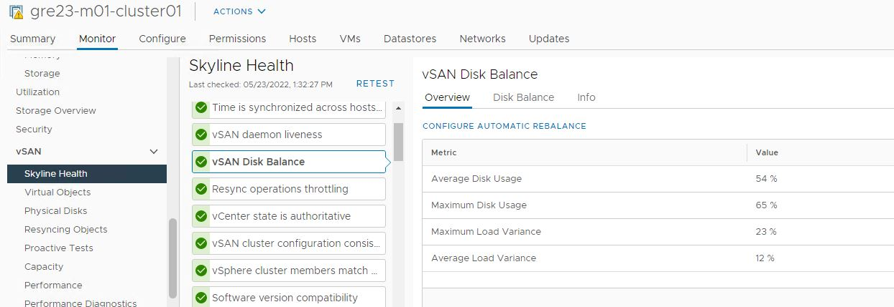
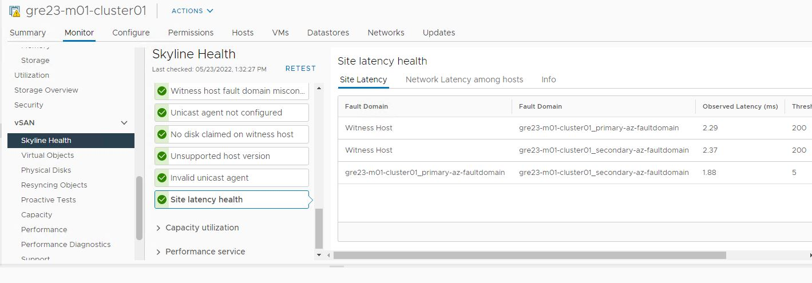
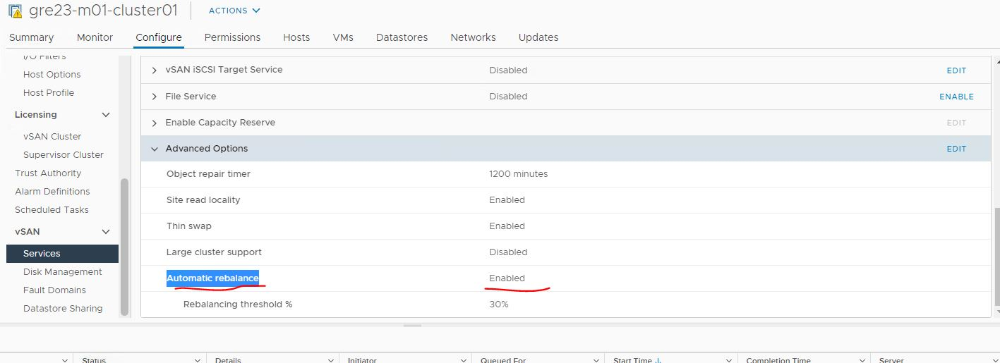

# VCS vSAN disk balance

## Table of Contents

- [VCS vSAN disk balance](#vcs-vsan-disk-balance)
  - [Table of Contents](#table-of-contents)
- [Changelog](#changelog)
  - [Introduction](#introduction)
    - [Purpose](#purpose)
    - [Audience](#audience)
    - [Scope](#scope)
  - [Check vSAN Skyline health](#check-vsan-skyline-health)
  - [Configure automatic rebalance](#configure-automatic-rebalance)
  - [Check vSAN state and disable automatic rebalance](#check-vsan-state-and-disable-automatic-rebalance)

# Changelog

| Version | Date       | Description              | Author          |
| ------- | ---------- | ------------------------ | --------------- |
| DHC-4786| 25/05/2022 | First version            | Slabu Adriana   |

## Introduction

### Purpose

Check and configure vSAN disk balance and automatic rebalance.

### Audience

- VCS Operations

### Scope

- Check vSAN Skyline Health
- Configure/Unconfigure automatic rebalance

## Check vSAN Skyline health

Login to vCenter, go to cluster -> Monitor -> vSAN Skyline Health, vSAN disk Balance warning will show in the Cluster section.



**Root-cause:**
Data can become imbalanced for many reasons: Storage policy changes, host or disk group evacuations, adding hosts, object repairs, or overall data growth.

**Impact/Risks:**
Disk rebalancing can impact the I/O performance of your vSAN cluster, as it moves components from the over-utilized disks to the under-utilized disks.  When performing a manual rebalance, this operation runs for 24 hours and then stops.  The risk of an impact on customer VMs, in terms of performance, is very low. This depends on the number objects that needs to be rebalanced to reduce disk usage variance across cluster. It is recommended to run Proactive rebalance when there is minimal workload.

**Change needs to be scheduled for the vSAN disk balance action during a maintenance window or outside of business hours**

During the Rebalance process some latency at the vSAN cluster level can be observed:



## Configure automatic rebalance

Login to vCenter, go to cluster -> Monitor -> vSAN Skyline Health, vSAN disk Balance section and click on the "Configure Automatic Rebalance" button.
> **NOTE** See the first print-screen with the vSAN disk balance warning

 It will take you to Configure tab of the Cluster, where automatic rebalance option needs to be enabled. Once the Automatic Rebalance feature is enabled, the health check alarm for this balancing will no longer trigger and rebalance activity will occur automatically.



## Check vSAN state and disable automatic rebalance

The load balance operation moves components from the over-utilized disks to the under-utilized disks. It can take up to 12 hours to complete.

Login to vCenter via SSH using root account, then login into RVC using administrator@vsphere password

```shell
rvc administrator@vsphere.local@localhost
```

run the RVC command for checking vSAN rebalance status:

```shell
   vsan.proactive_rebalance_info <vSAN-cluster-number, or “.” for current rvc path location>
```

You can also run the vSAN check status command:

```shell
vsan.check_state . -r
```



You can also check the successful vSAN status directly from GUI:





VMware recommends to enable the automatic rebalancing feature on your vSAN clusters, but due to the performance impact on the cluster and until it's decided otherwise, **vSAN Automatic rebalance option needs to be put to disable again.** Click on Edit button from the advanced options and disable it.



For more details regarding vSAN disk balance please check VMware kb article: [Vmware KB](https://kb.vmware.com/s/article/2149809)
