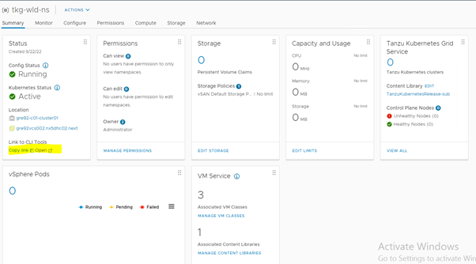

# Download Tkg CLI Tools

## Table of Contents

- [Download Tkg CLI Tools](#download-tkg-cli-tools)
  - [Table of Contents](#table-of-contents)
  - [Changelog](#changelog)
  - [Introduction](#introduction)
    - [Purpose](#purpose)
    - [Audience](#audience)
  - [Scope](#scope)
    - [Download and Copy Tkg CLI tools](#download-and-copy-tkg-cli-tools)

## Changelog
  
 |    Date    |  TOS   | Issue   | Author | Description |
 |------------|---------|-----------|--------|--------|
 | 02.01.2023 |  VCS 1.7   |   CESDHC-4569     | Rohit Singh | Initial draft creation |

## Introduction

### Purpose

Download the TKG CLI tools for existing customers.

### Audience

- VCS Engineers
- DevSecOps Team

## Scope

- Download and Copy Tkg CLI tools

### Download and Copy Tkg CLI tools

VMware vSphere with Kubernetes supports the standard command-line tool kubectl. If you've already installed kubectl on your system, you still need to download the vSphere Plugin for kubectl. The Plugin is required to authenticate with the SSO-backed Supervisor Cluster. You can download kubectl, including the vSphere Plugin, from Supervisor Clusters Control Plane.

- Login into vsphere and click on the namespace that we created above. We can see a link to CLI tools as shown below

  

- Select the operating system to Linux and click on `Download CLI Plugin Linux`. Similarly scroll down further to find `Vsphere Docker Credential Helper` and click on `Download for Windows`

- Extract the downloaded files and using Winscp, copy below files to ans001 server in `/opt/binaries` directory.

```shell
docker-credential-vsphere
kubectl
kubectl-vsphere
```
