# HCX

## List of Changes

| Date       | Description   | Author(s)           |
| ---------- | ------------- | ------------------- |
| 28-04-2021 | Initial Draft | Bhalchandra Gavhane |

## Introduction

VMware HCX is an application mobility platform designed for simplifying application migration, rebalancing workloads, and optimizing disaster recovery across data centers and clouds.  
HCX is intended to be used only for one-way migration and can be disposed after the work is done.

### Purpose

Install and configure the VMware HCX at source and destination sites.

### Audience

- VCS Engineers
- VCS Architects

### Scope

1. VMWare HCX
2. Networking requirements
3. installation and configuration of HCX

## Related Documents

This document is a subset of Atos Technology Lifecycle Management (ATLM) artefacts. All documents are stored in the VCS documentation repository.

##### Table 1 ATLM Related Documents

| Document Number                                              | Document Name                                   |
| ------------------------------------------------------------ | ----------------------------------------------- |
| lldHcx.md | VMware HCX LLD                                  |
| lldSddcVmwareCloudFoundation                                 | Low Level Design - SDDC VMware Cloud Foundation |
| lldSoftwareDefinedNetworks                                   | Low Level Design - Software Defined Networks    |

## Deployment guide

### WAN configuration

- It is recommended to have minimum 100 Mbps dedicated WAN link between the source and destination site.
- There should be a reachability between Management network, vMotion network and uplink network (optional) of source and destination site.

### Deploy OVF

- Download the HCX Installer from VMware website
- From vCenter Server in destination environment right click on the compute workload cluster and select Deploy OVF Template – as the HCX infrastructure will be deployed entirely in the compute cluster.
- For storage select VSAN datastore in compute cluster.
- The recommended placement for HCX Manager is in the same subnet as vCenter Server installation.
- After accepting the license, provide HCX Manager deployment details – admin and root password for the HCX Manager appliance, hostname, IP assignment and network details, DNS, NTP. It is useful to have SSH enabled.
- Review entered configuration and click Finish
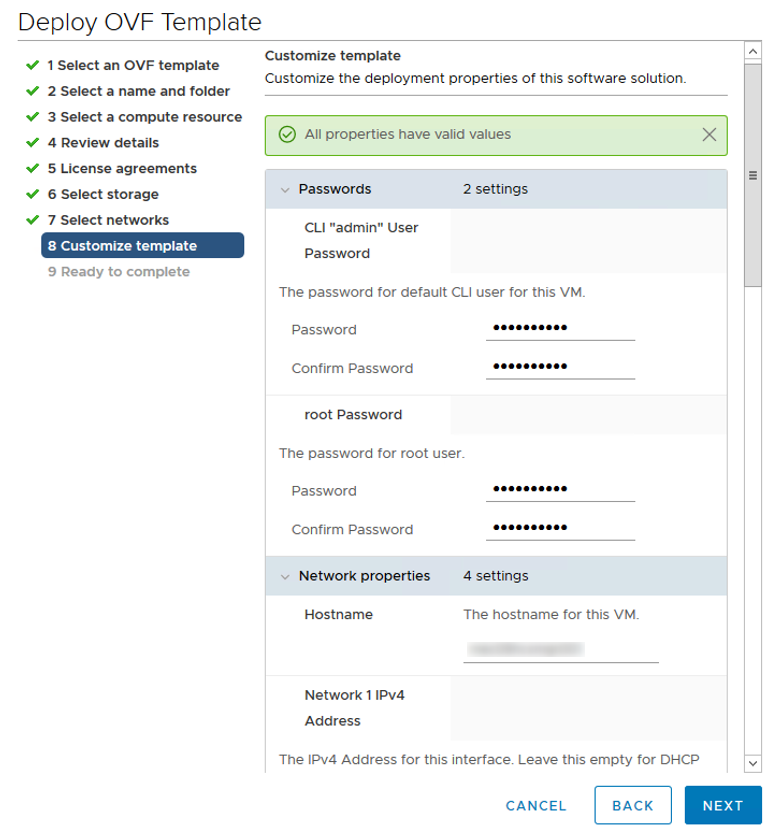

### Configuration

- After appliance deployment, power on newly created HCX Manager appliance VM and wait up to 5 minutes for initialization. Connect to the appliance using browser on port 9443 and login using admin user credentials provided during OVF template deployment.
- After successful login click "Continue" button.
- Activate HCX Manager appliance using provided license key. Leave HCX Activation Server as default. Activation requires Internet connection so proxy setting should be provided if there’s no direct Internet connectivity. After providing data click Activate button. The activation will take a while to complete.
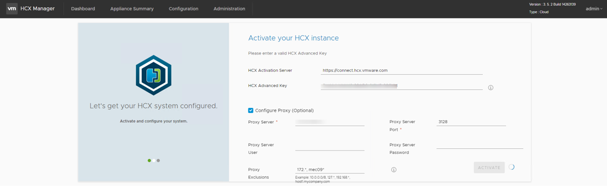
- Configure the proxy exclusions like local network IDs, FQDNs etc.
- Optionally on the next screen add HCX Enterprise key (to activate additional migration options – e.g. vSphere Replication Assisted vMotion). Standard configuration is based on Advanced version though and enterprise licensing is an exception.
- If newer version is present, the HCX Manager appliance will be also upgraded in this step.
- After activation and/or upgrade the appliance will be rebooted. Login back to the management UI using browser (port 9443) and continue with configuration.
- After initial screen location of HCX Manager need to be selected – it is only used for graphical presentation of appliance location, system name has to be entered and HCX Instance type configured – please select vSphere.
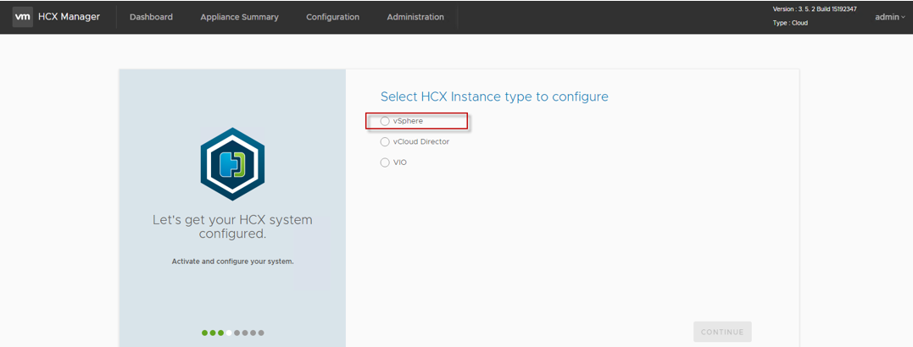
- On the next screen enter vCenter Server address and login credentials and NSX-T manager IP address and credentials.
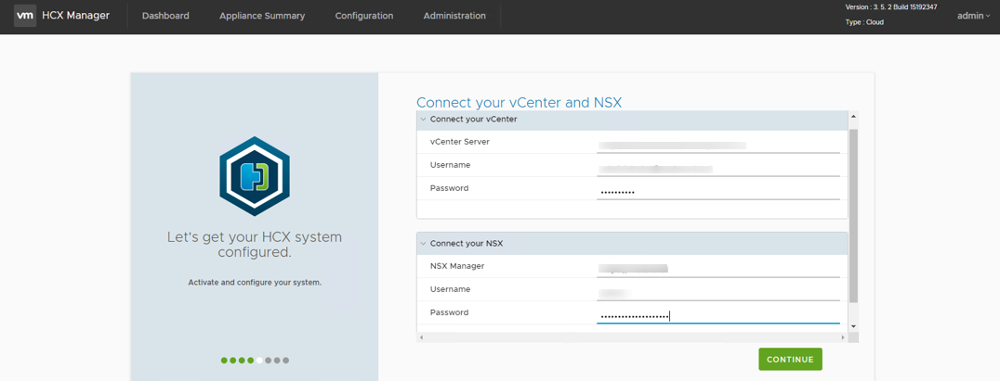
- Click Continue and if receive error message “PKIX path building failed: java.security.cert.CertPathBuilderException: Unable to find certificate chain. Vmware”, vCenter Server and NSX-T Manager certificates needs to be added to trusted certificates repository in HCX Manager appliance GUI. Click Administration -> Trusted CA Certificate and Import the certificates for vCenter Server and NSX Manager as on the two screenshot below:
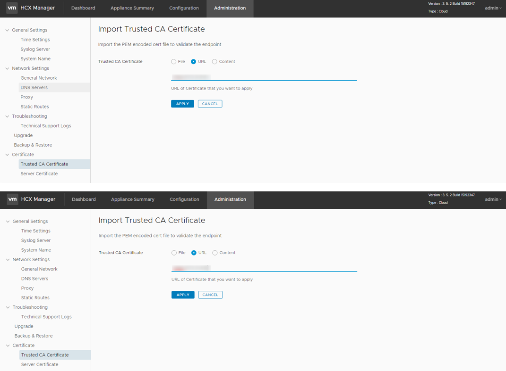
- On the next screen SSO/PSC001 address has to be configured.
- The other HCX Managers will contact to the current HCX manager with the help of public access url. This can be the IP address of this appliance itself or NAT/LB IP behind which this appliance is deployed.
- On the next screen review entered configuration and click Restart button
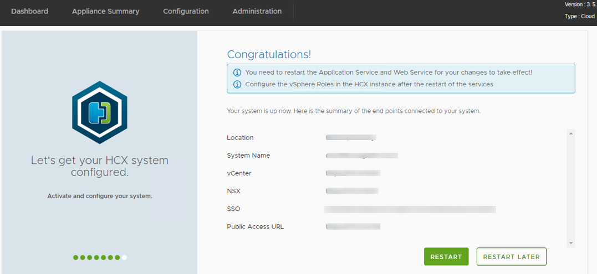
- After reboot check on the dashboard the current status of NSX Manager and vCenter Server – there should be green dot next to them.

### Configuration in the source site

- Open HCX Manager UI interface in destination site (using it’s FQDN or IP address) and select System Updates -> Request Download Link
- Copy link address and download HCX Manager Enterprise OVF template in the **SOURCE** environment.
- Deploy and configure HCX Manager in the source site – refer to the deployment steps in the destination above.
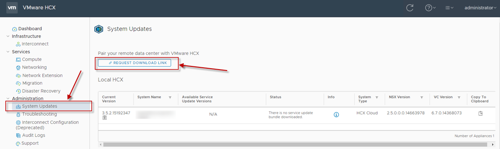

### Site pairing

- Login to HCX Manager appliance management console UI (port 9443) in **source and destination** environment and add certificate of the remote HCX Manager.
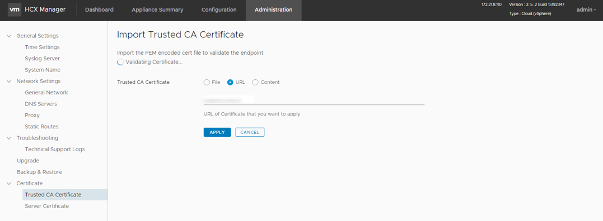
- In source environment login to HCX Manager UI and select Interconnect -> Site Pairing -> Connect to Remote Site.
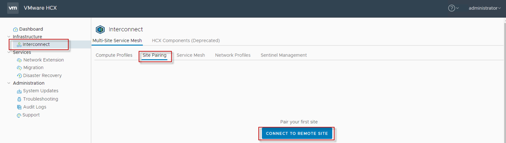
- Enter remote HCX URL and username and password and click Connect. After a moment new site pairing will appear.
- HCX Manager needs information about management and vMotion networks of the ESXi hosts in source and destination environment. Therefore it’s necessary to create network profiles for management and vMotion network in both source and     destination environment. Create ESXi management network profile – click Interconnect -> Network Profiles -> Create Network Profile
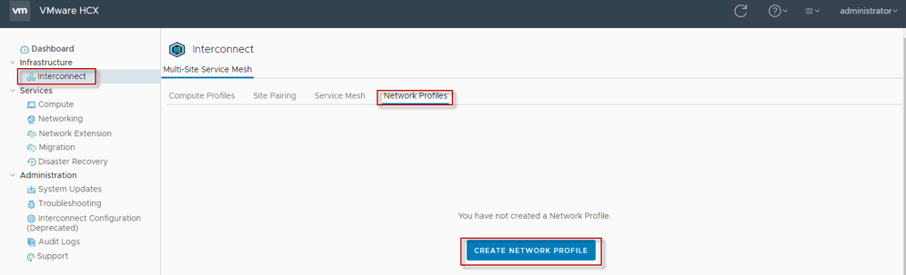
- Fill the information about ESXi hosts management network – select the network, input the IP address segment, mask, gateway etc and Create on the bottom. The network profile will appear on the list.
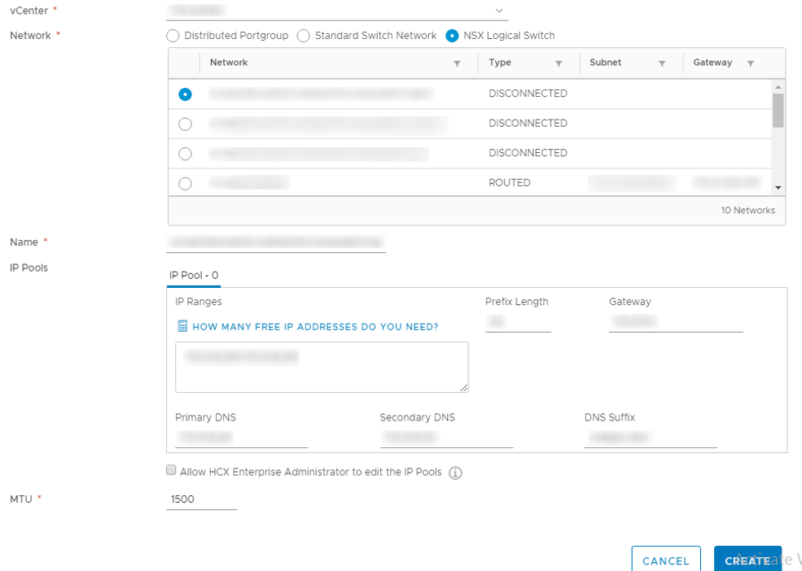
- In the same way create network profile for ESXi vMotion network – example configured vMotion network profile for VCS environment below:
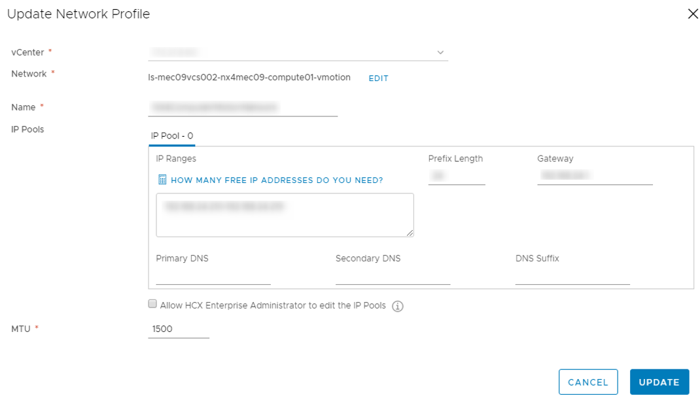
- In the same way create network profiles (ESXi management network and vMotion network) in source environment.
 Next it is necessary to create Compute Profile – it must be done for source and destination environment. Login to HCX Manager UI in source environment and select Interconnect -> Compute Profile -> Create Compute Profile. Enter the name of the compute profile and click Continue.
 Select services to be enabled, they are dependant on license applied to HCX (some of the features are available only in Enterprise license) and environment configuration. Click Continue. Below are the services that needs to be selected in the default configuration with Advanced license.
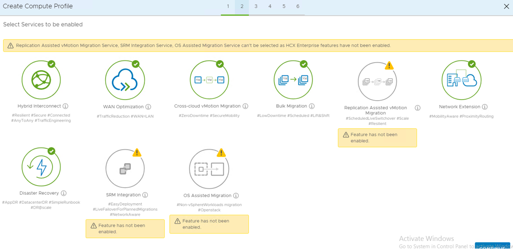
- Select cluster in which HCX services should be enabled. It is require to activate the HCX services on the cluster.
- Select resource in which Interconnect appliances (interconnect – IX, Network Extension – NE and Wan Optimization – WO) will be deployed – compute resource and storage resource in next screen.
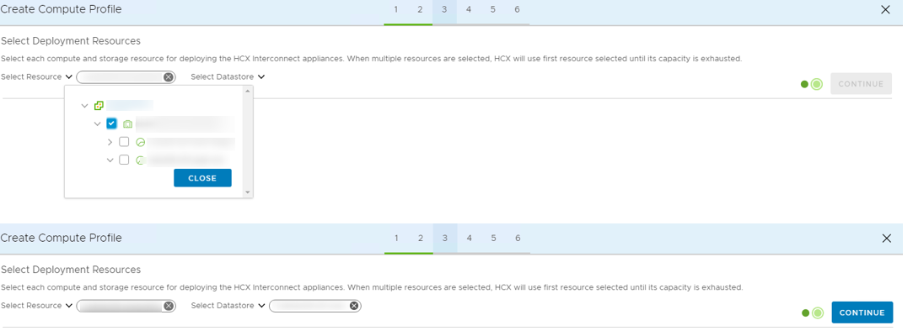
- Select uplink network profile – Use Management Network as a Uplink profile or a dedicated Uplink Network as Uplink profile.
- Select vMotion network profile created earlier (ESXi hosts vMotion network) and click Continue.
- Select vSphere Replication Network profile – the same as Management Network profile - and click Continue
- Select vDS for network extensions and click Continue
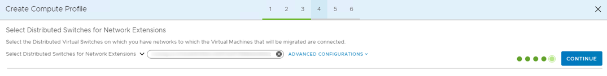
- Make sure the necessary ports are opened – review the firewall rules provided in the WAN and LAN sections and click Continue.
- Newly create compute profile appear on the list.
- In the same way create compute profile in **source** environment.

#### Service mesh configuration

- To allow migrations between source and destination environment it is necessary to create Service Mesh using compute profiles created in the previous steps. In the source environment login to HCX Manager UI and select Interconnect -> Service Mesh -> Create Service Mesh
- On the Select Sites make sure that source and destination environment is selected and click Continue.
- Select compute profiles create in steps earlier for source and destination environment and click Continue.
![Service Mesh 1(images/hcxWI/service_mesh1-1.png)
- Based on compute profiles selected appliances will be deployed. Review the configuration and click Continue.
- As the uplink network profiles were configured during compute profiles creation nothing is necessary to do on screen below – click Continue
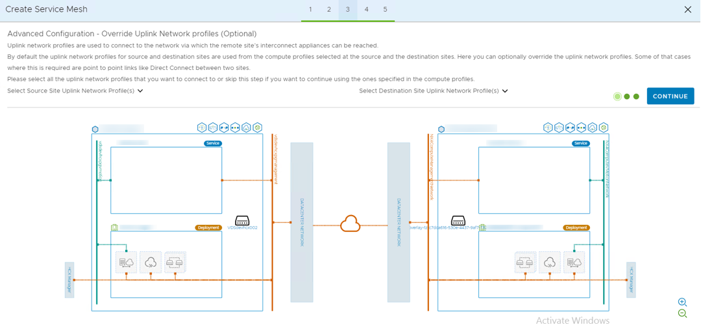
- On the next screen it is possible to scale out Network Extension feature which depends on source environment configuration. It is not necessary to modify any setting here. Click Continue
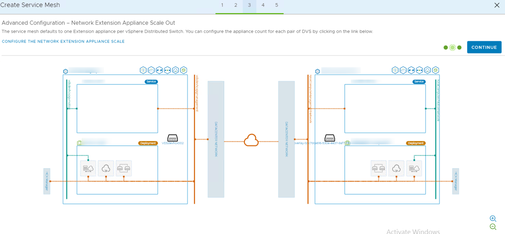
- It is possible to limit uplink bandwidth used for migrations on the next screen. However it is not necessary in test environment – click Continue
- Provide name for Service Mesh and click continue – deployed appliances in source and destination environment will have Service Mesh name in their hostnames included.
- After about 20-30 minutes Service Mesh will appear on the list in source and destination HCX Manager Service Mesh lists – environment is ready to perform migrations.
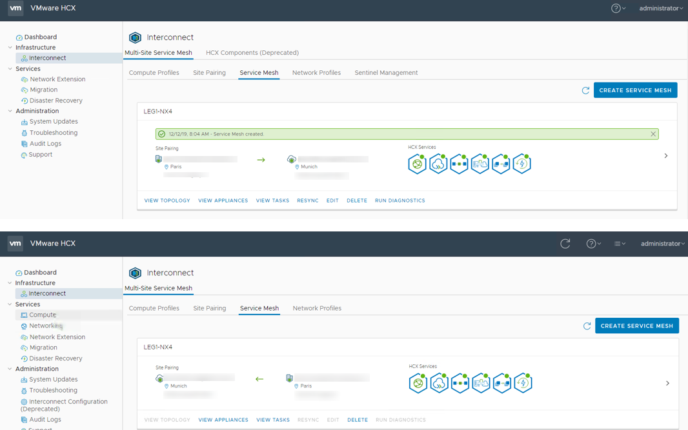

## 8. Abbreviations and definitions

| Abbreviation / Term | Explanation                  |
| ------------------- | ---------------------------- |
| HCX                 | Hybrid Cloud Extension       |
| NFC                 | Network File Copy            |
| vDS                 | Virtual distributed Switch   |
| FQDN                | Fully Qualified Domain Name  |
| CA                  | Certification Authority      |
| VCS                 | VMware Cloud Services         |
| NAT                 | Network Address Translation  |
| LB                  | Load Balancer                |
| DNS                 | Domain Name System           |
| NTP                 | Network Time Protocol        |
| SDDC                | Software-Defined Data Center |
