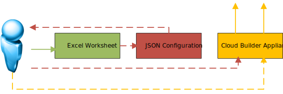
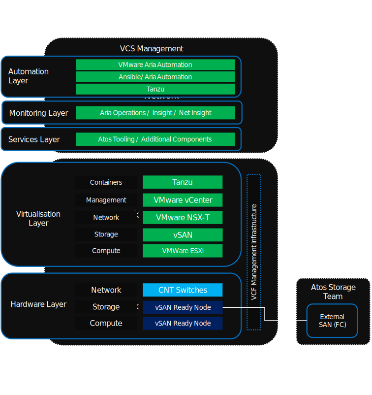
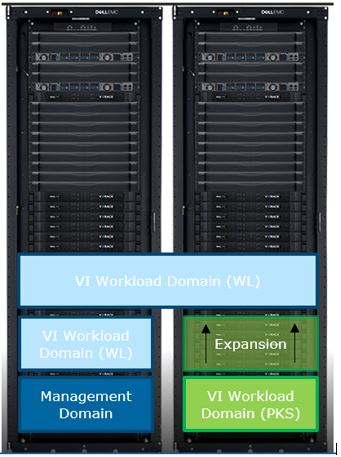
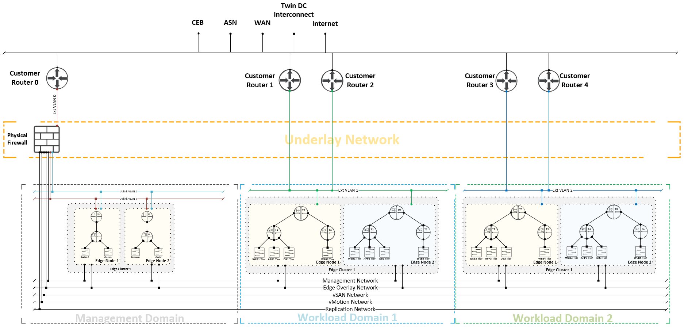
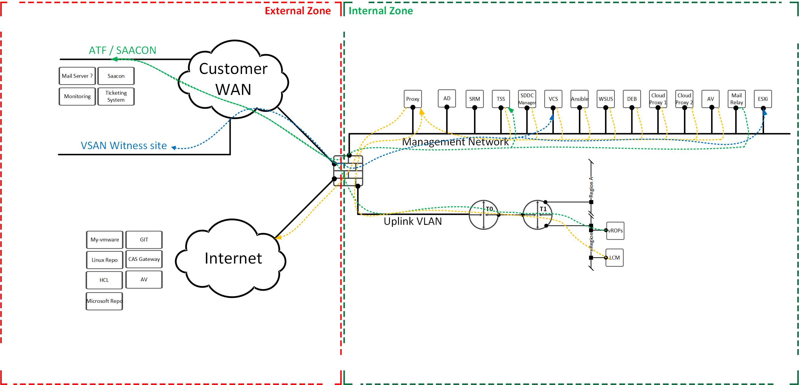
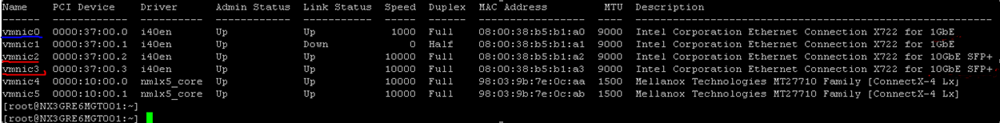

# Hardware Configuration Cabling Requirements

## Introduction

### Purpose

Check general hardware requirements of VCF and VCS.

### Audience

- VCS Architects
- VCS Engineers
- On-site team responsible for HW configuration

### Scope

The scope of this document covers the following:

 1. VCF requirements
 2. VCS requirements

# 2. VCF requirements

## 2.1 Cloud Builder VM

In order to deploy Cloud Foundation, Cloud Builder VM (based on Photon OS) needs to be deployed. Cloud Builder VM takes configuration inputs (deployment parameter excel sheet) which is later converted into a JSON file and provides the automated workflows that instantiate the management domain. The host for the Cloud Builder VM can be any supported system capable of running Cloud Foundation Builder. A dedicated ESXi host, workstation, or a laptop running
VMware Fusion or Workstation are examples of supported systems.
As for ESXi they must be installed before starting the VCF deployment and the L2 connectivity is needed between the ESXi Management vmkernel interface and the Cloud Builder VM.

##### Figure 1



The Cloud Builder VM requires the following resources: 4x vCPU, 4GB of RAM and 350GB of storage.

The Cloud Builder VM requires network connectivity to the ESXi management network, so that it can communicate to all ESXi hosts added to the solution. The Cloud Builder VM also needs to be able to communicate to the DNS and NTP servers used in the VMware Cloud Foundation environment so that it can validate the deployment inputs provided. The DNS and NTP settings used when deploying the Cloud Builder VM must be the same as the settings configured on the hosts.

## 2.2 Workload Domains

Cloud Foundation introduces workload domains, for creating logical pools across compute, storage, and networking. A workload domain consists of one or more vSphere clusters, provisioned automatically by SDDC Manager.

There are two types of workload domains - the management domain and VI workload domains.

### 2.2.1 Management Domain

The management domain is created during the bring-up process. It contains the Cloud Foundation management components. This includes an instance of vCenter Server and required NSX fpr vSphere components (NSX Manager and three NSX Controller VMs) for the management domain. All vRealize Suite components, such as vRealize Log Insight, vRealize Operations Manager and vRealize Automation, are installed in the management domain.
The management domain requires a minimum of four servers  and can be expanded in order to provide more resources for additional workloads or increased availability.
In the standard architecture deployment model, the infrastructure workloads contained within the management domain are kept isolated from tenant workloads through the creation of additional workload domains.
Cloud Foundation supports the use of vSAN ReadyNodes that are certified with supported versions of ESXi in the management domain.<br /><br />

The management domain contains a management cluster which must meet or exceed the following minimum hardware requirements.<br />

##### Table 1. Minimum Hardware Requirements for the Management Cluster

| **Component**      | **Requirements**                                                                                                                                                                                                  |
|--------------------|-------------------------------------------------------------------------------------------------------------------------------------------------------------------------------------------------------------------|
| Servers            | 4x vSAN ReadyNodes                                                                                                                                                                                                |
| CPU per server     | Dual-socket, 8 cores per socket minimum requirement for all-flash systems<br />Single-socket, 8 cores per socket minimum requirement for hybrid (flash and magnetic) systems                                      |
| Memory per server  | 192 GB                                                                                                                                                                                                            |
| Storage per server | 16 GB Boot Device, Local Media<br /> One NVMe or SSD for the caching tier: Class D Endurance or Class E Performance<br /> Two SSDs or HDDs for the capacity tier                                                  |
| NICs per server    | Two 10 GbE (or higher) NICs (IOVP Certified)<br />(Optional) One 1 GbE BMC NIC <br /> ```!!!Servers cannot have more than two NICs for primary communication, plus one BMC NIC for out-of-band host management``` |

### 2.2.2 VI Workload Domain

A virtual infrastructure (VI) workload domain is used in the standard architecture deployment model to contain the tenant workloads. A VI workload domain consists of a minimum of one cluster consisting of three or more servers. Additional clusters can be added to a VI workload domain as required. A Cloud Foundation solution can include a maximum of 15 workload domains, in accordance with vCenter maximums.<br />

Workloads in each cluster utilize vSphere High Availability (HA) to coordinate the failover to other servers in the event of a failure. To provide for the best levels of availability, all servers in a given cluster must be of the same model and type. A cluster does not need to have servers of the same model and type as other clusters. For example, a VI workload domain that has two clusters: all servers in Cluster 1 must be homogeneous; all servers within Cluster 2 must be homogeneous; servers in Cluster 1 do not need to have the same model and type as servers in Cluster 2.

##### Table 2. Minimum Hardware Requirements for the Workload Domain

| **Component**                       | **Requirements**                                                                                                                                                                                                                                                             |
|-------------------------------------|------------------------------------------------------------------------------------------------------------------------------------------------------------------------------------------------------------------------------------------------------------------------------|
| Servers                             | For vSAN backed VI workload domains, three compatible vSAN ReadyNodes are required<br /><br /> For NFS backed VI workload domains, three compatible vSAN ReadyNodes or three servers compatible with the vSphere version included with the Cloud Foundation BOM are required |
| CPU, memory, and storage per server | For vSAN backed VI workload domains, supported vSAN configurations are required<br /><br />For NFS backed VI workload domains, configurations need to be compatible with vSAN or with the vSphere version included with the Cloud Foundation BOM                             |
| NICs per server                     | Two 10 GbE (or higher) NICs (IOVP Certified)<br /><br />(Optional) One 1 GbE BMC NIC <br /><br /> ```!!!Servers can have a maximum of two NICs for primary communication, plus one BMC NIC for out-of-band host management.```                                               |

## 2.3 Storage

VMware Cloud Foundation utilizes and is validated against vSAN and NFSv3. The management domain uses vSAN for storage and workload domains use vSAN or NFSv3. The type of storage used by a VI workload domain is defined when the VI workload domain is created. Once the VI workload domain is created and the storage type has been selected, this cannot be changed to another storage type. The storage type selected during the VI workload domain creation applies to all clusters that are created within the VI workload domain.

## 2.4 Network options

The management domain includes NSX for vSphere (NSX-V). For VI workload domains either NSX-V or NSX-T can be chosen.

# 3 VCS requirements

In VCS VMware Cloud Foundation is deployed in a standard architecture model. It means that the SDDC management workload is separated from the tenant workload by using the workload domain.

vSAN ready nodes will be used for HyperConverged implementations. Using a vSAN Ready Node ensures seamless compatibility with vSAN during the deployment. All nodes must have uniform configuration across a given cluster.

VCS is conceptually broken down in to 5 main layers that make up the product:

- **Hardware Layer:** VCS is based upon Hyper Converged Infrastructure type hardware and is designed around (requires) VMware vSAN ready nodes for its hardware layer.
- **Virtualisation Layer:** VCSs Virtualisation layer houses the core infrastructure for the product. In this case this means VMware Cloud Foundation and its associated software components. A detailed view of these components can be found in the sections following this.
- **Services Layer:** This layer of VCS houses optional, non-core components to the base infrastructure. It the location for all tooling and additional components that are required to turn the lightweight management stack in to a fully featured private cloud integrated with a CMDB and ITSM. i.e. all components outside of the automated vendor LCM and deployment stack that is VCF + vRA-Cloud
- **Monitoring Layer:** The monitoring layer houses all software relating to monitoring and logging within VCS. It deals with information from VCS MGMT, VCS PODS and vRA-Cloud and provides the route out to a customer ITSM system.
- **Automation Layer:** VCS Automation layer is a combination of VMWare Cloud Automation Services as a SaaS offering and vRO (on prem). Together this area makes to the automation and orchestration layer of the product providing provisioning, day 1 and day 2 services for VMs running on VCS. Detail of the contents of this area follows.<br />

##### Figure 2



## 3.1 Hardware layer components

Hardware Layer Components

VCS is made up of HyperConverged infrastructure modules that conform to/are certified to the vSAN Ready Node standard with Juniper networking within the rack providing VCS to DC and inter-rack communications.

These nodes are grouped in to clusters that make up one or more workload domains within a VCS. These are:

- **Management Domain:** (Mandatory) There will always be a Management workload domain within a VCS. This houses the VCF components, SDDC Manager and all other VCS components and functions. This is the base unit of VCS. In a very small deployment of VCS the initial workload can be placed within this cluster (logically separated from VCF management).

- **VI Workload Domain (WL):** The Virtual Infrastructure Workload Domain is a VCS block considering of 4 or more nodes that is exclusively for customer workload VMs. These make up the default area for private cloud workloads to be placed. These areas are expandable up and across racks. There may be more than one workload domain within a VCS

##### Figure 3



### 3.1.1 Management Domain ESXi

Management Domain is using VCF Ready Nodes as a compute resource. They are prepared by Cloud Builder. Each ESXi will be configured with VMKernel NICs for the following services only:

##### Table 3. VMkernel NICs services

| **Service**     | **Description**                                             | **Primary NIC**                                | **Secondary NIC**                         |
|-----------------|-------------------------------------------------------------|------------------------------------------------|-------------------------------------------|
| ESXi Management | Used to manage the ESXi host itself                         | vmnic2 (Bull Sequanas)<br /><br />vmnic0<br /> | vmnic4 (Bull Sequanas)<br /><br /> vmnic1 |
| vMotion         | Used for managing workload between ESXi hosts within a Rack | vmnic2 (Bull Sequanas)<br /><br />vmnic0<br /> | vmnic4 (Bull Sequanas)<br /><br /> vmnic1 |
| vSAN            | Used to provide a Virtual Storage System within a Rack      | vmnic2 (Bull Sequanas)<br /><br />vmnic0<br /> | vmnic4 (Bull Sequanas)<br /><br /> vmnic1 |
| SDN             | Used to handle SDN overlay traffic                          | vmnic2 (Bull Sequanas)<br /><br />vmnic1<br /> | vmnic4 (Bull Sequanas)<br /><br /> vmnic0 |

Table 3 is showing assignment of the uplinks for each service. To provide equal usage of the uplink some of the services would be using <b>vmnic2</b> as a primary interface <b>( for Bull Sequanas only)</b> or vmnic0 (for servers delivered by other server providers), and others would be using <b>vmnic4( for Bull Sequanas only)</b> or vmnic1 (for servers delivered by other server providers) as a primary interface according to mentioned table.

## 3.2 SDN design

This part is fully covered in [lldSoftwareDefinedNetworks.md](../design/lldSoftwareDefinedNetworks.md).
Most important parts for the onsite team can be found below.

##### Figure 4



The figure above presents the scope of VCS. Components located inside Management Domain as well as in Workload Domains are supported bey VCS. Underlay networks are independent from VCS and should be managed by NDCS with initial requirements covered by this document mentioned in the **"Underlay requirements for VCS SDN"** section. Communication between components in Management Domain, between components inside Workload Domains as well as cross connection between those domains would be solved by Underlay network.

### 3.2.1 Underlay requirements for VCS SDN

#### Physical requirements

There are no physical requirements except existence of the Physical Firewall defined later in this section, as well as physical infrastructure which will provide minimum quality of the traffic and necessary protection. Internal routing between VCS management and other Workload Domains in the same site must be less than 5ms. VCS requires network latency between the management stack and all other instances of VCS regions to be lower than 150ms PEAK latency. If DR is selected the max latency between DR locations is 100ms.
Physical topology should be build based on Top Of Rack and End Of Row design including redundancy.

#### VLANs

The following list of VLANs represents those that are required and planned for the VCS implementation. Such VLANs should be provided before VCS build will start.

##### Table 4. VLAN’s requirements

| VLAN       | Routed Interface | Workload Domain | Management Domain | Purpose                                                              |
|------------|------------------|-----------------|-------------------|----------------------------------------------------------------------|
| Ext VLAN 0 | Yes              | No              | Yes               | VLAN between Customer Router and SRX firewall                        |
| Ext VLAN 1 | Yes              | Yes             | No                | VLAN between Customer Router and Workload Domain 1 T0 Logical Router |
| Ext VLAN 2 | Yes              | Yes             | No                | VLAN between Customer Router and Workload Domain 2 T0 Logical Router |
| MGT        | Yes              | Yes             | Yes               | Management Network                                                   |
| vSAN       | Yes              | Yes             | Yes               | vSAN Network                                                         |
| vMotion    | Yes              | Yes             | Yes               | vMotion Network                                                      |
| vTEP       | Yes              | Yes             | Yes               | vTEP Network                                                         |
| vRealize   | Yes              | No              | Yes               | vRealize Network                                                     |

#### Subnets

Below table representing networks which are necessary to create VCS and its components:

##### Table 5. Subnet list for VCS

| Name               | VLAN           | Subnet            | Subnet Prefix Length | Description                                                            |
|--------------------|----------------|-------------------|----------------------|------------------------------------------------------------------------|
| Management Network | < MGT >        | Customer Routable | 24                   | Management network                                                     |
| vSAN Network       | < vSAN >       | Customer Routable | 24                   | vSAN Network                                                           |
| vMotion Network    | < vMotion >    | Customer Routable | 24                   | vMotion Network                                                        |
| vTEP Network       | < vTEP >       | Customer Routable | 24                   | vTEP Network                                                           |
| vRealize Network   | < vRealize >   | Customer Routable | 24                   | vRealize Network                                                       |
| External Network 0 | < Ext VLAN 0 > | Customer Routable | Customer Specific    | Subnet between Customer Router and SRX firewall                        |
| External Network 1 | < Ext VLAN 1 > | Customer Routable | Customer Specific    | Subnet between Customer Router and Workload Domain 1 T0 Logical Router |
| External Network 2 | < Ext VLAN 2 > | Customer Routable | Customer Specific    | Subnet between Customer Router and Workload Domain 2 T0 Logical Router |
|                    |                |                   |                      |                                                                        |

#### Security

VCS is a product which relies on existing physical infrastructure, because of that, physical network should provide security functionalities. The required level of security can be accomplished by providing a device that is able to inspect traffic between networks. VCS relies on networks which should be terminated (gateway should be) on firewall device. Drawings on this document will present this firewall device as SRX, but this is only representation of the firewall which can be used. All firewalls which are capable to define zones are good (Juniper SRX, Cisco ASA context or others). For simplicity in below sections this device would be named "Physical Firewall".

In VCS we would present two types of zones - Internal and External:

- **Internal** - internal networks inside VCS - there is no need to duplicate security between internal networks if internal security is solved by NSX
- **External** - external networks to VCS

The above partition allows to prepare a simple ruleset which is required on the Physical Firewall.
The table below displays a ruleset based on subnets defined in the previous section. The table will contain as well groups of objects which will be defined later.

##### Table 6. Ruleset for Physical Firewall

| Firewall Rule Name              | Source                                                                                                                            | Destination                                                                                                                       | Service     | Action |
|---------------------------------|-----------------------------------------------------------------------------------------------------------------------------------|-----------------------------------------------------------------------------------------------------------------------------------|-------------|--------|
| ProxyToInternet                 | Internal Proxy                                                                                                                    | Internet                                                                                                                          | HTTPS, HTTP | ACCEPT |
|                                 |                                                                                                                                   |                                                                                                                                   |             |        |
| AsnToTerminalServers            | ASN                                                                                                                               | TSS                                                                                                                               | RDP         | ACCEPT |
|                                 |                                                                                                                                   |                                                                                                                                   |             |        |
| AntivirusOperation              | Antivirus                                                                                                                         | Antivirus Server                                                                                                                  | \<TBD\>     | ACCEPT |
|                                 |                                                                                                                                   |                                                                                                                                   |             |        |
| MailRelay                       | Mail Relay                                                                                                                        | ASN                                                                                                                               | \<TBD\>     | ACCEPT |
|                                 |                                                                                                                                   |                                                                                                                                   |             |        |
| VropsToTicketingSystem          | vROPs                                                                                                                             | ASN                                                                                                                               | \<TBD\>     | ACCEPT |
|                                 |                                                                                                                                   |                                                                                                                                   |             |        |
| SrmToDr                         | SRM                                                                                                                               | DR Environment Management Network                                                                                                 | \<TBD\>     | ACCEPT |
|                                 |                                                                                                                                   |                                                                                                                                   |             |        |
| AdToDr                          | Active Directory                                                                                                                  | DR Environment Management Network                                                                                                 | \<TBD\>     | ACCEPT |
|                                 |                                                                                                                                   |                                                                                                                                   |             |        |
| ReplicationNetworkToDr          | Replication Network                                                                                                               | DR Environment Management Network                                                                                                 | \<TBD\>     | ACCEPT |
|                                 |                                                                                                                                   |                                                                                                                                   |             |        |
| CrossInternalNetworksConnection | Replication Network <br> Management Network <br> vRealize Network <br>   Overlay Network  <br> vMotion Network <br>  vSAN Network | Replication Network <br> Management Network <br> vRealize Network <br>   Overlay Network  <br> vMotion Network <br>  vSAN Network | any         | ACCEPT |
|                                 |                                                                                                                                   |                                                                                                                                   |             |        |
|                                 |                                                                                                                                   |                                                                                                                                   |             |        |
|                                 |                                                                                                                                   |                                                                                                                                   |             |        |
|                                 |                                                                                                                                   |                                                                                                                                   |             |        |
|                                 |                                                                                                                                   |                                                                                                                                   |             |        |
| Default Rule                    | any                                                                                                                               | any                                                                                                                               | any         | DENY   |

Below figure is showing flows which have been defined in VCS where traffic is exiting Zones.

##### Figure 5. Management traffic passing Physical Firewall



Red Area represents External Zone, and green represents Internal Zone. Inspection of the traffic should be done only when traffic is going from External Zone to Internal or from Internal to External.
In addition traffic should be opened for all established connections.

# 3.3 Management Domain

##### Figure 6. SDN Management Domain


The SDN Management Domain is build based mostly on VMware NSX-V, and it will be
built with dedicated for vROPs Edge or without.

##### Table 7. Design Decisions for Management Domain

| Decision ID | Design Decision                                                                                                                                    | Design Justification                                                                                                                                                                                                                                                                                                                                                                                                                                                                                                                                                                                                                                                                    | Design Implication                                                                                                                              |
|-------------|----------------------------------------------------------------------------------------------------------------------------------------------------|-----------------------------------------------------------------------------------------------------------------------------------------------------------------------------------------------------------------------------------------------------------------------------------------------------------------------------------------------------------------------------------------------------------------------------------------------------------------------------------------------------------------------------------------------------------------------------------------------------------------------------------------------------------------------------------------|-------------------------------------------------------------------------------------------------------------------------------------------------|
| MGTD001     | SRX 345 will terminate Management Network and will provide Firewalling capabilities. Or any other with necessary capabilities (ASA, Checkpoint).   | Management Network where crucial components like vCenter Server or NSX Managers are located require Firewall which will filter traffic to those components                                                                                                                                                                                                                                                                                                                                                                                                                                                                                                                              | This require order of pair of SRX 345 firewalls and to add additional configuration to those. Or configure existing one to fulfil requirements. |
| MGTD002     | Assign static IP addresses to all management components in the VCS infrastructure except NSX-T TEPs. NSX-T TEPs are assigned by using DHCP server. | Ensures that interfaces such as management and storage always have the same IP address. In this way, you provide support for continuous  management of ESXi hosts using vCenter Server and for provisioning IP storage by storage administrators. NSX-T TEPs do not have an administrative endpoint. As a result, they can use DHCP for automatic IP address assignment. You are also unable to assign directly a static IP address to the VMkernel port of an NSX-T TEP. IP pools are an option but the NSX-T administrator must create them. If you must change or expand the subnet, changing the DHCP scope is simpler than creating an IP pool and assigning it to the ESXi hosts. | Requires accurate IP address management.                                                                                                        |

Management of the Management Domain might be done from ASN Admingates by
accessing dedicated MS Windows based terminal server (also called Jump server or
Stepping-Stone). This Bastion Server will be placed on Management Network where
other management components are located. Because Management Network is using
customer pentacle network, there is a need to make NAT on ASN Router/Firewall.

##### ESXi Server NICs assignment

As mentioned in Table 1 in 2.2.1 servers cannot have more than two NICs (ports) for primary communication.
That's why each VCS VMware ESXi host should contains at least 2x 10Gbit dual port network card.

**To provide uninterrupted service- redundancy and high availability, two ports (*one from each separated NIC*) have to be used for ESXi management network.**

**Uplinks from a single virtual switch should be connected to two separate physical switches to provide redundancy.**

To provide out-of band management a dedicated port should be used (depending to servers vendor)

Figure 3 shows vmnic0 and vmnic1 as a NICs connected to vDS for management network but vmnic numbers can be different depending on hardware platform.

##### Figure 7


Table 8 shows cabling configuration as an example for Bull Sequanas.
Each BullSequana S series server is having a dual-10Gb/dual-1Gb PCI adapter and dual-port 10Gb PCI adapter , all connected to the Juniper switches (all ports 10G-capable).
As an example, list of vmnics available on ESXi host can be find on Figure 7.

> **Please keep in mind that numbers of network ports depend on server vendor.**

##### Table 8

| Server | Port Main brd | Ports PCI adp | vmnic | Switch        | Notes              |
|--------|---------------|---------------|-------|---------------|--------------------|
| MGT1   | 0             |               | 0     | 1             | BMC                |
|        | 1             |               | 1     | not connected | -                  |
|        | 2             |               | 2     | 0             | vDS (mgmt network) |
|        | 3             |               | 3     | 1             | -                  |
|        |               | 1             | 4     | 1             | vDS (mgmt network) |
|        |               | 2             | 5     | 0             | -                  |
| MGT2   | 0             |               | 0     | 0             | BMC                |
|        | 1             |               | 1     | not connected | -                  |
|        | 2             |               | 2     | 0             | vDS (mgmt network) |
|        | 3             |               | 3     | 1             | -                  |
|        |               | 1             | 4     | 1             | vDS (mgmt network) |
|        |               | 2             | 5     | 0             | -                  |
| MGT3   | 0             |               | 0     | 1             | BMC                |
|        | 1             |               | 1     | not connected | -                  |
|        | 2             |               | 2     | 0             | vDS (mgmt network) |
|        | 3             |               | 3     | 1             | -                  |
|        |               | 1             | 4     | 1             | vDS (mgmt network) |
|        |               | 2             | 5     | 0             | -                  |
| MGT4   | 0             |               | 0     | 0             | BMC                |
|        | 1             |               | 1     | not connected | -                  |
|        | 2             |               | 2     | 0             | vDS (mgmt network) |
|        | 3             |               | 3     | 1             | -                  |
|        |               | 1             | 4     | 1             | vDS (mgmt network) |
|        |               | 2             | 5     | 0             | -                  |
| CMP1   | 0             |               | 0     | 1             | BMC                |
|        | 1             |               | 1     | not connected | -                  |
|        | 2             |               | 2     | 0             | vDS (mgmt network) |
|        | 3             |               | 3     | 1             | -                  |
|        |               | 1             | 4     | 1             | vDS (mgmt network) |
|        |               | 2             | 5     | 0             | -                  |
| CMP2   | 0             |               | 0     | 0             | BMC                |
|        | 1             |               | 1     | not connected | -                  |
|        | 2             |               | 2     | 0             | vDS (mgmt network) |
|        | 3             |               | 3     | 1             | -                  |
|        |               | 1             | 4     | 1             | vDS (mgmt network) |
|        |               | 2             | 5     | 0             | -                  |
| CMP3   | 0             |               | 0     | 1             | BMC                |
|        | 1             |               | 1     | not connected | -                  |
|        | 2             |               | 2     | 0             | vDS (mgmt network) |
|        | 3             |               | 3     | 1             | -                  |
|        |               | 1             | 4     | 1             | vDS (mgmt network) |
|        |               | 2             | 5     | 0             | -                  |
| CMP4   | 0             |               | 0     | 0             | BMC                |
|        | 1             |               | 1     | not connected | -                  |
|        | 2             |               | 2     | 0             | vDS (mgmt network) |
|        | 3             |               | 3     | 1             | -                  |
|        |               | 1             | 4     | 1             | vDS (mgmt network) |
|        |               | 2             | 5     | 0             | -                  |

##### Figure 8



# 3.4 Workload Domain

Workload Domain is a construct within the VCS deployment for the purpose of
running customer Workloads. The SDN Workload Domain consists number of the
Logical Routers (LR) and Logical Switches (LS) dependent upon the VCS Customer
requirements. Each deployment will have Tier 0 LR which is acting as Border
Router between External environment or Management Domain and VCS Workload
Domain.

Workload Domain consist Tier 1 LRs, which are created on demand and joined to
Tier 0 Logical Router. Each Tier 1 LR will connect Logical Switches to its
interfaces to provide default gateway capabilities, as well as Routing between
those Logical Switches. It will contain two instances – DR (Distributed Router)
and SR (Service Router). DR will provide East-West communication Logical
Switches, where SR will provide North-South communication and centralized
services such as Firewall, NAT, Load Balancing.

##### SDN Workload Domain

##### Figure 9


Customer Routers will communicate with Customer workload using dedicated VLAN
which will be terminated by T0 Service Router. To provide dynamic routing
capability to learn routes, there is a possibility that T0 Logical Router would
be configured with BGP routing protocol. To avoid issues with hardware failure,
there is a requirement to provide at least two Customer Routers.

T0 and T1 Logical Routers would be deployed inside Edge Nodes which will
construct Edge Cluster.
