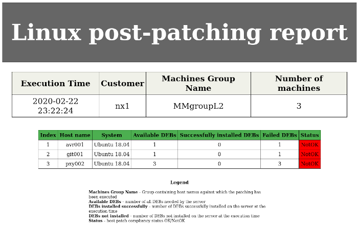
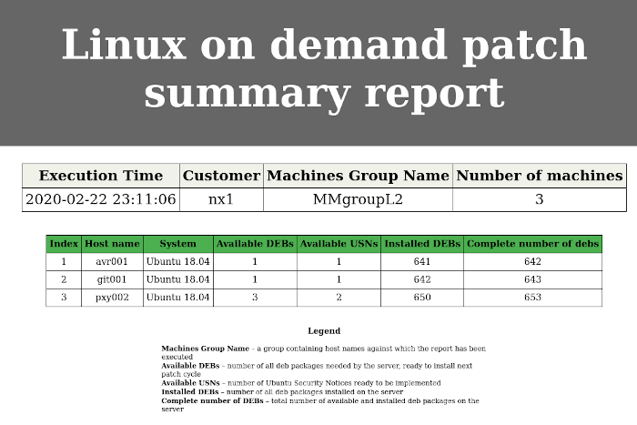
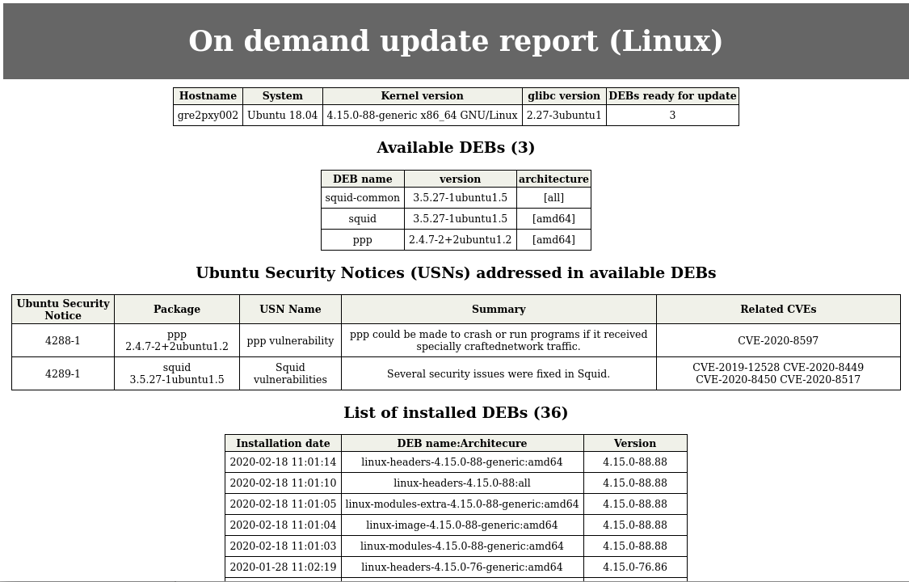
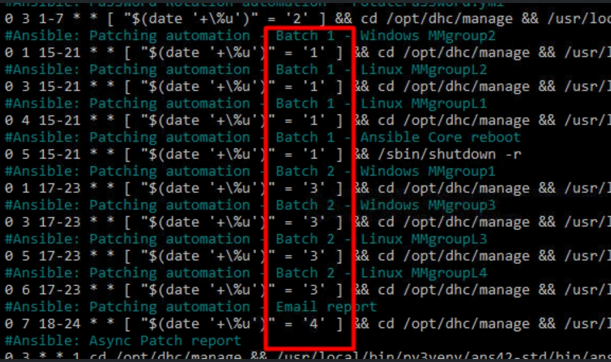

# Linux Patching

## Changelog

| Version | Date | Author | Changes |
|---------|------|------|---------|
| 0.1 | 02/22/2020 | Przemyslaw Bojczuk | New version |
| 0.2 | 02/23/2020 | Przemyslaw Bojczuk | Screenshots, Reports, Groups, Dependencies |
| 0.3 | 09/28/2020 | Jakub Wosko | change roles prefix from 'dpc' to 'dhc'; remove information about not working features: dhc-manageUsn, dhc-manageAptMark |
| 0.4 | 05/10/2021 | Robert Kaminski | dhc-1972 adjusted operational playbooks names, refreshed maintenance group membership |
| 0.5 | 05/09/2022 | Margo Piliukh | CESDHC-3989 - added the evidence collection in the CES Evidence repository |
| 0.6 | 09/08/2023 | Radoslaw Dabrowski | VCS-10487 - Updated link to SP to collect evidences. |
| 0.7 | 16/04/2024 | Adam Szymczak | VCS-12436 - Added section on automated patching |
| 0.8 | 07/06/2024 | Stanislaw Kilanowski | VCS-12744 - Added information about automated report delivery |
| 0.9 | 09/02/2026 | Toader Gurin | VCS-18200 - CAT as Test Environment for Patching Activities |

## Introduction

Ubuntu Linux distribution contains deb packages or debs for short. Deb packages are the source of software for Ubuntu which are the source of main packages, patches and updates.  
VCS provides its own internal deb repository host, *DEB001*. It is an Aptly service which mirrors packages, creates snapshots, and publishes them via an Apache service which makes them downloadable. The configuration of the internal repository is provided to the target Ubuntu management hosts with `/etc/apt/sources.list` file.

Ubuntu Patching is executed from Ansible Core Management host *ANS001*.

### Purpose

Execute patching and generate reports for VCS Linux management hosts.

### Audience

- VCS Engineering
- VCS Operations

### Scope

This instruction covers:

- executing patching
- creating reports
- uploading reports to the CES Evidence repository

Out of Scope:

- change process and agreement with security officer regarding whitelisting or blacklisting patches
- explanation of deb packages and dependencies
- explanation of apt, apt-get and dpkg
- detailed explanation of the content of `/etc/apt/sources.list`
- handling Common Vulnerability and Exposures (CVE)
- handling Ubuntu Security Notices (USN)

__Note:__
Even though whitelisting, blacklisting, managing individual security patches is not within the scope of this work instruction all the related ansible roles are listed as the dependencies for successful patching operation.

## Prerequisites

### General Information

- Ansible Core management host *ANS001* is a member of the management active directory (this step is performed automatically during the hardening phase),
- Ubuntu based management hosts are members of the management active directory (this step is performed automatically during the hardening phase),
- Ansible Core management host *ANS001* is configured to use kerberos as an authentication method (this step is performed automatically during the hardening phase).
- Patching is executed using personal credentials (management domain account),
- If customized patching is required, it is possible to upgrade and/or lock packages with their version - the list of packages needs to be prepared manually and approved by the security officer.

### Working Directory

All the playbooks must be executed from the `/opt/dhc/manage` directory.

To navigate there execute:

```bash
cd /opt/dhc/manage
```

To check which directory you are in execute:

```bash
pwd
```

### sources.list and Aptly Snapshots

The default configuration of *DEB001* provides automated snapshot creation. The snapshots are created and published 7th day of each month, which aligns with Microsoft's process of issuing patches each Tuesday after the second weekend of each Month and allows to synchronize VCS patching of Windows and Ubuntu Linux hosts during the same period.

Whenever snapshot is created the `sources.list` file is created with the appropriate information and the ongoing sources list is moved to `sources.list-< releaseDate >`.

`sources.list` files are publish in `https://< deb001 >/archive` directory and provided automatically to the target hosts when patching is executed.

To check current source.list on the target host execute:

```bash
cat /etc/apt/sources.list
```

To check currently available sources.list navigate with the web browser to `https://< deb001 >/archive/sources.list`

__Note:__ The initial snapshot can take up to 16 hours (up to 8 hours to synchronize deb packages and up to 8 hours to generate the local metadata for each package and publishing it). Which means that even though *deb001* host has just been built it can be not ready to serve patches immediately.

## Maintenance Groups

VCS Engineering predefined four maintenance groups for Ubuntu:

| Group Name | Hosts | Additional info |
| --- | --- | --- |
|  MMgroupL1 | *ans001* (Ansible Core) | *ans001* patches itslef. After the patching manual restart is required |
|  MMgroupL2 | *pxy002* (Squid Proxy) <br> *nes001* (Nessus) <br> | |
|  MMgroupL3 | *pxy003* (Squid Proxy) <br> *hsv001* (Hashi Vault) <br> *hgw001* (HTTP GW) <br> *srs001* (SMTP relay) <br>*mid001* (MID server) | |
|  MMgroupL4 | *deb001* (Ubuntu package repository) | |

The configuration of these groups is kept in ansible inventory file `/opt/dhc/manage/hosts` on Ansible Core management host *ANS001* server. If needed it can be adjusted.

## Reports

Reports cover the information about installed deb packages, or debs, available debs for installation and *Ubuntu Security Notices* (*USN*) which provide *Common Vulnerability and Exposure* resolution.

- <https://usn.ubuntu.com/releases/ubuntu-18.10/> USNs for Ubuntu 18.04 Bionic Beaver
- <https://people.canonical.com/~ubuntu-security/cve/> CVE Tracker

### Post Patching Report

The *Post Patching Report* is generated after each patching automatically.
These reports are sent via an e-mail to the team (by default VCS DevSecOps but can be overwritten with extra vars).
They are also available on *deb001* under: `/data/ansiblepatchreport/post_patching`

Sample report:

<kbd></kbd>

### On Demand Report Summary

The *On Demand Report Summary* can be scheduled or executed manually. It provides cumulative information about available debs and USNs. These reports are available on `deb001` under: `/data/ansiblepatchreport/summary_reports`

Sample report:

<kbd></kbd>

This report can be generated by executing the following command against the desired management group, a single host, or all Linux hosts, for example:

```bash
ansible-playbook generateOnDemandPatchReportLinux.yml -e "HOSTS=MMgroupL2 type=onDemandReportSummary"
```

### On Demand Report Detailed

The *On Demand Report Summary* can be scheduled or executed manually. It provides detailed information about available debs and USNs pear each individual host. Additionally, USNs are aligned against the related CVEs. These reports are available on `deb001` under: `/data/ansiblepatchreport/on_demand`

Sample report:

<kbd></kbd>

This report can be generated by executing the following command against the desired management group, a single host, or all Linux hosts, for example:

```bash
ansible-playbook generateOnDemandPatchReportLinux.yml -e "HOSTS=MMgroupL2 type=onDemandReportDetailed"
```

### Generating Reports

Login with your personal account to *ans001*.
Navigate to `/opt/dhc/manage`:

```bash
cd /opt/dhc/manage
```

All the reports are generated via the same playbook `generateOnDemandPatchReportLinux.yml`. Identify the `HOSTS` value based on the [Maintenance Groups](#maintenance-groups) you want to execute reports against and the `type` value for the report you want.

| Report | `type` value |
| --- | --- |
| On Demand Report Summary | `onDemandReportSummary` |
| On Demand Report Detailed | `onDemandReportDetailed` |

To execute *On Demand Report Detailed* issue against one group of hosts issue:

```bash
ansible-playbook generateOnDemandPatchReportLinux.yml -e "HOSTS=MMgroupL1 type=onDemandReportDetailed"
```

To execute *On Demand Report Detailed* issue against four groups of hosts issue:

```bash
ansible-playbook generateOnDemandPatchReportLinux.yml -e "HOSTS=MMgroupL1,MMgroupL2,MMgroupL3,MMgroupL4 type=onDemandReportDetailed"
```

To execute *On Demand Report Detailed* issue against chosen hosts issue:

```bash
ansible-playbook generateOnDemandPatchReportLinux.yml -e "HOSTS=mid001,deb001 type=onDemandReportDetailed"
```

To execute *On Demand Report Summary* issue against one group of hosts issue:

```bash
ansible-playbook generateOnDemandPatchReportLinux.yml -e "HOSTS=MMgroupL1 type=onDemandReportSummary"
```

To execute *On Demand Report Summary* issue against four groups of hosts issue:

```bash
ansible-playbook generateOnDemandPatchReportLinux.yml -e "HOSTS=MMgroupL1,MMgroupL2,MMgroupL3,MMgroupL4 type=onDemandReportSummary"
```

To execute *On Demand Report Summary* issue against chosen hosts issue:

```bash
ansible-playbook generateOnDemandPatchReportLinux.yml -e "HOSTS=mid001,deb001 type=onDemandReportSummary"
```

Once the report was generated and the playbook was completed you are going to receive information where to find it:

```yaml
TASK [dhc-manageReportingLinux : Summary] **************************************
ok: [deb001] => {
    "msg": [
        "",
        "################################################################",
        "##                                                            ##",
        "##  The reports were generated.                               ##",
        "##                                                            ##",
        "##  Please login to deb001.                                   ##",
        "##",
        "##  Navigate to /data/ansiblepatchreport/onDemandReportDetailed",
        "##",
        "##  And find the following reports:                           ##",
        "##  ",
        [
            "20200223_100228"
        ],
        "##                                                            ##",
        "##                                                            ##",
        "################################################################"
    ]
}
```

## Patching Execution

### Manual patching execution

Before patching it is recommended to create reports.

The patching is executed via the  playbook `patchLinux.yml`. Identify the `HOSTS` value based on the [Maintenance Groups](#maintenance-groups) you want to execute patching against.

To execute the patching against the *MMgroupL1* group issue:

```bash
ansible-playbook patchLinux.yml -e "HOSTS=MMgroupL1"
```

To execute the patching against the *MMgroupL2* group issue:

```bash
ansible-playbook patchLinux.yml -e "HOSTS=MMgroupL2"
```

To execute the patching against the *MMgroupL3* group issue:

```bash
ansible-playbook patchLinux.yml -e "HOSTS=MMgroupL3"
```

To execute the patching against the *MMgroupL4* group issue:

```bash
ansible-playbook patchLinux.yml -e "HOSTS=MMgroupL4"
```

__Note:__
It is possible to execute patching against chosen hosts. To do so, identify these hosts and issue:

```bash
ansible-playbook patchLinux.yml -e "HOSTS=mid001,deb001"
```

Once the patching is completed your hosts are going to be restarted if needed. After the playbook execution was completed [Post Patching Report](#post-patching-report) is going to be generated. They will be sent to the team's mailbox. You are also going to receive the information where to find the files:

```yaml
TASK [dhc-manageReportingLinux : Summary] *****************************************************************************************
ok: [deb001] => {
    "msg": [
        "",
        "################################################################",
        "##                                                            ##",
        "##  The reports were generated.                               ##",
        "##                                                            ##",
        "##  Please login to deb001.                                   ##",
        "##",
        "##  Navigate to /data/ansiblepatchreport/postPatchingReport",
        "##",
        "##  And find the following reports:                           ##",
        "##  ",
        [
            "MMgroupL2.20200223_102441.html"
        ],
        "##                                                            ##",
        "##                                                            ##",
        "################################################################"
    ]
}
```

##### Rebooting Ansible Host

The host *ANS001* is patching itself. If the reboot is needed you have to run it manually. The appropriate massage is going to be displayed:

```yaml
TASK [Reboot message || delay 30 seconds] ***********************************************************************************************************************************************************************************
ok: [ans002] => {
    "msg": [
        "",
        "################################################################",
        "##                                                            ##",
        "## If you have patched the host you are running playbooks     ##",
        "## from you have to reboot it manually.                       ##",
        "##                                                            ##",
        "## Should the reboot be needed type:                          ##",
        "## sudo reboot                                                ##",
        "##                                                            ##",
        "################################################################",
        ""
    ]
}

TASK [waiting for user to read the message above] ***************************************************************************************************************************************************************************
Pausing for 30 seconds
(ctrl+C then 'C' = continue early, ctrl+C then 'A' = abort)
```

Issue:

```bash
sudo reboot
```

### Automatic patching execution using crontab

Patching can also be set to be executed automatically by using cron on Ansible Core VM.

#### Configuring cronjobs

Crontab can be configured using dedicated playbook:

```bash
ansible-playbook configurePatchingCron.yml
```

__Note:__
Before configuring cronjobs make sure `aut05` certificate is configured on Ansible Core VM.

This playbook will add eight cron jobs that will run patching for both windows and linux VMs (along with Ansible Core reboot).
The jobs are scheduled in 2 batches:

- 3rd Tuesday morning of the month (MMgroup2, MMgroupL2, MMgroupL1, Ansible Core reboot)
- Thursday morning after 1st batch (MMgroup1, MMgroup3, MMgroupL3, MMgroupL4)

Alternative configuration options are also available:

- enable only 1st batch jobs

```bash
ansible-playbook configurePatchingCron.yml -t batch1
```

- enable only linux jobs

```bash
ansible-playbook configurePatchingCron.yml -t linux
```

- enable job for only one maintenance group

```bash
ansible-playbook configurePatchingCron.yml -t MMgroupL1
```

The playbook can also be used to disable the jobs in case it's required by defining `cronDisabled` variable:

```bash
ansible-playbook configurePatchingCron.yml -e "cronDisabled=true"
```

__Note:__
Defining patches to be installed and report upload remain manual steps to be carried out by engineer.

#### Verification of automated patching

Once first batch of automated patching is executed engineer should verify post patching reports: received in an email or created in `/data/ansiblepatchreport/postPatchingReport` on `<locationCode>deb001` for Linux patching.
These reports need to be uploaded to __CES Evidence Repository__ as during manual patching.

If reports are not present or are incomplete verify, patching logs at `/var/log` on Ansible Core VM and resolve any issues found.
If VMs patched during first batch are showing any sing of possible problems, second patching batch should be postponed until issues are resolved.

The same verification should be carried out after second batch of patching is executed.

## SIEMENS CAT as TEST Environment Patching

For testing purposes, CAT servers are patched on Mondays and Wednesdays, one day earlier than other environments. This allows any issues to be identified and resolved before impacting PROD environments, where patching runs in parallel.



## Gathering and uploading evidence

All post-patching reports should be gathered and uploaded the appropriate folder in the __CES Evidence Repository__. This applies to every customer and a separate folder is created for this purpose. The CES Evidence patching reports location can be found under this [link](https://atos365.sharepoint.com/:f:/r/sites/100004564/CES%20Evidence%20repository/CES%20Practice%20CTO%20DHC/Vulnerability%20Management%20(Patch%20Management)/Patch%20Reports?csf=1&web=1&e=iYoBSn).

If you don't have permissions to access this repository, contact the __Service Delivery Manager__ or the __Service Manager__.

## Appendix - list of Ansible Dependencies

The work instruction for the following components is out of scope. However they are required for the successful patching management and execution hence they are enumerated here. This section covers a brief information about them.

### sources.list Configuration

Whenever patching is executed the role `dhc-configureSourcesList` is executed. The automated patching uses `https://< deb001 >/archive/sources.list` with the latest snapshot. The repository on targets is always refreshed. Additionally, the role allows to configure original *sources.list* should it be needed. For more information and usage examples please find `roles/dhc-configureSourcesList/README.md`

### Patching Role

Whenever patching is issued the role `dhc-managePatchingLinux` is executed. For more information and usage examples please find `roles/dhc-managePatchingLinux/README.md`

#### Whitelisting

`roles/dhc-managePatchingLinux/README.md` provides information related to building whitelists upon which only dedicated packages can be installed or updated.

### Locking Packages

If locking deb packages is needed for either preventing changing the version of ongoing deb packages or preventing them from installation the playbook `manageAptMark.yml` needs to be executed. For more information and usage examples please find `roles/dhc-manageAptMark/README.md`

#### Blacklisting

`roles/dhc-manageAptMark/README.md` provides information related to blacklisting packages.

### Reporting Role

Whenever reports are generated the role `dhc-manageReportingLinux` is executed. The role can execute all the three types of reports and is responsible for storing them on *deb001* host. For more information and usage examples please find `roles/dhc-managePatchingLinux/README.md`

## Abbreviations and Definitions

| Abbreviation / term: | Explanation |
| --- | --- |
| Repository | A host serving software, in case of Ubuntu deb packages.  |
| deb | Or a *deb package*. Ubuntu Linux distribution is built of deb packages or debs for short. Deb packages are the source of software for Ubuntu which are the source of main packages, patches and updates. |
| CVE | *Common Vulnerability and Exposure* recognized by its individual id. More information: <https://cve.mitre.org/>  |
| USN | *Ubuntu Security Notice* recognized by its individual id. Provides information about security patches, CVEs and debs handled for Ubuntu Linux systems. More information: <https://usn.ubuntu.com/releases/ubuntu-18.10/> |
| apt | *Advanced Package Tool* front end which works with deb packages.|
| apt-get | See: *apt*  |
| aptly | An engine which provides capability of mirroring, snapshotting and publishing sets of packages. |
| sources.list | The configuration file, which provides information where deb packages are installed from. |
