# Onboard Customer-Managed KMS for BYOK in VCS

- [Onboard Customer-Managed KMS for BYOK in VCS](#onboard-customer-managed-kms-for-byok-in-vcs)
  - [Changelog](#changelog)
  - [Related Documents](#related-documents)
  - [Introduction](#introduction)
  - [Audience](#audience)
  - [Scope](#scope)
  - [Prerequisites](#prerequisites)
  - [Onboarding](#onboarding)
    - [Open Network Traffic](#open-network-traffic)
    - [Validate Network Connectivity](#validate-network-connectivity)
    - [Validate KMS Readiness](#validate-kms-readiness)
    - [Validate Certificates and Credentials](#validate-certificates-and-credentials)
  - [Secure Storage of Customer KMS Credentials (CyberArk)](#secure-storage-of-customer-kms-credentials-cyberark)
    - [Credential Storage Standard](#credential-storage-standard)
    - [Access Control](#access-control)
    - [Credential Onboarding and Storage Procedure](#credential-onboarding-and-storage-procedure)
      - [Credential Request](#1-credential-request)
      - [CyberArk Safe Request](#2-cyberark-safe-request)
      - [Credential Storage (CyberArk Team Safe)](#3-credential-storage-cyberark-team-safe)
      - [Validation](#4-validation)
  - [Onboarding Outcome](#onboarding-outcome)

---

## Changelog

| Date       | TOS | Issue     | Author(s)   | Description   |
|------------|-----|-----------|-------------|---------------|
| 09-01-2026 |     | VCS-18011 | Mihai Radan | Initial draft |

---

## Related Documents

| Document |
|---------|
| [BYOK Low Level Design](../design/lldCustomerSelfManagedEncryptionKeys.md) |
| [BYOK Work Instruction](wiCustomerSelfManagedEncryptionKeys.md) |

---

## Introduction

This document describes the onboarding procedure required to integrate a
**customer-managed external Key Management Server (KMS)** with **VCS compute
vCenter** to enable **vSAN Data-At-Rest Encryption (DARE)** within customer compute workload domains.

The procedure ensures that all prerequisites, responsibilities, and validations
are completed **before** executing the BYOK Work Instruction.

Completion of this onboarding procedure is a prerequisite for enabling BYOK on
customer workloads.

---

## Audience

- VCS Engineers
- DevSecOps / Security teams
- Network teams
- Customer representatives

---

## Scope

This document covers:

- Customer readiness for BYOK onboarding
- Required inputs and validations
- Network and security prerequisites
- Ownership and responsibility alignment

This document does **not** cover:

- Detailed KMS deployment or configuration
- vCenter implementation steps (covered in WI)
- Automation

---

## Prerequisites

The following inputs must be collected before starting BYOK onboarding:

1. Customer-provided KMS product supports the KMIP protocol and is certified in the VMware Compatibility Guide
2. KMS endpoint FQDN(s) and IP address(es)
3. KMIP port (default TCP 5696)
4. KMS availability and HA design description
5. Certificate authority details
6. vCenter instance(s) targeted for BYOK enablement
7. Confirmation of TPM availability on ESXi hosts (recommended)

---

## Onboarding

This section describes the required steps to onboard a customer-managed KMS for
BYOK in VCS.

### Open Network Traffic

Based on the collected prerequisites, a network request must be created to
allow KMIP communication between VCS and the customer-managed KMS.

Required connectivity:

- Source: VCS compute vCenter and ESXi hosts
- Destination: Customer-managed KMS
- Protocol: TCP
- Port: 5696
- Encryption: TLS (mutual authentication)

The customer network team **MUST** validate and approve network connectivity
across **all network layers** to the KMS, including:

- Perimeter firewalls
- Internal firewalls
- Network security appliances

Network requests must be approved and fully implemented prior to onboarding.

---

### Validate Network Connectivity

Once network rules are in place, connectivity must be validated:

- Verify TCP 5696 reachability from vCenter to KMS
- Verify TCP 5696 reachability from ESXi hosts to KMS

Connectivity validation is a **mandatory prerequisite** before proceeding.

---

### Validate KMS Readiness

Customer must confirm:

- KMS is operational and reachable
- KMIP service is enabled
- Required KMIP permissions are configured
- KMS is monitored and backed up

---

### Validate Certificates and Credentials

Customer must provide:

- KMS server certificate (RSA-based)
- Corresponding private key
- CA certificate chain (if applicable)

Certificates must:

- Match the KMS endpoint (CN/SAN)
- Be valid for server authentication
- Use **RSA public key algorithm**
- Use a **minimum key length of 2048 bits**
- Not use ECDSA algorithms

#### Certificate Validation Procedure

Before proceeding, validate the provided private key to confirm RSA key type
and key length.

Execute the following command:

```bash
openssl rsa -in <kms_private_key.pem> -noout -text | grep 'Private-Key'
```

Expected output example:

```bash
Private-Key: (2048 bit)
```

## Secure Storage of Customer KMS Credentials (CyberArk)

Customer-provided KMS credentials are required to establish mutual trust between
VCS compute vCenter and the external customer-managed KMS. These credentials
include:

- KMS server certificate
- Corresponding private key
- CA certificate chain (if applicable)

### Credential Storage Standard

Customer KMS credentials MUST be stored in **CyberArk** as the approved secure
credential store for VCS.

### Access Control

- Access to stored KMS credentials is restricted to explicitly authorized personnel only
- Operational users and administrators do not have direct access to private keys
- All access is logged and auditable

### Credential Onboarding and Storage Procedure

Customer-provided KMS credentials must be securely onboarded and stored in
**CyberArk**, in accordance with VCS security standards.

The following process applies:

---

#### 1. Credential Request

- The customer securely provides the required KMS credentials:

  - KMS server certificate
  - Corresponding private key
  - CA certificate chain (if applicable)

- Secure transfer mechanisms **MUST** be used, for example:

  - Encrypted email
  - Approved secure file exchange platform

Sensitive credentials **MUST NOT** be shared via unsecured channels.

---

#### 2. CyberArk Safe Request

- Access the [CyberArk Team Safe Support Portal](https://atos365.sharepoint.com/sites/600000583/SitePages/Team-Safes-Support.aspx)

- Click **Request Team Safe Portal**

  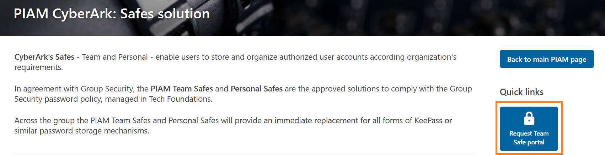

- Click **Go to form**

  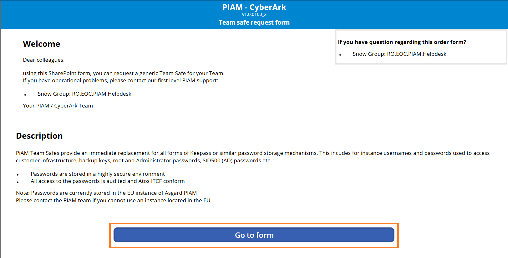

- Select **New team safe**

  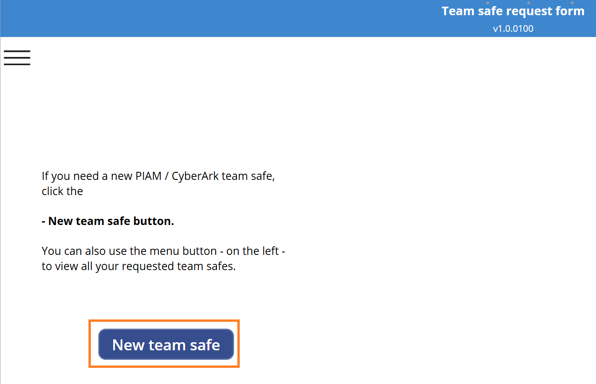

- Complete the request form with the following parameters and click **Save**:

  - **Safe name (naming convention):**  
    `CustomerName_KMS_VCS_<PlatformSiteCode>_Certs`
  - **Safe owner:** Integration Architect (default)
  - **Safe deputy:** Designated deputy for the Integration Architect
  - **Safe location:** Global Vault
  - **Region:** Based on customer location (typically Central Europe)
  - **Safe type:** RO-RW  
    (Owner has read, write, and delete permissions)
  - **Practice:** Other

  > **Note:**  
  > The Safe owner and deputy **MUST be two different persons**.  
  > They are responsible for managing access to the Team Safe.

  

- After saving the Safe details, a **Send** button will appear.  
  Click **Send** to submit the Safe request.

  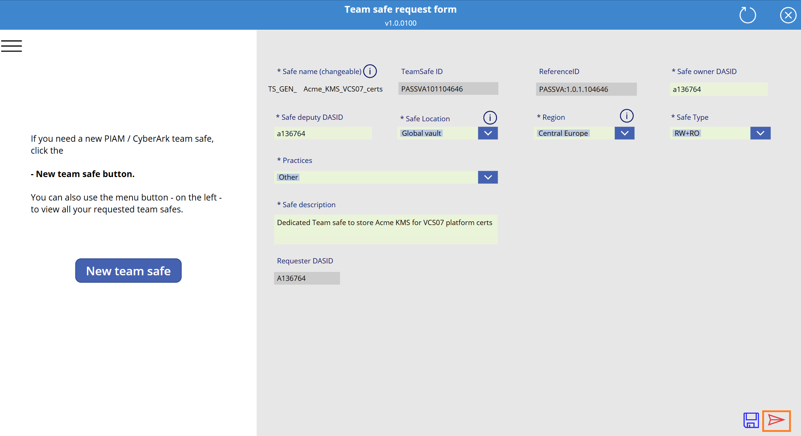

> **Note:**  
> Safe provisioning may take **up to 5 business days**.  
> This **MUST NOT block onboarding**, provided credentials were
> securely delivered in advance. Once the Safe is available, credentials
> MUST be stored accordingly.

---

#### 3. Credential Storage (CyberArk Team Safe)

Customer KMS certificates must be stored as files within a dedicated CyberArk account
created in the previously requested Team Safe.

1. **Log in** to the [CyberArk Portal](https://portal.asgard.saacon.net/)

2. Click **Add Account**

   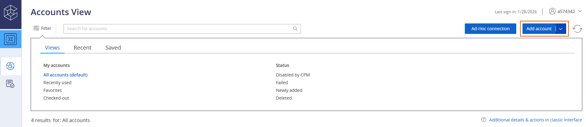

3. Select **System Type**:  
   **Application**

   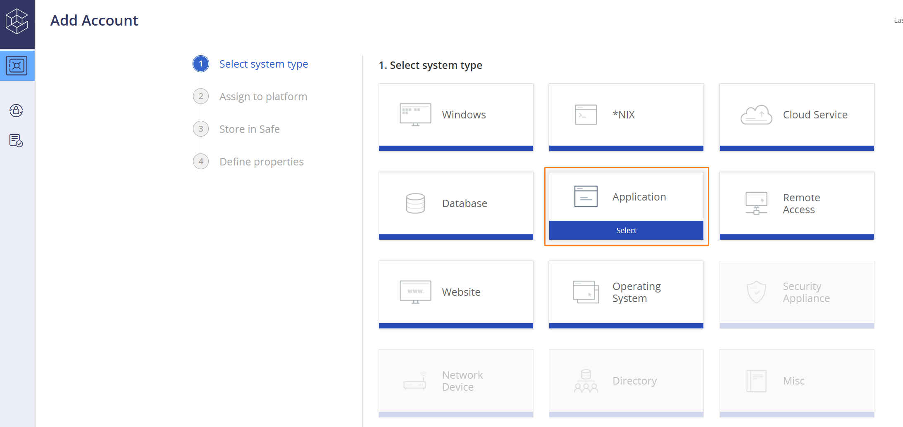

4. Select **Platform**:  
   **Generic TeamSafe Platform**

   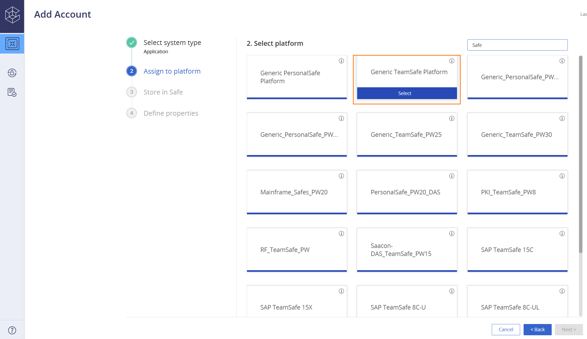

5. Select **Safe**:  
   `TS_GEN_CustomerName_KMS_VCS_<PlatformSiteCode>_Certs`

   > **Note:**  
   > The Safe name **must match** the previously requested and approved Team Safe.

   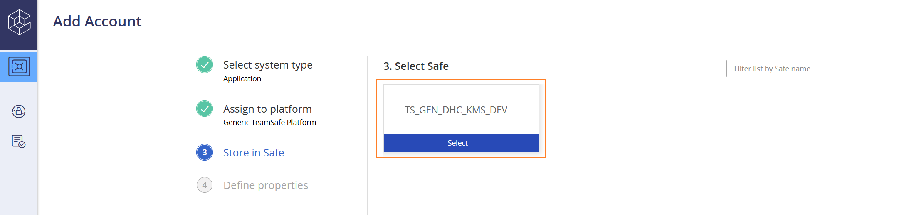

6. Define the required account properties and click **Add**:

   - **Address**
   - **Username**
   - **Password**

   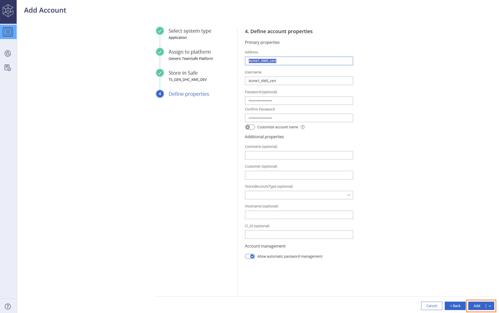

7. After creation, verify that the account is visible under **Accounts View**.

   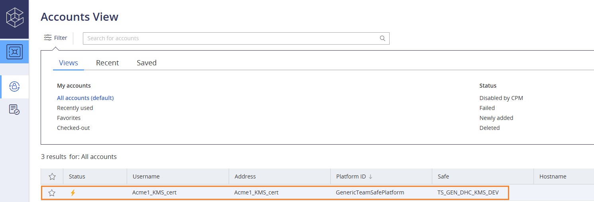

8. From the left-hand navigation pane, select **Files**

   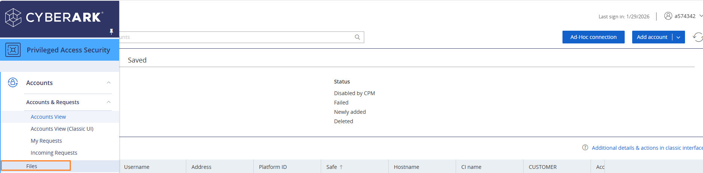

9. Under **My Files**, click **Add File**

   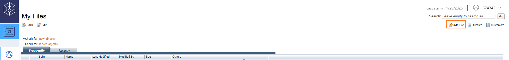

10. Select the appropriate **Team Safe**  
    (the same Team Safe created for the customer KMS credentials)

    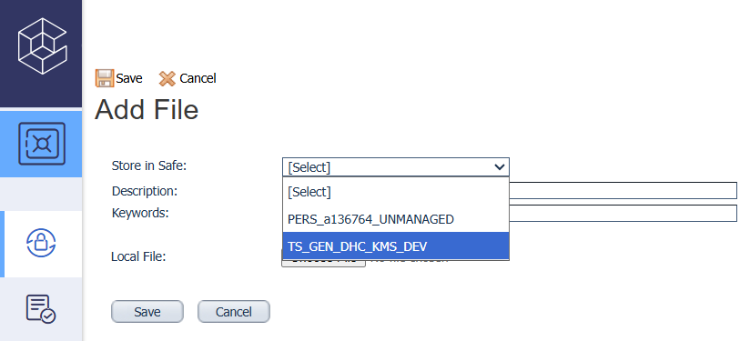

11. Upload the required files and click **Save**:

    - KMS server certificate
    - Corresponding private key

    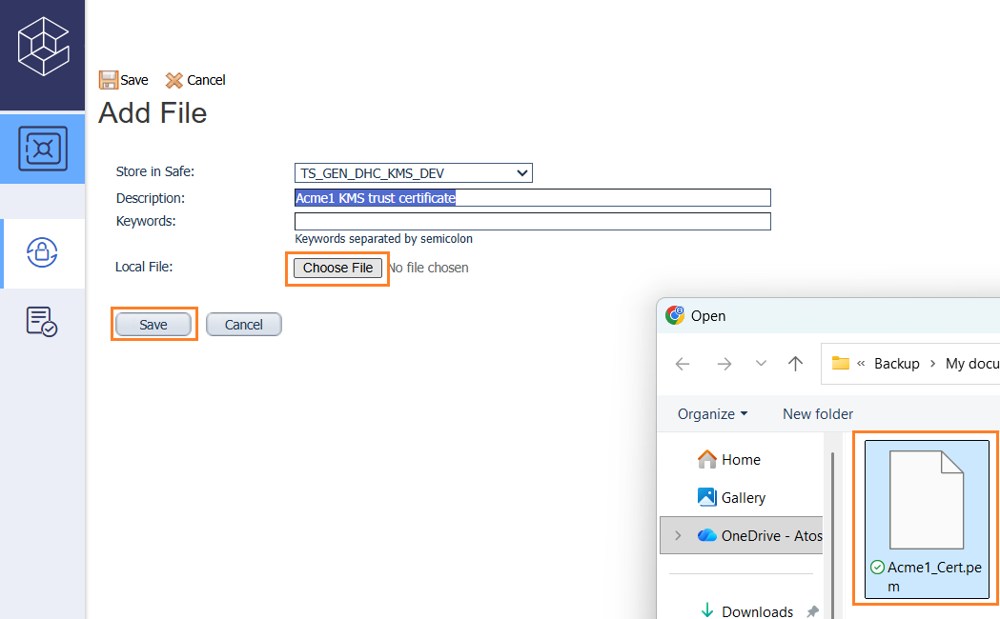

12. Verify that the uploaded files are visible under **My Files**

    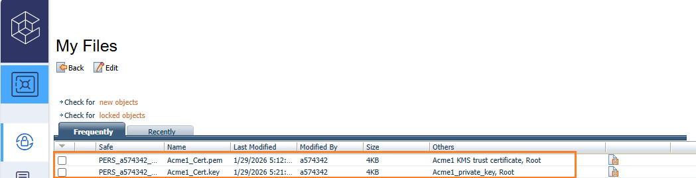

---

### 4. Validation

- Access to the stored credentials is validated by an **authorized administrator**.
- Audit logging is verified to confirm that:
  - Access events are recorded
  - Credential usage is traceable and auditable

## Onboarding Outcome

BYOK onboarding is considered **successfully completed** only when all
mandatory validation items listed below are fulfilled.

| Validation Item | Requirement Level |
|-----------------|-------------------|
| Network traffic implemented (TCP 5696) | Mandatory |
| Customer approved and delivered KMS server details | Mandatory |
| Customer provided KMS certificates and private key | Mandatory |
| KMS certificates validated (RSA, ≥2048-bit) | Mandatory |
| Connectivity between VCS compute vCenter and Customer KMS validated | Mandatory |
| Customer KMS credentials stored in secure CyberArk safe | Optional |

> **Note**: All **mandatory** items must be completed before executing the BYOK Work Instruction

Implementation steps are executed separately using:
[**wiCustomerSelfManagedEncryptionKeys.md**](wiCustomerSelfManagedEncryptionKeys.md)
