# vRA On-Prem Customer VM Onboarding

## Table of Contents

- [vRA On-Prem Customer VM Onboarding](#vra-on-prem-customer-vm-onboarding)
  - [Table of Contents](#table-of-contents)
  - [Changelog](#changelog)
  - [Introduction](#introduction)
    - [Purpose](#purpose)
    - [Audience](#audience)
    - [Scope](#scope)
  - [1.4 Related Documents](#14-related-documents)
  - [1.5 Prerequisites](#15-prerequisites)
    - [1.5.1 Prepare validation config file](#151-prepare-validation-config-file)
    - [1.5.2 Prepare wave sheet](#152-prepare-wave-sheet)
    - [1.5.3 Validate access for vRA on prem account](#153-validate-access-for-vra-on-prem-account)
  - [2 Automated Onboarding](#2-automated-onboarding)
  - [3 Manual Onboarding](#3-manual-onboarding)

## Changelog

| Date       | TOS | Issue     | Author(s)     | Description                  |
|------------|-----|-----------|---------------|------------------------------|
| 2022-10-17 |     |           | Rabiya Shanaz | Initial draft                |
| 2026-02-23 |     | VCS-16881 | Adam Szymczak | Remove vRA Cloud references  |

## Introduction

### Purpose

Prepare and execute vRA on prem Onboarding for non-VCS VMs as part of the Workload Migration service in accordance with Atos Global Delivery standards and portfolio services.

### Audience

- Workload Migration Services Center of Excellence employees

### Scope

The blueprint assumes that the reader has reasonable grasp of VMware cloud technologies, virtualization, hyperconnected infrastructure, VCS as well has familiarity with architecture principles including single and multi-tenancy.

This work instruction is intended to cover below components and domains:

1. Prerequisites to start onboarding process
2. Detailed steps to execute automated onboarding process
3. Detailed steps to execute manual onboarding process
4. Postchecks after onboarding process

This work instruction is not covering:

- VCS platform design
- vRA on prem onboarding architecture

## 1.4 Related Documents

This document is a subset of Atos Technology Lifecycle Management (ATLM) artefacts.

| Document                          | Document Name                                                                                       |
|-----------------------------------|-----------------------------------------------------------------------------------------------------|
| vRA OnPrem LLD: LLD               | [vRA OnPrem LLD](../design/lldVraOnPrem.md)                                                         |

## 1.5 Prerequisites

Following chapter describes mandatory prerequisites steps that needs to be executed before vRA on prem onboarding process starts.
Make sure that migration of Customer Vms has been completed and are available in compute Workload domain vCenter.

**Note:** Every migrated virtual machine needs to be in state powered On under compute vCenter and contains latest VMware tools.

vRA on prem onboarding process relays on validation config file and wave sheet. Both files are stored in the /opt/binaries directory of the Ansible VM ans001. Configuration files will be used in the initial validation steps during vRA on prem onboarding process.

Additionally onboarding process requires that user must be part of platform administrator group with proper role assignments for onboarding process.

### 1.5.1 Prepare validation config file

The validation configuration file **waveSheetValidation.yml** is in YAML format and contains dynamic information specific to the customer and VCS.

The following table shows what is required in the validation configuration file and provides some example content.

|    Field Name     | Example Value                                                                        | Comment                                                                                                                                                         | Where is it validated?                       |
|:-----------------:|--------------------------------------------------------------------------------------|-----------------------------------------------------------------------------------------------------------------------------------------------------------------|----------------------------------------------|
|  operatingSystem  | Microsoft Windows Server 2016 or later (64-bit), Red Hat Enterprise Linux 8 (64-bit) | Lists the approved VCS Operating Systems. Validation will fail if migrated VM OS does not meet requirements. Use the name displayed in vCenter by VMware tools. | During VM validation                         |
|   locationCodes   | mec9                                                                                 | Lists the available deployment endpoints as named in ServiceNOW CMDB                                                                                            | During initial wavesheet validation          |
| powershellVersion | 5.1                                                                                  | Minimum PowerShell version required for Day 2 automation tasks                                                                                                  | During VM validation                         |
|    bashVersion    | 4.2                                                                                  | Minimum Bash version required for Day 2 automation tasks                                                                                                        | During VM validation                         |
|  backupPolicies   | default                                                                              | Lists the relevant Backup policies which are used by the specific customer                                                                                      | During initial wavesheet validation          |
|      tenants      | tenant1, tenant 2                                                                    | Lists the tenants belonging to the customer                                                                                                                     | During initial wavesheet validation          |
|  managementTypes  | atosManaged, customerManaged                                                         | Lists the valid management types for a VM                                                                                                                       | During initial wavesheet validation          |
| vmHardwareVersion | vmx-14                                                                               | vCenter VM Hardware Version                                                                                                                                     | During VM validation                         |
|    casProject     | nx2001                                                                               | Name of the project in CAS to assign all migrated VMs to                                                                                                        | Used as an input for the vRA Onboarding task |
| casOnboardingPlan | OnboardingPlan01                                                                     | Name of the Onboarding Plan in CAS to assign all migrated VMs to                                                                                                | Used as an input for the vRA Onboarding task |

Table 1 Validation Configuration File Entries

Make sure to update file **waveSheetValidation.yml** as below example and save file in the /opt/binaries directory of the Ansible core VM.

Below shows an example of how this will look in YAML format:

```yaml
operatingSystems:
  - Microsoft Windows Server 2016 or later (64-bit)
  - Microsoft Windows Server 2012 (64-bit)
  - Microsoft Windows Server 2008 R2 (64-bit)
  - Microsoft Windows Server 2008 (64-bit)
  - Microsoft Windows Server 2008 (32-bit)
  - Red Hat Enterprise Linux 8 (64-bit)
  - Red Hat Enterprise Linux 7 (64-bit)
  - SUSE Linux Enterprise 15 (64-bit)
  - SUSE Linux Enterprise 12 (64-bit)

locationCodes:
  - mec9
  - mec10

powershellVersion: 5.1
bashVersion: 4.2

backupPolicies:
  - monthly
  - yearly

tenants:
  - tenant1
  - tenant2

managementTypes:
  - atosManaged
  - customerManaged

vmHardwareVersion: 
  - vmx-14
  - vmx-10

casProject:
  name: "prd001"

casOnboardingPlan:
  name: "TestOnboarding001"
```

**Note**: Make sure to correctly fill below inputs  (incorrect inputs will results that validation or onboarding steps fails)

- vmHardwareVersion of SAAS virtual machines and operatingSystems - incorrect inputs will results that validation steps fails,
- casProject,
- operatingSystems

### 1.5.2 Prepare wave sheet

The Wave Sheet (wavesheet.csv) is in CSV format and contains dynamic information specific to each Virtual Machine migrated into VCS.
Once completed with customer input data, it should be stored in the **/opt/binaries** directory of the Ansible core VM.

The following table shows what is required in the Wave Sheet and provides some example content.
Make sure to fill wave sheet mandatory fields, in case missing validation step fails.

|        Field Name        | Example Value                        | Mandatory? | Comment                                                                                                                                                                                                                                          |
|:------------------------:|--------------------------------------|------------|--------------------------------------------------------------------------------------------------------------------------------------------------------------------------------------------------------------------------------------------------|
|    virtualmachinename    | acmevm001                            | Yes        | Exact name of the migrated virtual machine under compute vCenter                                                                                                                                                                                 |
|          tenant          | tenant1                              | Yes        | name of the tenant in vRA on prem                                                                                                                                                                                                                |
|           mfo            | finance                              | No         | MFO relates to tenancy. This should include any special MFO setup for ServiceNOW                                                                                                                                                                 |
|       UHC-SN-OWNER       | a508240                              | Yes        | Owner of the VM in ServiceNOW                                                                                                                                                                                                                    |
|         vmOwner          | a847799                              | Yes        | Deployment owner of the VM in vRA on prem. Must be the part of the project in vRA                                                                                                                                                                |
|      managementType      | atosManaged                          | Yes        | Can be atosManaged or customerManaged. Decides if a Virtual Machine is eligible for day 2 operations                                                                                                                                             |
|     UHC-SN-LOCATION      | mec9                                 | No         | Defines VM location placement for stand alone cluster; defines VM assignment to primary availability zone on stretched cluster                                                                                                                   |
|   UHC-SN-BACKUP_POLICY   | default                              | No         | Name of a valid backup policy. This can be customer specific                                                                                                                                                                                     |
| UHC-SN-DISASTER_RECOVERY | Yes                                  | Yes        | Yes or No answer regarding the DR status of the migrated Virtual Machine                                                                                                                                                                         |
|    UHC-SN-DR_LOCATION    | mec9                                 | No         | Identifier of DR protected migrated Virtual Machine. Only required if drProtection is Yes                                                                                                                                                        |
|    powershellVersion     | 5.1                                  | Yes        | Current version of powershell installed on the migrated Virtual Machine. Required only if machine has Windows OS. If Linux based machine, then it should be tagged as na                                                                         |
|       bashVersion        | 5                                    | Yes        | Current version of bash installed on the migrated Virtual Machine. Required only if machine has Linux based OS. If Windows based machine, then it should be tagged as na                                                                         |
|        clustered         | Yes                                  | Yes        | Yes or No answer regarding the cluster status of the migrated Virtual Machine                                                                                                                                                                    |
|        tshirtSize        | small                                | Yes        | Tshirt Size of migrated Virtual Machine. Should be mapped to Small, Medium or Large as per VCS agreed sizes. If CPU/RAM combination of the migrated Virtual Machine falls outside the VCS parameters, then it should be tagged with unclassified |
|      datastoreName       | gre92-c01-vsan01                     | Yes        | Exact name of the datastore of VM under computer vCenter                                                                                                                                                                                         |
|          image           | atos-sles15                          | Yes        | Name  of the image or oS of VM                                                                                                                                                                                                                   |
|         project          | 17f9890d-ec92-4bad-b509-2626715732a4 | Yes        | Project Id of vRA on prem                                                                                                                                                                                                                        |

Table 1 Wave Sheet Inputs

Make sure to update file **wavesheet.csv** as below example and save file in the /opt/binaries directory of the Ansible core VM.

Below shows an example of how this will look in csv format:

```yaml
virtualmachinename,tenant,mfo,UHC-SN-OWNER,vmOwner,managementType,UHC-SN-LOCATION,UHC-SN-BACKUP_POLICY,UHC-SN-DISASTER_RECOVERY,UHC-SN-DR_LOCATION,powershellVersion,bashVersion,clustered,tshirtSize,datastoreName,image,project
acmevm001,tenant1,no,a508240,firstname.lastname@atos.net,atosManaged,,monthly,yes,mec9,na,5,no,small,gre92-c01-vsan01,atos-win2016,17f9890d-ec92-4bad-b509-2626715732a4
acmevm002,tenant2,yes,a503440,firstname.lastname@atos.net,customerManaged,mec9,,no,,5.1,na,yes,unclassified,gre92-c01-vsan01,atos-rhel7,17f9890d-ec92-4bad-b509-2626715732a4
acmevm003,tenant2,yes,a503440,firstname.lastname@atos.net,atosManaged,,,no,,5.1,na,yes,medium,gre92-c01-vsan01,atos-sles15,17f9890d-ec92-4bad-b509-2626715732a4
```

### 1.5.3 Validate access for vRA on prem account

vRA on prem onboarding automation requires that user must be part of platform administrator group with proper role assignments.

**Note:** For more details on vRA on prem account access refer 3.3.1.2 Configuring RBAC in vRA [vRA OnPrem LLD](https://github.com/GLB-CES-PrivateCloud/DHC-Engineering/blob/master/documentation/lldVraOnPrem.md)

**Note:** Tenant organization owner manages rights under Customer organization and grant access to particular services and assign proper roles.
*cloud assembly administrator, migration assistant administrator roles are mandatory to successfully onboard Customer vms using automation.

As soon you get required role assignments for vRA account proceed with next step.

Step 1. Login into vRA on prem console using new vra account and validate access to cloud services

Open from browser url <https://$vraname.searchdomain> and logon using vRA account credentials.

Next under my services should appear "Cloud Assembly" service, click on service.

Step 3. Under cloud assembly service go to infrastructure tab and verify if Onboarding section is accessible.

Step 4. Verify vRA tenant organization assignment

Inside vRA on prem console on right top corner site (under account name) verify if tenant organization name is same like was provided in request (see below example screen of tenant organization).

**Note:** Account assigned to wrong tenant org. will results that Customer vms will be onboarded under wrong organization or cause failures during onboarding process.

**Note**: We advice You to stay logged in vRA cloud assembly, during automated onboarding process will helps you to track onboarding progress and troubleshoot errors.

## 2 Automated Onboarding

In order to automatically onboard Customer virtual machines inputs data needs to be correctly filled like was described in chapter 1.5.

To begin with onboarding process make sure to logon into Ansible VM and go to location: /opt/dhc/manage/

Execute main playbook to start vRA on prem onboarding steps

`dhc/manage$ ansible-playbook invokeVraOnPremOnboarding.yml -e "username=dasid@domain.next"`

**Note:** Playbook supports following tags to run selected tasks:
  
> - Executes vm validation checks `dhc/manage$ ansible-playbook invokeVraOnPremOnboarding.yml -t validate`
> - Executes vRA on prem onboarding steps `dhc/manage$ ansible-playbook invokeVraOnPremOnboarding.yml -t onboard`
> - During onboard, roles generates the vRA refresh token using Vidm credentials and using refresh token generates the access token in order to perform onboarding tasks in vRA on prem.
> - Executes update owner step `dhc/manage$ ansible-playbook invokeVraOnPremOnboarding.yml -t updateowner`
> - Executes update owner tag step `dhc/manage$ ansible-playbook invokeVraOnPremOnboarding.yml -t updatetag`

During playbook execution following tasks are started in sequence:

1. Prompts for domain account username and credentials
    - 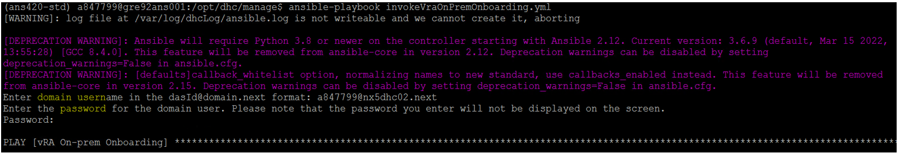
2. Task to validate wave sheet input fields
    - 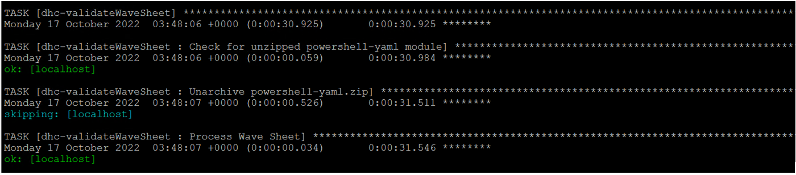
3. Task to validate virtual machines using default criteria described in LLD chapter 4.3.1, generates output report file (vmValidationOutput.csv) in location: /opt/binaries
    - 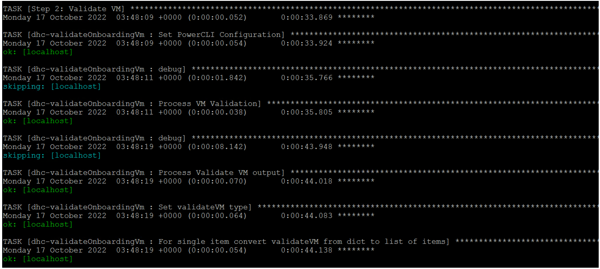
    - **Note**: In case validation failed make sure to verify if affected virtual machine contains latest VMware tools installed or have correct vm hardware version
4. Task to validate config file
    - 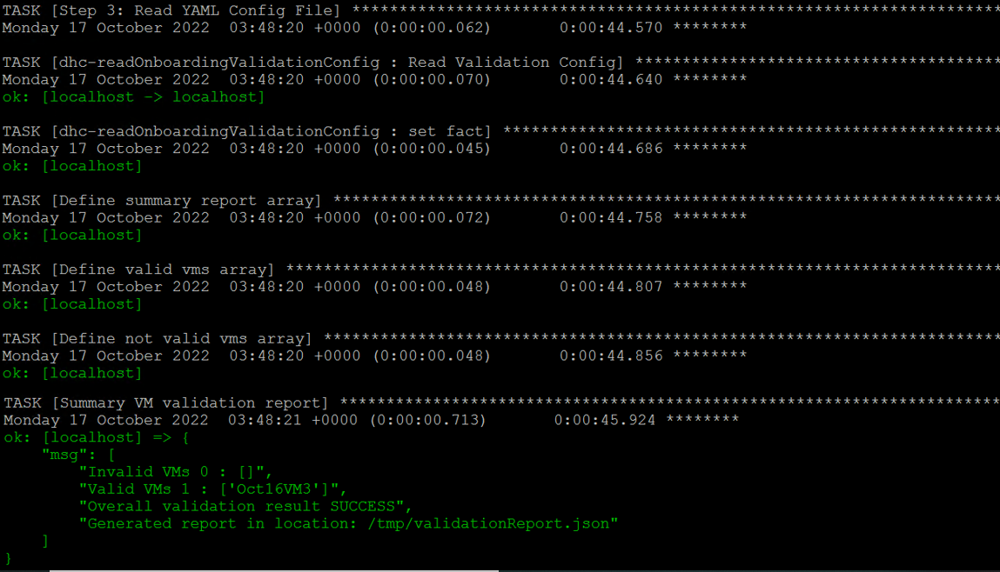
5. Task to prepare migration tags on virtual machine (list of applied tags described in LLD chapter 4.4.1)
    - 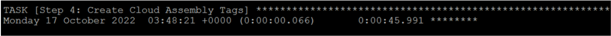
6. Task to assign migration tags on virtual machine under vRA on prem,
    - 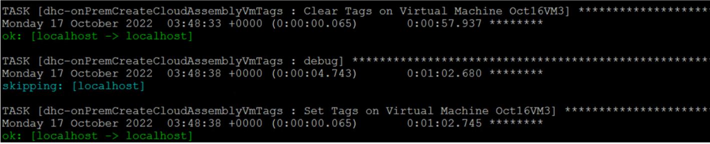
7. Task to create onboarding plan under vRA on prem based on plan name defined inside waveSheetValidation.yml
    - 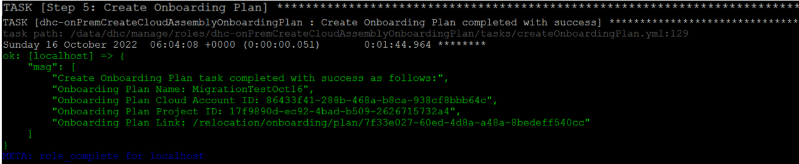
8. Task to add virtual machine to onboarding plan under vRA on prem
    - 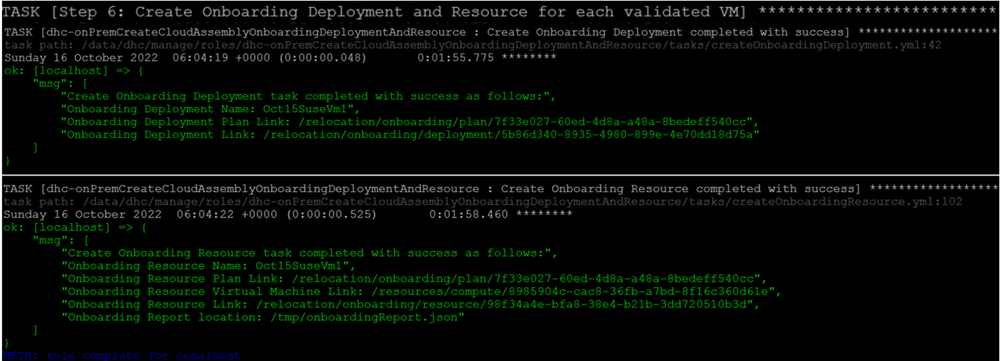
9. Task to run onboarding plan to onboard virtual machines under vRA on prem and create deployment
    - 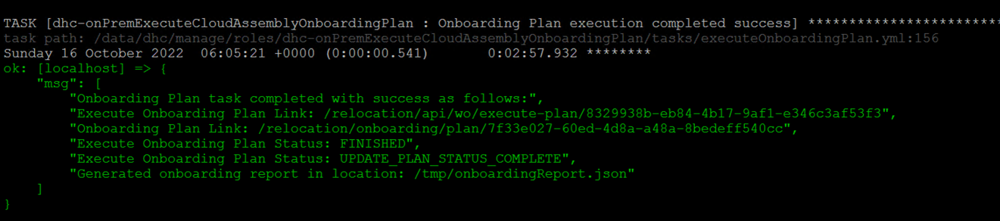
10. Task to update deployment owner
    - 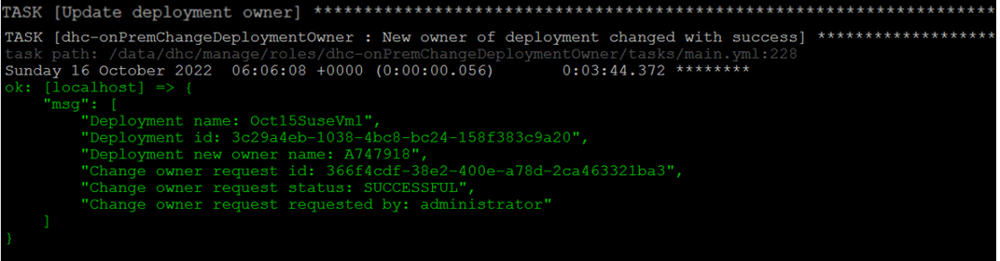
11. Task to generate update owner report
    - 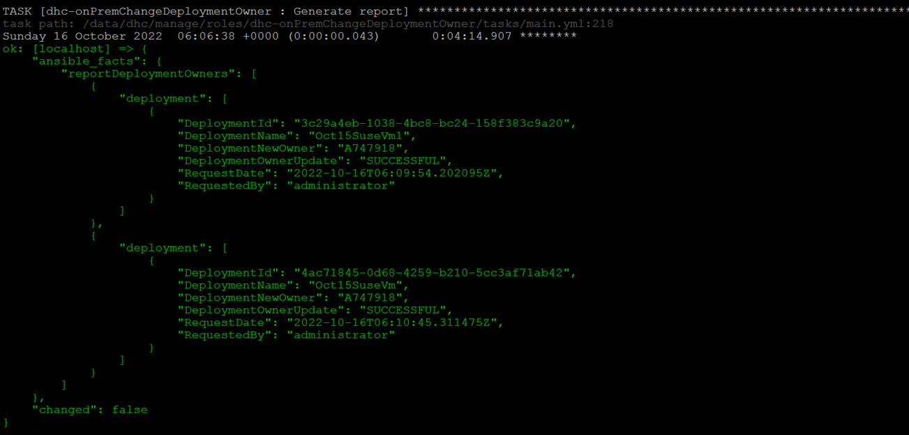
12. Task to update deployment owner Tag
    - 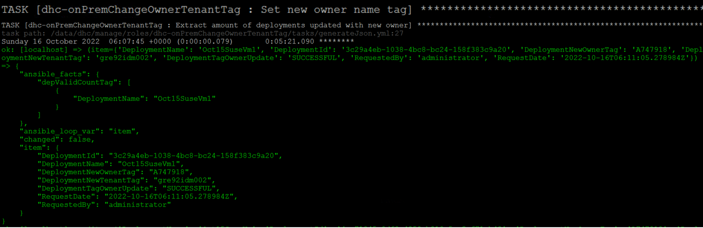
13. Task to generate update owner tag report
    - 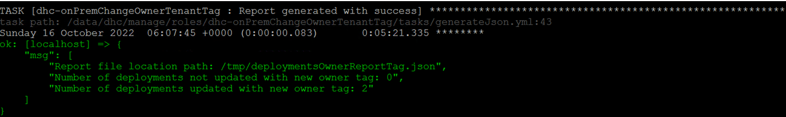
14. Summary report Task
    - 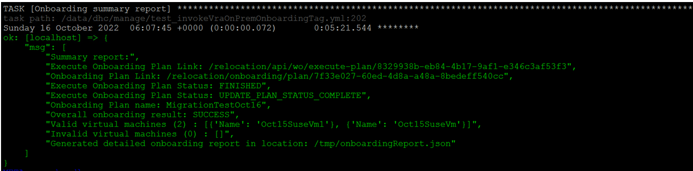
    - 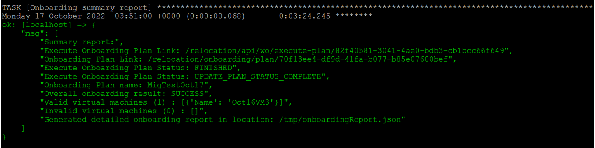

>**DISCLAIMER!** All screenshots are for illustrative purposes only.

## 3 Manual Onboarding

Following chapter describes manual steps to onboard migrated virtual machines into vRA on Prem.
Manual process requires tag assignment , every migrated virtual machine needs to have applied tags before starting manual onboarding steps.

**Note**: Ensure to apply tags on every onboarded virtual machine at compute vCenter level

**Note**: Additionally to start manual process of onboarding virtual machine at vRA on prem level VMware account is required with assigned role to cloud assembly service as "Migration assistant administrator".

Step 1 - Ensure the VM is inside the compute VCS vCenter cluster

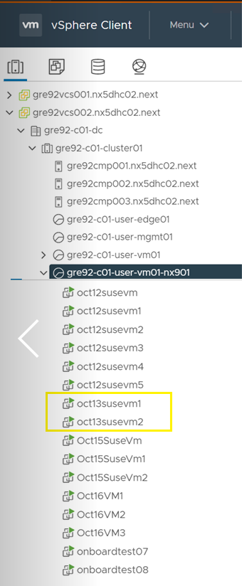

Step 2 - Logon to Cloud Assembly. Click on the infrastructure tab and then scroll to the bottom and select Onboarding

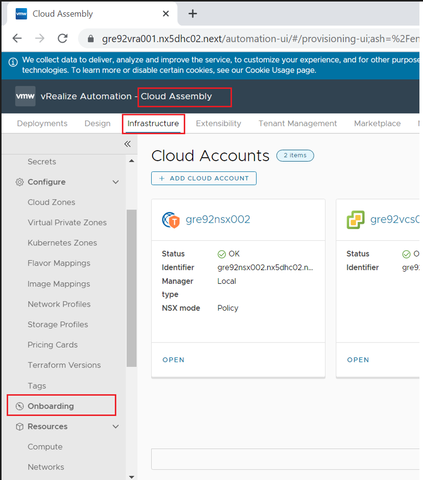

Step 3 - Click on New Onboarding plan

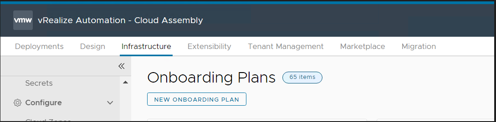

Step 4 - Give the plan a name and select the relevant cloud account and project

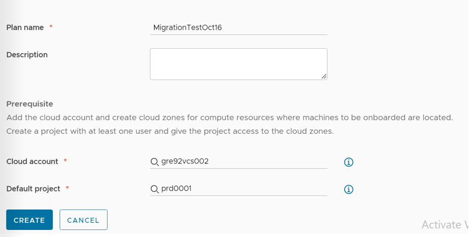

Step 5 - Open the plan and click on the Machines tab and select Add Machines

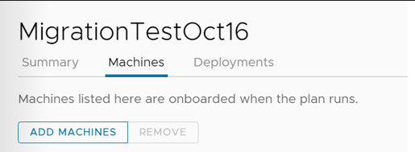

Step 6 - Select the machine you wish to onboard and click OK

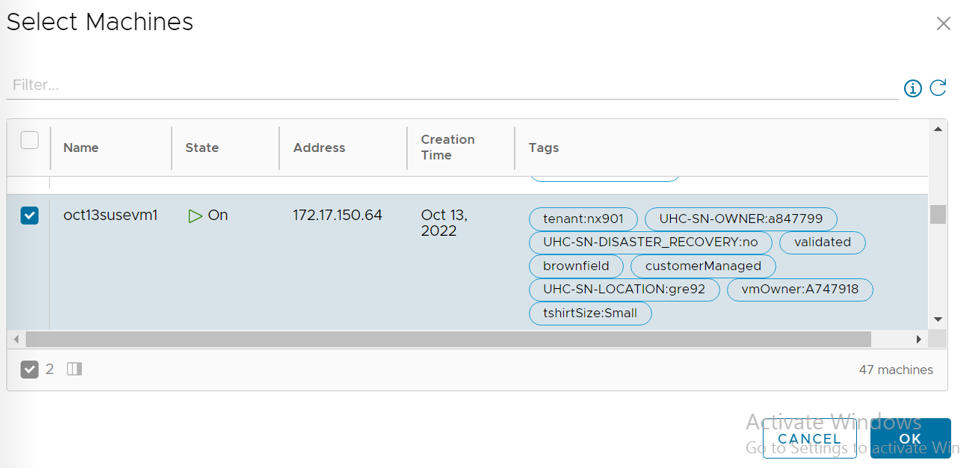

Step 7 - Select Create plan deployment

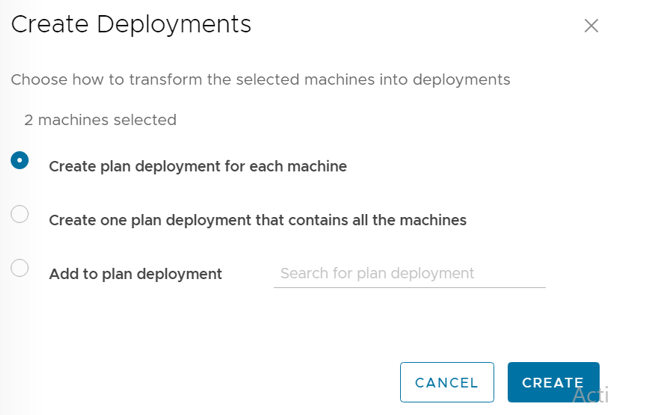

Step 8 - Click on the machines tab and confirm that your VM is visible

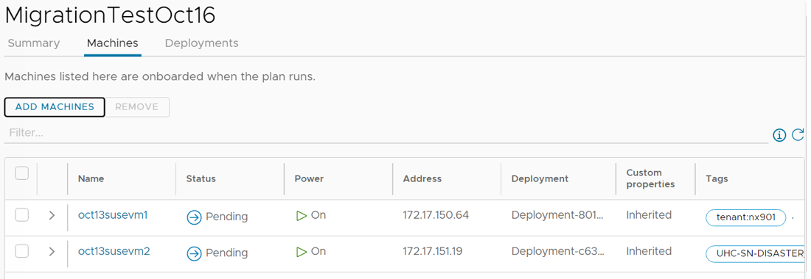
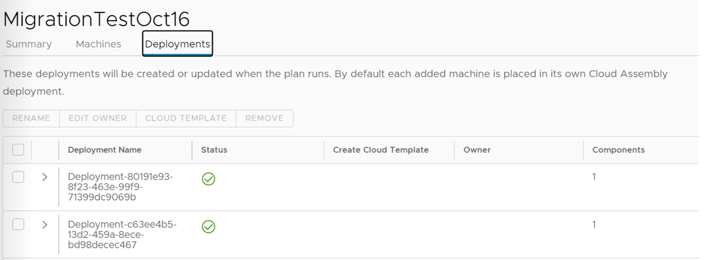

Step 9 - Click on the deployments tab and confirm your deployment is visible

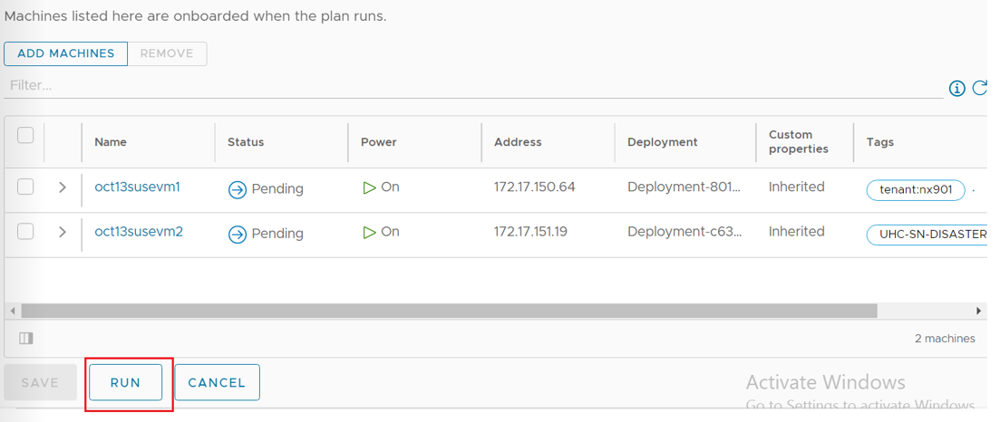

Step 10 - Click on machines and click Run. Confirm when prompted

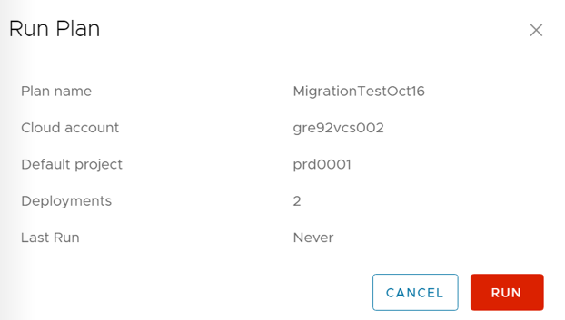

Step 11 - Confirm the VM status has changed to onboarded

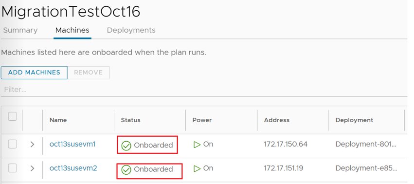

Step 12 - Click on the deployments tab and confirm your deployment is now visible and managed under Cloud Assembly

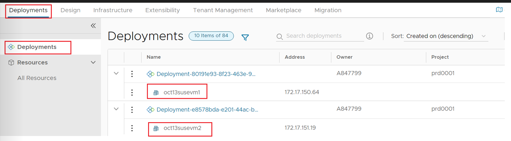
