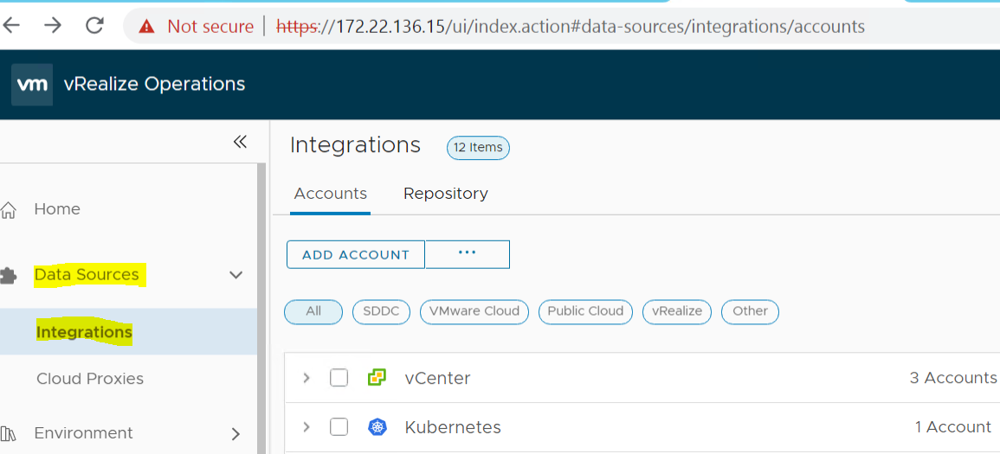
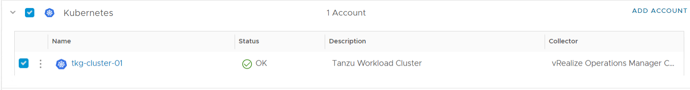
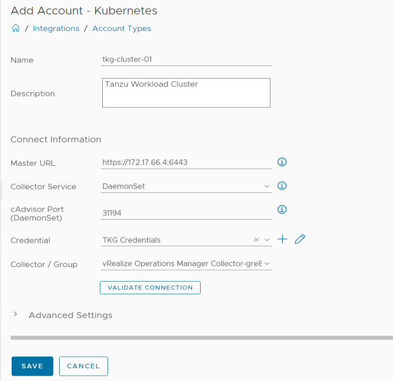
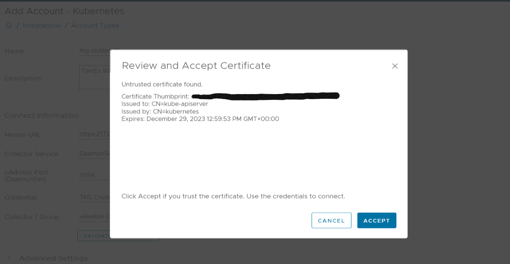
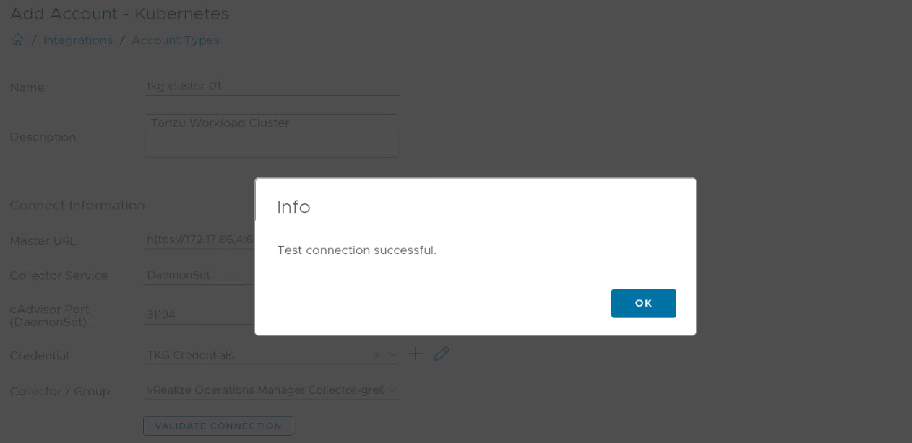

# Validate Connection for Tkg Vrops Adapter

## Table of Contents

- [Validate Connection for Tkg Vrops Adapter](#validate-connection-for-tkg-vrops-adapter)
  - [Table of Contents](#table-of-contents)
  - [Changelog](#changelog)
  - [Introduction](#introduction)
    - [Purpose](#purpose)
    - [Audience](#audience)
  - [Scope](#scope)
  - [Prerequisites](#prerequisites)
  - [Steps for accepting SSL thumbprint for the kubernetes adapter in VROPS for TKG cluster](#steps-for-accepting-ssl-thumbprint-for-the-kubernetes-adapter-in-vrops-for-tkg-cluster)

## Changelog
  
 |    Date    |  TOS   | Issue   | Author | Description |
 |------------|---------|-----------|--------|--------|
 | 02.01.2023 |  VCS 1.7   |   CESDHC-4569     | Rohit Singh | Initial draft creation |

## Introduction

### Purpose

Validate connection of the Kubernetes adapter in VROPS for TKG cluster.

### Audience

- VCS Engineers

## Scope

1. Accept SSL thumbprint on the kubernetes adapter in VROPS for TKG cluster

## Prerequisites

Completed installation and configuration of TKG adapter on VROPS.

## Steps for accepting SSL thumbprint for the kubernetes adapter in VROPS for TKG cluster

- Login on the VROPS using admin credentials
- Select `Data Sources -> Integrations` as shown below:

  

- Expand Kubernetes adapter and click on Tanzu Kubernetes Workload Cluster.

  

- Scroll down and Click in `Validate Connection`.

  

  

- Now click on Accept till we get `Test connection successful`. Click on 'OK' and then Click `Save`

  

After these steps, the SSL thumbprint for all the control plane VMs in the workload cluster will be accepted and start the VM monitoring.  
Once this is done, go back to the SSH session and unpause the task by clicking `Enter` and the TKG adapter will be configured on VROPS.
