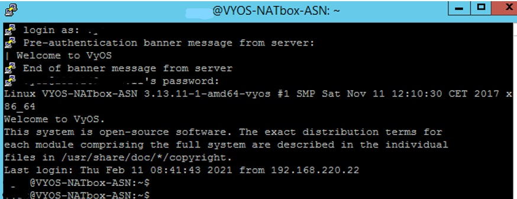
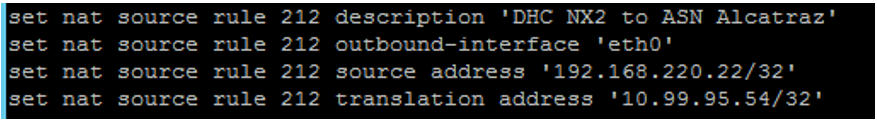
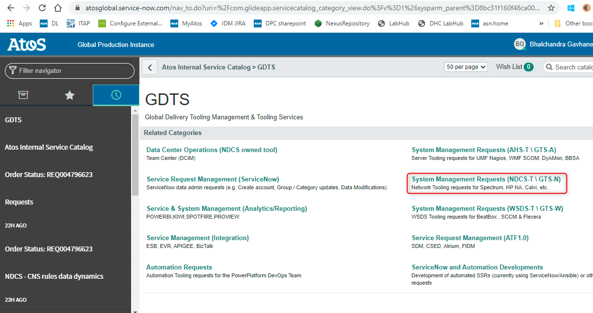
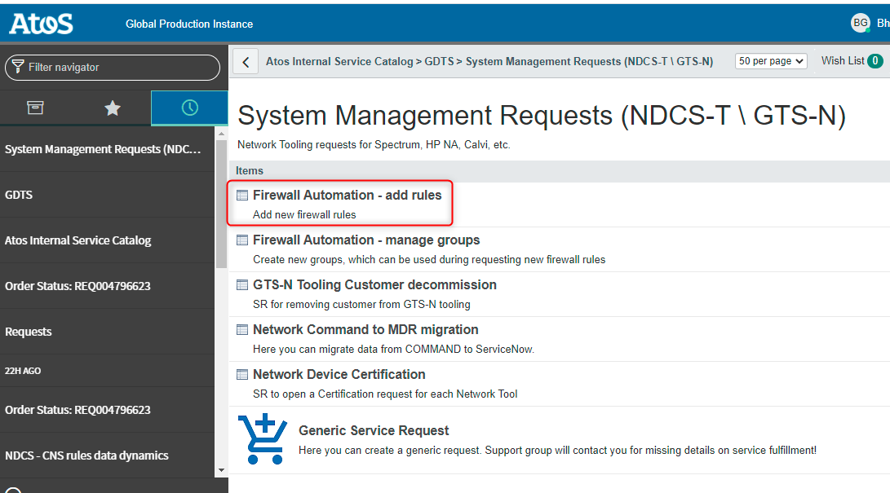
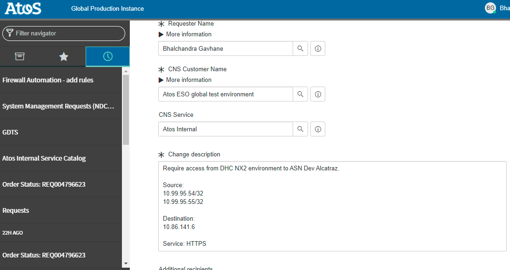
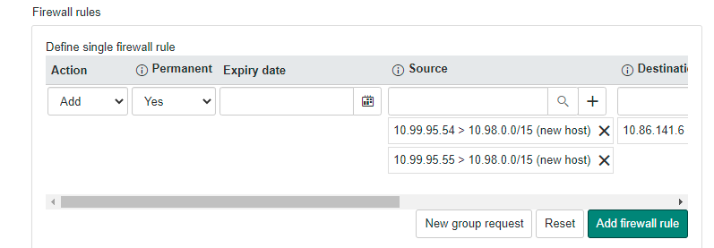
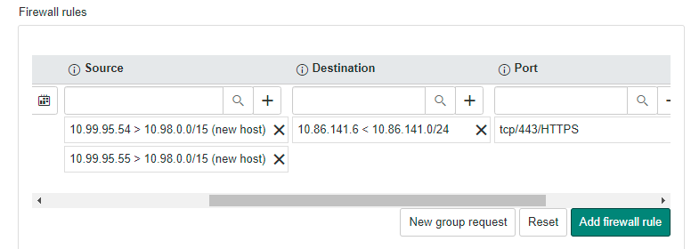
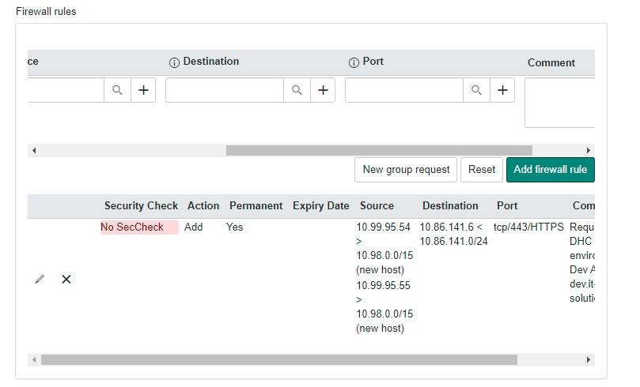
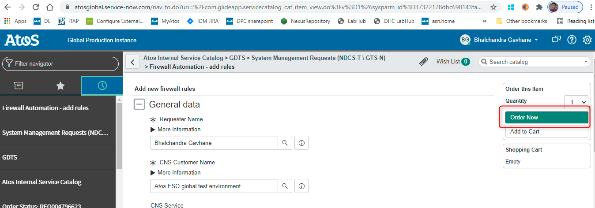

# ASN Requests

# Changelog

| version | Date       | Description                 | Author(s)           |
| ------- | ---------- | --------------------------- | ------------------- |
| 0.1     | 18-02-2021 | Initial Draft               | Bhalchandra Gavhane |
| 0.2     | 15-06-2021 | New process for ASN request | Bhalchandra Gavhane |

## Introduction

Two scenarios are possible depending on the customer setup:

- Customer has an ASN routable IP address
- Customer does not have an ASN routable IP addresses.  

If the customer has an ASN routed IP address, then step 1 (NAT configuration) is not applicable for them.

If the customer does not have an ASN routable IP address, then this whole instruction applies. In that case, the real IP Address of the VCS environment can not communicate with ASN server, thus you need to NAT this real IP address with NAT IP address. NAT IP segment is allowed/routed in ASN network.
Once Natting is done, raise a change request with ASN CCB team to open an access on ASN firewall with specific source and destination IP address.

### Purpose

Connect VCS to ATF servers (ASN Connectivity).

### Audience

- VCS Operations
- VCS Engineers

### Scope

The work instruction is intended to cover below tasks:

1. Natting on NAT router
2. Raising change request with ASN Saacon team

# Pre checks

Following are the prerequisites to establish connectivity with ASN servers:

- Routing should be proper until NAT Router
- NAT IP address availability

# Procedure

Following is the process to access Atos Tooling Framework (ATF) (ASN Servers) from DHC-NX2:

1. Configure NAT on NAT router
2. Raise a change request with ASN CCB team to open an access on ASN firewall.
3. Test the connectivity.

## 1 NAT configuration

| Sub-Step | Action                                                       | Screenshot       |
| -------- | ------------------------------------------------------------ | ------------------------------------------------------------ |
| 1        | Login to NAT Router                                          |  |
| 2        | Configure NAT commands – description, outbound interface, Real IP  Address and translation IP Address. |  |

## 2 Change Request with ASN team

| Sub-Step | Action and Screenshot                                                       |
| -------- | ------------------------------------------------------------ |
| 1        | Login to the SNOW tool - <https://atosglobal.service-now.com/> |
| 2        | Location in ServiceNow - ASN Firewall Request Frontend can be found under below path.  Self Service -> Atos Internal Service Catalog -> GDTS -> System Management  Requests (NDCS-T \ GTS-N)   |
| 3        | Click on Firewall Automation – add rules   Use to add new rules/routing/security zone or remove existing rules/routing/security  zone.  All of fields marked with *are mandatory to submit the request.  a) Requester name – filled automatically as a person who requests the change, can  be changed;  b) CNS Customer Name:  • Please be informed, that customer is selected directly from CNS base, if  some customer is missing must be first added in CNS (by standard  customer registration request - <https://atosglobal.service-now.com/nav_to.do?uri=%2Fchange_request.do%3Fsys_id%3D-1%26sysparm_stack%3Dchange_request_list.do%3Fsysparm_query%3Dactive%3Dtrue%26sysparm_domain%3D39eae2e91b52d810b9bfa9fe6e4bcbc4%26sysparm_query%3Dcompany%3D68ad26a11b92d810b9bfa9fe6e4bcb7c>);  • Customer can be provided for three ways  - The full, correct name must be entered ;  - Customer name can be found using magnifier;  - Customer name can be found by using* and short name of  customer or ID number.  |
| 4        | Firewall Rules:  • Action: add or remove according to the need;  • Permanent – should be marked as ‘yes’ ONLY when requested connection  won’t be used regularly (at least once for three months);  • Expiry date – should be set when requested connection is needed only for  some period of time;  • Source and destination – can be provided manually (matching with dropdown  list) or chosen using magnifier;  - Addresses on list belong only to chosen customer or any Atos Service, like  ASN/ACN/Saacon etc.;  - Single IP/subnet/Customer Group/Service Group can be used.  - When entering the IP, the prompts as below appear. The IP address  should always be chosen from dropdown list and from the smallest  possible subnet. - - After choosing IP or subnet, ‘plus’ button must be clicked, then another IP  can be chosen;   • Port - can be provided manually or chosen using magnifier;  \- Always must be in the format: transport protocol/port number or range of  ports/application protocol, example: tcp/22/ssh or tcp/3200- 3399/SAP gateway - If any port is not on the list, free text can be provided but must have  above mentioned format  - It can also be found by the port number, using *(example: 22)*.  • Comment – information about purpose of connection or chosen ports;      |
| 5        | If any customer/service group is missing when creating the rules, it can be  created as a separate request using ‘New group request’ button below the rule.   |
| 6        | After providing all of information for single rule, use ‘Add firewall rule’ button,  then you can create the next new rule.   |
| 7        | After providing all of mandatory information, request can be ordered using  button on the upper right corner:   |
| 8        | After submitting request in ASN Firewall Request Frontend, proper SSR will be  created in ServiceNow. After initial approval from CCB Team, order in CNS tool  will be created. |

## 3 Test the connectivity

| Sub-Step | Action                                                       | Details                                                   |
| -------- | ------------------------------------------------------------ | ------------------------------------------------------------ |
| 1        | We  will receive a confirmation mail from ASN CCB team once the access is open |                                                              |
| 2        | Check  the access from specified source with telnet command in command prompt. | For example:   telnet 161.89.90.30  443      we will see  the blank command prompt screen, which means that the connection is open. |
| 3        | Check  the application                                       |                                                              |
