# Active Directory Integration

# Changelog

| Date       | Issue | Author         | TOS | Description           |
|------------|-------|----------------|-----|-----------------------|
| 27/12/2021 |       | Łukasz Stasiak |     | Initial draft version |
| 17/02/2021 |       | Łukasz Stasiak |     | Step 1 and 4 updates  |
| 17/03/2021 |       | Łukasz Stasiak |     | Step 2 updates        |

## Introduction

This document is intended for the Customer and VCS build engineers tasked with implementing it. Since each Tenant (Customer) will do the setup against their own IDP and domain steps described in this document need to be executed by the customer engineers. Atos VCS engineers will provide the guidance and final verification from the VCS side.  

### Purpose

Setup AD federation for a VCS tenant.

### Audience

- VCS Engineers
- VCS Operations
- Customer Engineers

### Scope

- Step by Step instructions to setup AD federation for VCS tenant.

# Related Documents

| Document                                                                                                                                                                                             |
|------------------------------------------------------------------------------------------------------------------------------------------------------------------------------------------------------|
| [VMware-Integrating Active Directory with Workspace ONE Access](https://docs.vmware.com/en/VMware-Workspace-ONE-Access/services/ws1_access_directory/GUID-41E281FC-BA6F-4A76-ADAC-7EEEC5A43B12.html) |
| [VMware-Installing the Workspace ONE Access Connector](https://docs.vmware.com/en/VMware-Workspace-ONE-Access/services/ws1_access_connector_install/GUID-271C47F6-856C-40F0-97AB-A8AD95025F9C.html)  |

# Assumptions

There is an assumption that the engineers following this process have an understanding of VMware Workspace ONE Access and vRA Cloud/Cloud Assembly products.
Below WI describes the integration steps base on VMware Workspace ONE Access SaaS version.
As steps 1-3 are done against customer own domain and IDP they need to be executed by Customer assigned engineers. In step 4 once domain will be registered for federated access Atos VCS engineers will do the final verification from the VCS side.
At the end Customer will be responsible for administration and maintenance of VMware Workspace ONE Access tenant and deployed connectors.

# Infrastructure Requirements

Two Windows virtual machine that will be used as connectors.

| Deployment Size | Hardware Requirements             | Directory Sync                       |
|-----------------|-----------------------------------|--------------------------------------|
| Small           | 2 vCPU, 8GB RAM, 40GB Disk Space  | Up to 50,000 users and 500 groups    |
| Medium          | 4 vCPU, 8GB RAM, 40GB Disk Space  | Up to 100,000 users and 1,000 groups |
| Large           | 8 vCPU, 16GB RAM, 40GB Disk Space | Up to 200,000 users and 2,000 groups |

At least two servers are required to implement high availability for Directory Sync service and User Auth service.

# Software Requirements

Installed Windows servers should meets the below software requirements.

| Requirement                                                                  | Notes                                                                                                                     |
|------------------------------------------------------------------------------|---------------------------------------------------------------------------------------------------------------------------|
| Windows Server 2019 or  Windows Server 2016 or  Windows Server 2012 R2 |                                                                                                                           |
| PowerShell                                                                   | Windows servers include PowerShell by default.                                                                            |
| .NET Framework 4.6.2 or later                                                | Windows servers include .NET Framework by default. Workspace ONE Access connector requires .NET Framework 4.6.2 or later. |

The VMware Workspace ONE Access connector version tested was 20.01

# Network Requirements

The table below lists port requirements for the connector.  
For configuring the ports listed below, all traffic is uni-directional (outbound) from the source component to the destination component. An outbound proxy or any other connection management software or hardware must not terminate or reject the outbound connection from the Workspace ONE Access connector. The outbound connection must remain open at all times.

| Source                         | Destination                          | Port                 | Protocol | Notes                                                                                                                                                |
|--------------------------------|--------------------------------------|----------------------|----------|------------------------------------------------------------------------------------------------------------------------------------------------------|
| Workspace ONE Access connector | Workspace ONE Access service (cloud) | 443                  | HTTPS    | Default port; required Applies to Directory Sync service, User Auth service                                                                          |
| Workspace ONE Access connector | Active Directory                     | 389, 636, 3268, 3269 |          | Default ports; these ports are configurable Applies to Directory Sync service. Also applies to User Auth service if password authentication is used. |
| Workspace ONE Access connector | DNS server                           | 53                   | TCP/UDP  | Every connector instance must have access to the DNS server on port 53                                                                               |
| Workspace ONE Access connector | syslog server                        | 514                  | 514      | Optional if Syslog server will be in use. This port is configurable Port for external syslog server.                                                 |

## Step 1

To federate private domain support request with VMware Support needs to be raised by domain owner to begin the process. Following details should be included in the request:

| Number | Description                                                                   |
|--------|-------------------------------------------------------------------------------|
| 1      | Organization ID                                                               |
| 2      | Directory Type (Standard AD/Okta SCIM)                                        |
| 3      | IDP Type (AD Password/Kerberos/ADFS/AAD/Okta IDP/Ping/etc…)                   |
| 4      | Confirmation if the end-customer is an MSP-Tenant or not (Is CPHub involved?) |

In this step as a part of federation setup, a new WS1 Access tenant will be created by VMware.

## Step 2

Next step is Workspace One Connector installation & configuration. Follow the substeps below to install the connector on two prepared Windows VM's. Detailed information for connector installation are covered in below VMware document:
<https://docs.vmware.com/en/VMware-Workspace-ONE-Access/20.10/ws1_access_connector_install_2010/GUID-62084B58-850F-4688-BECF-C8EA594C688D.html>

Installed connector version should be at least 20.10.
Substeps related to WS1 Access instance described below needs to be executed on the WS1 Access tenant created by VMware in step 1 of this work instruction.

| Substep number | Substep description                                                                                                                                                                                                                                                                                                                                                                                                                                         |
|----------------|-------------------------------------------------------------------------------------------------------------------------------------------------------------------------------------------------------------------------------------------------------------------------------------------------------------------------------------------------------------------------------------------------------------------------------------------------------------|
| 1.             | Download the Workspace ONE Access connector installer and a configuration file from the Workspace ONE Access console as described in VMware connector installation document. Generated es-config.json configuration file contains sensitive information such as the tenant URL, tenant ID, the client ID and client secret for each of the enterprise services, and the password hash. It is critical that you do not share the file or expose it publicly. |
| 2.             | Copy the installer and configuration files to the Windows servers on which you want to install the services.                                                                                                                                                                                                                                                                                                                                                |
| 3.             | Double-click the installer file to run the Workspace ONE Access connector installation wizard.                                                                                                                                                                                                                                                                                                                                                              |
| 4.             | Accept the terms of the license agreement and click on Next.  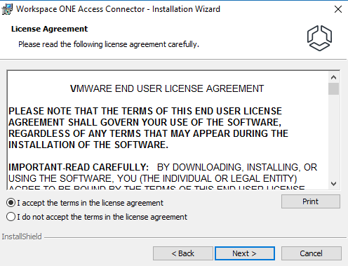                                                                                                                                                                                                                                                                                                                                         |
| 5.             | On he "Select the services you want to install" deselect Kerberos Auth Service.  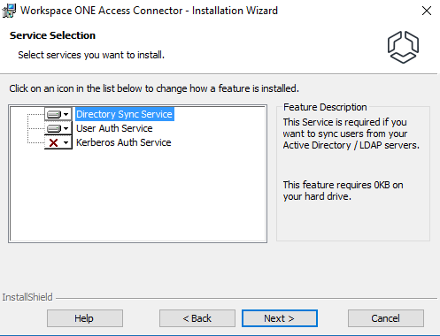                                                                                                                                                                                                                                                                                                                     |
| 6.             | If installation of latest major JRE version will be required, click on Yes to install it.  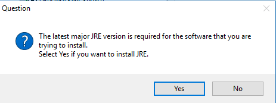                                                                                                                                                                                                                                                                                                                |
| 7.             | Click on Browse to select es-config.json configuration file created in Substep 1. Next enter the password that was set to protect the file in  Substep 1.   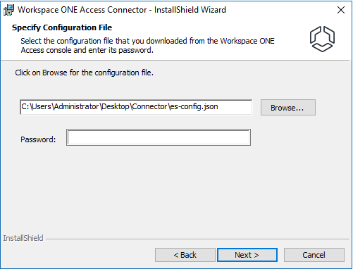                                                                                                                                                                                                                                            |
| 8.             | If the proxy will be used select Custom installation otherwise continue with the Default one.                                                                                                                                                                                                                                                                                                                                                               |
| 9.             | Complete the installation base on selected type as described in VMware connector installation document.                                                                                                                                                                                                                                                                                                                                                     |
| 10.            | After installation finishes successfully, verify that the services are running on the Windows server. Service names: VMware Directory Sync Service, VMware User Auth Service                                                                                                                                                                                                                                                                             |
| 11.            | Proceed with the same steps to install both services on the second Windows VM.                                                                                                                                                                                                                                                                                                                                                                              |
| 12.            | After installation finishes successfully on both connectors go to the Workspace ONE Access console and refresh the Identity & Access Management > Setup > Connectors page to verify that the new connectors are listed, and services appear are in Active state.  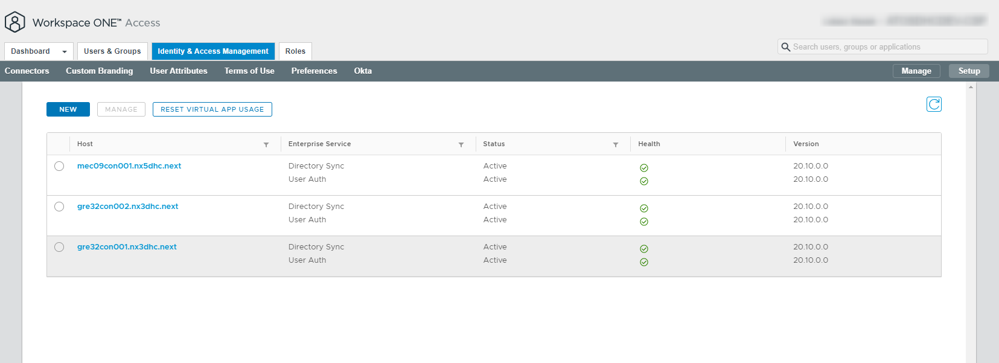                                                                                                                                  |

## Step 3

To sync groups from Active Directory to Workspace ONE Access AD needs to be integrated with WS1 instance.Follow the substeps below to configure Active Directory connection to the Workspace One Access Service.
Detailed informations for configuration of Active Directory connection to the Workspace One Access Service are covered in below VMware document:
<https://docs.vmware.com/en/VMware-Workspace-ONE-Access/20.01/ws1_access_directory/GUID-D1EDAE90-FAC5-45E4-8BA4-41AEC29346D2.html>

| Substep number | Substep description                                                                                                                                                                                                                                                                                                                                                                                                                                                                                                                                                                                                                                                                                                                                                                                                                                                                                                                                                                                                                                                                                                                                                                                                                                                                                                                                                   |
|----------------|-----------------------------------------------------------------------------------------------------------------------------------------------------------------------------------------------------------------------------------------------------------------------------------------------------------------------------------------------------------------------------------------------------------------------------------------------------------------------------------------------------------------------------------------------------------------------------------------------------------------------------------------------------------------------------------------------------------------------------------------------------------------------------------------------------------------------------------------------------------------------------------------------------------------------------------------------------------------------------------------------------------------------------------------------------------------------------------------------------------------------------------------------------------------------------------------------------------------------------------------------------------------------------------------------------------------------------------------------------------------------|
| 1.             | In the Workspace ONE Access console, navigate to **Identity & Access Management > Manage > Directories**.Click Add Directory and select Add Active Directory over LDAP.                                                                                                                                                                                                                                                                                                                                                                                                                                                                                                                                                                                                                                                                                                                                                                                                                                                                                                                                                                                                                                                                                                                                                                                               |
| 2.             | Enter a name for the Workspace ONE Access directory.                                                                                                                                                                                                                                                                                                                                                                                                                                                                                                                                                                                                                                                                                                                                                                                                                                                                                                                                                                                                                                                                                                                                                                                                                                                                                                                  |
| 3.             | Select Active Directory over LDAP as the type of Active Directory you are integrating.                                                                                                                                                                                                                                                                                                                                                                                                                                                                                                                                                                                                                                                                                                                                                                                                                                                                                                                                                                                                                                                                                                                                                                                                                                                                                |
| 4.             | In the Directory Sync and Authentication section, make the following selections:  **Directory Sync Hosts-** Select two Directory Sync service instances installed earlier on Windows connector VM's.  **Authentication-** Select Yes to authenticate users with the User Auth service.  **User Auth Hosts-** Select two Directory Sync service instances installed earlier on Windows connector VM's.  **Directory Search Attribute-** Select sAMAccountName as attribute that contains username.  **External ID-** Select objectGUID as unique identifier.  **Server Location** Leave default selection.  **Encryption-** If your Active Directory requires access over SSL/TLS, select the This Directory requires all connections to use STARTTLS check box in the Certificates section and copy and paste the domain controllers' Intermediate (if used) and Root CA certificates into the SSL Certificate text box.  **Bind User Details-** Enter the following information:  **Base DN-** Enter the DN from which to start account searches. For example, OU=myUnit,DC=myCorp,DC=com.  **Bind User DN-** Enter the account that can search for users. For example, CN=binduser,OU=myUnit,DC=myCorp,DC=com.  **Bind User Password-** The bind user password.  Click **Save & Configure** |
| 5.             | On the **Select the Domains** window make sure that your domain is selected and click on **Next**                                                                                                                                                                                                                                                                                                                                                                                                                                                                                                                                                                                                                                                                                                                                                                                                                                                                                                                                                                                                                                                                                                                                                                                                                                                                     |
| 6.             | In the Map User Attributes page, verify that the Workspace ONE Access directory attribute names are mapped to the correct Active Directory attributes and make changes, if necessary, then click **Next**. By default userName, lastName and firstName are required.                                                                                                                                                                                                                                                                                                                                                                                                                                                                                                                                                                                                                                                                                                                                                                                                                                                                                                                                                                                                                                                                                                  |
| 7.             | Next select the groups you want to sync from Active Directory to the Workspace ONE Access directory.In this step the group names needs to be agreed with the Atos VCS deployment team.To select groups, you need to specify one or more group DNs and select the groups under them.In the Specify the group DNs row, click + and specify the group DN. For example, CN=users,DC=example,DC=company,DC=com.  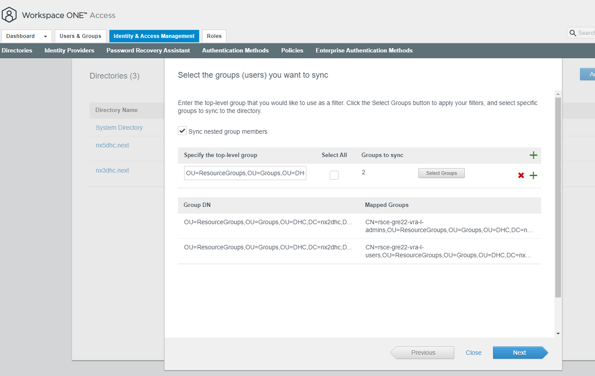                                                                                                                                                                                                                                                                                                                                                                                                                                                                                                                                                                                                                                                                                                                                                                                                                                                                                                  |
| 8.             | On the Select the Users you would like to sync window by default only readonly bind account will be specified as a target for the user sync.Leave the defaults and click on next.                                                                                                                                                                                                                                                                                                                                                                                                                                                                                                                                                                                                                                                                                                                                                                                                                                                                                                                                                                                                                                                                                                                                                                                     |
| 9.             | On the Sync Frequency select Every hour and click on **Sync Directory**. Verify that the last sync was successful.                                                                                                                                                                                                                                                                                                                                                                                                                                                                                                                                                                                                                                                                                                                                                                                                                                                                                                                                                                                                                                                                                                                                                                                                                                                    |
| 10.            | Identity provider named **IDP for directoryname** and a Password (cloud deployment) authentication method is automatically created for the directory. You can view these on the Identity & Access Management > Manage > Identity Providers and Enterprise Authentication Methods pages.                                                                                                                                                                                                                                                                                                                                                                                                                                                                                                                                                                                                                                                                                                                                                                                                                                                                                                                                                                                                                                                                               |
| 11.            | Verify that the High Availability for Directory Sync  service has been correctly configured. Directory Sync verification:  1.Navigate to the **Identity & Access Management > Manage > Directories** page.  2.Click the directory you have created.Next click on **Sync Settings**, then click the **Sync Service** tab.  3.Verify that bot installed connectors are listed in **Sync Services** window as active. If needed update the list and click on Save.  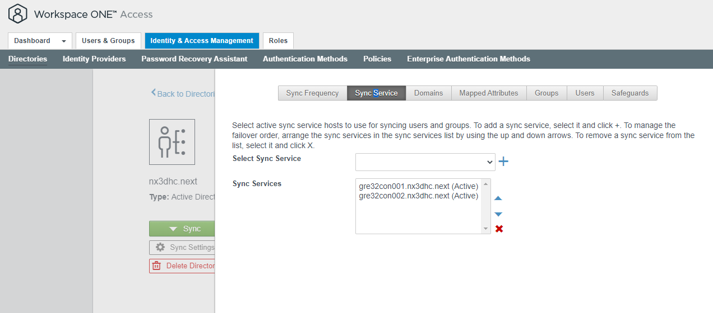                                                                                                                                                                                                                                                                                                                                                                                                                                                                                                                                                                                                                                                                                                                                                                                                                          |
| 12.            | Verify that the High Availability for User Auth service has been correctly configured. User Auth verification:  1.Navigate to the **Identity & Access Management > Manage > Enterprise Authentication Methods** page.  2.Click the directory you have created and click on **Edit**  3.On the Directory and Hosts window make sure that both installed connectors are selected.If needed update the list and save the changes.  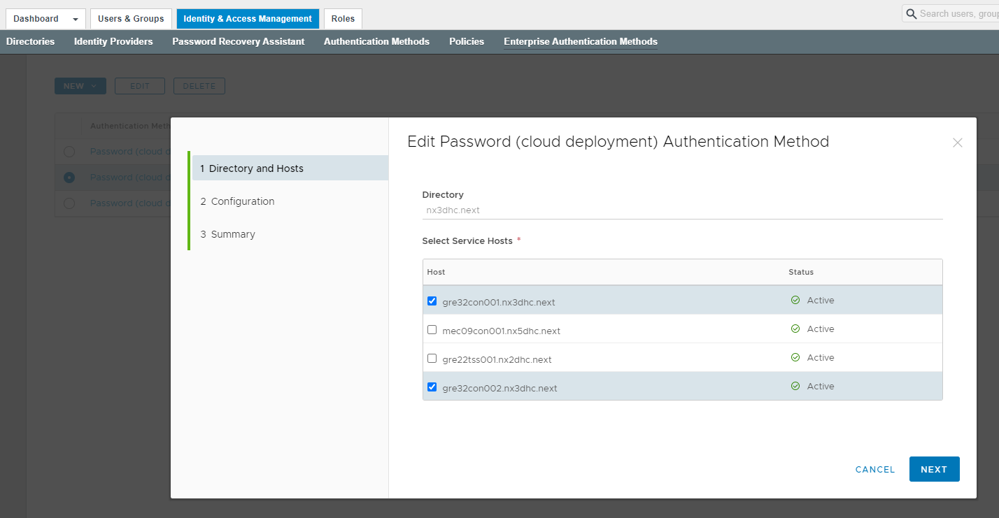                                                                                                                                                                                                                                                                                                                                                                                                                                                                                                                                                                                                                                                                                                                                                                                                                                                           |

## Step 4

As a last step base on SR created in Step 1 ask VMware support to register new domain for federated access. This will allow to discover the federation on CP-HUB level and assign the users and groups based on federated domain accounts.

Once registration will be completed follow the substeps below to verify created AD federation.

| Substep number | Substep description                                                                                                                                                                                                                                                                                                                                                                       |
|----------------|-------------------------------------------------------------------------------------------------------------------------------------------------------------------------------------------------------------------------------------------------------------------------------------------------------------------------------------------------------------------------------------------|
| 1.             | Logon to VMware Cloud Services console and change the organization to Service Provider organization. Next click on **Identity & Access Management**.  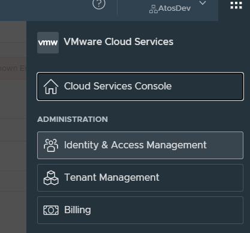                                                                                                                                                                                |
| 2.             | In the VMware Cloud Partner Navigator click on the **Customer Management**. Next locate the customer display name and click on three dots sign. Select **Edit**.  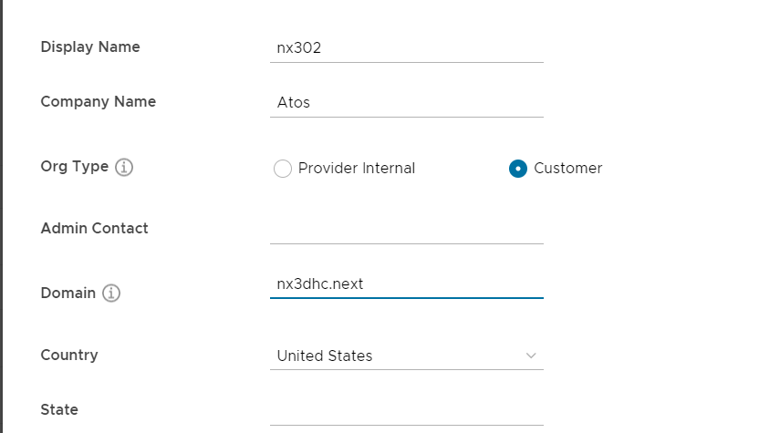   Verify if the domain name is entered correctly. If needed update the domain name and click on **Save**.                                                      |
| 3.             | Again, click on three dots sign and select **Discover Federation**.  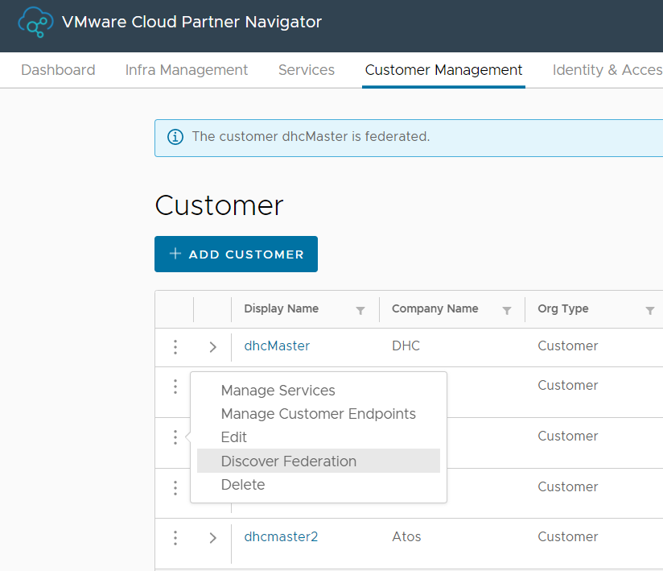  If the AD federation setup has been completed successfully federated domain will be discovered automatically. Information message with the federation confirmation will be displayed on the screen.  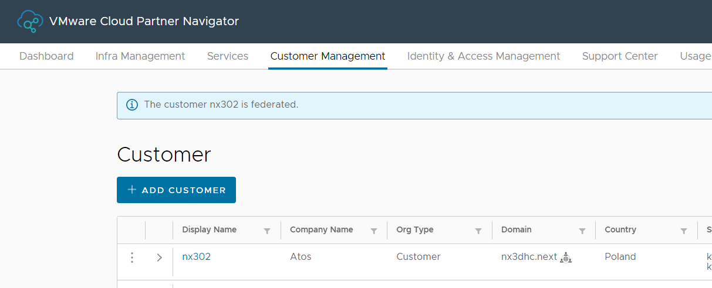 |
